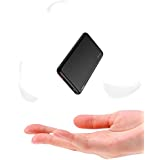

<!DOCTYPE html>
<!-- saved from url=(0051)file:///C:/Users/gilbe/OneDrive/matthew_amazon.html -->
<html lang="en-gb" class="a-audio a-video a-canvas a-svg a-drag-drop a-geolocation a-history a-webworker a-autofocus a-input-placeholder a-textarea-placeholder a-local-storage a-gradients a-transform3d -scrolling a-text-shadow a-text-stroke a-box-shadow a-border-radius a-border-image a-opacity a-transform a-transition a-audio a-video a-canvas a-svg a-drag-drop a-geolocation a-history a-webworker a-autofocus a-input-placeholder a-textarea-placeholder a-local-storage a-gradients a-transform3d -scrolling a-text-shadow a-text-stroke a-box-shadow a-border-radius a-border-image a-opacity a-transform a-transition a-audio a-video a-canvas a-svg a-drag-drop a-geolocation a-history a-webworker a-autofocus a-input-placeholder a-textarea-placeholder a-local-storage a-gradients a-transform3d -scrolling a-text-shadow a-text-stroke a-box-shadow a-border-radius a-border-image a-opacity a-transform a-transition a-js a-audio a-video a-canvas a-svg a-drag-drop a-geolocation a-history a-webworker a-autofocus a-input-placeholder a-textarea-placeholder a-local-storage a-gradients a-transform3d -scrolling a-text-shadow a-text-stroke a-box-shadow a-border-radius a-border-image a-opacity a-transform a-transition a-ember a-ws" data-19ax5a9jf="dingo" data-aui-build-date="3.21.6-2021-07-14"><!-- sp:feature:head-start --><head><meta http-equiv="Content-Type" content="text/html; charset=UTF-8">

<!-- sp:feature:cs-optimization -->
<meta http-equiv="x-dns-prefetch-control" content="on">
<link rel="dns-prefetch" href="https://images-eu.ssl-images-amazon.com/">
<link rel="dns-prefetch" href="https://m.media-amazon.com/">
<link rel="dns-prefetch" href="https://completion.amazon.com/">

<!-- 5nzvap -->

<!-- sp:feature:aui-assets -->
<link rel="stylesheet" href="./matthew_amazon_files/11(1).css">
<link rel="preload" as="script" crossorigin="anonymous" href="./matthew_amazon_files/61XKxrBtDVL.js.download">
<link rel="preload" as="script" crossorigin="anonymous" href="./matthew_amazon_files/11Y.download">
<link rel="preload" as="script" crossorigin="anonymous" href="./matthew_amazon_files/51u.download">

<!-- sp:feature:cookie-consent-assets -->
<!-- sp:feature:nav-inline-css -->
<!-- NAVYAAN CSS -->

<link rel="stylesheet" href="./matthew_amazon_files/41KBYOkT.css">
<!-- sp:feature:host-assets -->

    
    

 
 

 
 

<!-- htmlBeginMarker -->

    

            
        

  

    

        
        
        
        
        
    
        
        
        

    

        
        
        
        
        
        
        
        

        

  
  

  

    

            

            

            

        

            

  

  

        
        
        

  

    

            

            

            

        

            

  

<link rel="stylesheet" href="./matthew_amazon_files/01j2xsQ1.css">
<link rel="stylesheet" href="./matthew_amazon_files/11xqfyHx.css">
<link rel="stylesheet" href="./matthew_amazon_files/61Df6jYL.css">
<link rel="stylesheet" href="./matthew_amazon_files/21ftMOr0.css">
<link rel="stylesheet" href="./matthew_amazon_files/316CfMZ8.css">
<link rel="stylesheet" href="./matthew_amazon_files/21VgVEzl.css">
<link rel="stylesheet" href="./matthew_amazon_files/31LwWY3G.css">

  
<!--&&&Portal&Delimiter&&&--><!-- sp:end-feature:host-assets -->

<!-- sp:feature:head-close -->

<link rel="stylesheet" href="./matthew_amazon_files/beacon._.css"><link rel="stylesheet" href="./matthew_amazon_files/review-l.css"><link rel="stylesheet" href="./matthew_amazon_files/beacon._CB485971591_.css"><link rel="stylesheet" href="./matthew_amazon_files/beacon._CB485971591_(1).css"><link rel="stylesheet" href="./matthew_amazon_files/beacon._CB485971591_(2).css"></head><!-- sp:feature:start-body -->
<body class="a-aui_72554-c a-aui_accordion_a11y_role_354025-c a-aui_btn_preorder_ks_359947-c a-aui_button_aria_label_markup_348458-t1 a-aui_csa_templates_buildin_ww_exp_337518-c a-aui_csa_templates_buildin_ww_launch_337517-c a-aui_csa_templates_declarative_ww_exp_337521-c a-aui_csa_templates_declarative_ww_launch_337520-c a-aui_dynamic_img_a11y_markup_345061-t1 a-aui_launch_cardui_a11y_fix_346896-c a-aui_launch_expander_ally_fix_354901-c a-aui_markup_disabled_link_btn_351411-c a-aui_pci_risk_banner_210084-c a-aui_popover_trigger_add_role_350993-c a-aui_preload_261698-c a-aui_rel_noreferrer_noopener_309527-c a-aui_template_weblab_cache_333406-c a-aui_tnr_v2_180836-c" style="">

<iframe frameborder="0" tabindex="-1" src="javascript:void(false)" style="display:none;position:absolute;z-index:0;filter:Alpha(Opacity=&#39;0&#39;);opacity:0;" src="./matthew_amazon_files/saved_resource.html"></iframe><iframe frameborder="0" tabindex="-1" src="javascript:void(false)" style="display:none;position:absolute;z-index:0;filter:Alpha(Opacity=&#39;0&#39;);opacity:0;" src="./matthew_amazon_files/saved_resource(1).html"></iframe><iframe frameborder="0" tabindex="-1" src="javascript:void(false)" style="display:none;position:absolute;z-index:0;filter:Alpha(Opacity=&#39;0&#39;);opacity:0;" src="./matthew_amazon_files/saved_resource(2).html"></iframe>

<iframe frameborder="0" tabindex="-1" src="javascript:void(false)" style="display:none;position:absolute;z-index:0;filter:Alpha(Opacity=&#39;0&#39;);opacity:0;" src="./matthew_amazon_files/saved_resource(3).html"></iframe><iframe frameborder="0" tabindex="-1" src="javascript:void(false)" style="display:none;position:absolute;z-index:0;filter:Alpha(Opacity=&#39;0&#39;);opacity:0;" src="./matthew_amazon_files/saved_resource(4).html"></iframe><iframe frameborder="0" tabindex="-1" src="javascript:void(false)" style="display:none;position:absolute;z-index:0;filter:Alpha(Opacity=&#39;0&#39;);opacity:0;" src="./matthew_amazon_files/saved_resource(5).html"></iframe>

<iframe frameborder="0" tabindex="-1" src="javascript:void(false)" style="display:none;position:absolute;z-index:0;filter:Alpha(Opacity=&#39;0&#39;);opacity:0;" src="./matthew_amazon_files/saved_resource(6).html"></iframe><iframe frameborder="0" tabindex="-1" src="javascript:void(false)" style="display:none;position:absolute;z-index:0;filter:Alpha(Opacity=&#39;0&#39;);opacity:0;" src="./matthew_amazon_files/saved_resource(7).html"></iframe><iframe frameborder="0" tabindex="-1" src="javascript:void(false)" style="display:none;position:absolute;z-index:0;filter:Alpha(Opacity=&#39;0&#39;);opacity:0;" src="./matthew_amazon_files/saved_resource(8).html"></iframe>
<iframe frameborder="0" tabindex="-1" src="javascript:void(false)" style="display:none;position:absolute;z-index:0;filter:Alpha(Opacity=&#39;0&#39;);opacity:0;" src="./matthew_amazon_files/saved_resource(9).html"></iframe><iframe frameborder="0" tabindex="-1" src="javascript:void(false)" style="display:none;position:absolute;z-index:0;filter:Alpha(Opacity=&#39;0&#39;);opacity:0;" src="./matthew_amazon_files/saved_resource(10).html"></iframe><iframe frameborder="0" tabindex="-1" src="javascript:void(false)" style="display:none;position:absolute;z-index:0;filter:Alpha(Opacity=&#39;0&#39;);opacity:0;" src="./matthew_amazon_files/saved_resource(11).html"></iframe>

<!-- sp:feature:nav-inline-js -->
<!-- NAVYAAN JS -->

<!-- sp:feature:nav-skeleton -->
<!-- sp:feature:navbar -->

<!--Pilu -->

  <!-- NAVYAAN -->

<!-- navmet initial definition -->

  

    
    

  <noscript>
    
 </noscript>

<a id="skiplink" tabindex="0" class="skip-link">Skip to main content</a>

<!-- Navyaan Upnav -->
    

      <!-- unw1 failed -->
      
    

<header id="navbar-main" class="nav-opt-sprite nav-flex nav-locale-gb nav-lang-en nav-ssl nav-rec nav-progressive-attribute">

   
  

    
    

      

        
  

    <a href="https://www.amazon.co.uk/ref=nav_logo" id="nav-logo-sprites" class="nav-logo-link nav-progressive-attribute" aria-label="Amazon.co.uk">
      
      
      .co.uk
    </a>
 

  

  

        

    
        
        
        <input data-addnewaddress="add-new" id="unifiedLocation1ClickAddress" name="dropdown-selection" type="hidden" value="ngnllulspqkq" class="nav-progressive-attribute">
        <input data-addnewaddress="add-new" id="ubbShipTo" name="dropdown-selection-ubb" type="hidden" value="ngnllulspqkq" class="nav-progressive-attribute">
        <input id="glowValidationToken" name="glow-validation-token" type="hidden" value="gHz11OdMR8pSenv8UDy+0fmwAd25yoLWcvLSnHoAAAAMAAAAAGD0euZyYXcAAAAA" class="nav-progressive-attribute">

      

          

            

  

  <form id="nav-search-bar-form" accept-charset="utf-8" action="https://www.amazon.co.uk/s/ref=nb_sb_noss" class="nav-searchbar nav-progressive-attribute" method="GET" name="site-search" role="search" data-dashlane-rid="e08d15b2a21e09ea" data-form-type="">

    

      

        
  

    

      All
      <i class="nav-icon"></i>
    

    Select the department you want to search in
    <select aria-describedby="searchDropdownDescription" class="nav-search-dropdown searchSelect nav-progressive-attrubute nav-progressive-search-dropdown" data-nav-digest="ZwLUKCGtSYwI1w6eoo/ZTJsOBrk=" data-nav-selected="0" id="searchDropdownBox" name="url" style="display: block; top: 2.5px;" tabindex="0" title="Search in">
        <option selected="selected" value="search-alias=aps">All Departments</option>
        <option value="search-alias=alexa-skills">Alexa Skills</option>
        <option value="search-alias=amazon-devices">Amazon Devices</option>
        <option value="search-alias=amazon-global-store">Amazon Global Store</option>
        <option value="search-alias=warehouse-deals">Amazon Warehouse</option>
        <option value="search-alias=mobile-apps">Apps &amp; Games</option>
        <option value="search-alias=audible">Audible Audiobooks</option>
        <option value="search-alias=baby">Baby</option>
        <option value="search-alias=beauty">Beauty</option>
        <option value="search-alias=stripbooks">Books</option>
        <option value="search-alias=automotive">Car &amp; Motorbike</option>
        <option value="search-alias=popular">CDs &amp; Vinyl</option>
        <option value="search-alias=classical">Classical Music</option>
        <option value="search-alias=clothing">Clothing</option>
        <option value="search-alias=computers">Computers &amp; Accessories</option>
        <option value="search-alias=digital-music">Digital Music </option>
        <option value="search-alias=diy">DIY &amp; Tools</option>
        <option value="search-alias=dvd">DVD &amp; Blu-ray</option>
        <option value="search-alias=electronics">Electronics &amp; Photo</option>
        <option value="search-alias=morrisons">Morrisons</option>
        <option value="search-alias=fashion">Fashion</option>
        <option value="search-alias=outdoor">Garden &amp; Outdoors</option>
        <option value="search-alias=gift-cards">Gift Cards</option>
        <option value="search-alias=grocery">Grocery</option>
        <option value="search-alias=handmade">Handmade</option>
        <option value="search-alias=drugstore">Health &amp; Personal Care</option>
        <option value="search-alias=local-services">Home &amp; Business Services</option>
        <option value="search-alias=kitchen">Home &amp; Kitchen</option>
        <option value="search-alias=industrial">Industrial &amp; Scientific</option>
        <option value="search-alias=jewelry">Jewellery</option>
        <option value="search-alias=digital-text">Kindle Store</option>
        <option value="search-alias=appliances">Large Appliances</option>
        <option value="search-alias=lighting">Lighting</option>
        <option value="search-alias=luggage">Luggage</option>
        <option value="search-alias=mi">Musical Instruments &amp; DJ Equipment</option>
        <option value="search-alias=videogames">PC &amp; Video Games</option>
        <option value="search-alias=pets">Pet Supplies</option>
        <option value="search-alias=luxury-beauty">Premium Beauty</option>
        <option value="search-alias=instant-video">Prime Video</option>
        <option value="search-alias=shoes">Shoes &amp; Bags</option>
        <option value="search-alias=software">Software</option>
        <option value="search-alias=sports">Sports &amp; Outdoors</option>
        <option value="search-alias=office-products">Stationery &amp; Office Supplies</option>
        <option value="search-alias=specialty-aps-sns">Subscribe &amp; Save</option>
        <option value="search-alias=toys">Toys &amp; Games</option>
        <option value="search-alias=watches">Watches</option>
    </select>
  

      

    

    

      

        <input type="text" id="twotabsearchtextbox" value="Groom" name="field-keywords" autocomplete="off" placeholder="" class="nav-input nav-progressive-attribute" dir="auto" tabindex="0" aria-label="Search" data-dashlane-rid="b1ea59d3db209783" data-form-type="">
      

      

    

    

      

        
          <input id="nav-search-submit-button" type="submit" class="nav-input nav-progressive-attribute" value="Go" tabindex="0" data-dashlane-rid="d17c863d5843599a" data-form-type="">
        
      

    

  </form>

          

      

          
          

              
              
              
              
  <a href="https://www.amazon.co.uk/gp/customer-preferences/select-language/ref=topnav_lang?preferencesReturnUrl=%2FC%3A%2FUsers%2Fgilbe%2FOneDrive%2Fmatthew_amazon.htmlC%3A%2FUsers%2Fgilbe%2FOneDrive%2Fmatthew_amazon.htmlC%3A%2FUsers%2Fgilbe%2FVideos%2FBABAKA%2520Mini%252010000mAh%2520Power%2520Bank%2520Quick%2520Charge%25203.0%2520Portable%2520Charger%2520PD%252018W%2520Power%2520Delivery%2520USB%2520C%2520External%2520Battery%2520Pack%2520Compatible%2520with%2520iPhone%252012%252011%2520iPad%2520Samsung%2520HUAWEI%2520and%2520Tablets-Black%2520_%2520Amazon.co.uk_%2520Electronics%2520%26%2520Photo.htmlBABAKA-10000mAh-Portable-Compatible-Tablets-Black%2Fdp%2FB08H52V22Y%2Fref%3Dsr_1_2_sspa%3Fdchild%3D1%26keywords%3Dportable%2Bcharger%26qid%3D1626634979%26sr%3D8-2-spons%26psc%3D1%26spLa%3DZW5jcnlwdGVkUXVhbGlmaWVyPUEyUk9EUFYxNlQwRlU1JmVuY3J5cHRlZElkPUEwMTg1NzA5MU5TUDFTM1YyNDk4WCZlbmNyeXB0ZWRBZElkPUEwNzQ4NTk5M0NIMjJUWUtKWDlNMiZ3aWRnZXROYW1lPXNwX2F0ZiZhY3Rpb249Y2xpY2tSZWRpcmVjdCZkb05vdExvZ0NsaWNrPXRydWU%3D" id="icp-nav-flyout" class="nav-a nav-a-2 icp-link-style-2" aria-label="Choose a language for shopping.">
    
      
      
      
        
        
      
    
  </a>

              
  <a href="https://www.amazon.co.uk/gp/css/homepage.html?ref_=nav_youraccount_btn" class="nav-a nav-a-2 nav-truncate   nav-progressive-attribute" data-nav-ref="nav_youraccount_btn" data-nav-role="signin" data-ux-jq-mouseenter="true" id="nav-link-accountList" tabindex="0" data-csa-c-type="link" data-csa-c-slot-id="nav-link-accountList" data-csa-c-content-id="nav_youraccount_btn" data-csa-c-id="j4qbo-clypqj-45qwjq-ituo5c">
  
Hello, Gilbert

  Account &amp; Lists
  
</a>

<a href="https://www.amazon.co.uk/gp/flex/sign-out.html?path=%2Fgp%2Fyourstore%2Fhome&amp;signIn=1&amp;useRedirectOnSuccess=1&amp;action=sign-out&amp;ref_=nav_signout" class="nav-hidden-aria  " tabindex="0">
  Not Gilbert? Sign Out
</a>

              
<a href="https://www.amazon.co.uk/gp/css/order-history?ref_=nav_orders_first" class="nav-a nav-a-2   nav-progressive-attribute" id="nav-orders" tabindex="0">
  Returns
  &amp; Orders
</a>

              
              
  <a href="https://www.amazon.co.uk/gp/cart/view.html?ref_=nav_cart" aria-label="0 items in shopping basket" class="nav-a nav-a-2 nav-progressive-attribute" id="nav-cart">
    

      0
      
    

    

      
         
      
      
        Basket
        
      
    

  </a>

          

          

      

    

Your Lists

<a href="file:///C:/gcx/gift-finder/gfhz/?_encoding=UTF8&amp;ref_=nav_wishlist_gno_list_gf" class="nav-link nav-item">Find a Gift</a> <a href="file:///C:/gp/registry/wishlist?triggerElementID=createList&amp;ref_=nav_ListFlyout_gno_createwl" class="nav-link nav-item">Create a List</a> <a href="file:///C:/gp/registry/search.html?type=wishlist&amp;ref_=nav_ListFlyout_gno_listpop_find" class="nav-link nav-item">Find a List</a> <a href="file:///C:/gp/BIT?bitCampaignCode=a0020&amp;ref_=nav_ListFlyout_bit_v2_a0020" class="nav-link nav-item">Save Items from the Web</a> <a href="file:///C:/gp/wedding/homepage?ref_=nav_ListFlyout_gno_listpop_wr" class="nav-link nav-item">Wedding List</a> <a href="file:///C:/baby-reg/homepage?ref_=nav_ListFlyout_gno_listpop_br" class="nav-link nav-item">Baby Wishlist</a> <a href="file:///C:/kids/?ref_=nav_ListFlyout_gno_listpop_ak" class="nav-link nav-item">Kids' Wish List</a> <a href="file:///C:/discover/?ref_=nav_ListFlyout_sbl" class="nav-link nav-item">Discover Your Style</a> <a href="file:///C:/showroom?ref_=nav_ListFlyout_srm_your_desk_wl_uk" class="nav-link nav-item">Explore Showroom</a>

Your Account
<a href="file:///C:/gp/css/homepage.html?ref_=nav_AccountFlyout_ya" class="nav-link nav-item">Your Account</a> <a id="nav_prefetch_yourorders" href="file:///C:/gp/css/order-history?ref_=nav_AccountFlyout_orders" class="nav-link nav-item">Your Orders</a> <a href="file:///C:/ddb/your-dash-buttons?ref_=nav_youraccount_snk_ddb_ydb_d_nav_ya" class="nav-link nav-item">Your Dash Buttons</a> <a href="file:///C:/gp/registry/wishlist?requiresSignIn=1&amp;ref_=nav_AccountFlyout_wl" class="nav-link nav-item">Your Lists</a> <a href="file:///C:/gp/yourstore?ref_=nav_AccountFlyout_recs" class="nav-link nav-item">Your Recommendations</a> <a href="file:///C:/auto-deliveries?ref_=nav_AccountFlyout_sns" class="nav-link nav-item">Your Subscribe &amp; Save Items</a> <a href="file:///C:/yourpets?ref_=nav_AccountFlyout_ya_pp" class="nav-link nav-item">Your Pets</a> <a href="file:///C:/hz5/yourmembershipsandsubscriptions?ref_=nav_AccountFlyout_digital_subscriptions" class="nav-link nav-item">Memberships &amp; Subscriptions</a> <a href="file:///C:/gp/subs/primeclub/account/homepage.html?ref_=nav_AccountFlyout_prime" class="nav-link nav-item">Your Prime Membership</a> <a href="file:///C:/gp/browse.html?node=14332913031&amp;ref_=nav_AccountFlyout_ukb2b_reg_yaddmlp" class="nav-link nav-item">Register for a Business Account</a> <a href="file:///C:/hz/mycd/myx?ref_=nav_AccountFlyout_myk" class="nav-link nav-item">Manage Your Content and Devices</a> <a href="file:///C:/gp/kindle/ku/ku_central?ref_=nav_AccountFlyout_ku" class="nav-link nav-item">Your Kindle Unlimited</a> <a href="file:///C:/gp/dmusic/player/settings?ref_=nav_AccountFlyout_dm_ymussus_lp" class="nav-link nav-item">Your Music Subscriptions</a> <a href="file:///C:/gp/dmusic/mp3/player?ref_=nav_AccountFlyout_cldplyr" class="nav-link nav-item">Your Music</a> <a href="file:///C:/clouddrive?ref_=nav_AccountFlyout_clddrv" class="nav-link nav-item">Your Amazon Drive</a> <a href="file:///C:/gp/browse.html?node=3280626031&amp;ref_=nav_AccountFlyout_piv" class="nav-link nav-item">Your Prime Video</a> <a href="file:///C:/gp/video/mystuff/watchlist?ref_=nav_AccountFlyout_ywl" class="nav-link nav-item">Your Watchlist</a> <a href="file:///C:/gp/video/mystuff/library?ref_=nav_AccountFlyout_yvl" class="nav-link nav-item">Your Video Purchases &amp; Rentals</a> <a href="file:///C:/gp/swvgdtt/your-account/manage-downloads.html?ref_=nav_AccountFlyout_gsl" class="nav-link nav-item">Your Games and Software Library</a> <a href="file:///C:/gp/mas/your-account/myapps?ref_=nav_AccountFlyout_aad" class="nav-link nav-item">Your Apps &amp; Devices</a>

<a id="nav-item-switch-account" href="https://www.amazon.co.uk/ap/signin?openid.pape.max_auth_age=0&amp;openid.return_to=https%3A%2F%2Fwww.amazon.co.uk%2Fgp%2Fyourstore%2Fhome%2F%3Fie%3DUTF8%26dchild%3D1%26keywords%3Dportable%2520charger%26psc%3D1%26qid%3D1626634979%26spLa%3DZW5jcnlwdGVkUXVhbGlmaWVyPUEyUk9EUFYxNlQwRlU1JmVuY3J5cHRlZElkPUEwMTg1NzA5MU5TUDFTM1YyNDk4WCZlbmNyeXB0ZWRBZElkPUEwNzQ4NTk5M0NIMjJUWUtKWDlNMiZ3aWRnZXROYW1lPXNwX2F0ZiZhY3Rpb249Y2xpY2tSZWRpcmVjdCZkb05vdExvZ0NsaWNrPXRydWU%253D%26sr%3D8-2-spons%26ref_%3Dnav_youraccount_switchacct&amp;openid.identity=http%3A%2F%2Fspecs.openid.net%2Fauth%2F2.0%2Fidentifier_select&amp;openid.assoc_handle=gbflex&amp;openid.mode=checkid_setup&amp;openid.claimed_id=http%3A%2F%2Fspecs.openid.net%2Fauth%2F2.0%2Fidentifier_select&amp;openid.ns=http%3A%2F%2Fspecs.openid.net%2Fauth%2F2.0&amp;switch_account=picker&amp;ignoreAuthState=1&amp;_encoding=UTF8" class="nav-link nav-item">Switch Accounts</a> <a id="nav-item-signout" href="file:///C:/gp/flex/sign-out.html?path=%2Fgp%2Fyourstore%2Fhome&amp;useRedirectOnSuccess=1&amp;signIn=1&amp;action=sign-out&amp;ref_=nav_AccountFlyout_signout" class="nav-link nav-item">Sign Out</a>

Your Lists

<a href="file:///C:/gcx/gift-finder/gfhz/?_encoding=UTF8&amp;ref_=nav_wishlist_gno_list_gf" class="nav-link nav-item">Find a Gift</a> <a href="file:///C:/gp/registry/wishlist?triggerElementID=createList&amp;ref_=nav_ListFlyout_gno_createwl" class="nav-link nav-item">Create a List</a> <a href="file:///C:/gp/registry/search.html?type=wishlist&amp;ref_=nav_ListFlyout_gno_listpop_find" class="nav-link nav-item">Find a List</a> <a href="file:///C:/gp/BIT?bitCampaignCode=a0020&amp;ref_=nav_ListFlyout_bit_v2_a0020" class="nav-link nav-item">Save Items from the Web</a> <a href="file:///C:/gp/wedding/homepage?ref_=nav_ListFlyout_gno_listpop_wr" class="nav-link nav-item">Wedding List</a> <a href="file:///C:/baby-reg/homepage?ref_=nav_ListFlyout_gno_listpop_br" class="nav-link nav-item">Baby Wishlist</a> <a href="file:///C:/kids/?ref_=nav_ListFlyout_gno_listpop_ak" class="nav-link nav-item">Kids' Wish List</a> <a href="file:///C:/discover/?ref_=nav_ListFlyout_sbl" class="nav-link nav-item">Discover Your Style</a> <a href="file:///C:/showroom?ref_=nav_ListFlyout_srm_your_desk_wl_uk" class="nav-link nav-item">Explore Showroom</a>

Your Account
<a href="file:///C:/gp/css/homepage.html?ref_=nav_AccountFlyout_ya" class="nav-link nav-item">Your Account</a> <a id="nav_prefetch_yourorders" href="file:///C:/gp/css/order-history?ref_=nav_AccountFlyout_orders" class="nav-link nav-item">Your Orders</a> <a href="file:///C:/ddb/your-dash-buttons?ref_=nav_youraccount_snk_ddb_ydb_d_nav_ya" class="nav-link nav-item">Your Dash Buttons</a> <a href="file:///C:/gp/registry/wishlist?requiresSignIn=1&amp;ref_=nav_AccountFlyout_wl" class="nav-link nav-item">Your Lists</a> <a href="file:///C:/gp/yourstore?ref_=nav_AccountFlyout_recs" class="nav-link nav-item">Your Recommendations</a> <a href="file:///C:/auto-deliveries?ref_=nav_AccountFlyout_sns" class="nav-link nav-item">Your Subscribe &amp; Save Items</a> <a href="file:///C:/yourpets?ref_=nav_AccountFlyout_ya_pp" class="nav-link nav-item">Your Pets</a> <a href="file:///C:/hz5/yourmembershipsandsubscriptions?ref_=nav_AccountFlyout_digital_subscriptions" class="nav-link nav-item">Memberships &amp; Subscriptions</a> <a href="file:///C:/gp/subs/primeclub/account/homepage.html?ref_=nav_AccountFlyout_prime" class="nav-link nav-item">Your Prime Membership</a> <a href="file:///C:/gp/browse.html?node=14332913031&amp;ref_=nav_AccountFlyout_ukb2b_reg_yaddmlp" class="nav-link nav-item">Register for a Business Account</a> <a href="file:///C:/hz/mycd/myx?ref_=nav_AccountFlyout_myk" class="nav-link nav-item">Manage Your Content and Devices</a> <a href="file:///C:/gp/kindle/ku/ku_central?ref_=nav_AccountFlyout_ku" class="nav-link nav-item">Your Kindle Unlimited</a> <a href="file:///C:/gp/dmusic/player/settings?ref_=nav_AccountFlyout_dm_ymussus_lp" class="nav-link nav-item">Your Music Subscriptions</a> <a href="file:///C:/gp/dmusic/mp3/player?ref_=nav_AccountFlyout_cldplyr" class="nav-link nav-item">Your Music</a> <a href="file:///C:/clouddrive?ref_=nav_AccountFlyout_clddrv" class="nav-link nav-item">Your Amazon Drive</a> <a href="file:///C:/gp/browse.html?node=3280626031&amp;ref_=nav_AccountFlyout_piv" class="nav-link nav-item">Your Prime Video</a> <a href="file:///C:/gp/video/mystuff/watchlist?ref_=nav_AccountFlyout_ywl" class="nav-link nav-item">Your Watchlist</a> <a href="file:///C:/gp/video/mystuff/library?ref_=nav_AccountFlyout_yvl" class="nav-link nav-item">Your Video Purchases &amp; Rentals</a> <a href="file:///C:/gp/swvgdtt/your-account/manage-downloads.html?ref_=nav_AccountFlyout_gsl" class="nav-link nav-item">Your Games and Software Library</a> <a href="file:///C:/gp/mas/your-account/myapps?ref_=nav_AccountFlyout_aad" class="nav-link nav-item">Your Apps &amp; Devices</a>

<a id="nav-item-switch-account" href="https://www.amazon.co.uk/ap/signin?openid.pape.max_auth_age=0&amp;openid.return_to=https%3A%2F%2Fwww.amazon.co.uk%2Fgp%2Fyourstore%2Fhome%2F%3Fie%3DUTF8%26dchild%3D1%26keywords%3Dportable%2520charger%26psc%3D1%26qid%3D1626634979%26spLa%3DZW5jcnlwdGVkUXVhbGlmaWVyPUEyUk9EUFYxNlQwRlU1JmVuY3J5cHRlZElkPUEwMTg1NzA5MU5TUDFTM1YyNDk4WCZlbmNyeXB0ZWRBZElkPUEwNzQ4NTk5M0NIMjJUWUtKWDlNMiZ3aWRnZXROYW1lPXNwX2F0ZiZhY3Rpb249Y2xpY2tSZWRpcmVjdCZkb05vdExvZ0NsaWNrPXRydWU%253D%26sr%3D8-2-spons%26ref_%3Dnav_youraccount_switchacct&amp;openid.identity=http%3A%2F%2Fspecs.openid.net%2Fauth%2F2.0%2Fidentifier_select&amp;openid.assoc_handle=gbflex&amp;openid.mode=checkid_setup&amp;openid.claimed_id=http%3A%2F%2Fspecs.openid.net%2Fauth%2F2.0%2Fidentifier_select&amp;openid.ns=http%3A%2F%2Fspecs.openid.net%2Fauth%2F2.0&amp;switch_account=picker&amp;ignoreAuthState=1&amp;_encoding=UTF8" class="nav-link nav-item">Switch Accounts</a> <a id="nav-item-signout" href="file:///C:/gp/flex/sign-out.html?path=%2Fgp%2Fyourstore%2Fhome&amp;useRedirectOnSuccess=1&amp;signIn=1&amp;action=sign-out&amp;ref_=nav_AccountFlyout_signout" class="nav-link nav-item">Sign Out</a>

Your Lists

<a href="file:///C:/gcx/gift-finder/gfhz/?_encoding=UTF8&amp;ref_=nav_wishlist_gno_list_gf" class="nav-link nav-item">Find a Gift</a> <a href="file:///C:/gp/registry/wishlist?triggerElementID=createList&amp;ref_=nav_ListFlyout_gno_createwl" class="nav-link nav-item">Create a List</a> <a href="file:///C:/gp/registry/search.html?type=wishlist&amp;ref_=nav_ListFlyout_gno_listpop_find" class="nav-link nav-item">Find a List</a> <a href="file:///C:/gp/BIT?bitCampaignCode=a0020&amp;ref_=nav_ListFlyout_bit_v2_a0020" class="nav-link nav-item">Save Items from the Web</a> <a href="file:///C:/gp/wedding/homepage?ref_=nav_ListFlyout_gno_listpop_wr" class="nav-link nav-item">Wedding List</a> <a href="file:///C:/baby-reg/homepage?ref_=nav_ListFlyout_gno_listpop_br" class="nav-link nav-item">Baby Wishlist</a> <a href="file:///C:/kids/?ref_=nav_ListFlyout_gno_listpop_ak" class="nav-link nav-item">Kids' Wish List</a> <a href="file:///C:/discover/?ref_=nav_ListFlyout_sbl" class="nav-link nav-item">Discover Your Style</a> <a href="file:///C:/showroom?ref_=nav_ListFlyout_srm_your_desk_wl_uk" class="nav-link nav-item">Explore Showroom</a>

Your Account
<a href="file:///C:/gp/css/homepage.html?ref_=nav_AccountFlyout_ya" class="nav-link nav-item">Your Account</a> <a id="nav_prefetch_yourorders" href="file:///C:/gp/css/order-history?ref_=nav_AccountFlyout_orders" class="nav-link nav-item">Your Orders</a> <a href="file:///C:/ddb/your-dash-buttons?ref_=nav_youraccount_snk_ddb_ydb_d_nav_ya" class="nav-link nav-item">Your Dash Buttons</a> <a href="file:///C:/gp/registry/wishlist?requiresSignIn=1&amp;ref_=nav_AccountFlyout_wl" class="nav-link nav-item">Your Lists</a> <a href="file:///C:/gp/yourstore?ref_=nav_AccountFlyout_recs" class="nav-link nav-item">Your Recommendations</a> <a href="file:///C:/auto-deliveries?ref_=nav_AccountFlyout_sns" class="nav-link nav-item">Your Subscribe &amp; Save Items</a> <a href="file:///C:/yourpets?ref_=nav_AccountFlyout_ya_pp" class="nav-link nav-item">Your Pets</a> <a href="file:///C:/hz5/yourmembershipsandsubscriptions?ref_=nav_AccountFlyout_digital_subscriptions" class="nav-link nav-item">Memberships &amp; Subscriptions</a> <a href="file:///C:/gp/subs/primeclub/account/homepage.html?ref_=nav_AccountFlyout_prime" class="nav-link nav-item">Your Prime Membership</a> <a href="file:///C:/gp/browse.html?node=14332913031&amp;ref_=nav_AccountFlyout_ukb2b_reg_yaddmlp" class="nav-link nav-item">Register for a Business Account</a> <a href="file:///C:/hz/mycd/myx?ref_=nav_AccountFlyout_myk" class="nav-link nav-item">Manage Your Content and Devices</a> <a href="file:///C:/gp/kindle/ku/ku_central?ref_=nav_AccountFlyout_ku" class="nav-link nav-item">Your Kindle Unlimited</a> <a href="file:///C:/gp/dmusic/player/settings?ref_=nav_AccountFlyout_dm_ymussus_lp" class="nav-link nav-item">Your Music Subscriptions</a> <a href="file:///C:/gp/dmusic/mp3/player?ref_=nav_AccountFlyout_cldplyr" class="nav-link nav-item">Your Music</a> <a href="file:///C:/clouddrive?ref_=nav_AccountFlyout_clddrv" class="nav-link nav-item">Your Amazon Drive</a> <a href="file:///C:/gp/browse.html?node=3280626031&amp;ref_=nav_AccountFlyout_piv" class="nav-link nav-item">Your Prime Video</a> <a href="file:///C:/gp/video/mystuff/watchlist?ref_=nav_AccountFlyout_ywl" class="nav-link nav-item">Your Watchlist</a> <a href="file:///C:/gp/video/mystuff/library?ref_=nav_AccountFlyout_yvl" class="nav-link nav-item">Your Video Purchases &amp; Rentals</a> <a href="file:///C:/gp/swvgdtt/your-account/manage-downloads.html?ref_=nav_AccountFlyout_gsl" class="nav-link nav-item">Your Games and Software Library</a> <a href="file:///C:/gp/mas/your-account/myapps?ref_=nav_AccountFlyout_aad" class="nav-link nav-item">Your Apps &amp; Devices</a>

<a id="nav-item-switch-account" href="https://www.amazon.co.uk/ap/signin?openid.pape.max_auth_age=0&amp;openid.return_to=https%3A%2F%2Fwww.amazon.co.uk%2Fgp%2Fyourstore%2Fhome%2F%3Fie%3DUTF8%26dchild%3D1%26keywords%3Dportable%2520charger%26psc%3D1%26qid%3D1626634979%26spLa%3DZW5jcnlwdGVkUXVhbGlmaWVyPUEyUk9EUFYxNlQwRlU1JmVuY3J5cHRlZElkPUEwMTg1NzA5MU5TUDFTM1YyNDk4WCZlbmNyeXB0ZWRBZElkPUEwNzQ4NTk5M0NIMjJUWUtKWDlNMiZ3aWRnZXROYW1lPXNwX2F0ZiZhY3Rpb249Y2xpY2tSZWRpcmVjdCZkb05vdExvZ0NsaWNrPXRydWU%253D%26sr%3D8-2-spons%26ref_%3Dnav_youraccount_switchacct&amp;openid.identity=http%3A%2F%2Fspecs.openid.net%2Fauth%2F2.0%2Fidentifier_select&amp;openid.assoc_handle=gbflex&amp;openid.mode=checkid_setup&amp;openid.claimed_id=http%3A%2F%2Fspecs.openid.net%2Fauth%2F2.0%2Fidentifier_select&amp;openid.ns=http%3A%2F%2Fspecs.openid.net%2Fauth%2F2.0&amp;switch_account=picker&amp;ignoreAuthState=1&amp;_encoding=UTF8" class="nav-link nav-item">Switch Accounts</a> <a id="nav-item-signout" href="file:///C:/gp/flex/sign-out.html?path=%2Fgp%2Fyourstore%2Fhome&amp;useRedirectOnSuccess=1&amp;signIn=1&amp;action=sign-out&amp;ref_=nav_AccountFlyout_signout" class="nav-link nav-item">Sign Out</a>

<h2 class="pet_your_prime_header">We've helped UK sellers create 175,000 jobs to date</h2><h3 class="pet_your_prime_subheader">Find out more on our blog</h3>
<a title="We&#39;ve helped UK sellers create 175,000 jobs to date" href="https://www.amazon.co.uk/gp/redirect.html?pf_rd_p=0aa41781-6715-4b93-b59b-35b61109c81b&amp;_encoding=UTF8&amp;pf_rd_r=7PR88ZK38ET09871ADJX&amp;location=https%3A%2F%2Fblog.aboutamazon.co.uk%2Fsupporting-small-businesses%2Fsupporting-smes-in-the-uk-2021-amazon-sme-impact-report%3Futm_content%3Dbtjuly%26utm_medium%3Dh1%26utm_source%3Dgateway&amp;source=standards&amp;token=8D7211739B88F5942FB3B48881CDD6FC50731CC7&amp;ms3_c=a57457bba447a0408f02b2a989e9464c"></a>

<a href="https://www.amazon.co.uk/prime/ref=pet_yr_prime_static_footer?ms3_c=a57457bba447a0408f02b2a989e9464c" title="Explore Your Prime Benefits">
          Explore Your Prime Benefits
        </a>

Your Lists

                                                      Alexa List                                                  
                             <a href="https://www.amazon.co.uk/alexaquantum/sp/alexaShoppingList?ref=nav_asl" class="nav-link                                    nav-item">                          Alexa Shopping List                    0 items                    </a>                     
      

                                                      Your Wish Lists                                                  
                             <a href="https://www.amazon.co.uk/hz/wishlist/ls/S42DGL2YBJ58/ref=nav_wishlist_lists_1?_encoding=UTF8&amp;type=wishlist" class="nav-link                                    nav-item">                          Wish List                          </a>                                              <a href="https://www.amazon.co.uk/hz/wishlist/ls/2BFV9NGCO1GGS/ref=nav_wishlist_lists_2?_encoding=UTF8&amp;type=wishlist" class="nav-link                                    nav-item">                          Adam                          </a>                                              <a href="https://www.amazon.co.uk/hz/wishlist/ls/1IY39FDJ4CYGQ/ref=nav_wishlist_lists_3?_encoding=UTF8&amp;type=wishlist" class="nav-link                                    nav-item">                          Luke                          </a>                                              <a href="https://www.amazon.co.uk/hz/wishlist/ls/1XX8H6SUH31QD/ref=nav_wishlist_lists_4?_encoding=UTF8&amp;type=wishlist" class="nav-link                                    nav-item">                          Olvia                           </a>                                              <a href="https://www.amazon.co.uk/hz/wishlist/ls/GJ9N1W6RX5GA/ref=nav_wishlist_lists_5?_encoding=UTF8&amp;type=wishlist" class="nav-link                                    nav-item">                          Adam &amp; Lucy                          </a>                                              <a href="https://www.amazon.co.uk/hz/wishlist/ls?_encoding=UTF8&amp;ref_=nav_wishlist_lists_seemore" class="nav-link                                    nav-item">                          See more                          </a>                     
      
<a href="https://www.amazon.co.uk/gcx/gift-finder/gfhz/?_encoding=UTF8&amp;ref_=nav_wishlist_gno_list_gf" class="nav-link nav-item">Find a Gift</a> <a href="https://www.amazon.co.uk/gp/registry/wishlist?triggerElementID=createList&amp;ref_=nav_ListFlyout_gno_createwl" class="nav-link nav-item">Create a List</a> <a href="https://www.amazon.co.uk/gp/registry/search.html?type=wishlist&amp;ref_=nav_ListFlyout_gno_listpop_find" class="nav-link nav-item">Find a List</a> <a href="https://www.amazon.co.uk/gp/BIT?bitCampaignCode=a0020&amp;ref_=nav_ListFlyout_bit_v2_a0020" class="nav-link nav-item">Save Items from the Web</a> <a href="https://www.amazon.co.uk/gp/wedding/homepage?ref_=nav_ListFlyout_gno_listpop_wr" class="nav-link nav-item">Wedding List</a> <a href="https://www.amazon.co.uk/baby-reg/homepage?ref_=nav_ListFlyout_gno_listpop_br" class="nav-link nav-item">Baby Wishlist</a> <a href="https://www.amazon.co.uk/kids/?ref_=nav_ListFlyout_gno_listpop_ak" class="nav-link nav-item">Kids' Wish List</a> <a href="https://www.amazon.co.uk/discover/?ref_=nav_ListFlyout_sbl" class="nav-link nav-item">Discover Your Style</a> <a href="https://www.amazon.co.uk/showroom?ref_=nav_ListFlyout_srm_your_desk_wl_uk" class="nav-link nav-item">Explore Showroom</a>

Your Account
<a href="https://www.amazon.co.uk/gp/css/homepage.html?ref_=nav_AccountFlyout_ya" class="nav-link nav-item">Your Account</a> <a id="nav_prefetch_yourorders" href="https://www.amazon.co.uk/gp/css/order-history?ref_=nav_AccountFlyout_orders" class="nav-link nav-item">Your Orders</a> <a href="https://www.amazon.co.uk/ddb/your-dash-buttons?ref_=nav_youraccount_snk_ddb_ydb_d_nav_ya" class="nav-link nav-item">Your Dash Buttons</a> <a href="https://www.amazon.co.uk/gp/registry/wishlist?requiresSignIn=1&amp;ref_=nav_AccountFlyout_wl" class="nav-link nav-item">Your Lists</a> <a href="https://www.amazon.co.uk/gp/yourstore?ref_=nav_AccountFlyout_recs" class="nav-link nav-item">Your Recommendations</a> <a href="https://www.amazon.co.uk/auto-deliveries?ref_=nav_AccountFlyout_sns" class="nav-link nav-item">Your Subscribe &amp; Save Items</a> <a href="https://www.amazon.co.uk/yourpets?ref_=nav_AccountFlyout_ya_pp" class="nav-link nav-item">Your Pets</a> <a href="https://www.amazon.co.uk/hz5/yourmembershipsandsubscriptions?ref_=nav_AccountFlyout_digital_subscriptions" class="nav-link nav-item">Memberships &amp; Subscriptions</a> <a href="https://www.amazon.co.uk/gp/subs/primeclub/account/homepage.html?ref_=nav_AccountFlyout_prime" class="nav-link nav-item">Your Prime Membership</a> <a href="https://www.amazon.co.uk/gp/browse.html?node=14332913031&amp;ref_=nav_AccountFlyout_ukb2b_reg_yaddmlp" class="nav-link nav-item">Register for a Business Account</a> <a href="https://www.amazon.co.uk/hz/mycd/myx?ref_=nav_AccountFlyout_myk" class="nav-link nav-item">Manage Your Content and Devices</a> <a href="https://www.amazon.co.uk/gp/kindle/ku/ku_central?ref_=nav_AccountFlyout_ku" class="nav-link nav-item">Your Kindle Unlimited</a> <a href="https://www.amazon.co.uk/gp/dmusic/player/settings?ref_=nav_AccountFlyout_dm_ymussus_lp" class="nav-link nav-item">Your Music Subscriptions</a> <a href="https://www.amazon.co.uk/gp/dmusic/mp3/player?ref_=nav_AccountFlyout_cldplyr" class="nav-link nav-item">Your Music</a> <a href="https://www.amazon.co.uk/clouddrive?ref_=nav_AccountFlyout_clddrv" class="nav-link nav-item">Your Amazon Drive</a> <a href="https://www.amazon.co.uk/gp/browse.html?node=3280626031&amp;ref_=nav_AccountFlyout_piv" class="nav-link nav-item">Your Prime Video</a> <a href="https://www.amazon.co.uk/gp/video/mystuff/watchlist?ref_=nav_AccountFlyout_ywl" class="nav-link nav-item">Your Watchlist</a> <a href="https://www.amazon.co.uk/gp/video/mystuff/library?ref_=nav_AccountFlyout_yvl" class="nav-link nav-item">Your Video Purchases &amp; Rentals</a> <a href="https://www.amazon.co.uk/gp/swvgdtt/your-account/manage-downloads.html?ref_=nav_AccountFlyout_gsl" class="nav-link nav-item">Your Games and Software Library</a> <a href="https://www.amazon.co.uk/gp/mas/your-account/myapps?ref_=nav_AccountFlyout_aad" class="nav-link nav-item">Your Apps &amp; Devices</a>

<a id="nav-item-switch-account" href="https://www.amazon.co.uk/ap/signin?openid.pape.max_auth_age=0&amp;openid.return_to=https%3A%2F%2Fwww.amazon.co.uk%2Fgp%2Fyourstore%2Fhome%2F%3Fie%3DUTF8%26dchild%3D1%26keywords%3Dportable%2520charger%26psc%3D1%26qid%3D1626634979%26spLa%3DZW5jcnlwdGVkUXVhbGlmaWVyPUEyUk9EUFYxNlQwRlU1JmVuY3J5cHRlZElkPUEwMTg1NzA5MU5TUDFTM1YyNDk4WCZlbmNyeXB0ZWRBZElkPUEwNzQ4NTk5M0NIMjJUWUtKWDlNMiZ3aWRnZXROYW1lPXNwX2F0ZiZhY3Rpb249Y2xpY2tSZWRpcmVjdCZkb05vdExvZ0NsaWNrPXRydWU%253D%26sr%3D8-2-spons%26ref_%3Dnav_youraccount_switchacct&amp;openid.identity=http%3A%2F%2Fspecs.openid.net%2Fauth%2F2.0%2Fidentifier_select&amp;openid.assoc_handle=gbflex&amp;openid.mode=checkid_setup&amp;openid.claimed_id=http%3A%2F%2Fspecs.openid.net%2Fauth%2F2.0%2Fidentifier_select&amp;openid.ns=http%3A%2F%2Fspecs.openid.net%2Fauth%2F2.0&amp;switch_account=picker&amp;ignoreAuthState=1&amp;_encoding=UTF8" class="nav-link nav-item">Switch Accounts</a> <a id="nav-item-signout" href="https://www.amazon.co.uk/gp/flex/sign-out.html?path=%2Fgp%2Fyourstore%2Fhome&amp;useRedirectOnSuccess=1&amp;signIn=1&amp;action=sign-out&amp;ref_=nav_AccountFlyout_signout" class="nav-link nav-item">Sign Out</a>

                                                      Change currency <a href="https://www.amazon.co.uk/gp/help/customer/display.html" class="icp-flyout-learn-more">Learn more</a>                                                                                                   - GBP - Pounds<a href="https://www.amazon.co.uk/gp/customer-preferences/select-currency/ref=icp_cop_flyout_change?preferencesReturnUrl=%2FBABAKA-10000mAh-Portable-Compatible-Tablets-Black%2Fdp%2FB08H52V22Y%2Fref%3Dsr_1_2_sspa%3Fdchild%3D1%26keywords%3Dportable%2Bcharger%26qid%3D1626634979%26sr%3D8-2-spons%26psc%3D1%26spLa%3DZW5jcnlwdGVkUXVhbGlmaWVyPUEyUk9EUFYxNlQwRlU1JmVuY3J5cHRlZElkPUEwMTg1NzA5MU5TUDFTM1YyNDk4WCZlbmNyeXB0ZWRBZElkPUEwNzQ4NTk5M0NIMjJUWUtKWDlNMiZ3aWRnZXROYW1lPXNwX2F0ZiZhY3Rpb249Y2xpY2tSZWRpcmVjdCZkb05vdExvZ0NsaWNrPXRydWU%3D" class="icp-flyout-change">Change</a>                                                            

                                                <i class="icp-flyout-flag icp-flyout-flag-gb"></i>You are shopping on Amazon.co.uk.                                                                        <a href="https://www.amazon.co.uk/gp/navigation-country/select-country/ref=icp_lop_mop_chg?ie=UTF8&amp;preferencesReturnUrl=%2FC%3A%2FUsers%2Fgilbe%2FOneDrive%2Fmatthew_amazon.htmlC%3A%2FUsers%2Fgilbe%2FOneDrive%2Fmatthew_amazon.htmlC%3A%2FUsers%2Fgilbe%2FVideos%2FBABAKA%2520Mini%252010000mAh%2520Power%2520Bank%2520Quick%2520Charge%25203.0%2520Portable%2520Charger%2520PD%252018W%2520Power%2520Delivery%2520USB%2520C%2520External%2520Battery%2520Pack%2520Compatible%2520with%2520iPhone%252012%252011%2520iPad%2520Samsung%2520HUAWEI%2520and%2520Tablets-Black%2520_%2520Amazon.co.uk_%2520Electronics%2520%26%2520Photo.html" class="nav-link                                    nav-item" id="icp-flyout-mkt-change">                          
Change country/region.
                          </a>                    

<form method="post" style="display:none"><input type="hidden" name="_url" value=""><input type="text" name="LOP" value=""><input name="timeStamp" value="1626634987"><input name="token" value="gPrgCtftorBGuRjCtJM8luc5gk2wyc5jYsGK33oAAAAMAAAAAGD0eutyYXcAAAAA"><input name="requestID" value="XW81EW3PPA9EHCR1QCMK"></form>

    

      

        
  <a href="javascript: void(0)" id="nav-hamburger-menu" role="button" aria-label="Open Menu" data-csa-c-type="widget" data-csa-c-slot-id="HamburgerMenuDesktop" data-csa-c-interaction-events="click" data-csa-c-id="r0wyav-2qae6w-m8bma8-ki8v8h">
    <i class="hm-icon nav-sprite"></i>
    All
  </a>
  
  

        
        
        
        
      

      

        
          
 

 

          

            

              
<a href="https://www.amazon.co.uk/alm/storefront?almBrandId=TW9ycmlzb25z&amp;ref_=nav_cs_morri_7f7b71adbe1446caac69be19ed8375ee" class="nav-a  " tabindex="0" data-csa-c-type="link" data-csa-c-slot-id="nav_cs_0" data-csa-c-content-id="nav_cs_morri_7f7b71adbe1446caac69be19ed8375ee" data-csa-c-id="3cr9d9-5tsnfn-z8hs1o-ooqe99">Morrisons</a>

<a href="https://www.amazon.co.uk/Amazon-Video/b/?ie=UTF8&amp;node=3010085031&amp;ref_=nav_cs_prime_video_baf280adf21d4b1eb2a43724550299c1" class="nav-a  " tabindex="0" data-csa-c-type="link" data-csa-c-slot-id="nav_cs_1" data-csa-c-content-id="nav_cs_prime_video_baf280adf21d4b1eb2a43724550299c1" data-csa-c-id="rvfuyi-yn9uv2-fi8f34-41q0s6">Prime Video</a>

<a href="https://www.amazon.co.uk/prime?ref_=nav_cs_primelink_member_cbc77ff4ba554955917e2ef3f9dbfb73" class="nav-a  " data-ux-jq-mouseenter="true" id="nav-link-prime" tabindex="0" data-csa-c-type="link" data-csa-c-slot-id="nav-link-prime" data-csa-c-content-id="nav_cs_primelink_member_cbc77ff4ba554955917e2ef3f9dbfb73" data-csa-c-id="7me0xv-gwwhpp-4m5xtc-mla8zp">Prime</a>

<a href="https://www.amazon.co.uk/health-beauty-haircare-wellbeing-dentalcare-shaving-hairremoval/b/?ie=UTF8&amp;node=65801031&amp;ref_=nav_cs_hpc_2ba989af02694f138f30794d71fb8a57" class="nav-a  " tabindex="0" data-csa-c-type="link" data-csa-c-slot-id="nav_cs_3" data-csa-c-content-id="nav_cs_hpc_2ba989af02694f138f30794d71fb8a57" data-csa-c-id="f1lma7-lmvp07-21apl4-ly1ogb">Health &amp; Personal Care</a>

<a href="https://www.amazon.co.uk/b/?node=15418328031&amp;ref_=nav_cs_shoppertoolkit_da131f8e2e8f4a86b83d7e6390d08c5b" class="nav-a  " tabindex="0" data-csa-c-type="link" data-csa-c-slot-id="nav_cs_4" data-csa-c-content-id="nav_cs_shoppertoolkit_da131f8e2e8f4a86b83d7e6390d08c5b" data-csa-c-id="ny8rlx-sj1la8-audads-esumeh">Shopper Toolkit</a>

<a href="https://www.amazon.co.uk/gp/buyagain?ie=UTF8&amp;ref_=nav_cs_buy_again_5127fde823ed4343b55364cc7f408147" class="nav-a  " tabindex="0" data-csa-c-type="link" data-csa-c-slot-id="nav_cs_5" data-csa-c-content-id="nav_cs_buy_again_5127fde823ed4343b55364cc7f408147" data-csa-c-id="yg14v2-5xmrex-qlpai4-jx3nqd">Buy Again</a>

<a id="nav-your-amazon" href="https://www.amazon.co.uk/gp/yourstore/home?ref_=nav_cs_ys_42e6b21e1ff1497c91ec54616386de36" class="nav-a  " tabindex="0" data-csa-c-type="link" data-csa-c-slot-id="nav_cs_6" data-csa-c-content-id="nav_cs_ys_42e6b21e1ff1497c91ec54616386de36" data-csa-c-id="iw2d2w-4o6h46-el6abm-jjqg57">Gilbert's Amazon</a>

<a href="https://www.amazon.co.uk/Amazon-Gift-Voucher-Greeting-Card-Birthday-Christmas-Top-Up/b/?ie=UTF8&amp;node=1571304031&amp;ref_=nav_cs_gc_92ae733ce00a42529c3292b6da384888" class="nav-a  " tabindex="0" data-csa-c-type="link" data-csa-c-slot-id="nav_cs_7" data-csa-c-content-id="nav_cs_gc_92ae733ce00a42529c3292b6da384888" data-csa-c-id="pl56lf-n7d3sd-eurhbo-18tpa5">Gift Cards &amp; Top Up</a>

<a href="https://www.amazon.co.uk/beauty-cosmetics/b/?ie=UTF8&amp;node=117332031&amp;ref_=nav_cs_beauty_0739a1ed88864702a2320c9850a246c7" class="nav-a  " tabindex="0" data-csa-c-type="link" data-csa-c-slot-id="nav_cs_8" data-csa-c-content-id="nav_cs_beauty_0739a1ed88864702a2320c9850a246c7" data-csa-c-id="ixi0b8-ykalxj-kt2717-h8hnn2">Beauty</a>

<a href="https://www.amazon.co.uk/gcx/-/gfhz/?ref_=nav_cs_giftfinder_0e9e04e9680a4d71962bc06b1aac5a8a" class="nav-a  " tabindex="0" data-csa-c-type="link" data-csa-c-slot-id="nav_cs_9" data-csa-c-content-id="nav_cs_giftfinder_0e9e04e9680a4d71962bc06b1aac5a8a" data-csa-c-id="z0g179-qau11-dq7yjf-28f6gn">Gift Ideas	</a>

<a href="https://www.amazon.co.uk/toys/b/?ie=UTF8&amp;node=468292&amp;ref_=nav_cs_toys_edcc37b3c77644dd9dc464d340ca0c5c" class="nav-a  " tabindex="0" data-csa-c-type="link" data-csa-c-slot-id="nav_cs_10" data-csa-c-content-id="nav_cs_toys_edcc37b3c77644dd9dc464d340ca0c5c" data-csa-c-id="nfsw63-650pd7-wo25qn-t6i6mv">Toys &amp; Games</a>

<a href="https://www.amazon.co.uk/home-and-garden-store/b/?ie=UTF8&amp;node=11052591&amp;ref_=nav_cs_home_garden_052c52b91b37493893ff33e142386eb4" class="nav-a  " tabindex="0" data-csa-c-type="link" data-csa-c-slot-id="nav_cs_11" data-csa-c-content-id="nav_cs_home_garden_052c52b91b37493893ff33e142386eb4" data-csa-c-id="lwx5r0-6msc4i-3y1goe-cnn3pz">Home &amp; Garden</a>

<a href="https://www.amazon.co.uk/vouchers-coupons/b/?_encoding=UTF8&amp;node=5522783031&amp;ref_=nav_cs_coupons_a6517b0928c4400ab0f95a8767a7a197" class="nav-a  " tabindex="0" data-csa-c-type="link" data-csa-c-slot-id="nav_cs_12" data-csa-c-content-id="nav_cs_coupons_a6517b0928c4400ab0f95a8767a7a197" data-csa-c-id="t4e6xk-kgv36w-upgq00-73403j">Vouchers</a>

<a href="https://www.amazon.co.uk/b/?node=14342385031&amp;ref_=nav_cs_freeshipping_031c4189fa364b76ac73e0b796831cc1" class="nav-a  " tabindex="0" data-csa-c-type="link" data-csa-c-slot-id="nav_cs_13" data-csa-c-content-id="nav_cs_freeshipping_031c4189fa364b76ac73e0b796831cc1" data-csa-c-id="h7911x-f9fmca-vps5cg-20q2dg">Free Delivery</a>

<a href="https://www.amazon.co.uk/books-used-books-textbooks/b/?ie=UTF8&amp;node=266239&amp;ref_=nav_cs_books_6b4f547cd6ea4c69a8c8ec0eb18206c9" class="nav-a  " tabindex="0" data-csa-c-type="link" data-csa-c-slot-id="nav_cs_14" data-csa-c-content-id="nav_cs_books_6b4f547cd6ea4c69a8c8ec0eb18206c9" data-csa-c-id="vren76-wkyk1q-ko8hno-dyt6hn">Books</a>

<a href="https://www.amazon.co.uk/Sports-Exercise-Fitness-Bikes-Camping/b/?ie=UTF8&amp;node=318949011&amp;ref_=nav_cs_sports_8cdf70b57ddb4b07a8901b57a307f927" class="nav-a  " tabindex="0" data-csa-c-type="link" data-csa-c-slot-id="nav_cs_15" data-csa-c-content-id="nav_cs_sports_8cdf70b57ddb4b07a8901b57a307f927" data-csa-c-id="7p6le0-6xxeow-nai202-p3xj34">Sports &amp; Outdoors</a>

<a href="https://www.amazon.co.uk/gp/deals?ref_=nav_cs_gb_d0dbb5e67b104939a2d73bfe56238e77" class="nav-a  " tabindex="0" data-csa-c-type="link" data-csa-c-slot-id="nav_cs_16" data-csa-c-content-id="nav_cs_gb_d0dbb5e67b104939a2d73bfe56238e77" data-csa-c-id="iewqqy-ircszb-udp5f-qiibwk">Today's Deals</a>

<a href="https://www.amazon.co.uk/kindle-store-ebooks-newspapers-blogs/b/?ie=UTF8&amp;node=341677031&amp;ref_=nav_cs_kindle_books_7e2f573c479842ee8de25fbbd351ed07" class="nav-a  " tabindex="0" data-csa-c-type="link" data-csa-c-slot-id="nav_cs_17" data-csa-c-content-id="nav_cs_kindle_books_7e2f573c479842ee8de25fbbd351ed07" data-csa-c-id="sn8wwa-icuewk-m15kbw-rxl8h9">Kindle Books</a>

<a href="https://www.amazon.co.uk/gp/browse.html?node=11961407031&amp;ref_=nav_cs_fashion_e8186a5b0cea467590e80341e10c65c1" class="nav-a  " tabindex="0" data-csa-c-type="link" data-csa-c-slot-id="nav_cs_18" data-csa-c-content-id="nav_cs_fashion_e8186a5b0cea467590e80341e10c65c1" data-csa-c-id="ou8xr8-4l9m7a-92ue5q-9uakh4">Fashion</a>

<a href="https://www.amazon.co.uk/Car-Motorbike-Accessories-Parts/b/?ie=UTF8&amp;node=248877031&amp;ref_=nav_cs_automotive_61e1bd21f74b4af0a56a418895a5187b" class="nav-a  " tabindex="0" data-csa-c-type="link" data-csa-c-slot-id="nav_cs_19" data-csa-c-content-id="nav_cs_automotive_61e1bd21f74b4af0a56a418895a5187b" data-csa-c-id="tycbtd-gzojcd-yiz710-x0pehg">Car &amp; Motorbike</a>

<a href="https://www.amazon.co.uk/Pet-Supplies-Food-Animals/b/?ie=UTF8&amp;node=340840031&amp;ref_=nav_cs_pets_10206770a08242889b2b7a3b5abfb8cd" class="nav-a  " tabindex="0" data-csa-c-type="link" data-csa-c-slot-id="nav_cs_20" data-csa-c-content-id="nav_cs_pets_10206770a08242889b2b7a3b5abfb8cd" data-csa-c-id="xhi9eh-fna3qp-hbgyd9-70itvn">Pet Supplies</a>

<a href="https://www.amazon.co.uk/electronics-camera-mp3-ipod-tv/b/?ie=UTF8&amp;node=560798&amp;ref_=nav_cs_electronics_f3f34d82c91b4cc594142a90887db63e" class="nav-a  " tabindex="0" data-csa-c-type="link" data-csa-c-slot-id="nav_cs_21" data-csa-c-content-id="nav_cs_electronics_f3f34d82c91b4cc594142a90887db63e" data-csa-c-id="2mvlpf-ed0lvd-869c4y-f5szzj">Electronics</a>

<a href="https://www.amazon.co.uk/gp/new-releases/?ref_=nav_cs_newreleases_732233b9be5d42daa211bab25b591102" class="nav-a  " tabindex="0" data-csa-c-type="link" data-csa-c-slot-id="nav_cs_22" data-csa-c-content-id="nav_cs_newreleases_732233b9be5d42daa211bab25b591102" data-csa-c-id="4pcscp-j0kekn-rwb0yl-1y0ckz">New Releases</a>

<a href="https://www.amazon.co.uk/gp/bestsellers/?ref_=nav_cs_bestsellers_93528cc5dff843eb884b09097c806e03" class="nav-a  " tabindex="0" data-csa-c-type="link" data-csa-c-slot-id="nav_cs_23" data-csa-c-content-id="nav_cs_bestsellers_93528cc5dff843eb884b09097c806e03" data-csa-c-id="ry2gvn-q2058e-jli51b-1bgszm">Best Sellers</a>

<a href="https://www.amazon.co.uk/gp/help/customer/display.html?nodeId=508510&amp;ref_=nav_cs_help_c3a74aa25eac479cb544c75e27ad9abc" class="nav-a  " tabindex="0" data-csa-c-type="link" data-csa-c-slot-id="nav_cs_24" data-csa-c-content-id="nav_cs_help_c3a74aa25eac479cb544c75e27ad9abc" data-csa-c-id="p25adr-dcl738-blae7u-v8vg7">Customer Service</a>

<a href="https://www.amazon.co.uk/Baby-Car-Seats-Prams-Nursery/b/?ie=UTF8&amp;node=59624031&amp;ref_=nav_cs_baby_8847fff708e64b96a2e10191bdffa90f" class="nav-a  " tabindex="0" data-csa-c-type="link" data-csa-c-slot-id="nav_cs_25" data-csa-c-content-id="nav_cs_baby_8847fff708e64b96a2e10191bdffa90f" data-csa-c-id="4uvhiw-s30mwg-df600b-pq5kph">Baby</a>

<a href="https://www.amazon.co.uk/computers-accessories/b/?ie=UTF8&amp;node=340831031&amp;ref_=nav_cs_pc_1685e4fdee244633b5caff630be74ee3" class="nav-a  " tabindex="0" data-csa-c-type="link" data-csa-c-slot-id="nav_cs_26" data-csa-c-content-id="nav_cs_pc_1685e4fdee244633b5caff630be74ee3" data-csa-c-id="1nf17-93dibe-uxgckg-vm5cho">PC</a>

<a href="https://www.amazon.co.uk/auto-deliveries/landing?ref_=nav_cs_sns_342ab9a5b91f47aab684e7a6b63dd9cc" class="nav-a  " tabindex="0" data-csa-c-type="link" data-csa-c-slot-id="nav_cs_27" data-csa-c-content-id="nav_cs_sns_342ab9a5b91f47aab684e7a6b63dd9cc" data-csa-c-id="a4rjwr-8h3gd3-asp9vd-lxnmy6">Subscribe &amp; Save</a>

<a href="https://www.amazon.co.uk/PC-Video-Games-Consoles-Accessories/b/?ie=UTF8&amp;node=300703&amp;ref_=nav_cs_video_games_f4489cfb6f734c25af183ed2f91e9257" class="nav-a  " tabindex="0" data-csa-c-type="link" data-csa-c-slot-id="nav_cs_28" data-csa-c-content-id="nav_cs_video_games_f4489cfb6f734c25af183ed2f91e9257" data-csa-c-id="365z2d-h83lro-81yatu-bpqar1">PC &amp; Video Games</a>

<a href="https://www.amazon.co.uk/hz/contact-us/accessibility" aria-label="Click to contact Accessibility Support, or reach us directly at 0800-011-6243" class="nav-hidden-aria  " tabindex="0" data-csa-c-type="link" data-csa-c-slot-id="nav_cs_29" data-csa-c-id="8orhyo-z3kup5-6n8g6m-qohamq">Disability Customer Support</a>

            

          

        
      

      

          <!-- Navyaan SWM -->

  

    
      

  

      

    

    

    
    

      

  <a href="https://www.amazon.co.uk/electronics-camera-mp3-ipod-tv/b/?ie=UTF8&amp;node=560798&amp;ref_=topnav_storetab_ce" class="nav-a nav-b" tabindex="0">
    
      Electronics
      
    
  </a>
  <a href="https://www.amazon.co.uk/gp/bestsellers/electronics/?ie=UTF8&amp;ref_=sv_ce_1" class="nav-a" tabindex="0">
    
      Best Sellers
      
    
  </a>
  <a href="https://www.amazon.co.uk/discounts-offers-pc-electronics/b/?ie=UTF8&amp;node=590987031&amp;ref_=sv_ce_2" class="nav-a" tabindex="0">
    
      Deals
      
    
  </a>
  <a href="https://www.amazon.co.uk/mobile-phones-smartphones/b/?ie=UTF8&amp;node=560820&amp;ref_=sv_ce_3" class="nav-a" tabindex="0">
    
      Phones &amp; Accessories
      
    
  </a>
  <a href="https://www.amazon.co.uk/tv-bluray-dvd-home-cinema/b/?ie=UTF8&amp;node=560858&amp;ref_=sv_ce_4" class="nav-a" tabindex="0">
    
      TVs &amp; Home Cinema
      
    
  </a>
  <a href="https://www.amazon.co.uk/digitalcamera-dslr-camcorders-lenses/b/?ie=UTF8&amp;node=560834&amp;ref_=sv_ce_5" class="nav-a" tabindex="0">
    
      Camera &amp; Photo
      
    
  </a>
  <a href="https://www.amazon.co.uk/Audio-HiFi/b/?ie=UTF8&amp;node=2589474031&amp;ref_=sv_ce_6" class="nav-a" tabindex="0">
    
      Audio &amp; HiFi
      
    
  </a>
  <a href="https://www.amazon.co.uk/computers-accessories/b/?ie=UTF8&amp;node=340831031&amp;ref_=sv_ce_7" class="nav-a" tabindex="0">
    
      Computers &amp; Accessories
      
    
  </a>
  <a href="https://www.amazon.co.uk/b/?ie=UTF8&amp;node=4916328031&amp;ref_=sv_ce_8" class="nav-a" tabindex="0">
    
      Wearable Technology
      
    
  </a>
  <a href="https://www.amazon.co.uk/b/?ie=UTF8&amp;node=1345741031&amp;ref_=sv_ce_9" class="nav-a" tabindex="0">
    
      Accessories
      
    
  </a>
  <a href="https://www.amazon.co.uk/Car-Electronics/b/?ie=UTF8&amp;node=3030781&amp;ref_=sv_ce_10" class="nav-a" tabindex="0">
    
      Car Electronics
      
    
  </a>
  <a href="https://www.amazon.co.uk/Household-Batteries-Chargers/b/?ie=UTF8&amp;node=431404031&amp;ref_=sv_ce_11" class="nav-a" tabindex="0">
    
      Batteries &amp; Chargers
      
    
  </a>
<!-- nav-linktree-subnav - 'electronics' -->

    

    
    
    
        
    
  

 

 

 

 

  
  

</header>

<!-- sp:feature:host-atf -->

    

        
    
    

    
    
        
        

        

    

  

   

    

        

        

    

        
        

  

 
 
 

 
 

    

      

        

    
    
    
    

        

    
    

  

    

        
        
        
            
        
        
    
    
        
        
            
            
        
        

            
    
        

<link rel="canonical" href="https://www.amazon.co.uk/BABAKA-10000mAh-Portable-Compatible-Tablets-Black/dp/B08H52V22Y">
<meta name="description" content="Free delivery and returns on eligible orders. Buy BABAKA Mini 10000mAh Power Bank Quick Charge 3.0 Portable Charger PD 18W Power Delivery USB C External Battery Pack Compatible with iPhone 12 11 iPad Samsung HUAWEI and Tablets-Black at Amazon UK.">
<meta name="title" content="BABAKA Mini 10000mAh Power Bank Quick Charge 3.0 Portable Charger PD 18W Power Delivery USB C External Battery Pack Compatible with iPhone 12 11 iPad Samsung HUAWEI and Tablets-Black : Amazon.co.uk: Electronics &amp; Photo">
<title>BABAKA Mini 10000mAh Power Bank Quick Charge 3.0 Portable Charger PD 18W Power Delivery USB C External Battery Pack Compatible with iPhone 12 11 iPad Samsung HUAWEI and Tablets-Black : Amazon.co.uk: Electronics &amp; Photo</title>

 

      

  

         

        
    
    
    
    
    
    
            

<div id="ape_Detail_desktop-detail-ilm_desktop_placement" class="copilot-secure-display celwidget  text/x-dacx-safeframe" cel_widget_id="adplacements:Detail:desktop-detail-ilm:desktop" data-csa-c-type="widget" data-csa-c-slot-id="adplacements:Detail:desktop-detail-ilm:desktop" data-csa-c-content-id="26a9ee0c-2d16-439c-84ce-fc780a7b3a7b" data-campaign="9657" style="width: 100%; height: 55px; margin: 0 auto;" data-ad-details="{&quot;slot&quot; :&quot;Detail_desktop-detail-ilm_desktop&quot;,&quot;pageType&quot;: &quot;Detail&quot;,&quot;subPageType&quot;:  &quot;desktop&quot;,&quot;slotName&quot; :&quot;desktop-detail-ilm&quot;,&quot;src&quot; : &quot;prefetchEnabled&quot;,&quot;adServer&quot; :&quot;cs&quot;,&quot;campaignId&quot; :  &quot;9657&quot;,&quot;arid&quot; :&quot;346233935f6d4cf9915cd6ebc2a49bd0&quot;,&quot;placementId&quot;: &quot;26a9ee0c-2d16-439c-84ce-fc780a7b3a7b&quot;,&quot;size&quot; :{&quot;width&quot;: &quot;100%&quot;,&quot;height&quot; : &quot;55px&quot;},&quot;allowedSizes&quot; :[],&quot;allowChangeSize&quot;:  true,&quot;allowedDomains&quot; :  [&quot;g-ecx.images-amazon.com&quot;, &quot;images-eu.ssl-images-amazon.com&quot;],&quot;aanParams&quot; :   &quot;site%3Damazon.gb%3Bpt%3DDetail%3Bslot%3Ddesktop-detail-ilm%3Bpid%3D0%3Bq%3Dportable%20charger%3Barid%3D346233935f6d4cf9915cd6ebc2a49bd0&quot;,&quot;loadAfter&quot; :   &quot;criticalFeature&quot;,&quot;extraDelay&quot; :  0,&quot;iframeExtraStyle&quot;: &quot;&quot;,&quot;iframeClass&quot;:  &quot;&quot;,&quot;isCardsFlow&quot;: false,&quot;adPixels&quot;: [],&quot;aaxImpPixelUrl&quot;:  &quot;https://aax-eu.amazon.co.uk/e/xsp/imp?b=QvyDksy0H1z3vBA8Ib8OuYoAAAF6uwAT2AMAAAH5AbKh-1c&quot;,&quot;aaxInstrPixelUrl&quot;: &quot;https://aax-eu.amazon.co.uk/x/px/QvyDksy0H1z3vBA8Ib8OuYoAAAF6uwAT2AMAAAH5AbKh-1c/&quot;,&quot;htmlContentEncoded&quot;: &quot;PCFkb2N0eXBlIGh0bWw+CjxodG1sIGxhbmc9ImVuIj4KPGhlYWQ+CiAgICA8bWV0YSBjaGFyc2V0PSJVVEYtOCI+CiAgICA8dGl0bGU+PC90aXRsZT4KICAgIDxzdHlsZT5AZm9udC1mYWNle2ZvbnQtZmFtaWx5OidBbWF6b24gRW1iZXInO3NyYzp1cmwoaHR0cHM6Ly9tLm1lZGlhLWFtYXpvbi5jb20vaW1hZ2VzL0cvMDEvQVVJQ2xpZW50cy9BbWF6b25VSUZvbnQtYW1hem9uZW1iZXJfcmctY2M3ZWJhYTA1YTJjZDNiMDJjMDkyOWFjMDQ3NWE0NGFiMzBiN2VmYS5fVjJfLndvZmYyKSBmb3JtYXQoIndvZmYyIiksdXJsKGh0dHBzOi8vbS5tZWRpYS1hbWF6b24uY29tL2ltYWdlcy9HLzAxL0FVSUNsaWVudHMvQW1hem9uVUlGb250LWFtYXpvbmVtYmVyX3JnLThhOWRiNDAyZDg5NjZhZTkzNzE3YzM0OGI5YWIwYmQwODcwM2E3YTcuX1YyXy53b2ZmKSBmb3JtYXQoIndvZmYiKX1AZm9udC1mYWNle2ZvbnQtZmFtaWx5OidBbWF6b24gRW1iZXInO2ZvbnQtc3R5bGU6aXRhbGljO3NyYzp1cmwoaHR0cHM6Ly9tLm1lZGlhLWFtYXpvbi5jb20vaW1hZ2VzL0cvMDEvQVVJQ2xpZW50cy9BbWF6b25VSUZvbnQtYW1hem9uZW1iZXJfcmdpdC05Y2MxYmI2NGViMjcwMTM1ZjFhZGYzYTQ4ODFjMmVlNWU3YzM3YmU1Ll9WMl8ud29mZjIpIGZvcm1hdCgid29mZjIiKSx1cmwoaHR0cHM6Ly9tLm1lZGlhLWFtYXpvbi5jb20vaW1hZ2VzL0cvMDEvQVVJQ2xpZW50cy9BbWF6b25VSUZvbnQtYW1hem9uZW1iZXJfcmdpdC1hNGRjOThkNjQ0ZmYyYWVkZDQxZGEzZGE0NjJmMDlmZmNlODZlYWZiLl9WMl8ud29mZikgZm9ybWF0KCJ3b2ZmIil9QGZvbnQtZmFjZXtmb250LWZhbWlseTonQW1hem9uIEVtYmVyJztmb250LXdlaWdodDo3MDA7c3JjOnVybChodHRwczovL20ubWVkaWEtYW1hem9uLmNvbS9pbWFnZXMvRy8wMS9BVUlDbGllbnRzL0FtYXpvblVJRm9udC1hbWF6b25lbWJlcl9iZC00NmI5MWJkYTY4MTYxYzE0ZTU1NGE3Nzk2NDNlZjQ5NTc0MzE5ODdiLl9WMl8ud29mZjIpIGZvcm1hdCgid29mZjIiKSx1cmwoaHR0cHM6Ly9tLm1lZGlhLWFtYXpvbi5jb20vaW1hZ2VzL0cvMDEvQVVJQ2xpZW50cy9BbWF6b25VSUZvbnQtYW1hem9uZW1iZXJfYmQtYjYwNTI1MmY4N2I4YjNkZjVhZTIwNjU5NmRhYzA5MzhmYzU4ODhiYy5fVjJfLndvZmYpIGZvcm1hdCgid29mZiIpfUBmb250LWZhY2V7Zm9udC1mYW1pbHk6J0FtYXpvbiBFbWJlcic7Zm9udC1zdHlsZTppdGFsaWM7Zm9udC13ZWlnaHQ6NzAwO3NyYzp1cmwoaHR0cHM6Ly9tLm1lZGlhLWFtYXpvbi5jb20vaW1hZ2VzL0cvMDEvQVVJQ2xpZW50cy9BbWF6b25VSUZvbnQtYW1hem9uZW1iZXJfYmRpdC04MGZmN2FiYTM3ZGQxZmY1YTZiOTAyMzNhMTllM2E3ODBhOTZkYzJmLl9WMl8ud29mZjIpIGZvcm1hdCgid29mZjIiKSx1cmwoaHR0cHM6Ly9tLm1lZGlhLWFtYXpvbi5jb20vaW1hZ2VzL0cvMDEvQVVJQ2xpZW50cy9BbWF6b25VSUZvbnQtYW1hem9uZW1iZXJfYmRpdC01NzU5OGNlNDI2YTYxMmJlNWExZDE1ZWVlMDgyNTI2NjhmY2E1ZTdhLl9WMl8ud29mZikgZm9ybWF0KCJ3b2ZmIil9CgouZmFkZUluey13ZWJraXQtYW5pbWF0aW9uOmFuaW1hdGVJbiAxcyAxIGZvcndhcmRzO2FuaW1hdGlvbjphbmltYXRlSW4gMXMgMSBmb3J3YXJkc30uZmFkZU91dHstd2Via2l0LWFuaW1hdGlvbjphbmltYXRlT3V0IDFzIDEgZm9yd2FyZHM7YW5pbWF0aW9uOmFuaW1hdGVPdXQgMXMgMSBmb3J3YXJkc30KCiNhZCwjZGl2LWdwdC1hZCxib2R5LGh0bWx7bWFyZ2luOjA7Zm9udC1mYW1pbHk6J0FtYXpvbiBFbWJlcicsYXJpYWwsc2Fucy1zZXJpZjtib3gtc2l6aW5nOmJvcmRlci1ib3g7LW1vei1ib3gtc2l6aW5nOmJvcmRlci1ib3g7LXdlYmtpdC1ib3gtc2l6aW5nOmJvcmRlci1ib3g7Zm9udC1zaXplOjEzcHg7bGluZS1oZWlnaHQ6MThweDt3aWR0aDoxMDAlO2hlaWdodDoxMDAlfQoKLmZsZXgtY29udGFpbmVye2Rpc3BsYXk6LXdlYmtpdC1ib3g7ZGlzcGxheTotbXMtZmxleGJveDtkaXNwbGF5Oi13ZWJraXQtZmxleDtkaXNwbGF5OmZsZXh9LmZsZXgtZGlyZWN0aW9uLXJvd3stbXMtZmxleC1kaXJlY3Rpb246cm93O2ZsZXgtZGlyZWN0aW9uOnJvd30uZmxleC1kaXJlY3Rpb24tY29sdW1uey1tcy1mbGV4LWRpcmVjdGlvbjpjb2x1bW47ZmxleC1kaXJlY3Rpb246Y29sdW1ufS5mbGV4LXdyYXB7LW1zLWZsZXgtd3JhcDp3cmFwO2ZsZXgtd3JhcDp3cmFwfS5mbGV4LW5vd3JhcHstbXMtZmxleC13cmFwOm5vbmU7LW1zLWZsZXgtd3JhcDpub3dyYXA7ZmxleC13cmFwOm5vd3JhcH0uZmxleC1hbGlnbi1zdGFydHstbXMtZmxleC1hbGlnbjpzdGFydDthbGlnbi1pdGVtczpmbGV4LXN0YXJ0fS5mbGV4LWFsaWduLWNlbnRlcnstbXMtZmxleC1hbGlnbjpjZW50ZXI7YWxpZ24taXRlbXM6Y2VudGVyfS5mbGV4LWFsaWduLWJhc2VsaW5ley1tcy1mbGV4LWFsaWduOmJhc2VsaW5lO2FsaWduLWl0ZW1zOmJhc2VsaW5lfS5mbGV4LWFsaWduLWVuZHstbXMtZmxleC1hbGlnbjplbmQ7YWxpZ24taXRlbXM6ZmxleC1lbmR9LmZsZXgtanVzdGlmeS1zdGFydHstbXMtZmxleC1wYWNrOnN0YXJ0O2p1c3RpZnktY29udGVudDpmbGV4LXN0YXJ0fS5mbGV4LWp1c3RpZnktY2VudGVyey1tcy1mbGV4LXBhY2s6Y2VudGVyO2p1c3RpZnktY29udGVudDpjZW50ZXJ9LmZsZXgtanVzdGlmeS1zcGFjZS1iZXR3ZWVuey1tcy1mbGV4LXBhY2s6anVzdGlmeTtqdXN0aWZ5LWNvbnRlbnQ6c3BhY2UtYmV0d2Vlbn0uZmxleC1qdXN0aWZ5LXNwYWNlLWFyb3VuZHstbXMtZmxleC1wYWNrOmp1c3RpZnk7anVzdGlmeS1jb250ZW50OnNwYWNlLWFyb3VuZH0uZmxleC1qdXN0aWZ5LWVuZHstbXMtZmxleC1wYWNrOmVuZDtqdXN0aWZ5LWNvbnRlbnQ6ZmxleC1lbmR9LmZsZXgtZ3Jvdy0xey13ZWJraXQtZmxleC1ncm93OjE7ZmxleC1ncm93OjF9LmZsZXgtZ3Jvdy0wLTE1ey13ZWJraXQtZmxleC1ncm93Oi4xNTtmbGV4LWdyb3c6LjE1fS5mbGV4LXNocmluay0wey13ZWJraXQtZmxleC1zaHJpbms6MDtmbGV4LXNocmluazowfTwvc3R5bGU+CiAgICAKPC9oZWFkPgo8Ym9keT4KCjxzY3JpcHQ+CiAgICB2YXIgUGVyZm9ybWFuY2VFdmVudE1hbmFnZXI9ZnVuY3Rpb24oZSl7dmFyIHQ9e307ZnVuY3Rpb24gbihyKXtpZih0W3JdKXJldHVybiB0W3JdLmV4cG9ydHM7dmFyIG89dFtyXT17aTpyLGw6ITEsZXhwb3J0czp7fX07cmV0dXJuIGVbcl0uY2FsbChvLmV4cG9ydHMsbyxvLmV4cG9ydHMsbiksby5sPSEwLG8uZXhwb3J0c31yZXR1cm4gbi5tPWUsbi5jPXQsbi5kPWZ1bmN0aW9uKGUsdCxyKXtuLm8oZSx0KXx8T2JqZWN0LmRlZmluZVByb3BlcnR5KGUsdCx7ZW51bWVyYWJsZTohMCxnZXQ6cn0pfSxuLnI9ZnVuY3Rpb24oZSl7InVuZGVmaW5lZCIhPXR5cGVvZiBTeW1ib2wmJlN5bWJvbC50b1N0cmluZ1RhZyYmT2JqZWN0LmRlZmluZVByb3BlcnR5KGUsU3ltYm9sLnRvU3RyaW5nVGFnLHt2YWx1ZToiTW9kdWxlIn0pLE9iamVjdC5kZWZpbmVQcm9wZXJ0eShlLCJfX2VzTW9kdWxlIix7dmFsdWU6ITB9KX0sbi50PWZ1bmN0aW9uKGUsdCl7aWYoMSZ0JiYoZT1uKGUpKSw4JnQpcmV0dXJuIGU7aWYoNCZ0JiYib2JqZWN0Ij09dHlwZW9mIGUmJmUmJmUuX19lc01vZHVsZSlyZXR1cm4gZTt2YXIgcj1PYmplY3QuY3JlYXRlKG51bGwpO2lmKG4ucihyKSxPYmplY3QuZGVmaW5lUHJvcGVydHkociwiZGVmYXVsdCIse2VudW1lcmFibGU6ITAsdmFsdWU6ZX0pLDImdCYmInN0cmluZyIhPXR5cGVvZiBlKWZvcih2YXIgbyBpbiBlKW4uZChyLG8sZnVuY3Rpb24odCl7cmV0dXJuIGVbdF19LmJpbmQobnVsbCxvKSk7cmV0dXJuIHJ9LG4ubj1mdW5jdGlvbihlKXt2YXIgdD1lJiZlLl9fZXNNb2R1bGU/ZnVuY3Rpb24oKXtyZXR1cm4gZS5kZWZhdWx0fTpmdW5jdGlvbigpe3JldHVybiBlfTtyZXR1cm4gbi5kKHQsImEiLHQpLHR9LG4ubz1mdW5jdGlvbihlLHQpe3JldHVybiBPYmplY3QucHJvdG90eXBlLmhhc093blByb3BlcnR5LmNhbGwoZSx0KX0sbi5wPSIiLG4obi5zPTYpfSh7MTpmdW5jdGlvbihlLHQsbil7InVzZSBzdHJpY3QiO09iamVjdC5kZWZpbmVQcm9wZXJ0eSh0LCJfX2VzTW9kdWxlIix7dmFsdWU6ITB9KSx0LmRlZmF1bHQ9dC5WSVNVQUxfQ09NUExFVEVORVNTX0xBVEVOQ1k9dC5DUkVBVElWRV9MT0FEX0xBVEVOQ1k9dC5VTkNBVUdIVF9FUlJPUj12b2lkIDA7Y29uc3Qgcj0idW5jYXVnaHRFcnJvciI7dC5VTkNBVUdIVF9FUlJPUj1yO2NvbnN0IG89ImNyZWF0aXZlTG9hZExhdGVuY3kiO3QuQ1JFQVRJVkVfTE9BRF9MQVRFTkNZPW87Y29uc3QgaT0idmlzdWFsQ29tcGxldGVuZXNzTGF0ZW5jeSI7dC5WSVNVQUxfQ09NUExFVEVORVNTX0xBVEVOQ1k9aSx0LmRlZmF1bHQ9Y2xhc3N7Y29uc3RydWN0b3IoZSl7aWYodGhpcy5ldmVudHM9e3VuY2F1Z2h0RXJyb3I6e319LHRoaXMudGltZXJzPXt9LHRoaXMub25OZXdFcnJvcj1mdW5jdGlvbigpe30sdGhpcy53aW5kb3c9ZSYmZS53aW5kb3d8fCJ1bmRlZmluZWQiIT10eXBlb2Ygd2luZG93JiZ3aW5kb3csIXRoaXMud2luZG93fHwhdGhpcy53aW5kb3cuZG9jdW1lbnQpdGhyb3cgbmV3IEVycm9yKCJXaW5kb3cgYW5kL29yIGRvY3VtZW50IGlzIG5vdCBkZWZpbmVkIik7dGhpcy50cmFja0xvYWRMYXRlbmN5KCksdGhpcy50cmFja1Zpc3VhbENvbXBsZXRlbmVzc0xhdGVuY3koKSx0aGlzLmFkZEVycm9yTGlzdGVuZXIoKX10cmFja0xvYWRMYXRlbmN5KCl7dGhpcy50aW1lcnNbb109bmV3IERhdGV9dHJhY2tWaXN1YWxDb21wbGV0ZW5lc3NMYXRlbmN5KCl7dGhpcy50aW1lcnNbaV09bmV3IERhdGV9YWRkRXJyb3JMaXN0ZW5lcigpe2NvbnN0IGU9dGhpcy5ldmVudHNbcl07dGhpcy5hZGRMaXN0ZW5lcih0aGlzLndpbmRvdywiZXJyb3IiLHQ9PntsZXQgbj10Lm1lc3NhZ2U7aWYodC5lcnJvciYmdC5lcnJvci5zdGFjayl7Y29uc3QgZT1gJHt0Lm1lc3NhZ2V9IDogJHt0LmVycm9yLnN0YWNrfWA7bj1lLmxlbmd0aDw1MDA/ZTplLnN1YnN0cmluZygwLDUwMCl9dm9pZCAwPT09ZVtuXSYmKGVbbl09ITAsdGhpcy5vbk5ld0Vycm9yKG4pKX0pfWFkZExpc3RlbmVyKGUsdCxuKXtjb25zdCByPWZ1bmN0aW9uKGU9d2luZG93LmV2ZW50KXtyZXR1cm4gbihlKX07aWYoZS5hZGRFdmVudExpc3RlbmVyKWUuYWRkRXZlbnRMaXN0ZW5lcih0LHIsITApO2Vsc2UgaWYodD0ib24iK3QsZS5hdHRhY2hFdmVudCllLmF0dGFjaEV2ZW50KHQscik7ZWxzZXtjb25zdCBuPWVbdF07ZVt0XT1mdW5jdGlvbigpe3IuYXBwbHkodGhpcyxhcmd1bWVudHMpLCJmdW5jdGlvbiI9PXR5cGVvZiBuJiZuLmFwcGx5KHRoaXMsYXJndW1lbnRzKX19fX19LDY6ZnVuY3Rpb24oZSx0LG4pe2UuZXhwb3J0cz1uKDEpfX0pOzsKICAgIHZhciBwZXJmb3JtYW5jZUV2ZW50TWFuYWdlciA9IG5ldyBQZXJmb3JtYW5jZUV2ZW50TWFuYWdlci5kZWZhdWx0KCk7CiAgICAKPC9zY3JpcHQ+CjxkaXYgaWQ9ImFkIj48ZGl2IHJvbGU9ImxpbmsiIGFyaWEtbGFiZWw9IlNwb25zb3JlZCBBZApDaGFybWFzdCBXaXJlbGVzcyBQb3dlciBCYW5rIFVTQiBDLDEwMDAwbUFoIFFpIDEwVyBDaGFyZ2luZyBVU0IgQyBCYXR0ZXJ5IFBhY2sgd2l0aCBTdWN0aW9uIEN1cCAxOFcgUEQgUXVpY2sgQ2hhcmdlIDMuMCBQb3J0YWJsZSBDaGFyZ2VyIENvbXBhdGlibGUgd2l0aCBpUGhvbmUgOC84UGx1cyB1cCBTYW1zdW5nIFM4LzgrLzkgUGl4ZWwgZXRjLgo0LjMgb3V0IG9mIDUgc3RhcnMuCjg1NCBjdXN0b21lciByZXZpZXdzLiIgIHN0eWxlPSJ3aWR0aDoxMDAlO2hlaWdodDoxMDAlIj48ZGl2IGlkPSJ3cmFwcGVyIiBzdHlsZT0iYmFja2dyb3VuZDojZjBmMGYwO2hlaWdodDoxMDAlO3dpZHRoOjEwMCUiPjxkaXYgc3R5bGU9InBvc2l0aW9uOnJlbGF0aXZlO292ZXJmbG93OmhpZGRlbjt0b3A6MDtsZWZ0OjA7d2lkdGg6OTgwcHg7aGVpZ2h0OjEwMCU7YmFja2dyb3VuZC1jb2xvcjojZmZmO2JvcmRlcjowO2JveC1zaXppbmc6Ym9yZGVyLWJveDttYXJnaW46YXV0byI+PGRpdiBzdHlsZT0iYmFja2dyb3VuZDojZmZmO2hlaWdodDoxMDAlO3Bvc2l0aW9uOmFic29sdXRlO3dpZHRoOjc1cHg7Ym9yZGVyLWxlZnQ6bm9uZSI+PHN2ZyBzdHlsZT0icG9zaXRpb246YWJzb2x1dGUiIHdpZHRoPSIxMDAlIiBoZWlnaHQ9IjEwMCUiPjxwb2x5Z29uIHBvaW50cz0iMCwwIDAsMTAwIDAsMTAwIDYwLDAiIGZpbGw9InJnYmEoMjQwLDI0MCwyNDAsMSkiPjwvcG9seWdvbj48L3N2Zz48L2Rpdj48ZGl2IHN0eWxlPSJiYWNrZ3JvdW5kOiNmZmY7aGVpZ2h0OjEwMCU7bGVmdDo5MHB4O3Bvc2l0aW9uOmFic29sdXRlO3dpZHRoOjEwMCUiPjxzdmcgc3R5bGU9InBvc2l0aW9uOmFic29sdXRlIiB3aWR0aD0iMTAwJSIgaGVpZ2h0PSIxMDAlIj48cG9seWdvbiBwb2ludHM9IjUwLDAgLTEwLDEwMCAxMDAwLDEwMCAxMDAwLDAiIGZpbGw9InJnYmEoMjQwLDI0MCwyNDAsMSkiPjwvcG9seWdvbj48L3N2Zz48L2Rpdj48ZGl2IGlkPSJhZFNraW4iIGNsYXNzPSJmbGV4LWNvbnRhaW5lciBmbGV4LWRpcmVjdGlvbi1yb3cgZmxleC1qdXN0aWZ5LXN0YXJ0IiBzdHlsZT0icG9zaXRpb246cmVsYXRpdmU7b3ZlcmZsb3c6aGlkZGVuO3RvcDowO2xlZnQ6MDt3aWR0aDo5ODBweDtoZWlnaHQ6MTAwJTtiYWNrZ3JvdW5kLWNvbG9yOnRyYW5zcGFyZW50O2JvcmRlcjoxcHggc29saWQgI2YwZjBmMDtib3gtc2l6aW5nOmJvcmRlci1ib3giPjxkaXYgaWQ9ImxvZ29BbmRJbWFnZSIgY2xhc3M9ImZsZXgtY29udGFpbmVyIGZsZXgtZGlyZWN0aW9uLWNvbHVtbiBmbGV4LWp1c3RpZnktY2VudGVyIGZsZXgtYWxpZ24tc3RhcnQiIHN0eWxlPSJoZWlnaHQ6MTAwJTttYXJnaW4tbGVmdDowIj48ZGl2IGNsYXNzPSJmbGV4LWNvbnRhaW5lciBmbGV4LWRpcmVjdGlvbi1yb3ciPjxkaXYgaWQ9ImxvZ28iIGNsYXNzPSJmbGV4LWNvbnRhaW5lciBmbGV4LWFsaWduLWNlbnRlciI+PGltZyBhbHQ9IiIgYXJpYS1oaWRkZW49InRydWUiIHNyYz0iaHR0cHM6Ly9pbWFnZXMtbmEuc3NsLWltYWdlcy1hbWF6b24uY29tL2ltYWdlcy9TL3Nwb25zb3JlZC1kaXNwbGF5LWJyYW5kLWxvZ28tcHJvZC84L0ExRjgzRzhDMkFSTzdQL2RkZWVmOTFkYzVkZDk3YzE2ZTkyMzhkNDc3MDdkNzE4Ll9DUjAsMCw2MDAsMTAwX0FDX0FDX1NYMTAyX1NZNDVfLmpwZyIgc3R5bGU9Im1heC13aWR0aDoxMDJweDttYXgtaGVpZ2h0OjQ1cHg7bWFyZ2luOjAgMTVweCAwIDc1cHg7b3BhY2l0eTowO3RyYW5zaXRpb246b3BhY2l0eSAuMnMgZWFzZS1pbiAuMXMiLz48L2Rpdj48ZGl2IGlkPSJpbWFnZSIgc3R5bGU9ImRpc3BsYXk6ZmxleDthbGlnbi1pdGVtczpjZW50ZXI7anVzdGlmeS1jb250ZW50OmNlbnRlcjttYXJnaW4tbGVmdDowcHgiPjxpbWcgYWx0PSIiIGFyaWEtaGlkZGVuPSJ0cnVlIiBzcmM9Imh0dHBzOi8vbS5tZWRpYS1hbWF6b24uY29tL2ltYWdlcy9JLzYxUk1MRTUxdWtMLl9BQ19TWDg4X1NZNDVfLmpwZyIgc3R5bGU9Im1heC13aWR0aDo4OHB4O21heC1oZWlnaHQ6NDVweDtvcGFjaXR5OjA7dHJhbnNpdGlvbjpvcGFjaXR5IC4ycyBlYXNlLWluIC4xcyIvPjwvZGl2PjwvZGl2PjwvZGl2PjxkaXYgaWQ9ImJ1eUJveENvbnRhaW5lciIgc3R5bGU9Im1heC1oZWlnaHQ6MjAwcHg7ZmxleC1kaXJlY3Rpb246Y29sdW1uO3BhZGRpbmc6MCAxMHB4IDAgMzBweDt0cmFuc2l0aW9uOmxlZnQgLjJzO21hcmdpbi1sZWZ0OjY1cHg7bWluLXdpZHRoOjAiIGNsYXNzPSJmbGV4LWNvbnRhaW5lciBmbGV4LWp1c3RpZnktY2VudGVyIGZsZXgtZ3Jvdy0wLTE1ICI+PGRpdiBpZD0iYnV5Qm94IiBjbGFzcz0iZmxleC1zaHJpbmstMCAiPjxkaXYgaWQ9InN0cmlwZUJ1eUJveCIgc3R5bGU9IndpZHRoOjEwMCU7aGVpZ2h0OjUwcHg7YWxpZ24taXRlbXM6Y2VudGVyIiBjbGFzcz0iZmxleC1jb250YWluZXIgZmxleC1kaXJlY3Rpb24tcm93IGZsZXgtbm93cmFwIGZsZXgtYWxpZ24tY2VudGVyIGZsZXgtanVzdGlmeS1zcGFjZS1iZXR3ZWVuICI+PGRpdiBpZD0icHJvZHVjdFRpdGxlQW5kQmFkZ2UiIHN0eWxlPSJvdmVyZmxvdzpoaWRkZW47d2lkdGg6YXV0bzttYXgtd2lkdGg6NTAwcHg7cGFkZGluZy1yaWdodDoyMHB4Ij48ZGl2IGlkPSJzdHJpcGVCdXlCb3hNZXRhZGF0YUNvbHVtbiIgY2xhc3M9ImZsZXgtY29udGFpbmVyIGZsZXgtZGlyZWN0aW9uLXJvdyBmbGV4LW5vd3JhcCBmbGV4LWFsaWduLWNlbnRlciBmbGV4LWp1c3RpZnktc3BhY2UtYmV0d2VlbiI+PGRpdj48ZGl2IHN0eWxlPSJjb2xvcjojMTExMTExO2ZvbnQtc2l6ZToxNHB4O2ZvbnQtd2VpZ2h0OjQwMDtmbGV4LXNocmluazowO2hlaWdodDphdXRvO2xpbmUtaGVpZ2h0OjE5cHg7bWF4LWhlaWdodDoyMHB4O21hcmdpbi1ib3R0b206MDtvdmVyZmxvdzpoaWRkZW47d29yZC13cmFwOmJyZWFrLXdvcmQ7bWFyZ2luLXJpZ2h0OjIwcHg7bWF4LXdpZHRoOjQxNXB4Ij48c3Bhbj5DaGFybWFzdCBXaXJlbGVzcyBQb3dlciBCYW5rIFVTQiBDLDEwMDAwbUFoIFFpIDEwVyBDaGFyZ2luZyBVU0IgQyBCYXR0ZXJ5IFBhY2sgd2l0aCBTdWN0aW9uIEN1cCAxOFcgUEQgUXVpY2sgQ2hhcmdlIDMuMCBQb3J0YWJsZSBDaGFyZ2VyIENvbXBhdGlibGUgd2l0aCBpUGhvbmUgOC84UGx1cyB1cCBTYW1zdW5nIFM4LzgrLzkgUGl4ZWwgZXRjLjwvc3Bhbj48L2Rpdj48L2Rpdj48L2Rpdj48L2Rpdj48ZGl2IGlkPSJwcmljZUFuZFByaW1lQW5kUmF0aW5nU3RhciIgY2xhc3M9ImZsZXgtY29udGFpbmVyIGZsZXgtZGlyZWN0aW9uLWNvbHVtbiBmbGV4LWFsaWduLXN0YXJ0IGZsZXgtanVzdGlmeS1jZW50ZXIgIj48ZGl2IGNsYXNzPSIiPjxkaXYgaWQ9InJhdGluZ1N0YXIiIHN0eWxlPSJwYWRkaW5nLWJvdHRvbTo1cHgiPjxhIGNsYXNzPSJmbGV4LWNvbnRhaW5lciIgYXJpYS1sYWJlbGxlZGJ5PSJhZCIgc3R5bGU9ImJhY2tncm91bmQ6dHJhbnNwYXJlbnQgdXJsKCZxdW90O2h0dHBzOi8vbS5tZWRpYS1hbWF6b24uY29tL2ltYWdlcy9HLzAxL2QxNmcva3B3L3RyYW5zcGFyZW50LTF4MS5wbmcmcXVvdDspIHJlcGVhdCAwIDA7Ym90dG9tOjA7Y3Vyc29yOnBvaW50ZXI7bGVmdDowO3Bvc2l0aW9uOnJlbGF0aXZlO3JpZ2h0OjA7dG9wOjA7ei1pbmRleDoxMDAwO3RleHQtZGVjb3JhdGlvbjpub25lIiBocmVmPSJodHRwczovL2FheC1ldS5hbWF6b24uY28udWsveC9jL1F2eURrc3kwSDF6M3ZCQThJYjhPdVlvQUFBRjZ1d0FUMkFNQUFBSDVBYktoLTFjL2h0dHA6Ly93d3cuYW1hem9uLmNvLnVrL2dwL3NscmVkaXJlY3QvcGljYXNzb1JlZGlyZWN0Lmh0bWw/aWU9VVRGOCZhbXA7YWRJZD1BMDgxNTI5NTNQS0M5MkE4QzNSNFQmYW1wO3F1YWxpZmllcj0xNjI2NjM0OTgyJmFtcDtpZD04MDA4MDExNTI2Nzg1Nzg4JmFtcDt3aWRnZXROYW1lPXNkX29uc2l0ZV9kZXNrdG9wJmFtcDt1cmw9JTJGZHAlMkZCMDdZOEhQOEwyJTJGcmVmJTNEc3luX3NkX29uc2l0ZV9kZXNrdG9wXzMwNCUzRnBzYyUzRDElMjZ1aF9pdCUzRDE0MDRhNDA2MjBkY2RiY2M0YmJkOTgxYzA0ZDBjNDg2X0NUJmFtcDt1aF9pdD0xNDA0YTQwNjIwZGNkYmNjNGJiZDk4MWMwNGQwYzQ4Nl9DVCIgdGFyZ2V0PSJfdG9wIj48ZGl2IGNsYXNzPSJzdGFyUmF0aW5nV3JhcHBlciIgc3R5bGU9ImZvbnQtc2l6ZTp1bnNldDtsaW5lLWhlaWdodDoxO3BhZGRpbmctYm90dG9tOjA7cGFkZGluZy10b3A6MCIgYXJpYS1oaWRkZW49InRydWUiPjxkaXY+PGRpdiBzdHlsZT0iYmFja2dyb3VuZC1yZXBlYXQ6bm8tcmVwZWF0O2JhY2tncm91bmQtc2l6ZTozNDRweCAxNXB4O2Rpc3BsYXk6aW5saW5lLWJsb2NrO3ZlcnRpY2FsLWFsaWduOm1pZGRsZTtoZWlnaHQ6MTZweDt3aWR0aDo4MHB4O2JhY2tncm91bmQtaW1hZ2U6dXJsKCZxdW90O2h0dHBzOi8vaW1hZ2VzLWV1LnNzbC1pbWFnZXMtYW1hem9uLmNvbS9pbWFnZXMvRy8wMi9kYS9jcmVhdGl2ZXMvYXVpLW1pbmktc3ByaXRlLTIwMTUtMDIucG5nJnF1b3Q7KTtiYWNrZ3JvdW5kLXBvc2l0aW9uOi0xNzBweCAwcHgiPjwvZGl2PjxzcGFuIHN0eWxlPSJkaXNwbGF5OmlubGluZS1ibG9jazt3aWR0aDowLjM4NWVtIj48L3NwYW4+PHNwYW4gY29sb3I9InRlcnRpYXJ5IiBzdHlsZT0iZm9udC1zaXplOjEycHg7bGluZS1oZWlnaHQ6MTtjb2xvcjojNTU1O2Rpc3BsYXk6aW5saW5lO3ZlcnRpY2FsLWFsaWduOm1pZGRsZSIgYXJpYS1oaWRkZW49InRydWUiPjg1NDwvc3Bhbj48L2Rpdj48ZGl2PjwvZGl2PjwvZGl2PjwvYT48L2Rpdj48ZGl2IGlkPSJwcmljZUFuZFByaW1lIj48ZGl2IHN0eWxlPSJhbGlnbi1jb250ZW50OmZsZXgtc3RhcnQ7ZmxleC13cmFwOndyYXA7bGluZS1oZWlnaHQ6bm9ybWFsO3dpZHRoOmF1dG87bWFyZ2luLWJvdHRvbTowO2ZsZXgtc2hyaW5rOjA7bWF4LXdpZHRoOjMyMHB4O21pbi13aWR0aDoxMDBweDtwYWRkaW5nLWxlZnQ6MCI+PGRpdiBjbGFzcz0iZmxleC1jb250YWluZXIgZmxleC1kaXJlY3Rpb24tcm93IGZsZXgtYWxpZ24tYmFzZWxpbmUgZmxleC1qdXN0aWZ5LXN0YXJ0ICI+PHNwYW4gc3R5bGU9ImRpc3BsYXk6aW5saW5lLWJsb2NrO21hcmdpbi1yaWdodDo0cHg7bWFyZ2luLWJvdHRvbTotMnB4O3dpZHRoOm1heC1jb250ZW50Ij48c3BhbiBjbGFzcz0iIiBzdHlsZT0iY29sb3I6I2IxMjcwNDtsaW5lLWhlaWdodDpub3JtYWw7Zm9udC1zaXplOjE0cHgiPsKjPC9zcGFuPjxzcGFuIGNsYXNzPSIiIHN0eWxlPSJmb250LXNpemU6MTRweDtjb2xvcjojYjEyNzA0O2xpbmUtaGVpZ2h0OjE7ZGlzcGxheTppbmxpbmUtYmxvY2siPjE0LjcxPC9zcGFuPjwvc3Bhbj48ZGl2IHN0eWxlPSJiYWNrZ3JvdW5kLXJlcGVhdDpuby1yZXBlYXQ7Ym90dG9tOi0ycHg7cG9zaXRpb246cmVsYXRpdmU7d2lkdGg6NDJweDtoZWlnaHQ6MTJweDtkaXNwbGF5OmlubGluZS1ibG9jazttYXJnaW4tYm90dG9tOjRweDttYXJnaW4tcmlnaHQ6NXB4O2JhY2tncm91bmQtc2l6ZTo0MnB4IDEycHg7YmFja2dyb3VuZC1pbWFnZTp1cmwoJnF1b3Q7aHR0cHM6Ly9pbWFnZXMtZXUuc3NsLWltYWdlcy1hbWF6b24uY29tL2ltYWdlcy9HLzAyL2RhL2NyZWF0aXZlcy9wcmltZS0yeC0yMDE3MDUzMS5wbmcmcXVvdDspIj48L2Rpdj48L2Rpdj48L2Rpdj48L2Rpdj48L2Rpdj48L2Rpdj48L2Rpdj48L2Rpdj48L2Rpdj48YSBhcmlhLWxhYmVsbGVkYnk9ImFkIiBzdHlsZT0iYmFja2dyb3VuZDp0cmFuc3BhcmVudCB1cmwoJnF1b3Q7aHR0cHM6Ly9tLm1lZGlhLWFtYXpvbi5jb20vaW1hZ2VzL0cvMDEvZDE2Zy9rcHcvdHJhbnNwYXJlbnQtMXgxLnBuZyZxdW90OykgcmVwZWF0IDAgMDtib3R0b206MDtjdXJzb3I6cG9pbnRlcjtsZWZ0OjA7cG9zaXRpb246YWJzb2x1dGU7cmlnaHQ6MDt0b3A6MDt6LWluZGV4OjUwMCIgaHJlZj0iaHR0cHM6Ly9hYXgtZXUuYW1hem9uLmNvLnVrL3gvYy9RdnlEa3N5MEgxejN2QkE4SWI4T3VZb0FBQUY2dXdBVDJBTUFBQUg1QWJLaC0xYy9odHRwOi8vd3d3LmFtYXpvbi5jby51ay9ncC9zbHJlZGlyZWN0L3BpY2Fzc29SZWRpcmVjdC5odG1sP2llPVVURjgmYW1wO2FkSWQ9QTA4MTUyOTUzUEtDOTJBOEMzUjRUJmFtcDtxdWFsaWZpZXI9MTYyNjYzNDk4MiZhbXA7aWQ9ODAwODAxMTUyNjc4NTc4OCZhbXA7d2lkZ2V0TmFtZT1zZF9vbnNpdGVfZGVza3RvcCZhbXA7dXJsPSUyRmRwJTJGQjA3WThIUDhMMiUyRnJlZiUzRHN5bl9zZF9vbnNpdGVfZGVza3RvcF8zMDQlM0Zwc2MlM0QxJTI2dWhfaXQlM0QxNDA0YTQwNjIwZGNkYmNjNGJiZDk4MWMwNGQwYzQ4Nl9DVCZhbXA7dWhfaXQ9MTQwNGE0MDYyMGRjZGJjYzRiYmQ5ODFjMDRkMGM0ODZfQ1QiIHRhcmdldD0iX3RvcCI+PC9hPjwvZGl2PjwvZGl2PjwvZGl2PjwvZGl2PjwvZGl2Pgo8c2NyaXB0PnZhciBhcnJheVByb3RvdHlwZUluY2x1ZGVzPWZ1bmN0aW9uKGUpe3ZhciByPXt9O2Z1bmN0aW9uIHQobil7aWYocltuXSlyZXR1cm4gcltuXS5leHBvcnRzO3ZhciBvPXJbbl09e2k6bixsOiExLGV4cG9ydHM6e319O3JldHVybiBlW25dLmNhbGwoby5leHBvcnRzLG8sby5leHBvcnRzLHQpLG8ubD0hMCxvLmV4cG9ydHN9cmV0dXJuIHQubT1lLHQuYz1yLHQuZD1mdW5jdGlvbihlLHIsbil7dC5vKGUscil8fE9iamVjdC5kZWZpbmVQcm9wZXJ0eShlLHIse2VudW1lcmFibGU6ITAsZ2V0Om59KX0sdC5yPWZ1bmN0aW9uKGUpeyJ1bmRlZmluZWQiIT10eXBlb2YgU3ltYm9sJiZTeW1ib2wudG9TdHJpbmdUYWcmJk9iamVjdC5kZWZpbmVQcm9wZXJ0eShlLFN5bWJvbC50b1N0cmluZ1RhZyx7dmFsdWU6Ik1vZHVsZSJ9KSxPYmplY3QuZGVmaW5lUHJvcGVydHkoZSwiX19lc01vZHVsZSIse3ZhbHVlOiEwfSl9LHQudD1mdW5jdGlvbihlLHIpe2lmKDEmciYmKGU9dChlKSksOCZyKXJldHVybiBlO2lmKDQmciYmIm9iamVjdCI9PXR5cGVvZiBlJiZlJiZlLl9fZXNNb2R1bGUpcmV0dXJuIGU7dmFyIG49T2JqZWN0LmNyZWF0ZShudWxsKTtpZih0LnIobiksT2JqZWN0LmRlZmluZVByb3BlcnR5KG4sImRlZmF1bHQiLHtlbnVtZXJhYmxlOiEwLHZhbHVlOmV9KSwyJnImJiJzdHJpbmciIT10eXBlb2YgZSlmb3IodmFyIG8gaW4gZSl0LmQobixvLGZ1bmN0aW9uKHIpe3JldHVybiBlW3JdfS5iaW5kKG51bGwsbykpO3JldHVybiBufSx0Lm49ZnVuY3Rpb24oZSl7dmFyIHI9ZSYmZS5fX2VzTW9kdWxlP2Z1bmN0aW9uKCl7cmV0dXJuIGUuZGVmYXVsdH06ZnVuY3Rpb24oKXtyZXR1cm4gZX07cmV0dXJuIHQuZChyLCJhIixyKSxyfSx0Lm89ZnVuY3Rpb24oZSxyKXtyZXR1cm4gT2JqZWN0LnByb3RvdHlwZS5oYXNPd25Qcm9wZXJ0eS5jYWxsKGUscil9LHQucD0iIix0KHQucz0wKX0oW2Z1bmN0aW9uKGUscix0KXtlLmV4cG9ydHM9dCgxKX0sZnVuY3Rpb24oZSxyLHQpeyJ1c2Ugc3RyaWN0IjtBcnJheS5wcm90b3R5cGUuaW5jbHVkZXN8fChBcnJheS5wcm90b3R5cGUuaW5jbHVkZXM9ZnVuY3Rpb24oZSl7aWYobnVsbD09dGhpcyl0aHJvdyBuZXcgVHlwZUVycm9yKCJBcnJheS5wcm90b3R5cGUuaW5jbHVkZXMgY2FsbGVkIG9uIG51bGwgb3IgdW5kZWZpbmVkIik7dmFyIHI9T2JqZWN0KHRoaXMpLHQ9cGFyc2VJbnQoci5sZW5ndGgsMTApfHwwO2lmKDA9PT10KXJldHVybiExO3ZhciBuLG89cGFyc2VJbnQoYXJndW1lbnRzWzFdLDEwKXx8MDtsZXQgdTtmb3IoMDw9bz91PW86KHU9dCtvLHU8MCYmKHU9MCkpO3U8dDspe2lmKGU9PT0obj1yW3VdKXx8ZSE9ZSYmbiE9bilyZXR1cm4hMDt1Kyt9cmV0dXJuITF9KX1dKTsKCnZhciBvYmplY3RBc3NpZ249ZnVuY3Rpb24oZSl7dmFyIHQ9e307ZnVuY3Rpb24gbihyKXtpZih0W3JdKXJldHVybiB0W3JdLmV4cG9ydHM7dmFyIG89dFtyXT17aTpyLGw6ITEsZXhwb3J0czp7fX07cmV0dXJuIGVbcl0uY2FsbChvLmV4cG9ydHMsbyxvLmV4cG9ydHMsbiksby5sPSEwLG8uZXhwb3J0c31yZXR1cm4gbi5tPWUsbi5jPXQsbi5kPWZ1bmN0aW9uKGUsdCxyKXtuLm8oZSx0KXx8T2JqZWN0LmRlZmluZVByb3BlcnR5KGUsdCx7ZW51bWVyYWJsZTohMCxnZXQ6cn0pfSxuLnI9ZnVuY3Rpb24oZSl7InVuZGVmaW5lZCIhPXR5cGVvZiBTeW1ib2wmJlN5bWJvbC50b1N0cmluZ1RhZyYmT2JqZWN0LmRlZmluZVByb3BlcnR5KGUsU3ltYm9sLnRvU3RyaW5nVGFnLHt2YWx1ZToiTW9kdWxlIn0pLE9iamVjdC5kZWZpbmVQcm9wZXJ0eShlLCJfX2VzTW9kdWxlIix7dmFsdWU6ITB9KX0sbi50PWZ1bmN0aW9uKGUsdCl7aWYoMSZ0JiYoZT1uKGUpKSw4JnQpcmV0dXJuIGU7aWYoNCZ0JiYib2JqZWN0Ij09dHlwZW9mIGUmJmUmJmUuX19lc01vZHVsZSlyZXR1cm4gZTt2YXIgcj1PYmplY3QuY3JlYXRlKG51bGwpO2lmKG4ucihyKSxPYmplY3QuZGVmaW5lUHJvcGVydHkociwiZGVmYXVsdCIse2VudW1lcmFibGU6ITAsdmFsdWU6ZX0pLDImdCYmInN0cmluZyIhPXR5cGVvZiBlKWZvcih2YXIgbyBpbiBlKW4uZChyLG8sZnVuY3Rpb24odCl7cmV0dXJuIGVbdF19LmJpbmQobnVsbCxvKSk7cmV0dXJuIHJ9LG4ubj1mdW5jdGlvbihlKXt2YXIgdD1lJiZlLl9fZXNNb2R1bGU/ZnVuY3Rpb24oKXtyZXR1cm4gZS5kZWZhdWx0fTpmdW5jdGlvbigpe3JldHVybiBlfTtyZXR1cm4gbi5kKHQsImEiLHQpLHR9LG4ubz1mdW5jdGlvbihlLHQpe3JldHVybiBPYmplY3QucHJvdG90eXBlLmhhc093blByb3BlcnR5LmNhbGwoZSx0KX0sbi5wPSIiLG4obi5zPTIpfShbLCxmdW5jdGlvbihlLHQsbil7ZS5leHBvcnRzPW4oMyl9LGZ1bmN0aW9uKGUsdCxuKXsidXNlIHN0cmljdCI7ImZ1bmN0aW9uIiE9dHlwZW9mIE9iamVjdC5hc3NpZ24mJihPYmplY3QuYXNzaWduPWZ1bmN0aW9uKGUpe2lmKG51bGw9PWUpdGhyb3cgbmV3IFR5cGVFcnJvcigiQ2Fubm90IGNvbnZlcnQgdW5kZWZpbmVkIG9yIG51bGwgdG8gb2JqZWN0Iik7Y29uc3QgdD1PYmplY3QoZSk7Zm9yKGxldCBlPTE7ZTxhcmd1bWVudHMubGVuZ3RoO2UrKyl7dmFyIG49YXJndW1lbnRzW2VdO2lmKG51bGwhPW4pZm9yKGNvbnN0IGUgaW4gbilPYmplY3QucHJvdG90eXBlLmhhc093blByb3BlcnR5LmNhbGwobixlKSYmKHRbZV09bltlXSl9cmV0dXJuIHR9KX1dKTs8L3NjcmlwdD4KPHNjcmlwdCBjcm9zc29yaWdpbj0iYW5vbnltb3VzIiBjaGFyc2V0PSJVVEYtOCIgc3JjPSJodHRwczovL20ubWVkaWEtYW1hem9uLmNvbS9pbWFnZXMvSS8zMUY1Z1R5MmF2TC5qcyI+PC9zY3JpcHQ+CjxzY3JpcHQ+CiAgICB2YXIgbG9nZ2luZ01hbmFnZXIgPSBuZXcgTG9nZ2luZ0NsaWVudE1hbmFnZXIuZGVmYXVsdCh7InNoYXphbUlkIjoiUzlfREFfY3JlYXRpdmVJZCIsInRlbXBsYXRlTmFtZSI6IkR5bmFtaWMgZUNvbW1lcmNlX1NEX0NJX1VLX0RFU0tUT1AiLCJ0ZW1wbGF0ZU1ham9yVmVyc2lvbiI6IjAiLCJ0ZW1wbGF0ZU1pbm9yVmVyc2lvbiI6IjAiLCJsb2NhbGUiOiJVSyIsImFkU2VydmVyIjoiUzlfREEiLCJhZElkIjoiUzlfREFfYWRJZCIsImNyZWF0aXZlSWQiOiJTOV9EQV9jcmVhdGl2ZUlkIiwiaW1wcmVzc2lvbklkIjoiLklPU3pMUWZYUGU4RUR3aHZ3NjVpZyIsImlzRGVidWciOm51bGwsInNvdXJjZUlkIjoiNTA1Iiwic3RhZ2UiOiJwcm9kIiwicmVuZGVySWQiOiJiZjIzYzgzNi1jYzRjLTQxOWMtYTNjOC0zNmNjNGNkMTljNzgiLCJyZXF1aXJlZEVsZW1lbnRzRm9yVmlzdWFsQ29tcGxldGVuZXNzIjpbInByb2R1Y3RJbWFnZSIsImJyYW5kTG9nbyIsInN0YXJSYXRpbmciXSwicHJlRGVmaW5lZFVybHNGb3JWaXN1YWxDb21wbGV0ZW5lc3MiOnsiYWRDaG9pY2VzIjoiaHR0cHM6Ly9pbWFnZXMtZXUuc3NsLWltYWdlcy1hbWF6b24uY29tL2ltYWdlcy9HLzAyL2RhL2FkY2hvaWNlcy9hYy10b3ByaWdodC1zcHJpdGUucG5nIiwicHJpbWVMb2dvIjoiaHR0cHM6Ly9pbWFnZXMtZXUuc3NsLWltYWdlcy1hbWF6b24uY29tL2ltYWdlcy9HLzAyL2RhL2NyZWF0aXZlcy9wcmltZS0yeC0yMDE3MDUzMS5wbmciLCJzdGFyUmF0aW5nIjoiaHR0cHM6Ly9pbWFnZXMtZXUuc3NsLWltYWdlcy1hbWF6b24uY29tL2ltYWdlcy9HLzAyL2RhL2NyZWF0aXZlcy9hdWktbWluaS1zcHJpdGUtMjAxNS0wMi5wbmcifSwiY3VycmVudERhdGUiOiIyMDIxLTA3LTE4VDE5OjAzOjAyLjg3N1oifSwgcGVyZm9ybWFuY2VFdmVudE1hbmFnZXIpOwo8L3NjcmlwdD4KCjxzY3JpcHQgc3JjPSJodHRwczovL20ubWVkaWEtYW1hem9uLmNvbS9pbWFnZXMvSS80MXFEbHo4SW5PTC5qcyI+PC9zY3JpcHQ+CjxzY3JpcHQgc3JjPSJodHRwczovL20ubWVkaWEtYW1hem9uLmNvbS9pbWFnZXMvSS83MTQrM2haanphTC5qcyI+PC9zY3JpcHQ+CjxzY3JpcHQgY3Jvc3NvcmlnaW49ImFub255bW91cyIgY2hhcnNldD0iVVRGLTgiIHNyYz0iaHR0cHM6Ly9tLm1lZGlhLWFtYXpvbi5jb20vaW1hZ2VzL0kvNzFEN0o1LXdybkwuanMiPjwvc2NyaXB0Pgo8c2NyaXB0PgogICAgdmFyICRhZCA9IGRvY3VtZW50LmdldEVsZW1lbnRCeUlkKCdhZCcpOwogICAgUmVhY3RET00uaHlkcmF0ZShSZWFjdC5jcmVhdGVFbGVtZW50KExpYnJhcnkuZGVmYXVsdCwgeyJhYXhSZW5kZXJpbmdDb250ZXh0Ijp7ImltcHJlc3Npb25Ub2tlbiI6IiJ9LCJicmFuZExvZ29VcmwiOiJodHRwczovL2ltYWdlcy1uYS5zc2wtaW1hZ2VzLWFtYXpvbi5jb20vaW1hZ2VzL1Mvc3BvbnNvcmVkLWRpc3BsYXktYnJhbmQtbG9nby1wcm9kLzgvQTFGODNHOEMyQVJPN1AvZGRlZWY5MWRjNWRkOTdjMTZlOTIzOGQ0NzcwN2Q3MTguX0NSMCwwLDYwMCwxMDBfQUNfLmpwZyIsImJyYW5kSW1hZ2VSZWN0VXJsIjoiIiwiYnJhbmRJbWFnZVNxdWFyZVVybCI6IiIsImNsaWNrVXJscyI6WyIiXSwiaGVhZGxpbmUiOiJXaXJlbGVzcyBQb3dlciBCYW5rIFVTQiBDIiwiaGVpZ2h0Ijo1NSwiaW1wcmVzc2lvblVybHMiOlsiIl0sImlzQmxhY2tqYWNrIjpmYWxzZSwiaXNSMkdhdGV3YXlTbG90IjpmYWxzZSwiaXNDYXJvdXNlbCI6ZmFsc2UsImlzTGFyZ2VCaWxsYm9hcmRTbG90IjpmYWxzZSwiaXNNb2JpbGUiOmZhbHNlLCJpc011bHRpQXNpbkNhcmQiOmZhbHNlLCJpc011bHRpQXNpblN0YWNrIjpmYWxzZSwiaXNPZmZzaXRlIjpmYWxzZSwiaXNQcmV2aWV3IjpmYWxzZSwiaXNUZWFzZURpc2FibGVkIjpmYWxzZSwibG9jYWxlIjoiVUsiLCJtZWRpYUNlbnRyYWxQYXRoIjoiaHR0cHM6Ly9pbWFnZXMtZXUuc3NsLWltYWdlcy1hbWF6b24uY29tL2ltYWdlcy9HLzAyIiwicHJpdmFjeVVybCI6Imh0dHA6Ly93d3cuYW1hem9uLmNvLnVrL2FkcHJlZnMvcmVmPWRyYV9hX3J2X2xkX2hvX3h4X05DNTA1XzEwMD9wbj0xJnBnPWRyYSZwcD1ydiUyQ29uYyUyQ0IwN1k4SFA4TDIlMkNBMUY4M0c4QzJBUk83UCUyQ0IwN1k4SFA4TDIlMkNuU05SdGwyWEV4Z1I3U1dRSGJuVF9BV00tVE0mYWR2PUExRjgzRzhDMkFSTzdQJnVoX2l0PTE0MDRhNDA2MjBkY2RiY2M0YmJkOTgxYzA0ZDBjNDg2X0NUJm5wPXRydWUiLCJwcml2YWN5SW50ZW50IjoiYW1hem9ubW9iaWxlOi8vaW50ZW50P2ludGVudD1odHRwJTNBJTJGJTJGd3d3LmFtYXpvbi5jby51ayUyRmFkcHJlZnMlMkZyZWYlM0RkcmFfYV9ydl9sZF9ob194eF9OQzUwNV8xMDAlM0ZwbiUzRDElMjZwZyUzRGRyYSUyNnBwJTNEcnYlMjUyQ29uYyUyNTJDQjA3WThIUDhMMiUyNTJDQTFGODNHOEMyQVJPN1AlMjUyQ0IwN1k4SFA4TDIlMjUyQ25TTlJ0bDJYRXhnUjdTV1FIYm5UX0FXTS1UTSUyNmFkdiUzREExRjgzRzhDMkFSTzdQJTI2dWhfaXQlM0QxNDA0YTQwNjIwZGNkYmNjNGJiZDk4MWMwNGQwYzQ4Nl9DVCUyNm5wJTNEdHJ1ZSZpbnRlbnQ9Y29tLmFtYXpvbi5tb2JpbGUuc2hvcHBpbmcud2ViJTNBJTJGJTJGd3d3LmFtYXpvbi5jby51ayUyRmFkcHJlZnMlMkZyZWYlM0RkcmFfYV9ydl9sZF9ob194eF9OQzUwNV8xMDAlM0ZwbiUzRDElMjZwZyUzRGRyYSUyNnBwJTNEcnYlMjUyQ29uYyUyNTJDQjA3WThIUDhMMiUyNTJDQTFGODNHOEMyQVJPN1AlMjUyQ0IwN1k4SFA4TDIlMjUyQ25TTlJ0bDJYRXhnUjdTV1FIYm5UX0FXTS1UTSUyNmFkdiUzREExRjgzRzhDMkFSTzdQJTI2dWhfaXQlM0QxNDA0YTQwNjIwZGNkYmNjNGJiZDk4MWMwNGQwYzQ4Nl9DVCUyNm5wJTNEdHJ1ZSIsInRlYXNlVHlwZSI6ImJyYW5kTG9nbyIsIndpZHRoIjo5ODAsImlzUERBU3R5bGUiOmZhbHNlLCJuZXdTdHlsZVR1cm5PZmYiOm51bGwsImhhc1ByaW1lRGF5RGVhbCI6ZmFsc2UsImlzQ3VzdG9tSW1hZ2VDcmVhdGl2ZSI6ZmFsc2UsImN1c3RvbUltYWdlY3JvcHBpbmdDb29yZGluYXRlcyI6eyJ0b3AiOm51bGwsImxlZnQiOm51bGwsImhlaWdodCI6bnVsbCwid2lkdGgiOm51bGx9LCJwcm9kdWN0SW1hZ2UiOnsidXJsIjoiaHR0cHM6Ly9tLm1lZGlhLWFtYXpvbi5jb20vaW1hZ2VzL0kvNjFSTUxFNTF1a0wuanBnIiwiaGVpZ2h0IjoxNjAwLCJ3aWR0aCI6MTYwMH0sInByb2R1Y3RUaXRsZSI6IkNoYXJtYXN0IFdpcmVsZXNzIFBvd2VyIEJhbmsgVVNCIEMsMTAwMDBtQWggUWkgMTBXIENoYXJnaW5nIFVTQiBDIEJhdHRlcnkgUGFjayB3aXRoIFN1Y3Rpb24gQ3VwIDE4VyBQRCBRdWljayBDaGFyZ2UgMy4wIFBvcnRhYmxlIENoYXJnZXIgQ29tcGF0aWJsZSB3aXRoIGlQaG9uZSA4LzhQbHVzIHVwIFNhbXN1bmcgUzgvOCsvOSBQaXhlbCBldGMuIiwiYWRMaW5rIjoiaHR0cHM6Ly9hYXgtZXUuYW1hem9uLmNvLnVrL3gvYy9RdnlEa3N5MEgxejN2QkE4SWI4T3VZb0FBQUY2dXdBVDJBTUFBQUg1QWJLaC0xYy9odHRwOi8vd3d3LmFtYXpvbi5jby51ay9ncC9zbHJlZGlyZWN0L3BpY2Fzc29SZWRpcmVjdC5odG1sP2llPVVURjgmYWRJZD1BMDgxNTI5NTNQS0M5MkE4QzNSNFQmcXVhbGlmaWVyPTE2MjY2MzQ5ODImaWQ9ODAwODAxMTUyNjc4NTc4OCZ3aWRnZXROYW1lPXNkX29uc2l0ZV9kZXNrdG9wJnVybD0lMkZkcCUyRkIwN1k4SFA4TDIlMkZyZWYlM0RzeW5fc2Rfb25zaXRlX2Rlc2t0b3BfMzA0JTNGcHNjJTNEMSUyNnVoX2l0JTNEMTQwNGE0MDYyMGRjZGJjYzRiYmQ5ODFjMDRkMGM0ODZfQ1QmdWhfaXQ9MTQwNGE0MDYyMGRjZGJjYzRiYmQ5ODFjMDRkMGM0ODZfQ1QiLCJjdXN0b21lclJldmlld1N1bW1hcnkiOnsicmF0aW5nIjo0LjMsImNvdW50Ijo4NTQsImFzaW4iOiJCMDdZOEhQOEwyIn0sInByaWNlIjoxNC43MSwiY3VycmVuY3lTeW1ib2wiOiLCoyIsImZvcm1hdHRlZFByaWNlIjoiMTQuNzEiLCJyZWxlYXNlRGF0ZU1lc3NhZ2UiOiIiLCJwcmljZUZvcm1hdHRpbmdGbGFncyI6eyJpc1N5bWJvbFN1cGVyc2NyaXB0IjpmYWxzZSwic3ltYm9sUG9zaXRpb24iOiJwcmVmaXhlZCJ9LCJwcmljZVBlclVuaXRNZXNzYWdlIjoiIiwidGF4TWVzc2FnZSI6IiIsImRldGFpbHNBbmREZWxpdmVyeU1lc3NhZ2UiOiIiLCJpc0RlYWwiOmZhbHNlLCJpc1ByaW1lIjpmYWxzZSwiaXNTbnNEaXNjb3VudCI6ZmFsc2UsInNuc1RleHQiOiJTdWJzY3JpYmUgJiBTYXZlIiwiZGVhbE9mZmVyIjowLCJ2aW9sYXRlc01hcCI6ZmFsc2UsInByb2R1Y3RJblN0b2NrIjpmYWxzZSwiYnV0dG9uVGV4dCI6IlNob3Agbm93IiwiY2FzY2FkaW5nSW50ZW50IjoiYW1hem9ubW9iaWxlOi8vaW50ZW50P2ludGVudD1odHRwcyUzQSUyRiUyRmFheC1ldS5hbWF6b24uY28udWslMkZ4JTJGYyUyRlF2eURrc3kwSDF6M3ZCQThJYjhPdVlvQUFBRjZ1d0FUMkFNQUFBSDVBYktoLTFjJTJGaHR0cCUzQSUyRiUyRnd3dy5hbWF6b24uY28udWslMkZncCUyRnNscmVkaXJlY3QlMkZwaWNhc3NvUmVkaXJlY3QuaHRtbCUzRmllJTNEVVRGOCUyNmFkSWQlM0RBMDgxNTI5NTNQS0M5MkE4QzNSNFQlMjZxdWFsaWZpZXIlM0QxNjI2NjM0OTgyJTI2aWQlM0Q4MDA4MDExNTI2Nzg1Nzg4JTI2d2lkZ2V0TmFtZSUzRHNkX29uc2l0ZV9kZXNrdG9wJTI2dXJsJTNEJTI1MkZkcCUyNTJGQjA3WThIUDhMMiUyNTJGcmVmJTI1M0RzeW5fc2Rfb25zaXRlX2Rlc2t0b3BfMzA0JTI1M0Zwc2MlMjUzRDElMjUyNnVoX2l0JTI1M0QxNDA0YTQwNjIwZGNkYmNjNGJiZDk4MWMwNGQwYzQ4Nl9DVCUyNnVoX2l0JTNEMTQwNGE0MDYyMGRjZGJjYzRiYmQ5ODFjMDRkMGM0ODZfQ1QmaW50ZW50PWNvbS5hbWF6b24ubW9iaWxlLnNob3BwaW5nLndlYiUzQSUyRiUyRmFheC1ldS5hbWF6b24uY28udWslMkZ4JTJGYyUyRlF2eURrc3kwSDF6M3ZCQThJYjhPdVlvQUFBRjZ1d0FUMkFNQUFBSDVBYktoLTFjJTJGaHR0cCUzQSUyRiUyRnd3dy5hbWF6b24uY28udWslMkZncCUyRnNscmVkaXJlY3QlMkZwaWNhc3NvUmVkaXJlY3QuaHRtbCUzRmllJTNEVVRGOCUyNmFkSWQlM0RBMDgxNTI5NTNQS0M5MkE4QzNSNFQlMjZxdWFsaWZpZXIlM0QxNjI2NjM0OTgyJTI2aWQlM0Q4MDA4MDExNTI2Nzg1Nzg4JTI2d2lkZ2V0TmFtZSUzRHNkX29uc2l0ZV9kZXNrdG9wJTI2dXJsJTNEJTI1MkZkcCUyNTJGQjA3WThIUDhMMiUyNTJGcmVmJTI1M0RzeW5fc2Rfb25zaXRlX2Rlc2t0b3BfMzA0JTI1M0Zwc2MlMjUzRDElMjUyNnVoX2l0JTI1M0QxNDA0YTQwNjIwZGNkYmNjNGJiZDk4MWMwNGQwYzQ4Nl9DVCUyNnVoX2l0JTNEMTQwNGE0MDYyMGRjZGJjYzRiYmQ5ODFjMDRkMGM0ODZfQ1QiLCJidXR0b25MaW5rIjoiaHR0cHM6Ly9hYXgtZXUuYW1hem9uLmNvLnVrL3gvYy9RdnlEa3N5MEgxejN2QkE4SWI4T3VZb0FBQUY2dXdBVDJBTUFBQUg1QWJLaC0xYy9odHRwOi8vd3d3LmFtYXpvbi5jby51ay9ncC9zbHJlZGlyZWN0L3BpY2Fzc29SZWRpcmVjdC5odG1sP2llPVVURjgmYWRJZD1BMDgxNTI5NTNQS0M5MkE4QzNSNFQmcXVhbGlmaWVyPTE2MjY2MzQ5ODImaWQ9ODAwODAxMTUyNjc4NTc4OCZ3aWRnZXROYW1lPXNkX29uc2l0ZV9kZXNrdG9wJnVybD0lMkZkcCUyRkIwN1k4SFA4TDIlMkZyZWYlM0RzeW5fc2Rfb25zaXRlX2Rlc2t0b3BfMzA0JTNGcHNjJTNEMSUyNnVoX2l0JTNEMTQwNGE0MDYyMGRjZGJjYzRiYmQ5ODFjMDRkMGM0ODZfQ1QmdWhfaXQ9MTQwNGE0MDYyMGRjZGJjYzRiYmQ5ODFjMDRkMGM0ODZfQ1QiLCJyZXZpZXdMaW5rIjoiaHR0cHM6Ly93d3cuYW1hem9uLmNvLnVrL3Byb2R1Y3QtcmV2aWV3cy9CMDdZOEhQOEwyP2FheGl0az04ZWMzODRkMzYxOWZlNTAzNDBmYjJlYWQ3NDQ0MDMwNCIsImJ1dHRvblByb3BzIjp7ImJ1dHRvblR5cGUiOiJwcmltYXJ5Iiwic2l6ZSI6InJlZ3VsYXIifSwiZm9ybWF0Ijoic2hvcCBub3ciLCJzbG90TmFtZSI6ImRlc2t0b3AtZGV0YWlsLWlsbSJ9KSwgJGFkKTsKICAgIGxvZ2dpbmdNYW5hZ2VyLmFkZFZpZXdhYmlsaXR5TGlzdGVuZXIoJGFkKTsKPC9zY3JpcHQ+Cgo8L2JvZHk+CjwvaHRtbD4K&quot;,&quot;serverSideFetchAd&quot;: &quot;true&quot;,&quot;enableAdBlockerDetector&quot;: true,&quot;disableResizeFunc&quot;: true,&quot;minWidthToScale&quot;: &quot;&quot;,&quot;fallbackStaticAdImgUrl&quot;: &quot;&quot;,&quot;fallbackStaticAdClickUrl&quot;: &quot;&quot;,&quot;fallbackStaticAdExtraStyle&quot;: &quot;&quot;,&quot;adFeedbackInfo&quot;: {&quot;adProgramId&quot;: &quot;1027&quot;, &quot;endPoint&quot;: &quot;/gp/aq-feedback/lazyLoad/handler/af-link-handler.html&quot;,&quot;boolFeedback&quot;: true,&quot;slugText&quot;: &quot;Sponsored&quot;,&quot;adFeedbackOnTop&quot;:false},&quot;adPlacementMetaData&quot;: {&quot;searchTerms&quot;: &quot;cG9ydGFibGUgY2hhcmdlcg==&quot;,&quot;pageUrl&quot;: &quot;aHR0cHM6Ly93d3cuYW1hem9uLmNvLnVrL2dwL3Byb2R1Y3QvQjA4SDUyVjIyWT9yZWYlNUY9c3IlNUYxJTVGMiU1RnNzcGEmZGNoaWxkPTEma2V5d29yZHM9cG9ydGFibGUlMjBjaGFyZ2VyJnFpZD0xNjI2NjM0OTc5JnNyPTgtMi1zcG9ucyZwc2M9MSZzcExhPVpXNWpjbmx3ZEdWa1VYVmhiR2xtYVdWeVBVRXlVazlFVUZZeE5sUXdSbFUxSm1WdVkzSjVjSFJsWkVsa1BVRXdNVGcxTnpBNU1VNVRVREZUTTFZeU5EazRXQ1psYm1OeWVYQjBaV1JCWkVsa1BVRXdOelE0TlRrNU0wTklNakpVV1V0S1dEbE5NaVozYVdSblpYUk9ZVzFsUFhOd1gyRjBaaVpoWTNScGIyNDlZMnhwWTJ0U1pXUnBjbVZqZENaa2IwNXZkRXh2WjBOc2FXTnJQWFJ5ZFdVJTNE&quot;,&quot;adElementId&quot;: &quot;ape_Detail_desktop-detail-ilm_desktop_placement&quot;,&quot;pageType&quot;: &quot;Detail&quot;,&quot;slotName&quot;: &quot;desktop-detail-ilm&quot;},&quot;adCreativeMetaData&quot;: {&quot;adProgramId&quot;: &quot;1027&quot;,&quot;adCreativeTemplateName&quot;: &quot;Dynamic eCommerce_SD_CI_UK_DESKTOP&quot;,&quot;adImpressionId&quot;: &quot;https://aax-eu.amazon.co.uk/e/xsp/imp?b=QvyDksy0H1z3vBA8Ib8OuYoAAAF6uwAT2AMAAAH5AbKh-1c&quot;,&quot;adId&quot;: &quot;20061929686204&quot;,&quot;adNetwork&quot;: &quot;cs&quot;},&quot;advertisementStyle&quot;: {&quot;position&quot;: &quot;absolute&quot;,&quot;top&quot;: &quot;2px&quot;,&quot;right&quot;: &quot;0px&quot;,&quot;display&quot;: &quot;inline-block&quot;,&quot;font&quot;: &quot;normal 11px Arial&quot;,&quot;color&quot;: &quot;grey&quot;},&quot;feedbackDivStyle&quot;: { &quot;position&quot;: &quot;relative&quot;,&quot;height&quot;: &quot;14px&quot;, &quot;top&quot;: &quot;-4px&quot;, &quot;right&quot;: &quot;5px&quot;,&quot;padding-right&quot;:&quot;980px&quot;},&quot;viewabilityStandards&quot;: [{&quot;p&quot;: 0, &quot;t&quot;: 0, &quot;def&quot;: &quot;amzn&quot;}, {&quot;p&quot;: 50, &quot;t&quot;: 1, &quot;def&quot;: &quot;iab&quot;}, {&quot;p&quot;: 100, &quot;t&quot;: 1, &quot;def&quot;: &quot;groupm&quot;}],&quot;ajaxWeblabTriggerId&quot;: &quot;&quot;,&quot;abpStatus&quot;: &quot;-1&quot;,&quot;abpAcceptable&quot;: &quot;true&quot;,&quot;disableAdReporterSlot&quot;: &quot;false&quot;,&quot;clickTracking&quot;: &quot;&quot;,&quot;allowlistedCustomMessageEvents&quot;: [&quot;openPsAdPopover&quot;, &quot;openATCModal&quot;, &quot;setPartner&quot;, &quot;sendMetrics&quot;, &quot;wrap&quot;],&quot;allowlistedQueryParamKeys&quot;: [&quot;sf-overrideVariationId&quot;, &quot;sf-overridePredictorId&quot;, &quot;sf-forceFailure&quot;],&quot;DAsfUrl&quot;:&quot;https://images-eu.ssl-images-amazon.com/images/S/apesafeframe/ape/sf/desktop/DAsf-1.50.f5afbdc.js&quot;}" aria-hidden="true" data-csa-c-id="d3natg-x725w4-78edtm-hjzuqh" data-cel-widget="adplacements:Detail:desktop-detail-ilm:desktop" data-arid="346233935f6d4cf9915cd6ebc2a49bd0"><iframe name="{&quot;slot&quot;:&quot;Detail_desktop-detail-ilm_desktop&quot;,&quot;pageType&quot;:&quot;Detail&quot;,&quot;subPageType&quot;:&quot;desktop&quot;,&quot;slotName&quot;:&quot;desktop-detail-ilm&quot;,&quot;src&quot;:&quot;prefetchEnabled&quot;,&quot;adServer&quot;:&quot;cs&quot;,&quot;campaignId&quot;:&quot;9657&quot;,&quot;arid&quot;:&quot;346233935f6d4cf9915cd6ebc2a49bd0&quot;,&quot;placementId&quot;:&quot;26a9ee0c-2d16-439c-84ce-fc780a7b3a7b&quot;,&quot;size&quot;:{&quot;width&quot;:&quot;100%&quot;,&quot;height&quot;:&quot;55px&quot;},&quot;allowedSizes&quot;:[{&quot;width&quot;:&quot;100%&quot;,&quot;height&quot;:&quot;55px&quot;}],&quot;allowChangeSize&quot;:true,&quot;allowedDomains&quot;:[&quot;g-ecx.images-amazon.com&quot;,&quot;images-eu.ssl-images-amazon.com&quot;,&quot;d3l3lkinz3f56t.cloudfront.net&quot;,&quot;g-ecx.images-amazon.com&quot;,&quot;z-ecx.images-amazon.com&quot;,&quot;images-na.ssl-images-amazon.com&quot;,&quot;g-ec4.images-amazon.com&quot;,&quot;images-cn.ssl-images-amazon.com&quot;],&quot;aanParams&quot;:&quot;site%3Damazon.gb%3Bpt%3DDetail%3Bslot%3Ddesktop-detail-ilm%3Bpid%3D0%3Bq%3Dportable%20charger%3Barid%3D346233935f6d4cf9915cd6ebc2a49bd0&quot;,&quot;loadAfter&quot;:&quot;criticalFeature&quot;,&quot;extraDelay&quot;:0,&quot;iframeExtraStyle&quot;:&quot;&quot;,&quot;iframeClass&quot;:&quot;&quot;,&quot;isCardsFlow&quot;:false,&quot;adPixels&quot;:[],&quot;aaxImpPixelUrl&quot;:&quot;https://aax-eu.amazon.co.uk/e/xsp/imp?b=QvyDksy0H1z3vBA8Ib8OuYoAAAF6uwAT2AMAAAH5AbKh-1c&quot;,&quot;aaxInstrPixelUrl&quot;:&quot;https://aax-eu.amazon.co.uk/x/px/QvyDksy0H1z3vBA8Ib8OuYoAAAF6uwAT2AMAAAH5AbKh-1c/&quot;,&quot;htmlContentEncoded&quot;:&quot;PCFkb2N0eXBlIGh0bWw+CjxodG1sIGxhbmc9ImVuIj4KPGhlYWQ+CiAgICA8bWV0YSBjaGFyc2V0PSJVVEYtOCI+CiAgICA8dGl0bGU+PC90aXRsZT4KICAgIDxzdHlsZT5AZm9udC1mYWNle2ZvbnQtZmFtaWx5OidBbWF6b24gRW1iZXInO3NyYzp1cmwoaHR0cHM6Ly9tLm1lZGlhLWFtYXpvbi5jb20vaW1hZ2VzL0cvMDEvQVVJQ2xpZW50cy9BbWF6b25VSUZvbnQtYW1hem9uZW1iZXJfcmctY2M3ZWJhYTA1YTJjZDNiMDJjMDkyOWFjMDQ3NWE0NGFiMzBiN2VmYS5fVjJfLndvZmYyKSBmb3JtYXQoIndvZmYyIiksdXJsKGh0dHBzOi8vbS5tZWRpYS1hbWF6b24uY29tL2ltYWdlcy9HLzAxL0FVSUNsaWVudHMvQW1hem9uVUlGb250LWFtYXpvbmVtYmVyX3JnLThhOWRiNDAyZDg5NjZhZTkzNzE3YzM0OGI5YWIwYmQwODcwM2E3YTcuX1YyXy53b2ZmKSBmb3JtYXQoIndvZmYiKX1AZm9udC1mYWNle2ZvbnQtZmFtaWx5OidBbWF6b24gRW1iZXInO2ZvbnQtc3R5bGU6aXRhbGljO3NyYzp1cmwoaHR0cHM6Ly9tLm1lZGlhLWFtYXpvbi5jb20vaW1hZ2VzL0cvMDEvQVVJQ2xpZW50cy9BbWF6b25VSUZvbnQtYW1hem9uZW1iZXJfcmdpdC05Y2MxYmI2NGViMjcwMTM1ZjFhZGYzYTQ4ODFjMmVlNWU3YzM3YmU1Ll9WMl8ud29mZjIpIGZvcm1hdCgid29mZjIiKSx1cmwoaHR0cHM6Ly9tLm1lZGlhLWFtYXpvbi5jb20vaW1hZ2VzL0cvMDEvQVVJQ2xpZW50cy9BbWF6b25VSUZvbnQtYW1hem9uZW1iZXJfcmdpdC1hNGRjOThkNjQ0ZmYyYWVkZDQxZGEzZGE0NjJmMDlmZmNlODZlYWZiLl9WMl8ud29mZikgZm9ybWF0KCJ3b2ZmIil9QGZvbnQtZmFjZXtmb250LWZhbWlseTonQW1hem9uIEVtYmVyJztmb250LXdlaWdodDo3MDA7c3JjOnVybChodHRwczovL20ubWVkaWEtYW1hem9uLmNvbS9pbWFnZXMvRy8wMS9BVUlDbGllbnRzL0FtYXpvblVJRm9udC1hbWF6b25lbWJlcl9iZC00NmI5MWJkYTY4MTYxYzE0ZTU1NGE3Nzk2NDNlZjQ5NTc0MzE5ODdiLl9WMl8ud29mZjIpIGZvcm1hdCgid29mZjIiKSx1cmwoaHR0cHM6Ly9tLm1lZGlhLWFtYXpvbi5jb20vaW1hZ2VzL0cvMDEvQVVJQ2xpZW50cy9BbWF6b25VSUZvbnQtYW1hem9uZW1iZXJfYmQtYjYwNTI1MmY4N2I4YjNkZjVhZTIwNjU5NmRhYzA5MzhmYzU4ODhiYy5fVjJfLndvZmYpIGZvcm1hdCgid29mZiIpfUBmb250LWZhY2V7Zm9udC1mYW1pbHk6J0FtYXpvbiBFbWJlcic7Zm9udC1zdHlsZTppdGFsaWM7Zm9udC13ZWlnaHQ6NzAwO3NyYzp1cmwoaHR0cHM6Ly9tLm1lZGlhLWFtYXpvbi5jb20vaW1hZ2VzL0cvMDEvQVVJQ2xpZW50cy9BbWF6b25VSUZvbnQtYW1hem9uZW1iZXJfYmRpdC04MGZmN2FiYTM3ZGQxZmY1YTZiOTAyMzNhMTllM2E3ODBhOTZkYzJmLl9WMl8ud29mZjIpIGZvcm1hdCgid29mZjIiKSx1cmwoaHR0cHM6Ly9tLm1lZGlhLWFtYXpvbi5jb20vaW1hZ2VzL0cvMDEvQVVJQ2xpZW50cy9BbWF6b25VSUZvbnQtYW1hem9uZW1iZXJfYmRpdC01NzU5OGNlNDI2YTYxMmJlNWExZDE1ZWVlMDgyNTI2NjhmY2E1ZTdhLl9WMl8ud29mZikgZm9ybWF0KCJ3b2ZmIil9CgouZmFkZUluey13ZWJraXQtYW5pbWF0aW9uOmFuaW1hdGVJbiAxcyAxIGZvcndhcmRzO2FuaW1hdGlvbjphbmltYXRlSW4gMXMgMSBmb3J3YXJkc30uZmFkZU91dHstd2Via2l0LWFuaW1hdGlvbjphbmltYXRlT3V0IDFzIDEgZm9yd2FyZHM7YW5pbWF0aW9uOmFuaW1hdGVPdXQgMXMgMSBmb3J3YXJkc30KCiNhZCwjZGl2LWdwdC1hZCxib2R5LGh0bWx7bWFyZ2luOjA7Zm9udC1mYW1pbHk6J0FtYXpvbiBFbWJlcicsYXJpYWwsc2Fucy1zZXJpZjtib3gtc2l6aW5nOmJvcmRlci1ib3g7LW1vei1ib3gtc2l6aW5nOmJvcmRlci1ib3g7LXdlYmtpdC1ib3gtc2l6aW5nOmJvcmRlci1ib3g7Zm9udC1zaXplOjEzcHg7bGluZS1oZWlnaHQ6MThweDt3aWR0aDoxMDAlO2hlaWdodDoxMDAlfQoKLmZsZXgtY29udGFpbmVye2Rpc3BsYXk6LXdlYmtpdC1ib3g7ZGlzcGxheTotbXMtZmxleGJveDtkaXNwbGF5Oi13ZWJraXQtZmxleDtkaXNwbGF5OmZsZXh9LmZsZXgtZGlyZWN0aW9uLXJvd3stbXMtZmxleC1kaXJlY3Rpb246cm93O2ZsZXgtZGlyZWN0aW9uOnJvd30uZmxleC1kaXJlY3Rpb24tY29sdW1uey1tcy1mbGV4LWRpcmVjdGlvbjpjb2x1bW47ZmxleC1kaXJlY3Rpb246Y29sdW1ufS5mbGV4LXdyYXB7LW1zLWZsZXgtd3JhcDp3cmFwO2ZsZXgtd3JhcDp3cmFwfS5mbGV4LW5vd3JhcHstbXMtZmxleC13cmFwOm5vbmU7LW1zLWZsZXgtd3JhcDpub3dyYXA7ZmxleC13cmFwOm5vd3JhcH0uZmxleC1hbGlnbi1zdGFydHstbXMtZmxleC1hbGlnbjpzdGFydDthbGlnbi1pdGVtczpmbGV4LXN0YXJ0fS5mbGV4LWFsaWduLWNlbnRlcnstbXMtZmxleC1hbGlnbjpjZW50ZXI7YWxpZ24taXRlbXM6Y2VudGVyfS5mbGV4LWFsaWduLWJhc2VsaW5ley1tcy1mbGV4LWFsaWduOmJhc2VsaW5lO2FsaWduLWl0ZW1zOmJhc2VsaW5lfS5mbGV4LWFsaWduLWVuZHstbXMtZmxleC1hbGlnbjplbmQ7YWxpZ24taXRlbXM6ZmxleC1lbmR9LmZsZXgtanVzdGlmeS1zdGFydHstbXMtZmxleC1wYWNrOnN0YXJ0O2p1c3RpZnktY29udGVudDpmbGV4LXN0YXJ0fS5mbGV4LWp1c3RpZnktY2VudGVyey1tcy1mbGV4LXBhY2s6Y2VudGVyO2p1c3RpZnktY29udGVudDpjZW50ZXJ9LmZsZXgtanVzdGlmeS1zcGFjZS1iZXR3ZWVuey1tcy1mbGV4LXBhY2s6anVzdGlmeTtqdXN0aWZ5LWNvbnRlbnQ6c3BhY2UtYmV0d2Vlbn0uZmxleC1qdXN0aWZ5LXNwYWNlLWFyb3VuZHstbXMtZmxleC1wYWNrOmp1c3RpZnk7anVzdGlmeS1jb250ZW50OnNwYWNlLWFyb3VuZH0uZmxleC1qdXN0aWZ5LWVuZHstbXMtZmxleC1wYWNrOmVuZDtqdXN0aWZ5LWNvbnRlbnQ6ZmxleC1lbmR9LmZsZXgtZ3Jvdy0xey13ZWJraXQtZmxleC1ncm93OjE7ZmxleC1ncm93OjF9LmZsZXgtZ3Jvdy0wLTE1ey13ZWJraXQtZmxleC1ncm93Oi4xNTtmbGV4LWdyb3c6LjE1fS5mbGV4LXNocmluay0wey13ZWJraXQtZmxleC1zaHJpbms6MDtmbGV4LXNocmluazowfTwvc3R5bGU+CiAgICAKPC9oZWFkPgo8Ym9keT4KCjxzY3JpcHQ+CiAgICB2YXIgUGVyZm9ybWFuY2VFdmVudE1hbmFnZXI9ZnVuY3Rpb24oZSl7dmFyIHQ9e307ZnVuY3Rpb24gbihyKXtpZih0W3JdKXJldHVybiB0W3JdLmV4cG9ydHM7dmFyIG89dFtyXT17aTpyLGw6ITEsZXhwb3J0czp7fX07cmV0dXJuIGVbcl0uY2FsbChvLmV4cG9ydHMsbyxvLmV4cG9ydHMsbiksby5sPSEwLG8uZXhwb3J0c31yZXR1cm4gbi5tPWUsbi5jPXQsbi5kPWZ1bmN0aW9uKGUsdCxyKXtuLm8oZSx0KXx8T2JqZWN0LmRlZmluZVByb3BlcnR5KGUsdCx7ZW51bWVyYWJsZTohMCxnZXQ6cn0pfSxuLnI9ZnVuY3Rpb24oZSl7InVuZGVmaW5lZCIhPXR5cGVvZiBTeW1ib2wmJlN5bWJvbC50b1N0cmluZ1RhZyYmT2JqZWN0LmRlZmluZVByb3BlcnR5KGUsU3ltYm9sLnRvU3RyaW5nVGFnLHt2YWx1ZToiTW9kdWxlIn0pLE9iamVjdC5kZWZpbmVQcm9wZXJ0eShlLCJfX2VzTW9kdWxlIix7dmFsdWU6ITB9KX0sbi50PWZ1bmN0aW9uKGUsdCl7aWYoMSZ0JiYoZT1uKGUpKSw4JnQpcmV0dXJuIGU7aWYoNCZ0JiYib2JqZWN0Ij09dHlwZW9mIGUmJmUmJmUuX19lc01vZHVsZSlyZXR1cm4gZTt2YXIgcj1PYmplY3QuY3JlYXRlKG51bGwpO2lmKG4ucihyKSxPYmplY3QuZGVmaW5lUHJvcGVydHkociwiZGVmYXVsdCIse2VudW1lcmFibGU6ITAsdmFsdWU6ZX0pLDImdCYmInN0cmluZyIhPXR5cGVvZiBlKWZvcih2YXIgbyBpbiBlKW4uZChyLG8sZnVuY3Rpb24odCl7cmV0dXJuIGVbdF19LmJpbmQobnVsbCxvKSk7cmV0dXJuIHJ9LG4ubj1mdW5jdGlvbihlKXt2YXIgdD1lJiZlLl9fZXNNb2R1bGU/ZnVuY3Rpb24oKXtyZXR1cm4gZS5kZWZhdWx0fTpmdW5jdGlvbigpe3JldHVybiBlfTtyZXR1cm4gbi5kKHQsImEiLHQpLHR9LG4ubz1mdW5jdGlvbihlLHQpe3JldHVybiBPYmplY3QucHJvdG90eXBlLmhhc093blByb3BlcnR5LmNhbGwoZSx0KX0sbi5wPSIiLG4obi5zPTYpfSh7MTpmdW5jdGlvbihlLHQsbil7InVzZSBzdHJpY3QiO09iamVjdC5kZWZpbmVQcm9wZXJ0eSh0LCJfX2VzTW9kdWxlIix7dmFsdWU6ITB9KSx0LmRlZmF1bHQ9dC5WSVNVQUxfQ09NUExFVEVORVNTX0xBVEVOQ1k9dC5DUkVBVElWRV9MT0FEX0xBVEVOQ1k9dC5VTkNBVUdIVF9FUlJPUj12b2lkIDA7Y29uc3Qgcj0idW5jYXVnaHRFcnJvciI7dC5VTkNBVUdIVF9FUlJPUj1yO2NvbnN0IG89ImNyZWF0aXZlTG9hZExhdGVuY3kiO3QuQ1JFQVRJVkVfTE9BRF9MQVRFTkNZPW87Y29uc3QgaT0idmlzdWFsQ29tcGxldGVuZXNzTGF0ZW5jeSI7dC5WSVNVQUxfQ09NUExFVEVORVNTX0xBVEVOQ1k9aSx0LmRlZmF1bHQ9Y2xhc3N7Y29uc3RydWN0b3IoZSl7aWYodGhpcy5ldmVudHM9e3VuY2F1Z2h0RXJyb3I6e319LHRoaXMudGltZXJzPXt9LHRoaXMub25OZXdFcnJvcj1mdW5jdGlvbigpe30sdGhpcy53aW5kb3c9ZSYmZS53aW5kb3d8fCJ1bmRlZmluZWQiIT10eXBlb2Ygd2luZG93JiZ3aW5kb3csIXRoaXMud2luZG93fHwhdGhpcy53aW5kb3cuZG9jdW1lbnQpdGhyb3cgbmV3IEVycm9yKCJXaW5kb3cgYW5kL29yIGRvY3VtZW50IGlzIG5vdCBkZWZpbmVkIik7dGhpcy50cmFja0xvYWRMYXRlbmN5KCksdGhpcy50cmFja1Zpc3VhbENvbXBsZXRlbmVzc0xhdGVuY3koKSx0aGlzLmFkZEVycm9yTGlzdGVuZXIoKX10cmFja0xvYWRMYXRlbmN5KCl7dGhpcy50aW1lcnNbb109bmV3IERhdGV9dHJhY2tWaXN1YWxDb21wbGV0ZW5lc3NMYXRlbmN5KCl7dGhpcy50aW1lcnNbaV09bmV3IERhdGV9YWRkRXJyb3JMaXN0ZW5lcigpe2NvbnN0IGU9dGhpcy5ldmVudHNbcl07dGhpcy5hZGRMaXN0ZW5lcih0aGlzLndpbmRvdywiZXJyb3IiLHQ9PntsZXQgbj10Lm1lc3NhZ2U7aWYodC5lcnJvciYmdC5lcnJvci5zdGFjayl7Y29uc3QgZT1gJHt0Lm1lc3NhZ2V9IDogJHt0LmVycm9yLnN0YWNrfWA7bj1lLmxlbmd0aDw1MDA/ZTplLnN1YnN0cmluZygwLDUwMCl9dm9pZCAwPT09ZVtuXSYmKGVbbl09ITAsdGhpcy5vbk5ld0Vycm9yKG4pKX0pfWFkZExpc3RlbmVyKGUsdCxuKXtjb25zdCByPWZ1bmN0aW9uKGU9d2luZG93LmV2ZW50KXtyZXR1cm4gbihlKX07aWYoZS5hZGRFdmVudExpc3RlbmVyKWUuYWRkRXZlbnRMaXN0ZW5lcih0LHIsITApO2Vsc2UgaWYodD0ib24iK3QsZS5hdHRhY2hFdmVudCllLmF0dGFjaEV2ZW50KHQscik7ZWxzZXtjb25zdCBuPWVbdF07ZVt0XT1mdW5jdGlvbigpe3IuYXBwbHkodGhpcyxhcmd1bWVudHMpLCJmdW5jdGlvbiI9PXR5cGVvZiBuJiZuLmFwcGx5KHRoaXMsYXJndW1lbnRzKX19fX19LDY6ZnVuY3Rpb24oZSx0LG4pe2UuZXhwb3J0cz1uKDEpfX0pOzsKICAgIHZhciBwZXJmb3JtYW5jZUV2ZW50TWFuYWdlciA9IG5ldyBQZXJmb3JtYW5jZUV2ZW50TWFuYWdlci5kZWZhdWx0KCk7CiAgICAKPC9zY3JpcHQ+CjxkaXYgaWQ9ImFkIj48ZGl2IHJvbGU9ImxpbmsiIGFyaWEtbGFiZWw9IlNwb25zb3JlZCBBZApDaGFybWFzdCBXaXJlbGVzcyBQb3dlciBCYW5rIFVTQiBDLDEwMDAwbUFoIFFpIDEwVyBDaGFyZ2luZyBVU0IgQyBCYXR0ZXJ5IFBhY2sgd2l0aCBTdWN0aW9uIEN1cCAxOFcgUEQgUXVpY2sgQ2hhcmdlIDMuMCBQb3J0YWJsZSBDaGFyZ2VyIENvbXBhdGlibGUgd2l0aCBpUGhvbmUgOC84UGx1cyB1cCBTYW1zdW5nIFM4LzgrLzkgUGl4ZWwgZXRjLgo0LjMgb3V0IG9mIDUgc3RhcnMuCjg1NCBjdXN0b21lciByZXZpZXdzLiIgIHN0eWxlPSJ3aWR0aDoxMDAlO2hlaWdodDoxMDAlIj48ZGl2IGlkPSJ3cmFwcGVyIiBzdHlsZT0iYmFja2dyb3VuZDojZjBmMGYwO2hlaWdodDoxMDAlO3dpZHRoOjEwMCUiPjxkaXYgc3R5bGU9InBvc2l0aW9uOnJlbGF0aXZlO292ZXJmbG93OmhpZGRlbjt0b3A6MDtsZWZ0OjA7d2lkdGg6OTgwcHg7aGVpZ2h0OjEwMCU7YmFja2dyb3VuZC1jb2xvcjojZmZmO2JvcmRlcjowO2JveC1zaXppbmc6Ym9yZGVyLWJveDttYXJnaW46YXV0byI+PGRpdiBzdHlsZT0iYmFja2dyb3VuZDojZmZmO2hlaWdodDoxMDAlO3Bvc2l0aW9uOmFic29sdXRlO3dpZHRoOjc1cHg7Ym9yZGVyLWxlZnQ6bm9uZSI+PHN2ZyBzdHlsZT0icG9zaXRpb246YWJzb2x1dGUiIHdpZHRoPSIxMDAlIiBoZWlnaHQ9IjEwMCUiPjxwb2x5Z29uIHBvaW50cz0iMCwwIDAsMTAwIDAsMTAwIDYwLDAiIGZpbGw9InJnYmEoMjQwLDI0MCwyNDAsMSkiPjwvcG9seWdvbj48L3N2Zz48L2Rpdj48ZGl2IHN0eWxlPSJiYWNrZ3JvdW5kOiNmZmY7aGVpZ2h0OjEwMCU7bGVmdDo5MHB4O3Bvc2l0aW9uOmFic29sdXRlO3dpZHRoOjEwMCUiPjxzdmcgc3R5bGU9InBvc2l0aW9uOmFic29sdXRlIiB3aWR0aD0iMTAwJSIgaGVpZ2h0PSIxMDAlIj48cG9seWdvbiBwb2ludHM9IjUwLDAgLTEwLDEwMCAxMDAwLDEwMCAxMDAwLDAiIGZpbGw9InJnYmEoMjQwLDI0MCwyNDAsMSkiPjwvcG9seWdvbj48L3N2Zz48L2Rpdj48ZGl2IGlkPSJhZFNraW4iIGNsYXNzPSJmbGV4LWNvbnRhaW5lciBmbGV4LWRpcmVjdGlvbi1yb3cgZmxleC1qdXN0aWZ5LXN0YXJ0IiBzdHlsZT0icG9zaXRpb246cmVsYXRpdmU7b3ZlcmZsb3c6aGlkZGVuO3RvcDowO2xlZnQ6MDt3aWR0aDo5ODBweDtoZWlnaHQ6MTAwJTtiYWNrZ3JvdW5kLWNvbG9yOnRyYW5zcGFyZW50O2JvcmRlcjoxcHggc29saWQgI2YwZjBmMDtib3gtc2l6aW5nOmJvcmRlci1ib3giPjxkaXYgaWQ9ImxvZ29BbmRJbWFnZSIgY2xhc3M9ImZsZXgtY29udGFpbmVyIGZsZXgtZGlyZWN0aW9uLWNvbHVtbiBmbGV4LWp1c3RpZnktY2VudGVyIGZsZXgtYWxpZ24tc3RhcnQiIHN0eWxlPSJoZWlnaHQ6MTAwJTttYXJnaW4tbGVmdDowIj48ZGl2IGNsYXNzPSJmbGV4LWNvbnRhaW5lciBmbGV4LWRpcmVjdGlvbi1yb3ciPjxkaXYgaWQ9ImxvZ28iIGNsYXNzPSJmbGV4LWNvbnRhaW5lciBmbGV4LWFsaWduLWNlbnRlciI+PGltZyBhbHQ9IiIgYXJpYS1oaWRkZW49InRydWUiIHNyYz0iaHR0cHM6Ly9pbWFnZXMtbmEuc3NsLWltYWdlcy1hbWF6b24uY29tL2ltYWdlcy9TL3Nwb25zb3JlZC1kaXNwbGF5LWJyYW5kLWxvZ28tcHJvZC84L0ExRjgzRzhDMkFSTzdQL2RkZWVmOTFkYzVkZDk3YzE2ZTkyMzhkNDc3MDdkNzE4Ll9DUjAsMCw2MDAsMTAwX0FDX0FDX1NYMTAyX1NZNDVfLmpwZyIgc3R5bGU9Im1heC13aWR0aDoxMDJweDttYXgtaGVpZ2h0OjQ1cHg7bWFyZ2luOjAgMTVweCAwIDc1cHg7b3BhY2l0eTowO3RyYW5zaXRpb246b3BhY2l0eSAuMnMgZWFzZS1pbiAuMXMiLz48L2Rpdj48ZGl2IGlkPSJpbWFnZSIgc3R5bGU9ImRpc3BsYXk6ZmxleDthbGlnbi1pdGVtczpjZW50ZXI7anVzdGlmeS1jb250ZW50OmNlbnRlcjttYXJnaW4tbGVmdDowcHgiPjxpbWcgYWx0PSIiIGFyaWEtaGlkZGVuPSJ0cnVlIiBzcmM9Imh0dHBzOi8vbS5tZWRpYS1hbWF6b24uY29tL2ltYWdlcy9JLzYxUk1MRTUxdWtMLl9BQ19TWDg4X1NZNDVfLmpwZyIgc3R5bGU9Im1heC13aWR0aDo4OHB4O21heC1oZWlnaHQ6NDVweDtvcGFjaXR5OjA7dHJhbnNpdGlvbjpvcGFjaXR5IC4ycyBlYXNlLWluIC4xcyIvPjwvZGl2PjwvZGl2PjwvZGl2PjxkaXYgaWQ9ImJ1eUJveENvbnRhaW5lciIgc3R5bGU9Im1heC1oZWlnaHQ6MjAwcHg7ZmxleC1kaXJlY3Rpb246Y29sdW1uO3BhZGRpbmc6MCAxMHB4IDAgMzBweDt0cmFuc2l0aW9uOmxlZnQgLjJzO21hcmdpbi1sZWZ0OjY1cHg7bWluLXdpZHRoOjAiIGNsYXNzPSJmbGV4LWNvbnRhaW5lciBmbGV4LWp1c3RpZnktY2VudGVyIGZsZXgtZ3Jvdy0wLTE1ICI+PGRpdiBpZD0iYnV5Qm94IiBjbGFzcz0iZmxleC1zaHJpbmstMCAiPjxkaXYgaWQ9InN0cmlwZUJ1eUJveCIgc3R5bGU9IndpZHRoOjEwMCU7aGVpZ2h0OjUwcHg7YWxpZ24taXRlbXM6Y2VudGVyIiBjbGFzcz0iZmxleC1jb250YWluZXIgZmxleC1kaXJlY3Rpb24tcm93IGZsZXgtbm93cmFwIGZsZXgtYWxpZ24tY2VudGVyIGZsZXgtanVzdGlmeS1zcGFjZS1iZXR3ZWVuICI+PGRpdiBpZD0icHJvZHVjdFRpdGxlQW5kQmFkZ2UiIHN0eWxlPSJvdmVyZmxvdzpoaWRkZW47d2lkdGg6YXV0bzttYXgtd2lkdGg6NTAwcHg7cGFkZGluZy1yaWdodDoyMHB4Ij48ZGl2IGlkPSJzdHJpcGVCdXlCb3hNZXRhZGF0YUNvbHVtbiIgY2xhc3M9ImZsZXgtY29udGFpbmVyIGZsZXgtZGlyZWN0aW9uLXJvdyBmbGV4LW5vd3JhcCBmbGV4LWFsaWduLWNlbnRlciBmbGV4LWp1c3RpZnktc3BhY2UtYmV0d2VlbiI+PGRpdj48ZGl2IHN0eWxlPSJjb2xvcjojMTExMTExO2ZvbnQtc2l6ZToxNHB4O2ZvbnQtd2VpZ2h0OjQwMDtmbGV4LXNocmluazowO2hlaWdodDphdXRvO2xpbmUtaGVpZ2h0OjE5cHg7bWF4LWhlaWdodDoyMHB4O21hcmdpbi1ib3R0b206MDtvdmVyZmxvdzpoaWRkZW47d29yZC13cmFwOmJyZWFrLXdvcmQ7bWFyZ2luLXJpZ2h0OjIwcHg7bWF4LXdpZHRoOjQxNXB4Ij48c3Bhbj5DaGFybWFzdCBXaXJlbGVzcyBQb3dlciBCYW5rIFVTQiBDLDEwMDAwbUFoIFFpIDEwVyBDaGFyZ2luZyBVU0IgQyBCYXR0ZXJ5IFBhY2sgd2l0aCBTdWN0aW9uIEN1cCAxOFcgUEQgUXVpY2sgQ2hhcmdlIDMuMCBQb3J0YWJsZSBDaGFyZ2VyIENvbXBhdGlibGUgd2l0aCBpUGhvbmUgOC84UGx1cyB1cCBTYW1zdW5nIFM4LzgrLzkgUGl4ZWwgZXRjLjwvc3Bhbj48L2Rpdj48L2Rpdj48L2Rpdj48L2Rpdj48ZGl2IGlkPSJwcmljZUFuZFByaW1lQW5kUmF0aW5nU3RhciIgY2xhc3M9ImZsZXgtY29udGFpbmVyIGZsZXgtZGlyZWN0aW9uLWNvbHVtbiBmbGV4LWFsaWduLXN0YXJ0IGZsZXgtanVzdGlmeS1jZW50ZXIgIj48ZGl2IGNsYXNzPSIiPjxkaXYgaWQ9InJhdGluZ1N0YXIiIHN0eWxlPSJwYWRkaW5nLWJvdHRvbTo1cHgiPjxhIGNsYXNzPSJmbGV4LWNvbnRhaW5lciIgYXJpYS1sYWJlbGxlZGJ5PSJhZCIgc3R5bGU9ImJhY2tncm91bmQ6dHJhbnNwYXJlbnQgdXJsKCZxdW90O2h0dHBzOi8vbS5tZWRpYS1hbWF6b24uY29tL2ltYWdlcy9HLzAxL2QxNmcva3B3L3RyYW5zcGFyZW50LTF4MS5wbmcmcXVvdDspIHJlcGVhdCAwIDA7Ym90dG9tOjA7Y3Vyc29yOnBvaW50ZXI7bGVmdDowO3Bvc2l0aW9uOnJlbGF0aXZlO3JpZ2h0OjA7dG9wOjA7ei1pbmRleDoxMDAwO3RleHQtZGVjb3JhdGlvbjpub25lIiBocmVmPSJodHRwczovL2FheC1ldS5hbWF6b24uY28udWsveC9jL1F2eURrc3kwSDF6M3ZCQThJYjhPdVlvQUFBRjZ1d0FUMkFNQUFBSDVBYktoLTFjL2h0dHA6Ly93d3cuYW1hem9uLmNvLnVrL2dwL3NscmVkaXJlY3QvcGljYXNzb1JlZGlyZWN0Lmh0bWw/aWU9VVRGOCZhbXA7YWRJZD1BMDgxNTI5NTNQS0M5MkE4QzNSNFQmYW1wO3F1YWxpZmllcj0xNjI2NjM0OTgyJmFtcDtpZD04MDA4MDExNTI2Nzg1Nzg4JmFtcDt3aWRnZXROYW1lPXNkX29uc2l0ZV9kZXNrdG9wJmFtcDt1cmw9JTJGZHAlMkZCMDdZOEhQOEwyJTJGcmVmJTNEc3luX3NkX29uc2l0ZV9kZXNrdG9wXzMwNCUzRnBzYyUzRDElMjZ1aF9pdCUzRDE0MDRhNDA2MjBkY2RiY2M0YmJkOTgxYzA0ZDBjNDg2X0NUJmFtcDt1aF9pdD0xNDA0YTQwNjIwZGNkYmNjNGJiZDk4MWMwNGQwYzQ4Nl9DVCIgdGFyZ2V0PSJfdG9wIj48ZGl2IGNsYXNzPSJzdGFyUmF0aW5nV3JhcHBlciIgc3R5bGU9ImZvbnQtc2l6ZTp1bnNldDtsaW5lLWhlaWdodDoxO3BhZGRpbmctYm90dG9tOjA7cGFkZGluZy10b3A6MCIgYXJpYS1oaWRkZW49InRydWUiPjxkaXY+PGRpdiBzdHlsZT0iYmFja2dyb3VuZC1yZXBlYXQ6bm8tcmVwZWF0O2JhY2tncm91bmQtc2l6ZTozNDRweCAxNXB4O2Rpc3BsYXk6aW5saW5lLWJsb2NrO3ZlcnRpY2FsLWFsaWduOm1pZGRsZTtoZWlnaHQ6MTZweDt3aWR0aDo4MHB4O2JhY2tncm91bmQtaW1hZ2U6dXJsKCZxdW90O2h0dHBzOi8vaW1hZ2VzLWV1LnNzbC1pbWFnZXMtYW1hem9uLmNvbS9pbWFnZXMvRy8wMi9kYS9jcmVhdGl2ZXMvYXVpLW1pbmktc3ByaXRlLTIwMTUtMDIucG5nJnF1b3Q7KTtiYWNrZ3JvdW5kLXBvc2l0aW9uOi0xNzBweCAwcHgiPjwvZGl2PjxzcGFuIHN0eWxlPSJkaXNwbGF5OmlubGluZS1ibG9jazt3aWR0aDowLjM4NWVtIj48L3NwYW4+PHNwYW4gY29sb3I9InRlcnRpYXJ5IiBzdHlsZT0iZm9udC1zaXplOjEycHg7bGluZS1oZWlnaHQ6MTtjb2xvcjojNTU1O2Rpc3BsYXk6aW5saW5lO3ZlcnRpY2FsLWFsaWduOm1pZGRsZSIgYXJpYS1oaWRkZW49InRydWUiPjg1NDwvc3Bhbj48L2Rpdj48ZGl2PjwvZGl2PjwvZGl2PjwvYT48L2Rpdj48ZGl2IGlkPSJwcmljZUFuZFByaW1lIj48ZGl2IHN0eWxlPSJhbGlnbi1jb250ZW50OmZsZXgtc3RhcnQ7ZmxleC13cmFwOndyYXA7bGluZS1oZWlnaHQ6bm9ybWFsO3dpZHRoOmF1dG87bWFyZ2luLWJvdHRvbTowO2ZsZXgtc2hyaW5rOjA7bWF4LXdpZHRoOjMyMHB4O21pbi13aWR0aDoxMDBweDtwYWRkaW5nLWxlZnQ6MCI+PGRpdiBjbGFzcz0iZmxleC1jb250YWluZXIgZmxleC1kaXJlY3Rpb24tcm93IGZsZXgtYWxpZ24tYmFzZWxpbmUgZmxleC1qdXN0aWZ5LXN0YXJ0ICI+PHNwYW4gc3R5bGU9ImRpc3BsYXk6aW5saW5lLWJsb2NrO21hcmdpbi1yaWdodDo0cHg7bWFyZ2luLWJvdHRvbTotMnB4O3dpZHRoOm1heC1jb250ZW50Ij48c3BhbiBjbGFzcz0iIiBzdHlsZT0iY29sb3I6I2IxMjcwNDtsaW5lLWhlaWdodDpub3JtYWw7Zm9udC1zaXplOjE0cHgiPsKjPC9zcGFuPjxzcGFuIGNsYXNzPSIiIHN0eWxlPSJmb250LXNpemU6MTRweDtjb2xvcjojYjEyNzA0O2xpbmUtaGVpZ2h0OjE7ZGlzcGxheTppbmxpbmUtYmxvY2siPjE0LjcxPC9zcGFuPjwvc3Bhbj48ZGl2IHN0eWxlPSJiYWNrZ3JvdW5kLXJlcGVhdDpuby1yZXBlYXQ7Ym90dG9tOi0ycHg7cG9zaXRpb246cmVsYXRpdmU7d2lkdGg6NDJweDtoZWlnaHQ6MTJweDtkaXNwbGF5OmlubGluZS1ibG9jazttYXJnaW4tYm90dG9tOjRweDttYXJnaW4tcmlnaHQ6NXB4O2JhY2tncm91bmQtc2l6ZTo0MnB4IDEycHg7YmFja2dyb3VuZC1pbWFnZTp1cmwoJnF1b3Q7aHR0cHM6Ly9pbWFnZXMtZXUuc3NsLWltYWdlcy1hbWF6b24uY29tL2ltYWdlcy9HLzAyL2RhL2NyZWF0aXZlcy9wcmltZS0yeC0yMDE3MDUzMS5wbmcmcXVvdDspIj48L2Rpdj48L2Rpdj48L2Rpdj48L2Rpdj48L2Rpdj48L2Rpdj48L2Rpdj48L2Rpdj48L2Rpdj48YSBhcmlhLWxhYmVsbGVkYnk9ImFkIiBzdHlsZT0iYmFja2dyb3VuZDp0cmFuc3BhcmVudCB1cmwoJnF1b3Q7aHR0cHM6Ly9tLm1lZGlhLWFtYXpvbi5jb20vaW1hZ2VzL0cvMDEvZDE2Zy9rcHcvdHJhbnNwYXJlbnQtMXgxLnBuZyZxdW90OykgcmVwZWF0IDAgMDtib3R0b206MDtjdXJzb3I6cG9pbnRlcjtsZWZ0OjA7cG9zaXRpb246YWJzb2x1dGU7cmlnaHQ6MDt0b3A6MDt6LWluZGV4OjUwMCIgaHJlZj0iaHR0cHM6Ly9hYXgtZXUuYW1hem9uLmNvLnVrL3gvYy9RdnlEa3N5MEgxejN2QkE4SWI4T3VZb0FBQUY2dXdBVDJBTUFBQUg1QWJLaC0xYy9odHRwOi8vd3d3LmFtYXpvbi5jby51ay9ncC9zbHJlZGlyZWN0L3BpY2Fzc29SZWRpcmVjdC5odG1sP2llPVVURjgmYW1wO2FkSWQ9QTA4MTUyOTUzUEtDOTJBOEMzUjRUJmFtcDtxdWFsaWZpZXI9MTYyNjYzNDk4MiZhbXA7aWQ9ODAwODAxMTUyNjc4NTc4OCZhbXA7d2lkZ2V0TmFtZT1zZF9vbnNpdGVfZGVza3RvcCZhbXA7dXJsPSUyRmRwJTJGQjA3WThIUDhMMiUyRnJlZiUzRHN5bl9zZF9vbnNpdGVfZGVza3RvcF8zMDQlM0Zwc2MlM0QxJTI2dWhfaXQlM0QxNDA0YTQwNjIwZGNkYmNjNGJiZDk4MWMwNGQwYzQ4Nl9DVCZhbXA7dWhfaXQ9MTQwNGE0MDYyMGRjZGJjYzRiYmQ5ODFjMDRkMGM0ODZfQ1QiIHRhcmdldD0iX3RvcCI+PC9hPjwvZGl2PjwvZGl2PjwvZGl2PjwvZGl2PjwvZGl2Pgo8c2NyaXB0PnZhciBhcnJheVByb3RvdHlwZUluY2x1ZGVzPWZ1bmN0aW9uKGUpe3ZhciByPXt9O2Z1bmN0aW9uIHQobil7aWYocltuXSlyZXR1cm4gcltuXS5leHBvcnRzO3ZhciBvPXJbbl09e2k6bixsOiExLGV4cG9ydHM6e319O3JldHVybiBlW25dLmNhbGwoby5leHBvcnRzLG8sby5leHBvcnRzLHQpLG8ubD0hMCxvLmV4cG9ydHN9cmV0dXJuIHQubT1lLHQuYz1yLHQuZD1mdW5jdGlvbihlLHIsbil7dC5vKGUscil8fE9iamVjdC5kZWZpbmVQcm9wZXJ0eShlLHIse2VudW1lcmFibGU6ITAsZ2V0Om59KX0sdC5yPWZ1bmN0aW9uKGUpeyJ1bmRlZmluZWQiIT10eXBlb2YgU3ltYm9sJiZTeW1ib2wudG9TdHJpbmdUYWcmJk9iamVjdC5kZWZpbmVQcm9wZXJ0eShlLFN5bWJvbC50b1N0cmluZ1RhZyx7dmFsdWU6Ik1vZHVsZSJ9KSxPYmplY3QuZGVmaW5lUHJvcGVydHkoZSwiX19lc01vZHVsZSIse3ZhbHVlOiEwfSl9LHQudD1mdW5jdGlvbihlLHIpe2lmKDEmciYmKGU9dChlKSksOCZyKXJldHVybiBlO2lmKDQmciYmIm9iamVjdCI9PXR5cGVvZiBlJiZlJiZlLl9fZXNNb2R1bGUpcmV0dXJuIGU7dmFyIG49T2JqZWN0LmNyZWF0ZShudWxsKTtpZih0LnIobiksT2JqZWN0LmRlZmluZVByb3BlcnR5KG4sImRlZmF1bHQiLHtlbnVtZXJhYmxlOiEwLHZhbHVlOmV9KSwyJnImJiJzdHJpbmciIT10eXBlb2YgZSlmb3IodmFyIG8gaW4gZSl0LmQobixvLGZ1bmN0aW9uKHIpe3JldHVybiBlW3JdfS5iaW5kKG51bGwsbykpO3JldHVybiBufSx0Lm49ZnVuY3Rpb24oZSl7dmFyIHI9ZSYmZS5fX2VzTW9kdWxlP2Z1bmN0aW9uKCl7cmV0dXJuIGUuZGVmYXVsdH06ZnVuY3Rpb24oKXtyZXR1cm4gZX07cmV0dXJuIHQuZChyLCJhIixyKSxyfSx0Lm89ZnVuY3Rpb24oZSxyKXtyZXR1cm4gT2JqZWN0LnByb3RvdHlwZS5oYXNPd25Qcm9wZXJ0eS5jYWxsKGUscil9LHQucD0iIix0KHQucz0wKX0oW2Z1bmN0aW9uKGUscix0KXtlLmV4cG9ydHM9dCgxKX0sZnVuY3Rpb24oZSxyLHQpeyJ1c2Ugc3RyaWN0IjtBcnJheS5wcm90b3R5cGUuaW5jbHVkZXN8fChBcnJheS5wcm90b3R5cGUuaW5jbHVkZXM9ZnVuY3Rpb24oZSl7aWYobnVsbD09dGhpcyl0aHJvdyBuZXcgVHlwZUVycm9yKCJBcnJheS5wcm90b3R5cGUuaW5jbHVkZXMgY2FsbGVkIG9uIG51bGwgb3IgdW5kZWZpbmVkIik7dmFyIHI9T2JqZWN0KHRoaXMpLHQ9cGFyc2VJbnQoci5sZW5ndGgsMTApfHwwO2lmKDA9PT10KXJldHVybiExO3ZhciBuLG89cGFyc2VJbnQoYXJndW1lbnRzWzFdLDEwKXx8MDtsZXQgdTtmb3IoMDw9bz91PW86KHU9dCtvLHU8MCYmKHU9MCkpO3U8dDspe2lmKGU9PT0obj1yW3VdKXx8ZSE9ZSYmbiE9bilyZXR1cm4hMDt1Kyt9cmV0dXJuITF9KX1dKTsKCnZhciBvYmplY3RBc3NpZ249ZnVuY3Rpb24oZSl7dmFyIHQ9e307ZnVuY3Rpb24gbihyKXtpZih0W3JdKXJldHVybiB0W3JdLmV4cG9ydHM7dmFyIG89dFtyXT17aTpyLGw6ITEsZXhwb3J0czp7fX07cmV0dXJuIGVbcl0uY2FsbChvLmV4cG9ydHMsbyxvLmV4cG9ydHMsbiksby5sPSEwLG8uZXhwb3J0c31yZXR1cm4gbi5tPWUsbi5jPXQsbi5kPWZ1bmN0aW9uKGUsdCxyKXtuLm8oZSx0KXx8T2JqZWN0LmRlZmluZVByb3BlcnR5KGUsdCx7ZW51bWVyYWJsZTohMCxnZXQ6cn0pfSxuLnI9ZnVuY3Rpb24oZSl7InVuZGVmaW5lZCIhPXR5cGVvZiBTeW1ib2wmJlN5bWJvbC50b1N0cmluZ1RhZyYmT2JqZWN0LmRlZmluZVByb3BlcnR5KGUsU3ltYm9sLnRvU3RyaW5nVGFnLHt2YWx1ZToiTW9kdWxlIn0pLE9iamVjdC5kZWZpbmVQcm9wZXJ0eShlLCJfX2VzTW9kdWxlIix7dmFsdWU6ITB9KX0sbi50PWZ1bmN0aW9uKGUsdCl7aWYoMSZ0JiYoZT1uKGUpKSw4JnQpcmV0dXJuIGU7aWYoNCZ0JiYib2JqZWN0Ij09dHlwZW9mIGUmJmUmJmUuX19lc01vZHVsZSlyZXR1cm4gZTt2YXIgcj1PYmplY3QuY3JlYXRlKG51bGwpO2lmKG4ucihyKSxPYmplY3QuZGVmaW5lUHJvcGVydHkociwiZGVmYXVsdCIse2VudW1lcmFibGU6ITAsdmFsdWU6ZX0pLDImdCYmInN0cmluZyIhPXR5cGVvZiBlKWZvcih2YXIgbyBpbiBlKW4uZChyLG8sZnVuY3Rpb24odCl7cmV0dXJuIGVbdF19LmJpbmQobnVsbCxvKSk7cmV0dXJuIHJ9LG4ubj1mdW5jdGlvbihlKXt2YXIgdD1lJiZlLl9fZXNNb2R1bGU/ZnVuY3Rpb24oKXtyZXR1cm4gZS5kZWZhdWx0fTpmdW5jdGlvbigpe3JldHVybiBlfTtyZXR1cm4gbi5kKHQsImEiLHQpLHR9LG4ubz1mdW5jdGlvbihlLHQpe3JldHVybiBPYmplY3QucHJvdG90eXBlLmhhc093blByb3BlcnR5LmNhbGwoZSx0KX0sbi5wPSIiLG4obi5zPTIpfShbLCxmdW5jdGlvbihlLHQsbil7ZS5leHBvcnRzPW4oMyl9LGZ1bmN0aW9uKGUsdCxuKXsidXNlIHN0cmljdCI7ImZ1bmN0aW9uIiE9dHlwZW9mIE9iamVjdC5hc3NpZ24mJihPYmplY3QuYXNzaWduPWZ1bmN0aW9uKGUpe2lmKG51bGw9PWUpdGhyb3cgbmV3IFR5cGVFcnJvcigiQ2Fubm90IGNvbnZlcnQgdW5kZWZpbmVkIG9yIG51bGwgdG8gb2JqZWN0Iik7Y29uc3QgdD1PYmplY3QoZSk7Zm9yKGxldCBlPTE7ZTxhcmd1bWVudHMubGVuZ3RoO2UrKyl7dmFyIG49YXJndW1lbnRzW2VdO2lmKG51bGwhPW4pZm9yKGNvbnN0IGUgaW4gbilPYmplY3QucHJvdG90eXBlLmhhc093blByb3BlcnR5LmNhbGwobixlKSYmKHRbZV09bltlXSl9cmV0dXJuIHR9KX1dKTs8L3NjcmlwdD4KPHNjcmlwdCBjcm9zc29yaWdpbj0iYW5vbnltb3VzIiBjaGFyc2V0PSJVVEYtOCIgc3JjPSJodHRwczovL20ubWVkaWEtYW1hem9uLmNvbS9pbWFnZXMvSS8zMUY1Z1R5MmF2TC5qcyI+PC9zY3JpcHQ+CjxzY3JpcHQ+CiAgICB2YXIgbG9nZ2luZ01hbmFnZXIgPSBuZXcgTG9nZ2luZ0NsaWVudE1hbmFnZXIuZGVmYXVsdCh7InNoYXphbUlkIjoiUzlfREFfY3JlYXRpdmVJZCIsInRlbXBsYXRlTmFtZSI6IkR5bmFtaWMgZUNvbW1lcmNlX1NEX0NJX1VLX0RFU0tUT1AiLCJ0ZW1wbGF0ZU1ham9yVmVyc2lvbiI6IjAiLCJ0ZW1wbGF0ZU1pbm9yVmVyc2lvbiI6IjAiLCJsb2NhbGUiOiJVSyIsImFkU2VydmVyIjoiUzlfREEiLCJhZElkIjoiUzlfREFfYWRJZCIsImNyZWF0aXZlSWQiOiJTOV9EQV9jcmVhdGl2ZUlkIiwiaW1wcmVzc2lvbklkIjoiLklPU3pMUWZYUGU4RUR3aHZ3NjVpZyIsImlzRGVidWciOm51bGwsInNvdXJjZUlkIjoiNTA1Iiwic3RhZ2UiOiJwcm9kIiwicmVuZGVySWQiOiJiZjIzYzgzNi1jYzRjLTQxOWMtYTNjOC0zNmNjNGNkMTljNzgiLCJyZXF1aXJlZEVsZW1lbnRzRm9yVmlzdWFsQ29tcGxldGVuZXNzIjpbInByb2R1Y3RJbWFnZSIsImJyYW5kTG9nbyIsInN0YXJSYXRpbmciXSwicHJlRGVmaW5lZFVybHNGb3JWaXN1YWxDb21wbGV0ZW5lc3MiOnsiYWRDaG9pY2VzIjoiaHR0cHM6Ly9pbWFnZXMtZXUuc3NsLWltYWdlcy1hbWF6b24uY29tL2ltYWdlcy9HLzAyL2RhL2FkY2hvaWNlcy9hYy10b3ByaWdodC1zcHJpdGUucG5nIiwicHJpbWVMb2dvIjoiaHR0cHM6Ly9pbWFnZXMtZXUuc3NsLWltYWdlcy1hbWF6b24uY29tL2ltYWdlcy9HLzAyL2RhL2NyZWF0aXZlcy9wcmltZS0yeC0yMDE3MDUzMS5wbmciLCJzdGFyUmF0aW5nIjoiaHR0cHM6Ly9pbWFnZXMtZXUuc3NsLWltYWdlcy1hbWF6b24uY29tL2ltYWdlcy9HLzAyL2RhL2NyZWF0aXZlcy9hdWktbWluaS1zcHJpdGUtMjAxNS0wMi5wbmcifSwiY3VycmVudERhdGUiOiIyMDIxLTA3LTE4VDE5OjAzOjAyLjg3N1oifSwgcGVyZm9ybWFuY2VFdmVudE1hbmFnZXIpOwo8L3NjcmlwdD4KCjxzY3JpcHQgc3JjPSJodHRwczovL20ubWVkaWEtYW1hem9uLmNvbS9pbWFnZXMvSS80MXFEbHo4SW5PTC5qcyI+PC9zY3JpcHQ+CjxzY3JpcHQgc3JjPSJodHRwczovL20ubWVkaWEtYW1hem9uLmNvbS9pbWFnZXMvSS83MTQrM2haanphTC5qcyI+PC9zY3JpcHQ+CjxzY3JpcHQgY3Jvc3NvcmlnaW49ImFub255bW91cyIgY2hhcnNldD0iVVRGLTgiIHNyYz0iaHR0cHM6Ly9tLm1lZGlhLWFtYXpvbi5jb20vaW1hZ2VzL0kvNzFEN0o1LXdybkwuanMiPjwvc2NyaXB0Pgo8c2NyaXB0PgogICAgdmFyICRhZCA9IGRvY3VtZW50LmdldEVsZW1lbnRCeUlkKCdhZCcpOwogICAgUmVhY3RET00uaHlkcmF0ZShSZWFjdC5jcmVhdGVFbGVtZW50KExpYnJhcnkuZGVmYXVsdCwgeyJhYXhSZW5kZXJpbmdDb250ZXh0Ijp7ImltcHJlc3Npb25Ub2tlbiI6IiJ9LCJicmFuZExvZ29VcmwiOiJodHRwczovL2ltYWdlcy1uYS5zc2wtaW1hZ2VzLWFtYXpvbi5jb20vaW1hZ2VzL1Mvc3BvbnNvcmVkLWRpc3BsYXktYnJhbmQtbG9nby1wcm9kLzgvQTFGODNHOEMyQVJPN1AvZGRlZWY5MWRjNWRkOTdjMTZlOTIzOGQ0NzcwN2Q3MTguX0NSMCwwLDYwMCwxMDBfQUNfLmpwZyIsImJyYW5kSW1hZ2VSZWN0VXJsIjoiIiwiYnJhbmRJbWFnZVNxdWFyZVVybCI6IiIsImNsaWNrVXJscyI6WyIiXSwiaGVhZGxpbmUiOiJXaXJlbGVzcyBQb3dlciBCYW5rIFVTQiBDIiwiaGVpZ2h0Ijo1NSwiaW1wcmVzc2lvblVybHMiOlsiIl0sImlzQmxhY2tqYWNrIjpmYWxzZSwiaXNSMkdhdGV3YXlTbG90IjpmYWxzZSwiaXNDYXJvdXNlbCI6ZmFsc2UsImlzTGFyZ2VCaWxsYm9hcmRTbG90IjpmYWxzZSwiaXNNb2JpbGUiOmZhbHNlLCJpc011bHRpQXNpbkNhcmQiOmZhbHNlLCJpc011bHRpQXNpblN0YWNrIjpmYWxzZSwiaXNPZmZzaXRlIjpmYWxzZSwiaXNQcmV2aWV3IjpmYWxzZSwiaXNUZWFzZURpc2FibGVkIjpmYWxzZSwibG9jYWxlIjoiVUsiLCJtZWRpYUNlbnRyYWxQYXRoIjoiaHR0cHM6Ly9pbWFnZXMtZXUuc3NsLWltYWdlcy1hbWF6b24uY29tL2ltYWdlcy9HLzAyIiwicHJpdmFjeVVybCI6Imh0dHA6Ly93d3cuYW1hem9uLmNvLnVrL2FkcHJlZnMvcmVmPWRyYV9hX3J2X2xkX2hvX3h4X05DNTA1XzEwMD9wbj0xJnBnPWRyYSZwcD1ydiUyQ29uYyUyQ0IwN1k4SFA4TDIlMkNBMUY4M0c4QzJBUk83UCUyQ0IwN1k4SFA4TDIlMkNuU05SdGwyWEV4Z1I3U1dRSGJuVF9BV00tVE0mYWR2PUExRjgzRzhDMkFSTzdQJnVoX2l0PTE0MDRhNDA2MjBkY2RiY2M0YmJkOTgxYzA0ZDBjNDg2X0NUJm5wPXRydWUiLCJwcml2YWN5SW50ZW50IjoiYW1hem9ubW9iaWxlOi8vaW50ZW50P2ludGVudD1odHRwJTNBJTJGJTJGd3d3LmFtYXpvbi5jby51ayUyRmFkcHJlZnMlMkZyZWYlM0RkcmFfYV9ydl9sZF9ob194eF9OQzUwNV8xMDAlM0ZwbiUzRDElMjZwZyUzRGRyYSUyNnBwJTNEcnYlMjUyQ29uYyUyNTJDQjA3WThIUDhMMiUyNTJDQTFGODNHOEMyQVJPN1AlMjUyQ0IwN1k4SFA4TDIlMjUyQ25TTlJ0bDJYRXhnUjdTV1FIYm5UX0FXTS1UTSUyNmFkdiUzREExRjgzRzhDMkFSTzdQJTI2dWhfaXQlM0QxNDA0YTQwNjIwZGNkYmNjNGJiZDk4MWMwNGQwYzQ4Nl9DVCUyNm5wJTNEdHJ1ZSZpbnRlbnQ9Y29tLmFtYXpvbi5tb2JpbGUuc2hvcHBpbmcud2ViJTNBJTJGJTJGd3d3LmFtYXpvbi5jby51ayUyRmFkcHJlZnMlMkZyZWYlM0RkcmFfYV9ydl9sZF9ob194eF9OQzUwNV8xMDAlM0ZwbiUzRDElMjZwZyUzRGRyYSUyNnBwJTNEcnYlMjUyQ29uYyUyNTJDQjA3WThIUDhMMiUyNTJDQTFGODNHOEMyQVJPN1AlMjUyQ0IwN1k4SFA4TDIlMjUyQ25TTlJ0bDJYRXhnUjdTV1FIYm5UX0FXTS1UTSUyNmFkdiUzREExRjgzRzhDMkFSTzdQJTI2dWhfaXQlM0QxNDA0YTQwNjIwZGNkYmNjNGJiZDk4MWMwNGQwYzQ4Nl9DVCUyNm5wJTNEdHJ1ZSIsInRlYXNlVHlwZSI6ImJyYW5kTG9nbyIsIndpZHRoIjo5ODAsImlzUERBU3R5bGUiOmZhbHNlLCJuZXdTdHlsZVR1cm5PZmYiOm51bGwsImhhc1ByaW1lRGF5RGVhbCI6ZmFsc2UsImlzQ3VzdG9tSW1hZ2VDcmVhdGl2ZSI6ZmFsc2UsImN1c3RvbUltYWdlY3JvcHBpbmdDb29yZGluYXRlcyI6eyJ0b3AiOm51bGwsImxlZnQiOm51bGwsImhlaWdodCI6bnVsbCwid2lkdGgiOm51bGx9LCJwcm9kdWN0SW1hZ2UiOnsidXJsIjoiaHR0cHM6Ly9tLm1lZGlhLWFtYXpvbi5jb20vaW1hZ2VzL0kvNjFSTUxFNTF1a0wuanBnIiwiaGVpZ2h0IjoxNjAwLCJ3aWR0aCI6MTYwMH0sInByb2R1Y3RUaXRsZSI6IkNoYXJtYXN0IFdpcmVsZXNzIFBvd2VyIEJhbmsgVVNCIEMsMTAwMDBtQWggUWkgMTBXIENoYXJnaW5nIFVTQiBDIEJhdHRlcnkgUGFjayB3aXRoIFN1Y3Rpb24gQ3VwIDE4VyBQRCBRdWljayBDaGFyZ2UgMy4wIFBvcnRhYmxlIENoYXJnZXIgQ29tcGF0aWJsZSB3aXRoIGlQaG9uZSA4LzhQbHVzIHVwIFNhbXN1bmcgUzgvOCsvOSBQaXhlbCBldGMuIiwiYWRMaW5rIjoiaHR0cHM6Ly9hYXgtZXUuYW1hem9uLmNvLnVrL3gvYy9RdnlEa3N5MEgxejN2QkE4SWI4T3VZb0FBQUY2dXdBVDJBTUFBQUg1QWJLaC0xYy9odHRwOi8vd3d3LmFtYXpvbi5jby51ay9ncC9zbHJlZGlyZWN0L3BpY2Fzc29SZWRpcmVjdC5odG1sP2llPVVURjgmYWRJZD1BMDgxNTI5NTNQS0M5MkE4QzNSNFQmcXVhbGlmaWVyPTE2MjY2MzQ5ODImaWQ9ODAwODAxMTUyNjc4NTc4OCZ3aWRnZXROYW1lPXNkX29uc2l0ZV9kZXNrdG9wJnVybD0lMkZkcCUyRkIwN1k4SFA4TDIlMkZyZWYlM0RzeW5fc2Rfb25zaXRlX2Rlc2t0b3BfMzA0JTNGcHNjJTNEMSUyNnVoX2l0JTNEMTQwNGE0MDYyMGRjZGJjYzRiYmQ5ODFjMDRkMGM0ODZfQ1QmdWhfaXQ9MTQwNGE0MDYyMGRjZGJjYzRiYmQ5ODFjMDRkMGM0ODZfQ1QiLCJjdXN0b21lclJldmlld1N1bW1hcnkiOnsicmF0aW5nIjo0LjMsImNvdW50Ijo4NTQsImFzaW4iOiJCMDdZOEhQOEwyIn0sInByaWNlIjoxNC43MSwiY3VycmVuY3lTeW1ib2wiOiLCoyIsImZvcm1hdHRlZFByaWNlIjoiMTQuNzEiLCJyZWxlYXNlRGF0ZU1lc3NhZ2UiOiIiLCJwcmljZUZvcm1hdHRpbmdGbGFncyI6eyJpc1N5bWJvbFN1cGVyc2NyaXB0IjpmYWxzZSwic3ltYm9sUG9zaXRpb24iOiJwcmVmaXhlZCJ9LCJwcmljZVBlclVuaXRNZXNzYWdlIjoiIiwidGF4TWVzc2FnZSI6IiIsImRldGFpbHNBbmREZWxpdmVyeU1lc3NhZ2UiOiIiLCJpc0RlYWwiOmZhbHNlLCJpc1ByaW1lIjpmYWxzZSwiaXNTbnNEaXNjb3VudCI6ZmFsc2UsInNuc1RleHQiOiJTdWJzY3JpYmUgJiBTYXZlIiwiZGVhbE9mZmVyIjowLCJ2aW9sYXRlc01hcCI6ZmFsc2UsInByb2R1Y3RJblN0b2NrIjpmYWxzZSwiYnV0dG9uVGV4dCI6IlNob3Agbm93IiwiY2FzY2FkaW5nSW50ZW50IjoiYW1hem9ubW9iaWxlOi8vaW50ZW50P2ludGVudD1odHRwcyUzQSUyRiUyRmFheC1ldS5hbWF6b24uY28udWslMkZ4JTJGYyUyRlF2eURrc3kwSDF6M3ZCQThJYjhPdVlvQUFBRjZ1d0FUMkFNQUFBSDVBYktoLTFjJTJGaHR0cCUzQSUyRiUyRnd3dy5hbWF6b24uY28udWslMkZncCUyRnNscmVkaXJlY3QlMkZwaWNhc3NvUmVkaXJlY3QuaHRtbCUzRmllJTNEVVRGOCUyNmFkSWQlM0RBMDgxNTI5NTNQS0M5MkE4QzNSNFQlMjZxdWFsaWZpZXIlM0QxNjI2NjM0OTgyJTI2aWQlM0Q4MDA4MDExNTI2Nzg1Nzg4JTI2d2lkZ2V0TmFtZSUzRHNkX29uc2l0ZV9kZXNrdG9wJTI2dXJsJTNEJTI1MkZkcCUyNTJGQjA3WThIUDhMMiUyNTJGcmVmJTI1M0RzeW5fc2Rfb25zaXRlX2Rlc2t0b3BfMzA0JTI1M0Zwc2MlMjUzRDElMjUyNnVoX2l0JTI1M0QxNDA0YTQwNjIwZGNkYmNjNGJiZDk4MWMwNGQwYzQ4Nl9DVCUyNnVoX2l0JTNEMTQwNGE0MDYyMGRjZGJjYzRiYmQ5ODFjMDRkMGM0ODZfQ1QmaW50ZW50PWNvbS5hbWF6b24ubW9iaWxlLnNob3BwaW5nLndlYiUzQSUyRiUyRmFheC1ldS5hbWF6b24uY28udWslMkZ4JTJGYyUyRlF2eURrc3kwSDF6M3ZCQThJYjhPdVlvQUFBRjZ1d0FUMkFNQUFBSDVBYktoLTFjJTJGaHR0cCUzQSUyRiUyRnd3dy5hbWF6b24uY28udWslMkZncCUyRnNscmVkaXJlY3QlMkZwaWNhc3NvUmVkaXJlY3QuaHRtbCUzRmllJTNEVVRGOCUyNmFkSWQlM0RBMDgxNTI5NTNQS0M5MkE4QzNSNFQlMjZxdWFsaWZpZXIlM0QxNjI2NjM0OTgyJTI2aWQlM0Q4MDA4MDExNTI2Nzg1Nzg4JTI2d2lkZ2V0TmFtZSUzRHNkX29uc2l0ZV9kZXNrdG9wJTI2dXJsJTNEJTI1MkZkcCUyNTJGQjA3WThIUDhMMiUyNTJGcmVmJTI1M0RzeW5fc2Rfb25zaXRlX2Rlc2t0b3BfMzA0JTI1M0Zwc2MlMjUzRDElMjUyNnVoX2l0JTI1M0QxNDA0YTQwNjIwZGNkYmNjNGJiZDk4MWMwNGQwYzQ4Nl9DVCUyNnVoX2l0JTNEMTQwNGE0MDYyMGRjZGJjYzRiYmQ5ODFjMDRkMGM0ODZfQ1QiLCJidXR0b25MaW5rIjoiaHR0cHM6Ly9hYXgtZXUuYW1hem9uLmNvLnVrL3gvYy9RdnlEa3N5MEgxejN2QkE4SWI4T3VZb0FBQUY2dXdBVDJBTUFBQUg1QWJLaC0xYy9odHRwOi8vd3d3LmFtYXpvbi5jby51ay9ncC9zbHJlZGlyZWN0L3BpY2Fzc29SZWRpcmVjdC5odG1sP2llPVVURjgmYWRJZD1BMDgxNTI5NTNQS0M5MkE4QzNSNFQmcXVhbGlmaWVyPTE2MjY2MzQ5ODImaWQ9ODAwODAxMTUyNjc4NTc4OCZ3aWRnZXROYW1lPXNkX29uc2l0ZV9kZXNrdG9wJnVybD0lMkZkcCUyRkIwN1k4SFA4TDIlMkZyZWYlM0RzeW5fc2Rfb25zaXRlX2Rlc2t0b3BfMzA0JTNGcHNjJTNEMSUyNnVoX2l0JTNEMTQwNGE0MDYyMGRjZGJjYzRiYmQ5ODFjMDRkMGM0ODZfQ1QmdWhfaXQ9MTQwNGE0MDYyMGRjZGJjYzRiYmQ5ODFjMDRkMGM0ODZfQ1QiLCJyZXZpZXdMaW5rIjoiaHR0cHM6Ly93d3cuYW1hem9uLmNvLnVrL3Byb2R1Y3QtcmV2aWV3cy9CMDdZOEhQOEwyP2FheGl0az04ZWMzODRkMzYxOWZlNTAzNDBmYjJlYWQ3NDQ0MDMwNCIsImJ1dHRvblByb3BzIjp7ImJ1dHRvblR5cGUiOiJwcmltYXJ5Iiwic2l6ZSI6InJlZ3VsYXIifSwiZm9ybWF0Ijoic2hvcCBub3ciLCJzbG90TmFtZSI6ImRlc2t0b3AtZGV0YWlsLWlsbSJ9KSwgJGFkKTsKICAgIGxvZ2dpbmdNYW5hZ2VyLmFkZFZpZXdhYmlsaXR5TGlzdGVuZXIoJGFkKTsKPC9zY3JpcHQ+Cgo8L2JvZHk+CjwvaHRtbD4K&quot;,&quot;serverSideFetchAd&quot;:&quot;true&quot;,&quot;enableAdBlockerDetector&quot;:true,&quot;disableResizeFunc&quot;:true,&quot;minWidthToScale&quot;:&quot;&quot;,&quot;fallbackStaticAdImgUrl&quot;:&quot;&quot;,&quot;fallbackStaticAdClickUrl&quot;:&quot;&quot;,&quot;fallbackStaticAdExtraStyle&quot;:&quot;&quot;,&quot;adFeedbackInfo&quot;:{&quot;adProgramId&quot;:&quot;1027&quot;,&quot;endPoint&quot;:&quot;/gp/aq-feedback/lazyLoad/handler/af-link-handler.html&quot;,&quot;boolFeedback&quot;:true,&quot;slugText&quot;:&quot;Sponsored&quot;,&quot;adFeedbackOnTop&quot;:false},&quot;adPlacementMetaData&quot;:{&quot;searchTerms&quot;:&quot;cG9ydGFibGUgY2hhcmdlcg==&quot;,&quot;pageUrl&quot;:&quot;aHR0cHM6Ly93d3cuYW1hem9uLmNvLnVrL2dwL3Byb2R1Y3QvQjA4SDUyVjIyWT9yZWYlNUY9c3IlNUYxJTVGMiU1RnNzcGEmZGNoaWxkPTEma2V5d29yZHM9cG9ydGFibGUlMjBjaGFyZ2VyJnFpZD0xNjI2NjM0OTc5JnNyPTgtMi1zcG9ucyZwc2M9MSZzcExhPVpXNWpjbmx3ZEdWa1VYVmhiR2xtYVdWeVBVRXlVazlFVUZZeE5sUXdSbFUxSm1WdVkzSjVjSFJsWkVsa1BVRXdNVGcxTnpBNU1VNVRVREZUTTFZeU5EazRXQ1psYm1OeWVYQjBaV1JCWkVsa1BVRXdOelE0TlRrNU0wTklNakpVV1V0S1dEbE5NaVozYVdSblpYUk9ZVzFsUFhOd1gyRjBaaVpoWTNScGIyNDlZMnhwWTJ0U1pXUnBjbVZqZENaa2IwNXZkRXh2WjBOc2FXTnJQWFJ5ZFdVJTNE&quot;,&quot;adElementId&quot;:&quot;ape_Detail_desktop-detail-ilm_desktop_placement&quot;,&quot;pageType&quot;:&quot;Detail&quot;,&quot;slotName&quot;:&quot;desktop-detail-ilm&quot;},&quot;adCreativeMetaData&quot;:{&quot;adProgramId&quot;:&quot;1027&quot;,&quot;adCreativeTemplateName&quot;:&quot;Dynamic eCommerce_SD_CI_UK_DESKTOP&quot;,&quot;adImpressionId&quot;:&quot;https://aax-eu.amazon.co.uk/e/xsp/imp?b=QvyDksy0H1z3vBA8Ib8OuYoAAAF6uwAT2AMAAAH5AbKh-1c&quot;,&quot;adId&quot;:&quot;20061929686204&quot;,&quot;adNetwork&quot;:&quot;cs&quot;},&quot;advertisementStyle&quot;:{&quot;position&quot;:&quot;absolute&quot;,&quot;top&quot;:&quot;2px&quot;,&quot;right&quot;:&quot;0px&quot;,&quot;display&quot;:&quot;inline-block&quot;,&quot;font&quot;:&quot;normal 11px Arial&quot;,&quot;color&quot;:&quot;grey&quot;},&quot;feedbackDivStyle&quot;:{&quot;position&quot;:&quot;relative&quot;,&quot;height&quot;:&quot;14px&quot;,&quot;top&quot;:&quot;-4px&quot;,&quot;right&quot;:&quot;5px&quot;,&quot;padding-right&quot;:&quot;980px&quot;},&quot;viewabilityStandards&quot;:[{&quot;p&quot;:0,&quot;t&quot;:0,&quot;def&quot;:&quot;amzn&quot;},{&quot;p&quot;:50,&quot;t&quot;:1,&quot;def&quot;:&quot;iab&quot;},{&quot;p&quot;:100,&quot;t&quot;:1,&quot;def&quot;:&quot;groupm&quot;}],&quot;ajaxWeblabTriggerId&quot;:&quot;&quot;,&quot;abpStatus&quot;:&quot;-1&quot;,&quot;abpAcceptable&quot;:&quot;true&quot;,&quot;disableAdReporterSlot&quot;:&quot;false&quot;,&quot;clickTracking&quot;:&quot;&amp;pd_rd_w=OBB5C&amp;pf_rd_p=5edf27a1-42ae-439b-bfb4-b50cdfc3600a&amp;pf_rd_r=7PR88ZK38ET09871ADJX&amp;pd_rd_r=7548634a-dd98-406a-a71b-f5ebd73c45e2&amp;pd_rd_wg=452Aj&quot;,&quot;allowlistedCustomMessageEvents&quot;:[&quot;openPsAdPopover&quot;,&quot;openATCModal&quot;,&quot;setPartner&quot;,&quot;sendMetrics&quot;,&quot;wrap&quot;],&quot;allowlistedQueryParamKeys&quot;:[&quot;sf-overrideVariationId&quot;,&quot;sf-overridePredictorId&quot;,&quot;sf-forceFailure&quot;],&quot;DAsfUrl&quot;:&quot;https://images-eu.ssl-images-amazon.com/images/S/apesafeframe/ape/sf/desktop/DAsf-1.50.f5afbdc.js&quot;,&quot;hostDomain&quot;:&quot;file://&quot;,&quot;queryParams&quot;:{},&quot;aPageStart&quot;:1626636071429,&quot;adStartTime&quot;:1626636071788,&quot;safeFrameSrc&quot;:&quot;https://images-na.ssl-images-amazon.com/images/S/apesafeframe/ape/sf/whitelisted/desktop/sf-1.50.f5afbdc.html&quot;,&quot;collectSafeframeRTD&quot;:false}" id="ape_Detail_desktop-detail-ilm_desktop_iframe" src="./matthew_amazon_files/sf-1.50.f5afbdc.html" height="55px" width="100%" class="" frameborder="0" marginheight="0" marginwidth="0" scrolling="no" allowtransparency="true" data-arid="346233935f6d4cf9915cd6ebc2a49bd0" sandbox="allow-scripts allow-popups allow-popups-to-escape-sandbox allow-same-origin allow-top-navigation-by-user-activation" style=""></iframe>

      
    
      
      

  
      
    
      
      
  
    

  

    
  
      
    
      
      

    

    <ul class="a-unordered-list a-horizontal a-size-small">
        <li class="a-breadcrumb-divider">
             
        </li>
        <li> 
            <a id="breadcrumb-back-link" class="a-link-normal a-color-tertiary" href="https://www.amazon.co.uk/s?k=portable+charger&amp;ref=nb_sb_noss_2" onclick="if(history.length &gt; 1) { history.back(); return false; }">
                Back to results
            </a>
        </li>
    </ul>

        

            
    

  

    

       

         
        

    
        
        
        
            
                
            
            

  
      
      
      
          
      
  

 

    

     <form method="post" id="addToCart" action="https://www.amazon.co.uk/gp/product/handle-buy-box/ref=dp_start-bbf_1_glance" class="a-content">
              <input type="hidden" name="CSRF" value="g6p63lzSVNqhevQBnG+igYQ7t2MEBeolgrCzlWkvLft6AAAADAAAAABg9HrmcmF3AAAAABVX8CwXqz4nuL9RKX///w==">
              <input type="hidden" id="offerListingID" name="offerListingID" value="VzZE20cgXMqb7Vx02fKHIHuztJ08km6XTSn5uAApafj8Zu%2FCkaTt%2FwCTqC04RAdsXlIZsYyBnijSacVsp4TAB8P4iLIwUrDk13La8k%2FEt5aW6vMWJc1gDrVqzJ0v2438WYGvP8TxRRBMnXNNiPdt4JNY%2FOpkEj4QQDzMEP9xkrTAOD5lNG1Ymx8POOJqemrM">
              <input type="hidden" id="session-id" name="session-id" value="261-0865099-6760663">
              <input type="hidden" id="ASIN" name="ASIN" value="B08H52V22Y">
              <input type="hidden" id="isMerchantExclusive" name="isMerchantExclusive" value="0">
              <input type="hidden" id="merchantID" name="merchantID" value="ATRE5H6DYCQM6">
              <input type="hidden" id="isAddon" name="isAddon" value="0">
              <input type="hidden" id="nodeID" name="nodeID" value="">
              <input type="hidden" id="sellingCustomerID" name="sellingCustomerID" value="">
              <input type="hidden" id="qid" name="qid" value="1626634979">
              <input type="hidden" id="sr" name="sr" value="8-2-spons">
              <input type="hidden" id="storeID" name="storeID" value="">
              <input type="hidden" id="tagActionCode" name="tagActionCode" value="">
              <input type="hidden" id="viewID" name="viewID" value="glance">
              <input type="hidden" id="rebateId" name="rebateId" value="">
              <input type="hidden" id="ctaDeviceType" name="ctaDeviceType" value="desktop">
              <input type="hidden" id="ctaPageType" name="ctaPageType" value="detail">
              <input type="hidden" id="usePrimeHandler" name="usePrimeHandler" value="0">
         
             

             
             

              

    
            
                
                

            

            
            

            
            

            
            <input type="hidden" id="rsid" name="rsid" value="261-0865099-6760663">
            <input type="hidden" id="sourceCustomerOrgListID" name="sourceCustomerOrgListID" value="">
            <input type="hidden" id="sourceCustomerOrgListItemID" name="sourceCustomerOrgListItemID" value="">
            <input type="hidden" name="wlPopCommand" value="">
            
            

     

Sold Out

    
        
        
        
            
                
            
            

<!-- For LightningDeal use case, agsShippingAndIfdInsideBuyBox is only configured on regular offer, so set defaultPageContext as buyingPrice -->

<i class="a-icon-wrapper a-icon-prime-with-text a-color-secondary"><i class="a-icon a-icon-prime" role="img" aria-label="FREE One-Day"></i> FREE One-Day</i>

Shipped From
<b>England</b>

     
    

<input type="hidden" id="deliveryBlockSelectAsin" value="B08H52V22Y">

<input type="hidden" id="deliveryBlockSelectMerchant" value="ATRE5H6DYCQM6">

<a class="a-link-normal" href="https://www.amazon.co.uk/BABAKA-10000mAh-Portable-Compatible-Tablets-Black/dp/B08H52V22Y/ref=sr_1_2_sspa?dchild=1&amp;keywords=portable+charger&amp;qid=1626634979&amp;sr=8-2-spons&amp;psc=1&amp;spLa=ZW5jcnlwdGVkUXVhbGlmaWVyPUEyUk9EUFYxNlQwRlU1JmVuY3J5cHRlZElkPUEwMTg1NzA5MU5TUDFTM1YyNDk4WCZlbmNyeXB0ZWRBZElkPUEwNzQ4NTk5M0NIMjJUWUtKWDlNMiZ3aWRnZXROYW1lPXNwX2F0ZiZhY3Rpb249Y2xpY2tSZWRpcmVjdCZkb05vdExvZ0NsaWNrPXRydWU=#">

</a>

<label for="quantity" class="a-native-dropdown">Quantity:</label><select name="quantity" autocomplete="off" id="quantity" tabindex="0" data-action="a-dropdown-select" class="a-native-dropdown a-declarative">

<option value="1" selected="">1
</option>

<option value="2">2
</option>

<option value="3">3
</option>

<option value="4">4
</option>

<option value="5">5
</option>

<option value="6">6
</option>

<option value="7">7
</option>

<option value="8">8
</option>

<option value="9">9
</option>

<option value="10">10
</option>

<option value="11">11
</option>

<option value="12">12
</option>

<option value="13">13
</option>

<option value="14">14
</option>

<option value="15">15
</option>

<option value="16">16
</option>

<option value="17">17
</option>

<option value="18">18
</option>

<option value="19">19
</option>

<option value="20">20
</option>

<option value="21">21
</option>

<option value="22">22
</option>

<option value="23">23
</option>

<option value="24">24
</option>

<option value="25">25
</option>

<option value="26">26
</option>

<option value="27">27
</option>

<option value="28">28
</option>

<option value="29">29
</option>

<option value="30">30
</option>

</select>Quantity:1
<i class="a-icon a-icon-dropdown"></i>

<input type="hidden" id="twister-plus-price-data-price" value="14.99">
<input type="hidden" id="twister-plus-price-data-savings" value="0">
<input type="hidden" id="twister-plus-price-data-price-unit" value="">

<!--Adding space based
on hasSpace --><!--To remove span
space--><!--To remove
span space--><!--To
remove span space-->14.9914.99<!--To remove
span space--><!--To remove
span space-->

()

Includes selected options.

Includes initial monthly payment and selected options.

<a id="price_block_total_price_details_ww" class="a-link-normal" href="https://www.amazon.co.uk/BABAKA-10000mAh-Portable-Compatible-Tablets-Black/dp/B08H52V22Y/ref=sr_1_2_sspa?dchild=1&amp;keywords=portable+charger&amp;qid=1626634979&amp;sr=8-2-spons&amp;psc=1&amp;spLa=ZW5jcnlwdGVkUXVhbGlmaWVyPUEyUk9EUFYxNlQwRlU1JmVuY3J5cHRlZElkPUEwMTg1NzA5MU5TUDFTM1YyNDk4WCZlbmNyeXB0ZWRBZElkPUEwNzQ4NTk5M0NIMjJUWUtKWDlNMiZ3aWRnZXROYW1lPXNwX2F0ZiZhY3Rpb249Y2xpY2tSZWRpcmVjdCZkb05vdExvZ0NsaWNrPXRydWU=#">
Details
</a>

Price

 (<!-- Adding comment to avoid span
space--><!-- Adding comment to avoid span
space--><!-- Adding space based on
hasSpace--><!-- To remove span
space--><!-- To remove span
space-->14.99<!-- To remove span
space--><!-- Adding comment to avoid span
space-->x)

<!-- Adding space based on
hasSpace--><!-- To remove span
space--><!-- To remove span
space-->14.99<!-- To remove span
space-->

Subtotal

<!-- Adding space based on
hasSpace--><!--To remove span
space--><!--To remove span
space--><!--To
remove span space-->14.9914.99<!--To remove span
space--><!--To remove span
space-->

Subtotal

Initial payment breakdown

Delivery cost, delivery date and order total (including tax) shown at checkout.
 

<i class="a-icon a-icon-cart"></i><input id="add-to-cart-button" name="submit.add-to-cart" title="Add to Shopping Basket" data-hover="Select &lt;b&gt;__dims__&lt;/b&gt; from the left&lt;br&gt; to add to Basket" class="a-button-input" type="submit" value="Add to Basket" aria-labelledby="submit.add-to-cart-announce">Add to Basket

<i class="a-icon a-icon-buynow"></i><input id="buy-now-button" name="submit.buy-now" data-hover="__dims__" class="a-button-input" type="submit" aria-labelledby="submit.buy-now-announce">
Buy Now

<a class="a-link-normal a-text-normal" href="https://www.amazon.co.uk/BABAKA-10000mAh-Portable-Compatible-Tablets-Black/dp/B08H52V22Y/ref=sr_1_2_sspa?dchild=1&amp;keywords=portable+charger&amp;qid=1626634979&amp;sr=8-2-spons&amp;psc=1&amp;spLa=ZW5jcnlwdGVkUXVhbGlmaWVyPUEyUk9EUFYxNlQwRlU1JmVuY3J5cHRlZElkPUEwMTg1NzA5MU5TUDFTM1YyNDk4WCZlbmNyeXB0ZWRBZElkPUEwNzQ4NTk5M0NIMjJUWUtKWDlNMiZ3aWRnZXROYW1lPXNwX2F0ZiZhY3Rpb249Y2xpY2tSZWRpcmVjdCZkb05vdExvZ0NsaWNrPXRydWU=#">

Secure transaction
</a>

Your transaction is secure

We work hard to protect your security and privacy. Our payment security system encrypts your information during transmission. We dont share your credit card details with third-party sellers, and we dont sell your information to others.

<a class="a-link-normal a-nowrap" target="_blank" rel="noopener" href="https://www.amazon.co.uk/gp/help/customer/display.html?nodeId=201909010&amp;ref_=buybox-secureTransaction-learnMore-web">Learn more</a>

Sold by <a href="https://www.amazon.co.uk/gp/help/seller/at-a-glance.html/ref=dp_merchant_link?ie=UTF8&amp;seller=ATRE5H6DYCQM6&amp;isAmazonFulfilled=1" id="sellerProfileTriggerId">Daniel &amp; Andrew Gilbert</a> and <a href="https://www.amazon.co.uk/gp/help/customer/display.html?ie=UTF8&amp;ref=dp_fulfillment&amp;nodeId=200106510" id="SSOFpopoverLink">Fulfilled by Amazon</a>.

<label for="gift-wrap"><input id="gift-wrap" type="checkbox" name="gift-wrap" value="yes"><i class="a-icon a-icon-checkbox"></i>Add gift options</label>

 

        
    

<input id="add-to-wishlist-button-submit" name="submit.add-to-registry.wishlist" title="Add to List" data-action="atwl-splitbutton-main" data-hover="&lt;!-- If PartialItemStateWeblab is true then, showing different Add-to-wish-list tool-tip message which is consistent with Add-to-Cart tool tip message.  --&gt;

To Add to List, choose from options to the left" class="a-button-input a-declarative" type="submit" value="Add to List" aria-labelledby="wishListMainButton-announce">
Add to List

<i class="a-icon a-icon-dropdown"></i><input id="add-to-wishlist-button" name="submit.add-to-registry.wishlist" data-type="wishlist" data-ux-click="" class="a-button-input" type="submit" aria-labelledby="wishListDropDown-announce">

<i class="a-icon a-icon-alert"></i>

Added to

<a id="atwl-inline-link" class="a-link-normal" href="https://www.amazon.co.uk/gp/registry/wishlist/">

</a>

<i class="a-icon a-icon-alert"></i>

Unable to add item to List. Please try again.

<h3 class="a-color-error">

</h3>

<h3 class="a-color-error">

</h3>

    <input type="hidden" name="triggerTurboWeblab" value="T4"><input type="hidden" name="triggerTurboWeblabName" value="RCX_CHECKOUT_TURBO_DESKTOP_PRIME_87783"><input type="hidden" name="turboPageRequestId" value=""><input type="hidden" name="turboPageSessionId" value=""><input data-addnewaddress="add-new" id="cartAddressNew" name="dropdown-selection" type="hidden" value="ngnllulspqkq" class="nav-progressive-attribute"><input data-addnewaddress="add-new" id="cartAddressUsed" name="dropdown-selection-ubb" type="hidden" value="ngnllulspqkq" class="nav-progressive-attribute"></form>
 

        
    

<form method="get" action="https://www.amazon.co.uk/BABAKA-10000mAh-Portable-Compatible-Tablets-Black/dp/B08H52V22Y/ref=sr_1_2_sspa?dchild=1&amp;keywords=portable+charger&amp;qid=1626634979&amp;sr=8-2-spons&amp;psc=1&amp;spLa=ZW5jcnlwdGVkUXVhbGlmaWVyPUEyUk9EUFYxNlQwRlU1JmVuY3J5cHRlZElkPUEwMTg1NzA5MU5TUDFTM1YyNDk4WCZlbmNyeXB0ZWRBZElkPUEwNzQ4NTk5M0NIMjJUWUtKWDlNMiZ3aWRnZXROYW1lPXNwX2F0ZiZhY3Rpb249Y2xpY2tSZWRpcmVjdCZkb05vdExvZ0NsaWNrPXRydWU=" autocomplete="off" class="aok-hidden all-offers-display-params">
<input type="hidden" name="" value="true" id="all-offers-display-reload-param">

<input type="hidden" name="" id="all-offers-display-params" data-asin="B08H52V22Y" data-m="" data-qid="1626634979" data-smid="" data-sourcecustomerorglistid="" data-sourcecustomerorglistitemid="" data-sr="8-2-spons">
</form>

<a id="swfMailTo" class="a-link-normal email" title="Share via e-mail" href="mailto:?body=I%20want%20to%20recommend%20this%20product%20at%20Amazon%0A%0ABABAKA%20Mini%2010000mAh%20Power%20Bank%20Quick%20Charge%203.0%20Portable%20Charger%20PD%2018W%20Power%20Delivery%20USB%20C%20External%20Battery%20Pack%20Compatible%20with%20iPhone%2012%2011%20iPad%20Samsung%20HUAWEI%20and%20Tablets-Black%0Aby%20Mbells%0ALearn%20more%3A%20https%3A%2F%2Fwww.amazon.co.uk%2Fdp%2FB08H52V22Y%2Fref%3Dcm_sw_em_r_mt_dp_7PR88ZK38ET09871ADJX%3F_encoding%3DUTF8%26psc%3D1&amp;subject=Check%20this%20out%20at%20Amazon">Share</a>
<a id="swfImageMailTo" class="a-link-normal email" title="Share via e-mail" href="mailto:?body=I%20want%20to%20recommend%20this%20product%20at%20Amazon%0A%0ABABAKA%20Mini%2010000mAh%20Power%20Bank%20Quick%20Charge%203.0%20Portable%20Charger%20PD%2018W%20Power%20Delivery%20USB%20C%20External%20Battery%20Pack%20Compatible%20with%20iPhone%2012%2011%20iPad%20Samsung%20HUAWEI%20and%20Tablets-Black%0Aby%20Mbells%0ALearn%20more%3A%20https%3A%2F%2Fwww.amazon.co.uk%2Fdp%2FB08H52V22Y%2Fref%3Dcm_sw_em_r_mt_dp_7PR88ZK38ET09871ADJX%3F_encoding%3DUTF8%26psc%3D1&amp;subject=Check%20this%20out%20at%20Amazon"><i class="a-icon a-icon-share-email" role="img" aria-label="Email"></i></a>

<a id="facebook" data-height="400" class="a-link-normal swf-social-site" target="_blank" rel="noopener" href="https://www.amazon.co.uk/gp/redirect.html/ref=cm_sw_cl_fa_dp_7PR88ZK38ET09871ADJX?_encoding=UTF8&amp;location=https%3A%2F%2Fwww.facebook.com%2Fdialog%2Fshare%3F_encoding%3DUTF8%26app_id%3D465632727431967%26display%3Dpopup%26href%3Dhttps%253A%252F%252Fwww.amazon.co.uk%252Fdp%252FB08H52V22Y%252Fref%253Dcm_sw_r_fa_dp_7PR88ZK38ET09871ADJX%253F_encoding%253DUTF8%2526psc%253D1%26redirect_uri%3Dhttps%253A%252F%252Fwww.amazon.co.uk%252Fdp%252FB08H52V22Y%252Fref%253Dcm_sw_s_fa_dp_7PR88ZK38ET09871ADJX%253F_encoding%253DUTF8%2526psc%253D1%26hashtag%3D%2523Amazon&amp;token=76D97E918D8273E886EE80AF9191B91C59E7BBC1"><i class="a-icon a-icon-share-facebook" role="img" aria-label="Facebook"></i></a>

<a id="twitter" data-height="400" class="a-link-normal swf-social-site" target="_blank" rel="noopener" href="https://www.amazon.co.uk/gp/redirect.html/ref=cm_sw_cl_tw_dp_7PR88ZK38ET09871ADJX?_encoding=UTF8&amp;location=https%3A%2F%2Ftwitter.com%2Fintent%2Ftweet%3Foriginal_referer%3Dhttps%25253A%25252F%25252Fwww.amazon.co.uk%25252Fgp%25252Fproduct%25252FB08H52V22Y%25252Fref%25253Dcm_sw_r_tw_dp_7PR88ZK38ET09871ADJX%25253Fie%25253DUTF8%252526psc%25253D1%26text%3DBABAKA%2520Mini%252010000mAh%2520Power%2520Bank%2520Quick%2520Charge%25203.0%2520Portable%2520Charger%2520PD%252018W%2520Po...%26related%3Damazondeals%252Camazonmp3%26url%3Dhttps%253A%252F%252Fwww.amazon.co.uk%252Fdp%252FB08H52V22Y%252Fref%253Dcm_sw_r_tw_dp_7PR88ZK38ET09871ADJX%253F_encoding%253DUTF8%2526psc%253D1%26via%3DAmazonUK&amp;token=EA5139C836A2C1D2551980826E196C2DC873383B"><i class="a-icon a-icon-share-twitter" role="img" aria-label="Twitter"></i></a>

<a id="pinterest" data-height="570" class="a-link-normal swf-social-site" target="_blank" rel="noopener" href="https://www.amazon.co.uk/gp/redirect.html/ref=cm_sw_cl_pi_dp_7PR88ZK38ET09871ADJX?_encoding=UTF8&amp;location=https%3A%2F%2Fpinterest.com%2Fpin%2Fcreate%2Fbutton%3Furl%3Dhttps%253A%252F%252Fwww.amazon.co.uk%252Fdp%252FB08H52V22Y%252Fref%253Dcm_sw_r_pi_dp_7PR88ZK38ET09871ADJX%253F_encoding%253DUTF8%2526psc%253D1%26description%3DBABAKA%2520Mini%252010000mAh%2520Power%2520Bank%2520Quick%2520Charge%25203.0%2520Portable%2520Charger%2520PD%252018W%2520Power%2520Delivery%2520USB%2520C%2520External%2520Battery%2520Pack%2520C...%26media%3Dhttps%253A%252F%252Fm.media-amazon.com%252Fimages%252FI%252F31exuZft9aL.jpg&amp;token=4E4663BF0546838460FD03372BA593FB6BD3AAD3"><i class="a-icon a-icon-share-pinterest" role="img" aria-label="Pinterest"></i></a>

Have one to sell?

<a href="https://sellercentral.amazon.co.uk/abis/listing/syh/ref=udp_sdp_sell?_encoding=UTF8&amp;mons_sel_best_mkid=amzn1.mp.o.A1F83G8C2ARO7P&amp;ld=AMZUDP&amp;coliid=&amp;asin=B08H52V22Y&amp;colid=&amp;qid=1626634979&amp;sr=8-2-spons" class="a-button-text" id="a-autoid-1-announce">Sell on Amazon</a>

<div id="ape_Detail_ams-detail-right-v2_desktop_placement" class="copilot-secure-display celwidget  text/x-dacx-safeframe" cel_widget_id="adplacements:Detail:ams-detail-right-v2:desktop" data-csa-c-type="widget" data-csa-c-slot-id="adplacements:Detail:ams-detail-right-v2:desktop" data-csa-c-content-id="4aa6e472-79c3-45e3-b869-122d2022d6bf" data-campaign="9042" style="display: block; margin:auto; line-height:0; margin-top:10px;" data-ad-details="{&quot;slot&quot; :&quot;Detail_ams-detail-right-v2_desktop&quot;,&quot;pageType&quot;: &quot;Detail&quot;,&quot;subPageType&quot;:  &quot;desktop&quot;,&quot;slotName&quot; :&quot;ams-detail-right-v2&quot;,&quot;src&quot; : &quot;https://aax-eu.amazon.co.uk/e/xsp/getAd?placementId=4aa6e472-79c3-45e3-b869-122d2022d6bf&amp;src=505&amp;slot=ams-detail-right-v2&amp;rid=0101aef2734355444c37157eed6d7a9ad60970c57eedab8123c06e85e4aefcf51ed4&amp;rj=%7B%7D&quot;,&quot;adServer&quot; :&quot;cs&quot;,&quot;campaignId&quot; :  &quot;9042&quot;,&quot;arid&quot; :&quot;a75472ba6a394af89ee38a20f127ffd9&quot;,&quot;placementId&quot;: &quot;4aa6e472-79c3-45e3-b869-122d2022d6bf&quot;,&quot;size&quot; :{&quot;width&quot;: &quot;100%&quot;,&quot;height&quot; : &quot;250px&quot;},&quot;allowedSizes&quot; :[],&quot;allowChangeSize&quot;:  true,&quot;allowedDomains&quot; :  [&quot;g-ecx.images-amazon.com&quot;],&quot;aanParams&quot; :   &quot;site%3Damazon.gb%3Bpt%3DDetail%3Bslot%3Dams-detail-right-v2%3Bpid%3DB08H52V22Y%3Bq%3Dportable%20charger%3Barid%3Da75472ba6a394af89ee38a20f127ffd9&quot;,&quot;loadAfter&quot; :   &quot;immediate&quot;,&quot;extraDelay&quot; :  0,&quot;iframeExtraStyle&quot;: &quot;&quot;,&quot;iframeClass&quot;:  &quot;&quot;,&quot;isCardsFlow&quot;: false,&quot;adPixels&quot;: [],&quot;aaxInstrPixelUrl&quot;: &quot;&quot;,&quot;serverSideFetchAd&quot;: &quot;false&quot;,&quot;enableAdBlockerDetector&quot;: false,&quot;disableResizeFunc&quot;: true,&quot;minWidthToScale&quot;: &quot;&quot;,&quot;fallbackStaticAdImgUrl&quot;: &quot;&quot;,&quot;fallbackStaticAdClickUrl&quot;: &quot;&quot;,&quot;fallbackStaticAdExtraStyle&quot;: &quot;&quot;,&quot;adFeedbackInfo&quot;: {&quot;endPoint&quot;: &quot;/gp/aq-feedback/lazyLoad/handler/af-link-handler.html&quot;,&quot;boolFeedback&quot;: true,&quot;slugText&quot;: &quot;Sponsored&quot;,&quot;adFeedbackOnTop&quot;:false},&quot;adPlacementMetaData&quot;: {&quot;searchTerms&quot;: &quot;cG9ydGFibGUgY2hhcmdlcg==&quot;,&quot;pageUrl&quot;: &quot;aHR0cHM6Ly93d3cuYW1hem9uLmNvLnVrL2dwL3Byb2R1Y3QvQjA4SDUyVjIyWT9yZWYlNUY9c3IlNUYxJTVGMiU1RnNzcGEmZGNoaWxkPTEma2V5d29yZHM9cG9ydGFibGUlMjBjaGFyZ2VyJnFpZD0xNjI2NjM0OTc5JnNyPTgtMi1zcG9ucyZwc2M9MSZzcExhPVpXNWpjbmx3ZEdWa1VYVmhiR2xtYVdWeVBVRXlVazlFVUZZeE5sUXdSbFUxSm1WdVkzSjVjSFJsWkVsa1BVRXdNVGcxTnpBNU1VNVRVREZUTTFZeU5EazRXQ1psYm1OeWVYQjBaV1JCWkVsa1BVRXdOelE0TlRrNU0wTklNakpVV1V0S1dEbE5NaVozYVdSblpYUk9ZVzFsUFhOd1gyRjBaaVpoWTNScGIyNDlZMnhwWTJ0U1pXUnBjbVZqZENaa2IwNXZkRXh2WjBOc2FXTnJQWFJ5ZFdVJTNE&quot;,&quot;adElementId&quot;: &quot;ape_Detail_ams-detail-right-v2_desktop_placement&quot;,&quot;pageType&quot;: &quot;Detail&quot;,&quot;slotName&quot;: &quot;ams-detail-right-v2&quot;},&quot;adCreativeMetaData&quot;: {&quot;adNetwork&quot;: &quot;cs&quot;},&quot;advertisementStyle&quot;: {&quot;position&quot;: &quot;absolute&quot;,&quot;top&quot;: &quot;2px&quot;,&quot;right&quot;: &quot;0px&quot;,&quot;display&quot;: &quot;inline-block&quot;,&quot;font&quot;: &quot;normal 11px Arial&quot;,&quot;color&quot;: &quot;grey&quot;},&quot;feedbackDivStyle&quot;: {&quot;position&quot;: &quot;relative&quot;,&quot;height&quot;: &quot;14px&quot;,&quot;top&quot;: &quot;2px&quot;},&quot;viewabilityStandards&quot;: [{&quot;p&quot;: 0, &quot;t&quot;: 0, &quot;def&quot;: &quot;amzn&quot;}, {&quot;p&quot;: 50, &quot;t&quot;: 1, &quot;def&quot;: &quot;iab&quot;}, {&quot;p&quot;: 100, &quot;t&quot;: 1, &quot;def&quot;: &quot;groupm&quot;}],&quot;ajaxWeblabTriggerId&quot;: &quot;&quot;,&quot;abpStatus&quot;: &quot;0&quot;,&quot;abpAcceptable&quot;: &quot;true&quot;,&quot;disableAdReporterSlot&quot;: &quot;false&quot;,&quot;allowlistedCustomMessageEvents&quot;: [&quot;openPsAdPopover&quot;, &quot;openATCModal&quot;, &quot;setPartner&quot;, &quot;sendMetrics&quot;, &quot;wrap&quot;],&quot;allowlistedQueryParamKeys&quot;: [&quot;sf-overrideVariationId&quot;, &quot;sf-overridePredictorId&quot;, &quot;sf-forceFailure&quot;],&quot;DAsfUrl&quot;:&quot;https://images-eu.ssl-images-amazon.com/images/S/apesafeframe/ape/sf/desktop/DAsf-1.50.f5afbdc.js&quot;}" aria-hidden="true" data-csa-c-id="ev47hi-1xlkbx-zflied-y2pvk8" data-cel-widget="adplacements:Detail:ams-detail-right-v2:desktop" data-arid="a75472ba6a394af89ee38a20f127ffd9"><iframe name="{&quot;slot&quot;:&quot;Detail_ams-detail-right-v2_desktop&quot;,&quot;pageType&quot;:&quot;Detail&quot;,&quot;subPageType&quot;:&quot;desktop&quot;,&quot;slotName&quot;:&quot;ams-detail-right-v2&quot;,&quot;src&quot;:&quot;https://aax-eu.amazon.co.uk/e/xsp/getAd?placementId=4aa6e472-79c3-45e3-b869-122d2022d6bf&amp;src=505&amp;slot=ams-detail-right-v2&amp;rid=0101aef2734355444c37157eed6d7a9ad60970c57eedab8123c06e85e4aefcf51ed4&amp;rj=%7B%7D&quot;,&quot;adServer&quot;:&quot;cs&quot;,&quot;campaignId&quot;:&quot;9042&quot;,&quot;arid&quot;:&quot;a75472ba6a394af89ee38a20f127ffd9&quot;,&quot;placementId&quot;:&quot;4aa6e472-79c3-45e3-b869-122d2022d6bf&quot;,&quot;size&quot;:{&quot;width&quot;:&quot;100%&quot;,&quot;height&quot;:&quot;250px&quot;},&quot;allowedSizes&quot;:[{&quot;width&quot;:&quot;100%&quot;,&quot;height&quot;:&quot;250px&quot;}],&quot;allowChangeSize&quot;:true,&quot;allowedDomains&quot;:[&quot;g-ecx.images-amazon.com&quot;,&quot;d3l3lkinz3f56t.cloudfront.net&quot;,&quot;g-ecx.images-amazon.com&quot;,&quot;z-ecx.images-amazon.com&quot;,&quot;images-na.ssl-images-amazon.com&quot;,&quot;g-ec4.images-amazon.com&quot;,&quot;images-cn.ssl-images-amazon.com&quot;],&quot;aanParams&quot;:&quot;site%3Damazon.gb%3Bpt%3DDetail%3Bslot%3Dams-detail-right-v2%3Bpid%3DB08H52V22Y%3Bq%3Dportable%20charger%3Barid%3Da75472ba6a394af89ee38a20f127ffd9&quot;,&quot;loadAfter&quot;:&quot;immediate&quot;,&quot;extraDelay&quot;:0,&quot;iframeExtraStyle&quot;:&quot;&quot;,&quot;iframeClass&quot;:&quot;&quot;,&quot;isCardsFlow&quot;:false,&quot;adPixels&quot;:[],&quot;aaxInstrPixelUrl&quot;:&quot;&quot;,&quot;serverSideFetchAd&quot;:&quot;false&quot;,&quot;enableAdBlockerDetector&quot;:false,&quot;disableResizeFunc&quot;:true,&quot;minWidthToScale&quot;:&quot;&quot;,&quot;fallbackStaticAdImgUrl&quot;:&quot;&quot;,&quot;fallbackStaticAdClickUrl&quot;:&quot;&quot;,&quot;fallbackStaticAdExtraStyle&quot;:&quot;&quot;,&quot;adFeedbackInfo&quot;:{&quot;endPoint&quot;:&quot;/gp/aq-feedback/lazyLoad/handler/af-link-handler.html&quot;,&quot;boolFeedback&quot;:true,&quot;slugText&quot;:&quot;Sponsored&quot;,&quot;adFeedbackOnTop&quot;:false},&quot;adPlacementMetaData&quot;:{&quot;searchTerms&quot;:&quot;cG9ydGFibGUgY2hhcmdlcg==&quot;,&quot;pageUrl&quot;:&quot;aHR0cHM6Ly93d3cuYW1hem9uLmNvLnVrL2dwL3Byb2R1Y3QvQjA4SDUyVjIyWT9yZWYlNUY9c3IlNUYxJTVGMiU1RnNzcGEmZGNoaWxkPTEma2V5d29yZHM9cG9ydGFibGUlMjBjaGFyZ2VyJnFpZD0xNjI2NjM0OTc5JnNyPTgtMi1zcG9ucyZwc2M9MSZzcExhPVpXNWpjbmx3ZEdWa1VYVmhiR2xtYVdWeVBVRXlVazlFVUZZeE5sUXdSbFUxSm1WdVkzSjVjSFJsWkVsa1BVRXdNVGcxTnpBNU1VNVRVREZUTTFZeU5EazRXQ1psYm1OeWVYQjBaV1JCWkVsa1BVRXdOelE0TlRrNU0wTklNakpVV1V0S1dEbE5NaVozYVdSblpYUk9ZVzFsUFhOd1gyRjBaaVpoWTNScGIyNDlZMnhwWTJ0U1pXUnBjbVZqZENaa2IwNXZkRXh2WjBOc2FXTnJQWFJ5ZFdVJTNE&quot;,&quot;adElementId&quot;:&quot;ape_Detail_ams-detail-right-v2_desktop_placement&quot;,&quot;pageType&quot;:&quot;Detail&quot;,&quot;slotName&quot;:&quot;ams-detail-right-v2&quot;},&quot;adCreativeMetaData&quot;:{&quot;adNetwork&quot;:&quot;cs&quot;},&quot;advertisementStyle&quot;:{&quot;position&quot;:&quot;absolute&quot;,&quot;top&quot;:&quot;2px&quot;,&quot;right&quot;:&quot;0px&quot;,&quot;display&quot;:&quot;inline-block&quot;,&quot;font&quot;:&quot;normal 11px Arial&quot;,&quot;color&quot;:&quot;grey&quot;},&quot;feedbackDivStyle&quot;:{&quot;position&quot;:&quot;relative&quot;,&quot;height&quot;:&quot;14px&quot;,&quot;top&quot;:&quot;2px&quot;},&quot;viewabilityStandards&quot;:[{&quot;p&quot;:0,&quot;t&quot;:0,&quot;def&quot;:&quot;amzn&quot;},{&quot;p&quot;:50,&quot;t&quot;:1,&quot;def&quot;:&quot;iab&quot;},{&quot;p&quot;:100,&quot;t&quot;:1,&quot;def&quot;:&quot;groupm&quot;}],&quot;ajaxWeblabTriggerId&quot;:&quot;&quot;,&quot;abpStatus&quot;:&quot;0&quot;,&quot;abpAcceptable&quot;:&quot;true&quot;,&quot;disableAdReporterSlot&quot;:&quot;false&quot;,&quot;allowlistedCustomMessageEvents&quot;:[&quot;openPsAdPopover&quot;,&quot;openATCModal&quot;,&quot;setPartner&quot;,&quot;sendMetrics&quot;,&quot;wrap&quot;],&quot;allowlistedQueryParamKeys&quot;:[&quot;sf-overrideVariationId&quot;,&quot;sf-overridePredictorId&quot;,&quot;sf-forceFailure&quot;],&quot;DAsfUrl&quot;:&quot;https://images-eu.ssl-images-amazon.com/images/S/apesafeframe/ape/sf/desktop/DAsf-1.50.f5afbdc.js&quot;,&quot;hostDomain&quot;:&quot;file://&quot;,&quot;queryParams&quot;:{},&quot;aPageStart&quot;:1626636071429,&quot;adStartTime&quot;:1626636071906,&quot;safeFrameSrc&quot;:&quot;https://images-na.ssl-images-amazon.com/images/S/apesafeframe/ape/sf/desktop/sf-1.50.f5afbdc.html&quot;,&quot;collectSafeframeRTD&quot;:false}" id="ape_Detail_ams-detail-right-v2_desktop_iframe" src="./matthew_amazon_files/sf-1.50.f5afbdc(1).html" height="250px" width="100%" class="" frameborder="0" marginheight="0" marginwidth="0" scrolling="no" allowtransparency="true" data-arid="a75472ba6a394af89ee38a20f127ffd9" sandbox="allow-scripts allow-popups allow-popups-to-escape-sandbox allow-same-origin allow-top-navigation-by-user-activation" style=""></iframe>

<input type="hidden" id="attach-weblabsToTriggerOnAddToCart" value="">

<h4 class="a-alert-heading">Image Unavailable</h4><i class="a-icon a-icon-alert"></i>

Image not available for Colour:

<!-- Append onload function to stretch image on load to avoid flicker when transitioning from low res image from Mason to large image variant in desktop -->
<!-- any change in onload function requires a corresponding change in Mason to allow it pass in /mason/amazon-family/gp/product/features/embed-features.mi -->
<!-- and /mason/amazon-family/gp/product/features/embed-landing-image.mi -->

<ul class="a-unordered-list a-nostyle a-horizontal list maintain-height">

<li class="image item itemNo0 maintain-height selected" style="cursor: pointer;">

</li>

<li class="mainImageTemplate template">

</li>
<li class="swatchHoverExp a-hidden maintain-height">

</li>

<li id="noFlashContent" class="noFlash a-hidden">
To view this video download 
<a class="a-link-normal" target="_blank" rel="noopener noreferrer noopener" href="https://get.adobe.com/flashplayer">
Flash Player

</a>
</li>

</ul>

Roll over image to zoom in

<!--Only include showroom templates when the base view adapter is being invoked-->

<h1 id="title" class="a-size-large a-spacing-none">
Matthew Gilbert

</h1>

<a id="bylineInfo" class="a-link-normal" href="https://www.amazon.co.uk/s/ref=bl_dp_s_web_0?ie=UTF8&amp;search-alias=aps&amp;field-keywords=BABAKA">Brand: The Gilberts</a>

<a href="javascript:void(0)" class="a-popover-trigger a-declarative">

<i class="a-icon a-icon-star a-star-4-5">4.4 out of 5 stars</i>

<i class="a-icon a-icon-popover"></i></a>

<a id="acrCustomerReviewLink" class="a-link-normal" href="https://www.amazon.co.uk/BABAKA-10000mAh-Portable-Compatible-Tablets-Black/dp/B08H52V22Y/ref=sr_1_2_sspa?dchild=1&amp;keywords=portable+charger&amp;qid=1626634979&amp;sr=8-2-spons&amp;psc=1&amp;spLa=ZW5jcnlwdGVkUXVhbGlmaWVyPUEyUk9EUFYxNlQwRlU1JmVuY3J5cHRlZElkPUEwMTg1NzA5MU5TUDFTM1YyNDk4WCZlbmNyeXB0ZWRBZElkPUEwNzQ4NTk5M0NIMjJUWUtKWDlNMiZ3aWRnZXROYW1lPXNwX2F0ZiZhY3Rpb249Y2xpY2tSZWRpcmVjdCZkb05vdExvZ0NsaWNrPXRydWU=#customerReviews">
96 ratings
</a>

 | 

<a id="askATFLink" class="a-link-normal askATFLink" href="file:///C:/Users/gilbe/OneDrive/matthew_amazon.html#Ask">

4 answered questions

</a>

<table class="a-lineitem">

<tbody><tr id="priceblock_ourprice_row">
<td id="priceblock_ourprice_lbl" class="a-color-secondary a-size-base a-text-right a-nowrap">Price:</td>
<td class="a-span12">

Sold Out

	

<i class="a-icon-wrapper a-icon-prime-with-text a-color-secondary"><i class="a-icon a-icon-prime" role="img" aria-label="FREE One-Day"></i></i>

</td>
</tr>

<tr id="couponFeatureA24ZJ8XUGBAK7S" class="couponFeature vpc_oneTimeBuy regularVpc">

<td id="couponBadgeRegularVpc" class="a-color-secondary a-size-base a-text-right a-nowrap">

</td>
<td class="a-size-base vpc_unclipped regularVpc">

<label><input type="checkbox" name="" value=""></label>

<i class="a-icon a-icon-alert"></i>

30% voucher applied.

Your voucher will be applied at checkout.

 
Voucher valid until Sunday, 18 July 2021 or while stocks last.

<a class="a-link-normal" href="https://www.amazon.co.uk/BABAKA-10000mAh-Portable-Compatible-Tablets-Black/dp/B08H52V22Y/ref=sr_1_2_sspa?dchild=1&amp;keywords=portable+charger&amp;qid=1626634979&amp;sr=8-2-spons&amp;psc=1&amp;spLa=ZW5jcnlwdGVkUXVhbGlmaWVyPUEyUk9EUFYxNlQwRlU1JmVuY3J5cHRlZElkPUEwMTg1NzA5MU5TUDFTM1YyNDk4WCZlbmNyeXB0ZWRBZElkPUEwNzQ4NTk5M0NIMjJUWUtKWDlNMiZ3aWRnZXROYW1lPXNwX2F0ZiZhY3Rpb249Y2xpY2tSZWRpcmVjdCZkb05vdExvZ0NsaWNrPXRydWU=#">Details</a>

Sorry. You are not eligible for this voucher.

</td>

<!-- ALM BO bypass is not included in the following SnS use case because SnS is not supported on the ALM platform. This will be addressed when SnS is offered on ALM -->

</tr>

</tbody></table>

  

  <a class="a-link-normal aok-block aok-align-center-horizontally" href="https://www.amazon.co.uk/gp/product/B07V3GD6PJ/ref=B2B_SOW_SBCC_UK_ACOM_MP_D_PB_NCA_202008_CCGCIMI_mr?pr=sbcccore&amp;inc=SBCCACOMCOREDP&amp;ts=9jvlk5iajfhyek7a6jg9hbzj9d4nmfj&amp;dasin=B08H52V22Y&amp;plattr=math_vc&amp;ad=APSC&amp;place=priceblock&amp;imp=800b1462-baae-475e-97b9-c98fa6df66a7">
    

      

        

          

            
    
        Our gift to you. Pay 14.99 0.00 for this order. Get a 100 Amazon Gift Card upon approval for the Amazon Business Amex Card.   <strong>No annual fee in the first year.</strong>   Limited time offer. Rep. APR 32.6% Variable. Terms apply.
    

          

        

      

    

  </a>

<!-- productSupportAndReturnPolicy -->

<b>Note:</b> This item is eligible for <b>FREE Click and Collect</b> without a minimum order subject to availability.

<a id="trigger_eligibilityOptions" class="a-link-normal" href="https://www.amazon.co.uk/BABAKA-10000mAh-Portable-Compatible-Tablets-Black/dp/B08H52V22Y/ref=sr_1_2_sspa?dchild=1&amp;keywords=portable+charger&amp;qid=1626634979&amp;sr=8-2-spons&amp;psc=1&amp;spLa=ZW5jcnlwdGVkUXVhbGlmaWVyPUEyUk9EUFYxNlQwRlU1JmVuY3J5cHRlZElkPUEwMTg1NzA5MU5TUDFTM1YyNDk4WCZlbmNyeXB0ZWRBZElkPUEwNzQ4NTk5M0NIMjJUWUtKWDlNMiZ3aWRnZXROYW1lPXNwX2F0ZiZhY3Rpb249Y2xpY2tSZWRpcmVjdCZkb05vdExvZ0NsaWNrPXRydWU=#">
Details
</a>

<b>Pick up your parcel at a time and place that suits you subject to availability.</b>
<ul class="a-unordered-list a-vertical a-spacing-large a-spacing-top-base a-size-small a-text-normal">
<li>
 Choose from over 13,000 locations across the UK
</li>

<li>
 Prime members get unlimited deliveries at no additional cost
</li>

</ul>
<b>How to order to an Amazon Pickup Location?</b>
<ol class="a-ordered-list a-vertical a-spacing-large a-spacing-top-base a-size-small a-text-normal">
<li>

 
<a class="a-link-normal" target="_blank" rel="noopener" href="https://www.amazon.co.uk/gp/css/account/address/view.html/ref=ap_dp_eligibility_search?ie=UTF8&amp;viewID=searchStores">
Find your preferred location
</a>
and add it to your address book

</li>
<li>
 Dispatch to this address when you check out
</li>
</ol>

<a class="a-link-normal" target="_blank" rel="noopener" href="https://www.amazon.co.uk/gp/help/customer/display.html/ref=ap_dp_eligibility_info?ie=UTF8&amp;nodeId=200742950">
Learn more
</a>

<form method="get" action="https://www.amazon.co.uk/BABAKA-10000mAh-Portable-Compatible-Tablets-Black/dp/B08H52V22Y/ref=sr_1_2_sspa?dchild=1&amp;keywords=portable+charger&amp;qid=1626634979&amp;sr=8-2-spons&amp;psc=1&amp;spLa=ZW5jcnlwdGVkUXVhbGlmaWVyPUEyUk9EUFYxNlQwRlU1JmVuY3J5cHRlZElkPUEwMTg1NzA5MU5TUDFTM1YyNDk4WCZlbmNyeXB0ZWRBZElkPUEwNzQ4NTk5M0NIMjJUWUtKWDlNMiZ3aWRnZXROYW1lPXNwX2F0ZiZhY3Rpb249Y2xpY2tSZWRpcmVjdCZkb05vdExvZ0NsaWNrPXRydWU=" autocomplete="off" class="aok-hidden all-offers-display-params">
<input type="hidden" name="" value="true" id="all-offers-display-reload-param">

<input type="hidden" name="" id="all-offers-display-params" data-asin="B08H52V22Y" data-m="" data-qid="1626634979" data-smid="" data-sourcecustomerorglistid="" data-sourcecustomerorglistitemid="" data-sr="8-2-spons">
</form>

<!-- if warranty SI is eligible to be shown https://w.amazon.com/bin/view/VAS/Discovery/ServiceInterstitialDisplayLogic-->

<h3 class="a-spacing-small a-spacing-top-large twister-plus-header">
Enhance your purchase
</h3>

<i class="a-icon a-icon-alert"></i>

<i class="a-icon a-icon-alert"></i>

<input type="hidden" id="twister-plus-active-cards" value="">

<input type="checkbox" id="twister-plus-checkbox" class="aok-hidden">

<input type="hidden" id="twister-plus-device-type" value="web">
<input type="hidden" id="twister-plus-eligible" value="true">
<input type="hidden" id="ccCardsRendered" value="false">
<input type="hidden" id="twister-plus-asin" value="B08H52V22Y">
<input type="hidden" id="twister-plus-offer-listing-id" value="VzZE20cgXMqb7Vx02fKHIHuztJ08km6XTSn5uAApafj8Zu%2FCkaTt%2FwCTqC04RAdsXlIZsYyBnijSacVsp4TAB8P4iLIwUrDk13La8k%2FEt5aW6vMWJc1gDrVqzJ0v2438WYGvP8TxRRBMnXNNiPdt4JNY%2FOpkEj4QQDzMEP9xkrTAOD5lNG1Ymx8POOJqemrM">

<i class="a-icon a-icon-close a-icon-medium twister-plus-close-button" role="img" aria-label="close"></i>

<table class="a-normal a-spacing-micro">

<tbody><tr class="a-spacing-small">
<td class="a-span3">

</td>
<td class="a-span9">

</td>
</tr>

<tr class="a-spacing-small">
<td class="a-span3">

</td>

</tr>

<tr class="a-spacing-small">
<td class="a-span3">

</td>

</tr>

</tbody></table>

<h1 class="a-size-base-plus a-text-bold">
About this item
</h1>

<ul class="a-unordered-list a-vertical a-spacing-mini">

<i class="a-icon a-icon-alert"></i>

This fits your&nbsp;.

<li id="replacementPartsFitmentBullet" data-doesntfitmessage="No information found for this part for " data-fitsmessage="This fits your " class="aok-hidden">
 <a class="a-link-normal hsx-rpp-fitment-focus" href="https://www.amazon.co.uk/BABAKA-10000mAh-Portable-Compatible-Tablets-Black/dp/B08H52V22Y/ref=sr_1_2_sspa?dchild=1&amp;keywords=portable+charger&amp;qid=1626634979&amp;sr=8-2-spons&amp;psc=1&amp;spLa=ZW5jcnlwdGVkUXVhbGlmaWVyPUEyUk9EUFYxNlQwRlU1JmVuY3J5cHRlZElkPUEwMTg1NzA5MU5TUDFTM1YyNDk4WCZlbmNyeXB0ZWRBZElkPUEwNzQ4NTk5M0NIMjJUWUtKWDlNMiZ3aWRnZXROYW1lPXNwX2F0ZiZhY3Rpb249Y2xpY2tSZWRpcmVjdCZkb05vdExvZ0NsaWNrPXRydWU=#">Make sure this fits</a>
by entering your model number.

</li>

<li>
Super Mini Size Power BanksOnly 178g, 7.95x5.85x2.65cm. One of the smallest 10000mAh battery bank, the palm-sized body is more convenient to charge and carry around.

</li>

<li>
Quick Charge 3.0 &amp; PD 18W Power DeliveryBuilt-in a PD18W port and a QC3.0 port to ensure that you charge two devices at the fastest speed simultaneously.

</li>

<li>
Fast Charging and RechargingUSB C port supports PD 18W input and output, and PD 18W USB Charger (Not include USB Charger ) can be used to recharge the power bank in the shortest time.

</li>

<li>
Broad Compatibility10000mAh portable phone charger can be compatible with almost all devices, such as iPhone 12 11, iPad, HUAWEI, Samsung, Tablets, AirpodsBluetooth Earbuds, Nintendo Switch, etc.

</li>

<li>
What You Get1 x 10000mAh Mini Power Bank, 1 x C to USB Charging Cable and our friendly customer service.

</li>

</ul>
<!--  Loading EDP related metadata -->

<a class="a-link-normal HLCXComparisonJumplinkLink" href="https://www.amazon.co.uk/BABAKA-10000mAh-Portable-Compatible-Tablets-Black/dp/B08H52V22Y/ref=sr_1_2_sspa?dchild=1&amp;keywords=portable+charger&amp;qid=1626634979&amp;sr=8-2-spons&amp;psc=1&amp;spLa=ZW5jcnlwdGVkUXVhbGlmaWVyPUEyUk9EUFYxNlQwRlU1JmVuY3J5cHRlZElkPUEwMTg1NzA5MU5TUDFTM1YyNDk4WCZlbmNyeXB0ZWRBZElkPUEwNzQ4NTk5M0NIMjJUWUtKWDlNMiZ3aWRnZXROYW1lPXNwX2F0ZiZhY3Rpb249Y2xpY2tSZWRpcmVjdCZkb05vdExvZ0NsaWNrPXRydWU=#HLCXComparisonWidget_feature_div">

Compare with similar items

</a>

<a id="edpIngress" class="a-link-normal a-declarative" href="javascript://">
Report incorrect product information.</a>

<!-- In Desktop ATF only display content if there are Hazard or Precautionary content -->

      

        
            

        

        

<div id="ape_Detail_hero-quick-promo_Desktop_placement" class="copilot-secure-display celwidget  text/x-dacx-safeframe" cel_widget_id="adplacements:Detail:hero-quick-promo:Desktop" data-csa-c-type="widget" data-csa-c-slot-id="adplacements:Detail:hero-quick-promo:Desktop" data-csa-c-content-id="6af23d10-9ef1-4ba0-a56a-564f8b3a11da" data-campaign="8577" style="max-width: 650px;margin: auto;margin-left:0px;" data-ad-details="{&quot;slot&quot; :&quot;Detail_hero-quick-promo_Desktop&quot;,&quot;pageType&quot;: &quot;Detail&quot;,&quot;subPageType&quot;:  &quot;Desktop&quot;,&quot;slotName&quot; :&quot;hero-quick-promo&quot;,&quot;src&quot; : &quot;prefetchEnabled&quot;,&quot;adServer&quot; :&quot;cs&quot;,&quot;campaignId&quot; :  &quot;8577&quot;,&quot;arid&quot; :&quot;b66bc2729a7b447692bc5ba832b580e5&quot;,&quot;placementId&quot;: &quot;6af23d10-9ef1-4ba0-a56a-564f8b3a11da&quot;,&quot;size&quot; :{&quot;width&quot;: &quot;100%&quot;,&quot;height&quot; : &quot;130px&quot;},&quot;allowedSizes&quot; :[],&quot;allowChangeSize&quot;:  true,&quot;allowedDomains&quot; :  [],&quot;aanParams&quot; :   &quot;site%3Damazon.gb%3Bpt%3DDetail%3Bslot%3Dhero-quick-promo%3Bpid%3DB08H52V22Y%3Bq%3Dportable%20charger%3Barid%3Db66bc2729a7b447692bc5ba832b580e5&quot;,&quot;loadAfter&quot; :   &quot;immediate&quot;,&quot;extraDelay&quot; :  0,&quot;iframeExtraStyle&quot;: &quot;&quot;,&quot;iframeClass&quot;:  &quot;&quot;,&quot;isCardsFlow&quot;: false,&quot;adPixels&quot;: [],&quot;aaxImpPixelUrl&quot;:  &quot;https://aax-eu.amazon.co.uk/e/xsp/imp?b=QhdTw7jBvnSW5WV1QVBY3ZEAAAF6uwAT2AMAAAH5AflWfwM&quot;,&quot;aaxInstrPixelUrl&quot;: &quot;https://aax-eu.amazon.co.uk/x/px/QhdTw7jBvnSW5WV1QVBY3ZEAAAF6uwAT2AMAAAH5AflWfwM/&quot;,&quot;htmlContentEncoded&quot;: &quot;PGRpdiBjZWxfd2lkZ2V0X2lkPSdzcF9ocXBfc2hhcmVkJyBjbGFzcz0nY2Vsd2lkZ2V0Jz4gPHNjcmlwdD4gKGZ1bmN0aW9uKGYsaCxRLEUpe2Z1bmN0aW9uIEYoYSl7dSYmdS50YWcmJnUudGFnKHEoIjoiLCJhdWkiLGEpKX1mdW5jdGlvbiB2KGEsYil7dSYmdS5jb3VudCYmdS5jb3VudCgiYXVpOiIrYSwwPT09Yj8wOmJ8fCh1LmNvdW50KCJhdWk6IithKXx8MCkrMSl9ZnVuY3Rpb24gbShhKXt0cnl7cmV0dXJuIGEudGVzdChuYXZpZ2F0b3IudXNlckFnZW50KX1jYXRjaChiKXtyZXR1cm4hMX19ZnVuY3Rpb24geChhLGIsYyl7YS5hZGRFdmVudExpc3RlbmVyP2EuYWRkRXZlbnRMaXN0ZW5lcihiLGMsITEpOmEuYXR0YWNoRXZlbnQmJmEuYXR0YWNoRXZlbnQoIm9uIitiLGMpfWZ1bmN0aW9uIHEoYSxiLGMsZSl7Yj1iJiZjP2IrYStjOmJ8fGM7cmV0dXJuIGU/cShhLGIsZSk6Yn1mdW5jdGlvbiBHKGEsYixjKXt0cnl7T2JqZWN0LmRlZmluZVByb3BlcnR5KGEsYix7dmFsdWU6Yyx3cml0YWJsZTohMX0pfWNhdGNoKGUpe2FbYl09Y31yZXR1cm4gY31mdW5jdGlvbiB0YShhLGIpe3ZhciBjPWEubGVuZ3RoLCBlPWMsZz1mdW5jdGlvbigpe2UtLXx8KFIucHVzaChiKSxTfHwoc2V0VGltZW91dChjYSwwKSxTPSEwKSl9O2ZvcihnKCk7Yy0tOylkYVthW2NdXT9nKCk6KHpbYVtjXV09elthW2NdXXx8W10pLnB1c2goZyl9ZnVuY3Rpb24gdWEoYSxiLGMsZSxnKXt2YXIgZD1oLmNyZWF0ZUVsZW1lbnQoYT8ic2NyaXB0IjoibGluayIpO3goZCwiZXJyb3IiLGUpO2cmJngoZCwibG9hZCIsZyk7YT8oZC50eXBlPSJ0ZXh0L2phdmFzY3JpcHQiLGQuYXN5bmM9ITAsYyYmL0FVSUNsaWVudHN8aW1hZ2VzWy9dSS8udGVzdChiKSYmZC5zZXRBdHRyaWJ1dGUoImNyb3Nzb3JpZ2luIiwiYW5vbnltb3VzIiksZC5zcmM9Yik6KGQucmVsPSJzdHlsZXNoZWV0IixkLmhyZWY9Yik7aC5nZXRFbGVtZW50c0J5VGFnTmFtZSgiaGVhZCIpWzBdLmFwcGVuZENoaWxkKGQpfWZ1bmN0aW9uIGVhKGEsYil7cmV0dXJuIGZ1bmN0aW9uKGMsZSl7ZnVuY3Rpb24gZygpe3VhKGIsYyxkLGZ1bmN0aW9uKGIpe1Q/digicmVzb3VyY2VfdW5sb2FkIik6IGQ/KGQ9ITEsdigicmVzb3VyY2VfcmV0cnkiKSxnKCkpOih2KCJyZXNvdXJjZV9lcnJvciIpLGEubG9nKCJBc3NldCBmYWlsZWQgdG8gbG9hZDogIitjKSk7YiYmYi5zdG9wUHJvcGFnYXRpb24/Yi5zdG9wUHJvcGFnYXRpb24oKTpmLmV2ZW50JiYoZi5ldmVudC5jYW5jZWxCdWJibGU9ITApfSxlKX1pZihmYVtjXSlyZXR1cm4hMTtmYVtjXT0hMDt2KCJyZXNvdXJjZV9jb3VudCIpO3ZhciBkPSEwO3JldHVybiFnKCl9fWZ1bmN0aW9uIHZhKGEsYixjKXtmb3IodmFyIGU9e25hbWU6YSxndWFyZDpmdW5jdGlvbihjKXtyZXR1cm4gYi5ndWFyZEZhdGFsKGEsYyl9LGd1YXJkVGltZTpmdW5jdGlvbihhKXtyZXR1cm4gYi5ndWFyZFRpbWUoYSl9LGxvZ0Vycm9yOmZ1bmN0aW9uKGMsZCxlKXtiLmxvZ0Vycm9yKGMsZCxlLGEpfX0sZz1bXSxkPTA7ZDxjLmxlbmd0aDtkKyspSC5oYXNPd25Qcm9wZXJ0eShjW2RdKSYmKGdbZF09VS5oYXNPd25Qcm9wZXJ0eShjW2RdKT9VW2NbZF1dKEhbY1tkXV0sIGUpOkhbY1tkXV0pO3JldHVybiBnfWZ1bmN0aW9uIEEoYSxiLGMsZSxnKXtyZXR1cm4gZnVuY3Rpb24oZCxoKXtmdW5jdGlvbiBuKCl7dmFyIGE9bnVsbDtlP2E9aDoiZnVuY3Rpb24iPT09dHlwZW9mIGgmJihwLnN0YXJ0PXcoKSxhPWguYXBwbHkoZix2YShkLGssbCkpLHAuZW5kPXcoKSk7aWYoYil7SFtkXT1hO2E9ZDtmb3IoZGFbYV09ITA7KHpbYV18fFtdKS5sZW5ndGg7KXpbYV0uc2hpZnQoKSgpO2RlbGV0ZSB6W2FdfXAuZG9uZT0hMH12YXIgaz1nfHx0aGlzOyJmdW5jdGlvbiI9PT10eXBlb2YgZCYmKGg9ZCxkPUUpO2ImJihkPWQ/ZC5yZXBsYWNlKGhhLCIiKToiX19OT05BTUVfXyIsVi5oYXNPd25Qcm9wZXJ0eShkKSYmay5lcnJvcihxKCIsIHJlcmVnaXN0ZXJlZCBieSAiLHEoIiBieSAiLGQrIiBhbHJlYWR5IHJlZ2lzdGVyZWQiLFZbZF0pLGsuYXR0cmlidXRpb24pLGQpLFZbZF09ay5hdHRyaWJ1dGlvbik7Zm9yKHZhciBsPVtdLG09MDttPGEubGVuZ3RoO20rKylsW21dPSBhW21dLnJlcGxhY2UoaGEsIiIpO3ZhciBwPUJbZHx8ImFub24iKyArK3dhXT17ZGVwZW5kOmwscmVnaXN0ZXJlZDp3KCksbmFtZXNwYWNlOmsubmFtZXNwYWNlfTtjP24oKTp0YShsLGsuZ3VhcmRGYXRhbChkLG4pKTtyZXR1cm57ZGVjb3JhdGU6ZnVuY3Rpb24oYSl7VVtkXT1rLmd1YXJkRmF0YWwoZCxhKX19fX1mdW5jdGlvbiBpYShhKXtyZXR1cm4gZnVuY3Rpb24oKXt2YXIgYj1BcnJheS5wcm90b3R5cGUuc2xpY2UuY2FsbChhcmd1bWVudHMpO3JldHVybntleGVjdXRlOkEoYiwhMSxhLCExLHRoaXMpLHJlZ2lzdGVyOkEoYiwhMCxhLCExLHRoaXMpfX19ZnVuY3Rpb24gVyhhLGIpe3JldHVybiBmdW5jdGlvbihjLGUpe2V8fChlPWMsYz1FKTt2YXIgZz10aGlzLmF0dHJpYnV0aW9uO3JldHVybiBmdW5jdGlvbigpe3QucHVzaChifHx7YXR0cmlidXRpb246ZyxuYW1lOmMsbG9nTGV2ZWw6YX0pO3ZhciBkPWUuYXBwbHkodGhpcyxhcmd1bWVudHMpO3QucG9wKCk7cmV0dXJuIGR9fX0gZnVuY3Rpb24gSShhLGIpe3RoaXMubG9hZD17anM6ZWEodGhpcywhMCksY3NzOmVhKHRoaXMpfTtHKHRoaXMsIm5hbWVzcGFjZSIsYik7Ryh0aGlzLCJhdHRyaWJ1dGlvbiIsYSl9ZnVuY3Rpb24gamEoKXtoLmJvZHk/ci50cmlnZ2VyKCJhLWJvZHlCZWdpbiIpOnNldFRpbWVvdXQoamEsMjApfWZ1bmN0aW9uIEMoYSxiKXthLmNsYXNzTmFtZT1YKGEsYikrIiAiK2J9ZnVuY3Rpb24gWChhLGIpe3JldHVybigiICIrYS5jbGFzc05hbWUrIiAiKS5zcGxpdCgiICIrYisiICIpLmpvaW4oIiAiKS5yZXBsYWNlKC9eIHwgJC9nLCIiKX1mdW5jdGlvbiBrYShhKXt0cnl7cmV0dXJuIGEoKX1jYXRjaChiKXtyZXR1cm4hMX19ZnVuY3Rpb24gSigpe2lmKEspe3ZhciBhPXt3OmYuaW5uZXJXaWR0aHx8bi5jbGllbnRXaWR0aCxoOmYuaW5uZXJIZWlnaHR8fG4uY2xpZW50SGVpZ2h0fTs1PE1hdGguYWJzKGEudy1ZLncpfHw1MDxhLmgtWS5oPyhZPWEsTD00LChhPWsubW9iaWxlfHxrLnRhYmxldD80NTA8IGEudyYmYS53PmEuaDoxMjUwPD1hLncpP0MobiwiYS13cyIpOm4uY2xhc3NOYW1lPVgobiwiYS13cyIpKTowPEwmJihMLS0sbGE9c2V0VGltZW91dChKLDE2KSl9fWZ1bmN0aW9uIHhhKGEpeyhLPWE9PT1FPyFLOiEhYSkmJkooKX1mdW5jdGlvbiB5YSgpe3JldHVybiBLfWZ1bmN0aW9uIG1hKCl7RC5mb3JFYWNoKGZ1bmN0aW9uKGEpe0YoYSl9KX1mdW5jdGlvbiBuYShhLGIsYyl7aWYoYil7YT1tKC9DaHJvbWUvaSkmJiFtKC9FZGdlL2kpJiYhbSgvT1BSL2kpJiYhYS5jYXBhYmlsaXRpZXMuaXNBbWF6b25BcHAmJiFtKG5ldyBSZWdFeHAoWisiYnd2IitaKyJiIikpO3ZhciBlPSJzdzpicm93c2VyOiIrYysiOiI7Yi5icm93c2VyJiZhJiYoRC5wdXNoKGUrInN1cHBvcnRlZCIpLGIuYnJvd3Nlci5hY3Rpb24oZSxjKSk7IWEmJmIuYnJvd3NlciYmRC5wdXNoKGUrInVuc3VwcG9ydGVkIil9fSJ1c2Ugc3RyaWN0Ijt2YXIgTT1RLm5vdz1RLm5vd3x8ZnVuY3Rpb24oKXtyZXR1cm4rbmV3IFF9LCB3PWZ1bmN0aW9uKGEpe3JldHVybiBhJiZhLm5vdz9hLm5vdy5iaW5kKGEpOk19KGYucGVyZm9ybWFuY2UpLE49dygpLHA9Zi5BbWF6b25VSVBhZ2VKU3x8Zi5QO2lmKHAmJnAud2hlbiYmcC5yZWdpc3Rlcil7Tj1bXTtmb3IodmFyIGw9aC5jdXJyZW50U2NyaXB0O2w7bD1sLnBhcmVudEVsZW1lbnQpbC5pZCYmTi5wdXNoKGwuaWQpO3JldHVybiBwLmxvZygiQSBjb3B5IG9mIFAgaGFzIGFscmVhZHkgYmVlbiBsb2FkZWQgb24gdGhpcyBwYWdlLiIsIkZBVEFMIixOLmpvaW4oIiAiKSl9dmFyIHU9Zi51ZTtGKCk7RigiYXVpX2J1aWxkX2RhdGU6My4yMS41LTIwMjEtMDctMDIiKTt2YXIgUj1bXSxTPSExO3ZhciBjYT1mdW5jdGlvbigpe2Zvcih2YXIgYT1zZXRUaW1lb3V0KGNhLDApLGI9TSgpO1IubGVuZ3RoOylpZihSLnNoaWZ0KCkoKSw1MDxNKCktYilyZXR1cm47Y2xlYXJUaW1lb3V0KGEpO1M9ITF9O3ZhciBkYT17fSx6PXt9LGZhPXt9LFQ9ITE7eChmLCJiZWZvcmV1bmxvYWQiLGZ1bmN0aW9uKCl7VD0gITA7c2V0VGltZW91dChmdW5jdGlvbigpe1Q9ITF9LDFFNCl9KTt2YXIgaGE9L15wcnY6LyxWPXt9LEg9e30sVT17fSxCPXt9LHdhPTAsWj1TdHJpbmcuZnJvbUNoYXJDb2RlKDkyKSx0PVtdLG9hPWYub25lcnJvcjtmLm9uZXJyb3I9ZnVuY3Rpb24oYSxiLGMsZSxnKXtnJiYib2JqZWN0Ij09PXR5cGVvZiBnfHwoZz1FcnJvcihhLGIsYyksZy5jb2x1bW5OdW1iZXI9ZSxnLnN0YWNrPWJ8fGN8fGU/cShaLGcubWVzc2FnZSwiYXQgIitxKCI6IixiLGMsZSkpOkUpO3ZhciBkPXQucG9wKCl8fHt9O2cuYXR0cmlidXRpb249cSgiOiIsZy5hdHRyaWJ1dGlvbnx8ZC5hdHRyaWJ1dGlvbixkLm5hbWUpO2cubG9nTGV2ZWw9ZC5sb2dMZXZlbDtnLmF0dHJpYnV0aW9uJiZjb25zb2xlJiZjb25zb2xlLmxvZyYmY29uc29sZS5sb2coW2cubG9nTGV2ZWx8fCJFUlJPUiIsYSwidGhyb3duIGJ5IixnLmF0dHJpYnV0aW9uXS5qb2luKCIgIikpO3Q9W107b2EmJihkPVtdLnNsaWNlLmNhbGwoYXJndW1lbnRzKSwgZFs0XT1nLG9hLmFwcGx5KGYsZCkpfTtJLnByb3RvdHlwZT17bG9nRXJyb3I6ZnVuY3Rpb24oYSxiLGMsZSl7Yj17bWVzc2FnZTpiLGxvZ0xldmVsOmN8fCJFUlJPUiIsYXR0cmlidXRpb246cSgiOiIsdGhpcy5hdHRyaWJ1dGlvbixlKX07aWYoZi51ZUxvZ0Vycm9yKXJldHVybiBmLnVlTG9nRXJyb3IoYXx8YixhP2I6bnVsbCksITA7Y29uc29sZSYmY29uc29sZS5lcnJvciYmKGNvbnNvbGUubG9nKGIpLGNvbnNvbGUuZXJyb3IoYSkpO3JldHVybiExfSxlcnJvcjpmdW5jdGlvbihhLGIsYyxlKXthPUVycm9yKHEoIjoiLGUsYSxjKSk7YS5hdHRyaWJ1dGlvbj1xKCI6Iix0aGlzLmF0dHJpYnV0aW9uLGIpO3Rocm93IGE7fSxndWFyZEVycm9yOlcoKSxndWFyZEZhdGFsOlcoIkZBVEFMIiksZ3VhcmRDdXJyZW50OmZ1bmN0aW9uKGEpe3ZhciBiPXRbdC5sZW5ndGgtMV07cmV0dXJuIGI/VyhiLmxvZ0xldmVsLGIpLmNhbGwodGhpcyxhKTphfSxndWFyZFRpbWU6ZnVuY3Rpb24oYSl7dmFyIGI9IHRbdC5sZW5ndGgtMV0sYz1iJiZiLm5hbWU7cmV0dXJuIGMmJmMgaW4gQj9mdW5jdGlvbigpe3ZhciBiPXcoKSxnPWEuYXBwbHkodGhpcyxhcmd1bWVudHMpO0JbY10uYXN5bmM9KEJbY10uYXN5bmN8fDApK3coKS1iO3JldHVybiBnfTphfSxsb2c6ZnVuY3Rpb24oYSxiLGMpe3JldHVybiB0aGlzLmxvZ0Vycm9yKG51bGwsYSxiLGMpfSxkZWNsYXJlOkEoW10sITAsITAsITApLHJlZ2lzdGVyOkEoW10sITApLGV4ZWN1dGU6QShbXSksQVVJX0JVSUxEX0RBVEU6IjMuMjEuNS0yMDIxLTA3LTAyIix3aGVuOmlhKCksbm93OmlhKCEwKSx0cmlnZ2VyOmZ1bmN0aW9uKGEsYixjKXt2YXIgZT1NKCk7dGhpcy5kZWNsYXJlKGEse2RhdGE6YixwYWdlRWxhcHNlZFRpbWU6ZS0oZi5hUGFnZVN0YXJ0fHxOYU4pLHRyaWdnZXJUaW1lOmV9KTtjJiZjLmluc3RydW1lbnQmJk8ud2hlbigicHJ2OmEtbG9nVHJpZ2dlciIpLmV4ZWN1dGUoZnVuY3Rpb24oYil7YihhKX0pfSxoYW5kbGVUcmlnZ2VyczpmdW5jdGlvbigpe3RoaXMubG9nKCJoYW5kbGVUcmlnZ2VycyBkZXByZWNhdGVkIil9LCBhdHRyaWJ1dGVFcnJvcnM6ZnVuY3Rpb24oYSl7cmV0dXJuIG5ldyBJKGEpfSxfbmFtZXNwYWNlOmZ1bmN0aW9uKGEsYil7cmV0dXJuIG5ldyBJKGEsYil9fTt2YXIgcj1HKGYsIkFtYXpvblVJUGFnZUpTIixuZXcgSSk7dmFyIE89ci5fbmFtZXNwYWNlKCJQYWdlSlMiLCJBbWF6b25VSSIpO08uZGVjbGFyZSgicHJ2OnAtZGVidWciLEIpO3IuZGVjbGFyZSgicC1yZWNvcmRlci1ldmVudHMiLFtdKTtyLmRlY2xhcmUoInAtcmVjb3JkZXItc3RvcCIsZnVuY3Rpb24oKXt9KTtHKGYsIlAiLHIpO2phKCk7aWYoaC5hZGRFdmVudExpc3RlbmVyKXt2YXIgcGE7aC5hZGRFdmVudExpc3RlbmVyKCJET01Db250ZW50TG9hZGVkIixwYT1mdW5jdGlvbigpe3IudHJpZ2dlcigiYS1kb21yZWFkeSIpO2gucmVtb3ZlRXZlbnRMaXN0ZW5lcigiRE9NQ29udGVudExvYWRlZCIscGEsITEpfSwhMSl9dmFyIG49aC5kb2N1bWVudEVsZW1lbnQsYWE9ZnVuY3Rpb24oKXt2YXIgYT1bIk8iLCJtcyIsIk1veiIsICJXZWJraXQiXSxiPWguY3JlYXRlRWxlbWVudCgiZGl2Iik7cmV0dXJue3Rlc3RHcmFkaWVudHM6ZnVuY3Rpb24oKXtyZXR1cm4hMH0sdGVzdDpmdW5jdGlvbihjKXt2YXIgZT1jLmNoYXJBdCgwKS50b1VwcGVyQ2FzZSgpK2Muc3Vic3RyKDEpO2M9KGEuam9pbihlKyIgIikrZSsiICIrYykuc3BsaXQoIiAiKTtmb3IoZT1jLmxlbmd0aDtlLS07KWlmKCIiPT09Yi5zdHlsZVtjW2VdXSlyZXR1cm4hMDtyZXR1cm4hMX0sdGVzdFRyYW5zZm9ybTNkOmZ1bmN0aW9uKCl7cmV0dXJuITB9fX0oKTtwPW4uY2xhc3NOYW1lO3ZhciBxYT0vKF58IClhLW1vYmlsZSggfCQpLy50ZXN0KHApLHJhPS8oXnwgKWEtdGFibGV0KCB8JCkvLnRlc3QocCksaz17YXVkaW86ZnVuY3Rpb24oKXtyZXR1cm4hIWguY3JlYXRlRWxlbWVudCgiYXVkaW8iKS5jYW5QbGF5VHlwZX0sdmlkZW86ZnVuY3Rpb24oKXtyZXR1cm4hIWguY3JlYXRlRWxlbWVudCgidmlkZW8iKS5jYW5QbGF5VHlwZX0sY2FudmFzOmZ1bmN0aW9uKCl7cmV0dXJuISFoLmNyZWF0ZUVsZW1lbnQoImNhbnZhcyIpLmdldENvbnRleHR9LCBzdmc6ZnVuY3Rpb24oKXtyZXR1cm4hIWguY3JlYXRlRWxlbWVudE5TJiYhIWguY3JlYXRlRWxlbWVudE5TKCJodHRwOi8vd3d3LnczLm9yZy8yMDAwL3N2ZyIsInN2ZyIpLmNyZWF0ZVNWR1JlY3R9LG9mZmxpbmU6ZnVuY3Rpb24oKXtyZXR1cm4gbmF2aWdhdG9yLmhhc093blByb3BlcnR5JiZuYXZpZ2F0b3IuaGFzT3duUHJvcGVydHkoIm9uTGluZSIpJiZuYXZpZ2F0b3Iub25MaW5lfSxkcmFnRHJvcDpmdW5jdGlvbigpe3JldHVybiJkcmFnZ2FibGUiaW4gaC5jcmVhdGVFbGVtZW50KCJzcGFuIil9LGdlb2xvY2F0aW9uOmZ1bmN0aW9uKCl7cmV0dXJuISFuYXZpZ2F0b3IuZ2VvbG9jYXRpb259LGhpc3Rvcnk6ZnVuY3Rpb24oKXtyZXR1cm4hKCFmLmhpc3Rvcnl8fCFmLmhpc3RvcnkucHVzaFN0YXRlKX0sd2Vid29ya2VyOmZ1bmN0aW9uKCl7cmV0dXJuISFmLldvcmtlcn0sYXV0b2ZvY3VzOmZ1bmN0aW9uKCl7cmV0dXJuImF1dG9mb2N1cyJpbiBoLmNyZWF0ZUVsZW1lbnQoImlucHV0Iil9LCBpbnB1dFBsYWNlaG9sZGVyOmZ1bmN0aW9uKCl7cmV0dXJuInBsYWNlaG9sZGVyImluIGguY3JlYXRlRWxlbWVudCgiaW5wdXQiKX0sdGV4dGFyZWFQbGFjZWhvbGRlcjpmdW5jdGlvbigpe3JldHVybiJwbGFjZWhvbGRlciJpbiBoLmNyZWF0ZUVsZW1lbnQoInRleHRhcmVhIil9LGxvY2FsU3RvcmFnZTpmdW5jdGlvbigpe3JldHVybiJsb2NhbFN0b3JhZ2UiaW4gZiYmbnVsbCE9PWYubG9jYWxTdG9yYWdlfSxvcmllbnRhdGlvbjpmdW5jdGlvbigpe3JldHVybiJvcmllbnRhdGlvbiJpbiBmfSx0b3VjaDpmdW5jdGlvbigpe3JldHVybiJvbnRvdWNoZW5kImluIGh9LGdyYWRpZW50czpmdW5jdGlvbigpe3JldHVybiBhYS50ZXN0R3JhZGllbnRzKCl9LGhpcmVzOmZ1bmN0aW9uKCl7dmFyIGE9Zi5kZXZpY2VQaXhlbFJhdGlvJiYxLjU8PWYuZGV2aWNlUGl4ZWxSYXRpb3x8Zi5tYXRjaE1lZGlhJiZmLm1hdGNoTWVkaWEoIihtaW4tcmVzb2x1dGlvbjoxNDRkcGkpIikubWF0Y2hlczt2KCJoaVJlcyIrIChxYT8iTW9iaWxlIjpyYT8iVGFibGV0IjoiRGVza3RvcCIpLGE/MTowKTtyZXR1cm4gYX0sdHJhbnNmb3JtM2Q6ZnVuY3Rpb24oKXtyZXR1cm4gYWEudGVzdFRyYW5zZm9ybTNkKCl9LHRvdWNoU2Nyb2xsaW5nOmZ1bmN0aW9uKCl7cmV0dXJuIG0oL1dpbmRvd3Nob3B8YW5kcm9pZHxPUyAoWzUtOV18WzEtOV1bMC05XSspKF9bMC05XXsxLDJ9KSsgbGlrZSBNYWMgT1MgWHxTT0ZUV0FSRT0oWzUtOV18WzEtOV1bMC05XSspKC5bMC05XXsxLDJ9KSsuKkRFVklDRT1pUGhvbmV8Q2hyb21lfFNpbGt8RmlyZWZveHxUcmlkZW50Lis/OyBUb3VjaC9pKX0saW9zOmZ1bmN0aW9uKCl7cmV0dXJuIG0oL09TIFsxLTldWzAtOV0qKF9bMC05XSopKyBsaWtlIE1hYyBPUyBYL2kpJiYhbSgvdHJpZGVudHxFZGdlL2kpfSxhbmRyb2lkOmZ1bmN0aW9uKCl7cmV0dXJuIG0oL2FuZHJvaWQuKFsxLTldfFtMLVpdKS9pKSYmIW0oL3RyaWRlbnR8RWRnZS9pKX0sbW9iaWxlOmZ1bmN0aW9uKCl7cmV0dXJuIHFhfSwgdGFibGV0OmZ1bmN0aW9uKCl7cmV0dXJuIHJhfSxydGw6ZnVuY3Rpb24oKXtyZXR1cm4icnRsIj09PW4uZGlyfX07Zm9yKGwgaW4gaylrLmhhc093blByb3BlcnR5KGwpJiYoa1tsXT1rYShrW2xdKSk7Zm9yKHZhciBiYT0idGV4dFNoYWRvdyB0ZXh0U3Ryb2tlIGJveFNoYWRvdyBib3JkZXJSYWRpdXMgYm9yZGVySW1hZ2Ugb3BhY2l0eSB0cmFuc2Zvcm0gdHJhbnNpdGlvbiIuc3BsaXQoIiAiKSxQPTA7UDxiYS5sZW5ndGg7UCsrKWtbYmFbUF1dPWthKGZ1bmN0aW9uKCl7cmV0dXJuIGFhLnRlc3QoYmFbUF0pfSk7dmFyIEs9ITAsbGE9MCxZPXt3OjAsaDowfSxMPTQ7SigpO3goZiwicmVzaXplIixmdW5jdGlvbigpe2NsZWFyVGltZW91dChsYSk7TD00O0ooKX0pO3ZhciBzYT17Z2V0SXRlbTpmdW5jdGlvbihhKXt0cnl7cmV0dXJuIGYubG9jYWxTdG9yYWdlLmdldEl0ZW0oYSl9Y2F0Y2goYil7fX0sc2V0SXRlbTpmdW5jdGlvbihhLGIpe3RyeXtyZXR1cm4gZi5sb2NhbFN0b3JhZ2Uuc2V0SXRlbShhLCBiKX1jYXRjaChjKXt9fX07bi5jbGFzc05hbWU9WChuLCJhLW5vLWpzIik7QyhuLCJhLWpzIik7IW0oL09TIFsxLThdKF9bMC05XSopKyBsaWtlIE1hYyBPUyBYL2kpfHxmLm5hdmlnYXRvci5zdGFuZGFsb25lfHxtKC9zYWZhcmkvaSl8fEMobiwiYS1lbWJlciIpO3A9W107Zm9yKGwgaW4gaylrLmhhc093blByb3BlcnR5KGwpJiZrW2xdJiZwLnB1c2goImEtIitsLnJlcGxhY2UoLyhbQS1aXSkvZyxmdW5jdGlvbihhKXtyZXR1cm4iLSIrYS50b0xvd2VyQ2FzZSgpfSkpO0MobixwLmpvaW4oIiAiKSk7bi5zZXRBdHRyaWJ1dGUoImRhdGEtYXVpLWJ1aWxkLWRhdGUiLCIzLjIxLjUtMjAyMS0wNy0wMiIpO3IucmVnaXN0ZXIoInAtZGV0ZWN0IixmdW5jdGlvbigpe3JldHVybntjYXBhYmlsaXRpZXM6ayxsb2NhbFN0b3JhZ2U6ay5sb2NhbFN0b3JhZ2UmJnNhLHRvZ2dsZVJlc3BvbnNpdmVHcmlkOnhhLHJlc3BvbnNpdmVHcmlkRW5hYmxlZDp5YX19KTttKC9VQ0Jyb3dzZXIvaSl8fGsubG9jYWxTdG9yYWdlJiYgQyhuLHNhLmdldEl0ZW0oImEtZm9udC1jbGFzcyIpKTtyLmRlY2xhcmUoImEtZXZlbnQtcmV2aXNlZC1oYW5kbGluZyIsITEpO3RyeXt2YXIgeT1uYXZpZ2F0b3Iuc2VydmljZVdvcmtlcn1jYXRjaChhKXtGKCJzdzpuYXZfZXJyIil9eSYmKHgoeSwibWVzc2FnZSIsZnVuY3Rpb24oYSl7YSYmYS5kYXRhJiZ2KGEuZGF0YS5rLGEuZGF0YS52KX0pLHkuY29udHJvbGxlciYmeS5jb250cm9sbGVyLnBvc3RNZXNzYWdlKCJNU0ctUkRZIikpO3ZhciBEPVtdOyhmdW5jdGlvbihhKXt2YXIgYj1hLnJlZyxjPWEudW5yZWc7eSYmeS5nZXRSZWdpc3RyYXRpb25zPyhPLndoZW4oIkEiKS5leGVjdXRlKGZ1bmN0aW9uKGEpe25hKGEsYywidW5yZWdpc3RlciIpfSkseChmLCJsb2FkIixmdW5jdGlvbigpe08ud2hlbigiQSIpLmV4ZWN1dGUoZnVuY3Rpb24oYSl7bmEoYSxiLCJyZWdpc3RlciIpO21hKCl9KX0pKTooYiYmYi5icm93c2VyJiZELnB1c2goInN3OmJyb3dzZXI6cmVnaXN0ZXI6dW5zdXBwb3J0ZWQiKSwgYyYmYy5icm93c2VyJiZELnB1c2goInN3OmJyb3dzZXI6dW5yZWdpc3Rlcjp1bnN1cHBvcnRlZCIpLG1hKCkpfSkoe3JlZzp7fSx1bnJlZzp7fX0pO3IuZGVjbGFyZSgiYS1maXgtZXZlbnQtb2ZmIiwhMSk7digicGFnZWpzOnBrZ0V4ZWNUaW1lIix3KCktTil9KSh3aW5kb3csZG9jdW1lbnQsRGF0ZSk7ICAgKHdpbmRvdy5BbWF6b25VSVBhZ2VKUyA/IEFtYXpvblVJUGFnZUpTIDogUCkubG9hZC5qcygnaHR0cHM6Ly9pbWFnZXMtZXUuc3NsLWltYWdlcy1hbWF6b24uY29tL2ltYWdlcy9JLzYxWEt4ckJ0RFZMLl9SQ3wxMVkrNXgra2tUTC5qcyw1MTEwNmdTRG5KTC5qcywxMS16WEJaUjZLTC5qcywxMWdpWHRaQ3dWTC5qcywwMSt6K3VJZUotTC5qcywwMVZSTVYzRkJkTC5qcywwMU85ZFlPUnZlTC5qcywyMU5OWGZNaXRTTC5qcywxMXJSakRMZEFWTC5qcyw1MVgtWDB4MmFSTC5qcywxMWtXdTNjTmpZTC5qcywxMWcyQlBYTmxyTC5qcywxMU9SRW51MWVwTC5qcywxMUtiWnltdzVaTC5qcywyMXI1M1NKZzdMTC5qcywwMTkwdnh0bHpjTC5qcyw1MWJiSU1JUVF3TC5qcywzMWFzazB5LUxCTC5qcywwMTVjLTZDSVA5TC5qcywwMWV6ajVSa3oxTC5qcywxMStSeFZkaE5jTC5qcywzMW8yTkdUWFRoTC5qcywwMXJwYXVUZXA0TC5qcywwMWdhMkExZlc0TC5qc18uanM/QVVJQ2xpZW50cy9BbWF6b25VSScpOyA8L3NjcmlwdD4gPGxpbmsgcmVsPSJzdHlsZXNoZWV0IiBocmVmPSJodHRwczovL2ltYWdlcy1ldS5zc2wtaW1hZ2VzLWFtYXpvbi5jb20vaW1hZ2VzL0kvMTFFSVE1SUdxYUwuX1JDfDAxMkxqb2xtck1MLmNzcyw0MWdOZ3hIcnV0TC5jc3MsMzFEbXhDbEEtSkwuY3NzLDAxUWE1T1pNc1RMLmNzcywwMW9XWlBTUDFyTC5jc3MsMDEzMXZxd1A1VUwuY3NzLDQxMGlPSXB4anFMLmNzcywxMVRJdXlTcXI2TC5jc3MsMDFFbG5QaUR4V0wuY3NzLDExTzVwbTlVc2RMLmNzcywwMXl2dU1mQVNUTC5jc3MsMDFJZEtjQnVBZEwuY3NzLDAxeS1YQWxJKzJMLmNzcywwMW5YVHBPSTl2TC5jc3MsMDE0SkdaMElHcEwuY3NzLDAxb0RSM0lVTE5MLmNzcyw0MThzbnFTVXVvTC5jc3MsMDFYUEhKazYwLUwuY3NzLDAxUjBrMHl4UFhMLmNzcywyMThQNjNkc1JtTC5jc3MsMTFaUHFFbmM0UUwuY3NzLDIxcUhLU1RTSkNMLmNzcywwMVBiVGluMmJUTC5jc3MsMDFDRlVnc0EtWUwuY3NzLDIxZDFsckliLTJMLmNzcywxMWg3Nm5rSFUtTC5jc3MsMTFoRW5WRGpMRUwuY3NzLDExcGg4YXYxaEFMLmNzcywxMWItR1IyNkRWTC5jc3MsMDEtZld6M3NPUUwuY3NzLDExb2NyZ0tvRS1MLmNzcywyMXZaQmJHOGJ0TC5jc3MsMTE3WUFvOVRGb0wuY3NzLDAxWVZZN2pQWEVMLmNzcywyMXBSWkcwUytiTC5jc3MsMTFNSFJNcjh5bUwuY3NzLDAxVFF5c0hFLXdMLmNzcywxMWtKNGVvczhCTC5jc3MsMTFYRWtQNFozRUwuY3NzLDAxY2JTM1VLMTFMLmNzcywyMTQ4MVlheCsyTC5jc3MsMDE4dEN5enBCREwuY3NzXy5jc3M/QVVJQ2xpZW50cy9BbWF6b25VSSIgLz4gPG1ldGEgaHR0cC1lcXVpdj0iQ29udGVudC1UeXBlIiBjb250ZW50PSJ0ZXh0L2h0bWw7Y2hhcnNldD1BTlNJIj4gPHNjcmlwdCB0eXBlPSJ0ZXh0L2phdmFzY3JpcHQiPiBpZiAoKHR5cGVvZiBTRkNsaWVudCAhPSAidW5kZWZpbmVkIikgJiYgU0ZDbGllbnQuc2VuZEFkSW5mbykgeyAgICAgdmFyIGZlZWRiYWNrSnNvbiA9IFsgICAgICAgICAgICAgICAgICAgICAgICAgICAgICAgICB7ICAgICAgICAgICAgICAgICAgICAgICAgICAgICAgICAiYXNpbiIgOiAiQjA5MkpQOExXUyIsICAgICAgICAgICAgICAgICAgICAgICAgICAgICAgICAidGl0bGUiIDogIkJzY2FtZSBQb3dlciBCYW5rIDIwMDAwTSBUaGUgU21hbGxlc3QgYW5kIExpZ2h0ZXN0IDEwMDAwbUFoIEV4dGVybmFsIEJhdHRlcnkgVWx0cmEtQ29tcGFjdCBIaWdoLVNwZWVkIENoYXJnaW5nIFRlY2hub2xvZ3kgUG9ydGFibGUgQ2hhcmdlciBmb3IgaVBob25lLCBTYW1zdW5nIEdhbGF4eSBhbmQgTW9yZSAoQmxhY2spIiwgICAgICAgICAgICAgICAgICAgICAgICAgICAgICAgICAgICAgICAgICAgICAgICAgICAgICAgICAgICAgICAgICAgICAgICAgICAgICAgICAgICAgICAgICAgICAgICAgICAgICAgICAgICAgICAgICAgICAgICAgICAgICAgICAgICAgICAgICAgICAgICAicHJpY2UiIDogIsKjMjIuOTkiLCAgICAgICAgICAgICAgICAgICAgICAgICAgICAgICAgICAgICAgICAgICAgICAgICAgICAgICAgICAgICAgICAgICAgICAgICAgICAgICAgICAgICAgICAgICAgICAgICAgICAibWVyY2hhbnROYW1lIiA6ICJIdWlTaHVuRGEiLCAgICAgICAgICAgICAgICAgICAgICAgICAgICAgICAgIm1lcmNoYW50Q3VzdG9tZXJJRCIgOiAiQTNCUFZCM0pXODNLOFMiLCAgICAgICAgICAgICAgICAgICAgICAgICAgICAgICAgInNrdSIgOiAiMjAwMDBNLUQ5Mi1CbGFjayIsICAgICAgICAgICAgICAgICAgICAgICAgICAgICAgICAiYWRJZCIgOiAiQTAyOTE2NTUxNDlUWjZRT0NUN0VJIiwgICAgICAgICAgICAgICAgICAgICAgICAgICAgICAgICJjYW1wYWlnbklkIiA6ICJBMDUxNzU2NDNSOVhSVzdONldHV1AiICAgICAgICAgICAgICAgICAgICAgICAgICAgIH0gICAgICAgICAgICAgICAgICAgXTsgICAgIFNGQ2xpZW50LnNlbmRBZEluZm8oZmVlZGJhY2tKc29uKTsgfSA8L3NjcmlwdD4gICAgICAgICAgICAgICAgICAgICAgICAgICAgICAgICAgICAgICA8c3R5bGU+ICAgICAuc3BfaHFwX3NoYXJlZF9wcm9kdWN0X2xhcmdlcl9pbWFnZSB7ICAgICAgICAgd2lkdGg6IDE0MHB4OyAgICAgICAgIGhlaWdodDogMTEwcHg7ICAgICAgICAgbWFyZ2luOiAxMHB4IDIwcHggMTBweCAyMHB4OyAgICAgICAgIHBvc2l0aW9uOiBhYnNvbHV0ZTsgICAgIH0gICAgIC5zcF9ocXBfc2hhcmVkX3Byb2R1Y3Rfc21hbGxlcl9pbWFnZSB7ICAgICAgICAgd2lkdGg6IDExMHB4OyAgICAgICAgIGhlaWdodDogMTEwcHg7ICAgICAgICAgbWFyZ2luOiAxMHB4IDEwcHggMTBweCAxMHB4OyAgICAgICAgIHBvc2l0aW9uOiBhYnNvbHV0ZTsgICAgIH0gICAgIC5zcF9ocXBfc2hhcmVkX3Jlc3BvbnNpdmVfYm94IHsgICAgICAgICB3aWR0aDogMTAwJTsgICAgICAgICBtaW4td2lkdGg6IDIwMHB4OyAgICAgICAgIG1heC13aWR0aDogNjUwcHg7ICAgICAgICAgaGVpZ2h0OjEzMHB4OyAgICAgICAgIHBvc2l0aW9uOnJlbGF0aXZlOyAgICAgICAgIG1hcmdpbi1sZWZ0Oi05OTk5OTlweDsgICAgIH0gICAgIC5zcF9ocXBfc2hhcmVkX2J1eV9ib3ggeyAgICAgICAgIHBhZGRpbmctdG9wOiAxMHB4OyAgICAgICAgIHBhZGRpbmctcmlnaHQ6IDIwcHg7ICAgICAgICAgcGFkZGluZy1ib3R0b206IDEwcHg7ICAgICAgICAgcGFkZGluZy1sZWZ0OiAxODBweDsgICAgICAgICBoZWlnaHQ6IDEzMHB4OyAgICAgICAgIGRpc3BsYXk6IGZsZXg7ICAgICAgICAgYWxpZ24tY29udGVudDogY2VudGVyOyAgICAgICAgIGZsZXgtd3JhcDogd3JhcDsgICAgIH0gICAgIC5zcF9ocXBfc2hhcmVkX3Byb2R1Y3RfdGl0bGUgeyAgICAgICAgIG92ZXJmbG93OiBoaWRkZW47ICAgICAgICAgZm9udC1zaXplOiAxNHB4OyAgICAgICAgIGxpbmUtaGVpZ2h0OiAxOXB4OyAgICAgICAgIGNvbG9yOiAjMTExMTExOyAgICAgfSAgICAgLnNwX2hxcF9zaGFyZWRfcmF0aW5nIHsgICAgICAgIGZvbnQtc2l6ZTogMTJweDsgICAgICAgIGNvbG9yOiAjNTU1OyAgICAgfSAgICAgLnNwX2hxcF9zaGFyZWRfZGl2aWRlciB7ICAgICAgICAgcG9zaXRpb246IHJlbGF0aXZlOyAgICAgICAgIHRvcDogLTFweDsgICAgICAgICBmb250LXNpemU6IDE2cHg7ICAgICAgICAgY29sb3I6ICM5OTk5OTk7ICAgICAgICAgb3BhY2l0eTogMC4zOyAgICAgfSAgICAgLnNwX2hxcF9zaGFyZWRfYWRMaW5rIHsgICAgICAgICB3aWR0aDogMTAwJTsgICAgICAgICBoZWlnaHQ6IDEwMCU7ICAgICAgICAgei1pbmRleDogMTUwOyAgICAgICAgIHBvc2l0aW9uOiBhYnNvbHV0ZTsgICAgICAgICB0b3A6IDBweDsgICAgICAgICByaWdodDogMHB4OyAgICAgfSAgICAgLnNwX2hxcF9zaGFyZWRfcHJpY2UgeyAgICAgICAgIGZvbnQtc2l6ZTogMTRweDsgICAgICAgICBjb2xvcjogIzU1NTsgICAgIH0gICAgIC5zcF9ocXBfc2hhcmVkX3ByaW1lX2ljb24geyAgICAgICAgIG1hcmdpbi1sZWZ0OiA1cHg7ICAgICB9ICAgICAuc3BfaHFwX3NoYXJlZF9zaG9wTm93IHsgICAgICAgICBmb250LXNpemU6IDEycHg7ICAgICAgICAgY29sb3I6ICMwMDY2QzA7ICAgICB9ICAgICAuc3BfaHFwX3NoYXJlZF9iYWNrZ3JvdW5kIHsgICAgICAgICB0b3A6IDA7ICAgICAgICAgbGVmdDogMDsgICAgICAgICBib3R0b206IDA7ICAgICAgICAgcmlnaHQ6IDA7ICAgICAgICAgcG9zaXRpb246IGFic29sdXRlOyAgICAgICAgIHotaW5kZXg6IDEwMDsgICAgICAgICBiYWNrZ3JvdW5kLWNvbG9yOiAjZmZmOyAgICAgICAgIGJhY2tncm91bmQ6IC13ZWJraXQtbGluZWFyLWdyYWRpZW50KHJnYmEoMjU1LCAyNTUsIDI1NSwgMC4wNDczKSwgcmdiYSgwLCAwLCAwLCAwLjA0NzMpKTsgICAgICAgICBiYWNrZ3JvdW5kOiAtby1saW5lYXItZ3JhZGllbnQocmdiYSgyNTUsIDI1NSwgMjU1LCAwLjA0NzMpLCByZ2JhKDAsIDAsIDAsIDAuMDQ3MykpOyAgICAgICAgIGJhY2tncm91bmQ6IC1tb3otbGluZWFyLWdyYWRpZW50KHJnYmEoMjU1LCAyNTUsIDI1NSwgMC4wNDczKSwgcmdiYSgwLCAwLCAwLCAwLjA0NzMpKTsgICAgICAgICBiYWNrZ3JvdW5kOiBsaW5lYXItZ3JhZGllbnQocmdiYSgyNTUsIDI1NSwgMjU1LCAwLjA0NzMpLCByZ2JhKDAsIDAsIDAsIDAuMDQ3MykpOyAgICAgfSAgICAgZGl2LmEtYm94LnNwX2hxcF9zaGFyZWRfYmFja2dyb3VuZCA+IGRpdiB7ICAgICAgICAgaGVpZ2h0OiAxMDAlOyAgICAgfSAgICAgLnNwX2hxcF9zaGFyZWRfZmlyc3RSb3cgeyAgICAgICAgIG1hcmdpbi1ib3R0b206IDEwcHg7ICAgICB9ICAgICAuc3BfaHFwX3NoYXJlZF90aGlyZFJvdyB7ICAgICAgICAgbWFyZ2luLXRvcDogMTBweDsgICAgIH0gPC9zdHlsZT4gICAgICAgICAgICAgICA8ZGl2IGlkPSJzcF9ocXBfc2hhcmVkIiBjbGFzcz0iYS1ib3ggc3BfaHFwX3NoYXJlZF9yZXNwb25zaXZlX2JveCI+PGRpdiBjbGFzcz0iYS1ib3gtaW5uZXIgYS1wYWRkaW5nLW5vbmUiPiAgICAgICAgIDxkaXYgaWQ9InNwX2hxcF9zaGFyZWRfaW5uZXIiIHBhZGRpbmc9Im5vbmUiIGNsYXNzPSJzcF9ocXBfc2hhcmVkX2JhY2tncm91bmQgc3BfaHFwX3NoYXJlZF9yZXNwb25zaXZlX2JveCd9Ij4gICAgICAgICAgICAgPGEgY2xhc3M9ImEtbGluay1ub3JtYWwgc3BfaHFwX3NoYXJlZF9hZExpbmsgYS10ZXh0LW5vcm1hbCIgdGFyZ2V0PSJfdG9wIiByZWw9Im5vb3BlbmVyIiB0aXRsZT0iQnNjYW1lIFBvd2VyIEJhbmsgMjAwMDBNIFRoZSBTbWFsbGVzdCBhbmQgTGlnaHRlc3QgMTAwMDBtQWggRXh0ZXJuYWwgQmF0dGVyeSBVbHRyYS1Db21wYWN0IEhpZ2gtU3BlZWQgQ2hhcmdpbmcgVGVjaG5vbG9neSBQb3J0YWJsZSBDaGFyZ2VyIGZvciBpUGhvbmUsIFNhbXN1bmcgR2FsYXh5IGFuZCBNb3JlIChCbGFjaykiIGhyZWY9Imh0dHBzOi8vYWF4LWV1LmFtYXpvbi5jby51ay94L2MvUWhkVHc3akJ2blNXNVdWMVFWQlkzWkVBQUFGNnV3QVQyQU1BQUFINUFmbFdmd00vaHR0cHM6Ly93d3cuYW1hem9uLmNvLnVrL2dwL3NscmVkaXJlY3QvcGljYXNzb1JlZGlyZWN0Lmh0bWwvcmVmPXNzcGFfZGtfaHFwX2RldGFpbF9hYXhfMD9pZT1VVEY4JmFtcDthZElkPUEwMjkxNjU1MTQ5VFo2UU9DVDdFSSZhbXA7cXVhbGlmaWVyPTE2MjY2MzQ5ODImYW1wO2lkPTI0Mzk0OTE0OTUyMDQxODgmYW1wO3dpZGdldE5hbWU9c3BfaHFwX3NoYXJlZCZhbXA7dXJsPSUyRmRwJTJGQjA5MkpQOExXUyUyRnJlZiUzRHNzcGFfZGtfaHFwX2RldGFpbF9hYXhfMCUzRnBzYyUzRDEiPjwvYT4gICAgICAgICA8L2Rpdj4gICAgICAgICA8ZGl2IGlkPSJzcF9ocXBfc2hhcmVkX2ltYWdlIj4gICAgICAgICAgICAgPGltZyBhbHQ9IkJzY2FtZSBQb3dlciBCYW5rIDIwMDAwTSBUaGUgU21hbGxlc3QgYW5kIExpZ2h0ZXN0IDEwMDAwbUFoIEV4dGVybmFsIEJhdHRlcnkgVWx0cmEtQ29tcGFjdCBIaWdoLVNwZWVkIENoYXJnaW5nIFRlY2hub2xvZ3kgUG9ydGFibGUgQ2hhcmdlciBmb3IgaVBob25lLCBTYW1zdW5nIEdhbGF4eSBhbmQgTW9yZSAoQmxhY2spIiBzcmM9Imh0dHBzOi8vbS5tZWRpYS1hbWF6b24uY29tL2ltYWdlcy9JLzQxbnN5V01lYjhTLl9BQ19TUjE0MCwxMTBfLmpwZyIgY2xhc3M9ImEtZHluYW1pYy1pbWFnZSBzcF9ocXBfc2hhcmVkX3Byb2R1Y3RfbGFyZ2VyX2ltYWdlIiBoZWlnaHQ9IjExMHB4IiB3aWR0aD0iMTQwcHgiIGRhdGEtYS1keW5hbWljLWltYWdlPSJ7JnF1b3Q7aHR0cHM6Ly9tLm1lZGlhLWFtYXpvbi5jb20vaW1hZ2VzL0kvNDFuc3lXTWViOFMuX0FDX1NSMjgwLDIyMF8uanBnJnF1b3Q7OlsyODAsMjIwXSwmcXVvdDtodHRwczovL20ubWVkaWEtYW1hem9uLmNvbS9pbWFnZXMvSS80MW5zeVdNZWI4Uy5fQUNfU1IxNDAsMTEwXy5qcGcmcXVvdDs6WzE0MCwxMTBdLCZxdW90O2h0dHBzOi8vbS5tZWRpYS1hbWF6b24uY29tL2ltYWdlcy9JLzQxbnN5V01lYjhTLl9BQ19TUjQyMCwzMzBfLmpwZyZxdW90OzpbNDIwLDMzMF19Ii8+ICAgICAgICAgPC9kaXY+ICAgICAgICAgPGRpdiBjbGFzcz0iYS1yb3cgc3BfaHFwX3NoYXJlZF9idXlfYm94Ij4gICAgICAgICAgICAgPGRpdiBpZD0ic3BfaHFwX3NoYXJlZF9maXJzdFJvdyIgY2xhc3M9ImEtcm93IHNwX2hxcF9zaGFyZWRfZmlyc3RSb3ciPiAgICAgICAgICAgICAgICAgPHNwYW4gaWQ9InNwX2hxcF9zaGFyZWRfZGlzcGxheV90aXRsZSIgY2xhc3M9InNwX2hxcF9zaGFyZWRfcHJvZHVjdF90aXRsZSI+QnNjYW1lIFBvd2VyIEJhbmsgMjAwMDBNIFRoZSBTbWFsbGVzdCBhbmQgTGlnaHRlc3QgMTAwMDBtQWggRXh0ZXJuYWwgQmF0dGVyeSBVbHRyYS1Db21wYWN0IEhpZ2gtU3BlZWQgQ2hhcmdpbmcgVGVjaG5vbG9neSBQb3J0YWJsZSBDaGFyZ2VyIGZvciBpUGhvbmUsIFNhbXN1bmcgR2FsYXh5IGFuZCBNb3JlIChCbGFjayk8L3NwYW4+ICAgICAgICAgICAgIDwvZGl2PiAgICAgICAgICAgICA8ZGl2IGNsYXNzPSJhLXJvdyBzcF9ocXBfc2hhcmVkX3NlY29uZFJvdyI+ICAgICAgICAgICAgICAgICAgICAgICAgICAgICAgICAgICAgICA8ZGl2IGlkPSJzcF9ocXBfc2hhcmVkX3Jldmlld3MiIHN0eWxlPSJkaXNwbGF5OmlubGluZTsiPiAgICAgICAgICAgICAgICAgICAgICAgICA8aSBjbGFzcz0iYS1pY29uIGEtaWNvbi1zdGFyIGEtc3Rhci00Ij48L2k+ICAgICAgICAgICAgICAgICAgICAgICAgIDxzcGFuIGNsYXNzPSJzcF9ocXBfc2hhcmVkX3JhdGluZyI+NzI8L3NwYW4+ICAgICAgICAgICAgICAgICAgICAgPC9kaXY+ICAgICAgICAgICAgICAgICAgICAgPHNwYW4gaWQ9InNwX3BpcGVfZGl2aWRlciIgY2xhc3M9ImEtY29sb3ItdGVydGlhcnkgc3BfaHFwX3NoYXJlZF9kaXZpZGVyIj4gICAgICAgICAgICAgICAgICAgICAgICAgPHNwYW4gY2xhc3M9ImEtbGV0dGVyLXNwYWNlIj48L3NwYW4+PHNwYW4gY2xhc3M9ImEtbGV0dGVyLXNwYWNlIj48L3NwYW4+IHwgPHNwYW4gY2xhc3M9ImEtbGV0dGVyLXNwYWNlIj48L3NwYW4+PHNwYW4gY2xhc3M9ImEtbGV0dGVyLXNwYWNlIj48L3NwYW4+ICAgICAgICAgICAgICAgICAgICAgPC9zcGFuPiAgICAgICAgICAgICAgICAgICAgIDxkaXYgaWQ9InNwX2xpbmVfYnJlYWtfZGl2aWRlciIgY2xhc3M9ImEtcm93Ij48L2Rpdj4gICAgICAgICAgICAgICAgICAgICAgICAgICAgICAgICAgPHNwYW4gY2xhc3M9InNwX2hxcF9zaGFyZWRfcHJpY2UiPsKjMjIuOTk8L3NwYW4+ICAgICAgICAgICAgICAgICAgICAgICAgICAgICAgICAgICAgICAgICAgICAgICAgICAgICAgICAgICAgICAgICAgICAgICAgICAgICAgICAgICAgICAgICAgICAgICAgICAgICA8aSBjbGFzcz0iYS1pY29uIGEtaWNvbi1wcmltZSBhLWljb24tc21hbGwgc3BfaHFwX3NoYXJlZF9wcmltZV9pY29uIiByb2xlPSJwcmVzZW50YXRpb24iPjwvaT4gICAgICAgICAgICAgICAgICAgICAgICAgICAgICAgICAgICAgICAgICAgICAgICAgICA8L2Rpdj4gICAgICAgICAgICAgPGRpdiBpZD0ic3Bfc2hvcF9ub3ciIGNsYXNzPSJhLXJvdyBzcF9ocXBfc2hhcmVkX3RoaXJkUm93Ij4gICAgICAgICAgICAgICAgIDxzcGFuIGNsYXNzPSJzcF9ocXBfc2hhcmVkX3Nob3BOb3ciPlNob3Agbm93ICYjODI1MDs8L3NwYW4+ICAgICAgICAgICAgIDwvZGl2PiAgICAgICAgIDwvZGl2PiAgICAgPC9kaXY+PC9kaXY+IDxzY3JpcHQgdHlwZT0idGV4dC9qYXZhc2NyaXB0Ij4oZnVuY3Rpb24oZikge3ZhciBfbnA9KHdpbmRvdy5QLl9uYW1lc3BhY2UoIkZpcmViaXJkU3BSZW5kZXJpbmciKSk7aWYoX25wLmd1YXJkRmF0YWwpe19ucC5ndWFyZEZhdGFsKGYpKF9ucCk7fWVsc2V7ZihfbnApO319KGZ1bmN0aW9uKFApIHsgICAgIFAud2hlbignQScsICdqUXVlcnknKS5leGVjdXRlKGZ1bmN0aW9uKEEsIGpRdWVyeSkgeyAgICAgICAgIC8qICAqICBqUXVlcnkgZG90ZG90ZG90IDEuNi43ICAqICAqICBDb3B5cmlnaHQgKGMpIDIwMTMgRnJlZCBIZXVzc2NoZW4gICogIHd3dy5mcmVic2l0ZS5ubCAgKiAgKiAgUGx1Z2luIHdlYnNpdGU6ICAqICBkb3Rkb3Rkb3QuZnJlYnNpdGUubmwgICogICogIER1YWwgbGljZW5zZWQgdW5kZXIgdGhlIE1JVCBhbmQgR1BMIGxpY2Vuc2VzLiAgKiAgaHR0cDovL2VuLndpa2lwZWRpYS5vcmcvd2lraS9NSVRfTGljZW5zZSAgKiAgaHR0cDovL2VuLndpa2lwZWRpYS5vcmcvd2lraS9HTlVfR2VuZXJhbF9QdWJsaWNfTGljZW5zZSAgKiAgKiAgVGhpcyBzb2Z0d2FyZSBpcyB1c2VkIHVuZGVyIHRoZSBNSVQgbGljZW5zZS4gICovIChmdW5jdGlvbiggJCwgdW5kZWYgKSB7ICAgICBpZiAoICQuZm4uZG90ZG90ZG90ICkgICAgIHsgICAgICAgICByZXR1cm47ICAgICB9ICAgICAkLmZuLmRvdGRvdGRvdCA9IGZ1bmN0aW9uKCBvICkgICAgIHsgICAgICAgICBpZiAoIHRoaXMubGVuZ3RoID09IDAgKSAgICAgICAgIHsgICAgICAgICAgICAgaWYgKCAhbyB8fCBvLmRlYnVnICE9PSBmYWxzZSApICAgICAgICAgICAgIHsgICAgICAgICAgICAgICAgIGRlYnVnKCB0cnVlLCAnTm8gZWxlbWVudCBmb3VuZCBmb3IgIicgKyB0aGlzLnNlbGVjdG9yICsgJyIuJyApOyAgICAgICAgICAgICB9ICAgICAgICAgICAgIHJldHVybiB0aGlzOyAgICAgICAgIH0gICAgICAgICBpZiAoIHRoaXMubGVuZ3RoID4gMSApICAgICAgICAgeyAgICAgICAgICAgICByZXR1cm4gdGhpcy5lYWNoKCAgICAgICAgICAgICAgICAgZnVuY3Rpb24oKSAgICAgICAgICAgICAgICAgeyAgICAgICAgICAgICAgICAgICAgICQodGhpcykuZG90ZG90ZG90KCBvICk7ICAgICAgICAgICAgICAgICB9ICAgICAgICAgICAgICk7ICAgICAgICAgfSAgICAgICAgIHZhciAkZG90ID0gdGhpczsgICAgICAgICBpZiAoICRkb3QuZGF0YSggJ2RvdGRvdGRvdCcgKSApICAgICAgICAgeyAgICAgICAgICAgICAkZG90LnRyaWdnZXIoICdkZXN0cm95LmRvdCcgKTsgICAgICAgICB9ICAgICAgICAgJGRvdC5kYXRhKCAnZG90ZG90ZG90LXN0eWxlJywgJGRvdC5hdHRyKCAnc3R5bGUnICkgfHwgJycgKTsgICAgICAgICAkZG90LmNzcyggJ3dvcmQtd3JhcCcsICdicmVhay13b3JkJyApOyAgICAgICAgIGlmICgkZG90LmNzcyggJ3doaXRlLXNwYWNlJyApID09PSAnbm93cmFwJykgICAgICAgICB7ICAgICAgICAgICAgICRkb3QuY3NzKCAnd2hpdGUtc3BhY2UnLCAnbm9ybWFsJyApOyAgICAgICAgIH0gICAgICAgICAkZG90LmJpbmRfZXZlbnRzID0gZnVuY3Rpb24oKSAgICAgICAgIHsgICAgICAgICAgICAgJGRvdC5iaW5kKCAgICAgICAgICAgICAgICAgJ3VwZGF0ZS5kb3QnLCAgICAgICAgICAgICAgICAgZnVuY3Rpb24oIGUsIGMgKSAgICAgICAgICAgICAgICAgeyAgICAgICAgICAgICAgICAgICAgIGUucHJldmVudERlZmF1bHQoKTsgICAgICAgICAgICAgICAgICAgICBlLnN0b3BQcm9wYWdhdGlvbigpOyAgICAgICAgICAgICAgICAgICAgIG9wdHMubWF4SGVpZ2h0ID0gKCB0eXBlb2Ygb3B0cy5oZWlnaHQgPT0gJ251bWJlcicgKSAgICAgICAgICAgICAgICAgICAgICAgICA/IG9wdHMuaGVpZ2h0ICAgICAgICAgICAgICAgICAgICAgICAgIDogZ2V0VHJ1ZUlubmVySGVpZ2h0KCAkZG90ICk7ICAgICAgICAgICAgICAgICAgICAgb3B0cy5tYXhIZWlnaHQgKz0gb3B0cy50b2xlcmFuY2U7ICAgICAgICAgICAgICAgICAgICAgaWYgKCB0eXBlb2YgYyAhPSAndW5kZWZpbmVkJyApICAgICAgICAgICAgICAgICAgICAgeyAgICAgICAgICAgICAgICAgICAgICAgICBpZiAoIHR5cGVvZiBjID09ICdzdHJpbmcnIHx8IGMgaW5zdGFuY2VvZiBIVE1MRWxlbWVudCApICAgICAgICAgICAgICAgICAgICAgICAgIHsgICAgICAgICAgICAgICAgICAgICAgICAgICAgIGMgPSAkKCc8ZGl2IC8+JykuYXBwZW5kKCBjICkuY29udGVudHMoKTsgICAgICAgICAgICAgICAgICAgICAgICAgfSAgICAgICAgICAgICAgICAgICAgICAgICBpZiAoIGMgaW5zdGFuY2VvZiAkICkgICAgICAgICAgICAgICAgICAgICAgICAgeyAgICAgICAgICAgICAgICAgICAgICAgICAgICAgb3JnQ29udGVudCA9IGM7ICAgICAgICAgICAgICAgICAgICAgICAgIH0gICAgICAgICAgICAgICAgICAgICB9ICAgICAgICAgICAgICAgICAgICAgJGluciA9ICRkb3Qud3JhcElubmVyKCAnPGRpdiBjbGFzcz0iZG90ZG90ZG90IiAvPicgKS5jaGlsZHJlbigpOyAgICAgICAgICAgICAgICAgICAgICRpbnIuZW1wdHkoKSAgICAgICAgICAgICAgICAgICAgICAgICAuYXBwZW5kKCBvcmdDb250ZW50LmNsb25lKCB0cnVlICkgKSAgICAgICAgICAgICAgICAgICAgICAgICAuZmluZCggJ2JyJyApLnJlcGxhY2VXaXRoKCAnICA8YnIgLz4gICcgKS5lbmQoKSAgICAgICAgICAgICAgICAgICAgICAgICAuY3NzKHsgICAgICAgICAgICAgICAgICAgICAgICAgICAgICdoZWlnaHQnICAgIDogJ2F1dG8nLCAgICAgICAgICAgICAgICAgICAgICAgICAgICAgJ3dpZHRoJyAgICAgOiAnYXV0bycsICAgICAgICAgICAgICAgICAgICAgICAgICAgICAnYm9yZGVyJyAgICA6ICdub25lJywgICAgICAgICAgICAgICAgICAgICAgICAgICAgICdwYWRkaW5nJyAgIDogMCwgICAgICAgICAgICAgICAgICAgICAgICAgICAgICdtYXJnaW4nICAgIDogMCAgICAgICAgICAgICAgICAgICAgICAgICB9KTsgICAgICAgICAgICAgICAgICAgICB2YXIgYWZ0ZXIgPSBmYWxzZSwgICAgICAgICAgICAgICAgICAgICAgICAgdHJ1bmMgPSBmYWxzZTsgICAgICAgICAgICAgICAgICAgICBpZiAoIGNvbmYuYWZ0ZXJFbGVtZW50ICkgICAgICAgICAgICAgICAgICAgICB7ICAgICAgICAgICAgICAgICAgICAgICAgIGFmdGVyID0gY29uZi5hZnRlckVsZW1lbnQuY2xvbmUoIHRydWUgKTsgICAgICAgICAgICAgICAgICAgICAgICAgYWZ0ZXIuc2hvdygpOyAgICAgICAgICAgICAgICAgICAgICAgICBjb25mLmFmdGVyRWxlbWVudC5yZW1vdmUoKTsgICAgICAgICAgICAgICAgICAgICB9ICAgICAgICAgICAgICAgICAgICAgaWYgKCB0ZXN0KCAkaW5yLCBvcHRzICkgKSAgICAgICAgICAgICAgICAgICAgIHsgICAgICAgICAgICAgICAgICAgICAgICAgaWYgKCBvcHRzLndyYXAgPT0gJ2NoaWxkcmVuJyApICAgICAgICAgICAgICAgICAgICAgICAgIHsgICAgICAgICAgICAgICAgICAgICAgICAgICAgIHRydW5jID0gY2hpbGRyZW4oICRpbnIsIG9wdHMsIGFmdGVyICk7ICAgICAgICAgICAgICAgICAgICAgICAgIH0gICAgICAgICAgICAgICAgICAgICAgICAgZWxzZSAgICAgICAgICAgICAgICAgICAgICAgICB7ICAgICAgICAgICAgICAgICAgICAgICAgICAgICB0cnVuYyA9IGVsbGlwc2lzKCAkaW5yLCAkZG90LCAkaW5yLCBvcHRzLCBhZnRlciApOyAgICAgICAgICAgICAgICAgICAgICAgICB9ICAgICAgICAgICAgICAgICAgICAgfSAgICAgICAgICAgICAgICAgICAgICRpbnIucmVwbGFjZVdpdGgoICRpbnIuY29udGVudHMoKSApOyAgICAgICAgICAgICAgICAgICAgICRpbnIgPSBudWxsOyAgICAgICAgICAgICAgICAgICAgIGlmICggJC5pc0Z1bmN0aW9uKCBvcHRzLmNhbGxiYWNrICkgKSAgICAgICAgICAgICAgICAgICAgIHsgICAgICAgICAgICAgICAgICAgICAgICAgb3B0cy5jYWxsYmFjay5jYWxsKCAkZG90WyAwIF0sIHRydW5jLCBvcmdDb250ZW50ICk7ICAgICAgICAgICAgICAgICAgICAgfSAgICAgICAgICAgICAgICAgICAgIGNvbmYuaXNUcnVuY2F0ZWQgPSB0cnVuYzsgICAgICAgICAgICAgICAgICAgICByZXR1cm4gdHJ1bmM7ICAgICAgICAgICAgICAgICB9ICAgICAgICAgICAgICkuYmluZCggICAgICAgICAgICAgICAgICdpc1RydW5jYXRlZC5kb3QnLCAgICAgICAgICAgICAgICAgZnVuY3Rpb24oIGUsIGZuICkgICAgICAgICAgICAgICAgIHsgICAgICAgICAgICAgICAgICAgICBlLnByZXZlbnREZWZhdWx0KCk7ICAgICAgICAgICAgICAgICAgICAgZS5zdG9wUHJvcGFnYXRpb24oKTsgICAgICAgICAgICAgICAgICAgICBpZiAoIHR5cGVvZiBmbiA9PSAnZnVuY3Rpb24nICkgICAgICAgICAgICAgICAgICAgICB7ICAgICAgICAgICAgICAgICAgICAgICAgIGZuLmNhbGwoICRkb3RbIDAgXSwgY29uZi5pc1RydW5jYXRlZCApOyAgICAgICAgICAgICAgICAgICAgIH0gICAgICAgICAgICAgICAgICAgICByZXR1cm4gY29uZi5pc1RydW5jYXRlZDsgICAgICAgICAgICAgICAgIH0gICAgICAgICAgICAgKS5iaW5kKCAgICAgICAgICAgICAgICAgJ29yaWdpbmFsQ29udGVudC5kb3QnLCAgICAgICAgICAgICAgICAgZnVuY3Rpb24oIGUsIGZuICkgICAgICAgICAgICAgICAgIHsgICAgICAgICAgICAgICAgICAgICBlLnByZXZlbnREZWZhdWx0KCk7ICAgICAgICAgICAgICAgICAgICAgZS5zdG9wUHJvcGFnYXRpb24oKTsgICAgICAgICAgICAgICAgICAgICBpZiAoIHR5cGVvZiBmbiA9PSAnZnVuY3Rpb24nICkgICAgICAgICAgICAgICAgICAgICB7ICAgICAgICAgICAgICAgICAgICAgICAgIGZuLmNhbGwoICRkb3RbIDAgXSwgb3JnQ29udGVudCApOyAgICAgICAgICAgICAgICAgICAgIH0gICAgICAgICAgICAgICAgICAgICByZXR1cm4gb3JnQ29udGVudDsgICAgICAgICAgICAgICAgIH0gICAgICAgICAgICAgKS5iaW5kKCAgICAgICAgICAgICAgICAgJ2Rlc3Ryb3kuZG90JywgICAgICAgICAgICAgICAgIGZ1bmN0aW9uKCBlICkgICAgICAgICAgICAgICAgIHsgICAgICAgICAgICAgICAgICAgICBlLnByZXZlbnREZWZhdWx0KCk7ICAgICAgICAgICAgICAgICAgICAgZS5zdG9wUHJvcGFnYXRpb24oKTsgICAgICAgICAgICAgICAgICAgICAkZG90LnVud2F0Y2goKSAgICAgICAgICAgICAgICAgICAgICAgICAudW5iaW5kX2V2ZW50cygpICAgICAgICAgICAgICAgICAgICAgICAgIC5lbXB0eSgpICAgICAgICAgICAgICAgICAgICAgICAgIC5hcHBlbmQoIG9yZ0NvbnRlbnQgKSAgICAgICAgICAgICAgICAgICAgICAgICAuYXR0ciggJ3N0eWxlJywgJGRvdC5kYXRhKCAnZG90ZG90ZG90LXN0eWxlJyApIHx8ICcnICkgICAgICAgICAgICAgICAgICAgICAgICAgLmRhdGEoICdkb3Rkb3Rkb3QnLCBmYWxzZSApOyAgICAgICAgICAgICAgICAgfSAgICAgICAgICAgICApOyAgICAgICAgICAgICByZXR1cm4gJGRvdDsgICAgICAgICB9OyAgICAgICAgICRkb3QudW5iaW5kX2V2ZW50cyA9IGZ1bmN0aW9uKCkgICAgICAgICB7ICAgICAgICAgICAgICRkb3QudW5iaW5kKCcuZG90Jyk7ICAgICAgICAgICAgIHJldHVybiAkZG90OyAgICAgICAgIH07ICAgICAgICAgJGRvdC53YXRjaCA9IGZ1bmN0aW9uKCkgICAgICAgICB7ICAgICAgICAgICAgICRkb3QudW53YXRjaCgpOyAgICAgICAgICAgICBpZiAoIG9wdHMud2F0Y2ggPT0gJ3dpbmRvdycgKSAgICAgICAgICAgICB7ICAgICAgICAgICAgICAgICB2YXIgJHdpbmRvdyA9ICQod2luZG93KSwgICAgICAgICAgICAgICAgICAgICBfd1dpZHRoID0gJHdpbmRvdy53aWR0aCgpLCAgICAgICAgICAgICAgICAgICAgIF93SGVpZ2h0ID0gJHdpbmRvdy5oZWlnaHQoKTsgICAgICAgICAgICAgICAgICR3aW5kb3cuYmluZCggICAgICAgICAgICAgICAgICAgICAncmVzaXplLmRvdCcgKyBjb25mLmRvdElkLCAgICAgICAgICAgICAgICAgICAgIGZ1bmN0aW9uKCkgICAgICAgICAgICAgICAgICAgICB7ICAgICAgICAgICAgICAgICAgICAgICAgIGlmICggX3dXaWR0aCAhPSAkd2luZG93LndpZHRoKCkgfHwgX3dIZWlnaHQgIT0gJHdpbmRvdy5oZWlnaHQoKSB8fCAhb3B0cy53aW5kb3dSZXNpemVGaXggKSAgICAgICAgICAgICAgICAgICAgICAgICB7ICAgICAgICAgICAgICAgICAgICAgICAgICAgICBfd1dpZHRoID0gJHdpbmRvdy53aWR0aCgpOyAgICAgICAgICAgICAgICAgICAgICAgICAgICAgX3dIZWlnaHQgPSAkd2luZG93LmhlaWdodCgpOyAgICAgICAgICAgICAgICAgICAgICAgICAgICAgaWYgKCB3YXRjaEludCApICAgICAgICAgICAgICAgICAgICAgICAgICAgICB7ICAgICAgICAgICAgICAgICAgICAgICAgICAgICAgICAgY2xlYXJJbnRlcnZhbCggd2F0Y2hJbnQgKTsgICAgICAgICAgICAgICAgICAgICAgICAgICAgIH0gICAgICAgICAgICAgICAgICAgICAgICAgICAgIHdhdGNoSW50ID0gc2V0VGltZW91dCggICAgICAgICAgICAgICAgICAgICAgICAgICAgICAgICBmdW5jdGlvbigpICAgICAgICAgICAgICAgICAgICAgICAgICAgICAgICAgeyAgICAgICAgICAgICAgICAgICAgICAgICAgICAgICAgICAgICAkZG90LnRyaWdnZXIoICd1cGRhdGUuZG90JyApOyAgICAgICAgICAgICAgICAgICAgICAgICAgICAgICAgIH0sIDEwICAgICAgICAgICAgICAgICAgICAgICAgICAgICApOyAgICAgICAgICAgICAgICAgICAgICAgICB9ICAgICAgICAgICAgICAgICAgICAgfSAgICAgICAgICAgICAgICAgKTsgICAgICAgICAgICAgfSAgICAgICAgICAgICBlbHNlICAgICAgICAgICAgIHsgICAgICAgICAgICAgICAgIHdhdGNoT3JnID0gZ2V0U2l6ZXMoICRkb3QgKTsgICAgICAgICAgICAgICAgIHdhdGNoSW50ID0gc2V0SW50ZXJ2YWwoICAgICAgICAgICAgICAgICAgICAgZnVuY3Rpb24oKSAgICAgICAgICAgICAgICAgICAgIHsgICAgICAgICAgICAgICAgICAgICAgICAgdmFyIHdhdGNoTmV3ID0gZ2V0U2l6ZXMoICRkb3QgKTsgICAgICAgICAgICAgICAgICAgICAgICAgaWYgKCB3YXRjaE9yZy53aWR0aCAgIT0gd2F0Y2hOZXcud2lkdGggfHwgICAgICAgICAgICAgICAgICAgICAgICAgICAgICB3YXRjaE9yZy5oZWlnaHQgIT0gd2F0Y2hOZXcuaGVpZ2h0ICkgICAgICAgICAgICAgICAgICAgICAgICAgeyAgICAgICAgICAgICAgICAgICAgICAgICAgICAgJGRvdC50cmlnZ2VyKCAndXBkYXRlLmRvdCcgKTsgICAgICAgICAgICAgICAgICAgICAgICAgICAgIHdhdGNoT3JnID0gZ2V0U2l6ZXMoICRkb3QgKTsgICAgICAgICAgICAgICAgICAgICAgICAgfSAgICAgICAgICAgICAgICAgICAgIH0sIDEwMCAgICAgICAgICAgICAgICAgKTsgICAgICAgICAgICAgfSAgICAgICAgICAgICByZXR1cm4gJGRvdDsgICAgICAgICB9OyAgICAgICAgICRkb3QudW53YXRjaCA9IGZ1bmN0aW9uKCkgICAgICAgICB7ICAgICAgICAgICAgICQod2luZG93KS51bmJpbmQoICdyZXNpemUuZG90JyArIGNvbmYuZG90SWQgKTsgICAgICAgICAgICAgaWYgKCB3YXRjaEludCApICAgICAgICAgICAgIHsgICAgICAgICAgICAgICAgIGNsZWFySW50ZXJ2YWwoIHdhdGNoSW50ICk7ICAgICAgICAgICAgIH0gICAgICAgICAgICAgcmV0dXJuICRkb3Q7ICAgICAgICAgfTsgICAgICAgICB2YXIgb3JnQ29udGVudCAgPSAkZG90LmNvbnRlbnRzKCksICAgICAgICAgICAgIG9wdHMgICAgICAgID0gJC5leHRlbmQoIHRydWUsIHt9LCAkLmZuLmRvdGRvdGRvdC5kZWZhdWx0cywgbyApLCAgICAgICAgICAgICBjb25mICAgICAgICA9IHt9LCAgICAgICAgICAgICB3YXRjaE9yZyAgICA9IHt9LCAgICAgICAgICAgICB3YXRjaEludCAgICA9IG51bGwsICAgICAgICAgICAgICRpbnIgICAgICAgID0gbnVsbDsgICAgICAgICBpZiAoICEoIG9wdHMubGFzdENoYXJhY3Rlci5yZW1vdmUgaW5zdGFuY2VvZiBBcnJheSApICkgICAgICAgICB7ICAgICAgICAgICAgIG9wdHMubGFzdENoYXJhY3Rlci5yZW1vdmUgPSAkLmZuLmRvdGRvdGRvdC5kZWZhdWx0QXJyYXlzLmxhc3RDaGFyYWN0ZXIucmVtb3ZlOyAgICAgICAgIH0gICAgICAgICBpZiAoICEoIG9wdHMubGFzdENoYXJhY3Rlci5ub0VsbGlwc2lzIGluc3RhbmNlb2YgQXJyYXkgKSApICAgICAgICAgeyAgICAgICAgICAgICBvcHRzLmxhc3RDaGFyYWN0ZXIubm9FbGxpcHNpcyA9ICQuZm4uZG90ZG90ZG90LmRlZmF1bHRBcnJheXMubGFzdENoYXJhY3Rlci5ub0VsbGlwc2lzOyAgICAgICAgIH0gICAgICAgICBjb25mLmFmdGVyRWxlbWVudCAgID0gZ2V0RWxlbWVudCggb3B0cy5hZnRlciwgJGRvdCApOyAgICAgICAgIGNvbmYuaXNUcnVuY2F0ZWQgICAgPSBmYWxzZTsgICAgICAgICBjb25mLmRvdElkICAgICAgICAgID0gZG90SWQrKzsgICAgICAgICAkZG90LmRhdGEoICdkb3Rkb3Rkb3QnLCB0cnVlICkgICAgICAgICAgICAgLmJpbmRfZXZlbnRzKCkgICAgICAgICAgICAgLnRyaWdnZXIoICd1cGRhdGUuZG90JyApOyAgICAgICAgIGlmICggb3B0cy53YXRjaCApICAgICAgICAgeyAgICAgICAgICAgICAkZG90LndhdGNoKCk7ICAgICAgICAgfSAgICAgICAgIHJldHVybiAkZG90OyAgICAgfTsgICAgICQuZm4uZG90ZG90ZG90LmRlZmF1bHRzID0geyAgICAgICAgICdlbGxpcHNpcycgICAgICAgICAgOiAnLi4uICcsICAgICAgICAgJ3dyYXAnICAgICAgICAgICAgICA6ICd3b3JkJywgICAgICAgICAnZmFsbGJhY2tUb0xldHRlcicgIDogdHJ1ZSwgICAgICAgICAnbGFzdENoYXJhY3RlcicgICAgIDoge30sICAgICAgICAgJ3RvbGVyYW5jZScgICAgICAgICA6IDAsICAgICAgICAgJ2NhbGxiYWNrJyAgICAgICAgICA6IG51bGwsICAgICAgICAgJ2FmdGVyJyAgICAgICAgICAgICA6IG51bGwsICAgICAgICAgJ2hlaWdodCcgICAgICAgICAgICA6IG51bGwsICAgICAgICAgJ3dhdGNoJyAgICAgICAgICAgICA6IGZhbHNlLCAgICAgICAgICd3aW5kb3dSZXNpemVGaXgnICAgOiB0cnVlLCAgICAgICAgICdkZWJ1ZycgICAgICAgICAgICAgOiBmYWxzZSAgICAgfTsgICAgICQuZm4uZG90ZG90ZG90LmRlZmF1bHRBcnJheXMgPSB7ICAgICAgICAgJ2xhc3RDaGFyYWN0ZXInICAgICA6IHsgICAgICAgICAgICAgJ3JlbW92ZScgICAgICAgICAgICA6IFsgJyAnLCAnXHUzMDAwJywgJywnLCAnOycsICcuJywgJyEnLCAnPycgXSwgICAgICAgICAgICAgJ25vRWxsaXBzaXMnICAgICAgICA6IFtdICAgICAgICAgfSAgICAgfTsgICAgIHZhciBkb3RJZCA9IDE7ICAgICBmdW5jdGlvbiBjaGlsZHJlbiggJGVsZW0sIG8sIGFmdGVyICkgICAgIHsgICAgICAgICB2YXIgJGVsZW1lbnRzICAgPSAkZWxlbS5jaGlsZHJlbigpLCAgICAgICAgICAgICBpc1RydW5jYXRlZCA9IGZhbHNlOyAgICAgICAgICRlbGVtLmVtcHR5KCk7ICAgICAgICAgZm9yICggdmFyIGEgPSAwLCBsID0gJGVsZW1lbnRzLmxlbmd0aDsgYSA8IGw7IGErKyApICAgICAgICAgeyAgICAgICAgICAgICB2YXIgJGUgPSAkZWxlbWVudHMuZXEoIGEgKTsgICAgICAgICAgICAgJGVsZW0uYXBwZW5kKCAkZSApOyAgICAgICAgICAgICBpZiAoIGFmdGVyICkgICAgICAgICAgICAgeyAgICAgICAgICAgICAgICAgJGVsZW0uYXBwZW5kKCBhZnRlciApOyAgICAgICAgICAgICB9ICAgICAgICAgICAgIGlmICggdGVzdCggJGVsZW0sIG8gKSApICAgICAgICAgICAgIHsgICAgICAgICAgICAgICAgICRlLnJlbW92ZSgpOyAgICAgICAgICAgICAgICAgaXNUcnVuY2F0ZWQgPSB0cnVlOyAgICAgICAgICAgICAgICAgYnJlYWs7ICAgICAgICAgICAgIH0gICAgICAgICAgICAgZWxzZSAgICAgICAgICAgICB7ICAgICAgICAgICAgICAgICBpZiAoIGFmdGVyICkgICAgICAgICAgICAgICAgIHsgICAgICAgICAgICAgICAgICAgICBhZnRlci5kZXRhY2goKTsgICAgICAgICAgICAgICAgIH0gICAgICAgICAgICAgfSAgICAgICAgIH0gICAgICAgICByZXR1cm4gaXNUcnVuY2F0ZWQ7ICAgICB9ICAgICBmdW5jdGlvbiBlbGxpcHNpcyggJGVsZW0sICRkLCAkaSwgbywgYWZ0ZXIgKSAgICAgeyAgICAgICAgIHZhciAkZWxlbWVudHMgICA9ICRlbGVtLmNvbnRlbnRzKCksICAgICAgICAgICAgIGlzVHJ1bmNhdGVkID0gZmFsc2U7ICAgICAgICAgJGVsZW0uZW1wdHkoKTsgICAgICAgICB2YXIgbm90eCA9ICd0YWJsZSwgdGhlYWQsIHRib2R5LCB0Zm9vdCwgdHIsIGNvbCwgY29sZ3JvdXAsIG9iamVjdCwgZW1iZWQsIHBhcmFtLCBvbCwgdWwsIGRsLCBibG9ja3F1b3RlLCBzZWxlY3QsIG9wdGdyb3VwLCBvcHRpb24sIHRleHRhcmVhLCBzY3JpcHQsIHN0eWxlJzsgICAgICAgICBmb3IgKCB2YXIgYSA9IDAsIGwgPSAkZWxlbWVudHMubGVuZ3RoOyBhIDwgbDsgYSsrICkgICAgICAgICB7ICAgICAgICAgICAgIGlmICggaXNUcnVuY2F0ZWQgKSAgICAgICAgICAgICB7ICAgICAgICAgICAgICAgICBicmVhazsgICAgICAgICAgICAgfSAgICAgICAgICAgICB2YXIgZSAgID0gJGVsZW1lbnRzWyBhIF0sICAgICAgICAgICAgICAgICAkZSAgPSAkKGUpOyAgICAgICAgICAgICBpZiAoIHR5cGVvZiBlID09ICd1bmRlZmluZWQnIHx8ICggZS5ub2RlVHlwZSA9PSAzICYmICQudHJpbSggZS5kYXRhICkubGVuZ3RoID09IDAgKSApICAgICAgICAgICAgIHsgICAgICAgICAgICAgICAgIGNvbnRpbnVlOyAgICAgICAgICAgICB9ICAgICAgICAgICAgICRlbGVtLmFwcGVuZCggJGUgKTsgICAgICAgICAgICAgaWYgKCBhZnRlciApICAgICAgICAgICAgIHsgICAgICAgICAgICAgICAgICRlbGVtWyAkZWxlbS5pcyggbm90eCApID8gJ2FmdGVyJyA6ICdhcHBlbmQnIF0oIGFmdGVyICk7ICAgICAgICAgICAgIH0gICAgICAgICAgICAgaWYgKCB0ZXN0KCAkaSwgbyApICkgICAgICAgICAgICAgeyAgICAgICAgICAgICAgICAgaWYgKCBlLm5vZGVUeXBlID09IDMgKSAgICAgICAgICAgICAgICAgeyAgICAgICAgICAgICAgICAgICAgIGlzVHJ1bmNhdGVkID0gZWxsaXBzaXNFbGVtZW50KCAkZSwgJGQsICRpLCBvLCBhZnRlciApOyAgICAgICAgICAgICAgICAgfSAgICAgICAgICAgICAgICAgZWxzZSAgICAgICAgICAgICAgICAgeyAgICAgICAgICAgICAgICAgICAgIGlzVHJ1bmNhdGVkID0gZWxsaXBzaXMoICRlLCAkZCwgJGksIG8sIGFmdGVyICk7ICAgICAgICAgICAgICAgICB9ICAgICAgICAgICAgICAgICBpZiAoICFpc1RydW5jYXRlZCApICAgICAgICAgICAgICAgICB7ICAgICAgICAgICAgICAgICAgICAgJGUucmVtb3ZlKCk7ICAgICAgICAgICAgICAgICAgICAgaXNUcnVuY2F0ZWQgPSB0cnVlOyAgICAgICAgICAgICAgICAgfSAgICAgICAgICAgICB9ICAgICAgICAgICAgIGlmICggIWlzVHJ1bmNhdGVkICkgICAgICAgICAgICAgeyAgICAgICAgICAgICAgICAgaWYgKCBhZnRlciApICAgICAgICAgICAgICAgICB7ICAgICAgICAgICAgICAgICAgICAgYWZ0ZXIuZGV0YWNoKCk7ICAgICAgICAgICAgICAgICB9ICAgICAgICAgICAgIH0gICAgICAgICB9ICAgICAgICAgcmV0dXJuIGlzVHJ1bmNhdGVkOyAgICAgfSAgICAgZnVuY3Rpb24gZWxsaXBzaXNFbGVtZW50KCAkZSwgJGQsICRpLCBvLCBhZnRlciApICAgICB7ICAgICAgICAgdmFyIGUgPSAkZVsgMCBdOyAgICAgICAgIGlmICggIWUgKSAgICAgICAgIHsgICAgICAgICAgICAgcmV0dXJuIGZhbHNlOyAgICAgICAgIH0gICAgICAgICB2YXIgdHh0ICAgICAgICAgPSBnZXRUZXh0Q29udGVudCggZSApLCAgICAgICAgICAgICBzcGFjZSAgICAgICA9ICggdHh0LmluZGV4T2YoJyAnKSAhPT0gLTEgKSA/ICcgJyA6ICdcdTMwMDAnLCAgICAgICAgICAgICBzZXBhcmF0b3IgICA9ICggby53cmFwID09ICdsZXR0ZXInICkgPyAnJyA6IHNwYWNlLCAgICAgICAgICAgICB0ZXh0QXJyICAgICA9IHR4dC5zcGxpdCggc2VwYXJhdG9yICksICAgICAgICAgICAgIHBvc2l0aW9uICAgID0gLTEsICAgICAgICAgICAgIG1pZFBvcyAgICAgID0gLTEsICAgICAgICAgICAgIHN0YXJ0UG9zICAgID0gMCwgICAgICAgICAgICAgZW5kUG9zICAgICAgPSB0ZXh0QXJyLmxlbmd0aCAtIDE7ICAgICAgICAgaWYgKCBvLmZhbGxiYWNrVG9MZXR0ZXIgJiYgZW5kUG9zID09IDAgJiYgZW5kUG9zID09IHN0YXJ0UG9zICkgICAgICAgICB7ICAgICAgICAgICAgIHNlcGFyYXRvciAgID0gJyc7ICAgICAgICAgICAgIHRleHRBcnIgICAgID0gdHh0LnNwbGl0KCBzZXBhcmF0b3IgKTsgICAgICAgICAgICAgZW5kUG9zICAgICAgPSB0ZXh0QXJyLmxlbmd0aCAtIDE7ICAgICAgICAgfSAgICAgICAgIHdoaWxlICggc3RhcnRQb3MgPD0gZW5kUG9zICYmICEoIHN0YXJ0UG9zID09IDAgJiYgZW5kUG9zID09IDAgKSApICAgICAgICAgeyAgICAgICAgICAgICB2YXIgbSA9IE1hdGguZmxvb3IoICggc3RhcnRQb3MgKyBlbmRQb3MgKSAvIDIgKTsgICAgICAgICAgICAgaWYgKCBtID09IG1pZFBvcyApICAgICAgICAgICAgIHsgICAgICAgICAgICAgICAgIGJyZWFrOyAgICAgICAgICAgICB9ICAgICAgICAgICAgIG1pZFBvcyA9IG07ICAgICAgICAgICAgIHNldFRleHRDb250ZW50KCBlLCB0ZXh0QXJyLnNsaWNlKCAwLCBtaWRQb3MgKyAxICkuam9pbiggc2VwYXJhdG9yICkgKyBvLmVsbGlwc2lzICk7ICAgICAgICAgICAgIGlmICggIXRlc3QoICRpLCBvICkgKSAgICAgICAgICAgICB7ICAgICAgICAgICAgICAgICBwb3NpdGlvbiA9IG1pZFBvczsgICAgICAgICAgICAgICAgIHN0YXJ0UG9zID0gbWlkUG9zOyAgICAgICAgICAgICB9ICAgICAgICAgICAgIGVsc2UgICAgICAgICAgICAgeyAgICAgICAgICAgICAgICAgZW5kUG9zID0gbWlkUG9zOyAgICAgICAgICAgICB9ICAgICAgICAgfSAgICAgICAgIGlmICggcG9zaXRpb24gIT0gLTEgJiYgISggdGV4dEFyci5sZW5ndGggPT0gMSAmJiB0ZXh0QXJyWyAwIF0ubGVuZ3RoID09IDAgKSApICAgICAgICAgeyAgICAgICAgICAgICB0eHQgPSBhZGRFbGxpcHNpcyggdGV4dEFyci5zbGljZSggMCwgcG9zaXRpb24gKyAxICkuam9pbiggc2VwYXJhdG9yICksIG8gKTsgICAgICAgICAgICAgc2V0VGV4dENvbnRlbnQoIGUsIHR4dCApOyAgICAgICAgIH0gICAgICAgICBlbHNlICAgICAgICAgeyAgICAgICAgICAgICB2YXIgJHcgPSAkZS5wYXJlbnQoKTsgICAgICAgICAgICAgJGUucmVtb3ZlKCk7ICAgICAgICAgICAgIHZhciBhZnRlckxlbmd0aCA9ICggYWZ0ZXIgJiYgYWZ0ZXIuY2xvc2VzdCgkdykubGVuZ3RoICkgPyBhZnRlci5sZW5ndGggOiAwOyAgICAgICAgICAgICBpZiAoICR3LmNvbnRlbnRzKCkubGVuZ3RoID4gYWZ0ZXJMZW5ndGggKSAgICAgICAgICAgICB7ICAgICAgICAgICAgICAgICBlID0gZmluZExhc3RUZXh0Tm9kZSggJHcuY29udGVudHMoKS5lcSggLTEgLSBhZnRlckxlbmd0aCApLCAkZCApOyAgICAgICAgICAgICB9ICAgICAgICAgICAgIGVsc2UgICAgICAgICAgICAgeyAgICAgICAgICAgICAgICAgZSA9IGZpbmRMYXN0VGV4dE5vZGUoICR3LCAkZCwgdHJ1ZSApOyAgICAgICAgICAgICAgICAgaWYgKCAhYWZ0ZXJMZW5ndGggKSAgICAgICAgICAgICAgICAgeyAgICAgICAgICAgICAgICAgICAgICR3LnJlbW92ZSgpOyAgICAgICAgICAgICAgICAgfSAgICAgICAgICAgICB9ICAgICAgICAgICAgIGlmICggZSApICAgICAgICAgICAgIHsgICAgICAgICAgICAgICAgIHR4dCA9IGFkZEVsbGlwc2lzKCBnZXRUZXh0Q29udGVudCggZSApLCBvICk7ICAgICAgICAgICAgICAgICBzZXRUZXh0Q29udGVudCggZSwgdHh0ICk7ICAgICAgICAgICAgICAgICBpZiAoIGFmdGVyTGVuZ3RoICYmIGFmdGVyICkgICAgICAgICAgICAgICAgIHsgICAgICAgICAgICAgICAgICAgICAkKGUpLnBhcmVudCgpLmFwcGVuZCggYWZ0ZXIgKTsgICAgICAgICAgICAgICAgIH0gICAgICAgICAgICAgfSAgICAgICAgIH0gICAgICAgICByZXR1cm4gdHJ1ZTsgICAgIH0gICAgIGZ1bmN0aW9uIHRlc3QoICRpLCBvICkgICAgIHsgICAgICAgICByZXR1cm4gJGkuaW5uZXJIZWlnaHQoKSA+IG8ubWF4SGVpZ2h0OyAgICAgfSAgICAgZnVuY3Rpb24gYWRkRWxsaXBzaXMoIHR4dCwgbyApICAgICB7ICAgICAgICAgd2hpbGUoICQuaW5BcnJheSggdHh0LnNsaWNlKCAtMSApLCBvLmxhc3RDaGFyYWN0ZXIucmVtb3ZlICkgPiAtMSApICAgICAgICAgeyAgICAgICAgICAgICB0eHQgPSB0eHQuc2xpY2UoIDAsIC0xICk7ICAgICAgICAgfSAgICAgICAgIGlmICggJC5pbkFycmF5KCB0eHQuc2xpY2UoIC0xICksIG8ubGFzdENoYXJhY3Rlci5ub0VsbGlwc2lzICkgPCAwICkgICAgICAgICB7ICAgICAgICAgICAgIHR4dCArPSBvLmVsbGlwc2lzOyAgICAgICAgIH0gICAgICAgICByZXR1cm4gdHh0OyAgICAgfSAgICAgZnVuY3Rpb24gZ2V0U2l6ZXMoICRkICkgICAgIHsgICAgICAgICByZXR1cm4geyAgICAgICAgICAgICAnd2lkdGgnIDogJGQuaW5uZXJXaWR0aCgpLCAgICAgICAgICAgICAnaGVpZ2h0JzogJGQuaW5uZXJIZWlnaHQoKSAgICAgICAgIH07ICAgICB9ICAgICBmdW5jdGlvbiBzZXRUZXh0Q29udGVudCggZSwgY29udGVudCApICAgICB7ICAgICAgICAgaWYgKCBlLmlubmVyVGV4dCApICAgICAgICAgeyAgICAgICAgICAgICBlLmlubmVyVGV4dCA9IGNvbnRlbnQ7ICAgICAgICAgfSAgICAgICAgIGVsc2UgaWYgKCBlLm5vZGVWYWx1ZSApICAgICAgICAgeyAgICAgICAgICAgICBlLm5vZGVWYWx1ZSA9IGNvbnRlbnQ7ICAgICAgICAgfSAgICAgICAgIGVsc2UgaWYgKGUudGV4dENvbnRlbnQpICAgICAgICAgeyAgICAgICAgICAgICBlLnRleHRDb250ZW50ID0gY29udGVudDsgICAgICAgICB9ICAgICB9ICAgICBmdW5jdGlvbiBnZXRUZXh0Q29udGVudCggZSApICAgICB7ICAgICAgICAgaWYgKCBlLmlubmVyVGV4dCApICAgICAgICAgeyAgICAgICAgICAgICByZXR1cm4gZS5pbm5lclRleHQ7ICAgICAgICAgfSAgICAgICAgIGVsc2UgaWYgKCBlLm5vZGVWYWx1ZSApICAgICAgICAgeyAgICAgICAgICAgICByZXR1cm4gZS5ub2RlVmFsdWU7ICAgICAgICAgfSAgICAgICAgIGVsc2UgaWYgKCBlLnRleHRDb250ZW50ICkgICAgICAgICB7ICAgICAgICAgICAgIHJldHVybiBlLnRleHRDb250ZW50OyAgICAgICAgIH0gICAgICAgICBlbHNlICAgICAgICAgeyAgICAgICAgICAgICByZXR1cm4gIiI7ICAgICAgICAgfSAgICAgfSAgICAgZnVuY3Rpb24gZ2V0UHJldk5vZGUoIG4gKSAgICAgeyAgICAgICAgIGRvICAgICAgICAgeyAgICAgICAgICAgICBuID0gbi5wcmV2aW91c1NpYmxpbmc7ICAgICAgICAgfSAgICAgICAgIHdoaWxlICggbiAmJiBuLm5vZGVUeXBlICE9PSAxICYmIG4ubm9kZVR5cGUgIT09IDMgKTsgICAgICAgICByZXR1cm4gbjsgICAgIH0gICAgIGZ1bmN0aW9uIGZpbmRMYXN0VGV4dE5vZGUoICRlbCwgJHRvcCwgZXhjbHVkZUN1cnJlbnQgKSAgICAgeyAgICAgICAgIHZhciBlID0gJGVsICYmICRlbFsgMCBdLCBwOyAgICAgICAgIGlmICggZSApICAgICAgICAgeyAgICAgICAgICAgICBpZiAoICFleGNsdWRlQ3VycmVudCApICAgICAgICAgICAgIHsgICAgICAgICAgICAgICAgIGlmICggZS5ub2RlVHlwZSA9PT0gMyApICAgICAgICAgICAgICAgICB7ICAgICAgICAgICAgICAgICAgICAgcmV0dXJuIGU7ICAgICAgICAgICAgICAgICB9ICAgICAgICAgICAgICAgICBpZiAoICQudHJpbSggJGVsLnRleHQoKSApICkgICAgICAgICAgICAgICAgIHsgICAgICAgICAgICAgICAgICAgICByZXR1cm4gZmluZExhc3RUZXh0Tm9kZSggJGVsLmNvbnRlbnRzKCkubGFzdCgpLCAkdG9wICk7ICAgICAgICAgICAgICAgICB9ICAgICAgICAgICAgIH0gICAgICAgICAgICAgcCA9IGdldFByZXZOb2RlKCBlICk7ICAgICAgICAgICAgIHdoaWxlICggIXAgKSAgICAgICAgICAgICB7ICAgICAgICAgICAgICAgICAkZWwgPSAkZWwucGFyZW50KCk7ICAgICAgICAgICAgICAgICBpZiAoICRlbC5pcyggJHRvcCApIHx8ICEkZWwubGVuZ3RoICkgICAgICAgICAgICAgICAgIHsgICAgICAgICAgICAgICAgICAgICByZXR1cm4gZmFsc2U7ICAgICAgICAgICAgICAgICB9ICAgICAgICAgICAgICAgICBwID0gZ2V0UHJldk5vZGUoICRlbFswXSApOyAgICAgICAgICAgICB9ICAgICAgICAgICAgIGlmICggcCApICAgICAgICAgICAgIHsgICAgICAgICAgICAgICAgIHJldHVybiBmaW5kTGFzdFRleHROb2RlKCAkKHApLCAkdG9wICk7ICAgICAgICAgICAgIH0gICAgICAgICB9ICAgICAgICAgcmV0dXJuIGZhbHNlOyAgICAgfSAgICAgZnVuY3Rpb24gZ2V0RWxlbWVudCggZSwgJGkgKSAgICAgeyAgICAgICAgIGlmICggIWUgKSAgICAgICAgIHsgICAgICAgICAgICAgcmV0dXJuIGZhbHNlOyAgICAgICAgIH0gICAgICAgICBpZiAoIHR5cGVvZiBlID09PSAnc3RyaW5nJyApICAgICAgICAgeyAgICAgICAgICAgICBlID0gJChlLCAkaSk7ICAgICAgICAgICAgIHJldHVybiAoIGUubGVuZ3RoICkgICAgICAgICAgICAgICAgID8gZSAgICAgICAgICAgICAgICAgOiBmYWxzZTsgICAgICAgICB9ICAgICAgICAgcmV0dXJuICFlLmpxdWVyeSAgICAgICAgICAgICA/IGZhbHNlICAgICAgICAgICAgIDogZTsgICAgIH0gICAgIGZ1bmN0aW9uIGdldFRydWVJbm5lckhlaWdodCggJGVsICkgICAgIHsgICAgICAgICB2YXIgaCA9ICRlbC5pbm5lckhlaWdodCgpLCAgICAgICAgICAgICBhID0gWyAncGFkZGluZ1RvcCcsICdwYWRkaW5nQm90dG9tJyBdOyAgICAgICAgIGZvciAoIHZhciB6ID0gMCwgbCA9IGEubGVuZ3RoOyB6IDwgbDsgeisrICkgICAgICAgICB7ICAgICAgICAgICAgIHZhciBtID0gcGFyc2VJbnQoICRlbC5jc3MoIGFbIHogXSApLCAxMCApOyAgICAgICAgICAgICBpZiAoIGlzTmFOKCBtICkgKSAgICAgICAgICAgICB7ICAgICAgICAgICAgICAgICBtID0gMDsgICAgICAgICAgICAgfSAgICAgICAgICAgICBoIC09IG07ICAgICAgICAgfSAgICAgICAgIHJldHVybiBoOyAgICAgfSAgICAgZnVuY3Rpb24gZGVidWcoIGQsIG0gKSAgICAgeyAgICAgICAgIGlmICggIWQgKSAgICAgICAgIHsgICAgICAgICAgICAgcmV0dXJuIGZhbHNlOyAgICAgICAgIH0gICAgICAgICBpZiAoIHR5cGVvZiBtID09ICdzdHJpbmcnICkgICAgICAgICB7ICAgICAgICAgICAgIG0gPSAnZG90ZG90ZG90OiAnICsgbTsgICAgICAgICB9ICAgICAgICAgZWxzZSAgICAgICAgIHsgICAgICAgICAgICAgbSA9IFsgJ2RvdGRvdGRvdDonLCBtIF07ICAgICAgICAgfSAgICAgICAgIGlmICggdHlwZW9mIHdpbmRvdy5jb25zb2xlICE9ICd1bmRlZmluZWQnICkgICAgICAgICB7ICAgICAgICAgICAgIGlmICggdHlwZW9mIHdpbmRvdy5jb25zb2xlLmxvZyAhPSAndW5kZWZpbmVkJyApICAgICAgICAgICAgIHsgICAgICAgICAgICAgICAgIHdpbmRvdy5jb25zb2xlLmxvZyggbSApOyAgICAgICAgICAgICB9ICAgICAgICAgfSAgICAgICAgIHJldHVybiBmYWxzZTsgICAgIH0gICAgIHZhciBfb3JnSHRtbCA9ICQuZm4uaHRtbDsgICAgICQuZm4uaHRtbCA9IGZ1bmN0aW9uKCBzdHIgKSAgICAgeyAgICAgICAgIGlmICggc3RyICE9IHVuZGVmICYmICEkLmlzRnVuY3Rpb24oIHN0ciApICYmIHRoaXMuZGF0YSggJ2RvdGRvdGRvdCcgKSApICAgICAgICAgeyAgICAgICAgICAgICByZXR1cm4gdGhpcy50cmlnZ2VyKCAndXBkYXRlJywgWyBzdHIgXSApOyAgICAgICAgIH0gICAgICAgICByZXR1cm4gX29yZ0h0bWwuYXBwbHkoIHRoaXMsIGFyZ3VtZW50cyApOyAgICAgfTsgICAgIHZhciBfb3JnVGV4dCA9ICQuZm4udGV4dDsgICAgICQuZm4udGV4dCA9IGZ1bmN0aW9uKCBzdHIgKSAgICAgeyAgICAgICAgIGlmICggc3RyICE9IHVuZGVmICYmICEkLmlzRnVuY3Rpb24oIHN0ciApICYmIHRoaXMuZGF0YSggJ2RvdGRvdGRvdCcgKSApICAgICAgICAgeyAgICAgICAgICAgICBzdHIgPSAkKCAnPGRpdiAvPicgKS50ZXh0KCBzdHIgKS5odG1sKCk7ICAgICAgICAgICAgIHJldHVybiB0aGlzLnRyaWdnZXIoICd1cGRhdGUnLCBbIHN0ciBdICk7ICAgICAgICAgfSAgICAgICAgIHJldHVybiBfb3JnVGV4dC5hcHBseSggdGhpcywgYXJndW1lbnRzICk7ICAgICB9OyB9KSggalF1ZXJ5ICk7IChmdW5jdGlvbigkKSB7ICAgICBpZiggJC5mbi5kb3Rkb3Rkb3RfYW16biApIHJldHVybjsgICAgICQuZm4uZG90ZG90ZG90X2Ftem4gPSBmdW5jdGlvbigpIHsgICAgICAgICBpZiggdGhpcy5sZW5ndGggPiAxICkgeyAgICAgICAgICAgICByZXR1cm4gdGhpcy5lYWNoKCBmdW5jdGlvbigpIHsgICAgICAgICAgICAgICAgICQodGhpcykuZG90ZG90ZG90X2Ftem4oKTsgICAgICAgICAgICAgfSk7ICAgICAgICAgfSBlbHNlIGlmICh0aGlzLmxlbmd0aCA9PSAwICkgeyAgICAgICAgICAgICByZXR1cm47ICAgICAgICAgfSAgICAgICAgIHZhciBlbCA9IHRoaXM7ICAgICAgICAgaWYoZWwuaGFzQ2xhc3MoJ3RydW5jYXRlZCcpKSByZXR1cm47ICAgICAgICAgdmFyIG9yaWdpbmFsQ29udGVudCA9IGVsLmNsb25lKHRydWUpOyAgICAgICAgIGVsLmRvdGRvdGRvdCh7ICAgICAgICAgICAgIGhlaWdodDogcGFyc2VJbnQoZWwuZGF0YSgnc2hvcnRlbicpKSwgICAgICAgICAgICAgY2FsbGJhY2s6IGZ1bmN0aW9uKCBpc1RydW5jYXRlZCwgb3JnQ29udGVudCApIHsgICAgICAgICAgICAgICAgIGlmKCFpc1RydW5jYXRlZCkgcmV0dXJuOyAgICAgICAgICAgICAgICAgZWwuYWRkQ2xhc3MoJ3RydW5jYXRlZCcpOyAgICAgICAgICAgICAgICAgaWYoIWVsLmRhdGEoJ3RyYW5zaXRpb25zZWxlY3RvcicpICAgICAgICAgICAgICAgICAgICAgJiYgIWVsWzBdLmhhc0F0dHJpYnV0ZSgnZGF0YS1zaG9ydGVuLWtlZXAtb3JpZ2luYWwnKSkgcmV0dXJuOyAgICAgICAgICAgICAgICAgb3JpZ2luYWxDb250ZW50LmFkZENsYXNzKCdvcmlnaW5hbCcpOyAgICAgICAgICAgICAgICAgb3JpZ2luYWxDb250ZW50LmFkZENsYXNzKCdjb2xsYXBzZWQnKTsgICAgICAgICAgICAgICAgIGRlbGV0ZSBvcmlnaW5hbENvbnRlbnRbMF0uZGF0YXNldC5zaG9ydGVuOyAgICAgICAgICAgICAgICAgaWYob3JpZ2luYWxDb250ZW50LmlkKSB7ICAgICAgICAgICAgICAgICAgICAgb3JpZ2luYWxDb250ZW50LmlkICs9ICItb3JpZ2luYWwiOyAgICAgICAgICAgICAgICAgfSAgICAgICAgICAgICAgICAgZWwucGFyZW50KCkuYXBwZW5kKG9yaWdpbmFsQ29udGVudCk7ICAgICAgICAgICAgIH0sICAgICAgICAgICAgIHdhdGNoOnRydWUsICAgICAgICAgICAgIGRlYnVnOmZhbHNlICAgICAgICAgfSk7ICAgICB9IH0pKCBqUXVlcnkgKTsgalF1ZXJ5KHdpbmRvdykubG9hZChmdW5jdGlvbigpIHsgICAgIGpRdWVyeSgiW2RhdGEtc2hvcnRlbl0iKS5kb3Rkb3Rkb3RfYW16bigpOyB9KTsgICAgICAgICB2YXIgY3VycmVudFBlcmNlaXZlZFdpZHRoID0gMDsgICAgICAgICB2YXIgbGFyZ2VyX2ltYWdlID0gJzxpbWcgYWx0PSJCc2NhbWUgUG93ZXIgQmFuayAyMDAwME0gVGhlIFNtYWxsZXN0IGFuZCBMaWdodGVzdCAxMDAwMG1BaCBFeHRlcm5hbCBCYXR0ZXJ5IFVsdHJhLUNvbXBhY3QgSGlnaC1TcGVlZCBDaGFyZ2luZyBUZWNobm9sb2d5IFBvcnRhYmxlIENoYXJnZXIgZm9yIGlQaG9uZSwgU2Ftc3VuZyBHYWxheHkgYW5kIE1vcmUgKEJsYWNrKSIgc3JjPSJodHRwczovL20ubWVkaWEtYW1hem9uLmNvbS9pbWFnZXMvSS80MW5zeVdNZWI4Uy5fQUNfU1IxNDAsMTEwXy5qcGciIGNsYXNzPSJhLWR5bmFtaWMtaW1hZ2Ugc3BfaHFwX3NoYXJlZF9wcm9kdWN0X2xhcmdlcl9pbWFnZSIgaGVpZ2h0PSIxMTBweCIgd2lkdGg9IjE0MHB4IiBkYXRhLWEtZHluYW1pYy1pbWFnZT0ieyZxdW90O2h0dHBzOi8vbS5tZWRpYS1hbWF6b24uY29tL2ltYWdlcy9JLzQxbnN5V01lYjhTLl9BQ19TUjI4MCwyMjBfLmpwZyZxdW90OzpbMjgwLDIyMF0sJnF1b3Q7aHR0cHM6Ly9tLm1lZGlhLWFtYXpvbi5jb20vaW1hZ2VzL0kvNDFuc3lXTWViOFMuX0FDX1NSMTQwLDExMF8uanBnJnF1b3Q7OlsxNDAsMTEwXSwmcXVvdDtodHRwczovL20ubWVkaWEtYW1hem9uLmNvbS9pbWFnZXMvSS80MW5zeVdNZWI4Uy5fQUNfU1I0MjAsMzMwXy5qcGcmcXVvdDs6WzQyMCwzMzBdfSIvPic7ICAgICAgICAgdmFyIHNtYWxsZXJfaW1hZ2UgPSAnPGltZyBhbHQ9IkJzY2FtZSBQb3dlciBCYW5rIDIwMDAwTSBUaGUgU21hbGxlc3QgYW5kIExpZ2h0ZXN0IDEwMDAwbUFoIEV4dGVybmFsIEJhdHRlcnkgVWx0cmEtQ29tcGFjdCBIaWdoLVNwZWVkIENoYXJnaW5nIFRlY2hub2xvZ3kgUG9ydGFibGUgQ2hhcmdlciBmb3IgaVBob25lLCBTYW1zdW5nIEdhbGF4eSBhbmQgTW9yZSAoQmxhY2spIiBzcmM9Imh0dHBzOi8vbS5tZWRpYS1hbWF6b24uY29tL2ltYWdlcy9JLzQxbnN5V01lYjhTLl9BQ19TUjExMCwxMTBfLmpwZyIgY2xhc3M9ImEtZHluYW1pYy1pbWFnZSBzcF9ocXBfc2hhcmVkX3Byb2R1Y3Rfc21hbGxlcl9pbWFnZSIgaGVpZ2h0PSIxMTBweCIgd2lkdGg9IjExMHB4IiBkYXRhLWEtZHluYW1pYy1pbWFnZT0ieyZxdW90O2h0dHBzOi8vbS5tZWRpYS1hbWF6b24uY29tL2ltYWdlcy9JLzQxbnN5V01lYjhTLl9BQ19TUjIyMCwyMjBfLmpwZyZxdW90OzpbMjIwLDIyMF0sJnF1b3Q7aHR0cHM6Ly9tLm1lZGlhLWFtYXpvbi5jb20vaW1hZ2VzL0kvNDFuc3lXTWViOFMuX0FDX1NSMTEwLDExMF8uanBnJnF1b3Q7OlsxMTAsMTEwXSwmcXVvdDtodHRwczovL20ubWVkaWEtYW1hem9uLmNvbS9pbWFnZXMvSS80MW5zeVdNZWI4Uy5fQUNfU1IzMzAsMzMwXy5qcGcmcXVvdDs6WzMzMCwzMzBdfSIvPic7ICAgICAgICAgdXBkYXRlVUkoKTsgICAgICAgICBBLm9uLnJlc2l6ZShmdW5jdGlvbigpeyAgICAgICAgICAgICB1cGRhdGVVSSgpOyAgICAgICAgIH0pOyAgICAgICAgIEEub24ub3JpZW50YXRpb25jaGFuZ2UoZnVuY3Rpb24oKXsgICAgICAgICAgICAgdXBkYXRlVUkoKTsgICAgICAgICB9KTsgICAgICAgICBBLmludGVydmFsKGZ1bmN0aW9uKCl7ICAgICAgICAgICAgIGlmIChjdXJyZW50UGVyY2VpdmVkV2lkdGggIT09IEEuJCgiI3NwX2hxcF9zaGFyZWQiKS53aWR0aCgpKSB7ICAgICAgICAgICAgICAgICB1cGRhdGVVSSgpOyAgICAgICAgICAgICB9ICAgICAgICAgfSwgMTAwMCk7ICAgICAgICAgZnVuY3Rpb24gdXBkYXRlVUkoKSB7ICAgICAgICAgICAgIGN1cnJlbnRQZXJjZWl2ZWRXaWR0aCA9IEEuJCgiI3NwX2hxcF9zaGFyZWQiKS53aWR0aCgpOyAgICAgICAgICAgICBpZiAoQS4kKCIjc3BfaHFwX3NoYXJlZCIpLndpZHRoKCkgPCAyMzUpIHsgICAgICAgICAgICAgICAgIHNtYWxsZXJJbWFnZSgpOyAgICAgICAgICAgICAgICAgdHdvTGluZVRpdGxlKCk7ICAgICAgICAgICAgICAgICBwcmltZU5ld0xpbmUoKTsgICAgICAgICAgICAgICAgIEEuJCgiI3NwX3Nob3Bfbm93IikuaGlkZSgpOyAgICAgICAgICAgICAgICAgQS4kKCIjc3BfcGlwZV9kaXZpZGVyIikuaGlkZSgpOyAgICAgICAgICAgICAgICAgQS4kKCIjc3BfbGluZV9icmVha19kaXZpZGVyIikuc2hvdygpOyAgICAgICAgICAgICAgICAgQS4kKCIjc3BfaHFwX3NoYXJlZF9yZXZpZXdzIikuaGlkZSgpOyAgICAgICAgICAgICAgICAgQS4kKCIjc3BfaHFwX3NoYXJlZF9maXJzdFJvdyIpLmhpZGUoKTsgICAgICAgICAgICAgfSBlbHNlIGlmIChBLiQoIiNzcF9ocXBfc2hhcmVkIikud2lkdGgoKSA8IDI3MCkgeyAgICAgICAgICAgICAgICAgc21hbGxlckltYWdlKCk7ICAgICAgICAgICAgICAgICB0d29MaW5lVGl0bGUoKTsgICAgICAgICAgICAgICAgIHByaW1lTmV3TGluZSgpOyAgICAgICAgICAgICAgICAgQS4kKCIjc3Bfc2hvcF9ub3ciKS5oaWRlKCk7ICAgICAgICAgICAgICAgICBBLiQoIiNzcF9waXBlX2RpdmlkZXIiKS5oaWRlKCk7ICAgICAgICAgICAgICAgICBBLiQoIiNzcF9saW5lX2JyZWFrX2RpdmlkZXIiKS5zaG93KCk7ICAgICAgICAgICAgICAgICBBLiQoIiNzcF9ocXBfc2hhcmVkX3Jldmlld3MiKS5oaWRlKCk7ICAgICAgICAgICAgICAgICBBLiQoIiNzcF9ocXBfc2hhcmVkX2ZpcnN0Um93Iikuc2hvdygpOyAgICAgICAgICAgICB9IGVsc2UgaWYgKEEuJCgiI3NwX2hxcF9zaGFyZWQiKS53aWR0aCgpIDwgMzE1KSB7ICAgICAgICAgICAgICAgICBzbWFsbGVySW1hZ2UoKTsgICAgICAgICAgICAgICAgIHR3b0xpbmVUaXRsZSgpOyAgICAgICAgICAgICAgICAgcHJpbWVPbmVMaW5lKCk7ICAgICAgICAgICAgICAgICBBLiQoIiNzcF9zaG9wX25vdyIpLmhpZGUoKTsgICAgICAgICAgICAgICAgIEEuJCgiI3NwX3BpcGVfZGl2aWRlciIpLmhpZGUoKTsgICAgICAgICAgICAgICAgIEEuJCgiI3NwX2xpbmVfYnJlYWtfZGl2aWRlciIpLnNob3coKTsgICAgICAgICAgICAgICAgIEEuJCgiI3NwX2hxcF9zaGFyZWRfcmV2aWV3cyIpLnNob3coKTsgICAgICAgICAgICAgICAgIEEuJCgiI3NwX2hxcF9zaGFyZWRfZmlyc3RSb3ciKS5zaG93KCk7ICAgICAgICAgICAgIH0gZWxzZSBpZiAoQS4kKCIjc3BfaHFwX3NoYXJlZCIpLndpZHRoKCkgPCA1MDApIHsgICAgICAgICAgICAgICAgIGxhcmdlckltYWdlKCk7ICAgICAgICAgICAgICAgICB0aHJlZUxpbmVUaXRsZSgpOyAgICAgICAgICAgICAgICAgcHJpbWVPbmVMaW5lKCk7ICAgICAgICAgICAgICAgICBBLiQoIiNzcF9zaG9wX25vdyIpLmhpZGUoKTsgICAgICAgICAgICAgICAgIEEuJCgiI3NwX3BpcGVfZGl2aWRlciIpLmhpZGUoKTsgICAgICAgICAgICAgICAgIEEuJCgiI3NwX2xpbmVfYnJlYWtfZGl2aWRlciIpLnNob3coKTsgICAgICAgICAgICAgICAgIEEuJCgiI3NwX2hxcF9zaGFyZWRfcmV2aWV3cyIpLnNob3coKTsgICAgICAgICAgICAgICAgIEEuJCgiI3NwX2hxcF9zaGFyZWRfZmlyc3RSb3ciKS5zaG93KCk7ICAgICAgICAgICAgIH0gZWxzZSB7ICAgICAgICAgICAgICAgICBsYXJnZXJJbWFnZSgpOyAgICAgICAgICAgICAgICAgdHdvTGluZVRpdGxlKCk7ICAgICAgICAgICAgICAgICBwcmltZU9uZUxpbmUoKTsgICAgICAgICAgICAgICAgIEEuJCgiI3NwX3Nob3Bfbm93Iikuc2hvdygpOyAgICAgICAgICAgICAgICAgQS4kKCIjc3BfcGlwZV9kaXZpZGVyIikuc2hvdygpOyAgICAgICAgICAgICAgICAgQS4kKCIjc3BfbGluZV9icmVha19kaXZpZGVyIikuaGlkZSgpOyAgICAgICAgICAgICAgICAgQS4kKCIjc3BfaHFwX3NoYXJlZF9yZXZpZXdzIikuc2hvdygpOyAgICAgICAgICAgICAgICAgQS4kKCIjc3BfaHFwX3NoYXJlZF9maXJzdFJvdyIpLnNob3coKTsgICAgICAgICAgICAgfSAgICAgICAgIH0gICAgICAgICBmdW5jdGlvbiBzbWFsbGVySW1hZ2UoKSB7ICAgICAgICAgICAgIEEuJCgiI3NwX2hxcF9zaGFyZWRfaW1hZ2UiKVswXS5pbm5lckhUTUwgPSBzbWFsbGVyX2ltYWdlOyAgICAgICAgICAgICBBLiQoIi5zcF9ocXBfc2hhcmVkX2J1eV9ib3giKS5jc3MoInBhZGRpbmctbGVmdCIsICIxMzBweCIpOyAgICAgICAgIH0gICAgICAgICBmdW5jdGlvbiBsYXJnZXJJbWFnZSgpIHsgICAgICAgICAgICAgQS4kKCIjc3BfaHFwX3NoYXJlZF9pbWFnZSIpWzBdLmlubmVySFRNTCA9IGxhcmdlcl9pbWFnZTsgICAgICAgICAgICAgQS4kKCIuc3BfaHFwX3NoYXJlZF9idXlfYm94IikuY3NzKCJwYWRkaW5nLWxlZnQiLCAiMTgwcHgiKTsgICAgICAgICB9ICAgICAgICAgZnVuY3Rpb24gdGhyZWVMaW5lVGl0bGUoKSB7ICAgICAgICAgICAgIEEuJCgiI3NwX2hxcF9zaGFyZWRfZGlzcGxheV90aXRsZSIpLmRvdGRvdGRvdCh7ICAgICAgICAgICAgICAgICBoZWlnaHQ6IDU3LCAgICAgICAgICAgICAgICAgd2F0Y2g6ICJ3aW5kb3ciICAgICAgICAgICAgIH0pOyAgICAgICAgIH0gICAgICAgICBmdW5jdGlvbiB0d29MaW5lVGl0bGUoKSB7ICAgICAgICAgICAgIEEuJCgiI3NwX2hxcF9zaGFyZWRfZGlzcGxheV90aXRsZSIpLmRvdGRvdGRvdCh7ICAgICAgICAgICAgICAgICBoZWlnaHQ6IDM4LCAgICAgICAgICAgICAgICAgd2F0Y2g6ICJ3aW5kb3ciICAgICAgICAgICAgIH0pOyAgICAgICAgIH0gICAgICAgICBmdW5jdGlvbiBwcmltZU5ld0xpbmUoKSB7ICAgICAgICAgICAgIEEuJCgiLnNwX2hxcF9zaGFyZWRfcHJpY2UiKS5jc3MoImRpc3BsYXkiLCAiYmxvY2siKTsgICAgICAgICAgICAgQS4kKCIuc3BfaHFwX3NoYXJlZF9wcmltZV9pY29uIikuY3NzKCJtYXJnaW4tbGVmdCIsICIwcHgiKTsgICAgICAgICB9ICAgICAgICAgZnVuY3Rpb24gcHJpbWVPbmVMaW5lKCkgeyAgICAgICAgICAgICBBLiQoIi5zcF9ocXBfc2hhcmVkX3ByaWNlIikuY3NzKCJkaXNwbGF5IiwgImlubGluZSIpOyAgICAgICAgICAgICBBLiQoIi5zcF9ocXBfc2hhcmVkX3ByaW1lX2ljb24iKS5jc3MoIm1hcmdpbi1sZWZ0IiwgIjVweCIpOyAgICAgICAgIH0gICAgICAgICBBLiQoIi5zcF9ocXBfc2hhcmVkX3Jlc3BvbnNpdmVfYm94IikuY3NzKCJtYXJnaW4tbGVmdCIsICIwcHgiKTsgICAgIH0pOyB9KSk7PC9zY3JpcHQ+ICAgICAgICAgICA8L2Rpdj4=&quot;,&quot;serverSideFetchAd&quot;: &quot;true&quot;,&quot;enableAdBlockerDetector&quot;: false,&quot;disableResizeFunc&quot;: false,&quot;minWidthToScale&quot;: &quot;&quot;,&quot;fallbackStaticAdImgUrl&quot;: &quot;&quot;,&quot;fallbackStaticAdClickUrl&quot;: &quot;&quot;,&quot;fallbackStaticAdExtraStyle&quot;: &quot;&quot;,&quot;adFeedbackInfo&quot;: {&quot;adProgramId&quot;: &quot;1024&quot;, &quot;endPoint&quot;: &quot;/gp/aq-feedback/lazyLoad/handler/af-link-handler.html&quot;,&quot;boolFeedback&quot;: true,&quot;slugText&quot;: &quot;Sponsored&quot;,&quot;adFeedbackOnTop&quot;:false},&quot;adPlacementMetaData&quot;: {&quot;searchTerms&quot;: &quot;cG9ydGFibGUgY2hhcmdlcg==&quot;,&quot;pageUrl&quot;: &quot;aHR0cHM6Ly93d3cuYW1hem9uLmNvLnVrL2dwL3Byb2R1Y3QvQjA4SDUyVjIyWT9yZWYlNUY9c3IlNUYxJTVGMiU1RnNzcGEmZGNoaWxkPTEma2V5d29yZHM9cG9ydGFibGUlMjBjaGFyZ2VyJnFpZD0xNjI2NjM0OTc5JnNyPTgtMi1zcG9ucyZwc2M9MSZzcExhPVpXNWpjbmx3ZEdWa1VYVmhiR2xtYVdWeVBVRXlVazlFVUZZeE5sUXdSbFUxSm1WdVkzSjVjSFJsWkVsa1BVRXdNVGcxTnpBNU1VNVRVREZUTTFZeU5EazRXQ1psYm1OeWVYQjBaV1JCWkVsa1BVRXdOelE0TlRrNU0wTklNakpVV1V0S1dEbE5NaVozYVdSblpYUk9ZVzFsUFhOd1gyRjBaaVpoWTNScGIyNDlZMnhwWTJ0U1pXUnBjbVZqZENaa2IwNXZkRXh2WjBOc2FXTnJQWFJ5ZFdVJTNE&quot;,&quot;adElementId&quot;: &quot;ape_Detail_hero-quick-promo_Desktop_placement&quot;,&quot;pageType&quot;: &quot;Detail&quot;,&quot;slotName&quot;: &quot;hero-quick-promo&quot;},&quot;adCreativeMetaData&quot;: {&quot;adProgramId&quot;: &quot;1024&quot;,&quot;adImpressionId&quot;: &quot;https://aax-eu.amazon.co.uk/e/xsp/imp?b=QhdTw7jBvnSW5WV1QVBY3ZEAAAF6uwAT2AMAAAH5AflWfwM&quot;,&quot;adCreativeId&quot;: &quot;1892602066&quot;,&quot;adId&quot;: &quot;20058991096205&quot;,&quot;adNetwork&quot;: &quot;cs&quot;},&quot;advertisementStyle&quot;: {&quot;position&quot;: &quot;absolute&quot;,&quot;top&quot;: &quot;2px&quot;,&quot;right&quot;: &quot;0px&quot;,&quot;display&quot;: &quot;inline-block&quot;,&quot;font&quot;: &quot;normal 11px Arial&quot;,&quot;color&quot;: &quot;grey&quot;},&quot;feedbackDivStyle&quot;: { &quot;position&quot;: &quot;relative&quot;, &quot;top&quot;: &quot;-2px&quot;, &quot;height&quot;: &quot;20px&quot;, &quot;width&quot;:&quot;78px&quot;},&quot;viewabilityStandards&quot;: [{&quot;p&quot;: 0, &quot;t&quot;: 0, &quot;def&quot;: &quot;amzn&quot;}, {&quot;p&quot;: 50, &quot;t&quot;: 1, &quot;def&quot;: &quot;iab&quot;}, {&quot;p&quot;: 100, &quot;t&quot;: 1, &quot;def&quot;: &quot;groupm&quot;}],&quot;ajaxWeblabTriggerId&quot;: &quot;&quot;,&quot;abpStatus&quot;: &quot;0&quot;,&quot;abpAcceptable&quot;: &quot;true&quot;,&quot;disableAdReporterSlot&quot;: &quot;false&quot;,&quot;allowlistedCustomMessageEvents&quot;: [&quot;openPsAdPopover&quot;, &quot;openATCModal&quot;, &quot;setPartner&quot;, &quot;sendMetrics&quot;, &quot;wrap&quot;],&quot;allowlistedQueryParamKeys&quot;: [&quot;sf-overrideVariationId&quot;, &quot;sf-overridePredictorId&quot;, &quot;sf-forceFailure&quot;],&quot;DAsfUrl&quot;:&quot;https://images-eu.ssl-images-amazon.com/images/S/apesafeframe/ape/sf/desktop/DAsf-1.50.f5afbdc.js&quot;}" aria-hidden="true" data-csa-c-id="bmit46-obu5bo-239ix8-8xt6ua" data-cel-widget="adplacements:Detail:hero-quick-promo:Desktop" data-arid="b66bc2729a7b447692bc5ba832b580e5"><iframe name="{&quot;slot&quot;:&quot;Detail_hero-quick-promo_Desktop&quot;,&quot;pageType&quot;:&quot;Detail&quot;,&quot;subPageType&quot;:&quot;Desktop&quot;,&quot;slotName&quot;:&quot;hero-quick-promo&quot;,&quot;src&quot;:&quot;prefetchEnabled&quot;,&quot;adServer&quot;:&quot;cs&quot;,&quot;campaignId&quot;:&quot;8577&quot;,&quot;arid&quot;:&quot;b66bc2729a7b447692bc5ba832b580e5&quot;,&quot;placementId&quot;:&quot;6af23d10-9ef1-4ba0-a56a-564f8b3a11da&quot;,&quot;size&quot;:{&quot;width&quot;:&quot;100%&quot;,&quot;height&quot;:&quot;130px&quot;},&quot;allowedSizes&quot;:[{&quot;width&quot;:&quot;100%&quot;,&quot;height&quot;:&quot;130px&quot;}],&quot;allowChangeSize&quot;:true,&quot;allowedDomains&quot;:[&quot;d3l3lkinz3f56t.cloudfront.net&quot;,&quot;g-ecx.images-amazon.com&quot;,&quot;z-ecx.images-amazon.com&quot;,&quot;images-na.ssl-images-amazon.com&quot;,&quot;g-ec4.images-amazon.com&quot;,&quot;images-cn.ssl-images-amazon.com&quot;],&quot;aanParams&quot;:&quot;site%3Damazon.gb%3Bpt%3DDetail%3Bslot%3Dhero-quick-promo%3Bpid%3DB08H52V22Y%3Bq%3Dportable%20charger%3Barid%3Db66bc2729a7b447692bc5ba832b580e5&quot;,&quot;loadAfter&quot;:&quot;immediate&quot;,&quot;extraDelay&quot;:0,&quot;iframeExtraStyle&quot;:&quot;&quot;,&quot;iframeClass&quot;:&quot;&quot;,&quot;isCardsFlow&quot;:false,&quot;adPixels&quot;:[],&quot;aaxImpPixelUrl&quot;:&quot;https://aax-eu.amazon.co.uk/e/xsp/imp?b=QhdTw7jBvnSW5WV1QVBY3ZEAAAF6uwAT2AMAAAH5AflWfwM&quot;,&quot;aaxInstrPixelUrl&quot;:&quot;https://aax-eu.amazon.co.uk/x/px/QhdTw7jBvnSW5WV1QVBY3ZEAAAF6uwAT2AMAAAH5AflWfwM/&quot;,&quot;htmlContentEncoded&quot;:&quot;PGRpdiBjZWxfd2lkZ2V0X2lkPSdzcF9ocXBfc2hhcmVkJyBjbGFzcz0nY2Vsd2lkZ2V0Jz4gPHNjcmlwdD4gKGZ1bmN0aW9uKGYsaCxRLEUpe2Z1bmN0aW9uIEYoYSl7dSYmdS50YWcmJnUudGFnKHEoIjoiLCJhdWkiLGEpKX1mdW5jdGlvbiB2KGEsYil7dSYmdS5jb3VudCYmdS5jb3VudCgiYXVpOiIrYSwwPT09Yj8wOmJ8fCh1LmNvdW50KCJhdWk6IithKXx8MCkrMSl9ZnVuY3Rpb24gbShhKXt0cnl7cmV0dXJuIGEudGVzdChuYXZpZ2F0b3IudXNlckFnZW50KX1jYXRjaChiKXtyZXR1cm4hMX19ZnVuY3Rpb24geChhLGIsYyl7YS5hZGRFdmVudExpc3RlbmVyP2EuYWRkRXZlbnRMaXN0ZW5lcihiLGMsITEpOmEuYXR0YWNoRXZlbnQmJmEuYXR0YWNoRXZlbnQoIm9uIitiLGMpfWZ1bmN0aW9uIHEoYSxiLGMsZSl7Yj1iJiZjP2IrYStjOmJ8fGM7cmV0dXJuIGU/cShhLGIsZSk6Yn1mdW5jdGlvbiBHKGEsYixjKXt0cnl7T2JqZWN0LmRlZmluZVByb3BlcnR5KGEsYix7dmFsdWU6Yyx3cml0YWJsZTohMX0pfWNhdGNoKGUpe2FbYl09Y31yZXR1cm4gY31mdW5jdGlvbiB0YShhLGIpe3ZhciBjPWEubGVuZ3RoLCBlPWMsZz1mdW5jdGlvbigpe2UtLXx8KFIucHVzaChiKSxTfHwoc2V0VGltZW91dChjYSwwKSxTPSEwKSl9O2ZvcihnKCk7Yy0tOylkYVthW2NdXT9nKCk6KHpbYVtjXV09elthW2NdXXx8W10pLnB1c2goZyl9ZnVuY3Rpb24gdWEoYSxiLGMsZSxnKXt2YXIgZD1oLmNyZWF0ZUVsZW1lbnQoYT8ic2NyaXB0IjoibGluayIpO3goZCwiZXJyb3IiLGUpO2cmJngoZCwibG9hZCIsZyk7YT8oZC50eXBlPSJ0ZXh0L2phdmFzY3JpcHQiLGQuYXN5bmM9ITAsYyYmL0FVSUNsaWVudHN8aW1hZ2VzWy9dSS8udGVzdChiKSYmZC5zZXRBdHRyaWJ1dGUoImNyb3Nzb3JpZ2luIiwiYW5vbnltb3VzIiksZC5zcmM9Yik6KGQucmVsPSJzdHlsZXNoZWV0IixkLmhyZWY9Yik7aC5nZXRFbGVtZW50c0J5VGFnTmFtZSgiaGVhZCIpWzBdLmFwcGVuZENoaWxkKGQpfWZ1bmN0aW9uIGVhKGEsYil7cmV0dXJuIGZ1bmN0aW9uKGMsZSl7ZnVuY3Rpb24gZygpe3VhKGIsYyxkLGZ1bmN0aW9uKGIpe1Q/digicmVzb3VyY2VfdW5sb2FkIik6IGQ/KGQ9ITEsdigicmVzb3VyY2VfcmV0cnkiKSxnKCkpOih2KCJyZXNvdXJjZV9lcnJvciIpLGEubG9nKCJBc3NldCBmYWlsZWQgdG8gbG9hZDogIitjKSk7YiYmYi5zdG9wUHJvcGFnYXRpb24/Yi5zdG9wUHJvcGFnYXRpb24oKTpmLmV2ZW50JiYoZi5ldmVudC5jYW5jZWxCdWJibGU9ITApfSxlKX1pZihmYVtjXSlyZXR1cm4hMTtmYVtjXT0hMDt2KCJyZXNvdXJjZV9jb3VudCIpO3ZhciBkPSEwO3JldHVybiFnKCl9fWZ1bmN0aW9uIHZhKGEsYixjKXtmb3IodmFyIGU9e25hbWU6YSxndWFyZDpmdW5jdGlvbihjKXtyZXR1cm4gYi5ndWFyZEZhdGFsKGEsYyl9LGd1YXJkVGltZTpmdW5jdGlvbihhKXtyZXR1cm4gYi5ndWFyZFRpbWUoYSl9LGxvZ0Vycm9yOmZ1bmN0aW9uKGMsZCxlKXtiLmxvZ0Vycm9yKGMsZCxlLGEpfX0sZz1bXSxkPTA7ZDxjLmxlbmd0aDtkKyspSC5oYXNPd25Qcm9wZXJ0eShjW2RdKSYmKGdbZF09VS5oYXNPd25Qcm9wZXJ0eShjW2RdKT9VW2NbZF1dKEhbY1tkXV0sIGUpOkhbY1tkXV0pO3JldHVybiBnfWZ1bmN0aW9uIEEoYSxiLGMsZSxnKXtyZXR1cm4gZnVuY3Rpb24oZCxoKXtmdW5jdGlvbiBuKCl7dmFyIGE9bnVsbDtlP2E9aDoiZnVuY3Rpb24iPT09dHlwZW9mIGgmJihwLnN0YXJ0PXcoKSxhPWguYXBwbHkoZix2YShkLGssbCkpLHAuZW5kPXcoKSk7aWYoYil7SFtkXT1hO2E9ZDtmb3IoZGFbYV09ITA7KHpbYV18fFtdKS5sZW5ndGg7KXpbYV0uc2hpZnQoKSgpO2RlbGV0ZSB6W2FdfXAuZG9uZT0hMH12YXIgaz1nfHx0aGlzOyJmdW5jdGlvbiI9PT10eXBlb2YgZCYmKGg9ZCxkPUUpO2ImJihkPWQ/ZC5yZXBsYWNlKGhhLCIiKToiX19OT05BTUVfXyIsVi5oYXNPd25Qcm9wZXJ0eShkKSYmay5lcnJvcihxKCIsIHJlcmVnaXN0ZXJlZCBieSAiLHEoIiBieSAiLGQrIiBhbHJlYWR5IHJlZ2lzdGVyZWQiLFZbZF0pLGsuYXR0cmlidXRpb24pLGQpLFZbZF09ay5hdHRyaWJ1dGlvbik7Zm9yKHZhciBsPVtdLG09MDttPGEubGVuZ3RoO20rKylsW21dPSBhW21dLnJlcGxhY2UoaGEsIiIpO3ZhciBwPUJbZHx8ImFub24iKyArK3dhXT17ZGVwZW5kOmwscmVnaXN0ZXJlZDp3KCksbmFtZXNwYWNlOmsubmFtZXNwYWNlfTtjP24oKTp0YShsLGsuZ3VhcmRGYXRhbChkLG4pKTtyZXR1cm57ZGVjb3JhdGU6ZnVuY3Rpb24oYSl7VVtkXT1rLmd1YXJkRmF0YWwoZCxhKX19fX1mdW5jdGlvbiBpYShhKXtyZXR1cm4gZnVuY3Rpb24oKXt2YXIgYj1BcnJheS5wcm90b3R5cGUuc2xpY2UuY2FsbChhcmd1bWVudHMpO3JldHVybntleGVjdXRlOkEoYiwhMSxhLCExLHRoaXMpLHJlZ2lzdGVyOkEoYiwhMCxhLCExLHRoaXMpfX19ZnVuY3Rpb24gVyhhLGIpe3JldHVybiBmdW5jdGlvbihjLGUpe2V8fChlPWMsYz1FKTt2YXIgZz10aGlzLmF0dHJpYnV0aW9uO3JldHVybiBmdW5jdGlvbigpe3QucHVzaChifHx7YXR0cmlidXRpb246ZyxuYW1lOmMsbG9nTGV2ZWw6YX0pO3ZhciBkPWUuYXBwbHkodGhpcyxhcmd1bWVudHMpO3QucG9wKCk7cmV0dXJuIGR9fX0gZnVuY3Rpb24gSShhLGIpe3RoaXMubG9hZD17anM6ZWEodGhpcywhMCksY3NzOmVhKHRoaXMpfTtHKHRoaXMsIm5hbWVzcGFjZSIsYik7Ryh0aGlzLCJhdHRyaWJ1dGlvbiIsYSl9ZnVuY3Rpb24gamEoKXtoLmJvZHk/ci50cmlnZ2VyKCJhLWJvZHlCZWdpbiIpOnNldFRpbWVvdXQoamEsMjApfWZ1bmN0aW9uIEMoYSxiKXthLmNsYXNzTmFtZT1YKGEsYikrIiAiK2J9ZnVuY3Rpb24gWChhLGIpe3JldHVybigiICIrYS5jbGFzc05hbWUrIiAiKS5zcGxpdCgiICIrYisiICIpLmpvaW4oIiAiKS5yZXBsYWNlKC9eIHwgJC9nLCIiKX1mdW5jdGlvbiBrYShhKXt0cnl7cmV0dXJuIGEoKX1jYXRjaChiKXtyZXR1cm4hMX19ZnVuY3Rpb24gSigpe2lmKEspe3ZhciBhPXt3OmYuaW5uZXJXaWR0aHx8bi5jbGllbnRXaWR0aCxoOmYuaW5uZXJIZWlnaHR8fG4uY2xpZW50SGVpZ2h0fTs1PE1hdGguYWJzKGEudy1ZLncpfHw1MDxhLmgtWS5oPyhZPWEsTD00LChhPWsubW9iaWxlfHxrLnRhYmxldD80NTA8IGEudyYmYS53PmEuaDoxMjUwPD1hLncpP0MobiwiYS13cyIpOm4uY2xhc3NOYW1lPVgobiwiYS13cyIpKTowPEwmJihMLS0sbGE9c2V0VGltZW91dChKLDE2KSl9fWZ1bmN0aW9uIHhhKGEpeyhLPWE9PT1FPyFLOiEhYSkmJkooKX1mdW5jdGlvbiB5YSgpe3JldHVybiBLfWZ1bmN0aW9uIG1hKCl7RC5mb3JFYWNoKGZ1bmN0aW9uKGEpe0YoYSl9KX1mdW5jdGlvbiBuYShhLGIsYyl7aWYoYil7YT1tKC9DaHJvbWUvaSkmJiFtKC9FZGdlL2kpJiYhbSgvT1BSL2kpJiYhYS5jYXBhYmlsaXRpZXMuaXNBbWF6b25BcHAmJiFtKG5ldyBSZWdFeHAoWisiYnd2IitaKyJiIikpO3ZhciBlPSJzdzpicm93c2VyOiIrYysiOiI7Yi5icm93c2VyJiZhJiYoRC5wdXNoKGUrInN1cHBvcnRlZCIpLGIuYnJvd3Nlci5hY3Rpb24oZSxjKSk7IWEmJmIuYnJvd3NlciYmRC5wdXNoKGUrInVuc3VwcG9ydGVkIil9fSJ1c2Ugc3RyaWN0Ijt2YXIgTT1RLm5vdz1RLm5vd3x8ZnVuY3Rpb24oKXtyZXR1cm4rbmV3IFF9LCB3PWZ1bmN0aW9uKGEpe3JldHVybiBhJiZhLm5vdz9hLm5vdy5iaW5kKGEpOk19KGYucGVyZm9ybWFuY2UpLE49dygpLHA9Zi5BbWF6b25VSVBhZ2VKU3x8Zi5QO2lmKHAmJnAud2hlbiYmcC5yZWdpc3Rlcil7Tj1bXTtmb3IodmFyIGw9aC5jdXJyZW50U2NyaXB0O2w7bD1sLnBhcmVudEVsZW1lbnQpbC5pZCYmTi5wdXNoKGwuaWQpO3JldHVybiBwLmxvZygiQSBjb3B5IG9mIFAgaGFzIGFscmVhZHkgYmVlbiBsb2FkZWQgb24gdGhpcyBwYWdlLiIsIkZBVEFMIixOLmpvaW4oIiAiKSl9dmFyIHU9Zi51ZTtGKCk7RigiYXVpX2J1aWxkX2RhdGU6My4yMS41LTIwMjEtMDctMDIiKTt2YXIgUj1bXSxTPSExO3ZhciBjYT1mdW5jdGlvbigpe2Zvcih2YXIgYT1zZXRUaW1lb3V0KGNhLDApLGI9TSgpO1IubGVuZ3RoOylpZihSLnNoaWZ0KCkoKSw1MDxNKCktYilyZXR1cm47Y2xlYXJUaW1lb3V0KGEpO1M9ITF9O3ZhciBkYT17fSx6PXt9LGZhPXt9LFQ9ITE7eChmLCJiZWZvcmV1bmxvYWQiLGZ1bmN0aW9uKCl7VD0gITA7c2V0VGltZW91dChmdW5jdGlvbigpe1Q9ITF9LDFFNCl9KTt2YXIgaGE9L15wcnY6LyxWPXt9LEg9e30sVT17fSxCPXt9LHdhPTAsWj1TdHJpbmcuZnJvbUNoYXJDb2RlKDkyKSx0PVtdLG9hPWYub25lcnJvcjtmLm9uZXJyb3I9ZnVuY3Rpb24oYSxiLGMsZSxnKXtnJiYib2JqZWN0Ij09PXR5cGVvZiBnfHwoZz1FcnJvcihhLGIsYyksZy5jb2x1bW5OdW1iZXI9ZSxnLnN0YWNrPWJ8fGN8fGU/cShaLGcubWVzc2FnZSwiYXQgIitxKCI6IixiLGMsZSkpOkUpO3ZhciBkPXQucG9wKCl8fHt9O2cuYXR0cmlidXRpb249cSgiOiIsZy5hdHRyaWJ1dGlvbnx8ZC5hdHRyaWJ1dGlvbixkLm5hbWUpO2cubG9nTGV2ZWw9ZC5sb2dMZXZlbDtnLmF0dHJpYnV0aW9uJiZjb25zb2xlJiZjb25zb2xlLmxvZyYmY29uc29sZS5sb2coW2cubG9nTGV2ZWx8fCJFUlJPUiIsYSwidGhyb3duIGJ5IixnLmF0dHJpYnV0aW9uXS5qb2luKCIgIikpO3Q9W107b2EmJihkPVtdLnNsaWNlLmNhbGwoYXJndW1lbnRzKSwgZFs0XT1nLG9hLmFwcGx5KGYsZCkpfTtJLnByb3RvdHlwZT17bG9nRXJyb3I6ZnVuY3Rpb24oYSxiLGMsZSl7Yj17bWVzc2FnZTpiLGxvZ0xldmVsOmN8fCJFUlJPUiIsYXR0cmlidXRpb246cSgiOiIsdGhpcy5hdHRyaWJ1dGlvbixlKX07aWYoZi51ZUxvZ0Vycm9yKXJldHVybiBmLnVlTG9nRXJyb3IoYXx8YixhP2I6bnVsbCksITA7Y29uc29sZSYmY29uc29sZS5lcnJvciYmKGNvbnNvbGUubG9nKGIpLGNvbnNvbGUuZXJyb3IoYSkpO3JldHVybiExfSxlcnJvcjpmdW5jdGlvbihhLGIsYyxlKXthPUVycm9yKHEoIjoiLGUsYSxjKSk7YS5hdHRyaWJ1dGlvbj1xKCI6Iix0aGlzLmF0dHJpYnV0aW9uLGIpO3Rocm93IGE7fSxndWFyZEVycm9yOlcoKSxndWFyZEZhdGFsOlcoIkZBVEFMIiksZ3VhcmRDdXJyZW50OmZ1bmN0aW9uKGEpe3ZhciBiPXRbdC5sZW5ndGgtMV07cmV0dXJuIGI/VyhiLmxvZ0xldmVsLGIpLmNhbGwodGhpcyxhKTphfSxndWFyZFRpbWU6ZnVuY3Rpb24oYSl7dmFyIGI9IHRbdC5sZW5ndGgtMV0sYz1iJiZiLm5hbWU7cmV0dXJuIGMmJmMgaW4gQj9mdW5jdGlvbigpe3ZhciBiPXcoKSxnPWEuYXBwbHkodGhpcyxhcmd1bWVudHMpO0JbY10uYXN5bmM9KEJbY10uYXN5bmN8fDApK3coKS1iO3JldHVybiBnfTphfSxsb2c6ZnVuY3Rpb24oYSxiLGMpe3JldHVybiB0aGlzLmxvZ0Vycm9yKG51bGwsYSxiLGMpfSxkZWNsYXJlOkEoW10sITAsITAsITApLHJlZ2lzdGVyOkEoW10sITApLGV4ZWN1dGU6QShbXSksQVVJX0JVSUxEX0RBVEU6IjMuMjEuNS0yMDIxLTA3LTAyIix3aGVuOmlhKCksbm93OmlhKCEwKSx0cmlnZ2VyOmZ1bmN0aW9uKGEsYixjKXt2YXIgZT1NKCk7dGhpcy5kZWNsYXJlKGEse2RhdGE6YixwYWdlRWxhcHNlZFRpbWU6ZS0oZi5hUGFnZVN0YXJ0fHxOYU4pLHRyaWdnZXJUaW1lOmV9KTtjJiZjLmluc3RydW1lbnQmJk8ud2hlbigicHJ2OmEtbG9nVHJpZ2dlciIpLmV4ZWN1dGUoZnVuY3Rpb24oYil7YihhKX0pfSxoYW5kbGVUcmlnZ2VyczpmdW5jdGlvbigpe3RoaXMubG9nKCJoYW5kbGVUcmlnZ2VycyBkZXByZWNhdGVkIil9LCBhdHRyaWJ1dGVFcnJvcnM6ZnVuY3Rpb24oYSl7cmV0dXJuIG5ldyBJKGEpfSxfbmFtZXNwYWNlOmZ1bmN0aW9uKGEsYil7cmV0dXJuIG5ldyBJKGEsYil9fTt2YXIgcj1HKGYsIkFtYXpvblVJUGFnZUpTIixuZXcgSSk7dmFyIE89ci5fbmFtZXNwYWNlKCJQYWdlSlMiLCJBbWF6b25VSSIpO08uZGVjbGFyZSgicHJ2OnAtZGVidWciLEIpO3IuZGVjbGFyZSgicC1yZWNvcmRlci1ldmVudHMiLFtdKTtyLmRlY2xhcmUoInAtcmVjb3JkZXItc3RvcCIsZnVuY3Rpb24oKXt9KTtHKGYsIlAiLHIpO2phKCk7aWYoaC5hZGRFdmVudExpc3RlbmVyKXt2YXIgcGE7aC5hZGRFdmVudExpc3RlbmVyKCJET01Db250ZW50TG9hZGVkIixwYT1mdW5jdGlvbigpe3IudHJpZ2dlcigiYS1kb21yZWFkeSIpO2gucmVtb3ZlRXZlbnRMaXN0ZW5lcigiRE9NQ29udGVudExvYWRlZCIscGEsITEpfSwhMSl9dmFyIG49aC5kb2N1bWVudEVsZW1lbnQsYWE9ZnVuY3Rpb24oKXt2YXIgYT1bIk8iLCJtcyIsIk1veiIsICJXZWJraXQiXSxiPWguY3JlYXRlRWxlbWVudCgiZGl2Iik7cmV0dXJue3Rlc3RHcmFkaWVudHM6ZnVuY3Rpb24oKXtyZXR1cm4hMH0sdGVzdDpmdW5jdGlvbihjKXt2YXIgZT1jLmNoYXJBdCgwKS50b1VwcGVyQ2FzZSgpK2Muc3Vic3RyKDEpO2M9KGEuam9pbihlKyIgIikrZSsiICIrYykuc3BsaXQoIiAiKTtmb3IoZT1jLmxlbmd0aDtlLS07KWlmKCIiPT09Yi5zdHlsZVtjW2VdXSlyZXR1cm4hMDtyZXR1cm4hMX0sdGVzdFRyYW5zZm9ybTNkOmZ1bmN0aW9uKCl7cmV0dXJuITB9fX0oKTtwPW4uY2xhc3NOYW1lO3ZhciBxYT0vKF58IClhLW1vYmlsZSggfCQpLy50ZXN0KHApLHJhPS8oXnwgKWEtdGFibGV0KCB8JCkvLnRlc3QocCksaz17YXVkaW86ZnVuY3Rpb24oKXtyZXR1cm4hIWguY3JlYXRlRWxlbWVudCgiYXVkaW8iKS5jYW5QbGF5VHlwZX0sdmlkZW86ZnVuY3Rpb24oKXtyZXR1cm4hIWguY3JlYXRlRWxlbWVudCgidmlkZW8iKS5jYW5QbGF5VHlwZX0sY2FudmFzOmZ1bmN0aW9uKCl7cmV0dXJuISFoLmNyZWF0ZUVsZW1lbnQoImNhbnZhcyIpLmdldENvbnRleHR9LCBzdmc6ZnVuY3Rpb24oKXtyZXR1cm4hIWguY3JlYXRlRWxlbWVudE5TJiYhIWguY3JlYXRlRWxlbWVudE5TKCJodHRwOi8vd3d3LnczLm9yZy8yMDAwL3N2ZyIsInN2ZyIpLmNyZWF0ZVNWR1JlY3R9LG9mZmxpbmU6ZnVuY3Rpb24oKXtyZXR1cm4gbmF2aWdhdG9yLmhhc093blByb3BlcnR5JiZuYXZpZ2F0b3IuaGFzT3duUHJvcGVydHkoIm9uTGluZSIpJiZuYXZpZ2F0b3Iub25MaW5lfSxkcmFnRHJvcDpmdW5jdGlvbigpe3JldHVybiJkcmFnZ2FibGUiaW4gaC5jcmVhdGVFbGVtZW50KCJzcGFuIil9LGdlb2xvY2F0aW9uOmZ1bmN0aW9uKCl7cmV0dXJuISFuYXZpZ2F0b3IuZ2VvbG9jYXRpb259LGhpc3Rvcnk6ZnVuY3Rpb24oKXtyZXR1cm4hKCFmLmhpc3Rvcnl8fCFmLmhpc3RvcnkucHVzaFN0YXRlKX0sd2Vid29ya2VyOmZ1bmN0aW9uKCl7cmV0dXJuISFmLldvcmtlcn0sYXV0b2ZvY3VzOmZ1bmN0aW9uKCl7cmV0dXJuImF1dG9mb2N1cyJpbiBoLmNyZWF0ZUVsZW1lbnQoImlucHV0Iil9LCBpbnB1dFBsYWNlaG9sZGVyOmZ1bmN0aW9uKCl7cmV0dXJuInBsYWNlaG9sZGVyImluIGguY3JlYXRlRWxlbWVudCgiaW5wdXQiKX0sdGV4dGFyZWFQbGFjZWhvbGRlcjpmdW5jdGlvbigpe3JldHVybiJwbGFjZWhvbGRlciJpbiBoLmNyZWF0ZUVsZW1lbnQoInRleHRhcmVhIil9LGxvY2FsU3RvcmFnZTpmdW5jdGlvbigpe3JldHVybiJsb2NhbFN0b3JhZ2UiaW4gZiYmbnVsbCE9PWYubG9jYWxTdG9yYWdlfSxvcmllbnRhdGlvbjpmdW5jdGlvbigpe3JldHVybiJvcmllbnRhdGlvbiJpbiBmfSx0b3VjaDpmdW5jdGlvbigpe3JldHVybiJvbnRvdWNoZW5kImluIGh9LGdyYWRpZW50czpmdW5jdGlvbigpe3JldHVybiBhYS50ZXN0R3JhZGllbnRzKCl9LGhpcmVzOmZ1bmN0aW9uKCl7dmFyIGE9Zi5kZXZpY2VQaXhlbFJhdGlvJiYxLjU8PWYuZGV2aWNlUGl4ZWxSYXRpb3x8Zi5tYXRjaE1lZGlhJiZmLm1hdGNoTWVkaWEoIihtaW4tcmVzb2x1dGlvbjoxNDRkcGkpIikubWF0Y2hlczt2KCJoaVJlcyIrIChxYT8iTW9iaWxlIjpyYT8iVGFibGV0IjoiRGVza3RvcCIpLGE/MTowKTtyZXR1cm4gYX0sdHJhbnNmb3JtM2Q6ZnVuY3Rpb24oKXtyZXR1cm4gYWEudGVzdFRyYW5zZm9ybTNkKCl9LHRvdWNoU2Nyb2xsaW5nOmZ1bmN0aW9uKCl7cmV0dXJuIG0oL1dpbmRvd3Nob3B8YW5kcm9pZHxPUyAoWzUtOV18WzEtOV1bMC05XSspKF9bMC05XXsxLDJ9KSsgbGlrZSBNYWMgT1MgWHxTT0ZUV0FSRT0oWzUtOV18WzEtOV1bMC05XSspKC5bMC05XXsxLDJ9KSsuKkRFVklDRT1pUGhvbmV8Q2hyb21lfFNpbGt8RmlyZWZveHxUcmlkZW50Lis/OyBUb3VjaC9pKX0saW9zOmZ1bmN0aW9uKCl7cmV0dXJuIG0oL09TIFsxLTldWzAtOV0qKF9bMC05XSopKyBsaWtlIE1hYyBPUyBYL2kpJiYhbSgvdHJpZGVudHxFZGdlL2kpfSxhbmRyb2lkOmZ1bmN0aW9uKCl7cmV0dXJuIG0oL2FuZHJvaWQuKFsxLTldfFtMLVpdKS9pKSYmIW0oL3RyaWRlbnR8RWRnZS9pKX0sbW9iaWxlOmZ1bmN0aW9uKCl7cmV0dXJuIHFhfSwgdGFibGV0OmZ1bmN0aW9uKCl7cmV0dXJuIHJhfSxydGw6ZnVuY3Rpb24oKXtyZXR1cm4icnRsIj09PW4uZGlyfX07Zm9yKGwgaW4gaylrLmhhc093blByb3BlcnR5KGwpJiYoa1tsXT1rYShrW2xdKSk7Zm9yKHZhciBiYT0idGV4dFNoYWRvdyB0ZXh0U3Ryb2tlIGJveFNoYWRvdyBib3JkZXJSYWRpdXMgYm9yZGVySW1hZ2Ugb3BhY2l0eSB0cmFuc2Zvcm0gdHJhbnNpdGlvbiIuc3BsaXQoIiAiKSxQPTA7UDxiYS5sZW5ndGg7UCsrKWtbYmFbUF1dPWthKGZ1bmN0aW9uKCl7cmV0dXJuIGFhLnRlc3QoYmFbUF0pfSk7dmFyIEs9ITAsbGE9MCxZPXt3OjAsaDowfSxMPTQ7SigpO3goZiwicmVzaXplIixmdW5jdGlvbigpe2NsZWFyVGltZW91dChsYSk7TD00O0ooKX0pO3ZhciBzYT17Z2V0SXRlbTpmdW5jdGlvbihhKXt0cnl7cmV0dXJuIGYubG9jYWxTdG9yYWdlLmdldEl0ZW0oYSl9Y2F0Y2goYil7fX0sc2V0SXRlbTpmdW5jdGlvbihhLGIpe3RyeXtyZXR1cm4gZi5sb2NhbFN0b3JhZ2Uuc2V0SXRlbShhLCBiKX1jYXRjaChjKXt9fX07bi5jbGFzc05hbWU9WChuLCJhLW5vLWpzIik7QyhuLCJhLWpzIik7IW0oL09TIFsxLThdKF9bMC05XSopKyBsaWtlIE1hYyBPUyBYL2kpfHxmLm5hdmlnYXRvci5zdGFuZGFsb25lfHxtKC9zYWZhcmkvaSl8fEMobiwiYS1lbWJlciIpO3A9W107Zm9yKGwgaW4gaylrLmhhc093blByb3BlcnR5KGwpJiZrW2xdJiZwLnB1c2goImEtIitsLnJlcGxhY2UoLyhbQS1aXSkvZyxmdW5jdGlvbihhKXtyZXR1cm4iLSIrYS50b0xvd2VyQ2FzZSgpfSkpO0MobixwLmpvaW4oIiAiKSk7bi5zZXRBdHRyaWJ1dGUoImRhdGEtYXVpLWJ1aWxkLWRhdGUiLCIzLjIxLjUtMjAyMS0wNy0wMiIpO3IucmVnaXN0ZXIoInAtZGV0ZWN0IixmdW5jdGlvbigpe3JldHVybntjYXBhYmlsaXRpZXM6ayxsb2NhbFN0b3JhZ2U6ay5sb2NhbFN0b3JhZ2UmJnNhLHRvZ2dsZVJlc3BvbnNpdmVHcmlkOnhhLHJlc3BvbnNpdmVHcmlkRW5hYmxlZDp5YX19KTttKC9VQ0Jyb3dzZXIvaSl8fGsubG9jYWxTdG9yYWdlJiYgQyhuLHNhLmdldEl0ZW0oImEtZm9udC1jbGFzcyIpKTtyLmRlY2xhcmUoImEtZXZlbnQtcmV2aXNlZC1oYW5kbGluZyIsITEpO3RyeXt2YXIgeT1uYXZpZ2F0b3Iuc2VydmljZVdvcmtlcn1jYXRjaChhKXtGKCJzdzpuYXZfZXJyIil9eSYmKHgoeSwibWVzc2FnZSIsZnVuY3Rpb24oYSl7YSYmYS5kYXRhJiZ2KGEuZGF0YS5rLGEuZGF0YS52KX0pLHkuY29udHJvbGxlciYmeS5jb250cm9sbGVyLnBvc3RNZXNzYWdlKCJNU0ctUkRZIikpO3ZhciBEPVtdOyhmdW5jdGlvbihhKXt2YXIgYj1hLnJlZyxjPWEudW5yZWc7eSYmeS5nZXRSZWdpc3RyYXRpb25zPyhPLndoZW4oIkEiKS5leGVjdXRlKGZ1bmN0aW9uKGEpe25hKGEsYywidW5yZWdpc3RlciIpfSkseChmLCJsb2FkIixmdW5jdGlvbigpe08ud2hlbigiQSIpLmV4ZWN1dGUoZnVuY3Rpb24oYSl7bmEoYSxiLCJyZWdpc3RlciIpO21hKCl9KX0pKTooYiYmYi5icm93c2VyJiZELnB1c2goInN3OmJyb3dzZXI6cmVnaXN0ZXI6dW5zdXBwb3J0ZWQiKSwgYyYmYy5icm93c2VyJiZELnB1c2goInN3OmJyb3dzZXI6dW5yZWdpc3Rlcjp1bnN1cHBvcnRlZCIpLG1hKCkpfSkoe3JlZzp7fSx1bnJlZzp7fX0pO3IuZGVjbGFyZSgiYS1maXgtZXZlbnQtb2ZmIiwhMSk7digicGFnZWpzOnBrZ0V4ZWNUaW1lIix3KCktTil9KSh3aW5kb3csZG9jdW1lbnQsRGF0ZSk7ICAgKHdpbmRvdy5BbWF6b25VSVBhZ2VKUyA/IEFtYXpvblVJUGFnZUpTIDogUCkubG9hZC5qcygnaHR0cHM6Ly9pbWFnZXMtZXUuc3NsLWltYWdlcy1hbWF6b24uY29tL2ltYWdlcy9JLzYxWEt4ckJ0RFZMLl9SQ3wxMVkrNXgra2tUTC5qcyw1MTEwNmdTRG5KTC5qcywxMS16WEJaUjZLTC5qcywxMWdpWHRaQ3dWTC5qcywwMSt6K3VJZUotTC5qcywwMVZSTVYzRkJkTC5qcywwMU85ZFlPUnZlTC5qcywyMU5OWGZNaXRTTC5qcywxMXJSakRMZEFWTC5qcyw1MVgtWDB4MmFSTC5qcywxMWtXdTNjTmpZTC5qcywxMWcyQlBYTmxyTC5qcywxMU9SRW51MWVwTC5qcywxMUtiWnltdzVaTC5qcywyMXI1M1NKZzdMTC5qcywwMTkwdnh0bHpjTC5qcyw1MWJiSU1JUVF3TC5qcywzMWFzazB5LUxCTC5qcywwMTVjLTZDSVA5TC5qcywwMWV6ajVSa3oxTC5qcywxMStSeFZkaE5jTC5qcywzMW8yTkdUWFRoTC5qcywwMXJwYXVUZXA0TC5qcywwMWdhMkExZlc0TC5qc18uanM/QVVJQ2xpZW50cy9BbWF6b25VSScpOyA8L3NjcmlwdD4gPGxpbmsgcmVsPSJzdHlsZXNoZWV0IiBocmVmPSJodHRwczovL2ltYWdlcy1ldS5zc2wtaW1hZ2VzLWFtYXpvbi5jb20vaW1hZ2VzL0kvMTFFSVE1SUdxYUwuX1JDfDAxMkxqb2xtck1MLmNzcyw0MWdOZ3hIcnV0TC5jc3MsMzFEbXhDbEEtSkwuY3NzLDAxUWE1T1pNc1RMLmNzcywwMW9XWlBTUDFyTC5jc3MsMDEzMXZxd1A1VUwuY3NzLDQxMGlPSXB4anFMLmNzcywxMVRJdXlTcXI2TC5jc3MsMDFFbG5QaUR4V0wuY3NzLDExTzVwbTlVc2RMLmNzcywwMXl2dU1mQVNUTC5jc3MsMDFJZEtjQnVBZEwuY3NzLDAxeS1YQWxJKzJMLmNzcywwMW5YVHBPSTl2TC5jc3MsMDE0SkdaMElHcEwuY3NzLDAxb0RSM0lVTE5MLmNzcyw0MThzbnFTVXVvTC5jc3MsMDFYUEhKazYwLUwuY3NzLDAxUjBrMHl4UFhMLmNzcywyMThQNjNkc1JtTC5jc3MsMTFaUHFFbmM0UUwuY3NzLDIxcUhLU1RTSkNMLmNzcywwMVBiVGluMmJUTC5jc3MsMDFDRlVnc0EtWUwuY3NzLDIxZDFsckliLTJMLmNzcywxMWg3Nm5rSFUtTC5jc3MsMTFoRW5WRGpMRUwuY3NzLDExcGg4YXYxaEFMLmNzcywxMWItR1IyNkRWTC5jc3MsMDEtZld6M3NPUUwuY3NzLDExb2NyZ0tvRS1MLmNzcywyMXZaQmJHOGJ0TC5jc3MsMTE3WUFvOVRGb0wuY3NzLDAxWVZZN2pQWEVMLmNzcywyMXBSWkcwUytiTC5jc3MsMTFNSFJNcjh5bUwuY3NzLDAxVFF5c0hFLXdMLmNzcywxMWtKNGVvczhCTC5jc3MsMTFYRWtQNFozRUwuY3NzLDAxY2JTM1VLMTFMLmNzcywyMTQ4MVlheCsyTC5jc3MsMDE4dEN5enBCREwuY3NzXy5jc3M/QVVJQ2xpZW50cy9BbWF6b25VSSIgLz4gPG1ldGEgaHR0cC1lcXVpdj0iQ29udGVudC1UeXBlIiBjb250ZW50PSJ0ZXh0L2h0bWw7Y2hhcnNldD1BTlNJIj4gPHNjcmlwdCB0eXBlPSJ0ZXh0L2phdmFzY3JpcHQiPiBpZiAoKHR5cGVvZiBTRkNsaWVudCAhPSAidW5kZWZpbmVkIikgJiYgU0ZDbGllbnQuc2VuZEFkSW5mbykgeyAgICAgdmFyIGZlZWRiYWNrSnNvbiA9IFsgICAgICAgICAgICAgICAgICAgICAgICAgICAgICAgICB7ICAgICAgICAgICAgICAgICAgICAgICAgICAgICAgICAiYXNpbiIgOiAiQjA5MkpQOExXUyIsICAgICAgICAgICAgICAgICAgICAgICAgICAgICAgICAidGl0bGUiIDogIkJzY2FtZSBQb3dlciBCYW5rIDIwMDAwTSBUaGUgU21hbGxlc3QgYW5kIExpZ2h0ZXN0IDEwMDAwbUFoIEV4dGVybmFsIEJhdHRlcnkgVWx0cmEtQ29tcGFjdCBIaWdoLVNwZWVkIENoYXJnaW5nIFRlY2hub2xvZ3kgUG9ydGFibGUgQ2hhcmdlciBmb3IgaVBob25lLCBTYW1zdW5nIEdhbGF4eSBhbmQgTW9yZSAoQmxhY2spIiwgICAgICAgICAgICAgICAgICAgICAgICAgICAgICAgICAgICAgICAgICAgICAgICAgICAgICAgICAgICAgICAgICAgICAgICAgICAgICAgICAgICAgICAgICAgICAgICAgICAgICAgICAgICAgICAgICAgICAgICAgICAgICAgICAgICAgICAgICAgICAgICAicHJpY2UiIDogIsKjMjIuOTkiLCAgICAgICAgICAgICAgICAgICAgICAgICAgICAgICAgICAgICAgICAgICAgICAgICAgICAgICAgICAgICAgICAgICAgICAgICAgICAgICAgICAgICAgICAgICAgICAgICAgICAibWVyY2hhbnROYW1lIiA6ICJIdWlTaHVuRGEiLCAgICAgICAgICAgICAgICAgICAgICAgICAgICAgICAgIm1lcmNoYW50Q3VzdG9tZXJJRCIgOiAiQTNCUFZCM0pXODNLOFMiLCAgICAgICAgICAgICAgICAgICAgICAgICAgICAgICAgInNrdSIgOiAiMjAwMDBNLUQ5Mi1CbGFjayIsICAgICAgICAgICAgICAgICAgICAgICAgICAgICAgICAiYWRJZCIgOiAiQTAyOTE2NTUxNDlUWjZRT0NUN0VJIiwgICAgICAgICAgICAgICAgICAgICAgICAgICAgICAgICJjYW1wYWlnbklkIiA6ICJBMDUxNzU2NDNSOVhSVzdONldHV1AiICAgICAgICAgICAgICAgICAgICAgICAgICAgIH0gICAgICAgICAgICAgICAgICAgXTsgICAgIFNGQ2xpZW50LnNlbmRBZEluZm8oZmVlZGJhY2tKc29uKTsgfSA8L3NjcmlwdD4gICAgICAgICAgICAgICAgICAgICAgICAgICAgICAgICAgICAgICA8c3R5bGU+ICAgICAuc3BfaHFwX3NoYXJlZF9wcm9kdWN0X2xhcmdlcl9pbWFnZSB7ICAgICAgICAgd2lkdGg6IDE0MHB4OyAgICAgICAgIGhlaWdodDogMTEwcHg7ICAgICAgICAgbWFyZ2luOiAxMHB4IDIwcHggMTBweCAyMHB4OyAgICAgICAgIHBvc2l0aW9uOiBhYnNvbHV0ZTsgICAgIH0gICAgIC5zcF9ocXBfc2hhcmVkX3Byb2R1Y3Rfc21hbGxlcl9pbWFnZSB7ICAgICAgICAgd2lkdGg6IDExMHB4OyAgICAgICAgIGhlaWdodDogMTEwcHg7ICAgICAgICAgbWFyZ2luOiAxMHB4IDEwcHggMTBweCAxMHB4OyAgICAgICAgIHBvc2l0aW9uOiBhYnNvbHV0ZTsgICAgIH0gICAgIC5zcF9ocXBfc2hhcmVkX3Jlc3BvbnNpdmVfYm94IHsgICAgICAgICB3aWR0aDogMTAwJTsgICAgICAgICBtaW4td2lkdGg6IDIwMHB4OyAgICAgICAgIG1heC13aWR0aDogNjUwcHg7ICAgICAgICAgaGVpZ2h0OjEzMHB4OyAgICAgICAgIHBvc2l0aW9uOnJlbGF0aXZlOyAgICAgICAgIG1hcmdpbi1sZWZ0Oi05OTk5OTlweDsgICAgIH0gICAgIC5zcF9ocXBfc2hhcmVkX2J1eV9ib3ggeyAgICAgICAgIHBhZGRpbmctdG9wOiAxMHB4OyAgICAgICAgIHBhZGRpbmctcmlnaHQ6IDIwcHg7ICAgICAgICAgcGFkZGluZy1ib3R0b206IDEwcHg7ICAgICAgICAgcGFkZGluZy1sZWZ0OiAxODBweDsgICAgICAgICBoZWlnaHQ6IDEzMHB4OyAgICAgICAgIGRpc3BsYXk6IGZsZXg7ICAgICAgICAgYWxpZ24tY29udGVudDogY2VudGVyOyAgICAgICAgIGZsZXgtd3JhcDogd3JhcDsgICAgIH0gICAgIC5zcF9ocXBfc2hhcmVkX3Byb2R1Y3RfdGl0bGUgeyAgICAgICAgIG92ZXJmbG93OiBoaWRkZW47ICAgICAgICAgZm9udC1zaXplOiAxNHB4OyAgICAgICAgIGxpbmUtaGVpZ2h0OiAxOXB4OyAgICAgICAgIGNvbG9yOiAjMTExMTExOyAgICAgfSAgICAgLnNwX2hxcF9zaGFyZWRfcmF0aW5nIHsgICAgICAgIGZvbnQtc2l6ZTogMTJweDsgICAgICAgIGNvbG9yOiAjNTU1OyAgICAgfSAgICAgLnNwX2hxcF9zaGFyZWRfZGl2aWRlciB7ICAgICAgICAgcG9zaXRpb246IHJlbGF0aXZlOyAgICAgICAgIHRvcDogLTFweDsgICAgICAgICBmb250LXNpemU6IDE2cHg7ICAgICAgICAgY29sb3I6ICM5OTk5OTk7ICAgICAgICAgb3BhY2l0eTogMC4zOyAgICAgfSAgICAgLnNwX2hxcF9zaGFyZWRfYWRMaW5rIHsgICAgICAgICB3aWR0aDogMTAwJTsgICAgICAgICBoZWlnaHQ6IDEwMCU7ICAgICAgICAgei1pbmRleDogMTUwOyAgICAgICAgIHBvc2l0aW9uOiBhYnNvbHV0ZTsgICAgICAgICB0b3A6IDBweDsgICAgICAgICByaWdodDogMHB4OyAgICAgfSAgICAgLnNwX2hxcF9zaGFyZWRfcHJpY2UgeyAgICAgICAgIGZvbnQtc2l6ZTogMTRweDsgICAgICAgICBjb2xvcjogIzU1NTsgICAgIH0gICAgIC5zcF9ocXBfc2hhcmVkX3ByaW1lX2ljb24geyAgICAgICAgIG1hcmdpbi1sZWZ0OiA1cHg7ICAgICB9ICAgICAuc3BfaHFwX3NoYXJlZF9zaG9wTm93IHsgICAgICAgICBmb250LXNpemU6IDEycHg7ICAgICAgICAgY29sb3I6ICMwMDY2QzA7ICAgICB9ICAgICAuc3BfaHFwX3NoYXJlZF9iYWNrZ3JvdW5kIHsgICAgICAgICB0b3A6IDA7ICAgICAgICAgbGVmdDogMDsgICAgICAgICBib3R0b206IDA7ICAgICAgICAgcmlnaHQ6IDA7ICAgICAgICAgcG9zaXRpb246IGFic29sdXRlOyAgICAgICAgIHotaW5kZXg6IDEwMDsgICAgICAgICBiYWNrZ3JvdW5kLWNvbG9yOiAjZmZmOyAgICAgICAgIGJhY2tncm91bmQ6IC13ZWJraXQtbGluZWFyLWdyYWRpZW50KHJnYmEoMjU1LCAyNTUsIDI1NSwgMC4wNDczKSwgcmdiYSgwLCAwLCAwLCAwLjA0NzMpKTsgICAgICAgICBiYWNrZ3JvdW5kOiAtby1saW5lYXItZ3JhZGllbnQocmdiYSgyNTUsIDI1NSwgMjU1LCAwLjA0NzMpLCByZ2JhKDAsIDAsIDAsIDAuMDQ3MykpOyAgICAgICAgIGJhY2tncm91bmQ6IC1tb3otbGluZWFyLWdyYWRpZW50KHJnYmEoMjU1LCAyNTUsIDI1NSwgMC4wNDczKSwgcmdiYSgwLCAwLCAwLCAwLjA0NzMpKTsgICAgICAgICBiYWNrZ3JvdW5kOiBsaW5lYXItZ3JhZGllbnQocmdiYSgyNTUsIDI1NSwgMjU1LCAwLjA0NzMpLCByZ2JhKDAsIDAsIDAsIDAuMDQ3MykpOyAgICAgfSAgICAgZGl2LmEtYm94LnNwX2hxcF9zaGFyZWRfYmFja2dyb3VuZCA+IGRpdiB7ICAgICAgICAgaGVpZ2h0OiAxMDAlOyAgICAgfSAgICAgLnNwX2hxcF9zaGFyZWRfZmlyc3RSb3cgeyAgICAgICAgIG1hcmdpbi1ib3R0b206IDEwcHg7ICAgICB9ICAgICAuc3BfaHFwX3NoYXJlZF90aGlyZFJvdyB7ICAgICAgICAgbWFyZ2luLXRvcDogMTBweDsgICAgIH0gPC9zdHlsZT4gICAgICAgICAgICAgICA8ZGl2IGlkPSJzcF9ocXBfc2hhcmVkIiBjbGFzcz0iYS1ib3ggc3BfaHFwX3NoYXJlZF9yZXNwb25zaXZlX2JveCI+PGRpdiBjbGFzcz0iYS1ib3gtaW5uZXIgYS1wYWRkaW5nLW5vbmUiPiAgICAgICAgIDxkaXYgaWQ9InNwX2hxcF9zaGFyZWRfaW5uZXIiIHBhZGRpbmc9Im5vbmUiIGNsYXNzPSJzcF9ocXBfc2hhcmVkX2JhY2tncm91bmQgc3BfaHFwX3NoYXJlZF9yZXNwb25zaXZlX2JveCd9Ij4gICAgICAgICAgICAgPGEgY2xhc3M9ImEtbGluay1ub3JtYWwgc3BfaHFwX3NoYXJlZF9hZExpbmsgYS10ZXh0LW5vcm1hbCIgdGFyZ2V0PSJfdG9wIiByZWw9Im5vb3BlbmVyIiB0aXRsZT0iQnNjYW1lIFBvd2VyIEJhbmsgMjAwMDBNIFRoZSBTbWFsbGVzdCBhbmQgTGlnaHRlc3QgMTAwMDBtQWggRXh0ZXJuYWwgQmF0dGVyeSBVbHRyYS1Db21wYWN0IEhpZ2gtU3BlZWQgQ2hhcmdpbmcgVGVjaG5vbG9neSBQb3J0YWJsZSBDaGFyZ2VyIGZvciBpUGhvbmUsIFNhbXN1bmcgR2FsYXh5IGFuZCBNb3JlIChCbGFjaykiIGhyZWY9Imh0dHBzOi8vYWF4LWV1LmFtYXpvbi5jby51ay94L2MvUWhkVHc3akJ2blNXNVdWMVFWQlkzWkVBQUFGNnV3QVQyQU1BQUFINUFmbFdmd00vaHR0cHM6Ly93d3cuYW1hem9uLmNvLnVrL2dwL3NscmVkaXJlY3QvcGljYXNzb1JlZGlyZWN0Lmh0bWwvcmVmPXNzcGFfZGtfaHFwX2RldGFpbF9hYXhfMD9pZT1VVEY4JmFtcDthZElkPUEwMjkxNjU1MTQ5VFo2UU9DVDdFSSZhbXA7cXVhbGlmaWVyPTE2MjY2MzQ5ODImYW1wO2lkPTI0Mzk0OTE0OTUyMDQxODgmYW1wO3dpZGdldE5hbWU9c3BfaHFwX3NoYXJlZCZhbXA7dXJsPSUyRmRwJTJGQjA5MkpQOExXUyUyRnJlZiUzRHNzcGFfZGtfaHFwX2RldGFpbF9hYXhfMCUzRnBzYyUzRDEiPjwvYT4gICAgICAgICA8L2Rpdj4gICAgICAgICA8ZGl2IGlkPSJzcF9ocXBfc2hhcmVkX2ltYWdlIj4gICAgICAgICAgICAgPGltZyBhbHQ9IkJzY2FtZSBQb3dlciBCYW5rIDIwMDAwTSBUaGUgU21hbGxlc3QgYW5kIExpZ2h0ZXN0IDEwMDAwbUFoIEV4dGVybmFsIEJhdHRlcnkgVWx0cmEtQ29tcGFjdCBIaWdoLVNwZWVkIENoYXJnaW5nIFRlY2hub2xvZ3kgUG9ydGFibGUgQ2hhcmdlciBmb3IgaVBob25lLCBTYW1zdW5nIEdhbGF4eSBhbmQgTW9yZSAoQmxhY2spIiBzcmM9Imh0dHBzOi8vbS5tZWRpYS1hbWF6b24uY29tL2ltYWdlcy9JLzQxbnN5V01lYjhTLl9BQ19TUjE0MCwxMTBfLmpwZyIgY2xhc3M9ImEtZHluYW1pYy1pbWFnZSBzcF9ocXBfc2hhcmVkX3Byb2R1Y3RfbGFyZ2VyX2ltYWdlIiBoZWlnaHQ9IjExMHB4IiB3aWR0aD0iMTQwcHgiIGRhdGEtYS1keW5hbWljLWltYWdlPSJ7JnF1b3Q7aHR0cHM6Ly9tLm1lZGlhLWFtYXpvbi5jb20vaW1hZ2VzL0kvNDFuc3lXTWViOFMuX0FDX1NSMjgwLDIyMF8uanBnJnF1b3Q7OlsyODAsMjIwXSwmcXVvdDtodHRwczovL20ubWVkaWEtYW1hem9uLmNvbS9pbWFnZXMvSS80MW5zeVdNZWI4Uy5fQUNfU1IxNDAsMTEwXy5qcGcmcXVvdDs6WzE0MCwxMTBdLCZxdW90O2h0dHBzOi8vbS5tZWRpYS1hbWF6b24uY29tL2ltYWdlcy9JLzQxbnN5V01lYjhTLl9BQ19TUjQyMCwzMzBfLmpwZyZxdW90OzpbNDIwLDMzMF19Ii8+ICAgICAgICAgPC9kaXY+ICAgICAgICAgPGRpdiBjbGFzcz0iYS1yb3cgc3BfaHFwX3NoYXJlZF9idXlfYm94Ij4gICAgICAgICAgICAgPGRpdiBpZD0ic3BfaHFwX3NoYXJlZF9maXJzdFJvdyIgY2xhc3M9ImEtcm93IHNwX2hxcF9zaGFyZWRfZmlyc3RSb3ciPiAgICAgICAgICAgICAgICAgPHNwYW4gaWQ9InNwX2hxcF9zaGFyZWRfZGlzcGxheV90aXRsZSIgY2xhc3M9InNwX2hxcF9zaGFyZWRfcHJvZHVjdF90aXRsZSI+QnNjYW1lIFBvd2VyIEJhbmsgMjAwMDBNIFRoZSBTbWFsbGVzdCBhbmQgTGlnaHRlc3QgMTAwMDBtQWggRXh0ZXJuYWwgQmF0dGVyeSBVbHRyYS1Db21wYWN0IEhpZ2gtU3BlZWQgQ2hhcmdpbmcgVGVjaG5vbG9neSBQb3J0YWJsZSBDaGFyZ2VyIGZvciBpUGhvbmUsIFNhbXN1bmcgR2FsYXh5IGFuZCBNb3JlIChCbGFjayk8L3NwYW4+ICAgICAgICAgICAgIDwvZGl2PiAgICAgICAgICAgICA8ZGl2IGNsYXNzPSJhLXJvdyBzcF9ocXBfc2hhcmVkX3NlY29uZFJvdyI+ICAgICAgICAgICAgICAgICAgICAgICAgICAgICAgICAgICAgICA8ZGl2IGlkPSJzcF9ocXBfc2hhcmVkX3Jldmlld3MiIHN0eWxlPSJkaXNwbGF5OmlubGluZTsiPiAgICAgICAgICAgICAgICAgICAgICAgICA8aSBjbGFzcz0iYS1pY29uIGEtaWNvbi1zdGFyIGEtc3Rhci00Ij48L2k+ICAgICAgICAgICAgICAgICAgICAgICAgIDxzcGFuIGNsYXNzPSJzcF9ocXBfc2hhcmVkX3JhdGluZyI+NzI8L3NwYW4+ICAgICAgICAgICAgICAgICAgICAgPC9kaXY+ICAgICAgICAgICAgICAgICAgICAgPHNwYW4gaWQ9InNwX3BpcGVfZGl2aWRlciIgY2xhc3M9ImEtY29sb3ItdGVydGlhcnkgc3BfaHFwX3NoYXJlZF9kaXZpZGVyIj4gICAgICAgICAgICAgICAgICAgICAgICAgPHNwYW4gY2xhc3M9ImEtbGV0dGVyLXNwYWNlIj48L3NwYW4+PHNwYW4gY2xhc3M9ImEtbGV0dGVyLXNwYWNlIj48L3NwYW4+IHwgPHNwYW4gY2xhc3M9ImEtbGV0dGVyLXNwYWNlIj48L3NwYW4+PHNwYW4gY2xhc3M9ImEtbGV0dGVyLXNwYWNlIj48L3NwYW4+ICAgICAgICAgICAgICAgICAgICAgPC9zcGFuPiAgICAgICAgICAgICAgICAgICAgIDxkaXYgaWQ9InNwX2xpbmVfYnJlYWtfZGl2aWRlciIgY2xhc3M9ImEtcm93Ij48L2Rpdj4gICAgICAgICAgICAgICAgICAgICAgICAgICAgICAgICAgPHNwYW4gY2xhc3M9InNwX2hxcF9zaGFyZWRfcHJpY2UiPsKjMjIuOTk8L3NwYW4+ICAgICAgICAgICAgICAgICAgICAgICAgICAgICAgICAgICAgICAgICAgICAgICAgICAgICAgICAgICAgICAgICAgICAgICAgICAgICAgICAgICAgICAgICAgICAgICAgICAgICA8aSBjbGFzcz0iYS1pY29uIGEtaWNvbi1wcmltZSBhLWljb24tc21hbGwgc3BfaHFwX3NoYXJlZF9wcmltZV9pY29uIiByb2xlPSJwcmVzZW50YXRpb24iPjwvaT4gICAgICAgICAgICAgICAgICAgICAgICAgICAgICAgICAgICAgICAgICAgICAgICAgICA8L2Rpdj4gICAgICAgICAgICAgPGRpdiBpZD0ic3Bfc2hvcF9ub3ciIGNsYXNzPSJhLXJvdyBzcF9ocXBfc2hhcmVkX3RoaXJkUm93Ij4gICAgICAgICAgICAgICAgIDxzcGFuIGNsYXNzPSJzcF9ocXBfc2hhcmVkX3Nob3BOb3ciPlNob3Agbm93ICYjODI1MDs8L3NwYW4+ICAgICAgICAgICAgIDwvZGl2PiAgICAgICAgIDwvZGl2PiAgICAgPC9kaXY+PC9kaXY+IDxzY3JpcHQgdHlwZT0idGV4dC9qYXZhc2NyaXB0Ij4oZnVuY3Rpb24oZikge3ZhciBfbnA9KHdpbmRvdy5QLl9uYW1lc3BhY2UoIkZpcmViaXJkU3BSZW5kZXJpbmciKSk7aWYoX25wLmd1YXJkRmF0YWwpe19ucC5ndWFyZEZhdGFsKGYpKF9ucCk7fWVsc2V7ZihfbnApO319KGZ1bmN0aW9uKFApIHsgICAgIFAud2hlbignQScsICdqUXVlcnknKS5leGVjdXRlKGZ1bmN0aW9uKEEsIGpRdWVyeSkgeyAgICAgICAgIC8qICAqICBqUXVlcnkgZG90ZG90ZG90IDEuNi43ICAqICAqICBDb3B5cmlnaHQgKGMpIDIwMTMgRnJlZCBIZXVzc2NoZW4gICogIHd3dy5mcmVic2l0ZS5ubCAgKiAgKiAgUGx1Z2luIHdlYnNpdGU6ICAqICBkb3Rkb3Rkb3QuZnJlYnNpdGUubmwgICogICogIER1YWwgbGljZW5zZWQgdW5kZXIgdGhlIE1JVCBhbmQgR1BMIGxpY2Vuc2VzLiAgKiAgaHR0cDovL2VuLndpa2lwZWRpYS5vcmcvd2lraS9NSVRfTGljZW5zZSAgKiAgaHR0cDovL2VuLndpa2lwZWRpYS5vcmcvd2lraS9HTlVfR2VuZXJhbF9QdWJsaWNfTGljZW5zZSAgKiAgKiAgVGhpcyBzb2Z0d2FyZSBpcyB1c2VkIHVuZGVyIHRoZSBNSVQgbGljZW5zZS4gICovIChmdW5jdGlvbiggJCwgdW5kZWYgKSB7ICAgICBpZiAoICQuZm4uZG90ZG90ZG90ICkgICAgIHsgICAgICAgICByZXR1cm47ICAgICB9ICAgICAkLmZuLmRvdGRvdGRvdCA9IGZ1bmN0aW9uKCBvICkgICAgIHsgICAgICAgICBpZiAoIHRoaXMubGVuZ3RoID09IDAgKSAgICAgICAgIHsgICAgICAgICAgICAgaWYgKCAhbyB8fCBvLmRlYnVnICE9PSBmYWxzZSApICAgICAgICAgICAgIHsgICAgICAgICAgICAgICAgIGRlYnVnKCB0cnVlLCAnTm8gZWxlbWVudCBmb3VuZCBmb3IgIicgKyB0aGlzLnNlbGVjdG9yICsgJyIuJyApOyAgICAgICAgICAgICB9ICAgICAgICAgICAgIHJldHVybiB0aGlzOyAgICAgICAgIH0gICAgICAgICBpZiAoIHRoaXMubGVuZ3RoID4gMSApICAgICAgICAgeyAgICAgICAgICAgICByZXR1cm4gdGhpcy5lYWNoKCAgICAgICAgICAgICAgICAgZnVuY3Rpb24oKSAgICAgICAgICAgICAgICAgeyAgICAgICAgICAgICAgICAgICAgICQodGhpcykuZG90ZG90ZG90KCBvICk7ICAgICAgICAgICAgICAgICB9ICAgICAgICAgICAgICk7ICAgICAgICAgfSAgICAgICAgIHZhciAkZG90ID0gdGhpczsgICAgICAgICBpZiAoICRkb3QuZGF0YSggJ2RvdGRvdGRvdCcgKSApICAgICAgICAgeyAgICAgICAgICAgICAkZG90LnRyaWdnZXIoICdkZXN0cm95LmRvdCcgKTsgICAgICAgICB9ICAgICAgICAgJGRvdC5kYXRhKCAnZG90ZG90ZG90LXN0eWxlJywgJGRvdC5hdHRyKCAnc3R5bGUnICkgfHwgJycgKTsgICAgICAgICAkZG90LmNzcyggJ3dvcmQtd3JhcCcsICdicmVhay13b3JkJyApOyAgICAgICAgIGlmICgkZG90LmNzcyggJ3doaXRlLXNwYWNlJyApID09PSAnbm93cmFwJykgICAgICAgICB7ICAgICAgICAgICAgICRkb3QuY3NzKCAnd2hpdGUtc3BhY2UnLCAnbm9ybWFsJyApOyAgICAgICAgIH0gICAgICAgICAkZG90LmJpbmRfZXZlbnRzID0gZnVuY3Rpb24oKSAgICAgICAgIHsgICAgICAgICAgICAgJGRvdC5iaW5kKCAgICAgICAgICAgICAgICAgJ3VwZGF0ZS5kb3QnLCAgICAgICAgICAgICAgICAgZnVuY3Rpb24oIGUsIGMgKSAgICAgICAgICAgICAgICAgeyAgICAgICAgICAgICAgICAgICAgIGUucHJldmVudERlZmF1bHQoKTsgICAgICAgICAgICAgICAgICAgICBlLnN0b3BQcm9wYWdhdGlvbigpOyAgICAgICAgICAgICAgICAgICAgIG9wdHMubWF4SGVpZ2h0ID0gKCB0eXBlb2Ygb3B0cy5oZWlnaHQgPT0gJ251bWJlcicgKSAgICAgICAgICAgICAgICAgICAgICAgICA/IG9wdHMuaGVpZ2h0ICAgICAgICAgICAgICAgICAgICAgICAgIDogZ2V0VHJ1ZUlubmVySGVpZ2h0KCAkZG90ICk7ICAgICAgICAgICAgICAgICAgICAgb3B0cy5tYXhIZWlnaHQgKz0gb3B0cy50b2xlcmFuY2U7ICAgICAgICAgICAgICAgICAgICAgaWYgKCB0eXBlb2YgYyAhPSAndW5kZWZpbmVkJyApICAgICAgICAgICAgICAgICAgICAgeyAgICAgICAgICAgICAgICAgICAgICAgICBpZiAoIHR5cGVvZiBjID09ICdzdHJpbmcnIHx8IGMgaW5zdGFuY2VvZiBIVE1MRWxlbWVudCApICAgICAgICAgICAgICAgICAgICAgICAgIHsgICAgICAgICAgICAgICAgICAgICAgICAgICAgIGMgPSAkKCc8ZGl2IC8+JykuYXBwZW5kKCBjICkuY29udGVudHMoKTsgICAgICAgICAgICAgICAgICAgICAgICAgfSAgICAgICAgICAgICAgICAgICAgICAgICBpZiAoIGMgaW5zdGFuY2VvZiAkICkgICAgICAgICAgICAgICAgICAgICAgICAgeyAgICAgICAgICAgICAgICAgICAgICAgICAgICAgb3JnQ29udGVudCA9IGM7ICAgICAgICAgICAgICAgICAgICAgICAgIH0gICAgICAgICAgICAgICAgICAgICB9ICAgICAgICAgICAgICAgICAgICAgJGluciA9ICRkb3Qud3JhcElubmVyKCAnPGRpdiBjbGFzcz0iZG90ZG90ZG90IiAvPicgKS5jaGlsZHJlbigpOyAgICAgICAgICAgICAgICAgICAgICRpbnIuZW1wdHkoKSAgICAgICAgICAgICAgICAgICAgICAgICAuYXBwZW5kKCBvcmdDb250ZW50LmNsb25lKCB0cnVlICkgKSAgICAgICAgICAgICAgICAgICAgICAgICAuZmluZCggJ2JyJyApLnJlcGxhY2VXaXRoKCAnICA8YnIgLz4gICcgKS5lbmQoKSAgICAgICAgICAgICAgICAgICAgICAgICAuY3NzKHsgICAgICAgICAgICAgICAgICAgICAgICAgICAgICdoZWlnaHQnICAgIDogJ2F1dG8nLCAgICAgICAgICAgICAgICAgICAgICAgICAgICAgJ3dpZHRoJyAgICAgOiAnYXV0bycsICAgICAgICAgICAgICAgICAgICAgICAgICAgICAnYm9yZGVyJyAgICA6ICdub25lJywgICAgICAgICAgICAgICAgICAgICAgICAgICAgICdwYWRkaW5nJyAgIDogMCwgICAgICAgICAgICAgICAgICAgICAgICAgICAgICdtYXJnaW4nICAgIDogMCAgICAgICAgICAgICAgICAgICAgICAgICB9KTsgICAgICAgICAgICAgICAgICAgICB2YXIgYWZ0ZXIgPSBmYWxzZSwgICAgICAgICAgICAgICAgICAgICAgICAgdHJ1bmMgPSBmYWxzZTsgICAgICAgICAgICAgICAgICAgICBpZiAoIGNvbmYuYWZ0ZXJFbGVtZW50ICkgICAgICAgICAgICAgICAgICAgICB7ICAgICAgICAgICAgICAgICAgICAgICAgIGFmdGVyID0gY29uZi5hZnRlckVsZW1lbnQuY2xvbmUoIHRydWUgKTsgICAgICAgICAgICAgICAgICAgICAgICAgYWZ0ZXIuc2hvdygpOyAgICAgICAgICAgICAgICAgICAgICAgICBjb25mLmFmdGVyRWxlbWVudC5yZW1vdmUoKTsgICAgICAgICAgICAgICAgICAgICB9ICAgICAgICAgICAgICAgICAgICAgaWYgKCB0ZXN0KCAkaW5yLCBvcHRzICkgKSAgICAgICAgICAgICAgICAgICAgIHsgICAgICAgICAgICAgICAgICAgICAgICAgaWYgKCBvcHRzLndyYXAgPT0gJ2NoaWxkcmVuJyApICAgICAgICAgICAgICAgICAgICAgICAgIHsgICAgICAgICAgICAgICAgICAgICAgICAgICAgIHRydW5jID0gY2hpbGRyZW4oICRpbnIsIG9wdHMsIGFmdGVyICk7ICAgICAgICAgICAgICAgICAgICAgICAgIH0gICAgICAgICAgICAgICAgICAgICAgICAgZWxzZSAgICAgICAgICAgICAgICAgICAgICAgICB7ICAgICAgICAgICAgICAgICAgICAgICAgICAgICB0cnVuYyA9IGVsbGlwc2lzKCAkaW5yLCAkZG90LCAkaW5yLCBvcHRzLCBhZnRlciApOyAgICAgICAgICAgICAgICAgICAgICAgICB9ICAgICAgICAgICAgICAgICAgICAgfSAgICAgICAgICAgICAgICAgICAgICRpbnIucmVwbGFjZVdpdGgoICRpbnIuY29udGVudHMoKSApOyAgICAgICAgICAgICAgICAgICAgICRpbnIgPSBudWxsOyAgICAgICAgICAgICAgICAgICAgIGlmICggJC5pc0Z1bmN0aW9uKCBvcHRzLmNhbGxiYWNrICkgKSAgICAgICAgICAgICAgICAgICAgIHsgICAgICAgICAgICAgICAgICAgICAgICAgb3B0cy5jYWxsYmFjay5jYWxsKCAkZG90WyAwIF0sIHRydW5jLCBvcmdDb250ZW50ICk7ICAgICAgICAgICAgICAgICAgICAgfSAgICAgICAgICAgICAgICAgICAgIGNvbmYuaXNUcnVuY2F0ZWQgPSB0cnVuYzsgICAgICAgICAgICAgICAgICAgICByZXR1cm4gdHJ1bmM7ICAgICAgICAgICAgICAgICB9ICAgICAgICAgICAgICkuYmluZCggICAgICAgICAgICAgICAgICdpc1RydW5jYXRlZC5kb3QnLCAgICAgICAgICAgICAgICAgZnVuY3Rpb24oIGUsIGZuICkgICAgICAgICAgICAgICAgIHsgICAgICAgICAgICAgICAgICAgICBlLnByZXZlbnREZWZhdWx0KCk7ICAgICAgICAgICAgICAgICAgICAgZS5zdG9wUHJvcGFnYXRpb24oKTsgICAgICAgICAgICAgICAgICAgICBpZiAoIHR5cGVvZiBmbiA9PSAnZnVuY3Rpb24nICkgICAgICAgICAgICAgICAgICAgICB7ICAgICAgICAgICAgICAgICAgICAgICAgIGZuLmNhbGwoICRkb3RbIDAgXSwgY29uZi5pc1RydW5jYXRlZCApOyAgICAgICAgICAgICAgICAgICAgIH0gICAgICAgICAgICAgICAgICAgICByZXR1cm4gY29uZi5pc1RydW5jYXRlZDsgICAgICAgICAgICAgICAgIH0gICAgICAgICAgICAgKS5iaW5kKCAgICAgICAgICAgICAgICAgJ29yaWdpbmFsQ29udGVudC5kb3QnLCAgICAgICAgICAgICAgICAgZnVuY3Rpb24oIGUsIGZuICkgICAgICAgICAgICAgICAgIHsgICAgICAgICAgICAgICAgICAgICBlLnByZXZlbnREZWZhdWx0KCk7ICAgICAgICAgICAgICAgICAgICAgZS5zdG9wUHJvcGFnYXRpb24oKTsgICAgICAgICAgICAgICAgICAgICBpZiAoIHR5cGVvZiBmbiA9PSAnZnVuY3Rpb24nICkgICAgICAgICAgICAgICAgICAgICB7ICAgICAgICAgICAgICAgICAgICAgICAgIGZuLmNhbGwoICRkb3RbIDAgXSwgb3JnQ29udGVudCApOyAgICAgICAgICAgICAgICAgICAgIH0gICAgICAgICAgICAgICAgICAgICByZXR1cm4gb3JnQ29udGVudDsgICAgICAgICAgICAgICAgIH0gICAgICAgICAgICAgKS5iaW5kKCAgICAgICAgICAgICAgICAgJ2Rlc3Ryb3kuZG90JywgICAgICAgICAgICAgICAgIGZ1bmN0aW9uKCBlICkgICAgICAgICAgICAgICAgIHsgICAgICAgICAgICAgICAgICAgICBlLnByZXZlbnREZWZhdWx0KCk7ICAgICAgICAgICAgICAgICAgICAgZS5zdG9wUHJvcGFnYXRpb24oKTsgICAgICAgICAgICAgICAgICAgICAkZG90LnVud2F0Y2goKSAgICAgICAgICAgICAgICAgICAgICAgICAudW5iaW5kX2V2ZW50cygpICAgICAgICAgICAgICAgICAgICAgICAgIC5lbXB0eSgpICAgICAgICAgICAgICAgICAgICAgICAgIC5hcHBlbmQoIG9yZ0NvbnRlbnQgKSAgICAgICAgICAgICAgICAgICAgICAgICAuYXR0ciggJ3N0eWxlJywgJGRvdC5kYXRhKCAnZG90ZG90ZG90LXN0eWxlJyApIHx8ICcnICkgICAgICAgICAgICAgICAgICAgICAgICAgLmRhdGEoICdkb3Rkb3Rkb3QnLCBmYWxzZSApOyAgICAgICAgICAgICAgICAgfSAgICAgICAgICAgICApOyAgICAgICAgICAgICByZXR1cm4gJGRvdDsgICAgICAgICB9OyAgICAgICAgICRkb3QudW5iaW5kX2V2ZW50cyA9IGZ1bmN0aW9uKCkgICAgICAgICB7ICAgICAgICAgICAgICRkb3QudW5iaW5kKCcuZG90Jyk7ICAgICAgICAgICAgIHJldHVybiAkZG90OyAgICAgICAgIH07ICAgICAgICAgJGRvdC53YXRjaCA9IGZ1bmN0aW9uKCkgICAgICAgICB7ICAgICAgICAgICAgICRkb3QudW53YXRjaCgpOyAgICAgICAgICAgICBpZiAoIG9wdHMud2F0Y2ggPT0gJ3dpbmRvdycgKSAgICAgICAgICAgICB7ICAgICAgICAgICAgICAgICB2YXIgJHdpbmRvdyA9ICQod2luZG93KSwgICAgICAgICAgICAgICAgICAgICBfd1dpZHRoID0gJHdpbmRvdy53aWR0aCgpLCAgICAgICAgICAgICAgICAgICAgIF93SGVpZ2h0ID0gJHdpbmRvdy5oZWlnaHQoKTsgICAgICAgICAgICAgICAgICR3aW5kb3cuYmluZCggICAgICAgICAgICAgICAgICAgICAncmVzaXplLmRvdCcgKyBjb25mLmRvdElkLCAgICAgICAgICAgICAgICAgICAgIGZ1bmN0aW9uKCkgICAgICAgICAgICAgICAgICAgICB7ICAgICAgICAgICAgICAgICAgICAgICAgIGlmICggX3dXaWR0aCAhPSAkd2luZG93LndpZHRoKCkgfHwgX3dIZWlnaHQgIT0gJHdpbmRvdy5oZWlnaHQoKSB8fCAhb3B0cy53aW5kb3dSZXNpemVGaXggKSAgICAgICAgICAgICAgICAgICAgICAgICB7ICAgICAgICAgICAgICAgICAgICAgICAgICAgICBfd1dpZHRoID0gJHdpbmRvdy53aWR0aCgpOyAgICAgICAgICAgICAgICAgICAgICAgICAgICAgX3dIZWlnaHQgPSAkd2luZG93LmhlaWdodCgpOyAgICAgICAgICAgICAgICAgICAgICAgICAgICAgaWYgKCB3YXRjaEludCApICAgICAgICAgICAgICAgICAgICAgICAgICAgICB7ICAgICAgICAgICAgICAgICAgICAgICAgICAgICAgICAgY2xlYXJJbnRlcnZhbCggd2F0Y2hJbnQgKTsgICAgICAgICAgICAgICAgICAgICAgICAgICAgIH0gICAgICAgICAgICAgICAgICAgICAgICAgICAgIHdhdGNoSW50ID0gc2V0VGltZW91dCggICAgICAgICAgICAgICAgICAgICAgICAgICAgICAgICBmdW5jdGlvbigpICAgICAgICAgICAgICAgICAgICAgICAgICAgICAgICAgeyAgICAgICAgICAgICAgICAgICAgICAgICAgICAgICAgICAgICAkZG90LnRyaWdnZXIoICd1cGRhdGUuZG90JyApOyAgICAgICAgICAgICAgICAgICAgICAgICAgICAgICAgIH0sIDEwICAgICAgICAgICAgICAgICAgICAgICAgICAgICApOyAgICAgICAgICAgICAgICAgICAgICAgICB9ICAgICAgICAgICAgICAgICAgICAgfSAgICAgICAgICAgICAgICAgKTsgICAgICAgICAgICAgfSAgICAgICAgICAgICBlbHNlICAgICAgICAgICAgIHsgICAgICAgICAgICAgICAgIHdhdGNoT3JnID0gZ2V0U2l6ZXMoICRkb3QgKTsgICAgICAgICAgICAgICAgIHdhdGNoSW50ID0gc2V0SW50ZXJ2YWwoICAgICAgICAgICAgICAgICAgICAgZnVuY3Rpb24oKSAgICAgICAgICAgICAgICAgICAgIHsgICAgICAgICAgICAgICAgICAgICAgICAgdmFyIHdhdGNoTmV3ID0gZ2V0U2l6ZXMoICRkb3QgKTsgICAgICAgICAgICAgICAgICAgICAgICAgaWYgKCB3YXRjaE9yZy53aWR0aCAgIT0gd2F0Y2hOZXcud2lkdGggfHwgICAgICAgICAgICAgICAgICAgICAgICAgICAgICB3YXRjaE9yZy5oZWlnaHQgIT0gd2F0Y2hOZXcuaGVpZ2h0ICkgICAgICAgICAgICAgICAgICAgICAgICAgeyAgICAgICAgICAgICAgICAgICAgICAgICAgICAgJGRvdC50cmlnZ2VyKCAndXBkYXRlLmRvdCcgKTsgICAgICAgICAgICAgICAgICAgICAgICAgICAgIHdhdGNoT3JnID0gZ2V0U2l6ZXMoICRkb3QgKTsgICAgICAgICAgICAgICAgICAgICAgICAgfSAgICAgICAgICAgICAgICAgICAgIH0sIDEwMCAgICAgICAgICAgICAgICAgKTsgICAgICAgICAgICAgfSAgICAgICAgICAgICByZXR1cm4gJGRvdDsgICAgICAgICB9OyAgICAgICAgICRkb3QudW53YXRjaCA9IGZ1bmN0aW9uKCkgICAgICAgICB7ICAgICAgICAgICAgICQod2luZG93KS51bmJpbmQoICdyZXNpemUuZG90JyArIGNvbmYuZG90SWQgKTsgICAgICAgICAgICAgaWYgKCB3YXRjaEludCApICAgICAgICAgICAgIHsgICAgICAgICAgICAgICAgIGNsZWFySW50ZXJ2YWwoIHdhdGNoSW50ICk7ICAgICAgICAgICAgIH0gICAgICAgICAgICAgcmV0dXJuICRkb3Q7ICAgICAgICAgfTsgICAgICAgICB2YXIgb3JnQ29udGVudCAgPSAkZG90LmNvbnRlbnRzKCksICAgICAgICAgICAgIG9wdHMgICAgICAgID0gJC5leHRlbmQoIHRydWUsIHt9LCAkLmZuLmRvdGRvdGRvdC5kZWZhdWx0cywgbyApLCAgICAgICAgICAgICBjb25mICAgICAgICA9IHt9LCAgICAgICAgICAgICB3YXRjaE9yZyAgICA9IHt9LCAgICAgICAgICAgICB3YXRjaEludCAgICA9IG51bGwsICAgICAgICAgICAgICRpbnIgICAgICAgID0gbnVsbDsgICAgICAgICBpZiAoICEoIG9wdHMubGFzdENoYXJhY3Rlci5yZW1vdmUgaW5zdGFuY2VvZiBBcnJheSApICkgICAgICAgICB7ICAgICAgICAgICAgIG9wdHMubGFzdENoYXJhY3Rlci5yZW1vdmUgPSAkLmZuLmRvdGRvdGRvdC5kZWZhdWx0QXJyYXlzLmxhc3RDaGFyYWN0ZXIucmVtb3ZlOyAgICAgICAgIH0gICAgICAgICBpZiAoICEoIG9wdHMubGFzdENoYXJhY3Rlci5ub0VsbGlwc2lzIGluc3RhbmNlb2YgQXJyYXkgKSApICAgICAgICAgeyAgICAgICAgICAgICBvcHRzLmxhc3RDaGFyYWN0ZXIubm9FbGxpcHNpcyA9ICQuZm4uZG90ZG90ZG90LmRlZmF1bHRBcnJheXMubGFzdENoYXJhY3Rlci5ub0VsbGlwc2lzOyAgICAgICAgIH0gICAgICAgICBjb25mLmFmdGVyRWxlbWVudCAgID0gZ2V0RWxlbWVudCggb3B0cy5hZnRlciwgJGRvdCApOyAgICAgICAgIGNvbmYuaXNUcnVuY2F0ZWQgICAgPSBmYWxzZTsgICAgICAgICBjb25mLmRvdElkICAgICAgICAgID0gZG90SWQrKzsgICAgICAgICAkZG90LmRhdGEoICdkb3Rkb3Rkb3QnLCB0cnVlICkgICAgICAgICAgICAgLmJpbmRfZXZlbnRzKCkgICAgICAgICAgICAgLnRyaWdnZXIoICd1cGRhdGUuZG90JyApOyAgICAgICAgIGlmICggb3B0cy53YXRjaCApICAgICAgICAgeyAgICAgICAgICAgICAkZG90LndhdGNoKCk7ICAgICAgICAgfSAgICAgICAgIHJldHVybiAkZG90OyAgICAgfTsgICAgICQuZm4uZG90ZG90ZG90LmRlZmF1bHRzID0geyAgICAgICAgICdlbGxpcHNpcycgICAgICAgICAgOiAnLi4uICcsICAgICAgICAgJ3dyYXAnICAgICAgICAgICAgICA6ICd3b3JkJywgICAgICAgICAnZmFsbGJhY2tUb0xldHRlcicgIDogdHJ1ZSwgICAgICAgICAnbGFzdENoYXJhY3RlcicgICAgIDoge30sICAgICAgICAgJ3RvbGVyYW5jZScgICAgICAgICA6IDAsICAgICAgICAgJ2NhbGxiYWNrJyAgICAgICAgICA6IG51bGwsICAgICAgICAgJ2FmdGVyJyAgICAgICAgICAgICA6IG51bGwsICAgICAgICAgJ2hlaWdodCcgICAgICAgICAgICA6IG51bGwsICAgICAgICAgJ3dhdGNoJyAgICAgICAgICAgICA6IGZhbHNlLCAgICAgICAgICd3aW5kb3dSZXNpemVGaXgnICAgOiB0cnVlLCAgICAgICAgICdkZWJ1ZycgICAgICAgICAgICAgOiBmYWxzZSAgICAgfTsgICAgICQuZm4uZG90ZG90ZG90LmRlZmF1bHRBcnJheXMgPSB7ICAgICAgICAgJ2xhc3RDaGFyYWN0ZXInICAgICA6IHsgICAgICAgICAgICAgJ3JlbW92ZScgICAgICAgICAgICA6IFsgJyAnLCAnXHUzMDAwJywgJywnLCAnOycsICcuJywgJyEnLCAnPycgXSwgICAgICAgICAgICAgJ25vRWxsaXBzaXMnICAgICAgICA6IFtdICAgICAgICAgfSAgICAgfTsgICAgIHZhciBkb3RJZCA9IDE7ICAgICBmdW5jdGlvbiBjaGlsZHJlbiggJGVsZW0sIG8sIGFmdGVyICkgICAgIHsgICAgICAgICB2YXIgJGVsZW1lbnRzICAgPSAkZWxlbS5jaGlsZHJlbigpLCAgICAgICAgICAgICBpc1RydW5jYXRlZCA9IGZhbHNlOyAgICAgICAgICRlbGVtLmVtcHR5KCk7ICAgICAgICAgZm9yICggdmFyIGEgPSAwLCBsID0gJGVsZW1lbnRzLmxlbmd0aDsgYSA8IGw7IGErKyApICAgICAgICAgeyAgICAgICAgICAgICB2YXIgJGUgPSAkZWxlbWVudHMuZXEoIGEgKTsgICAgICAgICAgICAgJGVsZW0uYXBwZW5kKCAkZSApOyAgICAgICAgICAgICBpZiAoIGFmdGVyICkgICAgICAgICAgICAgeyAgICAgICAgICAgICAgICAgJGVsZW0uYXBwZW5kKCBhZnRlciApOyAgICAgICAgICAgICB9ICAgICAgICAgICAgIGlmICggdGVzdCggJGVsZW0sIG8gKSApICAgICAgICAgICAgIHsgICAgICAgICAgICAgICAgICRlLnJlbW92ZSgpOyAgICAgICAgICAgICAgICAgaXNUcnVuY2F0ZWQgPSB0cnVlOyAgICAgICAgICAgICAgICAgYnJlYWs7ICAgICAgICAgICAgIH0gICAgICAgICAgICAgZWxzZSAgICAgICAgICAgICB7ICAgICAgICAgICAgICAgICBpZiAoIGFmdGVyICkgICAgICAgICAgICAgICAgIHsgICAgICAgICAgICAgICAgICAgICBhZnRlci5kZXRhY2goKTsgICAgICAgICAgICAgICAgIH0gICAgICAgICAgICAgfSAgICAgICAgIH0gICAgICAgICByZXR1cm4gaXNUcnVuY2F0ZWQ7ICAgICB9ICAgICBmdW5jdGlvbiBlbGxpcHNpcyggJGVsZW0sICRkLCAkaSwgbywgYWZ0ZXIgKSAgICAgeyAgICAgICAgIHZhciAkZWxlbWVudHMgICA9ICRlbGVtLmNvbnRlbnRzKCksICAgICAgICAgICAgIGlzVHJ1bmNhdGVkID0gZmFsc2U7ICAgICAgICAgJGVsZW0uZW1wdHkoKTsgICAgICAgICB2YXIgbm90eCA9ICd0YWJsZSwgdGhlYWQsIHRib2R5LCB0Zm9vdCwgdHIsIGNvbCwgY29sZ3JvdXAsIG9iamVjdCwgZW1iZWQsIHBhcmFtLCBvbCwgdWwsIGRsLCBibG9ja3F1b3RlLCBzZWxlY3QsIG9wdGdyb3VwLCBvcHRpb24sIHRleHRhcmVhLCBzY3JpcHQsIHN0eWxlJzsgICAgICAgICBmb3IgKCB2YXIgYSA9IDAsIGwgPSAkZWxlbWVudHMubGVuZ3RoOyBhIDwgbDsgYSsrICkgICAgICAgICB7ICAgICAgICAgICAgIGlmICggaXNUcnVuY2F0ZWQgKSAgICAgICAgICAgICB7ICAgICAgICAgICAgICAgICBicmVhazsgICAgICAgICAgICAgfSAgICAgICAgICAgICB2YXIgZSAgID0gJGVsZW1lbnRzWyBhIF0sICAgICAgICAgICAgICAgICAkZSAgPSAkKGUpOyAgICAgICAgICAgICBpZiAoIHR5cGVvZiBlID09ICd1bmRlZmluZWQnIHx8ICggZS5ub2RlVHlwZSA9PSAzICYmICQudHJpbSggZS5kYXRhICkubGVuZ3RoID09IDAgKSApICAgICAgICAgICAgIHsgICAgICAgICAgICAgICAgIGNvbnRpbnVlOyAgICAgICAgICAgICB9ICAgICAgICAgICAgICRlbGVtLmFwcGVuZCggJGUgKTsgICAgICAgICAgICAgaWYgKCBhZnRlciApICAgICAgICAgICAgIHsgICAgICAgICAgICAgICAgICRlbGVtWyAkZWxlbS5pcyggbm90eCApID8gJ2FmdGVyJyA6ICdhcHBlbmQnIF0oIGFmdGVyICk7ICAgICAgICAgICAgIH0gICAgICAgICAgICAgaWYgKCB0ZXN0KCAkaSwgbyApICkgICAgICAgICAgICAgeyAgICAgICAgICAgICAgICAgaWYgKCBlLm5vZGVUeXBlID09IDMgKSAgICAgICAgICAgICAgICAgeyAgICAgICAgICAgICAgICAgICAgIGlzVHJ1bmNhdGVkID0gZWxsaXBzaXNFbGVtZW50KCAkZSwgJGQsICRpLCBvLCBhZnRlciApOyAgICAgICAgICAgICAgICAgfSAgICAgICAgICAgICAgICAgZWxzZSAgICAgICAgICAgICAgICAgeyAgICAgICAgICAgICAgICAgICAgIGlzVHJ1bmNhdGVkID0gZWxsaXBzaXMoICRlLCAkZCwgJGksIG8sIGFmdGVyICk7ICAgICAgICAgICAgICAgICB9ICAgICAgICAgICAgICAgICBpZiAoICFpc1RydW5jYXRlZCApICAgICAgICAgICAgICAgICB7ICAgICAgICAgICAgICAgICAgICAgJGUucmVtb3ZlKCk7ICAgICAgICAgICAgICAgICAgICAgaXNUcnVuY2F0ZWQgPSB0cnVlOyAgICAgICAgICAgICAgICAgfSAgICAgICAgICAgICB9ICAgICAgICAgICAgIGlmICggIWlzVHJ1bmNhdGVkICkgICAgICAgICAgICAgeyAgICAgICAgICAgICAgICAgaWYgKCBhZnRlciApICAgICAgICAgICAgICAgICB7ICAgICAgICAgICAgICAgICAgICAgYWZ0ZXIuZGV0YWNoKCk7ICAgICAgICAgICAgICAgICB9ICAgICAgICAgICAgIH0gICAgICAgICB9ICAgICAgICAgcmV0dXJuIGlzVHJ1bmNhdGVkOyAgICAgfSAgICAgZnVuY3Rpb24gZWxsaXBzaXNFbGVtZW50KCAkZSwgJGQsICRpLCBvLCBhZnRlciApICAgICB7ICAgICAgICAgdmFyIGUgPSAkZVsgMCBdOyAgICAgICAgIGlmICggIWUgKSAgICAgICAgIHsgICAgICAgICAgICAgcmV0dXJuIGZhbHNlOyAgICAgICAgIH0gICAgICAgICB2YXIgdHh0ICAgICAgICAgPSBnZXRUZXh0Q29udGVudCggZSApLCAgICAgICAgICAgICBzcGFjZSAgICAgICA9ICggdHh0LmluZGV4T2YoJyAnKSAhPT0gLTEgKSA/ICcgJyA6ICdcdTMwMDAnLCAgICAgICAgICAgICBzZXBhcmF0b3IgICA9ICggby53cmFwID09ICdsZXR0ZXInICkgPyAnJyA6IHNwYWNlLCAgICAgICAgICAgICB0ZXh0QXJyICAgICA9IHR4dC5zcGxpdCggc2VwYXJhdG9yICksICAgICAgICAgICAgIHBvc2l0aW9uICAgID0gLTEsICAgICAgICAgICAgIG1pZFBvcyAgICAgID0gLTEsICAgICAgICAgICAgIHN0YXJ0UG9zICAgID0gMCwgICAgICAgICAgICAgZW5kUG9zICAgICAgPSB0ZXh0QXJyLmxlbmd0aCAtIDE7ICAgICAgICAgaWYgKCBvLmZhbGxiYWNrVG9MZXR0ZXIgJiYgZW5kUG9zID09IDAgJiYgZW5kUG9zID09IHN0YXJ0UG9zICkgICAgICAgICB7ICAgICAgICAgICAgIHNlcGFyYXRvciAgID0gJyc7ICAgICAgICAgICAgIHRleHRBcnIgICAgID0gdHh0LnNwbGl0KCBzZXBhcmF0b3IgKTsgICAgICAgICAgICAgZW5kUG9zICAgICAgPSB0ZXh0QXJyLmxlbmd0aCAtIDE7ICAgICAgICAgfSAgICAgICAgIHdoaWxlICggc3RhcnRQb3MgPD0gZW5kUG9zICYmICEoIHN0YXJ0UG9zID09IDAgJiYgZW5kUG9zID09IDAgKSApICAgICAgICAgeyAgICAgICAgICAgICB2YXIgbSA9IE1hdGguZmxvb3IoICggc3RhcnRQb3MgKyBlbmRQb3MgKSAvIDIgKTsgICAgICAgICAgICAgaWYgKCBtID09IG1pZFBvcyApICAgICAgICAgICAgIHsgICAgICAgICAgICAgICAgIGJyZWFrOyAgICAgICAgICAgICB9ICAgICAgICAgICAgIG1pZFBvcyA9IG07ICAgICAgICAgICAgIHNldFRleHRDb250ZW50KCBlLCB0ZXh0QXJyLnNsaWNlKCAwLCBtaWRQb3MgKyAxICkuam9pbiggc2VwYXJhdG9yICkgKyBvLmVsbGlwc2lzICk7ICAgICAgICAgICAgIGlmICggIXRlc3QoICRpLCBvICkgKSAgICAgICAgICAgICB7ICAgICAgICAgICAgICAgICBwb3NpdGlvbiA9IG1pZFBvczsgICAgICAgICAgICAgICAgIHN0YXJ0UG9zID0gbWlkUG9zOyAgICAgICAgICAgICB9ICAgICAgICAgICAgIGVsc2UgICAgICAgICAgICAgeyAgICAgICAgICAgICAgICAgZW5kUG9zID0gbWlkUG9zOyAgICAgICAgICAgICB9ICAgICAgICAgfSAgICAgICAgIGlmICggcG9zaXRpb24gIT0gLTEgJiYgISggdGV4dEFyci5sZW5ndGggPT0gMSAmJiB0ZXh0QXJyWyAwIF0ubGVuZ3RoID09IDAgKSApICAgICAgICAgeyAgICAgICAgICAgICB0eHQgPSBhZGRFbGxpcHNpcyggdGV4dEFyci5zbGljZSggMCwgcG9zaXRpb24gKyAxICkuam9pbiggc2VwYXJhdG9yICksIG8gKTsgICAgICAgICAgICAgc2V0VGV4dENvbnRlbnQoIGUsIHR4dCApOyAgICAgICAgIH0gICAgICAgICBlbHNlICAgICAgICAgeyAgICAgICAgICAgICB2YXIgJHcgPSAkZS5wYXJlbnQoKTsgICAgICAgICAgICAgJGUucmVtb3ZlKCk7ICAgICAgICAgICAgIHZhciBhZnRlckxlbmd0aCA9ICggYWZ0ZXIgJiYgYWZ0ZXIuY2xvc2VzdCgkdykubGVuZ3RoICkgPyBhZnRlci5sZW5ndGggOiAwOyAgICAgICAgICAgICBpZiAoICR3LmNvbnRlbnRzKCkubGVuZ3RoID4gYWZ0ZXJMZW5ndGggKSAgICAgICAgICAgICB7ICAgICAgICAgICAgICAgICBlID0gZmluZExhc3RUZXh0Tm9kZSggJHcuY29udGVudHMoKS5lcSggLTEgLSBhZnRlckxlbmd0aCApLCAkZCApOyAgICAgICAgICAgICB9ICAgICAgICAgICAgIGVsc2UgICAgICAgICAgICAgeyAgICAgICAgICAgICAgICAgZSA9IGZpbmRMYXN0VGV4dE5vZGUoICR3LCAkZCwgdHJ1ZSApOyAgICAgICAgICAgICAgICAgaWYgKCAhYWZ0ZXJMZW5ndGggKSAgICAgICAgICAgICAgICAgeyAgICAgICAgICAgICAgICAgICAgICR3LnJlbW92ZSgpOyAgICAgICAgICAgICAgICAgfSAgICAgICAgICAgICB9ICAgICAgICAgICAgIGlmICggZSApICAgICAgICAgICAgIHsgICAgICAgICAgICAgICAgIHR4dCA9IGFkZEVsbGlwc2lzKCBnZXRUZXh0Q29udGVudCggZSApLCBvICk7ICAgICAgICAgICAgICAgICBzZXRUZXh0Q29udGVudCggZSwgdHh0ICk7ICAgICAgICAgICAgICAgICBpZiAoIGFmdGVyTGVuZ3RoICYmIGFmdGVyICkgICAgICAgICAgICAgICAgIHsgICAgICAgICAgICAgICAgICAgICAkKGUpLnBhcmVudCgpLmFwcGVuZCggYWZ0ZXIgKTsgICAgICAgICAgICAgICAgIH0gICAgICAgICAgICAgfSAgICAgICAgIH0gICAgICAgICByZXR1cm4gdHJ1ZTsgICAgIH0gICAgIGZ1bmN0aW9uIHRlc3QoICRpLCBvICkgICAgIHsgICAgICAgICByZXR1cm4gJGkuaW5uZXJIZWlnaHQoKSA+IG8ubWF4SGVpZ2h0OyAgICAgfSAgICAgZnVuY3Rpb24gYWRkRWxsaXBzaXMoIHR4dCwgbyApICAgICB7ICAgICAgICAgd2hpbGUoICQuaW5BcnJheSggdHh0LnNsaWNlKCAtMSApLCBvLmxhc3RDaGFyYWN0ZXIucmVtb3ZlICkgPiAtMSApICAgICAgICAgeyAgICAgICAgICAgICB0eHQgPSB0eHQuc2xpY2UoIDAsIC0xICk7ICAgICAgICAgfSAgICAgICAgIGlmICggJC5pbkFycmF5KCB0eHQuc2xpY2UoIC0xICksIG8ubGFzdENoYXJhY3Rlci5ub0VsbGlwc2lzICkgPCAwICkgICAgICAgICB7ICAgICAgICAgICAgIHR4dCArPSBvLmVsbGlwc2lzOyAgICAgICAgIH0gICAgICAgICByZXR1cm4gdHh0OyAgICAgfSAgICAgZnVuY3Rpb24gZ2V0U2l6ZXMoICRkICkgICAgIHsgICAgICAgICByZXR1cm4geyAgICAgICAgICAgICAnd2lkdGgnIDogJGQuaW5uZXJXaWR0aCgpLCAgICAgICAgICAgICAnaGVpZ2h0JzogJGQuaW5uZXJIZWlnaHQoKSAgICAgICAgIH07ICAgICB9ICAgICBmdW5jdGlvbiBzZXRUZXh0Q29udGVudCggZSwgY29udGVudCApICAgICB7ICAgICAgICAgaWYgKCBlLmlubmVyVGV4dCApICAgICAgICAgeyAgICAgICAgICAgICBlLmlubmVyVGV4dCA9IGNvbnRlbnQ7ICAgICAgICAgfSAgICAgICAgIGVsc2UgaWYgKCBlLm5vZGVWYWx1ZSApICAgICAgICAgeyAgICAgICAgICAgICBlLm5vZGVWYWx1ZSA9IGNvbnRlbnQ7ICAgICAgICAgfSAgICAgICAgIGVsc2UgaWYgKGUudGV4dENvbnRlbnQpICAgICAgICAgeyAgICAgICAgICAgICBlLnRleHRDb250ZW50ID0gY29udGVudDsgICAgICAgICB9ICAgICB9ICAgICBmdW5jdGlvbiBnZXRUZXh0Q29udGVudCggZSApICAgICB7ICAgICAgICAgaWYgKCBlLmlubmVyVGV4dCApICAgICAgICAgeyAgICAgICAgICAgICByZXR1cm4gZS5pbm5lclRleHQ7ICAgICAgICAgfSAgICAgICAgIGVsc2UgaWYgKCBlLm5vZGVWYWx1ZSApICAgICAgICAgeyAgICAgICAgICAgICByZXR1cm4gZS5ub2RlVmFsdWU7ICAgICAgICAgfSAgICAgICAgIGVsc2UgaWYgKCBlLnRleHRDb250ZW50ICkgICAgICAgICB7ICAgICAgICAgICAgIHJldHVybiBlLnRleHRDb250ZW50OyAgICAgICAgIH0gICAgICAgICBlbHNlICAgICAgICAgeyAgICAgICAgICAgICByZXR1cm4gIiI7ICAgICAgICAgfSAgICAgfSAgICAgZnVuY3Rpb24gZ2V0UHJldk5vZGUoIG4gKSAgICAgeyAgICAgICAgIGRvICAgICAgICAgeyAgICAgICAgICAgICBuID0gbi5wcmV2aW91c1NpYmxpbmc7ICAgICAgICAgfSAgICAgICAgIHdoaWxlICggbiAmJiBuLm5vZGVUeXBlICE9PSAxICYmIG4ubm9kZVR5cGUgIT09IDMgKTsgICAgICAgICByZXR1cm4gbjsgICAgIH0gICAgIGZ1bmN0aW9uIGZpbmRMYXN0VGV4dE5vZGUoICRlbCwgJHRvcCwgZXhjbHVkZUN1cnJlbnQgKSAgICAgeyAgICAgICAgIHZhciBlID0gJGVsICYmICRlbFsgMCBdLCBwOyAgICAgICAgIGlmICggZSApICAgICAgICAgeyAgICAgICAgICAgICBpZiAoICFleGNsdWRlQ3VycmVudCApICAgICAgICAgICAgIHsgICAgICAgICAgICAgICAgIGlmICggZS5ub2RlVHlwZSA9PT0gMyApICAgICAgICAgICAgICAgICB7ICAgICAgICAgICAgICAgICAgICAgcmV0dXJuIGU7ICAgICAgICAgICAgICAgICB9ICAgICAgICAgICAgICAgICBpZiAoICQudHJpbSggJGVsLnRleHQoKSApICkgICAgICAgICAgICAgICAgIHsgICAgICAgICAgICAgICAgICAgICByZXR1cm4gZmluZExhc3RUZXh0Tm9kZSggJGVsLmNvbnRlbnRzKCkubGFzdCgpLCAkdG9wICk7ICAgICAgICAgICAgICAgICB9ICAgICAgICAgICAgIH0gICAgICAgICAgICAgcCA9IGdldFByZXZOb2RlKCBlICk7ICAgICAgICAgICAgIHdoaWxlICggIXAgKSAgICAgICAgICAgICB7ICAgICAgICAgICAgICAgICAkZWwgPSAkZWwucGFyZW50KCk7ICAgICAgICAgICAgICAgICBpZiAoICRlbC5pcyggJHRvcCApIHx8ICEkZWwubGVuZ3RoICkgICAgICAgICAgICAgICAgIHsgICAgICAgICAgICAgICAgICAgICByZXR1cm4gZmFsc2U7ICAgICAgICAgICAgICAgICB9ICAgICAgICAgICAgICAgICBwID0gZ2V0UHJldk5vZGUoICRlbFswXSApOyAgICAgICAgICAgICB9ICAgICAgICAgICAgIGlmICggcCApICAgICAgICAgICAgIHsgICAgICAgICAgICAgICAgIHJldHVybiBmaW5kTGFzdFRleHROb2RlKCAkKHApLCAkdG9wICk7ICAgICAgICAgICAgIH0gICAgICAgICB9ICAgICAgICAgcmV0dXJuIGZhbHNlOyAgICAgfSAgICAgZnVuY3Rpb24gZ2V0RWxlbWVudCggZSwgJGkgKSAgICAgeyAgICAgICAgIGlmICggIWUgKSAgICAgICAgIHsgICAgICAgICAgICAgcmV0dXJuIGZhbHNlOyAgICAgICAgIH0gICAgICAgICBpZiAoIHR5cGVvZiBlID09PSAnc3RyaW5nJyApICAgICAgICAgeyAgICAgICAgICAgICBlID0gJChlLCAkaSk7ICAgICAgICAgICAgIHJldHVybiAoIGUubGVuZ3RoICkgICAgICAgICAgICAgICAgID8gZSAgICAgICAgICAgICAgICAgOiBmYWxzZTsgICAgICAgICB9ICAgICAgICAgcmV0dXJuICFlLmpxdWVyeSAgICAgICAgICAgICA/IGZhbHNlICAgICAgICAgICAgIDogZTsgICAgIH0gICAgIGZ1bmN0aW9uIGdldFRydWVJbm5lckhlaWdodCggJGVsICkgICAgIHsgICAgICAgICB2YXIgaCA9ICRlbC5pbm5lckhlaWdodCgpLCAgICAgICAgICAgICBhID0gWyAncGFkZGluZ1RvcCcsICdwYWRkaW5nQm90dG9tJyBdOyAgICAgICAgIGZvciAoIHZhciB6ID0gMCwgbCA9IGEubGVuZ3RoOyB6IDwgbDsgeisrICkgICAgICAgICB7ICAgICAgICAgICAgIHZhciBtID0gcGFyc2VJbnQoICRlbC5jc3MoIGFbIHogXSApLCAxMCApOyAgICAgICAgICAgICBpZiAoIGlzTmFOKCBtICkgKSAgICAgICAgICAgICB7ICAgICAgICAgICAgICAgICBtID0gMDsgICAgICAgICAgICAgfSAgICAgICAgICAgICBoIC09IG07ICAgICAgICAgfSAgICAgICAgIHJldHVybiBoOyAgICAgfSAgICAgZnVuY3Rpb24gZGVidWcoIGQsIG0gKSAgICAgeyAgICAgICAgIGlmICggIWQgKSAgICAgICAgIHsgICAgICAgICAgICAgcmV0dXJuIGZhbHNlOyAgICAgICAgIH0gICAgICAgICBpZiAoIHR5cGVvZiBtID09ICdzdHJpbmcnICkgICAgICAgICB7ICAgICAgICAgICAgIG0gPSAnZG90ZG90ZG90OiAnICsgbTsgICAgICAgICB9ICAgICAgICAgZWxzZSAgICAgICAgIHsgICAgICAgICAgICAgbSA9IFsgJ2RvdGRvdGRvdDonLCBtIF07ICAgICAgICAgfSAgICAgICAgIGlmICggdHlwZW9mIHdpbmRvdy5jb25zb2xlICE9ICd1bmRlZmluZWQnICkgICAgICAgICB7ICAgICAgICAgICAgIGlmICggdHlwZW9mIHdpbmRvdy5jb25zb2xlLmxvZyAhPSAndW5kZWZpbmVkJyApICAgICAgICAgICAgIHsgICAgICAgICAgICAgICAgIHdpbmRvdy5jb25zb2xlLmxvZyggbSApOyAgICAgICAgICAgICB9ICAgICAgICAgfSAgICAgICAgIHJldHVybiBmYWxzZTsgICAgIH0gICAgIHZhciBfb3JnSHRtbCA9ICQuZm4uaHRtbDsgICAgICQuZm4uaHRtbCA9IGZ1bmN0aW9uKCBzdHIgKSAgICAgeyAgICAgICAgIGlmICggc3RyICE9IHVuZGVmICYmICEkLmlzRnVuY3Rpb24oIHN0ciApICYmIHRoaXMuZGF0YSggJ2RvdGRvdGRvdCcgKSApICAgICAgICAgeyAgICAgICAgICAgICByZXR1cm4gdGhpcy50cmlnZ2VyKCAndXBkYXRlJywgWyBzdHIgXSApOyAgICAgICAgIH0gICAgICAgICByZXR1cm4gX29yZ0h0bWwuYXBwbHkoIHRoaXMsIGFyZ3VtZW50cyApOyAgICAgfTsgICAgIHZhciBfb3JnVGV4dCA9ICQuZm4udGV4dDsgICAgICQuZm4udGV4dCA9IGZ1bmN0aW9uKCBzdHIgKSAgICAgeyAgICAgICAgIGlmICggc3RyICE9IHVuZGVmICYmICEkLmlzRnVuY3Rpb24oIHN0ciApICYmIHRoaXMuZGF0YSggJ2RvdGRvdGRvdCcgKSApICAgICAgICAgeyAgICAgICAgICAgICBzdHIgPSAkKCAnPGRpdiAvPicgKS50ZXh0KCBzdHIgKS5odG1sKCk7ICAgICAgICAgICAgIHJldHVybiB0aGlzLnRyaWdnZXIoICd1cGRhdGUnLCBbIHN0ciBdICk7ICAgICAgICAgfSAgICAgICAgIHJldHVybiBfb3JnVGV4dC5hcHBseSggdGhpcywgYXJndW1lbnRzICk7ICAgICB9OyB9KSggalF1ZXJ5ICk7IChmdW5jdGlvbigkKSB7ICAgICBpZiggJC5mbi5kb3Rkb3Rkb3RfYW16biApIHJldHVybjsgICAgICQuZm4uZG90ZG90ZG90X2Ftem4gPSBmdW5jdGlvbigpIHsgICAgICAgICBpZiggdGhpcy5sZW5ndGggPiAxICkgeyAgICAgICAgICAgICByZXR1cm4gdGhpcy5lYWNoKCBmdW5jdGlvbigpIHsgICAgICAgICAgICAgICAgICQodGhpcykuZG90ZG90ZG90X2Ftem4oKTsgICAgICAgICAgICAgfSk7ICAgICAgICAgfSBlbHNlIGlmICh0aGlzLmxlbmd0aCA9PSAwICkgeyAgICAgICAgICAgICByZXR1cm47ICAgICAgICAgfSAgICAgICAgIHZhciBlbCA9IHRoaXM7ICAgICAgICAgaWYoZWwuaGFzQ2xhc3MoJ3RydW5jYXRlZCcpKSByZXR1cm47ICAgICAgICAgdmFyIG9yaWdpbmFsQ29udGVudCA9IGVsLmNsb25lKHRydWUpOyAgICAgICAgIGVsLmRvdGRvdGRvdCh7ICAgICAgICAgICAgIGhlaWdodDogcGFyc2VJbnQoZWwuZGF0YSgnc2hvcnRlbicpKSwgICAgICAgICAgICAgY2FsbGJhY2s6IGZ1bmN0aW9uKCBpc1RydW5jYXRlZCwgb3JnQ29udGVudCApIHsgICAgICAgICAgICAgICAgIGlmKCFpc1RydW5jYXRlZCkgcmV0dXJuOyAgICAgICAgICAgICAgICAgZWwuYWRkQ2xhc3MoJ3RydW5jYXRlZCcpOyAgICAgICAgICAgICAgICAgaWYoIWVsLmRhdGEoJ3RyYW5zaXRpb25zZWxlY3RvcicpICAgICAgICAgICAgICAgICAgICAgJiYgIWVsWzBdLmhhc0F0dHJpYnV0ZSgnZGF0YS1zaG9ydGVuLWtlZXAtb3JpZ2luYWwnKSkgcmV0dXJuOyAgICAgICAgICAgICAgICAgb3JpZ2luYWxDb250ZW50LmFkZENsYXNzKCdvcmlnaW5hbCcpOyAgICAgICAgICAgICAgICAgb3JpZ2luYWxDb250ZW50LmFkZENsYXNzKCdjb2xsYXBzZWQnKTsgICAgICAgICAgICAgICAgIGRlbGV0ZSBvcmlnaW5hbENvbnRlbnRbMF0uZGF0YXNldC5zaG9ydGVuOyAgICAgICAgICAgICAgICAgaWYob3JpZ2luYWxDb250ZW50LmlkKSB7ICAgICAgICAgICAgICAgICAgICAgb3JpZ2luYWxDb250ZW50LmlkICs9ICItb3JpZ2luYWwiOyAgICAgICAgICAgICAgICAgfSAgICAgICAgICAgICAgICAgZWwucGFyZW50KCkuYXBwZW5kKG9yaWdpbmFsQ29udGVudCk7ICAgICAgICAgICAgIH0sICAgICAgICAgICAgIHdhdGNoOnRydWUsICAgICAgICAgICAgIGRlYnVnOmZhbHNlICAgICAgICAgfSk7ICAgICB9IH0pKCBqUXVlcnkgKTsgalF1ZXJ5KHdpbmRvdykubG9hZChmdW5jdGlvbigpIHsgICAgIGpRdWVyeSgiW2RhdGEtc2hvcnRlbl0iKS5kb3Rkb3Rkb3RfYW16bigpOyB9KTsgICAgICAgICB2YXIgY3VycmVudFBlcmNlaXZlZFdpZHRoID0gMDsgICAgICAgICB2YXIgbGFyZ2VyX2ltYWdlID0gJzxpbWcgYWx0PSJCc2NhbWUgUG93ZXIgQmFuayAyMDAwME0gVGhlIFNtYWxsZXN0IGFuZCBMaWdodGVzdCAxMDAwMG1BaCBFeHRlcm5hbCBCYXR0ZXJ5IFVsdHJhLUNvbXBhY3QgSGlnaC1TcGVlZCBDaGFyZ2luZyBUZWNobm9sb2d5IFBvcnRhYmxlIENoYXJnZXIgZm9yIGlQaG9uZSwgU2Ftc3VuZyBHYWxheHkgYW5kIE1vcmUgKEJsYWNrKSIgc3JjPSJodHRwczovL20ubWVkaWEtYW1hem9uLmNvbS9pbWFnZXMvSS80MW5zeVdNZWI4Uy5fQUNfU1IxNDAsMTEwXy5qcGciIGNsYXNzPSJhLWR5bmFtaWMtaW1hZ2Ugc3BfaHFwX3NoYXJlZF9wcm9kdWN0X2xhcmdlcl9pbWFnZSIgaGVpZ2h0PSIxMTBweCIgd2lkdGg9IjE0MHB4IiBkYXRhLWEtZHluYW1pYy1pbWFnZT0ieyZxdW90O2h0dHBzOi8vbS5tZWRpYS1hbWF6b24uY29tL2ltYWdlcy9JLzQxbnN5V01lYjhTLl9BQ19TUjI4MCwyMjBfLmpwZyZxdW90OzpbMjgwLDIyMF0sJnF1b3Q7aHR0cHM6Ly9tLm1lZGlhLWFtYXpvbi5jb20vaW1hZ2VzL0kvNDFuc3lXTWViOFMuX0FDX1NSMTQwLDExMF8uanBnJnF1b3Q7OlsxNDAsMTEwXSwmcXVvdDtodHRwczovL20ubWVkaWEtYW1hem9uLmNvbS9pbWFnZXMvSS80MW5zeVdNZWI4Uy5fQUNfU1I0MjAsMzMwXy5qcGcmcXVvdDs6WzQyMCwzMzBdfSIvPic7ICAgICAgICAgdmFyIHNtYWxsZXJfaW1hZ2UgPSAnPGltZyBhbHQ9IkJzY2FtZSBQb3dlciBCYW5rIDIwMDAwTSBUaGUgU21hbGxlc3QgYW5kIExpZ2h0ZXN0IDEwMDAwbUFoIEV4dGVybmFsIEJhdHRlcnkgVWx0cmEtQ29tcGFjdCBIaWdoLVNwZWVkIENoYXJnaW5nIFRlY2hub2xvZ3kgUG9ydGFibGUgQ2hhcmdlciBmb3IgaVBob25lLCBTYW1zdW5nIEdhbGF4eSBhbmQgTW9yZSAoQmxhY2spIiBzcmM9Imh0dHBzOi8vbS5tZWRpYS1hbWF6b24uY29tL2ltYWdlcy9JLzQxbnN5V01lYjhTLl9BQ19TUjExMCwxMTBfLmpwZyIgY2xhc3M9ImEtZHluYW1pYy1pbWFnZSBzcF9ocXBfc2hhcmVkX3Byb2R1Y3Rfc21hbGxlcl9pbWFnZSIgaGVpZ2h0PSIxMTBweCIgd2lkdGg9IjExMHB4IiBkYXRhLWEtZHluYW1pYy1pbWFnZT0ieyZxdW90O2h0dHBzOi8vbS5tZWRpYS1hbWF6b24uY29tL2ltYWdlcy9JLzQxbnN5V01lYjhTLl9BQ19TUjIyMCwyMjBfLmpwZyZxdW90OzpbMjIwLDIyMF0sJnF1b3Q7aHR0cHM6Ly9tLm1lZGlhLWFtYXpvbi5jb20vaW1hZ2VzL0kvNDFuc3lXTWViOFMuX0FDX1NSMTEwLDExMF8uanBnJnF1b3Q7OlsxMTAsMTEwXSwmcXVvdDtodHRwczovL20ubWVkaWEtYW1hem9uLmNvbS9pbWFnZXMvSS80MW5zeVdNZWI4Uy5fQUNfU1IzMzAsMzMwXy5qcGcmcXVvdDs6WzMzMCwzMzBdfSIvPic7ICAgICAgICAgdXBkYXRlVUkoKTsgICAgICAgICBBLm9uLnJlc2l6ZShmdW5jdGlvbigpeyAgICAgICAgICAgICB1cGRhdGVVSSgpOyAgICAgICAgIH0pOyAgICAgICAgIEEub24ub3JpZW50YXRpb25jaGFuZ2UoZnVuY3Rpb24oKXsgICAgICAgICAgICAgdXBkYXRlVUkoKTsgICAgICAgICB9KTsgICAgICAgICBBLmludGVydmFsKGZ1bmN0aW9uKCl7ICAgICAgICAgICAgIGlmIChjdXJyZW50UGVyY2VpdmVkV2lkdGggIT09IEEuJCgiI3NwX2hxcF9zaGFyZWQiKS53aWR0aCgpKSB7ICAgICAgICAgICAgICAgICB1cGRhdGVVSSgpOyAgICAgICAgICAgICB9ICAgICAgICAgfSwgMTAwMCk7ICAgICAgICAgZnVuY3Rpb24gdXBkYXRlVUkoKSB7ICAgICAgICAgICAgIGN1cnJlbnRQZXJjZWl2ZWRXaWR0aCA9IEEuJCgiI3NwX2hxcF9zaGFyZWQiKS53aWR0aCgpOyAgICAgICAgICAgICBpZiAoQS4kKCIjc3BfaHFwX3NoYXJlZCIpLndpZHRoKCkgPCAyMzUpIHsgICAgICAgICAgICAgICAgIHNtYWxsZXJJbWFnZSgpOyAgICAgICAgICAgICAgICAgdHdvTGluZVRpdGxlKCk7ICAgICAgICAgICAgICAgICBwcmltZU5ld0xpbmUoKTsgICAgICAgICAgICAgICAgIEEuJCgiI3NwX3Nob3Bfbm93IikuaGlkZSgpOyAgICAgICAgICAgICAgICAgQS4kKCIjc3BfcGlwZV9kaXZpZGVyIikuaGlkZSgpOyAgICAgICAgICAgICAgICAgQS4kKCIjc3BfbGluZV9icmVha19kaXZpZGVyIikuc2hvdygpOyAgICAgICAgICAgICAgICAgQS4kKCIjc3BfaHFwX3NoYXJlZF9yZXZpZXdzIikuaGlkZSgpOyAgICAgICAgICAgICAgICAgQS4kKCIjc3BfaHFwX3NoYXJlZF9maXJzdFJvdyIpLmhpZGUoKTsgICAgICAgICAgICAgfSBlbHNlIGlmIChBLiQoIiNzcF9ocXBfc2hhcmVkIikud2lkdGgoKSA8IDI3MCkgeyAgICAgICAgICAgICAgICAgc21hbGxlckltYWdlKCk7ICAgICAgICAgICAgICAgICB0d29MaW5lVGl0bGUoKTsgICAgICAgICAgICAgICAgIHByaW1lTmV3TGluZSgpOyAgICAgICAgICAgICAgICAgQS4kKCIjc3Bfc2hvcF9ub3ciKS5oaWRlKCk7ICAgICAgICAgICAgICAgICBBLiQoIiNzcF9waXBlX2RpdmlkZXIiKS5oaWRlKCk7ICAgICAgICAgICAgICAgICBBLiQoIiNzcF9saW5lX2JyZWFrX2RpdmlkZXIiKS5zaG93KCk7ICAgICAgICAgICAgICAgICBBLiQoIiNzcF9ocXBfc2hhcmVkX3Jldmlld3MiKS5oaWRlKCk7ICAgICAgICAgICAgICAgICBBLiQoIiNzcF9ocXBfc2hhcmVkX2ZpcnN0Um93Iikuc2hvdygpOyAgICAgICAgICAgICB9IGVsc2UgaWYgKEEuJCgiI3NwX2hxcF9zaGFyZWQiKS53aWR0aCgpIDwgMzE1KSB7ICAgICAgICAgICAgICAgICBzbWFsbGVySW1hZ2UoKTsgICAgICAgICAgICAgICAgIHR3b0xpbmVUaXRsZSgpOyAgICAgICAgICAgICAgICAgcHJpbWVPbmVMaW5lKCk7ICAgICAgICAgICAgICAgICBBLiQoIiNzcF9zaG9wX25vdyIpLmhpZGUoKTsgICAgICAgICAgICAgICAgIEEuJCgiI3NwX3BpcGVfZGl2aWRlciIpLmhpZGUoKTsgICAgICAgICAgICAgICAgIEEuJCgiI3NwX2xpbmVfYnJlYWtfZGl2aWRlciIpLnNob3coKTsgICAgICAgICAgICAgICAgIEEuJCgiI3NwX2hxcF9zaGFyZWRfcmV2aWV3cyIpLnNob3coKTsgICAgICAgICAgICAgICAgIEEuJCgiI3NwX2hxcF9zaGFyZWRfZmlyc3RSb3ciKS5zaG93KCk7ICAgICAgICAgICAgIH0gZWxzZSBpZiAoQS4kKCIjc3BfaHFwX3NoYXJlZCIpLndpZHRoKCkgPCA1MDApIHsgICAgICAgICAgICAgICAgIGxhcmdlckltYWdlKCk7ICAgICAgICAgICAgICAgICB0aHJlZUxpbmVUaXRsZSgpOyAgICAgICAgICAgICAgICAgcHJpbWVPbmVMaW5lKCk7ICAgICAgICAgICAgICAgICBBLiQoIiNzcF9zaG9wX25vdyIpLmhpZGUoKTsgICAgICAgICAgICAgICAgIEEuJCgiI3NwX3BpcGVfZGl2aWRlciIpLmhpZGUoKTsgICAgICAgICAgICAgICAgIEEuJCgiI3NwX2xpbmVfYnJlYWtfZGl2aWRlciIpLnNob3coKTsgICAgICAgICAgICAgICAgIEEuJCgiI3NwX2hxcF9zaGFyZWRfcmV2aWV3cyIpLnNob3coKTsgICAgICAgICAgICAgICAgIEEuJCgiI3NwX2hxcF9zaGFyZWRfZmlyc3RSb3ciKS5zaG93KCk7ICAgICAgICAgICAgIH0gZWxzZSB7ICAgICAgICAgICAgICAgICBsYXJnZXJJbWFnZSgpOyAgICAgICAgICAgICAgICAgdHdvTGluZVRpdGxlKCk7ICAgICAgICAgICAgICAgICBwcmltZU9uZUxpbmUoKTsgICAgICAgICAgICAgICAgIEEuJCgiI3NwX3Nob3Bfbm93Iikuc2hvdygpOyAgICAgICAgICAgICAgICAgQS4kKCIjc3BfcGlwZV9kaXZpZGVyIikuc2hvdygpOyAgICAgICAgICAgICAgICAgQS4kKCIjc3BfbGluZV9icmVha19kaXZpZGVyIikuaGlkZSgpOyAgICAgICAgICAgICAgICAgQS4kKCIjc3BfaHFwX3NoYXJlZF9yZXZpZXdzIikuc2hvdygpOyAgICAgICAgICAgICAgICAgQS4kKCIjc3BfaHFwX3NoYXJlZF9maXJzdFJvdyIpLnNob3coKTsgICAgICAgICAgICAgfSAgICAgICAgIH0gICAgICAgICBmdW5jdGlvbiBzbWFsbGVySW1hZ2UoKSB7ICAgICAgICAgICAgIEEuJCgiI3NwX2hxcF9zaGFyZWRfaW1hZ2UiKVswXS5pbm5lckhUTUwgPSBzbWFsbGVyX2ltYWdlOyAgICAgICAgICAgICBBLiQoIi5zcF9ocXBfc2hhcmVkX2J1eV9ib3giKS5jc3MoInBhZGRpbmctbGVmdCIsICIxMzBweCIpOyAgICAgICAgIH0gICAgICAgICBmdW5jdGlvbiBsYXJnZXJJbWFnZSgpIHsgICAgICAgICAgICAgQS4kKCIjc3BfaHFwX3NoYXJlZF9pbWFnZSIpWzBdLmlubmVySFRNTCA9IGxhcmdlcl9pbWFnZTsgICAgICAgICAgICAgQS4kKCIuc3BfaHFwX3NoYXJlZF9idXlfYm94IikuY3NzKCJwYWRkaW5nLWxlZnQiLCAiMTgwcHgiKTsgICAgICAgICB9ICAgICAgICAgZnVuY3Rpb24gdGhyZWVMaW5lVGl0bGUoKSB7ICAgICAgICAgICAgIEEuJCgiI3NwX2hxcF9zaGFyZWRfZGlzcGxheV90aXRsZSIpLmRvdGRvdGRvdCh7ICAgICAgICAgICAgICAgICBoZWlnaHQ6IDU3LCAgICAgICAgICAgICAgICAgd2F0Y2g6ICJ3aW5kb3ciICAgICAgICAgICAgIH0pOyAgICAgICAgIH0gICAgICAgICBmdW5jdGlvbiB0d29MaW5lVGl0bGUoKSB7ICAgICAgICAgICAgIEEuJCgiI3NwX2hxcF9zaGFyZWRfZGlzcGxheV90aXRsZSIpLmRvdGRvdGRvdCh7ICAgICAgICAgICAgICAgICBoZWlnaHQ6IDM4LCAgICAgICAgICAgICAgICAgd2F0Y2g6ICJ3aW5kb3ciICAgICAgICAgICAgIH0pOyAgICAgICAgIH0gICAgICAgICBmdW5jdGlvbiBwcmltZU5ld0xpbmUoKSB7ICAgICAgICAgICAgIEEuJCgiLnNwX2hxcF9zaGFyZWRfcHJpY2UiKS5jc3MoImRpc3BsYXkiLCAiYmxvY2siKTsgICAgICAgICAgICAgQS4kKCIuc3BfaHFwX3NoYXJlZF9wcmltZV9pY29uIikuY3NzKCJtYXJnaW4tbGVmdCIsICIwcHgiKTsgICAgICAgICB9ICAgICAgICAgZnVuY3Rpb24gcHJpbWVPbmVMaW5lKCkgeyAgICAgICAgICAgICBBLiQoIi5zcF9ocXBfc2hhcmVkX3ByaWNlIikuY3NzKCJkaXNwbGF5IiwgImlubGluZSIpOyAgICAgICAgICAgICBBLiQoIi5zcF9ocXBfc2hhcmVkX3ByaW1lX2ljb24iKS5jc3MoIm1hcmdpbi1sZWZ0IiwgIjVweCIpOyAgICAgICAgIH0gICAgICAgICBBLiQoIi5zcF9ocXBfc2hhcmVkX3Jlc3BvbnNpdmVfYm94IikuY3NzKCJtYXJnaW4tbGVmdCIsICIwcHgiKTsgICAgIH0pOyB9KSk7PC9zY3JpcHQ+ICAgICAgICAgICA8L2Rpdj4=&quot;,&quot;serverSideFetchAd&quot;:&quot;true&quot;,&quot;enableAdBlockerDetector&quot;:false,&quot;disableResizeFunc&quot;:false,&quot;minWidthToScale&quot;:&quot;&quot;,&quot;fallbackStaticAdImgUrl&quot;:&quot;&quot;,&quot;fallbackStaticAdClickUrl&quot;:&quot;&quot;,&quot;fallbackStaticAdExtraStyle&quot;:&quot;&quot;,&quot;adFeedbackInfo&quot;:{&quot;adProgramId&quot;:&quot;1024&quot;,&quot;endPoint&quot;:&quot;/gp/aq-feedback/lazyLoad/handler/af-link-handler.html&quot;,&quot;boolFeedback&quot;:true,&quot;slugText&quot;:&quot;Sponsored&quot;,&quot;adFeedbackOnTop&quot;:false},&quot;adPlacementMetaData&quot;:{&quot;searchTerms&quot;:&quot;cG9ydGFibGUgY2hhcmdlcg==&quot;,&quot;pageUrl&quot;:&quot;aHR0cHM6Ly93d3cuYW1hem9uLmNvLnVrL2dwL3Byb2R1Y3QvQjA4SDUyVjIyWT9yZWYlNUY9c3IlNUYxJTVGMiU1RnNzcGEmZGNoaWxkPTEma2V5d29yZHM9cG9ydGFibGUlMjBjaGFyZ2VyJnFpZD0xNjI2NjM0OTc5JnNyPTgtMi1zcG9ucyZwc2M9MSZzcExhPVpXNWpjbmx3ZEdWa1VYVmhiR2xtYVdWeVBVRXlVazlFVUZZeE5sUXdSbFUxSm1WdVkzSjVjSFJsWkVsa1BVRXdNVGcxTnpBNU1VNVRVREZUTTFZeU5EazRXQ1psYm1OeWVYQjBaV1JCWkVsa1BVRXdOelE0TlRrNU0wTklNakpVV1V0S1dEbE5NaVozYVdSblpYUk9ZVzFsUFhOd1gyRjBaaVpoWTNScGIyNDlZMnhwWTJ0U1pXUnBjbVZqZENaa2IwNXZkRXh2WjBOc2FXTnJQWFJ5ZFdVJTNE&quot;,&quot;adElementId&quot;:&quot;ape_Detail_hero-quick-promo_Desktop_placement&quot;,&quot;pageType&quot;:&quot;Detail&quot;,&quot;slotName&quot;:&quot;hero-quick-promo&quot;},&quot;adCreativeMetaData&quot;:{&quot;adProgramId&quot;:&quot;1024&quot;,&quot;adImpressionId&quot;:&quot;https://aax-eu.amazon.co.uk/e/xsp/imp?b=QhdTw7jBvnSW5WV1QVBY3ZEAAAF6uwAT2AMAAAH5AflWfwM&quot;,&quot;adCreativeId&quot;:&quot;1892602066&quot;,&quot;adId&quot;:&quot;20058991096205&quot;,&quot;adNetwork&quot;:&quot;cs&quot;},&quot;advertisementStyle&quot;:{&quot;position&quot;:&quot;absolute&quot;,&quot;top&quot;:&quot;2px&quot;,&quot;right&quot;:&quot;0px&quot;,&quot;display&quot;:&quot;inline-block&quot;,&quot;font&quot;:&quot;normal 11px Arial&quot;,&quot;color&quot;:&quot;grey&quot;},&quot;feedbackDivStyle&quot;:{&quot;position&quot;:&quot;relative&quot;,&quot;top&quot;:&quot;-2px&quot;,&quot;height&quot;:&quot;20px&quot;,&quot;width&quot;:&quot;78px&quot;},&quot;viewabilityStandards&quot;:[{&quot;p&quot;:0,&quot;t&quot;:0,&quot;def&quot;:&quot;amzn&quot;},{&quot;p&quot;:50,&quot;t&quot;:1,&quot;def&quot;:&quot;iab&quot;},{&quot;p&quot;:100,&quot;t&quot;:1,&quot;def&quot;:&quot;groupm&quot;}],&quot;ajaxWeblabTriggerId&quot;:&quot;&quot;,&quot;abpStatus&quot;:&quot;0&quot;,&quot;abpAcceptable&quot;:&quot;true&quot;,&quot;disableAdReporterSlot&quot;:&quot;false&quot;,&quot;allowlistedCustomMessageEvents&quot;:[&quot;openPsAdPopover&quot;,&quot;openATCModal&quot;,&quot;setPartner&quot;,&quot;sendMetrics&quot;,&quot;wrap&quot;],&quot;allowlistedQueryParamKeys&quot;:[&quot;sf-overrideVariationId&quot;,&quot;sf-overridePredictorId&quot;,&quot;sf-forceFailure&quot;],&quot;DAsfUrl&quot;:&quot;https://images-eu.ssl-images-amazon.com/images/S/apesafeframe/ape/sf/desktop/DAsf-1.50.f5afbdc.js&quot;,&quot;hostDomain&quot;:&quot;file://&quot;,&quot;queryParams&quot;:{},&quot;aPageStart&quot;:1626636071429,&quot;adStartTime&quot;:1626636071985,&quot;safeFrameSrc&quot;:&quot;https://images-na.ssl-images-amazon.com/images/S/apesafeframe/ape/sf/desktop/sf-1.50.f5afbdc.html&quot;,&quot;collectSafeframeRTD&quot;:false}" id="ape_Detail_hero-quick-promo_Desktop_iframe" src="./matthew_amazon_files/sf-1.50.f5afbdc(2).html" height="130px" width="100%" class="" frameborder="0" marginheight="0" marginwidth="0" scrolling="no" allowtransparency="true" data-arid="b66bc2729a7b447692bc5ba832b580e5" sandbox="allow-scripts allow-popups allow-popups-to-escape-sandbox allow-same-origin allow-top-navigation-by-user-activation" style=""></iframe>

  
      

    

<!-- MarkAF -->

    

 

    
    

    
    
        
        

    

   

    

        

        

    

        
        

 
 
 

 
 

    

      

        

    
    
    

      	  	
                    

  

        
        
        
  

    

            

            

            

        

            

       

         
        

  

        
        
        
  

    

            

            

            

        

            

  
 
  

  

        
        
        
  

    

            

            

            

        

            

   
  
  
  
  

<!--CardsClient-->

<h2>Frequently bought together</h2><form method="post" action="https://www.amazon.co.uk/gp/item-dispatch/ref=pd_bxgy_crt_atc_a_3/261-0865099-6760663?pd_rd_w=Ewlto&amp;pf_rd_p=c7ea61ca-7168-47e3-9c8b-d84748f5b23c&amp;pf_rd_r=7PR88ZK38ET09871ADJX&amp;pd_rd_r=542c6c4c-fcdd-41a7-91c7-5b394a208db1&amp;pd_rd_wg=oN0wg&amp;pd_rd_i=B08H52V22Y">
<ul class="a-unordered-list a-nostyle a-horizontal a-spacing-base a-spacing-top-base _p13n-desktop-sims-fbt_fbt-desktop_thumbnail-box__4jnIT"><input type="hidden" name="session-id" value="261-0865099-6760663"><input type="hidden" name="CSRF" value="g73SdCAAtc/xHYo+vtNZzu5UqR3vlxpujPaKGq7LdqcuAAAADAAAAABg9HrncmF3AAAAABVX8CwXqz4nuL9RKX///w=="><input type="hidden" name="discoveredAsins.2" value="B07TT2VGT6"><input type="hidden" name="discoveredAsins.3" value="B07KNLLWY5"><li class="a-align-center">

</li><li class="a-align-center">+</li><li class="a-align-center">

</li><li class="a-align-center">+</li><li class="a-align-center">

</li></ul>

Total price:35.57

To see our price, add these items to your basket.
<input type="submit" name="submit.addToCart" class="a-button-input" aria-labelledby="a-autoid-11-announce">Add all three to Basket

<i class="a-icon a-icon-alert"></i>
 These items are dispatched from and sold by different sellers. 

<a class="a-size-mini a-link-normal _p13n-desktop-sims-fbt_fbt-desktop_show-details__3GnPL" href="javascript:void(0)"> Show details </a><a class="a-size-mini a-link-normal _p13n-desktop-sims-fbt_fbt-desktop_hide-details__28l17" href="javascript:void(0)"> Hide details </a>

<i class="a-icon a-icon-alert"></i>
 Choose items to buy together. 

<ul class="a-unordered-list a-nostyle a-vertical"><li>

<label for="fbtCheck-1"><input type="checkbox" id="fbtCheck-1" name="offeringID.1" value="vu%2BH2ZCEirA8Ch86PnycS50OspBF2NEuH2z6Wed3pfAYBiW2ICSWSU11XgCvwYuRGX3YV06I9hnR%2BeQ10XRJX6aXQvAFKl9OXZnYpgsSmp2OK6srgfuzYzKK1VZLlggGtIRH9LC1gdU5dCkP3HSEDe3pkNdg3rmwHRiwamUrJgQAcNTlDCQL50wh0lQqWxu6" autocomplete="off" checked=""><i class="a-icon a-icon-checkbox"></i>

<b>This item:</b> BABAKA Mini 10000mAh Power Bank Quick Charge 3.0 Portable Charger PD 18W Power Delivery USB C External Battery Pack Compatible with iPhone 12 11 iPad Samsung HUAWEI and Tablets-Black

14.99

In stock.

Sold by Mbells and sent from Amazon Fulfillment.
<i class="a-icon a-icon-prime a-icon-small" role="presentation"></i>

</label>

</li><li>

<label for="fbtCheck-2"><input type="checkbox" id="fbtCheck-2" name="offeringID.2" value="k9CIG5tcxUc%2FsLap4TfQAMOYd9T%2FGwGXO%2BCVNVSUZVio1edgB35uxS4nrjNpsLwhJvz7Lo%2BFeiDCOkJsdhdqygRWbrWFLu2ilfTN27vzVdYr9q2FwJcrqPOqgCqJ17hsZYR6OjSNlVFuDmuojntNpq5AuW%2BZZ5zQPMhTo9l6ySQh1%2BnTLVMc%2Fg%3D%3D" autocomplete="off" checked=""><i class="a-icon a-icon-checkbox"></i>
<a class="a-link-normal" href="https://www.amazon.co.uk/Portable-10000mAh-External-Powerpack-Compatible/dp/B07TT2VGT6/ref=pd_bxgy_1/261-0865099-6760663?pd_rd_w=Ewlto&amp;pf_rd_p=c7ea61ca-7168-47e3-9c8b-d84748f5b23c&amp;pf_rd_r=7PR88ZK38ET09871ADJX&amp;pd_rd_r=542c6c4c-fcdd-41a7-91c7-5b394a208db1&amp;pd_rd_wg=oN0wg&amp;pd_rd_i=B07TT2VGT6&amp;psc=1">
Small Portable Phone Charger 10000mAh Quick Charge 2.4 A Power Bank External Battery Packs Dual Ports with LCD Display Powerpack Compatible for iPhone Huawei iPad Samsung Nintendo Switch and Tablets
</a>
12.59

In stock.

Sold by JNT UK Official and sent from Amazon Fulfillment.
<i class="a-icon a-icon-prime a-icon-small" role="presentation"></i>

</label>

</li><li>

<label for="fbtCheck-3"><input type="checkbox" id="fbtCheck-3" name="offeringID.3" value="2CRLOzcEbsY8jefkogOUMWTz%2Bm4H0YTOGxWxzjKeU8AJT9AvHxOogb5iFeNh%2F21YpwmuqjinE2%2FcRUKqcPmiIvL8rV1pDTLY33iIDt%2BmHeR8QjZJ6x9NXxSmTIagvKmo2SHgicDY1hoBrEB1PvPOOE%2FWqv1%2F7%2B8ksqoBShPumqoyuobeVYd4O061EqYnchsS" autocomplete="off" checked=""><i class="a-icon a-icon-checkbox"></i>
<a class="a-link-normal" href="https://www.amazon.co.uk/Short-Charger-Charging-iPhone-Station/dp/B07KNLLWY5/ref=pd_bxgy_2/261-0865099-6760663?pd_rd_w=Ewlto&amp;pf_rd_p=c7ea61ca-7168-47e3-9c8b-d84748f5b23c&amp;pf_rd_r=7PR88ZK38ET09871ADJX&amp;pd_rd_r=542c6c4c-fcdd-41a7-91c7-5b394a208db1&amp;pd_rd_wg=oN0wg&amp;pd_rd_i=B07KNLLWY5&amp;psc=1">
Short Charger Cable (2 Pack 0.2M) Fast Charging 7Inch Wire for Apple iPhone XR/X/8/8 Plus/7/7 Plus/6/6s/Plus/SE/5c/5s/5 iPad Air 2/Mini/Max Cord Charger Station
</a>
7.99

In stock.

Sold by tfleu8888 and sent from Amazon Fulfillment.
<i class="a-icon a-icon-prime a-icon-small" role="presentation"></i>

</label>

</li></ul>

</form>

  

        
        
        
  

    

            

            

            

        

            

                                                                                                                                                                                                                                                                                  
                                                                                      
<input autocomplete="on" type="hidden" class="a-carousel-firstvisibleitem">             

<h2 class="a-carousel-heading a-inline-block">4 stars and above
                            <a id="sp_detail_thematic-highly_rated_feedbackMessage" class="a-link-normal dynamicSPFL sp_info_link" href="https://www.amazon.co.uk/BABAKA-10000mAh-Portable-Compatible-Tablets-Black/dp/B08H52V22Y/ref=sr_1_2_sspa?dchild=1&amp;keywords=portable+charger&amp;qid=1626634979&amp;sr=8-2-spons&amp;psc=1&amp;spLa=ZW5jcnlwdGVkUXVhbGlmaWVyPUEyUk9EUFYxNlQwRlU1JmVuY3J5cHRlZElkPUEwMTg1NzA5MU5TUDFTM1YyNDk4WCZlbmNyeXB0ZWRBZElkPUEwNzQ4NTk5M0NIMjJUWUtKWDlNMiZ3aWRnZXROYW1lPXNwX2F0ZiZhY3Rpb249Y2xpY2tSZWRpcmVjdCZkb05vdExvZ0NsaWNrPXRydWU=#sp_detail_thematic-highly_rated_feedbackForm">             
         Sponsored                       <svg aria-hidden="true" class="sp_detail_thematic-highly_rated_info_icon" role="img" xmlns="http://www.w3.org/2000/svg" viewBox="0 0 512 512">                 <path d="M256,9C119,9,8,120.08,8,257S119,505,256,505,504,394,504,257,393,9,256,9Zm0,76.31A47.69,47.69,0,1,1,208.31,133,47.69,47.69,0,0,1,256,85.31Zm38.15,332.38a12.18,12.18,0,0,1-12.21,12H229.67a11.85,11.85,0,0,1-11.82-12V249.92a11.86,11.86,0,0,1,11.82-12h52.27a12.18,12.18,0,0,1,12.21,12Z"></path>             </svg>              
 Hide feedback         </a>                            
</h2>             

Page 1 of 6<a class="a-carousel-restart" href="https://www.amazon.co.uk/BABAKA-10000mAh-Portable-Compatible-Tablets-Black/dp/B08H52V22Y/ref=sr_1_2_sspa?dchild=1&amp;keywords=portable+charger&amp;qid=1626634979&amp;sr=8-2-spons&amp;psc=1&amp;spLa=ZW5jcnlwdGVkUXVhbGlmaWVyPUEyUk9EUFYxNlQwRlU1JmVuY3J5cHRlZElkPUEwMTg1NzA5MU5TUDFTM1YyNDk4WCZlbmNyeXB0ZWRBZElkPUEwNzQ4NTk5M0NIMjJUWUtKWDlNMiZ3aWRnZXROYW1lPXNwX2F0ZiZhY3Rpb249Y2xpY2tSZWRpcmVjdCZkb05vdExvZ0NsaWNrPXRydWU=#">Start over</a>Page 1 of 6

             
             

<a class="a-button a-button-image a-carousel-button a-carousel-goto-prevpage" tabindex="0" href="https://www.amazon.co.uk/BABAKA-10000mAh-Portable-Compatible-Tablets-Black/dp/B08H52V22Y/ref=sr_1_2_sspa?dchild=1&amp;keywords=portable+charger&amp;qid=1626634979&amp;sr=8-2-spons&amp;psc=1&amp;spLa=ZW5jcnlwdGVkUXVhbGlmaWVyPUEyUk9EUFYxNlQwRlU1JmVuY3J5cHRlZElkPUEwMTg1NzA5MU5TUDFTM1YyNDk4WCZlbmNyeXB0ZWRBZElkPUEwNzQ4NTk5M0NIMjJUWUtKWDlNMiZ3aWRnZXROYW1lPXNwX2F0ZiZhY3Rpb249Y2xpY2tSZWRpcmVjdCZkb05vdExvZ0NsaWNrPXRydWU=#" id="a-autoid-12" aria-disabled="true" style="top: 134.391px;"><i class="a-icon a-icon-previous">Previous page of related Sponsored Products</i></a>

<ol class="a-carousel" role="list"><li class="a-carousel-card" style="width: 160px; margin-left: 33px;" role="listitem" aria-setsize="40" aria-posinset="1" aria-hidden="false">                                                                                                                                  
              <noscript>                      </noscript>                         
         
                              <a href="javascript:void(0)" class="a-popover-trigger a-declarative">Feedback<i class="a-icon a-icon-popover"></i></a>                      
     
 <a class="a-link-normal" target="_top" rel="noopener" title="iWALK Portable Apple Watch Charger, 9000mAh Power Bank with Built in Cable, Apple Watch And Phone Charger, Compatible With Apple Watch Series 6/Se/5/4/3/2, iPhone 12/12 mini/11/Xr/Xs/X/7/6s, Black" href="https://www.amazon.co.uk/gp/slredirect/picassoRedirect.html/ref=sspa_dk_detail_0?ie=UTF8&amp;adId=A08418393N1JO19SQNFXB&amp;qualifier=1626634982&amp;id=1225389578998116&amp;widgetName=sp_detail_thematic&amp;url=%2Fdp%2FB08KXQB5Q2%2Fref%3Dsspa_dk_detail_0%3Fpsc%3D1%26pd_rd_i%3DB08KXQB5Q2%26pd_rd_w%3DT344L%26pf_rd_p%3D6d92f084-6b53-4a72-8a21-38df421e4a59%26pd_rd_wg%3DoN0wg%26pf_rd_r%3D7PR88ZK38ET09871ADJX%26pd_rd_r%3D542c6c4c-fcdd-41a7-91c7-5b394a208db1">                                                                         
iWALK Portable Apple Watch Charger, 9000mAh Power Bank with Built in Cable,
 </a>     
         <a class="a-link-normal adReviewLink a-text-normal" target="_top" rel="noopener" title="iWALK Portable Apple Watch Charger, 9000mAh Power Bank with Built in Cable, Apple Watch And Phone Charger, Compatible With Apple Watch Series 6/Se/5/4/3/2, iPhone 12/12 mini/11/Xr/Xs/X/7/6s, Black" href="https://www.amazon.co.uk/gp/slredirect/picassoRedirect.html/ref=sspa_dk_detail_0?ie=UTF8&amp;adId=A08418393N1JO19SQNFXB&amp;qualifier=1626634982&amp;id=1225389578998116&amp;widgetName=sp_detail_thematic&amp;url=%2Fdp%2FB08KXQB5Q2%2Fref%3Dsspa_dk_detail_0%3Fpsc%3D1%26pd_rd_i%3DB08KXQB5Q2%26pd_rd_w%3DT344L%26pf_rd_p%3D6d92f084-6b53-4a72-8a21-38df421e4a59%26pd_rd_wg%3DoN0wg%26pf_rd_r%3D7PR88ZK38ET09871ADJX%26pd_rd_r%3D542c6c4c-fcdd-41a7-91c7-5b394a208db1#customerReviews">         <i class="a-icon a-icon-star a-star-4-5"></i>         71         </a>     
 
                                                                                           <a class="a-link-normal a-text-normal" target="_top" rel="noopener" title="iWALK Portable Apple Watch Charger, 9000mAh Power Bank with Built in Cable, Apple Watch And Phone Charger, Compatible With Apple Watch Series 6/Se/5/4/3/2, iPhone 12/12 mini/11/Xr/Xs/X/7/6s, Black" href="https://www.amazon.co.uk/gp/slredirect/picassoRedirect.html/ref=sspa_dk_detail_0?ie=UTF8&amp;adId=A08418393N1JO19SQNFXB&amp;qualifier=1626634982&amp;id=1225389578998116&amp;widgetName=sp_detail_thematic&amp;url=%2Fdp%2FB08KXQB5Q2%2Fref%3Dsspa_dk_detail_0%3Fpsc%3D1%26pd_rd_i%3DB08KXQB5Q2%26pd_rd_w%3DT344L%26pf_rd_p%3D6d92f084-6b53-4a72-8a21-38df421e4a59%26pd_rd_wg%3DoN0wg%26pf_rd_r%3D7PR88ZK38ET09871ADJX%26pd_rd_r%3D542c6c4c-fcdd-41a7-91c7-5b394a208db1">                         39.99                                              </a>                                                      <a class="a-link-normal a-text-normal" target="_top" rel="noopener" title="iWALK Portable Apple Watch Charger, 9000mAh Power Bank with Built in Cable, Apple Watch And Phone Charger, Compatible With Apple Watch Series 6/Se/5/4/3/2, iPhone 12/12 mini/11/Xr/Xs/X/7/6s, Black" href="https://www.amazon.co.uk/gp/slredirect/picassoRedirect.html/ref=sspa_dk_detail_0?ie=UTF8&amp;adId=A08418393N1JO19SQNFXB&amp;qualifier=1626634982&amp;id=1225389578998116&amp;widgetName=sp_detail_thematic&amp;url=%2Fdp%2FB08KXQB5Q2%2Fref%3Dsspa_dk_detail_0%3Fpsc%3D1%26pd_rd_i%3DB08KXQB5Q2%26pd_rd_w%3DT344L%26pf_rd_p%3D6d92f084-6b53-4a72-8a21-38df421e4a59%26pd_rd_wg%3DoN0wg%26pf_rd_r%3D7PR88ZK38ET09871ADJX%26pd_rd_r%3D542c6c4c-fcdd-41a7-91c7-5b394a208db1">                                            <i class="a-icon a-icon-prime a-icon-small" role="presentation"></i>                                                           </a>      
      
                                                               </li><li class="a-carousel-card" style="width: 160px; margin-left: 33px;" role="listitem" aria-setsize="40" aria-posinset="2" aria-hidden="false">                                                                                                                                  
              <noscript>                      </noscript>                         
         
                              <a href="javascript:void(0)" class="a-popover-trigger a-declarative">Feedback<i class="a-icon a-icon-popover"></i></a>                      
     
 <a class="a-link-normal" target="_top" rel="noopener" title="NUCLEUS 26,800 mAh Power Bank, OTG Technologies, with 100 watt Power Delivery &amp; Quick Charge 3.0 Technology. Power your Laptop, Mobile phone and MP3 player On The Go; Compatible with Nintendo Switch." href="https://www.amazon.co.uk/gp/slredirect/picassoRedirect.html/ref=sspa_dk_detail_1?ie=UTF8&amp;adId=A0608114VKSEEL7GG1FX&amp;qualifier=1626634982&amp;id=1225389578998116&amp;widgetName=sp_detail_thematic&amp;url=%2Fdp%2FB08FRFZ89V%2Fref%3Dsspa_dk_detail_1%3Fpsc%3D1%26pd_rd_i%3DB08FRFZ89V%26pd_rd_w%3DT344L%26pf_rd_p%3D6d92f084-6b53-4a72-8a21-38df421e4a59%26pd_rd_wg%3DoN0wg%26pf_rd_r%3D7PR88ZK38ET09871ADJX%26pd_rd_r%3D542c6c4c-fcdd-41a7-91c7-5b394a208db1">                                                                         
NUCLEUS 26,800 mAh Power Bank, OTG Technologies, with 100 watt Power Delivery &amp;
 </a>     
         <a class="a-link-normal adReviewLink a-text-normal" target="_top" rel="noopener" title="NUCLEUS 26,800 mAh Power Bank, OTG Technologies, with 100 watt Power Delivery &amp; Quick Charge 3.0 Technology. Power your Laptop, Mobile phone and MP3 player On The Go; Compatible with Nintendo Switch." href="https://www.amazon.co.uk/gp/slredirect/picassoRedirect.html/ref=sspa_dk_detail_1?ie=UTF8&amp;adId=A0608114VKSEEL7GG1FX&amp;qualifier=1626634982&amp;id=1225389578998116&amp;widgetName=sp_detail_thematic&amp;url=%2Fdp%2FB08FRFZ89V%2Fref%3Dsspa_dk_detail_1%3Fpsc%3D1%26pd_rd_i%3DB08FRFZ89V%26pd_rd_w%3DT344L%26pf_rd_p%3D6d92f084-6b53-4a72-8a21-38df421e4a59%26pd_rd_wg%3DoN0wg%26pf_rd_r%3D7PR88ZK38ET09871ADJX%26pd_rd_r%3D542c6c4c-fcdd-41a7-91c7-5b394a208db1#customerReviews">         <i class="a-icon a-icon-star a-star-4-5"></i>         38         </a>     
 
                                                                                           <a class="a-link-normal a-text-normal" target="_top" rel="noopener" title="NUCLEUS 26,800 mAh Power Bank, OTG Technologies, with 100 watt Power Delivery &amp; Quick Charge 3.0 Technology. Power your Laptop, Mobile phone and MP3 player On The Go; Compatible with Nintendo Switch." href="https://www.amazon.co.uk/gp/slredirect/picassoRedirect.html/ref=sspa_dk_detail_1?ie=UTF8&amp;adId=A0608114VKSEEL7GG1FX&amp;qualifier=1626634982&amp;id=1225389578998116&amp;widgetName=sp_detail_thematic&amp;url=%2Fdp%2FB08FRFZ89V%2Fref%3Dsspa_dk_detail_1%3Fpsc%3D1%26pd_rd_i%3DB08FRFZ89V%26pd_rd_w%3DT344L%26pf_rd_p%3D6d92f084-6b53-4a72-8a21-38df421e4a59%26pd_rd_wg%3DoN0wg%26pf_rd_r%3D7PR88ZK38ET09871ADJX%26pd_rd_r%3D542c6c4c-fcdd-41a7-91c7-5b394a208db1">                         65.00                                              </a>                                                      <a class="a-link-normal a-text-normal" target="_top" rel="noopener" title="NUCLEUS 26,800 mAh Power Bank, OTG Technologies, with 100 watt Power Delivery &amp; Quick Charge 3.0 Technology. Power your Laptop, Mobile phone and MP3 player On The Go; Compatible with Nintendo Switch." href="https://www.amazon.co.uk/gp/slredirect/picassoRedirect.html/ref=sspa_dk_detail_1?ie=UTF8&amp;adId=A0608114VKSEEL7GG1FX&amp;qualifier=1626634982&amp;id=1225389578998116&amp;widgetName=sp_detail_thematic&amp;url=%2Fdp%2FB08FRFZ89V%2Fref%3Dsspa_dk_detail_1%3Fpsc%3D1%26pd_rd_i%3DB08FRFZ89V%26pd_rd_w%3DT344L%26pf_rd_p%3D6d92f084-6b53-4a72-8a21-38df421e4a59%26pd_rd_wg%3DoN0wg%26pf_rd_r%3D7PR88ZK38ET09871ADJX%26pd_rd_r%3D542c6c4c-fcdd-41a7-91c7-5b394a208db1">                                            <i class="a-icon a-icon-prime a-icon-small" role="presentation"></i>                                                           </a>      
      
                                                               </li><li class="a-carousel-card" style="width: 160px; margin-left: 33px;" role="listitem" aria-setsize="40" aria-posinset="3" aria-hidden="false">                                                                                                                                  
              <noscript>                      </noscript>                         
         
                              <a href="javascript:void(0)" class="a-popover-trigger a-declarative">Feedback<i class="a-icon a-icon-popover"></i></a>                      
     
 <a class="a-link-normal" target="_top" rel="noopener" title="MINIX 66W Turbo 3-Port GaN Wall Charger 2 x USB-C Fast Charging Adapter, 1 x USB-A Quick Charge 3.0, Compatible with MacBook Pro Air, iPad Pro, iPhone 11 Pro,Max XR XS X SE2 and More (NEO P1)" href="https://www.amazon.co.uk/gp/slredirect/picassoRedirect.html/ref=sspa_dk_detail_2?ie=UTF8&amp;adId=A0688306127ST1F86IMF4&amp;qualifier=1626634982&amp;id=1225389578998116&amp;widgetName=sp_detail_thematic&amp;url=%2Fdp%2FB08M3L8BFT%2Fref%3Dsspa_dk_detail_2%3Fpsc%3D1%26pd_rd_i%3DB08M3L8BFT%26pd_rd_w%3DT344L%26pf_rd_p%3D6d92f084-6b53-4a72-8a21-38df421e4a59%26pd_rd_wg%3DoN0wg%26pf_rd_r%3D7PR88ZK38ET09871ADJX%26pd_rd_r%3D542c6c4c-fcdd-41a7-91c7-5b394a208db1">                                                                         
MINIX 66W Turbo 3-Port GaN Wall Charger 2 x USB-C Fast Charging Adapter, 1 x USB-A ...
 </a>     
         <a class="a-link-normal adReviewLink a-text-normal" target="_top" rel="noopener" title="MINIX 66W Turbo 3-Port GaN Wall Charger 2 x USB-C Fast Charging Adapter, 1 x USB-A Quick Charge 3.0, Compatible with MacBook Pro Air, iPad Pro, iPhone 11 Pro,Max XR XS X SE2 and More (NEO P1)" href="https://www.amazon.co.uk/gp/slredirect/picassoRedirect.html/ref=sspa_dk_detail_2?ie=UTF8&amp;adId=A0688306127ST1F86IMF4&amp;qualifier=1626634982&amp;id=1225389578998116&amp;widgetName=sp_detail_thematic&amp;url=%2Fdp%2FB08M3L8BFT%2Fref%3Dsspa_dk_detail_2%3Fpsc%3D1%26pd_rd_i%3DB08M3L8BFT%26pd_rd_w%3DT344L%26pf_rd_p%3D6d92f084-6b53-4a72-8a21-38df421e4a59%26pd_rd_wg%3DoN0wg%26pf_rd_r%3D7PR88ZK38ET09871ADJX%26pd_rd_r%3D542c6c4c-fcdd-41a7-91c7-5b394a208db1#customerReviews">         <i class="a-icon a-icon-star a-star-4-5"></i>         258         </a>     
 
                                                                                           <a class="a-link-normal a-text-normal" target="_top" rel="noopener" title="MINIX 66W Turbo 3-Port GaN Wall Charger 2 x USB-C Fast Charging Adapter, 1 x USB-A Quick Charge 3.0, Compatible with MacBook Pro Air, iPad Pro, iPhone 11 Pro,Max XR XS X SE2 and More (NEO P1)" href="https://www.amazon.co.uk/gp/slredirect/picassoRedirect.html/ref=sspa_dk_detail_2?ie=UTF8&amp;adId=A0688306127ST1F86IMF4&amp;qualifier=1626634982&amp;id=1225389578998116&amp;widgetName=sp_detail_thematic&amp;url=%2Fdp%2FB08M3L8BFT%2Fref%3Dsspa_dk_detail_2%3Fpsc%3D1%26pd_rd_i%3DB08M3L8BFT%26pd_rd_w%3DT344L%26pf_rd_p%3D6d92f084-6b53-4a72-8a21-38df421e4a59%26pd_rd_wg%3DoN0wg%26pf_rd_r%3D7PR88ZK38ET09871ADJX%26pd_rd_r%3D542c6c4c-fcdd-41a7-91c7-5b394a208db1">                         34.90                                              </a>                                                      <a class="a-link-normal a-text-normal" target="_top" rel="noopener" title="MINIX 66W Turbo 3-Port GaN Wall Charger 2 x USB-C Fast Charging Adapter, 1 x USB-A Quick Charge 3.0, Compatible with MacBook Pro Air, iPad Pro, iPhone 11 Pro,Max XR XS X SE2 and More (NEO P1)" href="https://www.amazon.co.uk/gp/slredirect/picassoRedirect.html/ref=sspa_dk_detail_2?ie=UTF8&amp;adId=A0688306127ST1F86IMF4&amp;qualifier=1626634982&amp;id=1225389578998116&amp;widgetName=sp_detail_thematic&amp;url=%2Fdp%2FB08M3L8BFT%2Fref%3Dsspa_dk_detail_2%3Fpsc%3D1%26pd_rd_i%3DB08M3L8BFT%26pd_rd_w%3DT344L%26pf_rd_p%3D6d92f084-6b53-4a72-8a21-38df421e4a59%26pd_rd_wg%3DoN0wg%26pf_rd_r%3D7PR88ZK38ET09871ADJX%26pd_rd_r%3D542c6c4c-fcdd-41a7-91c7-5b394a208db1">                                            <i class="a-icon a-icon-prime a-icon-small" role="presentation"></i>                                                           </a>      
      
                                                               </li><li class="a-carousel-card" style="width: 160px; margin-left: 33px;" role="listitem" aria-setsize="40" aria-posinset="4" aria-hidden="false">                                                                                                                                  
              <noscript>                      </noscript>                         
         
                              <a href="javascript:void(0)" class="a-popover-trigger a-declarative">Feedback<i class="a-icon a-icon-popover"></i></a>                      
     
 <a class="a-link-normal" target="_top" rel="noopener" title="Cygnett ExoCharge 5,000 mAh Portable Power Bank - Battery Pack, Portable Charger" href="https://www.amazon.co.uk/gp/slredirect/picassoRedirect.html/ref=sspa_dk_detail_3?ie=UTF8&amp;adId=A0601212QCHWZ2UL833L&amp;qualifier=1626634982&amp;id=1225389578998116&amp;widgetName=sp_detail_thematic&amp;url=%2Fdp%2FB08TB7JVWK%2Fref%3Dsspa_dk_detail_3%3Fpsc%3D1%26pd_rd_i%3DB08TB7JVWK%26pd_rd_w%3DT344L%26pf_rd_p%3D6d92f084-6b53-4a72-8a21-38df421e4a59%26pd_rd_wg%3DoN0wg%26pf_rd_r%3D7PR88ZK38ET09871ADJX%26pd_rd_r%3D542c6c4c-fcdd-41a7-91c7-5b394a208db1">                                                                         
Cygnett ExoCharge 5,000 mAh Portable Power Bank - Battery Pack, Portable Charger
 </a>     
         <a class="a-link-normal adReviewLink a-text-normal" target="_top" rel="noopener" title="Cygnett ExoCharge 5,000 mAh Portable Power Bank - Battery Pack, Portable Charger" href="https://www.amazon.co.uk/gp/slredirect/picassoRedirect.html/ref=sspa_dk_detail_3?ie=UTF8&amp;adId=A0601212QCHWZ2UL833L&amp;qualifier=1626634982&amp;id=1225389578998116&amp;widgetName=sp_detail_thematic&amp;url=%2Fdp%2FB08TB7JVWK%2Fref%3Dsspa_dk_detail_3%3Fpsc%3D1%26pd_rd_i%3DB08TB7JVWK%26pd_rd_w%3DT344L%26pf_rd_p%3D6d92f084-6b53-4a72-8a21-38df421e4a59%26pd_rd_wg%3DoN0wg%26pf_rd_r%3D7PR88ZK38ET09871ADJX%26pd_rd_r%3D542c6c4c-fcdd-41a7-91c7-5b394a208db1#customerReviews">         <i class="a-icon a-icon-star a-star-4"></i>         13         </a>     
 
                                                                                           <a class="a-link-normal a-text-normal" target="_top" rel="noopener" title="Cygnett ExoCharge 5,000 mAh Portable Power Bank - Battery Pack, Portable Charger" href="https://www.amazon.co.uk/gp/slredirect/picassoRedirect.html/ref=sspa_dk_detail_3?ie=UTF8&amp;adId=A0601212QCHWZ2UL833L&amp;qualifier=1626634982&amp;id=1225389578998116&amp;widgetName=sp_detail_thematic&amp;url=%2Fdp%2FB08TB7JVWK%2Fref%3Dsspa_dk_detail_3%3Fpsc%3D1%26pd_rd_i%3DB08TB7JVWK%26pd_rd_w%3DT344L%26pf_rd_p%3D6d92f084-6b53-4a72-8a21-38df421e4a59%26pd_rd_wg%3DoN0wg%26pf_rd_r%3D7PR88ZK38ET09871ADJX%26pd_rd_r%3D542c6c4c-fcdd-41a7-91c7-5b394a208db1">                         13.99                                              </a>                                                      <a class="a-link-normal a-text-normal" target="_top" rel="noopener" title="Cygnett ExoCharge 5,000 mAh Portable Power Bank - Battery Pack, Portable Charger" href="https://www.amazon.co.uk/gp/slredirect/picassoRedirect.html/ref=sspa_dk_detail_3?ie=UTF8&amp;adId=A0601212QCHWZ2UL833L&amp;qualifier=1626634982&amp;id=1225389578998116&amp;widgetName=sp_detail_thematic&amp;url=%2Fdp%2FB08TB7JVWK%2Fref%3Dsspa_dk_detail_3%3Fpsc%3D1%26pd_rd_i%3DB08TB7JVWK%26pd_rd_w%3DT344L%26pf_rd_p%3D6d92f084-6b53-4a72-8a21-38df421e4a59%26pd_rd_wg%3DoN0wg%26pf_rd_r%3D7PR88ZK38ET09871ADJX%26pd_rd_r%3D542c6c4c-fcdd-41a7-91c7-5b394a208db1">                                            <i class="a-icon a-icon-prime a-icon-small" role="presentation"></i>                                                           </a>      
      
                                                               </li><li class="a-carousel-card" style="width: 160px; margin-left: 33px;" role="listitem" aria-setsize="40" aria-posinset="5" aria-hidden="false">                                                                                                                                  
              <noscript>                      </noscript>                         
         
                              <a href="javascript:void(0)" class="a-popover-trigger a-declarative">Feedback<i class="a-icon a-icon-popover"></i></a>                      
     
 <a class="a-link-normal" target="_top" rel="noopener" title="Native Union Jump+ Wireless Powerbank - Power Delivery Enabled Fast-Charging 2-Port USB-A &amp; USB-C 12,000mAh Wireless Power Bank (Charging Cable Included)" href="https://www.amazon.co.uk/gp/slredirect/picassoRedirect.html/ref=sspa_dk_detail_4?ie=UTF8&amp;adId=A00930182A2H3H5LVPRQX&amp;qualifier=1626634982&amp;id=1225389578998116&amp;widgetName=sp_detail_thematic&amp;url=%2Fdp%2FB07Y31H7XH%2Fref%3Dsspa_dk_detail_4%3Fpsc%3D1%26pd_rd_i%3DB07Y31H7XH%26pd_rd_w%3DT344L%26pf_rd_p%3D6d92f084-6b53-4a72-8a21-38df421e4a59%26pd_rd_wg%3DoN0wg%26pf_rd_r%3D7PR88ZK38ET09871ADJX%26pd_rd_r%3D542c6c4c-fcdd-41a7-91c7-5b394a208db1">                                                                         
Native Union Jump+ Wireless Powerbank - Power Delivery Enabled Fast-Charging 2-Port...
 </a>     
         <a class="a-link-normal adReviewLink a-text-normal" target="_top" rel="noopener" title="Native Union Jump+ Wireless Powerbank - Power Delivery Enabled Fast-Charging 2-Port USB-A &amp; USB-C 12,000mAh Wireless Power Bank (Charging Cable Included)" href="https://www.amazon.co.uk/gp/slredirect/picassoRedirect.html/ref=sspa_dk_detail_4?ie=UTF8&amp;adId=A00930182A2H3H5LVPRQX&amp;qualifier=1626634982&amp;id=1225389578998116&amp;widgetName=sp_detail_thematic&amp;url=%2Fdp%2FB07Y31H7XH%2Fref%3Dsspa_dk_detail_4%3Fpsc%3D1%26pd_rd_i%3DB07Y31H7XH%26pd_rd_w%3DT344L%26pf_rd_p%3D6d92f084-6b53-4a72-8a21-38df421e4a59%26pd_rd_wg%3DoN0wg%26pf_rd_r%3D7PR88ZK38ET09871ADJX%26pd_rd_r%3D542c6c4c-fcdd-41a7-91c7-5b394a208db1#customerReviews">         <i class="a-icon a-icon-star a-star-4-5"></i>         112         </a>     
 
                                                                                           <a class="a-link-normal a-text-normal" target="_top" rel="noopener" title="Native Union Jump+ Wireless Powerbank - Power Delivery Enabled Fast-Charging 2-Port USB-A &amp; USB-C 12,000mAh Wireless Power Bank (Charging Cable Included)" href="https://www.amazon.co.uk/gp/slredirect/picassoRedirect.html/ref=sspa_dk_detail_4?ie=UTF8&amp;adId=A00930182A2H3H5LVPRQX&amp;qualifier=1626634982&amp;id=1225389578998116&amp;widgetName=sp_detail_thematic&amp;url=%2Fdp%2FB07Y31H7XH%2Fref%3Dsspa_dk_detail_4%3Fpsc%3D1%26pd_rd_i%3DB07Y31H7XH%26pd_rd_w%3DT344L%26pf_rd_p%3D6d92f084-6b53-4a72-8a21-38df421e4a59%26pd_rd_wg%3DoN0wg%26pf_rd_r%3D7PR88ZK38ET09871ADJX%26pd_rd_r%3D542c6c4c-fcdd-41a7-91c7-5b394a208db1">                         84.99                                              </a>                                                      <a class="a-link-normal a-text-normal" target="_top" rel="noopener" title="Native Union Jump+ Wireless Powerbank - Power Delivery Enabled Fast-Charging 2-Port USB-A &amp; USB-C 12,000mAh Wireless Power Bank (Charging Cable Included)" href="https://www.amazon.co.uk/gp/slredirect/picassoRedirect.html/ref=sspa_dk_detail_4?ie=UTF8&amp;adId=A00930182A2H3H5LVPRQX&amp;qualifier=1626634982&amp;id=1225389578998116&amp;widgetName=sp_detail_thematic&amp;url=%2Fdp%2FB07Y31H7XH%2Fref%3Dsspa_dk_detail_4%3Fpsc%3D1%26pd_rd_i%3DB07Y31H7XH%26pd_rd_w%3DT344L%26pf_rd_p%3D6d92f084-6b53-4a72-8a21-38df421e4a59%26pd_rd_wg%3DoN0wg%26pf_rd_r%3D7PR88ZK38ET09871ADJX%26pd_rd_r%3D542c6c4c-fcdd-41a7-91c7-5b394a208db1">                                            <i class="a-icon a-icon-prime a-icon-small" role="presentation"></i>                                                           </a>      
      
                                                               </li><li class="a-carousel-card" role="listitem" aria-setsize="40" aria-posinset="6" style="width:160px; margin-left:33px;" aria-hidden="false">                              
              <noscript>                      </noscript>                         
         
                              <a href="javascript:void(0)" class="a-popover-trigger a-declarative">Feedback<i class="a-icon a-icon-popover"></i></a>                      
     
 <a class="a-link-normal" target="_top" rel="noopener" title="Cygnett ExoCharge 10,000 mAh Wireless Portable Power Bank with Suction Cup - Battery Pack, Portable Charger" href="https://www.amazon.co.uk/gp/slredirect/picassoRedirect.html/ref=sspa_dk_detail_5?ie=UTF8&amp;adId=A01656351QAEQUVC2IBMV&amp;qualifier=1626634982&amp;id=1225389578998116&amp;widgetName=sp_detail_thematic&amp;url=%2Fdp%2FB08TB62W6T%2Fref%3Dsspa_dk_detail_5%3Fpsc%3D1%26pd_rd_i%3DB08TB62W6T%26pd_rd_w%3DT344L%26pf_rd_p%3D6d92f084-6b53-4a72-8a21-38df421e4a59%26pd_rd_wg%3DoN0wg%26pf_rd_r%3D7PR88ZK38ET09871ADJX%26pd_rd_r%3D542c6c4c-fcdd-41a7-91c7-5b394a208db1">                                                                         
Cygnett ExoCharge 10,000 mAh Wireless Portable Power Bank with Suction Cup
 </a>     
         <a class="a-link-normal adReviewLink a-text-normal" target="_top" rel="noopener" title="Cygnett ExoCharge 10,000 mAh Wireless Portable Power Bank with Suction Cup - Battery Pack, Portable Charger" href="https://www.amazon.co.uk/gp/slredirect/picassoRedirect.html/ref=sspa_dk_detail_5?ie=UTF8&amp;adId=A01656351QAEQUVC2IBMV&amp;qualifier=1626634982&amp;id=1225389578998116&amp;widgetName=sp_detail_thematic&amp;url=%2Fdp%2FB08TB62W6T%2Fref%3Dsspa_dk_detail_5%3Fpsc%3D1%26pd_rd_i%3DB08TB62W6T%26pd_rd_w%3DT344L%26pf_rd_p%3D6d92f084-6b53-4a72-8a21-38df421e4a59%26pd_rd_wg%3DoN0wg%26pf_rd_r%3D7PR88ZK38ET09871ADJX%26pd_rd_r%3D542c6c4c-fcdd-41a7-91c7-5b394a208db1#customerReviews">         <i class="a-icon a-icon-star a-star-4"></i>         11         </a>     
 
                                                                                           <a class="a-link-normal a-text-normal" target="_top" rel="noopener" title="Cygnett ExoCharge 10,000 mAh Wireless Portable Power Bank with Suction Cup - Battery Pack, Portable Charger" href="https://www.amazon.co.uk/gp/slredirect/picassoRedirect.html/ref=sspa_dk_detail_5?ie=UTF8&amp;adId=A01656351QAEQUVC2IBMV&amp;qualifier=1626634982&amp;id=1225389578998116&amp;widgetName=sp_detail_thematic&amp;url=%2Fdp%2FB08TB62W6T%2Fref%3Dsspa_dk_detail_5%3Fpsc%3D1%26pd_rd_i%3DB08TB62W6T%26pd_rd_w%3DT344L%26pf_rd_p%3D6d92f084-6b53-4a72-8a21-38df421e4a59%26pd_rd_wg%3DoN0wg%26pf_rd_r%3D7PR88ZK38ET09871ADJX%26pd_rd_r%3D542c6c4c-fcdd-41a7-91c7-5b394a208db1">                         31.99                                              </a>                                                      <a class="a-link-normal a-text-normal" target="_top" rel="noopener" title="Cygnett ExoCharge 10,000 mAh Wireless Portable Power Bank with Suction Cup - Battery Pack, Portable Charger" href="https://www.amazon.co.uk/gp/slredirect/picassoRedirect.html/ref=sspa_dk_detail_5?ie=UTF8&amp;adId=A01656351QAEQUVC2IBMV&amp;qualifier=1626634982&amp;id=1225389578998116&amp;widgetName=sp_detail_thematic&amp;url=%2Fdp%2FB08TB62W6T%2Fref%3Dsspa_dk_detail_5%3Fpsc%3D1%26pd_rd_i%3DB08TB62W6T%26pd_rd_w%3DT344L%26pf_rd_p%3D6d92f084-6b53-4a72-8a21-38df421e4a59%26pd_rd_wg%3DoN0wg%26pf_rd_r%3D7PR88ZK38ET09871ADJX%26pd_rd_r%3D542c6c4c-fcdd-41a7-91c7-5b394a208db1">                                            <i class="a-icon a-icon-prime a-icon-small" role="presentation"></i>                                                           </a>      
      
</li><li class="a-carousel-card" role="listitem" aria-setsize="40" aria-posinset="7" style="width:160px; margin-left:33px;" aria-hidden="false">                              
              <noscript>                      </noscript>                         
         
                              <a href="javascript:void(0)" class="a-popover-trigger a-declarative">Feedback<i class="a-icon a-icon-popover"></i></a>                      
     
 <a class="a-link-normal" target="_top" rel="noopener" title="TNTOR 5000mAh Portable Power Bank, Japanese Style Design Mini Powerbank (Nightsky Black)" href="https://www.amazon.co.uk/gp/slredirect/picassoRedirect.html/ref=sspa_dk_detail_6?ie=UTF8&amp;adId=A08238443G4954MFQ3V1A&amp;qualifier=1626634982&amp;id=1225389578998116&amp;widgetName=sp_detail_thematic&amp;url=%2Fdp%2FB07VFM7Y2T%2Fref%3Dsspa_dk_detail_6%3Fpsc%3D1%26pd_rd_i%3DB07VFM7Y2T%26pd_rd_w%3DT344L%26pf_rd_p%3D6d92f084-6b53-4a72-8a21-38df421e4a59%26pd_rd_wg%3DoN0wg%26pf_rd_r%3D7PR88ZK38ET09871ADJX%26pd_rd_r%3D542c6c4c-fcdd-41a7-91c7-5b394a208db1">                                                                         
TNTOR 5000mAh Portable Power Bank, Japanese Style Design Mini Powerbank
 </a>     
         <a class="a-link-normal adReviewLink a-text-normal" target="_top" rel="noopener" title="TNTOR 5000mAh Portable Power Bank, Japanese Style Design Mini Powerbank (Nightsky Black)" href="https://www.amazon.co.uk/gp/slredirect/picassoRedirect.html/ref=sspa_dk_detail_6?ie=UTF8&amp;adId=A08238443G4954MFQ3V1A&amp;qualifier=1626634982&amp;id=1225389578998116&amp;widgetName=sp_detail_thematic&amp;url=%2Fdp%2FB07VFM7Y2T%2Fref%3Dsspa_dk_detail_6%3Fpsc%3D1%26pd_rd_i%3DB07VFM7Y2T%26pd_rd_w%3DT344L%26pf_rd_p%3D6d92f084-6b53-4a72-8a21-38df421e4a59%26pd_rd_wg%3DoN0wg%26pf_rd_r%3D7PR88ZK38ET09871ADJX%26pd_rd_r%3D542c6c4c-fcdd-41a7-91c7-5b394a208db1#customerReviews">         <i class="a-icon a-icon-star a-star-4-5"></i>         160         </a>     
          
         
             <a class="a-link-normal a-text-normal" target="_top" rel="noopener" title="TNTOR 5000mAh Portable Power Bank, Japanese Style Design Mini Powerbank (Nightsky Black)" href="https://www.amazon.co.uk/gp/slredirect/picassoRedirect.html/ref=sspa_dk_detail_6?ie=UTF8&amp;adId=A08238443G4954MFQ3V1A&amp;qualifier=1626634982&amp;id=1225389578998116&amp;widgetName=sp_detail_thematic&amp;url=%2Fdp%2FB07VFM7Y2T%2Fref%3Dsspa_dk_detail_6%3Fpsc%3D1%26pd_rd_i%3DB07VFM7Y2T%26pd_rd_w%3DT344L%26pf_rd_p%3D6d92f084-6b53-4a72-8a21-38df421e4a59%26pd_rd_wg%3DoN0wg%26pf_rd_r%3D7PR88ZK38ET09871ADJX%26pd_rd_r%3D542c6c4c-fcdd-41a7-91c7-5b394a208db1">                              Limited time deal                          </a>         
     
 
                                                                                           <a class="a-link-normal a-text-normal" target="_top" rel="noopener" title="TNTOR 5000mAh Portable Power Bank, Japanese Style Design Mini Powerbank (Nightsky Black)" href="https://www.amazon.co.uk/gp/slredirect/picassoRedirect.html/ref=sspa_dk_detail_6?ie=UTF8&amp;adId=A08238443G4954MFQ3V1A&amp;qualifier=1626634982&amp;id=1225389578998116&amp;widgetName=sp_detail_thematic&amp;url=%2Fdp%2FB07VFM7Y2T%2Fref%3Dsspa_dk_detail_6%3Fpsc%3D1%26pd_rd_i%3DB07VFM7Y2T%26pd_rd_w%3DT344L%26pf_rd_p%3D6d92f084-6b53-4a72-8a21-38df421e4a59%26pd_rd_wg%3DoN0wg%26pf_rd_r%3D7PR88ZK38ET09871ADJX%26pd_rd_r%3D542c6c4c-fcdd-41a7-91c7-5b394a208db1">                         11.99                                              </a>                                                      <a class="a-link-normal a-text-normal" target="_top" rel="noopener" title="TNTOR 5000mAh Portable Power Bank, Japanese Style Design Mini Powerbank (Nightsky Black)" href="https://www.amazon.co.uk/gp/slredirect/picassoRedirect.html/ref=sspa_dk_detail_6?ie=UTF8&amp;adId=A08238443G4954MFQ3V1A&amp;qualifier=1626634982&amp;id=1225389578998116&amp;widgetName=sp_detail_thematic&amp;url=%2Fdp%2FB07VFM7Y2T%2Fref%3Dsspa_dk_detail_6%3Fpsc%3D1%26pd_rd_i%3DB07VFM7Y2T%26pd_rd_w%3DT344L%26pf_rd_p%3D6d92f084-6b53-4a72-8a21-38df421e4a59%26pd_rd_wg%3DoN0wg%26pf_rd_r%3D7PR88ZK38ET09871ADJX%26pd_rd_r%3D542c6c4c-fcdd-41a7-91c7-5b394a208db1">                                            <i class="a-icon a-icon-prime a-icon-small" role="presentation"></i>                                                           </a>      
             
        <a class="a-link-normal a-text-normal" target="_top" rel="noopener" title="TNTOR 5000mAh Portable Power Bank, Japanese Style Design Mini Powerbank (Nightsky Black)" href="https://www.amazon.co.uk/gp/slredirect/picassoRedirect.html/ref=sspa_dk_detail_6?ie=UTF8&amp;adId=A08238443G4954MFQ3V1A&amp;qualifier=1626634982&amp;id=1225389578998116&amp;widgetName=sp_detail_thematic&amp;url=%2Fdp%2FB07VFM7Y2T%2Fref%3Dsspa_dk_detail_6%3Fpsc%3D1%26pd_rd_i%3DB07VFM7Y2T%26pd_rd_w%3DT344L%26pf_rd_p%3D6d92f084-6b53-4a72-8a21-38df421e4a59%26pd_rd_wg%3DoN0wg%26pf_rd_r%3D7PR88ZK38ET09871ADJX%26pd_rd_r%3D542c6c4c-fcdd-41a7-91c7-5b394a208db1">                                    List: 14.99 (20% off)                                                                </a>    
 
</li></ol>

<a class="a-button a-button-image a-carousel-button a-carousel-goto-nextpage" tabindex="0" href="https://www.amazon.co.uk/BABAKA-10000mAh-Portable-Compatible-Tablets-Black/dp/B08H52V22Y/ref=sr_1_2_sspa?dchild=1&amp;keywords=portable+charger&amp;qid=1626634979&amp;sr=8-2-spons&amp;psc=1&amp;spLa=ZW5jcnlwdGVkUXVhbGlmaWVyPUEyUk9EUFYxNlQwRlU1JmVuY3J5cHRlZElkPUEwMTg1NzA5MU5TUDFTM1YyNDk4WCZlbmNyeXB0ZWRBZElkPUEwNzQ4NTk5M0NIMjJUWUtKWDlNMiZ3aWRnZXROYW1lPXNwX2F0ZiZhY3Rpb249Y2xpY2tSZWRpcmVjdCZkb05vdExvZ0NsaWNrPXRydWU=#" id="a-autoid-13" aria-disabled="false" style="top: 134.391px;"><i class="a-icon a-icon-next">Next page of related Sponsored Products</i></a>

             
         
           

 

                                                                                                                                                                                                                                             
                                                                                      
<input autocomplete="on" type="hidden" class="a-carousel-firstvisibleitem">             

<h2 class="a-carousel-heading a-inline-block">Products related to this item
                            <a id="sp_detail_feedbackMessage" class="a-link-normal dynamicSPFL sp_info_link" href="https://www.amazon.co.uk/BABAKA-10000mAh-Portable-Compatible-Tablets-Black/dp/B08H52V22Y/ref=sr_1_2_sspa?dchild=1&amp;keywords=portable+charger&amp;qid=1626634979&amp;sr=8-2-spons&amp;psc=1&amp;spLa=ZW5jcnlwdGVkUXVhbGlmaWVyPUEyUk9EUFYxNlQwRlU1JmVuY3J5cHRlZElkPUEwMTg1NzA5MU5TUDFTM1YyNDk4WCZlbmNyeXB0ZWRBZElkPUEwNzQ4NTk5M0NIMjJUWUtKWDlNMiZ3aWRnZXROYW1lPXNwX2F0ZiZhY3Rpb249Y2xpY2tSZWRpcmVjdCZkb05vdExvZ0NsaWNrPXRydWU=#sp_detail_feedbackForm">             
         Sponsored                       <svg aria-hidden="true" class="sp_detail_info_icon" role="img" xmlns="http://www.w3.org/2000/svg" viewBox="0 0 512 512">                 <path d="M256,9C119,9,8,120.08,8,257S119,505,256,505,504,394,504,257,393,9,256,9Zm0,76.31A47.69,47.69,0,1,1,208.31,133,47.69,47.69,0,0,1,256,85.31Zm38.15,332.38a12.18,12.18,0,0,1-12.21,12H229.67a11.85,11.85,0,0,1-11.82-12V249.92a11.86,11.86,0,0,1,11.82-12h52.27a12.18,12.18,0,0,1,12.21,12Z"></path>             </svg>              
 Hide feedback         </a>                            
</h2>             

Page 1 of 35<a class="a-carousel-restart" href="https://www.amazon.co.uk/BABAKA-10000mAh-Portable-Compatible-Tablets-Black/dp/B08H52V22Y/ref=sr_1_2_sspa?dchild=1&amp;keywords=portable+charger&amp;qid=1626634979&amp;sr=8-2-spons&amp;psc=1&amp;spLa=ZW5jcnlwdGVkUXVhbGlmaWVyPUEyUk9EUFYxNlQwRlU1JmVuY3J5cHRlZElkPUEwMTg1NzA5MU5TUDFTM1YyNDk4WCZlbmNyeXB0ZWRBZElkPUEwNzQ4NTk5M0NIMjJUWUtKWDlNMiZ3aWRnZXROYW1lPXNwX2F0ZiZhY3Rpb249Y2xpY2tSZWRpcmVjdCZkb05vdExvZ0NsaWNrPXRydWU=#">Start over</a>Page 1 of 35

             
             

<a class="a-button a-button-image a-carousel-button a-carousel-goto-prevpage" tabindex="0" href="https://www.amazon.co.uk/BABAKA-10000mAh-Portable-Compatible-Tablets-Black/dp/B08H52V22Y/ref=sr_1_2_sspa?dchild=1&amp;keywords=portable+charger&amp;qid=1626634979&amp;sr=8-2-spons&amp;psc=1&amp;spLa=ZW5jcnlwdGVkUXVhbGlmaWVyPUEyUk9EUFYxNlQwRlU1JmVuY3J5cHRlZElkPUEwMTg1NzA5MU5TUDFTM1YyNDk4WCZlbmNyeXB0ZWRBZElkPUEwNzQ4NTk5M0NIMjJUWUtKWDlNMiZ3aWRnZXROYW1lPXNwX2F0ZiZhY3Rpb249Y2xpY2tSZWRpcmVjdCZkb05vdExvZ0NsaWNrPXRydWU=#" id="a-autoid-14" aria-disabled="true" style="top: 113.594px;"><i class="a-icon a-icon-previous">Previous page of related Sponsored Products</i></a>

<ol class="a-carousel" role="list"><li class="a-carousel-card" style="width: 160px; margin-left: 33px;" role="listitem" aria-setsize="245" aria-posinset="1" aria-hidden="false">                                                                                                                                  
              <noscript>                      </noscript>                         
         
                              <a href="javascript:void(0)" class="a-popover-trigger a-declarative">Feedback<i class="a-icon a-icon-popover"></i></a>                      
     
 <a class="a-link-normal" target="_top" rel="noopener" title="Bscame Power Bank 20000M The Smallest and Lightest 10000mAh External Battery Ultra-Compact High-Speed Charging Technology Portable Charger for iPhone, Samsung Galaxy and More (Black)" href="https://www.amazon.co.uk/gp/slredirect/picassoRedirect.html/ref=sspa_dk_detail_0?ie=UTF8&amp;adId=A0291655149TZ6QOCT7EI&amp;qualifier=1626634982&amp;id=1172318923942361&amp;widgetName=sp_detail&amp;url=%2Fdp%2FB092JP8LWS%2Fref%3Dsspa_dk_detail_0%3Fpsc%3D1%26pd_rd_i%3DB092JP8LWS%26pd_rd_w%3D3EYCc%26pf_rd_p%3D30ebe27a-f516-4853-9075-594da908cf3f%26pd_rd_wg%3DoN0wg%26pf_rd_r%3D7PR88ZK38ET09871ADJX%26pd_rd_r%3D542c6c4c-fcdd-41a7-91c7-5b394a208db1">                                                                         
Bscame Power Bank 20000M The Smallest and Lightest 10000mAh External Battery Ultra-...
 </a>     
         <a class="a-link-normal adReviewLink a-text-normal" target="_top" rel="noopener" title="Bscame Power Bank 20000M The Smallest and Lightest 10000mAh External Battery Ultra-Compact High-Speed Charging Technology Portable Charger for iPhone, Samsung Galaxy and More (Black)" href="https://www.amazon.co.uk/gp/slredirect/picassoRedirect.html/ref=sspa_dk_detail_0?ie=UTF8&amp;adId=A0291655149TZ6QOCT7EI&amp;qualifier=1626634982&amp;id=1172318923942361&amp;widgetName=sp_detail&amp;url=%2Fdp%2FB092JP8LWS%2Fref%3Dsspa_dk_detail_0%3Fpsc%3D1%26pd_rd_i%3DB092JP8LWS%26pd_rd_w%3D3EYCc%26pf_rd_p%3D30ebe27a-f516-4853-9075-594da908cf3f%26pd_rd_wg%3DoN0wg%26pf_rd_r%3D7PR88ZK38ET09871ADJX%26pd_rd_r%3D542c6c4c-fcdd-41a7-91c7-5b394a208db1#customerReviews">         <i class="a-icon a-icon-star a-star-4"></i>         72         </a>     
 
                                                                                           <a class="a-link-normal a-text-normal" target="_top" rel="noopener" title="Bscame Power Bank 20000M The Smallest and Lightest 10000mAh External Battery Ultra-Compact High-Speed Charging Technology Portable Charger for iPhone, Samsung Galaxy and More (Black)" href="https://www.amazon.co.uk/gp/slredirect/picassoRedirect.html/ref=sspa_dk_detail_0?ie=UTF8&amp;adId=A0291655149TZ6QOCT7EI&amp;qualifier=1626634982&amp;id=1172318923942361&amp;widgetName=sp_detail&amp;url=%2Fdp%2FB092JP8LWS%2Fref%3Dsspa_dk_detail_0%3Fpsc%3D1%26pd_rd_i%3DB092JP8LWS%26pd_rd_w%3D3EYCc%26pf_rd_p%3D30ebe27a-f516-4853-9075-594da908cf3f%26pd_rd_wg%3DoN0wg%26pf_rd_r%3D7PR88ZK38ET09871ADJX%26pd_rd_r%3D542c6c4c-fcdd-41a7-91c7-5b394a208db1">                         22.99                                              </a>                                                      <a class="a-link-normal a-text-normal" target="_top" rel="noopener" title="Bscame Power Bank 20000M The Smallest and Lightest 10000mAh External Battery Ultra-Compact High-Speed Charging Technology Portable Charger for iPhone, Samsung Galaxy and More (Black)" href="https://www.amazon.co.uk/gp/slredirect/picassoRedirect.html/ref=sspa_dk_detail_0?ie=UTF8&amp;adId=A0291655149TZ6QOCT7EI&amp;qualifier=1626634982&amp;id=1172318923942361&amp;widgetName=sp_detail&amp;url=%2Fdp%2FB092JP8LWS%2Fref%3Dsspa_dk_detail_0%3Fpsc%3D1%26pd_rd_i%3DB092JP8LWS%26pd_rd_w%3D3EYCc%26pf_rd_p%3D30ebe27a-f516-4853-9075-594da908cf3f%26pd_rd_wg%3DoN0wg%26pf_rd_r%3D7PR88ZK38ET09871ADJX%26pd_rd_r%3D542c6c4c-fcdd-41a7-91c7-5b394a208db1">                                            <i class="a-icon a-icon-prime a-icon-small" role="presentation"></i>                                                           </a>      
      
                                                               </li><li class="a-carousel-card" style="width: 160px; margin-left: 33px;" role="listitem" aria-setsize="245" aria-posinset="2" aria-hidden="false">                                                                                                                                  
              <noscript>                      </noscript>                         
         
                              <a href="javascript:void(0)" class="a-popover-trigger a-declarative">Feedback<i class="a-icon a-icon-popover"></i></a>                      
     
 <a class="a-link-normal" target="_top" rel="noopener" title="Bscame Power Bank, The Smallest and Lightest 10000mAh LED Display Mini External Battery Ultra-Compact High-Speed Charging Technology Portable Charger for iPhone, Samsung Galaxy and More (Black)" href="https://www.amazon.co.uk/gp/slredirect/picassoRedirect.html/ref=sspa_dk_detail_1?ie=UTF8&amp;adId=A03752541LDX6850OWTHY&amp;qualifier=1626634982&amp;id=1172318923942361&amp;widgetName=sp_detail&amp;url=%2Fdp%2FB093PFX5T3%2Fref%3Dsspa_dk_detail_1%3Fpsc%3D1%26pd_rd_i%3DB093PFX5T3%26pd_rd_w%3D3EYCc%26pf_rd_p%3D30ebe27a-f516-4853-9075-594da908cf3f%26pd_rd_wg%3DoN0wg%26pf_rd_r%3D7PR88ZK38ET09871ADJX%26pd_rd_r%3D542c6c4c-fcdd-41a7-91c7-5b394a208db1">                                                                         
Bscame Power Bank, The Smallest and Lightest 10000mAh LED Display Mini External Bat...
 </a>     
         <a class="a-link-normal adReviewLink a-text-normal" target="_top" rel="noopener" title="Bscame Power Bank, The Smallest and Lightest 10000mAh LED Display Mini External Battery Ultra-Compact High-Speed Charging Technology Portable Charger for iPhone, Samsung Galaxy and More (Black)" href="https://www.amazon.co.uk/gp/slredirect/picassoRedirect.html/ref=sspa_dk_detail_1?ie=UTF8&amp;adId=A03752541LDX6850OWTHY&amp;qualifier=1626634982&amp;id=1172318923942361&amp;widgetName=sp_detail&amp;url=%2Fdp%2FB093PFX5T3%2Fref%3Dsspa_dk_detail_1%3Fpsc%3D1%26pd_rd_i%3DB093PFX5T3%26pd_rd_w%3D3EYCc%26pf_rd_p%3D30ebe27a-f516-4853-9075-594da908cf3f%26pd_rd_wg%3DoN0wg%26pf_rd_r%3D7PR88ZK38ET09871ADJX%26pd_rd_r%3D542c6c4c-fcdd-41a7-91c7-5b394a208db1#customerReviews">         <i class="a-icon a-icon-star a-star-5"></i>         6         </a>     
 
                                                                                           <a class="a-link-normal a-text-normal" target="_top" rel="noopener" title="Bscame Power Bank, The Smallest and Lightest 10000mAh LED Display Mini External Battery Ultra-Compact High-Speed Charging Technology Portable Charger for iPhone, Samsung Galaxy and More (Black)" href="https://www.amazon.co.uk/gp/slredirect/picassoRedirect.html/ref=sspa_dk_detail_1?ie=UTF8&amp;adId=A03752541LDX6850OWTHY&amp;qualifier=1626634982&amp;id=1172318923942361&amp;widgetName=sp_detail&amp;url=%2Fdp%2FB093PFX5T3%2Fref%3Dsspa_dk_detail_1%3Fpsc%3D1%26pd_rd_i%3DB093PFX5T3%26pd_rd_w%3D3EYCc%26pf_rd_p%3D30ebe27a-f516-4853-9075-594da908cf3f%26pd_rd_wg%3DoN0wg%26pf_rd_r%3D7PR88ZK38ET09871ADJX%26pd_rd_r%3D542c6c4c-fcdd-41a7-91c7-5b394a208db1">                         22.99                                              </a>                                                      <a class="a-link-normal a-text-normal" target="_top" rel="noopener" title="Bscame Power Bank, The Smallest and Lightest 10000mAh LED Display Mini External Battery Ultra-Compact High-Speed Charging Technology Portable Charger for iPhone, Samsung Galaxy and More (Black)" href="https://www.amazon.co.uk/gp/slredirect/picassoRedirect.html/ref=sspa_dk_detail_1?ie=UTF8&amp;adId=A03752541LDX6850OWTHY&amp;qualifier=1626634982&amp;id=1172318923942361&amp;widgetName=sp_detail&amp;url=%2Fdp%2FB093PFX5T3%2Fref%3Dsspa_dk_detail_1%3Fpsc%3D1%26pd_rd_i%3DB093PFX5T3%26pd_rd_w%3D3EYCc%26pf_rd_p%3D30ebe27a-f516-4853-9075-594da908cf3f%26pd_rd_wg%3DoN0wg%26pf_rd_r%3D7PR88ZK38ET09871ADJX%26pd_rd_r%3D542c6c4c-fcdd-41a7-91c7-5b394a208db1">                                            <i class="a-icon a-icon-prime a-icon-small" role="presentation"></i>                                                           </a>      
      
                                                               </li><li class="a-carousel-card" style="width: 160px; margin-left: 33px;" role="listitem" aria-setsize="245" aria-posinset="3" aria-hidden="false">                                                                                                                                  
              <noscript>                      </noscript>                         
         
                              <a href="javascript:void(0)" class="a-popover-trigger a-declarative">Feedback<i class="a-icon a-icon-popover"></i></a>                      
     
 <a class="a-link-normal" target="_top" rel="noopener" title="Kidnefn Power Bank 60000mAh Quick Charge Four USB Ports Large Capacity Outdoor Mobile, Power Bank Portable 36W Energy Storage Powerbank,Smart Phone, Tablet and More" href="https://www.amazon.co.uk/gp/slredirect/picassoRedirect.html/ref=sspa_dk_detail_2?ie=UTF8&amp;adId=A09825801NYARBIRLCZPK&amp;qualifier=1626634982&amp;id=1172318923942361&amp;widgetName=sp_detail&amp;url=%2Fdp%2FB098XQ7FWQ%2Fref%3Dsspa_dk_detail_2%3Fpsc%3D1%26pd_rd_i%3DB098XQ7FWQ%26pd_rd_w%3D3EYCc%26pf_rd_p%3D30ebe27a-f516-4853-9075-594da908cf3f%26pd_rd_wg%3DoN0wg%26pf_rd_r%3D7PR88ZK38ET09871ADJX%26pd_rd_r%3D542c6c4c-fcdd-41a7-91c7-5b394a208db1">                                                                         
Kidnefn Power Bank 60000mAh Quick Charge Four USB Ports Large Capacity Outdoor Mobi...
 </a> 
                                                                                           <a class="a-link-normal a-text-normal" target="_top" rel="noopener" title="Kidnefn Power Bank 60000mAh Quick Charge Four USB Ports Large Capacity Outdoor Mobile, Power Bank Portable 36W Energy Storage Powerbank,Smart Phone, Tablet and More" href="https://www.amazon.co.uk/gp/slredirect/picassoRedirect.html/ref=sspa_dk_detail_2?ie=UTF8&amp;adId=A09825801NYARBIRLCZPK&amp;qualifier=1626634982&amp;id=1172318923942361&amp;widgetName=sp_detail&amp;url=%2Fdp%2FB098XQ7FWQ%2Fref%3Dsspa_dk_detail_2%3Fpsc%3D1%26pd_rd_i%3DB098XQ7FWQ%26pd_rd_w%3D3EYCc%26pf_rd_p%3D30ebe27a-f516-4853-9075-594da908cf3f%26pd_rd_wg%3DoN0wg%26pf_rd_r%3D7PR88ZK38ET09871ADJX%26pd_rd_r%3D542c6c4c-fcdd-41a7-91c7-5b394a208db1">                         87.59                                              </a>                                                      <a class="a-link-normal a-text-normal" target="_top" rel="noopener" title="Kidnefn Power Bank 60000mAh Quick Charge Four USB Ports Large Capacity Outdoor Mobile, Power Bank Portable 36W Energy Storage Powerbank,Smart Phone, Tablet and More" href="https://www.amazon.co.uk/gp/slredirect/picassoRedirect.html/ref=sspa_dk_detail_2?ie=UTF8&amp;adId=A09825801NYARBIRLCZPK&amp;qualifier=1626634982&amp;id=1172318923942361&amp;widgetName=sp_detail&amp;url=%2Fdp%2FB098XQ7FWQ%2Fref%3Dsspa_dk_detail_2%3Fpsc%3D1%26pd_rd_i%3DB098XQ7FWQ%26pd_rd_w%3D3EYCc%26pf_rd_p%3D30ebe27a-f516-4853-9075-594da908cf3f%26pd_rd_wg%3DoN0wg%26pf_rd_r%3D7PR88ZK38ET09871ADJX%26pd_rd_r%3D542c6c4c-fcdd-41a7-91c7-5b394a208db1">                                                   </a>      
      
                                                               </li><li class="a-carousel-card" style="width: 160px; margin-left: 33px;" role="listitem" aria-setsize="245" aria-posinset="4" aria-hidden="false">                                                                                                                                  
              <noscript>                      </noscript>                         
         
                              <a href="javascript:void(0)" class="a-popover-trigger a-declarative">Feedback<i class="a-icon a-icon-popover"></i></a>                      
     
 <a class="a-link-normal" target="_top" rel="noopener" title="NUCLEUS 26,800 mAh Power Bank, OTG Technologies, with 100 watt Power Delivery &amp; Quick Charge 3.0 Technology. Power your Laptop, Mobile phone and MP3 player On The Go; Compatible with Nintendo Switch." href="https://www.amazon.co.uk/gp/slredirect/picassoRedirect.html/ref=sspa_dk_detail_3?ie=UTF8&amp;adId=A0608114VKSEEL7GG1FX&amp;qualifier=1626634982&amp;id=1172318923942361&amp;widgetName=sp_detail&amp;url=%2Fdp%2FB08FRFZ89V%2Fref%3Dsspa_dk_detail_3%3Fpsc%3D1%26pd_rd_i%3DB08FRFZ89V%26pd_rd_w%3D3EYCc%26pf_rd_p%3D30ebe27a-f516-4853-9075-594da908cf3f%26pd_rd_wg%3DoN0wg%26pf_rd_r%3D7PR88ZK38ET09871ADJX%26pd_rd_r%3D542c6c4c-fcdd-41a7-91c7-5b394a208db1">                                                                         
NUCLEUS 26,800 mAh Power Bank, OTG Technologies, with 100 watt Power Delivery &amp;
 </a>     
         <a class="a-link-normal adReviewLink a-text-normal" target="_top" rel="noopener" title="NUCLEUS 26,800 mAh Power Bank, OTG Technologies, with 100 watt Power Delivery &amp; Quick Charge 3.0 Technology. Power your Laptop, Mobile phone and MP3 player On The Go; Compatible with Nintendo Switch." href="https://www.amazon.co.uk/gp/slredirect/picassoRedirect.html/ref=sspa_dk_detail_3?ie=UTF8&amp;adId=A0608114VKSEEL7GG1FX&amp;qualifier=1626634982&amp;id=1172318923942361&amp;widgetName=sp_detail&amp;url=%2Fdp%2FB08FRFZ89V%2Fref%3Dsspa_dk_detail_3%3Fpsc%3D1%26pd_rd_i%3DB08FRFZ89V%26pd_rd_w%3D3EYCc%26pf_rd_p%3D30ebe27a-f516-4853-9075-594da908cf3f%26pd_rd_wg%3DoN0wg%26pf_rd_r%3D7PR88ZK38ET09871ADJX%26pd_rd_r%3D542c6c4c-fcdd-41a7-91c7-5b394a208db1#customerReviews">         <i class="a-icon a-icon-star a-star-4-5"></i>         38         </a>     
 
                                                                                           <a class="a-link-normal a-text-normal" target="_top" rel="noopener" title="NUCLEUS 26,800 mAh Power Bank, OTG Technologies, with 100 watt Power Delivery &amp; Quick Charge 3.0 Technology. Power your Laptop, Mobile phone and MP3 player On The Go; Compatible with Nintendo Switch." href="https://www.amazon.co.uk/gp/slredirect/picassoRedirect.html/ref=sspa_dk_detail_3?ie=UTF8&amp;adId=A0608114VKSEEL7GG1FX&amp;qualifier=1626634982&amp;id=1172318923942361&amp;widgetName=sp_detail&amp;url=%2Fdp%2FB08FRFZ89V%2Fref%3Dsspa_dk_detail_3%3Fpsc%3D1%26pd_rd_i%3DB08FRFZ89V%26pd_rd_w%3D3EYCc%26pf_rd_p%3D30ebe27a-f516-4853-9075-594da908cf3f%26pd_rd_wg%3DoN0wg%26pf_rd_r%3D7PR88ZK38ET09871ADJX%26pd_rd_r%3D542c6c4c-fcdd-41a7-91c7-5b394a208db1">                         65.00                                              </a>                                                      <a class="a-link-normal a-text-normal" target="_top" rel="noopener" title="NUCLEUS 26,800 mAh Power Bank, OTG Technologies, with 100 watt Power Delivery &amp; Quick Charge 3.0 Technology. Power your Laptop, Mobile phone and MP3 player On The Go; Compatible with Nintendo Switch." href="https://www.amazon.co.uk/gp/slredirect/picassoRedirect.html/ref=sspa_dk_detail_3?ie=UTF8&amp;adId=A0608114VKSEEL7GG1FX&amp;qualifier=1626634982&amp;id=1172318923942361&amp;widgetName=sp_detail&amp;url=%2Fdp%2FB08FRFZ89V%2Fref%3Dsspa_dk_detail_3%3Fpsc%3D1%26pd_rd_i%3DB08FRFZ89V%26pd_rd_w%3D3EYCc%26pf_rd_p%3D30ebe27a-f516-4853-9075-594da908cf3f%26pd_rd_wg%3DoN0wg%26pf_rd_r%3D7PR88ZK38ET09871ADJX%26pd_rd_r%3D542c6c4c-fcdd-41a7-91c7-5b394a208db1">                                            <i class="a-icon a-icon-prime a-icon-small" role="presentation"></i>                                                           </a>      
      
                                                               </li><li class="a-carousel-card" style="width: 160px; margin-left: 33px;" role="listitem" aria-setsize="245" aria-posinset="5" aria-hidden="false">                                                                                                                                  
              <noscript>                      </noscript>                         
         
                              <a href="javascript:void(0)" class="a-popover-trigger a-declarative">Feedback<i class="a-icon a-icon-popover"></i></a>                      
     
 <a class="a-link-normal" target="_top" rel="noopener" title="YANSAKER Wireless Power Bank 20000mAh, 18W PD QC 3.0 Ultra-Compact Portable Charger with 4 Outputs &amp; 3 Inputs, USB C Power Delivery Power Bank, External Battery Pack for iPhone 12, Samsung, AirPods" href="https://www.amazon.co.uk/gp/slredirect/picassoRedirect.html/ref=sspa_dk_detail_4?ie=UTF8&amp;adId=A04955437J3PX6FARQVT&amp;qualifier=1626634982&amp;id=1172318923942361&amp;widgetName=sp_detail&amp;url=%2Fdp%2FB08K7CMHMK%2Fref%3Dsspa_dk_detail_4%3Fpsc%3D1%26pd_rd_i%3DB08K7CMHMK%26pd_rd_w%3D3EYCc%26pf_rd_p%3D30ebe27a-f516-4853-9075-594da908cf3f%26pd_rd_wg%3DoN0wg%26pf_rd_r%3D7PR88ZK38ET09871ADJX%26pd_rd_r%3D542c6c4c-fcdd-41a7-91c7-5b394a208db1">                                                                         
YANSAKER Wireless Power Bank 20000mAh, 18W PD QC 3.0 Ultra-Compact Portable
 </a> 
                                                                                           <a class="a-link-normal a-text-normal" target="_top" rel="noopener" title="YANSAKER Wireless Power Bank 20000mAh, 18W PD QC 3.0 Ultra-Compact Portable Charger with 4 Outputs &amp; 3 Inputs, USB C Power Delivery Power Bank, External Battery Pack for iPhone 12, Samsung, AirPods" href="https://www.amazon.co.uk/gp/slredirect/picassoRedirect.html/ref=sspa_dk_detail_4?ie=UTF8&amp;adId=A04955437J3PX6FARQVT&amp;qualifier=1626634982&amp;id=1172318923942361&amp;widgetName=sp_detail&amp;url=%2Fdp%2FB08K7CMHMK%2Fref%3Dsspa_dk_detail_4%3Fpsc%3D1%26pd_rd_i%3DB08K7CMHMK%26pd_rd_w%3D3EYCc%26pf_rd_p%3D30ebe27a-f516-4853-9075-594da908cf3f%26pd_rd_wg%3DoN0wg%26pf_rd_r%3D7PR88ZK38ET09871ADJX%26pd_rd_r%3D542c6c4c-fcdd-41a7-91c7-5b394a208db1">                         33.99                                              </a>                                                      <a class="a-link-normal a-text-normal" target="_top" rel="noopener" title="YANSAKER Wireless Power Bank 20000mAh, 18W PD QC 3.0 Ultra-Compact Portable Charger with 4 Outputs &amp; 3 Inputs, USB C Power Delivery Power Bank, External Battery Pack for iPhone 12, Samsung, AirPods" href="https://www.amazon.co.uk/gp/slredirect/picassoRedirect.html/ref=sspa_dk_detail_4?ie=UTF8&amp;adId=A04955437J3PX6FARQVT&amp;qualifier=1626634982&amp;id=1172318923942361&amp;widgetName=sp_detail&amp;url=%2Fdp%2FB08K7CMHMK%2Fref%3Dsspa_dk_detail_4%3Fpsc%3D1%26pd_rd_i%3DB08K7CMHMK%26pd_rd_w%3D3EYCc%26pf_rd_p%3D30ebe27a-f516-4853-9075-594da908cf3f%26pd_rd_wg%3DoN0wg%26pf_rd_r%3D7PR88ZK38ET09871ADJX%26pd_rd_r%3D542c6c4c-fcdd-41a7-91c7-5b394a208db1">                                            <i class="a-icon a-icon-prime a-icon-small" role="presentation"></i>                                                           </a>      
      
                                                               </li><li class="a-carousel-card" role="listitem" aria-setsize="245" aria-posinset="6" style="width:160px; margin-left:33px;" aria-hidden="false">                              
              <noscript>                      </noscript>                         
         
                              <a href="javascript:void(0)" class="a-popover-trigger a-declarative">Feedback<i class="a-icon a-icon-popover"></i></a>                      
     
 <a class="a-link-normal" target="_top" rel="noopener" title="Power Fob Portable Phone Charger for Samsung &amp; Android Devices with USB-C Charger Connection, by iBeani" href="https://www.amazon.co.uk/gp/slredirect/picassoRedirect.html/ref=sspa_dk_detail_5?ie=UTF8&amp;adId=A0112685HJRSVCJRHTMD&amp;qualifier=1626634982&amp;id=1172318923942361&amp;widgetName=sp_detail&amp;url=%2Fdp%2FB08YFDFLRG%2Fref%3Dsspa_dk_detail_5%3Fpsc%3D1%26pd_rd_i%3DB08YFDFLRG%26pd_rd_w%3D3EYCc%26pf_rd_p%3D30ebe27a-f516-4853-9075-594da908cf3f%26pd_rd_wg%3DoN0wg%26pf_rd_r%3D7PR88ZK38ET09871ADJX%26pd_rd_r%3D542c6c4c-fcdd-41a7-91c7-5b394a208db1">                                                                         
Power Fob Portable Phone Charger for Samsung &amp; Android Devices with USB-C
 </a>     
         <a class="a-link-normal adReviewLink a-text-normal" target="_top" rel="noopener" title="Power Fob Portable Phone Charger for Samsung &amp; Android Devices with USB-C Charger Connection, by iBeani" href="https://www.amazon.co.uk/gp/slredirect/picassoRedirect.html/ref=sspa_dk_detail_5?ie=UTF8&amp;adId=A0112685HJRSVCJRHTMD&amp;qualifier=1626634982&amp;id=1172318923942361&amp;widgetName=sp_detail&amp;url=%2Fdp%2FB08YFDFLRG%2Fref%3Dsspa_dk_detail_5%3Fpsc%3D1%26pd_rd_i%3DB08YFDFLRG%26pd_rd_w%3D3EYCc%26pf_rd_p%3D30ebe27a-f516-4853-9075-594da908cf3f%26pd_rd_wg%3DoN0wg%26pf_rd_r%3D7PR88ZK38ET09871ADJX%26pd_rd_r%3D542c6c4c-fcdd-41a7-91c7-5b394a208db1#customerReviews">         <i class="a-icon a-icon-star a-star-4"></i>         6         </a>     
 
                                                                                           <a class="a-link-normal a-text-normal" target="_top" rel="noopener" title="Power Fob Portable Phone Charger for Samsung &amp; Android Devices with USB-C Charger Connection, by iBeani" href="https://www.amazon.co.uk/gp/slredirect/picassoRedirect.html/ref=sspa_dk_detail_5?ie=UTF8&amp;adId=A0112685HJRSVCJRHTMD&amp;qualifier=1626634982&amp;id=1172318923942361&amp;widgetName=sp_detail&amp;url=%2Fdp%2FB08YFDFLRG%2Fref%3Dsspa_dk_detail_5%3Fpsc%3D1%26pd_rd_i%3DB08YFDFLRG%26pd_rd_w%3D3EYCc%26pf_rd_p%3D30ebe27a-f516-4853-9075-594da908cf3f%26pd_rd_wg%3DoN0wg%26pf_rd_r%3D7PR88ZK38ET09871ADJX%26pd_rd_r%3D542c6c4c-fcdd-41a7-91c7-5b394a208db1">                         14.44                                              </a>                                                      <a class="a-link-normal a-text-normal" target="_top" rel="noopener" title="Power Fob Portable Phone Charger for Samsung &amp; Android Devices with USB-C Charger Connection, by iBeani" href="https://www.amazon.co.uk/gp/slredirect/picassoRedirect.html/ref=sspa_dk_detail_5?ie=UTF8&amp;adId=A0112685HJRSVCJRHTMD&amp;qualifier=1626634982&amp;id=1172318923942361&amp;widgetName=sp_detail&amp;url=%2Fdp%2FB08YFDFLRG%2Fref%3Dsspa_dk_detail_5%3Fpsc%3D1%26pd_rd_i%3DB08YFDFLRG%26pd_rd_w%3D3EYCc%26pf_rd_p%3D30ebe27a-f516-4853-9075-594da908cf3f%26pd_rd_wg%3DoN0wg%26pf_rd_r%3D7PR88ZK38ET09871ADJX%26pd_rd_r%3D542c6c4c-fcdd-41a7-91c7-5b394a208db1">                                            <i class="a-icon a-icon-prime a-icon-small" role="presentation"></i>                                                           </a>      
      
</li><li class="a-carousel-card" role="listitem" aria-setsize="245" aria-posinset="7" style="width:160px; margin-left:33px;" aria-hidden="false">                              
              <noscript>                      </noscript>                         
         
                              <a href="javascript:void(0)" class="a-popover-trigger a-declarative">Feedback<i class="a-icon a-icon-popover"></i></a>                      
     
 <a class="a-link-normal" target="_top" rel="noopener" title="Lasuki Mini Power Bank 13800mAh Portable Charger Smallest and Lightest High Capacity with LCD Display 2 ports External Battery pack Compatible with Android/iPhone/iPad and More (Black)" href="https://www.amazon.co.uk/gp/slredirect/picassoRedirect.html/ref=sspa_dk_detail_6?ie=UTF8&amp;adId=A040110530KFB02GNNQBB&amp;qualifier=1626634982&amp;id=1172318923942361&amp;widgetName=sp_detail&amp;url=%2Fdp%2FB08JGT5CK3%2Fref%3Dsspa_dk_detail_6%3Fpsc%3D1%26pd_rd_i%3DB08JGT5CK3%26pd_rd_w%3D3EYCc%26pf_rd_p%3D30ebe27a-f516-4853-9075-594da908cf3f%26pd_rd_wg%3DoN0wg%26pf_rd_r%3D7PR88ZK38ET09871ADJX%26pd_rd_r%3D542c6c4c-fcdd-41a7-91c7-5b394a208db1">                                                                         
Lasuki Mini Power Bank 13800mAh Portable Charger Smallest and Lightest High Capacit...
 </a>     
         <a class="a-link-normal adReviewLink a-text-normal" target="_top" rel="noopener" title="Lasuki Mini Power Bank 13800mAh Portable Charger Smallest and Lightest High Capacity with LCD Display 2 ports External Battery pack Compatible with Android/iPhone/iPad and More (Black)" href="https://www.amazon.co.uk/gp/slredirect/picassoRedirect.html/ref=sspa_dk_detail_6?ie=UTF8&amp;adId=A040110530KFB02GNNQBB&amp;qualifier=1626634982&amp;id=1172318923942361&amp;widgetName=sp_detail&amp;url=%2Fdp%2FB08JGT5CK3%2Fref%3Dsspa_dk_detail_6%3Fpsc%3D1%26pd_rd_i%3DB08JGT5CK3%26pd_rd_w%3D3EYCc%26pf_rd_p%3D30ebe27a-f516-4853-9075-594da908cf3f%26pd_rd_wg%3DoN0wg%26pf_rd_r%3D7PR88ZK38ET09871ADJX%26pd_rd_r%3D542c6c4c-fcdd-41a7-91c7-5b394a208db1#customerReviews">         <i class="a-icon a-icon-star a-star-3-5"></i>         31         </a>     
 
                                                                                           <a class="a-link-normal a-text-normal" target="_top" rel="noopener" title="Lasuki Mini Power Bank 13800mAh Portable Charger Smallest and Lightest High Capacity with LCD Display 2 ports External Battery pack Compatible with Android/iPhone/iPad and More (Black)" href="https://www.amazon.co.uk/gp/slredirect/picassoRedirect.html/ref=sspa_dk_detail_6?ie=UTF8&amp;adId=A040110530KFB02GNNQBB&amp;qualifier=1626634982&amp;id=1172318923942361&amp;widgetName=sp_detail&amp;url=%2Fdp%2FB08JGT5CK3%2Fref%3Dsspa_dk_detail_6%3Fpsc%3D1%26pd_rd_i%3DB08JGT5CK3%26pd_rd_w%3D3EYCc%26pf_rd_p%3D30ebe27a-f516-4853-9075-594da908cf3f%26pd_rd_wg%3DoN0wg%26pf_rd_r%3D7PR88ZK38ET09871ADJX%26pd_rd_r%3D542c6c4c-fcdd-41a7-91c7-5b394a208db1">                         25.90                                              </a>                                                      <a class="a-link-normal a-text-normal" target="_top" rel="noopener" title="Lasuki Mini Power Bank 13800mAh Portable Charger Smallest and Lightest High Capacity with LCD Display 2 ports External Battery pack Compatible with Android/iPhone/iPad and More (Black)" href="https://www.amazon.co.uk/gp/slredirect/picassoRedirect.html/ref=sspa_dk_detail_6?ie=UTF8&amp;adId=A040110530KFB02GNNQBB&amp;qualifier=1626634982&amp;id=1172318923942361&amp;widgetName=sp_detail&amp;url=%2Fdp%2FB08JGT5CK3%2Fref%3Dsspa_dk_detail_6%3Fpsc%3D1%26pd_rd_i%3DB08JGT5CK3%26pd_rd_w%3D3EYCc%26pf_rd_p%3D30ebe27a-f516-4853-9075-594da908cf3f%26pd_rd_wg%3DoN0wg%26pf_rd_r%3D7PR88ZK38ET09871ADJX%26pd_rd_r%3D542c6c4c-fcdd-41a7-91c7-5b394a208db1">                                            <i class="a-icon a-icon-prime a-icon-small" role="presentation"></i>                                                           </a>      
      
</li></ol>

<a class="a-button a-button-image a-carousel-button a-carousel-goto-nextpage" tabindex="0" href="https://www.amazon.co.uk/BABAKA-10000mAh-Portable-Compatible-Tablets-Black/dp/B08H52V22Y/ref=sr_1_2_sspa?dchild=1&amp;keywords=portable+charger&amp;qid=1626634979&amp;sr=8-2-spons&amp;psc=1&amp;spLa=ZW5jcnlwdGVkUXVhbGlmaWVyPUEyUk9EUFYxNlQwRlU1JmVuY3J5cHRlZElkPUEwMTg1NzA5MU5TUDFTM1YyNDk4WCZlbmNyeXB0ZWRBZElkPUEwNzQ4NTk5M0NIMjJUWUtKWDlNMiZ3aWRnZXROYW1lPXNwX2F0ZiZhY3Rpb249Y2xpY2tSZWRpcmVjdCZkb05vdExvZ0NsaWNrPXRydWU=#" id="a-autoid-15" aria-disabled="false" style="top: 113.594px;"><i class="a-icon a-icon-next">Next page of related Sponsored Products</i></a>

             
         
           

 

  

    
    <h2>Special offers and product promotions</h2>
    
  
    
    

      <ul class="qpUL">
        <li>
<a href="https://www.amazon.co.uk/business-register-so/ref=amb_link_1?pf_rd_m=A3P5ROKL5A1OLE&amp;pf_rd_s=special-product-offers-2&amp;pf_rd_r=7PR88ZK38ET09871ADJX&amp;pf_rd_r=7PR88ZK38ET09871ADJX&amp;pf_rd_t=201&amp;pf_rd_p=1125ace0-e3fb-440e-afae-54915140c4da&amp;pf_rd_p=1125ace0-e3fb-440e-afae-54915140c4da&amp;pf_rd_i=B08H52V22Y"><b>Amazon Business</b></a> : For business-exclusive pricing, quantity discounts and downloadable VAT invoices. <a href="https://www.amazon.co.uk/business-register-so/ref=amb_link_2?pf_rd_m=A3P5ROKL5A1OLE&amp;pf_rd_s=special-product-offers-2&amp;pf_rd_r=7PR88ZK38ET09871ADJX&amp;pf_rd_r=7PR88ZK38ET09871ADJX&amp;pf_rd_t=201&amp;pf_rd_p=1125ace0-e3fb-440e-afae-54915140c4da&amp;pf_rd_p=1125ace0-e3fb-440e-afae-54915140c4da&amp;pf_rd_i=B08H52V22Y"><b>Create a free account</b></a>

</li><input type="hidden" name="productPromosHidden" id="productPromosHidden">
      </ul>
      

        
        
    

 
 

  

  <a class="a-link-normal aok-block aok-align-center-horizontally" href="https://www.amazon.co.uk/gp/product/B07V3GD6PJ/ref=B2B_SOW_SBCC_UK_ACOM_MP_D_DP_NCA_202008_CCGCI_nm?pr=sbcccore&amp;inc=SBCCACOMCOREDP&amp;ts=9jvlk5iajfhyek7a6jg9hbzj9d4nmfj&amp;dasin=B08H52V22Y&amp;plattr=no_math&amp;place=detailpage&amp;imp=43175f91-5554-47d3-b8fa-61ac140b2e29">
    

      

        

          

            
    
        
            
        
    

    

          

        

        

          
            

              
    
        <strong>Gilbert, our gift to you. Get a 100 Amazon Gift Card</strong> upon approval for the Amazon Business Amex Card.   <strong>No annual fee in the first year.</strong>   Limited time offer. Rep. APR 32.6% Variable. Terms apply.
    

            

          
        

        

          
            

              <button tabindex="-1" class="a-button-text a-text-center" type="button" id="a-autoid-16-announce">
    Learn More
</button>

            

          
        

      

    

  </a>

    

  

    

  

        
        
        
  

    

            

            

            

        

            

<h2 id="comparison_table_title" class="a-color-state a-text-left a-text-bold">
Compare with similar items</h2>
 

<table id="HLCXComparisonTable" class="a-bordered a-horizontal-stripes a-spacing-none a-size-base comparison_table">

<tbody><tr class="comparison_table_image_row">
<td class="comparison_table_first_col"></td>

<th data-asin="B08H52V22Y" class="comparison_image_title_cell" role="columnheader">

<noscript></noscript>

This item

BABAKA Mini 10000mAh Power Bank Quick Charge 3.0 Portable Charger PD 18W Power Delivery USB C External Battery Pack Compatible with iPhone 12 11 iPad Samsung HUAWEI and Tablets-Black

</th>

<th data-asin="B07Y57CYTF" class="comparison_image_title_cell comparable_item0" role="columnheader">
<a class="a-link-normal" target="_self" rel="noopener" href="https://www.amazon.co.uk/EAFU-10000mAh-Portable-Flashlight-Compatible/dp/B07Y57CYTF/ref=psdc_5520530031_t1_B08H52V22Y">

<noscript></noscript>

EAFU Power Bank, Compact USB C Triple 3A High-Speed 10000mAh LED Display Portable Charger, Phone Battery Pack for iPhone 12 11 Xs 8 Samsung Galaxy S21 S10 Huawei Xiaomi AirPods Tablet[2021 Version]

</a>

</th>

<th data-asin="B07PNL5STG" class="comparison_image_title_cell comparable_item1" role="columnheader">
<a class="a-link-normal" target="_self" rel="noopener" href="https://www.amazon.co.uk/INIU-High-Speed-Flashlight-Powerbank-Compatible/dp/B07PNL5STG/ref=psdc_5520530031_t2_B08H52V22Y">

<noscript></noscript>

INIU Power Bank, Slimmest &amp; Lightest USB C Triple 3A High-Speed 10000mAh Portable Charger, Flashlight Powerbank Battery Pack for iPhone Samsung Xiaomi Huawei Google iPad Tablet etc. [2021 Version]

</a>

<a class="comparison_zeitgeist" href="https://www.amazon.co.uk/gp/bestsellers/electronics/5520530031/ref=psdczbs_5520530031_t2_B08H52V22Y" title="Mobile Phone Portable Power Banks">
<i class="a-icon a-icon-addon comparison_zeitgeist_badge">
#1 Best Seller
</i>

</a>

</th>

<th data-asin="B07QTJDGJ1" class="comparison_image_title_cell comparable_item2" role="columnheader">
<a class="a-link-normal" target="_self" rel="noopener" href="https://www.amazon.co.uk/Portable-Chargers-10000mAh-Capacity-Compatible/dp/B07QTJDGJ1/ref=psdc_5520530031_t3_B08H52V22Y">

<noscript></noscript>

Portable Power Bank Chargers 10000mAh, High Capacity External Battery Packs 2.4 A 2 Ports with USB Type C Compatible for iPhone Samsung Android Mobile Phone Nintendo Switch and Tablets (10000mah)

</a>

</th>

<th data-asin="B08VD632WJ" class="comparison_image_title_cell comparable_item3" role="columnheader">
<a class="a-link-normal" target="_self" rel="noopener" href="https://www.amazon.co.uk/INIU-Charging-10000mAh-Display-Portable/dp/B08VD632WJ/ref=psdc_5520530031_t4_B08H52V22Y">

<noscript></noscript>

INIU Power Bank, 22.5W PD3.0 QC4.0 Fast Charging USB C 10000mAh LED Display Portable Charger, Mini Phone Battery Pack with Phone Holder for iPhone 12 11 Samsung S20 Huawei Xiaomi iPad Airpods etc

</a>

</th>

<th data-asin="B07TT2VGT6" class="comparison_image_title_cell comparable_item4" role="columnheader">
<a class="a-link-normal" target="_self" rel="noopener" href="https://www.amazon.co.uk/Portable-10000mAh-External-Powerpack-Compatible/dp/B07TT2VGT6/ref=psdc_5520530031_t5_B08H52V22Y">

<noscript></noscript>

Small Portable Phone Charger 10000mAh Quick Charge 2.4 A Power Bank External Battery Packs Dual Ports with LCD Display Powerpack Compatible for iPhone Huawei iPad Samsung Nintendo Switch and Tablets

</a>

</th>

</tr>

<tr></tr>

<tr>
<td class="comparison_table_first_col"></td>

<td class="comparison_add_to_cart_button">

<form method="post" action="https://www.amazon.co.uk/gp/item-dispatch/ref=psdc_5520530031_a0_B08H52V22Y?ie=UTF8&amp;itemCount=1&amp;nodeID=&amp;offeringID.1=j1GXKYkRm9uA%252FErfTa6nQg0OjTjk7wR5BT5aTmiVsZENdZ3Iu8jKiRTrWGg9QmKcetCtckkkrwEu8WmHhg9yR3JSFDk2OAXkUGteVlASKNS77hs6tabrogi3nI%252BwcSCLM7mbNg0ycI%252FEUbT3UrVKPk5NdQK%252BMgtDm0%252FiHE3IaXFTi%252F6vowuRhg0hXAtWpHHM&amp;session-id=261-0865099-6760663&amp;submit.addToCart=addToCart&amp;signInToHUC=0">
<input type="hidden" name="asin" value="B08H52V22Y">

<input type="hidden" name="CSRF" value="g1lJKElcZq/EQrKEk5/Ado30T+hpKGjd1DPFh21M24PYAAAADAAAAABg9HrmcmF3AAAAABVX8CwXqz4nuL9RKX///w==">
<input class="a-button-input" type="submit" aria-labelledby="comparison_add_to_cart_button-announce">
Add to Basket

</form>

</td>

<td class="a-text-left comparison_add_to_cart_button comparable_item0">

<form method="post" action="https://www.amazon.co.uk/gp/item-dispatch/ref=psdc_5520530031_a1_B08H52V22Y?ie=UTF8&amp;itemCount=1&amp;nodeID=&amp;offeringID.1=0uPaBjjOwSRF8BH69GsVI8O5PumOPOv1Od5E%252BQRBLZ6Jax4QtQTA6LlmufzsM2PNfqNjlbM%252B%252F%252BVgSxzxXuHgQGoBxaKaDOuUMkzil5y9KlLzAUbAToYSVsrT0NfRKiXfxwgxBQPUv5GzHm41N3xjPZb8m%252F%252Fn0cDKE2%252FC4Z%252FGRRQVQeVzmuBGLUmSLQDC1cry&amp;session-id=261-0865099-6760663&amp;submit.addToCart=addToCart&amp;signInToHUC=0">
<input type="hidden" name="asin" value="B07Y57CYTF">

<input type="hidden" name="discoveredAsins.1" value="B07Y57CYTF">

<input type="hidden" name="CSRF" value="g1lJKElcZq/EQrKEk5/Ado30T+hpKGjd1DPFh21M24PYAAAADAAAAABg9HrmcmF3AAAAABVX8CwXqz4nuL9RKX///w==">
<input class="a-button-input" type="submit" aria-labelledby="comparison_add_to_cart_button0-announce">
Add to Basket

</form>

</td>

<td class="a-text-left comparison_add_to_cart_button comparable_item1">

<form method="post" action="https://www.amazon.co.uk/gp/item-dispatch/ref=psdc_5520530031_a2_B08H52V22Y?ie=UTF8&amp;itemCount=1&amp;nodeID=&amp;offeringID.1=GonQTPbcyAmmfEA7t12p%252F%252F%252BQv7GUpHKDcBbxE5vhvUaVobzvBG0G1hzMHzXTTxWQfWUcNgiKTXoakz0E0tNLMm5Nt8RbVXB8y0TnLZAZSQS1ZDldfAVIVIvn0U7nxlizMkMjc2QjoLi%252FzbPbgE4eFFekk4Cg9pzlq2si0G%252FxCMqQy%252BInkWk9LqmpR5fp8H49&amp;session-id=261-0865099-6760663&amp;submit.addToCart=addToCart&amp;signInToHUC=0">
<input type="hidden" name="asin" value="B07PNL5STG">

<input type="hidden" name="discoveredAsins.1" value="B07PNL5STG">

<input type="hidden" name="CSRF" value="g1lJKElcZq/EQrKEk5/Ado30T+hpKGjd1DPFh21M24PYAAAADAAAAABg9HrmcmF3AAAAABVX8CwXqz4nuL9RKX///w==">
<input class="a-button-input" type="submit" aria-labelledby="comparison_add_to_cart_button1-announce">
Add to Basket

</form>

</td>

<td class="a-text-left comparison_add_to_cart_button comparable_item2">

<form method="post" action="https://www.amazon.co.uk/gp/item-dispatch/ref=psdc_5520530031_a3_B08H52V22Y?ie=UTF8&amp;itemCount=1&amp;nodeID=&amp;offeringID.1=87fOwFD%252BvXBrEXuRgRLlRhZEN5a%252FAfOsG1EYXVGZfHowm0KO8gjorLYwx3Kqz%252BVxrH5kkomlIuGqRM9l%252Fz%252FRLxS%252F1I5ccYaO5RGP5ctqfo68TvEkWXwn66TfDx6laQFfgKHrXl5nvJr29CM8EDQMYaemRXspxWk1VO7HddA884bs9%252BSvY2l4Sg%253D%253D&amp;session-id=261-0865099-6760663&amp;submit.addToCart=addToCart&amp;signInToHUC=0">
<input type="hidden" name="asin" value="B07QTJDGJ1">

<input type="hidden" name="discoveredAsins.1" value="B07QTJDGJ1">

<input type="hidden" name="CSRF" value="g1lJKElcZq/EQrKEk5/Ado30T+hpKGjd1DPFh21M24PYAAAADAAAAABg9HrmcmF3AAAAABVX8CwXqz4nuL9RKX///w==">
<input class="a-button-input" type="submit" aria-labelledby="comparison_add_to_cart_button2-announce">
Add to Basket

</form>

</td>

<td class="a-text-left comparison_add_to_cart_button comparable_item3">

<form method="post" action="https://www.amazon.co.uk/gp/item-dispatch/ref=psdc_5520530031_a4_B08H52V22Y?ie=UTF8&amp;itemCount=1&amp;nodeID=&amp;offeringID.1=XDwb9GVRMQfj9oYTv57sqxdpNdPBgM3gUua8FhZXlVSjIiSoS8g6nS%252FIyrZPq62oj68xILWZTa5BcgCMwewevwevwzGV2FU1m79cb7OaNi0ZIzWtcS%252BBcnUJ1KODCMl74tJKavyRYWYYxpO8v3oXg8dC8WOsrz2kip5EUgHfLsm4Gs%252B9eCvaZFpf1t7a0rOt&amp;session-id=261-0865099-6760663&amp;submit.addToCart=addToCart&amp;signInToHUC=0">
<input type="hidden" name="asin" value="B08VD632WJ">

<input type="hidden" name="discoveredAsins.1" value="B08VD632WJ">

<input type="hidden" name="CSRF" value="g1lJKElcZq/EQrKEk5/Ado30T+hpKGjd1DPFh21M24PYAAAADAAAAABg9HrmcmF3AAAAABVX8CwXqz4nuL9RKX///w==">
<input class="a-button-input" type="submit" aria-labelledby="comparison_add_to_cart_button3-announce">
Add to Basket

</form>

</td>

<td class="a-text-left comparison_add_to_cart_button comparable_item4">

<form method="post" action="https://www.amazon.co.uk/gp/item-dispatch/ref=psdc_5520530031_a5_B08H52V22Y?ie=UTF8&amp;itemCount=1&amp;nodeID=&amp;offeringID.1=A4dWStbrjPx9zRn0dm5Vkv1Nf7AENCpW7MBZPkLyQ51%252FVh1xts3RxnJ5UZLknUYq9RHPu6SRaQti7FS3G78w0qtmxEnQloMbN76kTwhHpviXz6U3ICrYluNQAo3fPE2GQganwcJ4iq40g1FnuvCfSX%252FDLgr76OEXSsUI%252Bx7hizNWA3F4CHJKEg%253D%253D&amp;session-id=261-0865099-6760663&amp;submit.addToCart=addToCart&amp;signInToHUC=0">
<input type="hidden" name="asin" value="B07TT2VGT6">

<input type="hidden" name="discoveredAsins.1" value="B07TT2VGT6">

<input type="hidden" name="CSRF" value="g1lJKElcZq/EQrKEk5/Ado30T+hpKGjd1DPFh21M24PYAAAADAAAAABg9HrmcmF3AAAAABVX8CwXqz4nuL9RKX///w==">
<input class="a-button-input" type="submit" aria-labelledby="comparison_add_to_cart_button4-announce">
Add to Basket

</form>

</td>

</tr>

<tr id="comparison_custormer_rating_row">

<th class="comparison_attribute_name_column comparison_table_first_col" role="rowheader">
Customer Rating
</th>

<td class="comparison_baseitem_column">

<i class="a-icon a-icon-star a-star-4-5 a-spacing-none">4.4 out of 5 stars</i>

<a class="a-link-normal" target="_self" rel="noopener" href="https://www.amazon.co.uk/product-reviews/B08H52V22Y/ref=psdc_5520530031_r0_B08H52V22Y?_encoding=UTF8&amp;showViewpoints=1">(96)</a>

</td>

<td class="comparison_sim_items_column comparable_item0">

<i class="a-icon a-icon-star a-star-4-5 a-spacing-none">4.7 out of 5 stars</i>

<a class="a-link-normal" target="_self" rel="noopener" href="https://www.amazon.co.uk/product-reviews/B07Y57CYTF/ref=psdc_5520530031_r1_B08H52V22Y?_encoding=UTF8&amp;showViewpoints=1">(6424)</a>

</td>

<td class="comparison_sim_items_column comparable_item1">

<i class="a-icon a-icon-star a-star-4-5 a-spacing-none">4.7 out of 5 stars</i>

<a class="a-link-normal" target="_self" rel="noopener" href="https://www.amazon.co.uk/product-reviews/B07PNL5STG/ref=psdc_5520530031_r2_B08H52V22Y?_encoding=UTF8&amp;showViewpoints=1">(5498)</a>

</td>

<td class="comparison_sim_items_column comparable_item2">

<i class="a-icon a-icon-star a-star-4-5 a-spacing-none">4.5 out of 5 stars</i>

<a class="a-link-normal" target="_self" rel="noopener" href="https://www.amazon.co.uk/product-reviews/B07QTJDGJ1/ref=psdc_5520530031_r3_B08H52V22Y?_encoding=UTF8&amp;showViewpoints=1">(4251)</a>

</td>

<td class="comparison_sim_items_column comparable_item3">

<i class="a-icon a-icon-star a-star-5 a-spacing-none">4.8 out of 5 stars</i>

<a class="a-link-normal" target="_self" rel="noopener" href="https://www.amazon.co.uk/product-reviews/B08VD632WJ/ref=psdc_5520530031_r4_B08H52V22Y?_encoding=UTF8&amp;showViewpoints=1">(271)</a>

</td>

<td class="comparison_sim_items_column comparable_item4">

<i class="a-icon a-icon-star a-star-4-5 a-spacing-none">4.5 out of 5 stars</i>

<a class="a-link-normal" target="_self" rel="noopener" href="https://www.amazon.co.uk/product-reviews/B07TT2VGT6/ref=psdc_5520530031_r5_B08H52V22Y?_encoding=UTF8&amp;showViewpoints=1">(4814)</a>

</td>

</tr>

<tr id="comparison_price_row">
<th class="comparison_attribute_name_column comparison_table_first_col" role="rowheader">
Price
</th>

<td class="comparison_baseitem_column">

14.99

</td>

<td class="comparison_sim_items_column comparable_item0">

13.99

</td>

<td class="comparison_sim_items_column comparable_item1">

16.99

</td>

<td class="comparison_sim_items_column comparable_item2">

12.59

</td>

<td class="comparison_sim_items_column comparable_item3">

21.99

</td>

<td class="comparison_sim_items_column comparable_item4">

12.59

</td>

</tr>

<tr id="comparison_shipping_info_row">
<th class="comparison_attribute_name_column comparison_table_first_col" role="rowheader">
Shipping
</th>

<td class="comparison_baseitem_column">

<i class="a-icon a-icon-prime" role="img" aria-label="Delivery at no additional cost for Prime Members"></i>

</td>

<td class="comparison_sim_items_column comparable_item0">

<i class="a-icon a-icon-prime" role="img" aria-label="Delivery at no additional cost for Prime Members"></i>

</td>

<td class="comparison_sim_items_column comparable_item1">

<i class="a-icon a-icon-prime" role="img" aria-label="Delivery at no additional cost for Prime Members"></i>

</td>

<td class="comparison_sim_items_column comparable_item2">

<i class="a-icon a-icon-prime" role="img" aria-label="Delivery at no additional cost for Prime Members"></i>

</td>

<td class="comparison_sim_items_column comparable_item3">

<i class="a-icon a-icon-prime" role="img" aria-label="Delivery at no additional cost for Prime Members"></i>

</td>

<td class="comparison_sim_items_column comparable_item4">

<i class="a-icon a-icon-prime" role="img" aria-label="Delivery at no additional cost for Prime Members"></i>

</td>

</tr>

<tr id="comparison_sold_by_row">
<th class="comparison_attribute_name_column comparison_table_first_col" role="rowheader">
Sold By
</th>

<td class="comparison_baseitem_column">

<a class="a-spacing-top-small a-link-normal" target="_self" rel="noopener" href="https://www.amazon.co.uk/gp/help/seller/at-a-glance.html/ref=psdc_5520530031_s0_B08H52V22Y?ie=UTF8&amp;seller=ATRE5H6DYCQM6">Mbells</a>

</td>

<td class="comparison_sim_items_column comparable_item0">

<a class="a-spacing-top-small a-link-normal" target="_self" rel="noopener" href="https://www.amazon.co.uk/gp/help/seller/at-a-glance.html/ref=psdc_5520530031_s1_B08H52V22Y?ie=UTF8&amp;seller=A6D428UAJVA0N">GLINAR LIMITED</a>

</td>

<td class="comparison_sim_items_column comparable_item1">

<a class="a-spacing-top-small a-link-normal" target="_self" rel="noopener" href="https://www.amazon.co.uk/gp/help/seller/at-a-glance.html/ref=psdc_5520530031_s2_B08H52V22Y?ie=UTF8&amp;seller=A1HVUWE29Z83N5">INIU Technology LLC</a>

</td>

<td class="comparison_sim_items_column comparable_item2">

<a class="a-spacing-top-small a-link-normal" target="_self" rel="noopener" href="https://www.amazon.co.uk/gp/help/seller/at-a-glance.html/ref=psdc_5520530031_s3_B08H52V22Y?ie=UTF8&amp;seller=A2I7PN741N5SIU">JNT UK Official</a>

</td>

<td class="comparison_sim_items_column comparable_item3">

<a class="a-spacing-top-small a-link-normal" target="_self" rel="noopener" href="https://www.amazon.co.uk/gp/help/seller/at-a-glance.html/ref=psdc_5520530031_s4_B08H52V22Y?ie=UTF8&amp;seller=A6D428UAJVA0N">GLINAR LIMITED</a>

</td>

<td class="comparison_sim_items_column comparable_item4">

<a class="a-spacing-top-small a-link-normal" target="_self" rel="noopener" href="https://www.amazon.co.uk/gp/help/seller/at-a-glance.html/ref=psdc_5520530031_s5_B08H52V22Y?ie=UTF8&amp;seller=A2I7PN741N5SIU">JNT UK Official</a>

</td>

</tr>

</tbody></table>

<a class="a-link-normal HLCXComparisonJumplinkLink" href="https://www.amazon.co.uk/BABAKA-10000mAh-Portable-Compatible-Tablets-Black/dp/B08H52V22Y/ref=sr_1_2_sspa?dchild=1&amp;keywords=portable+charger&amp;qid=1626634979&amp;sr=8-2-spons&amp;psc=1&amp;spLa=ZW5jcnlwdGVkUXVhbGlmaWVyPUEyUk9EUFYxNlQwRlU1JmVuY3J5cHRlZElkPUEwMTg1NzA5MU5TUDFTM1YyNDk4WCZlbmNyeXB0ZWRBZElkPUEwNzQ4NTk5M0NIMjJUWUtKWDlNMiZ3aWRnZXROYW1lPXNwX2F0ZiZhY3Rpb249Y2xpY2tSZWRpcmVjdCZkb05vdExvZ0NsaWNrPXRydWU=#HLCXComparisonWidget_feature_div">

Compare with similar items

</a>

<noscript>
  
</noscript>

  

    

    

      <h2 class="a-spacing-micro">
        Have a question?
      </h2>
      

        Find answers in product info, Q&amp;As, reviews
      

      

      

        
        <form method="post" action="https://www.amazon.co.uk/ask/questions/asin/B08H52V22Y/create" class="askDPSearchForm" data-dashlane-rid="b0aa3eaeba3f264c" data-form-type="">
          <input type="hidden" name="askQuestionSource" value="DESKTOP_DP_SEARCH">
          <input type="hidden" name="askErrorUrl" value="/ask/questions/asin/B08H52V22Y/#Ask">
          <input type="hidden" name="askAsin" value="B08H52V22Y" class="askAsin">
          <input type="hidden" name="askQuestionSourcePage" value="ALL_QUESTIONS_PAGE">
          <input type="hidden" name="liveSearchSessionId" class="askLiveSearchSessionId">
          <input type="hidden" name="liveSearchPageLoadId" class="askLiveSearchPageLoadId">
          <input type="hidden" name="searchSource" value="DETAIL_PAGE_SEARCH_SOURCE">
          <input type="hidden" name="typeaheadSearchSource" value="TYPEAHEAD_SWDP_SOURCE">
          <input type="hidden" name="originalSearchSource" value="DETAIL_PAGE_SEARCH_SOURCE">
          <input type="hidden" name="followupSearchSource" value="SWDP_FOLLOWUP_QUESTION_SEARCH_SOURCE">
          <input type="hidden" name="__token_" value="4e09lKXfLG9zj2BVj2BlV6OptBj2FYugIj3D">
          
          
          
            
              
                
                  
                    
                      
                      
                      

                        
                          
                            
                            
                              

  
<i class="a-icon a-icon-search"></i><input type="search" maxlength="150" autocomplete="off" placeholder="Type your question or keyword" class="a-input-text a-span12 askDPSearchTextInput askDPSearchPostTextInput" aria-labelledby="askDPSearchPromptLabel" data-dashlane-rid="1297c1fd94a6b527" data-form-type="">

  
    <i class="a-icon a-icon-close askDisplayClearSearch askHidden" role="presentation"></i>
  

                            
                          
                        
                      

                    
                  
                
              
            
          
          
            
             
               <input type="hidden" name="askLanguage" value="en_GB">
             
          
        

          
        

        

          

            There was a problem completing your request. Please try your search again later.
          

          

            
              
                
                  All
                
              
            
            
              
                
                  Product Information
                
              
            
            
              
                
                  Customer Q&amp;As
                
              
            
            
              
                
                  Customer Reviews
                
              
            
            

          

          

        

        </form>
          

  <form method="post" action="https://www.amazon.co.uk/ask/questions/asin/B08H52V22Y/create" class="askDPSearchModalForm a-spacing-none">
    <input type="hidden" name="askQuestionSource" value="DESKTOP_DP_SEARCH">
    <input type="hidden" name="askErrorUrl" value="/ask/questions/asin/B08H52V22Y/#Ask">
    <input type="hidden" name="askAsin" value="B08H52V22Y" class="askAsin">
    <input type="hidden" name="askQuestionSourcePage" value="ALL_QUESTIONS_PAGE">
    <input type="hidden" name="liveSearchSessionId" class="askLiveSearchSessionId">
    <input type="hidden" name="liveSearchPageLoadId" class="askLiveSearchPageLoadId">
    <input type="hidden" name="searchSource" value="DETAIL_PAGE_SEARCH_SOURCE">
    <input type="hidden" name="typeaheadSearchSource" value="TYPEAHEAD_SWDP_SOURCE">
    <input type="hidden" name="originalSearchSource" value="DETAIL_PAGE_SEARCH_SOURCE">
    <input type="hidden" name="followupSearchSource" value="SWDP_FOLLOWUP_QUESTION_SEARCH_SOURCE">
    
      <input type="hidden" name="askLanguage" value="en_GB">
    
    <input type="hidden" name="__token_" value="4e09lKXfLG9zj2BVj2BlV6OptBj2FYugIj3D">
    
<textarea maxlength="150" placeholder="Please enter a question." name="askQuestionText"></textarea>

  </form>
  

    Your question may be answered by sellers, manufacturers or customers who bought this product.
  

  

    

      Please make sure that you've entered a valid question.  You can edit your question or post anyway.
    

    

      Please enter a question.
    

  

      

    

  

    

    

  

        
        
        
  

    

            

            

            

        

            

 

    

  

        
        
        
  

    

            

            

            

        

            

 

  

  

        
        
        
  

    

            

            

            

        

            

<h2>Product details</h2>

<ul class="a-unordered-list a-nostyle a-vertical a-spacing-none detail-bullet-list">

<li>
Package Dimensions

:

9.7 x 9.1 x 3.2 cm; 222 Grams
</li>

<li>
Date First Available

:

1 Sept. 2020
</li>

<li>
Manufacturer

:

BABAKA
</li>

<li>
ASIN

:

B08H52V22Y
</li>

<li>
Manufacturer reference

:

NB-MP1003BK-UK
</li>

<li>

</li><li>

Delivery information::

We cannot deliver certain products outside mainland UK ( <a href="https://www.amazon.co.uk/gp/help/customer/display.html?nodeId=201337930">Details</a>). We will only be able to confirm if this product can be delivered to your chosen address when you enter your delivery address at checkout.

</li>
<li>

</li>

</ul>

<ul class="a-unordered-list a-nostyle a-vertical a-spacing-none detail-bullet-list">

<li>

Best Sellers Rank:

229 in <a href="https://www.amazon.co.uk/gp/bestsellers/electronics/5520530031/ref=pd_zg_hrsr_electronics">Mobile Phone Portable Power Banks</a>
<ul class="a-unordered-list a-nostyle a-vertical zg_hrsr">

</ul>

</li>

</ul>
<ul class="a-unordered-list a-nostyle a-vertical a-spacing-none detail-bullet-list">

<li>

Customer reviews:

<a href="javascript:void(0)" class="a-popover-trigger a-declarative">

<i class="a-icon a-icon-star a-star-4-5">4.4 out of 5 stars</i>

<i class="a-icon a-icon-popover"></i></a>

<a id="acrCustomerReviewLink" class="a-link-normal" href="https://www.amazon.co.uk/BABAKA-10000mAh-Portable-Compatible-Tablets-Black/dp/B08H52V22Y/ref=sr_1_2_sspa?dchild=1&amp;keywords=portable+charger&amp;qid=1626634979&amp;sr=8-2-spons&amp;psc=1&amp;spLa=ZW5jcnlwdGVkUXVhbGlmaWVyPUEyUk9EUFYxNlQwRlU1JmVuY3J5cHRlZElkPUEwMTg1NzA5MU5TUDFTM1YyNDk4WCZlbmNyeXB0ZWRBZElkPUEwNzQ4NTk5M0NIMjJUWUtKWDlNMiZ3aWRnZXROYW1lPXNwX2F0ZiZhY3Rpb249Y2xpY2tSZWRpcmVjdCZkb05vdExvZ0NsaWNrPXRydWU=#customerReviews">
96 ratings
</a>

</li>

</ul>

  

        
        
        
  

    

            

            

            

        

            

 
 
 
 
 

  

        
        
        
  

    

            

            

            

        

            

    

    

  

        
        
        
  

    

            

            

            

        

            

                                                                                                                                                                                                                                             
                                                                                      
<input autocomplete="on" type="hidden" class="a-carousel-firstvisibleitem">             

<h2 class="a-carousel-heading a-inline-block">Products related to this item
                            <a id="sp_detail2_feedbackMessage" class="a-link-normal dynamicSPFL sp_info_link" href="https://www.amazon.co.uk/BABAKA-10000mAh-Portable-Compatible-Tablets-Black/dp/B08H52V22Y/ref=sr_1_2_sspa?dchild=1&amp;keywords=portable+charger&amp;qid=1626634979&amp;sr=8-2-spons&amp;psc=1&amp;spLa=ZW5jcnlwdGVkUXVhbGlmaWVyPUEyUk9EUFYxNlQwRlU1JmVuY3J5cHRlZElkPUEwMTg1NzA5MU5TUDFTM1YyNDk4WCZlbmNyeXB0ZWRBZElkPUEwNzQ4NTk5M0NIMjJUWUtKWDlNMiZ3aWRnZXROYW1lPXNwX2F0ZiZhY3Rpb249Y2xpY2tSZWRpcmVjdCZkb05vdExvZ0NsaWNrPXRydWU=#sp_detail2_feedbackForm">             
         Sponsored                       <svg aria-hidden="true" class="sp_detail2_info_icon" role="img" xmlns="http://www.w3.org/2000/svg" viewBox="0 0 512 512">                 <path d="M256,9C119,9,8,120.08,8,257S119,505,256,505,504,394,504,257,393,9,256,9Zm0,76.31A47.69,47.69,0,1,1,208.31,133,47.69,47.69,0,0,1,256,85.31Zm38.15,332.38a12.18,12.18,0,0,1-12.21,12H229.67a11.85,11.85,0,0,1-11.82-12V249.92a11.86,11.86,0,0,1,11.82-12h52.27a12.18,12.18,0,0,1,12.21,12Z"></path>             </svg>              
 Hide feedback         </a>                            
</h2>             

Page 1 of 20<a class="a-carousel-restart" href="https://www.amazon.co.uk/BABAKA-10000mAh-Portable-Compatible-Tablets-Black/dp/B08H52V22Y/ref=sr_1_2_sspa?dchild=1&amp;keywords=portable+charger&amp;qid=1626634979&amp;sr=8-2-spons&amp;psc=1&amp;spLa=ZW5jcnlwdGVkUXVhbGlmaWVyPUEyUk9EUFYxNlQwRlU1JmVuY3J5cHRlZElkPUEwMTg1NzA5MU5TUDFTM1YyNDk4WCZlbmNyeXB0ZWRBZElkPUEwNzQ4NTk5M0NIMjJUWUtKWDlNMiZ3aWRnZXROYW1lPXNwX2F0ZiZhY3Rpb249Y2xpY2tSZWRpcmVjdCZkb05vdExvZ0NsaWNrPXRydWU=#">Start over</a>Page 1 of 28

             
             

<a class="a-button a-button-image a-carousel-button a-carousel-goto-prevpage" tabindex="0" href="https://www.amazon.co.uk/BABAKA-10000mAh-Portable-Compatible-Tablets-Black/dp/B08H52V22Y/ref=sr_1_2_sspa?dchild=1&amp;keywords=portable+charger&amp;qid=1626634979&amp;sr=8-2-spons&amp;psc=1&amp;spLa=ZW5jcnlwdGVkUXVhbGlmaWVyPUEyUk9EUFYxNlQwRlU1JmVuY3J5cHRlZElkPUEwMTg1NzA5MU5TUDFTM1YyNDk4WCZlbmNyeXB0ZWRBZElkPUEwNzQ4NTk5M0NIMjJUWUtKWDlNMiZ3aWRnZXROYW1lPXNwX2F0ZiZhY3Rpb249Y2xpY2tSZWRpcmVjdCZkb05vdExvZ0NsaWNrPXRydWU=#" id="a-autoid-17" aria-disabled="true" style="top: 113.594px;"><i class="a-icon a-icon-previous">Previous page of related Sponsored Products</i></a>

<ol class="a-carousel" role="list"><li class="a-carousel-card" style="width: 160px; margin-left: 33px;" role="listitem" aria-setsize="140" aria-posinset="1" aria-hidden="false">                                                                                                                                  
              <noscript>                      </noscript>                         
         
                              <a href="javascript:void(0)" class="a-popover-trigger a-declarative">Feedback<i class="a-icon a-icon-popover"></i></a>                      
     
 <a class="a-link-normal" target="_top" rel="noopener" title="Bscame Power Bank 20000M The Smallest and Lightest 10000mAh External Battery Ultra-Compact High-Speed Charging Technology Portable Charger for iPhone, Samsung Galaxy and More (Black)" href="https://www.amazon.co.uk/gp/slredirect/picassoRedirect.html/ref=sspa_dk_detail_0?ie=UTF8&amp;adId=A0291655149TZ6QOCT7EI&amp;qualifier=1626634982&amp;id=477882716383723&amp;widgetName=sp_detail2&amp;url=%2Fdp%2FB092JP8LWS%2Fref%3Dsspa_dk_detail_0%3Fpsc%3D1%26pd_rd_i%3DB092JP8LWSp13NParams">                                                                         
Bscame Power Bank 20000M The Smallest and Lightest 10000mAh External Battery Ultra-...
 </a>     
         <a class="a-link-normal adReviewLink a-text-normal" target="_top" rel="noopener" title="Bscame Power Bank 20000M The Smallest and Lightest 10000mAh External Battery Ultra-Compact High-Speed Charging Technology Portable Charger for iPhone, Samsung Galaxy and More (Black)" href="https://www.amazon.co.uk/gp/slredirect/picassoRedirect.html/ref=sspa_dk_detail_0?ie=UTF8&amp;adId=A0291655149TZ6QOCT7EI&amp;qualifier=1626634982&amp;id=477882716383723&amp;widgetName=sp_detail2&amp;url=%2Fdp%2FB092JP8LWS%2Fref%3Dsspa_dk_detail_0%3Fpsc%3D1%26pd_rd_i%3DB092JP8LWSp13NParams#customerReviews">         <i class="a-icon a-icon-star a-star-4"></i>         72         </a>     
 
                                                                                           <a class="a-link-normal a-text-normal" target="_top" rel="noopener" title="Bscame Power Bank 20000M The Smallest and Lightest 10000mAh External Battery Ultra-Compact High-Speed Charging Technology Portable Charger for iPhone, Samsung Galaxy and More (Black)" href="https://www.amazon.co.uk/gp/slredirect/picassoRedirect.html/ref=sspa_dk_detail_0?ie=UTF8&amp;adId=A0291655149TZ6QOCT7EI&amp;qualifier=1626634982&amp;id=477882716383723&amp;widgetName=sp_detail2&amp;url=%2Fdp%2FB092JP8LWS%2Fref%3Dsspa_dk_detail_0%3Fpsc%3D1%26pd_rd_i%3DB092JP8LWSp13NParams">                         22.99                                              </a>                                                      <a class="a-link-normal a-text-normal" target="_top" rel="noopener" title="Bscame Power Bank 20000M The Smallest and Lightest 10000mAh External Battery Ultra-Compact High-Speed Charging Technology Portable Charger for iPhone, Samsung Galaxy and More (Black)" href="https://www.amazon.co.uk/gp/slredirect/picassoRedirect.html/ref=sspa_dk_detail_0?ie=UTF8&amp;adId=A0291655149TZ6QOCT7EI&amp;qualifier=1626634982&amp;id=477882716383723&amp;widgetName=sp_detail2&amp;url=%2Fdp%2FB092JP8LWS%2Fref%3Dsspa_dk_detail_0%3Fpsc%3D1%26pd_rd_i%3DB092JP8LWSp13NParams">                                            <i class="a-icon a-icon-prime a-icon-small" role="presentation"></i>                                                           </a>      
      
                                                               </li><li class="a-carousel-card" style="width: 160px; margin-left: 33px;" role="listitem" aria-setsize="140" aria-posinset="2" aria-hidden="false">                                                                                                                                  
              <noscript>                      </noscript>                         
         
                              <a href="javascript:void(0)" class="a-popover-trigger a-declarative">Feedback<i class="a-icon a-icon-popover"></i></a>                      
     
 <a class="a-link-normal" target="_top" rel="noopener" title="Bscame Power Bank, The Smallest and Lightest 10000mAh LED Display Mini External Battery Ultra-Compact High-Speed Charging Technology Portable Charger for iPhone, Samsung Galaxy and More (Black)" href="https://www.amazon.co.uk/gp/slredirect/picassoRedirect.html/ref=sspa_dk_detail_1?ie=UTF8&amp;adId=A03752541LDX6850OWTHY&amp;qualifier=1626634982&amp;id=477882716383723&amp;widgetName=sp_detail2&amp;url=%2Fdp%2FB093PFX5T3%2Fref%3Dsspa_dk_detail_1%3Fpsc%3D1%26pd_rd_i%3DB093PFX5T3p13NParams">                                                                         
Bscame Power Bank, The Smallest and Lightest 10000mAh LED Display Mini External Bat...
 </a>     
         <a class="a-link-normal adReviewLink a-text-normal" target="_top" rel="noopener" title="Bscame Power Bank, The Smallest and Lightest 10000mAh LED Display Mini External Battery Ultra-Compact High-Speed Charging Technology Portable Charger for iPhone, Samsung Galaxy and More (Black)" href="https://www.amazon.co.uk/gp/slredirect/picassoRedirect.html/ref=sspa_dk_detail_1?ie=UTF8&amp;adId=A03752541LDX6850OWTHY&amp;qualifier=1626634982&amp;id=477882716383723&amp;widgetName=sp_detail2&amp;url=%2Fdp%2FB093PFX5T3%2Fref%3Dsspa_dk_detail_1%3Fpsc%3D1%26pd_rd_i%3DB093PFX5T3p13NParams#customerReviews">         <i class="a-icon a-icon-star a-star-5"></i>         6         </a>     
 
                                                                                           <a class="a-link-normal a-text-normal" target="_top" rel="noopener" title="Bscame Power Bank, The Smallest and Lightest 10000mAh LED Display Mini External Battery Ultra-Compact High-Speed Charging Technology Portable Charger for iPhone, Samsung Galaxy and More (Black)" href="https://www.amazon.co.uk/gp/slredirect/picassoRedirect.html/ref=sspa_dk_detail_1?ie=UTF8&amp;adId=A03752541LDX6850OWTHY&amp;qualifier=1626634982&amp;id=477882716383723&amp;widgetName=sp_detail2&amp;url=%2Fdp%2FB093PFX5T3%2Fref%3Dsspa_dk_detail_1%3Fpsc%3D1%26pd_rd_i%3DB093PFX5T3p13NParams">                         22.99                                              </a>                                                      <a class="a-link-normal a-text-normal" target="_top" rel="noopener" title="Bscame Power Bank, The Smallest and Lightest 10000mAh LED Display Mini External Battery Ultra-Compact High-Speed Charging Technology Portable Charger for iPhone, Samsung Galaxy and More (Black)" href="https://www.amazon.co.uk/gp/slredirect/picassoRedirect.html/ref=sspa_dk_detail_1?ie=UTF8&amp;adId=A03752541LDX6850OWTHY&amp;qualifier=1626634982&amp;id=477882716383723&amp;widgetName=sp_detail2&amp;url=%2Fdp%2FB093PFX5T3%2Fref%3Dsspa_dk_detail_1%3Fpsc%3D1%26pd_rd_i%3DB093PFX5T3p13NParams">                                            <i class="a-icon a-icon-prime a-icon-small" role="presentation"></i>                                                           </a>      
      
                                                               </li><li class="a-carousel-card" style="width: 160px; margin-left: 33px;" role="listitem" aria-setsize="140" aria-posinset="3" aria-hidden="false">                                                                                                                                  
              <noscript>                      </noscript>                         
         
                              <a href="javascript:void(0)" class="a-popover-trigger a-declarative">Feedback<i class="a-icon a-icon-popover"></i></a>                      
     
 <a class="a-link-normal" target="_top" rel="noopener" title="Power Fob Portable Phone Charger for Samsung &amp; Android Devices with USB-C Charger Connection, by iBeani" href="https://www.amazon.co.uk/gp/slredirect/picassoRedirect.html/ref=sspa_dk_detail_2?ie=UTF8&amp;adId=A0112685HJRSVCJRHTMD&amp;qualifier=1626634982&amp;id=477882716383723&amp;widgetName=sp_detail2&amp;url=%2Fdp%2FB08YFDFLRG%2Fref%3Dsspa_dk_detail_2%3Fpsc%3D1%26pd_rd_i%3DB08YFDFLRGp13NParams">                                                                         
Power Fob Portable Phone Charger for Samsung &amp; Android Devices with USB-C
 </a>     
         <a class="a-link-normal adReviewLink a-text-normal" target="_top" rel="noopener" title="Power Fob Portable Phone Charger for Samsung &amp; Android Devices with USB-C Charger Connection, by iBeani" href="https://www.amazon.co.uk/gp/slredirect/picassoRedirect.html/ref=sspa_dk_detail_2?ie=UTF8&amp;adId=A0112685HJRSVCJRHTMD&amp;qualifier=1626634982&amp;id=477882716383723&amp;widgetName=sp_detail2&amp;url=%2Fdp%2FB08YFDFLRG%2Fref%3Dsspa_dk_detail_2%3Fpsc%3D1%26pd_rd_i%3DB08YFDFLRGp13NParams#customerReviews">         <i class="a-icon a-icon-star a-star-4"></i>         6         </a>     
 
                                                                                           <a class="a-link-normal a-text-normal" target="_top" rel="noopener" title="Power Fob Portable Phone Charger for Samsung &amp; Android Devices with USB-C Charger Connection, by iBeani" href="https://www.amazon.co.uk/gp/slredirect/picassoRedirect.html/ref=sspa_dk_detail_2?ie=UTF8&amp;adId=A0112685HJRSVCJRHTMD&amp;qualifier=1626634982&amp;id=477882716383723&amp;widgetName=sp_detail2&amp;url=%2Fdp%2FB08YFDFLRG%2Fref%3Dsspa_dk_detail_2%3Fpsc%3D1%26pd_rd_i%3DB08YFDFLRGp13NParams">                         14.44                                              </a>                                                      <a class="a-link-normal a-text-normal" target="_top" rel="noopener" title="Power Fob Portable Phone Charger for Samsung &amp; Android Devices with USB-C Charger Connection, by iBeani" href="https://www.amazon.co.uk/gp/slredirect/picassoRedirect.html/ref=sspa_dk_detail_2?ie=UTF8&amp;adId=A0112685HJRSVCJRHTMD&amp;qualifier=1626634982&amp;id=477882716383723&amp;widgetName=sp_detail2&amp;url=%2Fdp%2FB08YFDFLRG%2Fref%3Dsspa_dk_detail_2%3Fpsc%3D1%26pd_rd_i%3DB08YFDFLRGp13NParams">                                            <i class="a-icon a-icon-prime a-icon-small" role="presentation"></i>                                                           </a>      
      
                                                               </li><li class="a-carousel-card" style="width: 160px; margin-left: 33px;" role="listitem" aria-setsize="140" aria-posinset="4" aria-hidden="false">                                                                                                                                  
              <noscript>                      </noscript>                         
         
                              <a href="javascript:void(0)" class="a-popover-trigger a-declarative">Feedback<i class="a-icon a-icon-popover"></i></a>                      
     
 <a class="a-link-normal" target="_top" rel="noopener" title="Kuulaa 2 Pack 10000mAh Power Bank, 20W PD QC 3.0 Fast Charge Portable Charger Ultra-Slim External Battery Pack with Dual Inputs &amp; Outputs for iPhone, Samsung, Huawei (Black + White)" href="https://www.amazon.co.uk/gp/slredirect/picassoRedirect.html/ref=sspa_dk_detail_3?ie=UTF8&amp;adId=A02588402EPCE1ASQEINP&amp;qualifier=1626634982&amp;id=477882716383723&amp;widgetName=sp_detail2&amp;url=%2Fdp%2FB08ZX4H7SZ%2Fref%3Dsspa_dk_detail_3%3Fpsc%3D1%26pd_rd_i%3DB08ZX4H7SZp13NParams%26smid%3DA14FC5FVEC9T74">                                                                         
Kuulaa 2 Pack 10000mAh Power Bank, 20W PD QC 3.0 Fast Charge Portable
 </a>     
         <a class="a-link-normal adReviewLink a-text-normal" target="_top" rel="noopener" title="Kuulaa 2 Pack 10000mAh Power Bank, 20W PD QC 3.0 Fast Charge Portable Charger Ultra-Slim External Battery Pack with Dual Inputs &amp; Outputs for iPhone, Samsung, Huawei (Black + White)" href="https://www.amazon.co.uk/gp/slredirect/picassoRedirect.html/ref=sspa_dk_detail_3?ie=UTF8&amp;adId=A02588402EPCE1ASQEINP&amp;qualifier=1626634982&amp;id=477882716383723&amp;widgetName=sp_detail2&amp;url=%2Fdp%2FB08ZX4H7SZ%2Fref%3Dsspa_dk_detail_3%3Fpsc%3D1%26pd_rd_i%3DB08ZX4H7SZp13NParams%26smid%3DA14FC5FVEC9T74#customerReviews">         <i class="a-icon a-icon-star a-star-4-5"></i>         43         </a>     
 
                                                                                           <a class="a-link-normal a-text-normal" target="_top" rel="noopener" title="Kuulaa 2 Pack 10000mAh Power Bank, 20W PD QC 3.0 Fast Charge Portable Charger Ultra-Slim External Battery Pack with Dual Inputs &amp; Outputs for iPhone, Samsung, Huawei (Black + White)" href="https://www.amazon.co.uk/gp/slredirect/picassoRedirect.html/ref=sspa_dk_detail_3?ie=UTF8&amp;adId=A02588402EPCE1ASQEINP&amp;qualifier=1626634982&amp;id=477882716383723&amp;widgetName=sp_detail2&amp;url=%2Fdp%2FB08ZX4H7SZ%2Fref%3Dsspa_dk_detail_3%3Fpsc%3D1%26pd_rd_i%3DB08ZX4H7SZp13NParams%26smid%3DA14FC5FVEC9T74">                         23.99                                              </a>                                                      <a class="a-link-normal a-text-normal" target="_top" rel="noopener" title="Kuulaa 2 Pack 10000mAh Power Bank, 20W PD QC 3.0 Fast Charge Portable Charger Ultra-Slim External Battery Pack with Dual Inputs &amp; Outputs for iPhone, Samsung, Huawei (Black + White)" href="https://www.amazon.co.uk/gp/slredirect/picassoRedirect.html/ref=sspa_dk_detail_3?ie=UTF8&amp;adId=A02588402EPCE1ASQEINP&amp;qualifier=1626634982&amp;id=477882716383723&amp;widgetName=sp_detail2&amp;url=%2Fdp%2FB08ZX4H7SZ%2Fref%3Dsspa_dk_detail_3%3Fpsc%3D1%26pd_rd_i%3DB08ZX4H7SZp13NParams%26smid%3DA14FC5FVEC9T74">                                            <i class="a-icon a-icon-prime a-icon-small" role="presentation"></i>                                                           </a>      
      
                                                               </li><li class="a-carousel-card" style="width: 160px; margin-left: 33px;" role="listitem" aria-setsize="140" aria-posinset="5" aria-hidden="false">                                                                                                                                  
              <noscript>                      </noscript>                         
         
                              <a href="javascript:void(0)" class="a-popover-trigger a-declarative">Feedback<i class="a-icon a-icon-popover"></i></a>                      
     
 <a class="a-link-normal" target="_top" rel="noopener" title="YANSAKER Wireless Power Bank 20000mAh, 18W PD QC 3.0 Ultra-Compact Portable Charger with 4 Outputs &amp; 3 Inputs, USB C Power Delivery Power Bank, External Battery Pack for iPhone 12, Samsung, AirPods" href="https://www.amazon.co.uk/gp/slredirect/picassoRedirect.html/ref=sspa_dk_detail_4?ie=UTF8&amp;adId=A04955437J3PX6FARQVT&amp;qualifier=1626634982&amp;id=477882716383723&amp;widgetName=sp_detail2&amp;url=%2Fdp%2FB08K7CMHMK%2Fref%3Dsspa_dk_detail_4%3Fpsc%3D1%26pd_rd_i%3DB08K7CMHMKp13NParams">                                                                         
YANSAKER Wireless Power Bank 20000mAh, 18W PD QC 3.0 Ultra-Compact Portable
 </a> 
                                                                                           <a class="a-link-normal a-text-normal" target="_top" rel="noopener" title="YANSAKER Wireless Power Bank 20000mAh, 18W PD QC 3.0 Ultra-Compact Portable Charger with 4 Outputs &amp; 3 Inputs, USB C Power Delivery Power Bank, External Battery Pack for iPhone 12, Samsung, AirPods" href="https://www.amazon.co.uk/gp/slredirect/picassoRedirect.html/ref=sspa_dk_detail_4?ie=UTF8&amp;adId=A04955437J3PX6FARQVT&amp;qualifier=1626634982&amp;id=477882716383723&amp;widgetName=sp_detail2&amp;url=%2Fdp%2FB08K7CMHMK%2Fref%3Dsspa_dk_detail_4%3Fpsc%3D1%26pd_rd_i%3DB08K7CMHMKp13NParams">                         33.99                                              </a>                                                      <a class="a-link-normal a-text-normal" target="_top" rel="noopener" title="YANSAKER Wireless Power Bank 20000mAh, 18W PD QC 3.0 Ultra-Compact Portable Charger with 4 Outputs &amp; 3 Inputs, USB C Power Delivery Power Bank, External Battery Pack for iPhone 12, Samsung, AirPods" href="https://www.amazon.co.uk/gp/slredirect/picassoRedirect.html/ref=sspa_dk_detail_4?ie=UTF8&amp;adId=A04955437J3PX6FARQVT&amp;qualifier=1626634982&amp;id=477882716383723&amp;widgetName=sp_detail2&amp;url=%2Fdp%2FB08K7CMHMK%2Fref%3Dsspa_dk_detail_4%3Fpsc%3D1%26pd_rd_i%3DB08K7CMHMKp13NParams">                                            <i class="a-icon a-icon-prime a-icon-small" role="presentation"></i>                                                           </a>      
      
                                                               </li><li class="a-carousel-card" role="listitem" aria-setsize="140" aria-posinset="6" style="width:160px; margin-left:33px;" aria-hidden="false">                              
              <noscript>                      </noscript>                         
         
                              <a href="javascript:void(0)" class="a-popover-trigger a-declarative">Feedback<i class="a-icon a-icon-popover"></i></a>                      
     
 <a class="a-link-normal" target="_top" rel="noopener" title="NUCLEUS 26,800 mAh Power Bank, OTG Technologies, with 100 watt Power Delivery &amp; Quick Charge 3.0 Technology. Power your Laptop, Mobile phone and MP3 player On The Go; Compatible with Nintendo Switch." href="https://www.amazon.co.uk/gp/slredirect/picassoRedirect.html/ref=sspa_dk_detail_5?ie=UTF8&amp;adId=A0608114VKSEEL7GG1FX&amp;qualifier=1626634982&amp;id=477882716383723&amp;widgetName=sp_detail2&amp;url=%2Fdp%2FB08FRFZ89V%2Fref%3Dsspa_dk_detail_5%3Fpsc%3D1%26pd_rd_i%3DB08FRFZ89Vp13NParams">                                                                         
NUCLEUS 26,800 mAh Power Bank, OTG Technologies, with 100 watt Power Delivery &amp;
 </a>     
         <a class="a-link-normal adReviewLink a-text-normal" target="_top" rel="noopener" title="NUCLEUS 26,800 mAh Power Bank, OTG Technologies, with 100 watt Power Delivery &amp; Quick Charge 3.0 Technology. Power your Laptop, Mobile phone and MP3 player On The Go; Compatible with Nintendo Switch." href="https://www.amazon.co.uk/gp/slredirect/picassoRedirect.html/ref=sspa_dk_detail_5?ie=UTF8&amp;adId=A0608114VKSEEL7GG1FX&amp;qualifier=1626634982&amp;id=477882716383723&amp;widgetName=sp_detail2&amp;url=%2Fdp%2FB08FRFZ89V%2Fref%3Dsspa_dk_detail_5%3Fpsc%3D1%26pd_rd_i%3DB08FRFZ89Vp13NParams#customerReviews">         <i class="a-icon a-icon-star a-star-4-5"></i>         38         </a>     
 
                                                                                           <a class="a-link-normal a-text-normal" target="_top" rel="noopener" title="NUCLEUS 26,800 mAh Power Bank, OTG Technologies, with 100 watt Power Delivery &amp; Quick Charge 3.0 Technology. Power your Laptop, Mobile phone and MP3 player On The Go; Compatible with Nintendo Switch." href="https://www.amazon.co.uk/gp/slredirect/picassoRedirect.html/ref=sspa_dk_detail_5?ie=UTF8&amp;adId=A0608114VKSEEL7GG1FX&amp;qualifier=1626634982&amp;id=477882716383723&amp;widgetName=sp_detail2&amp;url=%2Fdp%2FB08FRFZ89V%2Fref%3Dsspa_dk_detail_5%3Fpsc%3D1%26pd_rd_i%3DB08FRFZ89Vp13NParams">                         65.00                                              </a>                                                      <a class="a-link-normal a-text-normal" target="_top" rel="noopener" title="NUCLEUS 26,800 mAh Power Bank, OTG Technologies, with 100 watt Power Delivery &amp; Quick Charge 3.0 Technology. Power your Laptop, Mobile phone and MP3 player On The Go; Compatible with Nintendo Switch." href="https://www.amazon.co.uk/gp/slredirect/picassoRedirect.html/ref=sspa_dk_detail_5?ie=UTF8&amp;adId=A0608114VKSEEL7GG1FX&amp;qualifier=1626634982&amp;id=477882716383723&amp;widgetName=sp_detail2&amp;url=%2Fdp%2FB08FRFZ89V%2Fref%3Dsspa_dk_detail_5%3Fpsc%3D1%26pd_rd_i%3DB08FRFZ89Vp13NParams">                                            <i class="a-icon a-icon-prime a-icon-small" role="presentation"></i>                                                           </a>      
      
</li><li class="a-carousel-card" role="listitem" aria-setsize="140" aria-posinset="7" style="width:160px; margin-left:33px;" aria-hidden="false">                              
              <noscript>                      </noscript>                         
         
                              <a href="javascript:void(0)" class="a-popover-trigger a-declarative">Feedback<i class="a-icon a-icon-popover"></i></a>                      
     
 <a class="a-link-normal" target="_top" rel="noopener" title="TNTOR 10000mAh Portable Charger, USB-C Power Bank with 18W PD and Quick Charge 3.0, Aluminum shell with Ultra Slim Design, Compatible for iPhone Samsung Galaxy (Black)" href="https://www.amazon.co.uk/gp/slredirect/picassoRedirect.html/ref=sspa_dk_detail_6?ie=UTF8&amp;adId=A04550142SPHQHVNJXT6T&amp;qualifier=1626634982&amp;id=477882716383723&amp;widgetName=sp_detail2&amp;url=%2Fdp%2FB07V2HFQ4W%2Fref%3Dsspa_dk_detail_6%3Fpsc%3D1%26pd_rd_i%3DB07V2HFQ4Wp13NParams">                                                                         
TNTOR 10000mAh Portable Charger, USB-C Power Bank with 18W PD and Quick Charge
 </a>     
         <a class="a-link-normal adReviewLink a-text-normal" target="_top" rel="noopener" title="TNTOR 10000mAh Portable Charger, USB-C Power Bank with 18W PD and Quick Charge 3.0, Aluminum shell with Ultra Slim Design, Compatible for iPhone Samsung Galaxy (Black)" href="https://www.amazon.co.uk/gp/slredirect/picassoRedirect.html/ref=sspa_dk_detail_6?ie=UTF8&amp;adId=A04550142SPHQHVNJXT6T&amp;qualifier=1626634982&amp;id=477882716383723&amp;widgetName=sp_detail2&amp;url=%2Fdp%2FB07V2HFQ4W%2Fref%3Dsspa_dk_detail_6%3Fpsc%3D1%26pd_rd_i%3DB07V2HFQ4Wp13NParams#customerReviews">         <i class="a-icon a-icon-star a-star-4-5"></i>         455         </a>     
 
                                                                                           <a class="a-link-normal a-text-normal" target="_top" rel="noopener" title="TNTOR 10000mAh Portable Charger, USB-C Power Bank with 18W PD and Quick Charge 3.0, Aluminum shell with Ultra Slim Design, Compatible for iPhone Samsung Galaxy (Black)" href="https://www.amazon.co.uk/gp/slredirect/picassoRedirect.html/ref=sspa_dk_detail_6?ie=UTF8&amp;adId=A04550142SPHQHVNJXT6T&amp;qualifier=1626634982&amp;id=477882716383723&amp;widgetName=sp_detail2&amp;url=%2Fdp%2FB07V2HFQ4W%2Fref%3Dsspa_dk_detail_6%3Fpsc%3D1%26pd_rd_i%3DB07V2HFQ4Wp13NParams">                         22.99                                              </a>                                                      <a class="a-link-normal a-text-normal" target="_top" rel="noopener" title="TNTOR 10000mAh Portable Charger, USB-C Power Bank with 18W PD and Quick Charge 3.0, Aluminum shell with Ultra Slim Design, Compatible for iPhone Samsung Galaxy (Black)" href="https://www.amazon.co.uk/gp/slredirect/picassoRedirect.html/ref=sspa_dk_detail_6?ie=UTF8&amp;adId=A04550142SPHQHVNJXT6T&amp;qualifier=1626634982&amp;id=477882716383723&amp;widgetName=sp_detail2&amp;url=%2Fdp%2FB07V2HFQ4W%2Fref%3Dsspa_dk_detail_6%3Fpsc%3D1%26pd_rd_i%3DB07V2HFQ4Wp13NParams">                                            <i class="a-icon a-icon-prime a-icon-small" role="presentation"></i>                                                           </a>      
      
</li></ol>

<a class="a-button a-button-image a-carousel-button a-carousel-goto-nextpage" tabindex="0" href="https://www.amazon.co.uk/BABAKA-10000mAh-Portable-Compatible-Tablets-Black/dp/B08H52V22Y/ref=sr_1_2_sspa?dchild=1&amp;keywords=portable+charger&amp;qid=1626634979&amp;sr=8-2-spons&amp;psc=1&amp;spLa=ZW5jcnlwdGVkUXVhbGlmaWVyPUEyUk9EUFYxNlQwRlU1JmVuY3J5cHRlZElkPUEwMTg1NzA5MU5TUDFTM1YyNDk4WCZlbmNyeXB0ZWRBZElkPUEwNzQ4NTk5M0NIMjJUWUtKWDlNMiZ3aWRnZXROYW1lPXNwX2F0ZiZhY3Rpb249Y2xpY2tSZWRpcmVjdCZkb05vdExvZ0NsaWNrPXRydWU=#" id="a-autoid-18" aria-disabled="false" style="top: 113.594px;"><i class="a-icon a-icon-next">Next page of related Sponsored Products</i></a>

             
         
           

 

  

        
        
        
  

    

            

            

            

        

            

    
    

  

        
        
        
  

    

            

            

            

        

            

  

        
        
        
  

    

            

            

            

        

            

  

        
        
        
  

    

            

            

            

        

            

  

        
        
        
  

    

            

            

            

        

            

    

<h2>Product Description</h2>

    

    

    

    
    

    
    
        
            
                

            
        
    
        
            
                

            
        
    
        
            
                

            
        
    

    
        
        
            

    
    
    

    

        
            
            
            

            
                
                
                    
                        
                            

     
 
     
    

    

    
    
        
    

    

    
    
        
    

    

    <noscript></noscript>

     
 
     
    

    

    
    
        
    

      
     

  

    
    
        
    

                        
                    
                
            

            
            
        
    

    
    
    

    

        
            
            
            

            
                
                    

                        

                            
                                
                                    

    

    
    
        
    

    

    <noscript></noscript>

     
 
     
    

    

    
    
        
    

    <h3 class="a-spacing-mini">

        PD 18W &amp; QC 3.0 High-speed Charging Technology
    </h3>

     
 
     

    

    
    
        
    

    <h5 class="a-spacing-mini a-color-secondary">

        High Speed Dual Output
    </h5>

      
     

  

    
    
        
    

    
    
        

            Update the charging technology, PD 18W Power Delivery and Quick Charge 3.0 allow you to charge two devices simultaneously and fully charge at high speed.
        

    

    
    

     
 
     

    

    
    
        
    

    <h5 class="a-spacing-mini a-color-secondary">

        USB C Fast Input and Output
    </h5>

      
     

  

    
    
        
    

    
    
        

            USB C port can charge device and recharge power bank up to 5V/3A, if you use a PD 18W charger.
        

    

     
 
     

    

    
    
        
    

    <h5 class="a-spacing-mini a-color-secondary">

        Broad Compatibility
    </h5>

      
     

  

    
    
        
    

    
    
        

            10000mAh portable phone charger can be compatible with almost all devices, such as iPhone, iPad, HUAWEI, Samsung, Bluetooth Earduds, Tablets, Nintendo Switch, etc.
        

    

     
 
     
    
      
    

    
    
        
    

    <h4>

        Specification
    </h4>

     
       
      

    
    
        
    

<ul class="a-unordered-list a-vertical">
    
        
        <li>
            
                Capacity: 10000mAh / 37Wh
            
        </li>
    
        
        <li>
            
                USB C Input: 5V/3A
            
        </li>
    
        
        <li>
            
                USB C Output: 5V/3A
            
        </li>
    
        
        <li>
            
                USB Output: 5V/3A
            
        </li>
    
        
        <li>
            
                Sizes7.95x5.85x2.65cm
            
        </li>
    
        
        <li>
            
                Weight: 178g
            
        </li>
    
</ul>

                                
                            
                        

                        

<a href="javascript:void(0)" data-action="a-expander-toggle" class="a-declarative" data-a-expander-toggle="{&quot;allowLinkDefault&quot;:true, &quot;expand_prompt&quot;:&quot;Read more&quot;, &quot;collapse_prompt&quot;:&quot;Read less&quot;}"><i class="a-icon a-icon-extender-expand"></i>Read more</a>

                    

                
                
            

            
            
        
    

    
    
    

    

        
            
            
            

            
                
                    

                        

                            
                                
                                    

    

    
    
        
    

    

    <noscript></noscript>

     
 
     
    

    

    
    
        
    

    <h3 class="a-spacing-mini">

        Widely Used Occasions
    </h3>

      
     
       
  

    
    
        
    

    
    
        

            10000mAh portable charger can be used for many occasions, such as fitness, dating, outing, etc. It can almost meet all your daily charging needs, and make your life more convenient.
        

    

                                
                            
                        

                        

<a href="javascript:void(0)" data-action="a-expander-toggle" class="a-declarative" data-a-expander-toggle="{&quot;allowLinkDefault&quot;:true, &quot;expand_prompt&quot;:&quot;Read more&quot;, &quot;collapse_prompt&quot;:&quot;Read less&quot;}"><i class="a-icon a-icon-extender-expand"></i>Read more</a>

                    

                
                
            

            
            
        
    

    
    
    

    

        
            
            
            

            
                
                    

                        

                            
                                
                                    

    

    
    
        
    

    

    <noscript></noscript>

     
 
     
    

    

    
    
        
    

    <h3 class="a-spacing-mini">

        Small and Practical
    </h3>

      
     
       
  

    
    
        
    

    
    
        

            Small power bank, 10000mAh large capacity. Whether you are sitting on the sofa with your mobile phone or need to charge when you are away from home, this power bank provides enough backup power for devices.
        

    

                                
                            
                        

                        

<a href="javascript:void(0)" data-action="a-expander-toggle" class="a-declarative" data-a-expander-toggle="{&quot;allowLinkDefault&quot;:true, &quot;expand_prompt&quot;:&quot;Read more&quot;, &quot;collapse_prompt&quot;:&quot;Read less&quot;}"><i class="a-icon a-icon-extender-expand"></i>Read more</a>

                    

                
                
            

            
            
        
    

    
    
    

    

        
            
            
            

            
                
                    

                        

                            
                                
                                    

     
 
     
    

    

    
    
        
    

<table class="apm-fixed-width apm-eventhirdcol-table">
<tbody><tr>
<th class="apm-center">

    

    
    
        
    

    

    <noscript></noscript>

</th>
<th class="apm-center">

    

    
    
        
    

    

    <noscript></noscript>

</th>
<th class="apm-center">

    

    
    
        
    

    

    <noscript></noscript>

</th>
</tr>
<tr>
<td class="apm-top">

     
 
     
    

    

    
    
        
    

    <h4 class="a-spacing-mini">

        Excellent Portability
    </h4>

      
     
       
  

    
    
        
    

    
    
        

            Ultra compact size will not occupy any space. 10000mAh portable charger can be easily put in your pocket and can be used anytime when you need it. Very convenient design.
        

    

</td>
<td class="apm-top">

     
 
     
    

    

    
    
        
    

    <h4 class="a-spacing-mini">

        Multiple Safety Protection
    </h4>

      
     
       
  

    
    
        
    

    
    
        

            With Short Circuit, Over Current, Cver Voltage and Over Charge protection, all-round protect you and your equipment to charge safely and efficiently.
        

    

</td>
<td class="apm-top">

     
 
     
    

    

    
    
        
    

    <h4 class="a-spacing-mini">

        Good Gift Choice
    </h4>

      
     
       
  

    
    
        
    

    
    
        

            Such a compact and high-performance power bank is a good choice as a Valentine's Day Gift for your lover. They will be very happy to receive such a gift.
        

    

</td>
</tr>
</tbody></table>

                                
                            
                        

                        

<a href="javascript:void(0)" data-action="a-expander-toggle" class="a-declarative" data-a-expander-toggle="{&quot;allowLinkDefault&quot;:true, &quot;expand_prompt&quot;:&quot;Read more&quot;, &quot;collapse_prompt&quot;:&quot;Read less&quot;}"><i class="a-icon a-icon-extender-expand"></i>Read more</a>

                    

                
                
            

            
            
        
    

    
    
    

    

        
            
            
            

            
                
                
                    
                        
                            

      
     
       
  

    
    
        
    

    
    
        

            What's in the Box:
        

    

    
    
        

            1 x 10000mAh Power Bank, 1 x USB to C Cable, 1 x User Manual
        

    

    
    
        

            Warm Tips:
        

    

    
    
        

            1. Fully recharge your power bank before first use to activate the battery.
        

    

    
    
        

            2. To preserve battery life, use and recharge at least once every 3 months.
        

    

                        
                    
                
            

            
            
        
    

    
    
    

    

        
            
            
            

            
                
                
                    
                        
                            

<table class="apm-tablemodule-table" cellspacing="0" cellpadding="0">
<tbody>
<tr class="apm-tablemodule-imagerows">
<th class="apm-tablemodule-blankkeyhead">

</th><th class="apm-tablemodule-image ">

</th>

<th class="apm-tablemodule-image ">

</th>

</tr>
<tr class="apm-tablemodule-imagerows">
<th class="apm-tablemodule-blankkeyhead">

</th><th>

<a href="https://www.amazon.co.uk/dp/B08H52V22Y/ref=emc_b_5_t">
Ultra-Compact 10000mAh QC 3.0 &amp; PD 18W Power Bank
</a>

</th>

<th>

<a href="https://www.amazon.co.uk/dp/B08H4KRRXV/ref=emc_b_5_t">
Ultra-Mini 5000mAh QC 3.0 &amp; PD 18W  External Battery
</a>

</th>

</tr>

<tr class="apm-tablemodule-keyvalue">
<th class="apm-tablemodule-keyhead">

Capacity

</th>

<td class="apm-tablemodule-valuecell selected" style="width:191px;">

10000mAh

</td>

<td class="apm-tablemodule-valuecell selected" style="width:191px;">

5000mAh

</td>

</tr>

<tr class="apm-tablemodule-keyvalue">
<th class="apm-tablemodule-keyhead">

Charging Technology

</th>

<td class="apm-tablemodule-valuecell selected" style="width:191px;">

QC 3.0 &amp; PD 18W High-speed Charging

</td>

<td class="apm-tablemodule-valuecell selected" style="width:191px;">

QC 3.0 &amp; PD 18W Fast Charging

</td>

</tr>

<tr class="apm-tablemodule-keyvalue">
<th class="apm-tablemodule-keyhead">

Input

</th>

<td class="apm-tablemodule-valuecell selected" style="width:191px;">

USB C Input: PD 18W 5V/ 3A

</td>

<td class="apm-tablemodule-valuecell selected" style="width:191px;">

USB C Input: PD 18W 5V/ 3A

</td>

</tr>

<tr class="apm-tablemodule-keyvalue">
<th class="apm-tablemodule-keyhead">

Output

</th>

<td class="apm-tablemodule-valuecell selected" style="width:191px;">

USB Output: 5V/3A USB C Output: PD 18W 5V/3A

</td>

<td class="apm-tablemodule-valuecell selected" style="width:191px;">

USB Output: 5V/3A USB C Output: PD 18W 5V/3A

</td>

</tr>

<tr class="apm-tablemodule-keyvalue">
<th class="apm-tablemodule-keyhead">

Size

</th>

<td class="apm-tablemodule-valuecell selected" style="width:191px;">

7.95 x 5.85 x 2.65cm

</td>

<td class="apm-tablemodule-valuecell selected" style="width:191px;">

7.95 x 3.89 x 2.62cm

</td>

</tr>

<tr class="apm-tablemodule-keyvalue">
<th class="apm-tablemodule-keyhead">

Weight

</th>

<td class="apm-tablemodule-valuecell selected" style="width:191px;">

178g

</td>

<td class="apm-tablemodule-valuecell selected" style="width:191px;">

98g

</td>

</tr>

<tr class="apm-tablemodule-keyvalue">
<th class="apm-tablemodule-keyhead">

Advantage

</th>

<td class="apm-tablemodule-valuecell selected" style="width:191px;">

Incredibly Compact and Portable

</td>

<td class="apm-tablemodule-valuecell selected" style="width:191px;">

Ultra Mini and Lightweight

</td>

</tr>

</tbody>
</table>

                        
                    
                
            

            
            
        
    

        
    

  

        
        
        
  

    

            

            

            

        

            

    

    <h2 class="threepsl-title featureHeading">Brands related to this category on Amazon</h2>

    

        
<!--[CDATA[ { "template": "DACXPortalTemplates-1.0", "is1pcontent": true } ]]-->
 

<a aria-hidden="true" href="https://aax-eu.amazon.co.uk/x/c/Qpxn1dK772DYUWumtE-Gh-8AAAF6uwAXBwMAAAH2AT-8fDA/https://www.amazon.co.uk/stores/page/367E1AFB-0806-4394-BC5F-118247D0CB5B?store_ref=SB_A064686932QMQEVIXYX2L&amp;pd_rd_w=Leflw&amp;pf_rd_p=3b7fdf0a-7149-4a35-bcd6-a39312a7dec0&amp;pd_rd_wg=oN0wg&amp;pf_rd_r=7PR88ZK38ET09871ADJX&amp;pd_rd_r=542c6c4c-fcdd-41a7-91c7-5b394a208db1&amp;pd_rd_i=ad1&amp;aaxitk=62361cb8ec00210139e28aaa9e3ac1ea&amp;hsa_cr_id=7676287810002&amp;lp_asins=B07V311FJL,B08C7PS8B9,B08D66TF5Y&amp;lp_query=portable%20charger&amp;lp_slot=desktop-arbies&amp;lp_page_asin=B08H52V22Y&amp;ref_=sbx_be_dp_arbies_mbd" tabindex="-1" target="_top" class="sb_1REHiRA7 sb_Es4IY3ln sb_UXyQgY3h" data-click-el="bkgd">

</a>

<a aria-hidden="true" href="https://aax-eu.amazon.co.uk/x/c/Qpxn1dK772DYUWumtE-Gh-8AAAF6uwAXBwMAAAH2AT-8fDA/https://www.amazon.co.uk/stores/page/367E1AFB-0806-4394-BC5F-118247D0CB5B?store_ref=SB_A064686932QMQEVIXYX2L&amp;pd_rd_w=Leflw&amp;pf_rd_p=3b7fdf0a-7149-4a35-bcd6-a39312a7dec0&amp;pd_rd_wg=oN0wg&amp;pf_rd_r=7PR88ZK38ET09871ADJX&amp;pd_rd_r=542c6c4c-fcdd-41a7-91c7-5b394a208db1&amp;pd_rd_i=ad1&amp;aaxitk=62361cb8ec00210139e28aaa9e3ac1ea&amp;hsa_cr_id=7676287810002&amp;lp_asins=B07V311FJL,B08C7PS8B9,B08D66TF5Y&amp;lp_query=portable%20charger&amp;lp_slot=desktop-arbies&amp;lp_page_asin=B08H52V22Y&amp;ref_=sbx_be_dp_arbies_mbd" tabindex="-1" target="_top" class="sb_1REHiRA7 sb_Es4IY3ln sb_IiFoUx25" data-click-el="bkgd">
Faster and Safer Power Bank from MOXNICE

Shop MOXNICE&nbsp;<svg width="5" height="7" xmlns="http://www.w3.org/2000/svg"><path d="M.991308 0L0 .97569231l2.623385 2.541L0 6.0237692.991308 7 4.508 3.51669231h-.023692z" fill="#0066c0" fill-rule="evenodd"></path></svg>Shop now&nbsp;<svg width="5" height="7" xmlns="http://www.w3.org/2000/svg"><path d="M.991308 0L0 .97569231l2.623385 2.541L0 6.0237692.991308 7 4.508 3.51669231h-.023692z" fill="#0066c0" fill-rule="evenodd"></path></svg>
</a>
<a href="https://aax-eu.amazon.co.uk/x/c/Qpxn1dK772DYUWumtE-Gh-8AAAF6uwAXBwMAAAH2AT-8fDA/https://www.amazon.co.uk/stores/page/367E1AFB-0806-4394-BC5F-118247D0CB5B?store_ref=SB_A064686932QMQEVIXYX2L&amp;pd_rd_w=Leflw&amp;pf_rd_p=3b7fdf0a-7149-4a35-bcd6-a39312a7dec0&amp;pd_rd_wg=oN0wg&amp;pf_rd_r=7PR88ZK38ET09871ADJX&amp;pd_rd_r=542c6c4c-fcdd-41a7-91c7-5b394a208db1&amp;pd_rd_i=ad1&amp;aaxitk=62361cb8ec00210139e28aaa9e3ac1ea&amp;hsa_cr_id=7676287810002&amp;lp_asins=B07V311FJL,B08C7PS8B9,B08D66TF5Y&amp;lp_query=portable%20charger&amp;lp_slot=desktop-arbies&amp;lp_page_asin=B08H52V22Y&amp;ref_=sbx_be_dp_arbies_mbd_bkgd" target="_top" aria-label="Sponsored ad from MOXNICE. &quot;Faster and Safer Power Bank from MOXNICE.&quot; Shop MOXNICE" data-click-el="bkgd" class="sb_1REHiRA7 sb_1G_Jnizf"></a>

        
<!--[CDATA[ { "template": "DACXPortalTemplates-1.0", "is1pcontent": true } ]]-->
 

<a aria-hidden="true" href="https://aax-eu.amazon.co.uk/x/c/QvtNFRK68dQaLNV0mABZiGIAAAF6uwAXBwMAAAH2AUfZJIg/https://www.amazon.co.uk/stores/page/E5683C08-C186-4500-9CBB-F2798F88C9A0?store_ref=SB_A06221971F1N639ULG9T0&amp;pd_rd_w=Leflw&amp;pf_rd_p=3b7fdf0a-7149-4a35-bcd6-a39312a7dec0&amp;pd_rd_wg=oN0wg&amp;pf_rd_r=7PR88ZK38ET09871ADJX&amp;pd_rd_r=542c6c4c-fcdd-41a7-91c7-5b394a208db1&amp;pd_rd_i=ad2&amp;aaxitk=17576f3762c6c94d762a86d186cb7790&amp;hsa_cr_id=8204485000202&amp;lp_asins=B075TC3385,B084KK3C9Z,B01JB244ZE&amp;lp_query=portable%20charger&amp;lp_slot=desktop-arbies&amp;lp_page_asin=B08H52V22Y&amp;ref_=sbx_be_dp_arbies_mbd" tabindex="-1" target="_top" class="sb_1REHiRA7 sb_Es4IY3ln sb_UXyQgY3h" data-click-el="bkgd">

</a>

<a aria-hidden="true" href="https://aax-eu.amazon.co.uk/x/c/QvtNFRK68dQaLNV0mABZiGIAAAF6uwAXBwMAAAH2AUfZJIg/https://www.amazon.co.uk/stores/page/E5683C08-C186-4500-9CBB-F2798F88C9A0?store_ref=SB_A06221971F1N639ULG9T0&amp;pd_rd_w=Leflw&amp;pf_rd_p=3b7fdf0a-7149-4a35-bcd6-a39312a7dec0&amp;pd_rd_wg=oN0wg&amp;pf_rd_r=7PR88ZK38ET09871ADJX&amp;pd_rd_r=542c6c4c-fcdd-41a7-91c7-5b394a208db1&amp;pd_rd_i=ad2&amp;aaxitk=17576f3762c6c94d762a86d186cb7790&amp;hsa_cr_id=8204485000202&amp;lp_asins=B075TC3385,B084KK3C9Z,B01JB244ZE&amp;lp_query=portable%20charger&amp;lp_slot=desktop-arbies&amp;lp_page_asin=B08H52V22Y&amp;ref_=sbx_be_dp_arbies_mbd" tabindex="-1" target="_top" class="sb_1REHiRA7 sb_Es4IY3ln sb_IiFoUx25" data-click-el="bkgd">
Shop mophie Wireless Charges and Juice Packs

Shop mophie&nbsp;<svg width="5" height="7" xmlns="http://www.w3.org/2000/svg"><path d="M.991308 0L0 .97569231l2.623385 2.541L0 6.0237692.991308 7 4.508 3.51669231h-.023692z" fill="#0066c0" fill-rule="evenodd"></path></svg>Shop now&nbsp;<svg width="5" height="7" xmlns="http://www.w3.org/2000/svg"><path d="M.991308 0L0 .97569231l2.623385 2.541L0 6.0237692.991308 7 4.508 3.51669231h-.023692z" fill="#0066c0" fill-rule="evenodd"></path></svg>
</a>
<a href="https://aax-eu.amazon.co.uk/x/c/QvtNFRK68dQaLNV0mABZiGIAAAF6uwAXBwMAAAH2AUfZJIg/https://www.amazon.co.uk/stores/page/E5683C08-C186-4500-9CBB-F2798F88C9A0?store_ref=SB_A06221971F1N639ULG9T0&amp;pd_rd_w=Leflw&amp;pf_rd_p=3b7fdf0a-7149-4a35-bcd6-a39312a7dec0&amp;pd_rd_wg=oN0wg&amp;pf_rd_r=7PR88ZK38ET09871ADJX&amp;pd_rd_r=542c6c4c-fcdd-41a7-91c7-5b394a208db1&amp;pd_rd_i=ad2&amp;aaxitk=17576f3762c6c94d762a86d186cb7790&amp;hsa_cr_id=8204485000202&amp;lp_asins=B075TC3385,B084KK3C9Z,B01JB244ZE&amp;lp_query=portable%20charger&amp;lp_slot=desktop-arbies&amp;lp_page_asin=B08H52V22Y&amp;ref_=sbx_be_dp_arbies_mbd_bkgd" target="_top" aria-label="Sponsored ad from mophie. &quot;Shop mophie Wireless Charges and Juice Packs.&quot; Shop mophie" data-click-el="bkgd" class="sb_1REHiRA7 sb_1G_Jnizf"></a>

        

    

    <a data-a-modal="{&quot;url&quot;:&quot;/gp/aq-feedback/lazyLoad/handler/af-form-handler.html?pl=%7B%22adPlacementMetaData%22%3A%7B%22adElementId%22%3A%22desktopFooter%22%2C%22pageType%22%3A%22Detail%22%2C%22slotName%22%3A%22desktop-arbies%22%2C%22pageUrl%22%3A%22%22%2C%22searchTerms%22%3A%22U0VBUkNIX0tFWVdPUkRT%22%7D%2C%22adCreativeMetaData%22%3A%7B%22adNetwork%22%3A%22aax%22%2C%22adProgramId%22%3A1010%2C%22adImpressionId%22%3A%22%22%2C%22adCreativeId%22%3A%22%22%2C%22adId%22%3A%22%22%7D%7D&amp;daFlg=false&amp;ie=UTF-8&quot;,     &quot;name&quot;:&quot;shared-placement-feedback-modal-desktop-arbies&quot;,&quot;header&quot;:&quot;Share your feedback&quot;,&quot;width&quot;:&quot;460&quot;}" style="position: absolute; top: 2px; right: 0px; display: inline-block; font: 11px &#39;Amazon Ember Regular&#39;, &#39;Amazon Ember&#39;, &#39;Arial&#39; !important; color: rgb(85, 85, 85);
        cursor: pointer; text-decoration: none;" data-action="a-modal" class="a-declarative" tabindex="0">
         Sponsored
        <b id="ad-feedback-sprite-desktop-arbies" style="display: inline-block; vertical-align: top; margin: 1px 0px; width: 14px; height: 12px; background: transparent url(&quot;https://images-eu.ssl-images-amazon.com/images/G/02/ad-feedback/info_icon_1Xsprite._CB431018591_.png&quot;) no-repeat scroll 0px 0px;"></b></a>

        

<div id="ape_Detail_dp-ads-center-promo_Desktop_placement" class="copilot-secure-display celwidget  text/x-dacx-safeframe" cel_widget_id="adplacements:Detail:dp-ads-center-promo:Desktop" data-csa-c-type="widget" data-csa-c-slot-id="adplacements:Detail:dp-ads-center-promo:Desktop" data-csa-c-content-id="4ce0c6d8-5c1e-4866-a6e2-04955e7f798a" data-campaign="4797" style="display: block; margin:auto; line-height:0; width:970px;" data-ad-details="{&quot;slot&quot; :&quot;Detail_dp-ads-center-promo_Desktop&quot;,&quot;pageType&quot;: &quot;Detail&quot;,&quot;subPageType&quot;:  &quot;Desktop&quot;,&quot;slotName&quot; :&quot;dp-ads-center-promo&quot;,&quot;src&quot; : &quot;https://aax-eu.amazon.co.uk/e/xsp/getAd?placementId=4ce0c6d8-5c1e-4866-a6e2-04955e7f798a&amp;src=505&amp;slot=dp-ads-center-promo&amp;rid=0101aef2734355444c37157eed6d7a9ad60970c57eedab8123c06e85e4aefcf51ed4&amp;rj=%7B%7D&quot;,&quot;adServer&quot; :&quot;cs&quot;,&quot;campaignId&quot; :  &quot;4797&quot;,&quot;arid&quot; :&quot;5b3afc89276a4153a050f8266e52c5f1&quot;,&quot;placementId&quot;: &quot;4ce0c6d8-5c1e-4866-a6e2-04955e7f798a&quot;,&quot;size&quot; :{&quot;width&quot;: &quot;970px&quot;,&quot;height&quot; : &quot;250px&quot;},&quot;allowedSizes&quot; :[],&quot;allowChangeSize&quot;:  true,&quot;allowedDomains&quot; :  [&quot;g-ecx.images-amazon.com&quot;],&quot;aanParams&quot; :   &quot;site%3Damazon.gb%3Bpt%3DDetail%3Bslot%3Ddp-ads-center-promo%3Bpid%3DB08H52V22Y%3Bq%3Dportable%20charger%3Barid%3D5b3afc89276a4153a050f8266e52c5f1&quot;,&quot;loadAfter&quot; :   &quot;criticalFeature&quot;,&quot;extraDelay&quot; :  0,&quot;iframeExtraStyle&quot;: &quot;&quot;,&quot;iframeClass&quot;:  &quot;&quot;,&quot;isCardsFlow&quot;: false,&quot;adPixels&quot;: [],&quot;aaxInstrPixelUrl&quot;: &quot;&quot;,&quot;serverSideFetchAd&quot;: &quot;false&quot;,&quot;enableAdBlockerDetector&quot;: false,&quot;disableResizeFunc&quot;: true,&quot;minWidthToScale&quot;: &quot;&quot;,&quot;fallbackStaticAdImgUrl&quot;: &quot;&quot;,&quot;fallbackStaticAdClickUrl&quot;: &quot;&quot;,&quot;fallbackStaticAdExtraStyle&quot;: &quot;&quot;,&quot;adFeedbackInfo&quot;: {&quot;endPoint&quot;: &quot;/gp/aq-feedback/lazyLoad/handler/af-link-handler.html&quot;,&quot;boolFeedback&quot;: true,&quot;slugText&quot;: &quot;Sponsored&quot;,&quot;adFeedbackOnTop&quot;:false},&quot;adPlacementMetaData&quot;: {&quot;searchTerms&quot;: &quot;cG9ydGFibGUgY2hhcmdlcg==&quot;,&quot;pageUrl&quot;: &quot;aHR0cHM6Ly93d3cuYW1hem9uLmNvLnVrL2dwL3Byb2R1Y3QvQjA4SDUyVjIyWT9yZWYlNUY9c3IlNUYxJTVGMiU1RnNzcGEmZGNoaWxkPTEma2V5d29yZHM9cG9ydGFibGUlMjBjaGFyZ2VyJnFpZD0xNjI2NjM0OTc5JnNyPTgtMi1zcG9ucyZwc2M9MSZzcExhPVpXNWpjbmx3ZEdWa1VYVmhiR2xtYVdWeVBVRXlVazlFVUZZeE5sUXdSbFUxSm1WdVkzSjVjSFJsWkVsa1BVRXdNVGcxTnpBNU1VNVRVREZUTTFZeU5EazRXQ1psYm1OeWVYQjBaV1JCWkVsa1BVRXdOelE0TlRrNU0wTklNakpVV1V0S1dEbE5NaVozYVdSblpYUk9ZVzFsUFhOd1gyRjBaaVpoWTNScGIyNDlZMnhwWTJ0U1pXUnBjbVZqZENaa2IwNXZkRXh2WjBOc2FXTnJQWFJ5ZFdVJTNE&quot;,&quot;adElementId&quot;: &quot;ape_Detail_dp-ads-center-promo_Desktop_placement&quot;,&quot;pageType&quot;: &quot;Detail&quot;,&quot;slotName&quot;: &quot;dp-ads-center-promo&quot;},&quot;adCreativeMetaData&quot;: {&quot;adNetwork&quot;: &quot;cs&quot;},&quot;advertisementStyle&quot;: {&quot;position&quot;: &quot;absolute&quot;,&quot;top&quot;: &quot;2px&quot;,&quot;right&quot;: &quot;0px&quot;,&quot;display&quot;: &quot;inline-block&quot;,&quot;font&quot;: &quot;normal 11px Arial&quot;,&quot;color&quot;: &quot;grey&quot;},&quot;feedbackDivStyle&quot;: {&quot;position&quot;: &quot;relative&quot;,&quot;height&quot;: &quot;14px&quot;,&quot;top&quot;: &quot;2px&quot;},&quot;viewabilityStandards&quot;: [{&quot;p&quot;: 0, &quot;t&quot;: 0, &quot;def&quot;: &quot;amzn&quot;}, {&quot;p&quot;: 30, &quot;t&quot;: 1, &quot;def&quot;: &quot;iab&quot;}, {&quot;p&quot;: 100, &quot;t&quot;: 1, &quot;def&quot;: &quot;groupm&quot;}],&quot;ajaxWeblabTriggerId&quot;: &quot;&quot;,&quot;abpStatus&quot;: &quot;0&quot;,&quot;abpAcceptable&quot;: &quot;true&quot;,&quot;disableAdReporterSlot&quot;: &quot;false&quot;,&quot;allowlistedCustomMessageEvents&quot;: [&quot;openPsAdPopover&quot;, &quot;openATCModal&quot;, &quot;setPartner&quot;, &quot;sendMetrics&quot;, &quot;wrap&quot;],&quot;allowlistedQueryParamKeys&quot;: [&quot;sf-overrideVariationId&quot;, &quot;sf-overridePredictorId&quot;, &quot;sf-forceFailure&quot;],&quot;DAsfUrl&quot;:&quot;https://images-eu.ssl-images-amazon.com/images/S/apesafeframe/ape/sf/desktop/DAsf-1.50.f5afbdc.js&quot;}" aria-hidden="true" data-csa-c-id="nbkugn-h4rfqz-8rcyz7-i7vhe0" data-cel-widget="adplacements:Detail:dp-ads-center-promo:Desktop" data-arid="5b3afc89276a4153a050f8266e52c5f1"><iframe name="{&quot;slot&quot;:&quot;Detail_dp-ads-center-promo_Desktop&quot;,&quot;pageType&quot;:&quot;Detail&quot;,&quot;subPageType&quot;:&quot;Desktop&quot;,&quot;slotName&quot;:&quot;dp-ads-center-promo&quot;,&quot;src&quot;:&quot;https://aax-eu.amazon.co.uk/e/xsp/getAd?placementId=4ce0c6d8-5c1e-4866-a6e2-04955e7f798a&amp;src=505&amp;slot=dp-ads-center-promo&amp;rid=0101aef2734355444c37157eed6d7a9ad60970c57eedab8123c06e85e4aefcf51ed4&amp;rj=%7B%7D&quot;,&quot;adServer&quot;:&quot;cs&quot;,&quot;campaignId&quot;:&quot;4797&quot;,&quot;arid&quot;:&quot;5b3afc89276a4153a050f8266e52c5f1&quot;,&quot;placementId&quot;:&quot;4ce0c6d8-5c1e-4866-a6e2-04955e7f798a&quot;,&quot;size&quot;:{&quot;width&quot;:&quot;970px&quot;,&quot;height&quot;:&quot;250px&quot;},&quot;allowedSizes&quot;:[{&quot;width&quot;:&quot;970px&quot;,&quot;height&quot;:&quot;250px&quot;}],&quot;allowChangeSize&quot;:true,&quot;allowedDomains&quot;:[&quot;g-ecx.images-amazon.com&quot;,&quot;d3l3lkinz3f56t.cloudfront.net&quot;,&quot;g-ecx.images-amazon.com&quot;,&quot;z-ecx.images-amazon.com&quot;,&quot;images-na.ssl-images-amazon.com&quot;,&quot;g-ec4.images-amazon.com&quot;,&quot;images-cn.ssl-images-amazon.com&quot;],&quot;aanParams&quot;:&quot;site%3Damazon.gb%3Bpt%3DDetail%3Bslot%3Ddp-ads-center-promo%3Bpid%3DB08H52V22Y%3Bq%3Dportable%20charger%3Barid%3D5b3afc89276a4153a050f8266e52c5f1&quot;,&quot;loadAfter&quot;:&quot;criticalFeature&quot;,&quot;extraDelay&quot;:0,&quot;iframeExtraStyle&quot;:&quot;&quot;,&quot;iframeClass&quot;:&quot;&quot;,&quot;isCardsFlow&quot;:false,&quot;adPixels&quot;:[],&quot;aaxInstrPixelUrl&quot;:&quot;&quot;,&quot;serverSideFetchAd&quot;:&quot;false&quot;,&quot;enableAdBlockerDetector&quot;:false,&quot;disableResizeFunc&quot;:true,&quot;minWidthToScale&quot;:&quot;&quot;,&quot;fallbackStaticAdImgUrl&quot;:&quot;&quot;,&quot;fallbackStaticAdClickUrl&quot;:&quot;&quot;,&quot;fallbackStaticAdExtraStyle&quot;:&quot;&quot;,&quot;adFeedbackInfo&quot;:{&quot;endPoint&quot;:&quot;/gp/aq-feedback/lazyLoad/handler/af-link-handler.html&quot;,&quot;boolFeedback&quot;:true,&quot;slugText&quot;:&quot;Sponsored&quot;,&quot;adFeedbackOnTop&quot;:false},&quot;adPlacementMetaData&quot;:{&quot;searchTerms&quot;:&quot;cG9ydGFibGUgY2hhcmdlcg==&quot;,&quot;pageUrl&quot;:&quot;aHR0cHM6Ly93d3cuYW1hem9uLmNvLnVrL2dwL3Byb2R1Y3QvQjA4SDUyVjIyWT9yZWYlNUY9c3IlNUYxJTVGMiU1RnNzcGEmZGNoaWxkPTEma2V5d29yZHM9cG9ydGFibGUlMjBjaGFyZ2VyJnFpZD0xNjI2NjM0OTc5JnNyPTgtMi1zcG9ucyZwc2M9MSZzcExhPVpXNWpjbmx3ZEdWa1VYVmhiR2xtYVdWeVBVRXlVazlFVUZZeE5sUXdSbFUxSm1WdVkzSjVjSFJsWkVsa1BVRXdNVGcxTnpBNU1VNVRVREZUTTFZeU5EazRXQ1psYm1OeWVYQjBaV1JCWkVsa1BVRXdOelE0TlRrNU0wTklNakpVV1V0S1dEbE5NaVozYVdSblpYUk9ZVzFsUFhOd1gyRjBaaVpoWTNScGIyNDlZMnhwWTJ0U1pXUnBjbVZqZENaa2IwNXZkRXh2WjBOc2FXTnJQWFJ5ZFdVJTNE&quot;,&quot;adElementId&quot;:&quot;ape_Detail_dp-ads-center-promo_Desktop_placement&quot;,&quot;pageType&quot;:&quot;Detail&quot;,&quot;slotName&quot;:&quot;dp-ads-center-promo&quot;},&quot;adCreativeMetaData&quot;:{&quot;adNetwork&quot;:&quot;cs&quot;},&quot;advertisementStyle&quot;:{&quot;position&quot;:&quot;absolute&quot;,&quot;top&quot;:&quot;2px&quot;,&quot;right&quot;:&quot;0px&quot;,&quot;display&quot;:&quot;inline-block&quot;,&quot;font&quot;:&quot;normal 11px Arial&quot;,&quot;color&quot;:&quot;grey&quot;},&quot;feedbackDivStyle&quot;:{&quot;position&quot;:&quot;relative&quot;,&quot;height&quot;:&quot;14px&quot;,&quot;top&quot;:&quot;2px&quot;},&quot;viewabilityStandards&quot;:[{&quot;p&quot;:0,&quot;t&quot;:0,&quot;def&quot;:&quot;amzn&quot;},{&quot;p&quot;:30,&quot;t&quot;:1,&quot;def&quot;:&quot;iab&quot;},{&quot;p&quot;:100,&quot;t&quot;:1,&quot;def&quot;:&quot;groupm&quot;}],&quot;ajaxWeblabTriggerId&quot;:&quot;&quot;,&quot;abpStatus&quot;:&quot;0&quot;,&quot;abpAcceptable&quot;:&quot;true&quot;,&quot;disableAdReporterSlot&quot;:&quot;false&quot;,&quot;allowlistedCustomMessageEvents&quot;:[&quot;openPsAdPopover&quot;,&quot;openATCModal&quot;,&quot;setPartner&quot;,&quot;sendMetrics&quot;,&quot;wrap&quot;],&quot;allowlistedQueryParamKeys&quot;:[&quot;sf-overrideVariationId&quot;,&quot;sf-overridePredictorId&quot;,&quot;sf-forceFailure&quot;],&quot;DAsfUrl&quot;:&quot;https://images-eu.ssl-images-amazon.com/images/S/apesafeframe/ape/sf/desktop/DAsf-1.50.f5afbdc.js&quot;,&quot;hostDomain&quot;:&quot;file://&quot;,&quot;queryParams&quot;:{},&quot;aPageStart&quot;:1626636071429,&quot;adStartTime&quot;:1626636072666,&quot;safeFrameSrc&quot;:&quot;https://images-na.ssl-images-amazon.com/images/S/apesafeframe/ape/sf/desktop/sf-1.50.f5afbdc.html&quot;,&quot;collectSafeframeRTD&quot;:false}" id="ape_Detail_dp-ads-center-promo_Desktop_iframe" src="./matthew_amazon_files/sf-1.50.f5afbdc(3).html" height="250px" width="970px" class="" frameborder="0" marginheight="0" marginwidth="0" scrolling="no" allowtransparency="true" data-arid="5b3afc89276a4153a050f8266e52c5f1" sandbox="allow-scripts allow-popups allow-popups-to-escape-sandbox allow-same-origin allow-top-navigation-by-user-activation" style=""></iframe>

<link rel="stylesheet" href="./matthew_amazon_files/11hlEWdp.css">

  

    

    

        

            Customer Questions &amp; Answers
        

        

            <a href="https://www.amazon.co.uk/ask/questions/asin/B08H52V22Y/ref=cm_cd_dp_lla_ql_ll">See questions and answers</a>
        

        

            
        

    

    

    

  

<link rel="stylesheet" href="./matthew_amazon_files/01STrEog.css">

<h2>Customer reviews</h2>

<i data-hook="average-star-rating" class="a-icon a-icon-star-medium a-star-medium-4-5 averageStarRating">4.4 out of 5 stars</i>

4.4 out of 5

<!--TODO: Replace this string with arp-x-ratings 5/22/19 (ShopperExp-5143)-->
            96 global ratings

      

<table id="histogramTable" class="a-normal a-spacing-none" role="presentation">

</table><table id="histogramTable" class="a-normal a-align-center a-spacing-base">
  

  
    
  
  

  
  

    
    <tbody><tr data-reftag="" data-reviews-state-param="{&quot;filterByStar&quot;:&quot;five_star&quot;, &quot;pageNumber&quot;:&quot;1&quot;}" aria-label="67% of reviews have 5 stars" class="a-histogram-row a-align-center">

      <td class="aok-nowrap">
        
          <a aria-disabled="true" class="a-link-normal 5star" title="67% of reviews have 5 stars" href="https://www.amazon.co.uk/product-reviews/B08H52V22Y/ref=acr_dp_hist_5?ie=UTF8&amp;filterByStar=five_star&amp;reviewerType=all_reviews#reviews-filter-bar">
            5 star
          </a>
        

        
      </td>

      <td class="a-span10">
        <a aria-disabled="true" class="a-link-normal" title="67% of reviews have 5 stars" href="https://www.amazon.co.uk/product-reviews/B08H52V22Y/ref=acr_dp_hist_5?ie=UTF8&amp;filterByStar=five_star&amp;reviewerType=all_reviews#reviews-filter-bar">
          

        </a>
      </td>

      <td class="a-text-right a-nowrap">
        
        
          <a aria-disabled="true" class="a-link-normal" title="67% of reviews have 5 stars" href="https://www.amazon.co.uk/product-reviews/B08H52V22Y/ref=acr_dp_hist_5?ie=UTF8&amp;filterByStar=five_star&amp;reviewerType=all_reviews#reviews-filter-bar">
            
              67%
            
          </a>
        
      </td>
    </tr>

  

  

  
    
  
  

  
  

    
    <tr data-reftag="" data-reviews-state-param="{&quot;filterByStar&quot;:&quot;four_star&quot;, &quot;pageNumber&quot;:&quot;1&quot;}" aria-label="20% of reviews have 4 stars" class="a-histogram-row a-align-center">

      <td class="aok-nowrap">
        
          <a aria-disabled="true" class="a-link-normal 4star" title="20% of reviews have 4 stars" href="https://www.amazon.co.uk/product-reviews/B08H52V22Y/ref=acr_dp_hist_4?ie=UTF8&amp;filterByStar=four_star&amp;reviewerType=all_reviews#reviews-filter-bar">
            4 star
          </a>
        

        
      </td>

      <td class="a-span10">
        <a aria-disabled="true" class="a-link-normal" title="20% of reviews have 4 stars" href="https://www.amazon.co.uk/product-reviews/B08H52V22Y/ref=acr_dp_hist_4?ie=UTF8&amp;filterByStar=four_star&amp;reviewerType=all_reviews#reviews-filter-bar">
          

        </a>
      </td>

      <td class="a-text-right a-nowrap">
        
        
          <a aria-disabled="true" class="a-link-normal" title="20% of reviews have 4 stars" href="https://www.amazon.co.uk/product-reviews/B08H52V22Y/ref=acr_dp_hist_4?ie=UTF8&amp;filterByStar=four_star&amp;reviewerType=all_reviews#reviews-filter-bar">
            
              20%
            
          </a>
        
      </td>
    </tr>

  

  

  
    
  
  

  
  

    
    <tr data-reftag="" data-reviews-state-param="{&quot;filterByStar&quot;:&quot;three_star&quot;, &quot;pageNumber&quot;:&quot;1&quot;}" aria-label="3% of reviews have 3 stars" class="a-histogram-row a-align-center">

      <td class="aok-nowrap">
        
          <a aria-disabled="true" class="a-link-normal 3star" title="3% of reviews have 3 stars" href="https://www.amazon.co.uk/product-reviews/B08H52V22Y/ref=acr_dp_hist_3?ie=UTF8&amp;filterByStar=three_star&amp;reviewerType=all_reviews#reviews-filter-bar">
            3 star
          </a>
        

        
      </td>

      <td class="a-span10">
        <a aria-disabled="true" class="a-link-normal" title="3% of reviews have 3 stars" href="https://www.amazon.co.uk/product-reviews/B08H52V22Y/ref=acr_dp_hist_3?ie=UTF8&amp;filterByStar=three_star&amp;reviewerType=all_reviews#reviews-filter-bar">
          

        </a>
      </td>

      <td class="a-text-right a-nowrap">
        
        
          <a aria-disabled="true" class="a-link-normal" title="3% of reviews have 3 stars" href="https://www.amazon.co.uk/product-reviews/B08H52V22Y/ref=acr_dp_hist_3?ie=UTF8&amp;filterByStar=three_star&amp;reviewerType=all_reviews#reviews-filter-bar">
            
              3%
            
          </a>
        
      </td>
    </tr>

  

  

  
    
  
  

  
  

    
    <tr data-reftag="" data-reviews-state-param="{&quot;filterByStar&quot;:&quot;two_star&quot;, &quot;pageNumber&quot;:&quot;1&quot;}" aria-label="5% of reviews have 2 stars" class="a-histogram-row a-align-center">

      <td class="aok-nowrap">
        
          <a aria-disabled="true" class="a-link-normal 2star" title="5% of reviews have 2 stars" href="https://www.amazon.co.uk/product-reviews/B08H52V22Y/ref=acr_dp_hist_2?ie=UTF8&amp;filterByStar=two_star&amp;reviewerType=all_reviews#reviews-filter-bar">
            2 star
          </a>
        

        
      </td>

      <td class="a-span10">
        <a aria-disabled="true" class="a-link-normal" title="5% of reviews have 2 stars" href="https://www.amazon.co.uk/product-reviews/B08H52V22Y/ref=acr_dp_hist_2?ie=UTF8&amp;filterByStar=two_star&amp;reviewerType=all_reviews#reviews-filter-bar">
          

        </a>
      </td>

      <td class="a-text-right a-nowrap">
        
        
          <a aria-disabled="true" class="a-link-normal" title="5% of reviews have 2 stars" href="https://www.amazon.co.uk/product-reviews/B08H52V22Y/ref=acr_dp_hist_2?ie=UTF8&amp;filterByStar=two_star&amp;reviewerType=all_reviews#reviews-filter-bar">
            
              5%
            
          </a>
        
      </td>
    </tr>

  

  

  
    
  
  

  
  

    
    <tr data-reftag="" data-reviews-state-param="{&quot;filterByStar&quot;:&quot;one_star&quot;, &quot;pageNumber&quot;:&quot;1&quot;}" aria-label="4% of reviews have 1 stars" class="a-histogram-row a-align-center">

      <td class="aok-nowrap">
        
          <a aria-disabled="true" class="a-link-normal 1star" title="4% of reviews have 1 stars" href="https://www.amazon.co.uk/product-reviews/B08H52V22Y/ref=acr_dp_hist_1?ie=UTF8&amp;filterByStar=one_star&amp;reviewerType=all_reviews#reviews-filter-bar">
            1 star
          </a>
        

        
      </td>

      <td class="a-span10">
        <a aria-disabled="true" class="a-link-normal" title="4% of reviews have 1 stars" href="https://www.amazon.co.uk/product-reviews/B08H52V22Y/ref=acr_dp_hist_1?ie=UTF8&amp;filterByStar=one_star&amp;reviewerType=all_reviews#reviews-filter-bar">
          

        </a>
      </td>

      <td class="a-text-right a-nowrap">
        
        
          <a aria-disabled="true" class="a-link-normal" title="4% of reviews have 1 stars" href="https://www.amazon.co.uk/product-reviews/B08H52V22Y/ref=acr_dp_hist_1?ie=UTF8&amp;filterByStar=one_star&amp;reviewerType=all_reviews#reviews-filter-bar">
            
              4%
            
          </a>
        
      </td>
    </tr>

  

</tbody></table>

<a href="javascript:void(0)" data-action="a-expander-toggle" class="a-expander-header a-declarative a-expander-inline-header a-link-expander" data-a-expander-toggle="{&quot;allowLinkDefault&quot;:true, &quot;expand_prompt&quot;:&quot;&quot;, &quot;collapse_prompt&quot;:&quot;&quot;}"><i class="a-icon a-icon-expand"></i>How are ratings calculated?</a>
To calculate the overall star rating and percentage breakdown by star, we dont use a simple average. Instead, our system considers things like how recent a review is and if the reviewer bought the item on Amazon. It also analyses reviews to verify trustworthiness.

    

<div id="ape_Detail_customer-reviews-top_Glance_placement" class="copilot-secure-display celwidget  text/x-dacx-safeframe" cel_widget_id="adplacements:Detail:customer-reviews-top:Glance" data-csa-c-type="widget" data-csa-c-slot-id="adplacements:Detail:customer-reviews-top:Glance" data-csa-c-content-id="447e46f7-d240-4d1d-a02a-2a88bf73fbe6" data-campaign="3391" style="width: 300px; overflow:hidden; height: 280px;" data-ad-details="{&quot;slot&quot; :&quot;Detail_customer-reviews-top_Glance&quot;,&quot;pageType&quot;: &quot;Detail&quot;,&quot;subPageType&quot;:  &quot;Glance&quot;,&quot;slotName&quot; :&quot;customer-reviews-top&quot;,&quot;src&quot; : &quot;http://aax-eu.amazon.co.uk/e/xsp/getAd?placementId=447e46f7-d240-4d1d-a02a-2a88bf73fbe6&amp;src=505&amp;slot=customer-reviews-top&amp;rid=0101aef2734355444c37157eed6d7a9ad60970c57eedab8123c06e85e4aefcf51ed4&amp;rj=%7B%7D&quot;,&quot;adServer&quot; :&quot;cs&quot;,&quot;campaignId&quot; :  &quot;3391&quot;,&quot;arid&quot; :&quot;f0f6661fdbce4ef7aebac73739810816&quot;,&quot;placementId&quot;: &quot;447e46f7-d240-4d1d-a02a-2a88bf73fbe6&quot;,&quot;size&quot; :{&quot;width&quot;: &quot;300&quot;,&quot;height&quot; : &quot;250&quot;},&quot;allowedSizes&quot; :[],&quot;allowChangeSize&quot;:  true,&quot;allowedDomains&quot; :  [&quot;g-ecx.images-amazon.com&quot;],&quot;aanParams&quot; :   &quot;site%3Damazon.gb%3Bpt%3DDetail%3Bslot%3Dcustomer-reviews-top%3Bpid%3DB08H52V22Y%3Bq%3Dportable%20charger%3Barid%3Df0f6661fdbce4ef7aebac73739810816&quot;,&quot;loadAfter&quot; :   &quot;criticalFeature&quot;,&quot;extraDelay&quot; :  0,&quot;iframeExtraStyle&quot;: &quot;&quot;,&quot;iframeClass&quot;:  &quot;&quot;,&quot;isCardsFlow&quot;: false,&quot;adPixels&quot;: [],&quot;aaxInstrPixelUrl&quot;: &quot;&quot;,&quot;serverSideFetchAd&quot;: &quot;false&quot;,&quot;enableAdBlockerDetector&quot;: false,&quot;disableResizeFunc&quot;: true,&quot;minWidthToScale&quot;: &quot;&quot;,&quot;fallbackStaticAdImgUrl&quot;: &quot;&quot;,&quot;fallbackStaticAdClickUrl&quot;: &quot;&quot;,&quot;fallbackStaticAdExtraStyle&quot;: &quot;&quot;,&quot;adFeedbackInfo&quot;: {&quot;endPoint&quot;: &quot;/gp/aq-feedback/lazyLoad/handler/af-link-handler.html&quot;,&quot;boolFeedback&quot;: true,&quot;slugText&quot;: &quot;Sponsored&quot;,&quot;adFeedbackOnTop&quot;:false},&quot;adPlacementMetaData&quot;: {&quot;searchTerms&quot;: &quot;cG9ydGFibGUgY2hhcmdlcg==&quot;,&quot;pageUrl&quot;: &quot;aHR0cDovL2hwLXJldmlld3NtZWRsZXktZXUtMWMuZHViLmFtYXpvbi5jb206ODA4MC9XRUItSU5GL3ZpZXdzL21lZGxleVJBV1BhZ2VWaWV3LmpzcD8/cmVmJTVGPXNyJTVGMSU1RjIlNUZzc3BhJmRjaGlsZD0xJmtleXdvcmRzPXBvcnRhYmxlJTIwY2hhcmdlciZxaWQ9MTYyNjYzNDk3OSZzcj04LTItc3BvbnMmcHNjPTEmc3BMYT1aVzVqY25sd2RHVmtVWFZoYkdsbWFXVnlQVUV5VWs5RVVGWXhObFF3UmxVMUptVnVZM0o1Y0hSbFpFbGtQVUV3TVRnMU56QTVNVTVUVURGVE0xWXlORGs0V0NabGJtTnllWEIwWldSQlpFbGtQVUV3TnpRNE5UazVNME5JTWpKVVdVdEtXRGxOTWlaM2FXUm5aWFJPWVcxbFBYTndYMkYwWmlaaFkzUnBiMjQ5WTJ4cFkydFNaV1JwY21WamRDWmtiMDV2ZEV4dlowTnNhV05yUFhSeWRXVSUzRA==&quot;,&quot;adElementId&quot;: &quot;ape_Detail_customer-reviews-top_Glance_placement&quot;,&quot;pageType&quot;: &quot;Detail&quot;,&quot;slotName&quot;: &quot;customer-reviews-top&quot;},&quot;adCreativeMetaData&quot;: {&quot;adNetwork&quot;: &quot;cs&quot;},&quot;advertisementStyle&quot;: {&quot;position&quot;: &quot;absolute&quot;,&quot;top&quot;: &quot;2px&quot;,&quot;right&quot;: &quot;0px&quot;,&quot;display&quot;: &quot;inline-block&quot;,&quot;font&quot;: &quot;normal 11px Arial&quot;,&quot;color&quot;: &quot;grey&quot;},&quot;feedbackDivStyle&quot;: {&quot;position&quot;:&quot;relative&quot;,&quot;top&quot;: &quot;-2px&quot;,&quot;height&quot;:&quot;17px&quot;},&quot;viewabilityStandards&quot;: [{&quot;p&quot;: 0, &quot;t&quot;: 0, &quot;def&quot;: &quot;amzn&quot;}, {&quot;p&quot;: 50, &quot;t&quot;: 1, &quot;def&quot;: &quot;iab&quot;}, {&quot;p&quot;: 100, &quot;t&quot;: 1, &quot;def&quot;: &quot;groupm&quot;}],&quot;ajaxWeblabTriggerId&quot;: &quot;&quot;,&quot;abpStatus&quot;: &quot;0&quot;,&quot;abpAcceptable&quot;: &quot;true&quot;,&quot;disableAdReporterSlot&quot;: &quot;false&quot;,&quot;allowlistedCustomMessageEvents&quot;: [&quot;openPsAdPopover&quot;, &quot;openATCModal&quot;, &quot;setPartner&quot;, &quot;sendMetrics&quot;, &quot;wrap&quot;],&quot;allowlistedQueryParamKeys&quot;: [&quot;sf-overrideVariationId&quot;, &quot;sf-overridePredictorId&quot;, &quot;sf-forceFailure&quot;],&quot;DAsfUrl&quot;:&quot;https://images-eu.ssl-images-amazon.com/images/S/apesafeframe/ape/sf/desktop/DAsf-1.50.f5afbdc.js&quot;}" aria-hidden="true" data-csa-c-id="w25xax-43s6tk-w6fx7o-9d9ry3" data-cel-widget="adplacements:Detail:customer-reviews-top:Glance" data-arid="f0f6661fdbce4ef7aebac73739810816"><iframe name="{&quot;slot&quot;:&quot;Detail_customer-reviews-top_Glance&quot;,&quot;pageType&quot;:&quot;Detail&quot;,&quot;subPageType&quot;:&quot;Glance&quot;,&quot;slotName&quot;:&quot;customer-reviews-top&quot;,&quot;src&quot;:&quot;http://aax-eu.amazon.co.uk/e/xsp/getAd?placementId=447e46f7-d240-4d1d-a02a-2a88bf73fbe6&amp;src=505&amp;slot=customer-reviews-top&amp;rid=0101aef2734355444c37157eed6d7a9ad60970c57eedab8123c06e85e4aefcf51ed4&amp;rj=%7B%7D&quot;,&quot;adServer&quot;:&quot;cs&quot;,&quot;campaignId&quot;:&quot;3391&quot;,&quot;arid&quot;:&quot;f0f6661fdbce4ef7aebac73739810816&quot;,&quot;placementId&quot;:&quot;447e46f7-d240-4d1d-a02a-2a88bf73fbe6&quot;,&quot;size&quot;:{&quot;width&quot;:&quot;300&quot;,&quot;height&quot;:&quot;250&quot;},&quot;allowedSizes&quot;:[{&quot;width&quot;:&quot;300&quot;,&quot;height&quot;:&quot;250&quot;}],&quot;allowChangeSize&quot;:true,&quot;allowedDomains&quot;:[&quot;g-ecx.images-amazon.com&quot;,&quot;d3l3lkinz3f56t.cloudfront.net&quot;,&quot;g-ecx.images-amazon.com&quot;,&quot;z-ecx.images-amazon.com&quot;,&quot;images-na.ssl-images-amazon.com&quot;,&quot;g-ec4.images-amazon.com&quot;,&quot;images-cn.ssl-images-amazon.com&quot;],&quot;aanParams&quot;:&quot;site%3Damazon.gb%3Bpt%3DDetail%3Bslot%3Dcustomer-reviews-top%3Bpid%3DB08H52V22Y%3Bq%3Dportable%20charger%3Barid%3Df0f6661fdbce4ef7aebac73739810816&quot;,&quot;loadAfter&quot;:&quot;criticalFeature&quot;,&quot;extraDelay&quot;:0,&quot;iframeExtraStyle&quot;:&quot;&quot;,&quot;iframeClass&quot;:&quot;&quot;,&quot;isCardsFlow&quot;:false,&quot;adPixels&quot;:[],&quot;aaxInstrPixelUrl&quot;:&quot;&quot;,&quot;serverSideFetchAd&quot;:&quot;false&quot;,&quot;enableAdBlockerDetector&quot;:false,&quot;disableResizeFunc&quot;:true,&quot;minWidthToScale&quot;:&quot;&quot;,&quot;fallbackStaticAdImgUrl&quot;:&quot;&quot;,&quot;fallbackStaticAdClickUrl&quot;:&quot;&quot;,&quot;fallbackStaticAdExtraStyle&quot;:&quot;&quot;,&quot;adFeedbackInfo&quot;:{&quot;endPoint&quot;:&quot;/gp/aq-feedback/lazyLoad/handler/af-link-handler.html&quot;,&quot;boolFeedback&quot;:true,&quot;slugText&quot;:&quot;Sponsored&quot;,&quot;adFeedbackOnTop&quot;:false},&quot;adPlacementMetaData&quot;:{&quot;searchTerms&quot;:&quot;cG9ydGFibGUgY2hhcmdlcg==&quot;,&quot;pageUrl&quot;:&quot;aHR0cDovL2hwLXJldmlld3NtZWRsZXktZXUtMWMuZHViLmFtYXpvbi5jb206ODA4MC9XRUItSU5GL3ZpZXdzL21lZGxleVJBV1BhZ2VWaWV3LmpzcD8/cmVmJTVGPXNyJTVGMSU1RjIlNUZzc3BhJmRjaGlsZD0xJmtleXdvcmRzPXBvcnRhYmxlJTIwY2hhcmdlciZxaWQ9MTYyNjYzNDk3OSZzcj04LTItc3BvbnMmcHNjPTEmc3BMYT1aVzVqY25sd2RHVmtVWFZoYkdsbWFXVnlQVUV5VWs5RVVGWXhObFF3UmxVMUptVnVZM0o1Y0hSbFpFbGtQVUV3TVRnMU56QTVNVTVUVURGVE0xWXlORGs0V0NabGJtTnllWEIwWldSQlpFbGtQVUV3TnpRNE5UazVNME5JTWpKVVdVdEtXRGxOTWlaM2FXUm5aWFJPWVcxbFBYTndYMkYwWmlaaFkzUnBiMjQ5WTJ4cFkydFNaV1JwY21WamRDWmtiMDV2ZEV4dlowTnNhV05yUFhSeWRXVSUzRA==&quot;,&quot;adElementId&quot;:&quot;ape_Detail_customer-reviews-top_Glance_placement&quot;,&quot;pageType&quot;:&quot;Detail&quot;,&quot;slotName&quot;:&quot;customer-reviews-top&quot;},&quot;adCreativeMetaData&quot;:{&quot;adNetwork&quot;:&quot;cs&quot;},&quot;advertisementStyle&quot;:{&quot;position&quot;:&quot;absolute&quot;,&quot;top&quot;:&quot;2px&quot;,&quot;right&quot;:&quot;0px&quot;,&quot;display&quot;:&quot;inline-block&quot;,&quot;font&quot;:&quot;normal 11px Arial&quot;,&quot;color&quot;:&quot;grey&quot;},&quot;feedbackDivStyle&quot;:{&quot;position&quot;:&quot;relative&quot;,&quot;top&quot;:&quot;-2px&quot;,&quot;height&quot;:&quot;17px&quot;},&quot;viewabilityStandards&quot;:[{&quot;p&quot;:0,&quot;t&quot;:0,&quot;def&quot;:&quot;amzn&quot;},{&quot;p&quot;:50,&quot;t&quot;:1,&quot;def&quot;:&quot;iab&quot;},{&quot;p&quot;:100,&quot;t&quot;:1,&quot;def&quot;:&quot;groupm&quot;}],&quot;ajaxWeblabTriggerId&quot;:&quot;&quot;,&quot;abpStatus&quot;:&quot;0&quot;,&quot;abpAcceptable&quot;:&quot;true&quot;,&quot;disableAdReporterSlot&quot;:&quot;false&quot;,&quot;allowlistedCustomMessageEvents&quot;:[&quot;openPsAdPopover&quot;,&quot;openATCModal&quot;,&quot;setPartner&quot;,&quot;sendMetrics&quot;,&quot;wrap&quot;],&quot;allowlistedQueryParamKeys&quot;:[&quot;sf-overrideVariationId&quot;,&quot;sf-overridePredictorId&quot;,&quot;sf-forceFailure&quot;],&quot;DAsfUrl&quot;:&quot;https://images-eu.ssl-images-amazon.com/images/S/apesafeframe/ape/sf/desktop/DAsf-1.50.f5afbdc.js&quot;,&quot;hostDomain&quot;:&quot;file://&quot;,&quot;queryParams&quot;:{},&quot;aPageStart&quot;:1626636071429,&quot;adStartTime&quot;:1626636072726,&quot;safeFrameSrc&quot;:&quot;https://images-na.ssl-images-amazon.com/images/S/apesafeframe/ape/sf/desktop/sf-1.50.f5afbdc.html&quot;,&quot;collectSafeframeRTD&quot;:false}" id="ape_Detail_customer-reviews-top_Glance_iframe" src="./matthew_amazon_files/sf-1.50.f5afbdc(4).html" height="250px" width="300px" class="" frameborder="0" marginheight="0" marginwidth="0" scrolling="no" allowtransparency="true" data-arid="f0f6661fdbce4ef7aebac73739810816" sandbox="allow-scripts allow-popups allow-popups-to-escape-sandbox allow-same-origin allow-top-navigation-by-user-activation" style=""></iframe>

      

      

    

  

  

      

    <a id="customer-reviews-content" aria-label="Top reviews" class="a-link-normal celwidget" href="https://www.amazon.co.uk/BABAKA-10000mAh-Portable-Compatible-Tablets-Black/dp/B08H52V22Y/ref=sr_1_2_sspa?dchild=1&amp;keywords=portable+charger&amp;qid=1626634979&amp;sr=8-2-spons&amp;psc=1&amp;spLa=ZW5jcnlwdGVkUXVhbGlmaWVyPUEyUk9EUFYxNlQwRlU1JmVuY3J5cHRlZElkPUEwMTg1NzA5MU5TUDFTM1YyNDk4WCZlbmNyeXB0ZWRBZElkPUEwNzQ4NTk5M0NIMjJUWUtKWDlNMiZ3aWRnZXROYW1lPXNwX2F0ZiZhY3Rpb249Y2xpY2tSZWRpcmVjdCZkb05vdExvZ0NsaWNrPXRydWU=#" data-csa-c-id="s2l9bh-e80zde-95v8r5-8mnduv" data-cel-widget="customer-reviews-content"></a>

  
    
    <select name="" autocomplete="off" id="cm-cr-sort-dropdown" tabindex="0" data-action="a-dropdown-select" class="a-native-dropdown a-declarative">

      <option value="helpful" data-a-css-class="cm-cr-sort-order-option" selected="">
        Top reviews
      </option>

      <option value="recent" data-a-css-class="cm-cr-sort-order-option">
        Most recent
      </option>

    </select>
        Top reviews
      <i class="a-icon a-icon-dropdown"></i>
  

<h3 data-hook="dp-local-reviews-header" class="a-spacing-medium a-spacing-top-large">

  Top reviews from United Kingdom
</h3>

        

      

<h4 class="a-alert-heading">There was a problem filtering reviews right now. Please try again later.</h4><i class="a-icon a-icon-alert"></i>

<a href="https://www.amazon.co.uk/gp/profile/amzn1.account.AEOCMR3D64CWMYLA3JXVC3Z5ITJQ/ref=cm_cr_dp_d_gw_tr?ie=UTF8" class="a-profile" data-a-size="small">

<noscript></noscript>

Mrmisterjay
</a>

<a class="a-link-normal" title="5.0 out of 5 stars" href="https://www.amazon.co.uk/gp/customer-reviews/R1HL5L9VEKYK88/ref=cm_cr_dp_d_rvw_ttl?ie=UTF8&amp;ASIN=B08H52V22Y"><i data-hook="review-star-rating" class="a-icon a-icon-star a-star-4 review-rating">5.0 out of 5 stars</i></a><a data-hook="review-title" class="a-size-base a-link-normal review-title a-color-base review-title-content a-text-bold" href="https://www.amazon.co.uk/gp/customer-reviews/R1HL5L9VEKYK88/ref=cm_cr_dp_d_rvw_ttl?ie=UTF8&amp;ASIN=B08H52V22Y">

  
  
    USB C goodness
  
</a>
Reviewed in the United Kingdom on 12 May 2021
Verified Purchase

  
  
    
  Unable to comment on quick charge as purchased this for my wife so that she has back up power when she goes for walks, etc. Shes happy with it as she now has double the power of her previous battery pack and she likes the fact that it has a power indicator.  I recommend.

  

<a href="javascript:void(0)" data-hook="expand-collapse-read-more-less" aria-label="Toggle full review text" data-action="a-expander-toggle" class="a-declarative" data-a-expander-toggle="{&quot;allowLinkDefault&quot;:true, &quot;expand_prompt&quot;:&quot;Read more&quot;, &quot;collapse_prompt&quot;:&quot;Read less&quot;}"><i class="a-icon a-icon-extender-expand"></i>Read more</a>

  

      <input data-hook="vote-helpful-button" class="a-button-input" type="submit" value="Mark this review as helpful BUTTON" aria-labelledby="a-autoid-20-announce">

            Helpful

        

  Sending feedback...

<i class="a-icon a-icon-alert"></i>
Thank you for your feedback.

<i class="a-icon a-icon-alert"></i>
Sorry, we failed to record your vote. Please try again

        <i class="a-icon a-icon-text-separator" role="img" aria-label="|"></i><a class="a-size-base a-link-normal a-color-secondary report-abuse-link a-text-normal" href="https://www.amazon.co.uk/hz/reviews-render/report-abuse?ie=UTF8&amp;voteDomain=Reviews&amp;ref=cm_cr_dp_d_report&amp;csrfT=gva10uBTuh8%2FUEfXSvtBSrQ19CLuIW5lWFHVJ4cAAAABAAAAAGD0eudyYXcAAAAA%2B4kUEk%2F7iMGR3xPcX6iU&amp;entityId=R1HL5L9VEKYK88&amp;sessionId=261-0865099-6760663">Report abuse</a>
  

<a href="https://www.amazon.co.uk/gp/profile/amzn1.account.AGYNKHXVBQQVVW2DP4HX7M3G5F5Q/ref=cm_cr_dp_d_gw_tr?ie=UTF8" class="a-profile" data-a-size="small">

<noscript></noscript>

GeoffM
</a>

<a class="a-link-normal" title="5.0 out of 5 stars" href="https://www.amazon.co.uk/gp/customer-reviews/R128R1SY0XKI49/ref=cm_cr_dp_d_rvw_ttl?ie=UTF8&amp;ASIN=B08H52V22Y"><i data-hook="review-star-rating" class="a-icon a-icon-star a-star-5 review-rating">5.0 out of 5 stars</i></a><a data-hook="review-title" class="a-size-base a-link-normal review-title a-color-base review-title-content a-text-bold" href="https://www.amazon.co.uk/gp/customer-reviews/R128R1SY0XKI49/ref=cm_cr_dp_d_rvw_ttl?ie=UTF8&amp;ASIN=B08H52V22Y">

  
  
    Nice bit of kit.
  
</a>
Reviewed in the United Kingdom on 4 April 2021
Verified Purchase

  
  
    
  I havent actually charged my phone up yet - but it seems to be very well made. A little heavier than I expected but beat. I guess if you want better charging - it is going to be less flimsy. Certainly seems good value.

  

<a href="javascript:void(0)" data-hook="expand-collapse-read-more-less" aria-label="Toggle full review text" data-action="a-expander-toggle" class="a-declarative" data-a-expander-toggle="{&quot;allowLinkDefault&quot;:true, &quot;expand_prompt&quot;:&quot;Read more&quot;, &quot;collapse_prompt&quot;:&quot;Read less&quot;}"><i class="a-icon a-icon-extender-expand"></i>Read more</a>

  

      <input data-hook="vote-helpful-button" class="a-button-input" type="submit" value="Mark this review as helpful BUTTON" aria-labelledby="a-autoid-21-announce">

            Helpful

        

  Sending feedback...

<i class="a-icon a-icon-alert"></i>
Thank you for your feedback.

<i class="a-icon a-icon-alert"></i>
Sorry, we failed to record your vote. Please try again

        <i class="a-icon a-icon-text-separator" role="img" aria-label="|"></i><a class="a-size-base a-link-normal a-color-secondary report-abuse-link a-text-normal" href="https://www.amazon.co.uk/hz/reviews-render/report-abuse?ie=UTF8&amp;voteDomain=Reviews&amp;ref=cm_cr_dp_d_report&amp;csrfT=ghf%2F%2F9BHgJ2zwRfC67YOsWeITtxXklXhSezVNqkAAAABAAAAAGD0eudyYXcAAAAA%2B4kUEk%2F7iMGR3xPcX6iU&amp;entityId=R128R1SY0XKI49&amp;sessionId=261-0865099-6760663">Report abuse</a>
  

<a href="https://www.amazon.co.uk/gp/profile/amzn1.account.AGZTVIB53GBS5UL3OSPOPKNQNXMA/ref=cm_cr_dp_d_gw_tr?ie=UTF8" class="a-profile" data-a-size="small">

<noscript></noscript>

costas
</a>

<a class="a-link-normal" title="4.0 out of 5 stars" href="https://www.amazon.co.uk/gp/customer-reviews/R18417FD7BAZ8L/ref=cm_cr_dp_d_rvw_ttl?ie=UTF8&amp;ASIN=B08H52V22Y"><i data-hook="review-star-rating" class="a-icon a-icon-star a-star-4 review-rating">4.0 out of 5 stars</i></a><a data-hook="review-title" class="a-size-base a-link-normal review-title a-color-base review-title-content a-text-bold" href="https://www.amazon.co.uk/gp/customer-reviews/R18417FD7BAZ8L/ref=cm_cr_dp_d_rvw_ttl?ie=UTF8&amp;ASIN=B08H52V22Y">

  
  
    good compact charger
  
</a>
Reviewed in the United Kingdom on 29 January 2021
Verified Purchase

  
  
    
  used to top up my android phone when i am out walking.

  

<a href="javascript:void(0)" data-hook="expand-collapse-read-more-less" aria-label="Toggle full review text" data-action="a-expander-toggle" class="a-declarative" data-a-expander-toggle="{&quot;allowLinkDefault&quot;:true, &quot;expand_prompt&quot;:&quot;Read more&quot;, &quot;collapse_prompt&quot;:&quot;Read less&quot;}"><i class="a-icon a-icon-extender-expand"></i>Read more</a>

  

      <input data-hook="vote-helpful-button" class="a-button-input" type="submit" value="Mark this review as helpful BUTTON" aria-labelledby="a-autoid-22-announce">

            Helpful

        

  Sending feedback...

<i class="a-icon a-icon-alert"></i>
Thank you for your feedback.

<i class="a-icon a-icon-alert"></i>
Sorry, we failed to record your vote. Please try again

        <i class="a-icon a-icon-text-separator" role="img" aria-label="|"></i><a class="a-size-base a-link-normal a-color-secondary report-abuse-link a-text-normal" href="https://www.amazon.co.uk/hz/reviews-render/report-abuse?ie=UTF8&amp;voteDomain=Reviews&amp;ref=cm_cr_dp_d_report&amp;csrfT=gi3jYSLNg3svhDVclfutJkkg3m4LLAYuOI%2FAcIIAAAABAAAAAGD0eudyYXcAAAAA%2B4kUEk%2F7iMGR3xPcX6iU&amp;entityId=R18417FD7BAZ8L&amp;sessionId=261-0865099-6760663">Report abuse</a>
  

      

        
<a href="https://www.amazon.co.uk/gp/profile/amzn1.account.AETYH532WLPMQDGOUNDNT3OQQCLQ/ref=cm_cr_dp_d_gw_tr?ie=UTF8" class="a-profile" data-a-size="small">

<noscript></noscript>

Florence
</a>

      

        
VINE VOICE

    

  
<a class="a-link-normal" title="5.0 out of 5 stars" href="https://www.amazon.co.uk/gp/customer-reviews/R2BVG474FY03WM/ref=cm_cr_dp_d_rvw_ttl?ie=UTF8&amp;ASIN=B08H52V22Y"><i data-hook="review-star-rating" class="a-icon a-icon-star a-star-5 review-rating">5.0 out of 5 stars</i></a><a data-hook="review-title" class="a-size-base a-link-normal review-title a-color-base review-title-content a-text-bold" href="https://www.amazon.co.uk/gp/customer-reviews/R2BVG474FY03WM/ref=cm_cr_dp_d_rvw_ttl?ie=UTF8&amp;ASIN=B08H52V22Y">

  
  
    Truly portable.
  
</a>
Reviewed in the United Kingdom on 5 January 2021
Vine Customer Review of Free Product( <a class="a-size-mini a-link-normal" href="https://www.amazon.co.uk/gp/vine/help?ie=UTF8">What's this?</a> )

  
  
    
  I have been using this for the past couple of weeks and it's been great. I have mainly used it to power my iPhone XS and Apple watch. I have been able to charge both my iPhone and apple watch a couple of times between each recharge which is perfect. I've also got a few other power banks including a 20000mAh one which is handy for long periods without having access to a plug, but I find very bulking and awkward to carry. Whereas this one fits easily in my jean pocket which is the main useful point for me. It also has a 4-dot led charge indicator which is a must for any power bank.  Overall, I am really happy I got it and would definitely recommend it for anyone looks for a good portable power bank.

  

<a href="javascript:void(0)" data-hook="expand-collapse-read-more-less" aria-label="Toggle full review text" data-action="a-expander-toggle" class="a-declarative" data-a-expander-toggle="{&quot;allowLinkDefault&quot;:true, &quot;expand_prompt&quot;:&quot;Read more&quot;, &quot;collapse_prompt&quot;:&quot;Read less&quot;}"><i class="a-icon a-icon-extender-expand"></i>Read more</a>

  
One person found this helpful

      <input data-hook="vote-helpful-button" class="a-button-input" type="submit" value="Mark this review as helpful BUTTON" aria-labelledby="a-autoid-24-announce">

            Helpful

        

  Sending feedback...

<i class="a-icon a-icon-alert"></i>
Thank you for your feedback.

<i class="a-icon a-icon-alert"></i>
Sorry, we failed to record your vote. Please try again

        <i class="a-icon a-icon-text-separator" role="img" aria-label="|"></i><a class="a-size-base a-link-normal a-color-secondary report-abuse-link a-text-normal" href="https://www.amazon.co.uk/hz/reviews-render/report-abuse?ie=UTF8&amp;voteDomain=Reviews&amp;ref=cm_cr_dp_d_report&amp;csrfT=golP%2FkmfiOGljH8xZU1TaK5BhOzzgYS3aG5LuHUAAAABAAAAAGD0eudyYXcAAAAA%2B4kUEk%2F7iMGR3xPcX6iU&amp;entityId=R2BVG474FY03WM&amp;sessionId=261-0865099-6760663">Report abuse</a>
  

      

        
<a href="https://www.amazon.co.uk/gp/profile/amzn1.account.AFLVUR6CLAU6SM7EPW5QBAGE7SFA/ref=cm_cr_dp_d_gw_tr?ie=UTF8" class="a-profile" data-a-size="small">

<noscript></noscript>

D. James
</a>

      

        
TOP 500 REVIEWERVINE VOICE

    

  
<a class="a-link-normal" title="5.0 out of 5 stars" href="https://www.amazon.co.uk/gp/customer-reviews/RLOEAGF69CSIB/ref=cm_cr_dp_d_rvw_ttl?ie=UTF8&amp;ASIN=B08H52V22Y"><i data-hook="review-star-rating" class="a-icon a-icon-star a-star-5 review-rating">5.0 out of 5 stars</i></a><a data-hook="review-title" class="a-size-base a-link-normal review-title a-color-base review-title-content a-text-bold" href="https://www.amazon.co.uk/gp/customer-reviews/RLOEAGF69CSIB/ref=cm_cr_dp_d_rvw_ttl?ie=UTF8&amp;ASIN=B08H52V22Y">

  
  
    Great shape and size considering its capacity
  
</a>
Reviewed in the United Kingdom on 21 December 2020
Vine Customer Review of Free Product( <a class="a-size-mini a-link-normal" href="https://www.amazon.co.uk/gp/vine/help?ie=UTF8">What's this?</a> )

  
  
    
  I find battery packs such as these really useful. I always carry one while on a long bicycle ride to keep my phone charged, must keep Strava going at all costs! This battery pack is a good shape to fit in a cycle jersey pocket but its a little heavy. I normally use a 6700mAh battery for this purpose which offers adequate capacity.  Where this battery comes into its own is when away camping, it'll charge my phone twice with room to spare and the big difference between this and my other battery packs is that it will do so quickly. I then use a solar panel to recharge the battery during the day. If away at a music festival these are fantastic!  This battery is a good compact size considering its 10,000mAh capacity, it feels solidly made and will prove very useful. I think it offers very good value for money too.  I hope you find my review helpful

  

<a href="javascript:void(0)" data-hook="expand-collapse-read-more-less" aria-label="Toggle full review text" data-action="a-expander-toggle" class="a-declarative" data-a-expander-toggle="{&quot;allowLinkDefault&quot;:true, &quot;expand_prompt&quot;:&quot;Read more&quot;, &quot;collapse_prompt&quot;:&quot;Read less&quot;}"><i class="a-icon a-icon-extender-expand"></i>Read more</a>

    
        
        
            

        

            
        

        

            

            

        

        

            

            

        

    

    

        

            <i class="a-icon a-icon-star a-star-5 cr-lightbox-review-rating">5.0 out of 5 stars</i>
            
                Great shape and size considering its capacity
            
             
            
                
                    
                    
                        
                            
                                By D. James on 21 December 2020
                            
                            
                        
                    
                
            
        

        
            I find battery packs such as these really useful. I always carry one while on a long bicycle ride to keep my phone charged, must keep Strava going at all costs! This battery pack is a good shape to fit in a cycle jersey pocket but its a little heavy. I normally use a 6700mAh battery for this purpose which offers adequate capacity.  Where this battery comes into its own is when away camping, it'll charge my phone twice with room to spare and the big difference between this and my other battery packs is that it will do so quickly. I then use a solar panel to recharge the battery during the day. If away at a music festival these are fantastic!  This battery is a good compact size considering its 10,000mAh capacity, it feels solidly made and will prove very useful. I think it offers very good value for money too.  I hope you find my review helpful
        
        

            
                Images in this review
            
            

                
                    
                
                    
                
                    
                
            

        

    

        
    

       <a href="javascript:void(0)" class="a-popover-trigger a-declarative"><noscript></noscript><i class="a-icon a-icon-popover"></i></a><a href="javascript:void(0)" class="a-popover-trigger a-declarative"><noscript></noscript><i class="a-icon a-icon-popover"></i></a><a href="javascript:void(0)" class="a-popover-trigger a-declarative"><noscript></noscript><i class="a-icon a-icon-popover"></i></a>

  
2 people found this helpful

      <input data-hook="vote-helpful-button" class="a-button-input" type="submit" value="Mark this review as helpful BUTTON" aria-labelledby="a-autoid-25-announce">

            Helpful

        

  Sending feedback...

<i class="a-icon a-icon-alert"></i>
Thank you for your feedback.

<i class="a-icon a-icon-alert"></i>
Sorry, we failed to record your vote. Please try again

        <i class="a-icon a-icon-text-separator" role="img" aria-label="|"></i><a class="a-size-base a-link-normal a-color-secondary report-abuse-link a-text-normal" href="https://www.amazon.co.uk/hz/reviews-render/report-abuse?ie=UTF8&amp;voteDomain=Reviews&amp;ref=cm_cr_dp_d_report&amp;csrfT=gg%2FCX1TVtF6JtzHn%2FK3TTzyHZ98iDLqEFMaKZLMAAAABAAAAAGD0eudyYXcAAAAA%2B4kUEk%2F7iMGR3xPcX6iU&amp;entityId=RLOEAGF69CSIB&amp;sessionId=261-0865099-6760663">Report abuse</a>
  

      

        
<a href="https://www.amazon.co.uk/gp/profile/amzn1.account.AEKEWGIXLTLXGKSIADJEAZJTLV2A/ref=cm_cr_dp_d_gw_tr?ie=UTF8" class="a-profile" data-a-size="small">

<noscript></noscript>

Ashley
</a>

      

        
VINE VOICE

    

  
<a class="a-link-normal" title="5.0 out of 5 stars" href="https://www.amazon.co.uk/gp/customer-reviews/RPJ1RH6OGN7YB/ref=cm_cr_dp_d_rvw_ttl?ie=UTF8&amp;ASIN=B08H52V22Y"><i data-hook="review-star-rating" class="a-icon a-icon-star a-star-5 review-rating">5.0 out of 5 stars</i></a><a data-hook="review-title" class="a-size-base a-link-normal review-title a-color-base review-title-content a-text-bold" href="https://www.amazon.co.uk/gp/customer-reviews/RPJ1RH6OGN7YB/ref=cm_cr_dp_d_rvw_ttl?ie=UTF8&amp;ASIN=B08H52V22Y">

  
  
    Nice and compact but with a weight
  
</a>
Reviewed in the United Kingdom on 20 December 2020
Vine Customer Review of Free Product( <a class="a-size-mini a-link-normal" href="https://www.amazon.co.uk/gp/vine/help?ie=UTF8">What's this?</a> )

  
  
    
  This is a very nice battery pack nice and small so it fits in your pocket or a pouch in your bag but be warned its not light, you can definitely feel that its in your pocket.  Took it out for a test over the weekend where I'd be heavily using my phone and it not only managed to charge my phone back to full from around 30% it also topped up another phone to nearly 95% whilst using being used.  The battery pack itself charges to full within a couple of hours but that may be due to my plug but pack to phone it seemed to be pretty fast, we were using the phones while charging so would be charged quicker if we weren't but I cant complain it was still pretty quick.  Small enough and powerful enough to go out on any journey with the heaviest of users.

  

<a href="javascript:void(0)" data-hook="expand-collapse-read-more-less" aria-label="Toggle full review text" data-action="a-expander-toggle" class="a-declarative" data-a-expander-toggle="{&quot;allowLinkDefault&quot;:true, &quot;expand_prompt&quot;:&quot;Read more&quot;, &quot;collapse_prompt&quot;:&quot;Read less&quot;}"><i class="a-icon a-icon-extender-expand"></i>Read more</a>

  
One person found this helpful

      <input data-hook="vote-helpful-button" class="a-button-input" type="submit" value="Mark this review as helpful BUTTON" aria-labelledby="a-autoid-26-announce">

            Helpful

        

  Sending feedback...

<i class="a-icon a-icon-alert"></i>
Thank you for your feedback.

<i class="a-icon a-icon-alert"></i>
Sorry, we failed to record your vote. Please try again

        <i class="a-icon a-icon-text-separator" role="img" aria-label="|"></i><a class="a-size-base a-link-normal a-color-secondary report-abuse-link a-text-normal" href="https://www.amazon.co.uk/hz/reviews-render/report-abuse?ie=UTF8&amp;voteDomain=Reviews&amp;ref=cm_cr_dp_d_report&amp;csrfT=gobi%2B30FN6isx7WeL6lcmHndbAc0yehdCOshglkAAAABAAAAAGD0eudyYXcAAAAA%2B4kUEk%2F7iMGR3xPcX6iU&amp;entityId=RPJ1RH6OGN7YB&amp;sessionId=261-0865099-6760663">Report abuse</a>
  

      

        
<a href="https://www.amazon.co.uk/gp/profile/amzn1.account.AFKEM4V76P2EWOHLN42FT76SCBHQ/ref=cm_cr_dp_d_gw_tr?ie=UTF8" class="a-profile" data-a-size="small">

<noscript></noscript>

Mark in London
</a>

      

        
VINE VOICE

    

  
<a class="a-link-normal" title="5.0 out of 5 stars" href="https://www.amazon.co.uk/gp/customer-reviews/R2O397JT45B0XJ/ref=cm_cr_dp_d_rvw_ttl?ie=UTF8&amp;ASIN=B08H52V22Y"><i data-hook="review-star-rating" class="a-icon a-icon-star a-star-5 review-rating">5.0 out of 5 stars</i></a><a data-hook="review-title" class="a-size-base a-link-normal review-title a-color-base review-title-content a-text-bold" href="https://www.amazon.co.uk/gp/customer-reviews/R2O397JT45B0XJ/ref=cm_cr_dp_d_rvw_ttl?ie=UTF8&amp;ASIN=B08H52V22Y">

  
  
    A compact 10,000MAh USB power bank with Quick Charge
  
</a>
Reviewed in the United Kingdom on 13 December 2020
Vine Customer Review of Free Product( <a class="a-size-mini a-link-normal" href="https://www.amazon.co.uk/gp/vine/help?ie=UTF8">What's this?</a> )

  
  
    
  Works well being 'chunkier' and 'shorter' then the normal 10,000mAh power banks which are half the thickness but twice the length is useful for in a coat pocket..  Charges via USB C (USB A to USB C cable included) and outputs via the USB A PD port and the USB C port.  No inbuilt cables so using your existing cable.  At the current promo price of 11.90, the product is great value. Even at the full price of 14, the product is competitive

  

<a href="javascript:void(0)" data-hook="expand-collapse-read-more-less" aria-label="Toggle full review text" data-action="a-expander-toggle" class="a-declarative" data-a-expander-toggle="{&quot;allowLinkDefault&quot;:true, &quot;expand_prompt&quot;:&quot;Read more&quot;, &quot;collapse_prompt&quot;:&quot;Read less&quot;}"><i class="a-icon a-icon-extender-expand"></i>Read more</a>

  
2 people found this helpful

      <input data-hook="vote-helpful-button" class="a-button-input" type="submit" value="Mark this review as helpful BUTTON" aria-labelledby="a-autoid-27-announce">

            Helpful

        

  Sending feedback...

<i class="a-icon a-icon-alert"></i>
Thank you for your feedback.

<i class="a-icon a-icon-alert"></i>
Sorry, we failed to record your vote. Please try again

        <i class="a-icon a-icon-text-separator" role="img" aria-label="|"></i><a class="a-size-base a-link-normal a-color-secondary report-abuse-link a-text-normal" href="https://www.amazon.co.uk/hz/reviews-render/report-abuse?ie=UTF8&amp;voteDomain=Reviews&amp;ref=cm_cr_dp_d_report&amp;csrfT=gmcwMxOtuwcdzhM9v7P3ZyCYkjobwPSenPtJA74AAAABAAAAAGD0eudyYXcAAAAA%2B4kUEk%2F7iMGR3xPcX6iU&amp;entityId=R2O397JT45B0XJ&amp;sessionId=261-0865099-6760663">Report abuse</a>
  

<a data-hook="see-all-reviews-link-foot" class="a-link-emphasis a-text-bold" href="https://www.amazon.co.uk/BABAKA-10000mAh-Portable-Compatible-Tablets-Black/product-reviews/B08H52V22Y/ref=cm_cr_dp_d_show_all_btm?ie=UTF8&amp;reviewerType=all_reviews">See all reviews</a>

  

 

 

 

 

 
 

  

        
        
        
  

    

            

            

            

        

            

  
  
  
  
  

 
 
 

        

<div id="ape_Detail_ad-endcap-1_Glance_placement" class="copilot-secure-display celwidget  text/x-dacx-safeframe" cel_widget_id="adplacements:Detail:ad-endcap-1:Glance" data-csa-c-type="widget" data-csa-c-slot-id="adplacements:Detail:ad-endcap-1:Glance" data-csa-c-content-id="f2bfffbb-8162-4c86-b3f0-5ebb18d1f2da" data-campaign="5274" style="display: block; margin:auto; line-height:0; width:728px; height: 120px;" data-ad-details="{&quot;slot&quot; :&quot;Detail_ad-endcap-1_Glance&quot;,&quot;pageType&quot;: &quot;Detail&quot;,&quot;subPageType&quot;:  &quot;Glance&quot;,&quot;slotName&quot; :&quot;ad-endcap-1&quot;,&quot;src&quot; : &quot;https://aax-eu.amazon.co.uk/e/xsp/getAd?placementId=f2bfffbb-8162-4c86-b3f0-5ebb18d1f2da&amp;src=505&amp;slot=ad-endcap-1&amp;rid=0101aef2734355444c37157eed6d7a9ad60970c57eedab8123c06e85e4aefcf51ed4&amp;rj=%7B%7D&quot;,&quot;adServer&quot; :&quot;cs&quot;,&quot;campaignId&quot; :  &quot;5274&quot;,&quot;arid&quot; :&quot;8e409a60f6e44e30bd49119fb70b2ee9&quot;,&quot;placementId&quot;: &quot;f2bfffbb-8162-4c86-b3f0-5ebb18d1f2da&quot;,&quot;size&quot; :{&quot;width&quot;: &quot;100%&quot;,&quot;height&quot; : &quot;90px&quot;},&quot;allowedSizes&quot; :[{&quot;width&quot;:&quot;728px&quot;,&quot;height&quot;:&quot;90px&quot;}],&quot;allowChangeSize&quot;:  true,&quot;allowedDomains&quot; :  [&quot;g-ecx.images-amazon.com&quot;],&quot;aanParams&quot; :   &quot;site%3Damazon.gb%3Bpt%3DDetail%3Bslot%3Dad-endcap-1%3Bpid%3DB08H52V22Y%3Bq%3Dportable%20charger%3Barid%3D8e409a60f6e44e30bd49119fb70b2ee9&quot;,&quot;loadAfter&quot; :   &quot;windowOnLoad&quot;,&quot;extraDelay&quot; :  0,&quot;iframeExtraStyle&quot;: &quot;min-width: 728px;&quot;,&quot;iframeClass&quot;:  &quot;&quot;,&quot;isCardsFlow&quot;: false,&quot;adPixels&quot;: [],&quot;aaxInstrPixelUrl&quot;: &quot;&quot;,&quot;serverSideFetchAd&quot;: &quot;false&quot;,&quot;enableAdBlockerDetector&quot;: false,&quot;disableResizeFunc&quot;: true,&quot;minWidthToScale&quot;: &quot;&quot;,&quot;fallbackStaticAdImgUrl&quot;: &quot;&quot;,&quot;fallbackStaticAdClickUrl&quot;: &quot;&quot;,&quot;fallbackStaticAdExtraStyle&quot;: &quot;&quot;,&quot;adFeedbackInfo&quot;: {&quot;endPoint&quot;: &quot;/gp/aq-feedback/lazyLoad/handler/af-link-handler.html&quot;,&quot;boolFeedback&quot;: true,&quot;slugText&quot;: &quot;Sponsored&quot;,&quot;adFeedbackOnTop&quot;:false},&quot;adPlacementMetaData&quot;: {&quot;searchTerms&quot;: &quot;cG9ydGFibGUgY2hhcmdlcg==&quot;,&quot;pageUrl&quot;: &quot;aHR0cHM6Ly93d3cuYW1hem9uLmNvLnVrL2dwL3Byb2R1Y3QvQjA4SDUyVjIyWT9yZWYlNUY9c3IlNUYxJTVGMiU1RnNzcGEmZGNoaWxkPTEma2V5d29yZHM9cG9ydGFibGUlMjBjaGFyZ2VyJnFpZD0xNjI2NjM0OTc5JnNyPTgtMi1zcG9ucyZwc2M9MSZzcExhPVpXNWpjbmx3ZEdWa1VYVmhiR2xtYVdWeVBVRXlVazlFVUZZeE5sUXdSbFUxSm1WdVkzSjVjSFJsWkVsa1BVRXdNVGcxTnpBNU1VNVRVREZUTTFZeU5EazRXQ1psYm1OeWVYQjBaV1JCWkVsa1BVRXdOelE0TlRrNU0wTklNakpVV1V0S1dEbE5NaVozYVdSblpYUk9ZVzFsUFhOd1gyRjBaaVpoWTNScGIyNDlZMnhwWTJ0U1pXUnBjbVZqZENaa2IwNXZkRXh2WjBOc2FXTnJQWFJ5ZFdVJTNE&quot;,&quot;adElementId&quot;: &quot;ape_Detail_ad-endcap-1_Glance_placement&quot;,&quot;pageType&quot;: &quot;Detail&quot;,&quot;slotName&quot;: &quot;ad-endcap-1&quot;},&quot;adCreativeMetaData&quot;: {&quot;adNetwork&quot;: &quot;cs&quot;},&quot;advertisementStyle&quot;: {&quot;position&quot;: &quot;absolute&quot;,&quot;top&quot;: &quot;2px&quot;,&quot;right&quot;: &quot;0px&quot;,&quot;display&quot;: &quot;inline-block&quot;,&quot;font&quot;: &quot;normal 11px Arial&quot;,&quot;color&quot;: &quot;grey&quot;},&quot;feedbackDivStyle&quot;: {&quot;position&quot;: &quot;relative&quot;,&quot;height&quot;: &quot;14px&quot;,&quot;top&quot;: &quot;2px&quot;},&quot;viewabilityStandards&quot;: [{&quot;p&quot;: 0, &quot;t&quot;: 0, &quot;def&quot;: &quot;amzn&quot;}, {&quot;p&quot;: 50, &quot;t&quot;: 1, &quot;def&quot;: &quot;iab&quot;}, {&quot;p&quot;: 100, &quot;t&quot;: 1, &quot;def&quot;: &quot;groupm&quot;}],&quot;ajaxWeblabTriggerId&quot;: &quot;&quot;,&quot;abpStatus&quot;: &quot;0&quot;,&quot;abpAcceptable&quot;: &quot;true&quot;,&quot;disableAdReporterSlot&quot;: &quot;false&quot;,&quot;allowlistedCustomMessageEvents&quot;: [&quot;openPsAdPopover&quot;, &quot;openATCModal&quot;, &quot;setPartner&quot;, &quot;sendMetrics&quot;, &quot;wrap&quot;],&quot;allowlistedQueryParamKeys&quot;: [&quot;sf-overrideVariationId&quot;, &quot;sf-overridePredictorId&quot;, &quot;sf-forceFailure&quot;],&quot;DAsfUrl&quot;:&quot;https://images-eu.ssl-images-amazon.com/images/S/apesafeframe/ape/sf/desktop/DAsf-1.50.f5afbdc.js&quot;}" aria-hidden="true" data-csa-c-id="afiw00-4rdvpp-jmztb0-mqsidp" data-cel-widget="adplacements:Detail:ad-endcap-1:Glance" data-arid="8e409a60f6e44e30bd49119fb70b2ee9"><iframe name="{&quot;slot&quot;:&quot;Detail_ad-endcap-1_Glance&quot;,&quot;pageType&quot;:&quot;Detail&quot;,&quot;subPageType&quot;:&quot;Glance&quot;,&quot;slotName&quot;:&quot;ad-endcap-1&quot;,&quot;src&quot;:&quot;https://aax-eu.amazon.co.uk/e/xsp/getAd?placementId=f2bfffbb-8162-4c86-b3f0-5ebb18d1f2da&amp;src=505&amp;slot=ad-endcap-1&amp;rid=0101aef2734355444c37157eed6d7a9ad60970c57eedab8123c06e85e4aefcf51ed4&amp;rj=%7B%7D&quot;,&quot;adServer&quot;:&quot;cs&quot;,&quot;campaignId&quot;:&quot;5274&quot;,&quot;arid&quot;:&quot;8e409a60f6e44e30bd49119fb70b2ee9&quot;,&quot;placementId&quot;:&quot;f2bfffbb-8162-4c86-b3f0-5ebb18d1f2da&quot;,&quot;size&quot;:{&quot;width&quot;:&quot;100%&quot;,&quot;height&quot;:&quot;90px&quot;},&quot;allowedSizes&quot;:[{&quot;width&quot;:&quot;728px&quot;,&quot;height&quot;:&quot;90px&quot;},{&quot;width&quot;:&quot;100%&quot;,&quot;height&quot;:&quot;90px&quot;}],&quot;allowChangeSize&quot;:true,&quot;allowedDomains&quot;:[&quot;g-ecx.images-amazon.com&quot;,&quot;d3l3lkinz3f56t.cloudfront.net&quot;,&quot;g-ecx.images-amazon.com&quot;,&quot;z-ecx.images-amazon.com&quot;,&quot;images-na.ssl-images-amazon.com&quot;,&quot;g-ec4.images-amazon.com&quot;,&quot;images-cn.ssl-images-amazon.com&quot;],&quot;aanParams&quot;:&quot;site%3Damazon.gb%3Bpt%3DDetail%3Bslot%3Dad-endcap-1%3Bpid%3DB08H52V22Y%3Bq%3Dportable%20charger%3Barid%3D8e409a60f6e44e30bd49119fb70b2ee9&quot;,&quot;loadAfter&quot;:&quot;windowOnLoad&quot;,&quot;extraDelay&quot;:0,&quot;iframeExtraStyle&quot;:&quot;min-width: 728px;&quot;,&quot;iframeClass&quot;:&quot;&quot;,&quot;isCardsFlow&quot;:false,&quot;adPixels&quot;:[],&quot;aaxInstrPixelUrl&quot;:&quot;&quot;,&quot;serverSideFetchAd&quot;:&quot;false&quot;,&quot;enableAdBlockerDetector&quot;:false,&quot;disableResizeFunc&quot;:true,&quot;minWidthToScale&quot;:&quot;&quot;,&quot;fallbackStaticAdImgUrl&quot;:&quot;&quot;,&quot;fallbackStaticAdClickUrl&quot;:&quot;&quot;,&quot;fallbackStaticAdExtraStyle&quot;:&quot;&quot;,&quot;adFeedbackInfo&quot;:{&quot;endPoint&quot;:&quot;/gp/aq-feedback/lazyLoad/handler/af-link-handler.html&quot;,&quot;boolFeedback&quot;:true,&quot;slugText&quot;:&quot;Sponsored&quot;,&quot;adFeedbackOnTop&quot;:false},&quot;adPlacementMetaData&quot;:{&quot;searchTerms&quot;:&quot;cG9ydGFibGUgY2hhcmdlcg==&quot;,&quot;pageUrl&quot;:&quot;aHR0cHM6Ly93d3cuYW1hem9uLmNvLnVrL2dwL3Byb2R1Y3QvQjA4SDUyVjIyWT9yZWYlNUY9c3IlNUYxJTVGMiU1RnNzcGEmZGNoaWxkPTEma2V5d29yZHM9cG9ydGFibGUlMjBjaGFyZ2VyJnFpZD0xNjI2NjM0OTc5JnNyPTgtMi1zcG9ucyZwc2M9MSZzcExhPVpXNWpjbmx3ZEdWa1VYVmhiR2xtYVdWeVBVRXlVazlFVUZZeE5sUXdSbFUxSm1WdVkzSjVjSFJsWkVsa1BVRXdNVGcxTnpBNU1VNVRVREZUTTFZeU5EazRXQ1psYm1OeWVYQjBaV1JCWkVsa1BVRXdOelE0TlRrNU0wTklNakpVV1V0S1dEbE5NaVozYVdSblpYUk9ZVzFsUFhOd1gyRjBaaVpoWTNScGIyNDlZMnhwWTJ0U1pXUnBjbVZqZENaa2IwNXZkRXh2WjBOc2FXTnJQWFJ5ZFdVJTNE&quot;,&quot;adElementId&quot;:&quot;ape_Detail_ad-endcap-1_Glance_placement&quot;,&quot;pageType&quot;:&quot;Detail&quot;,&quot;slotName&quot;:&quot;ad-endcap-1&quot;},&quot;adCreativeMetaData&quot;:{&quot;adNetwork&quot;:&quot;cs&quot;},&quot;advertisementStyle&quot;:{&quot;position&quot;:&quot;absolute&quot;,&quot;top&quot;:&quot;2px&quot;,&quot;right&quot;:&quot;0px&quot;,&quot;display&quot;:&quot;inline-block&quot;,&quot;font&quot;:&quot;normal 11px Arial&quot;,&quot;color&quot;:&quot;grey&quot;},&quot;feedbackDivStyle&quot;:{&quot;position&quot;:&quot;relative&quot;,&quot;height&quot;:&quot;14px&quot;,&quot;top&quot;:&quot;2px&quot;},&quot;viewabilityStandards&quot;:[{&quot;p&quot;:0,&quot;t&quot;:0,&quot;def&quot;:&quot;amzn&quot;},{&quot;p&quot;:50,&quot;t&quot;:1,&quot;def&quot;:&quot;iab&quot;},{&quot;p&quot;:100,&quot;t&quot;:1,&quot;def&quot;:&quot;groupm&quot;}],&quot;ajaxWeblabTriggerId&quot;:&quot;&quot;,&quot;abpStatus&quot;:&quot;0&quot;,&quot;abpAcceptable&quot;:&quot;true&quot;,&quot;disableAdReporterSlot&quot;:&quot;false&quot;,&quot;allowlistedCustomMessageEvents&quot;:[&quot;openPsAdPopover&quot;,&quot;openATCModal&quot;,&quot;setPartner&quot;,&quot;sendMetrics&quot;,&quot;wrap&quot;],&quot;allowlistedQueryParamKeys&quot;:[&quot;sf-overrideVariationId&quot;,&quot;sf-overridePredictorId&quot;,&quot;sf-forceFailure&quot;],&quot;DAsfUrl&quot;:&quot;https://images-eu.ssl-images-amazon.com/images/S/apesafeframe/ape/sf/desktop/DAsf-1.50.f5afbdc.js&quot;,&quot;hostDomain&quot;:&quot;file://&quot;,&quot;queryParams&quot;:{},&quot;aPageStart&quot;:1626636071429,&quot;adStartTime&quot;:1626636072842,&quot;safeFrameSrc&quot;:&quot;https://images-na.ssl-images-amazon.com/images/S/apesafeframe/ape/sf/desktop/sf-1.50.f5afbdc.html&quot;,&quot;collectSafeframeRTD&quot;:false}" id="ape_Detail_ad-endcap-1_Glance_iframe" src="./matthew_amazon_files/sf-1.50.f5afbdc(5).html" height="90px" width="100%" class="" frameborder="0" marginheight="0" marginwidth="0" scrolling="no" allowtransparency="true" data-arid="8e409a60f6e44e30bd49119fb70b2ee9" sandbox="allow-scripts allow-popups allow-popups-to-escape-sandbox allow-same-origin allow-top-navigation-by-user-activation" style="min-width: 728px;"></iframe>

            
            
    

  

        
        
        
  

    

            

            

            

        

            

  

<input type="hidden" name="1click-tsdelta" id="1click-tsdelta">

<link rel="stylesheet" href="./matthew_amazon_files/01wsp46S.css">
<link rel="stylesheet" href="./matthew_amazon_files/213MoiL8.css">

  

        
        
        
  

    

            

            

            

        

            

Please tell us about the issue.

<select name="edpFeature" autocomplete="off" tabindex="0" data-action="a-dropdown-select" class="a-native-dropdown a-button-span12 a-spacing-micro a-spacing-top-micro a-declarative"><option class="a-prompt" value="">Which part of the page?</option>
</select>Which part of the page?<i class="a-icon a-icon-dropdown"></i>

<select name="edpDefect" autocomplete="off" tabindex="0" data-action="a-dropdown-select" class="a-native-dropdown a-button-span12 a-spacing-top-micro a-declarative"><option class="a-prompt" value="">What's the issue?</option>
</select>What's the issue?<i class="a-icon a-icon-dropdown"></i>

 Comments (optional) 

<textarea maxlength="300" rows="3" name="edpComment" aria-label="Comments (optional)"></textarea>

<i class="a-icon a-icon-alert"></i>

Please don't enter personal info. For questions about an order, go to <a href="https://www.amazon.co.uk/gp/css/homepage.html">Your Account</a>.

<button id="edpSubmitButton-announce" class="a-button-text" type="button">Submit
</button>

Thank You!
 
 
 
Your feedback helps us to make Amazon shopping better for millions of customers.

<button id="edpSuccessCloseButton-announce" class="a-button-text" type="button">
Done
</button>

            

<!--&&&Portal&Delimiter&&&--><!-- sp:end-feature:host-atf -->
<!-- sp:feature:nav-btf -->
<!-- NAVYAAN BTF START -->

  

<!-- NAVYAAN BTF END -->
<!-- sp:feature:host-btf -->

  

  

<!-- htmlEndMarker -->

<!-- sp:end-feature:host-btf -->
<!-- sp:feature:aui-preload -->
<!-- sp:feature:nav-footer -->

  <!-- NAVYAAN FOOTER START -->
  <!-- WITHOUT MOZART -->

        

    

         
        

    

        <table class="rhf-loading-middle">
            <tbody><tr>
                <td class="rhf-loading-inner">
                    
                </td>
            </tr>
        </tbody></table>
    

    

<noscript>

        

        Your recently viewed items and featured recommendations
    

    

    
 &#8250; 

    
<a href="/gp/yourstore/pym/ref=pd_pyml_rhf">View or edit your browsing history</a>

        After viewing product detail pages, look here to find an easy way to navigate back to pages you are interested in.
    

</noscript>

        

        Your recently viewed items and featured recommendations
    

    

    
  

    
<a href="https://www.amazon.co.uk/gp/yourstore/pym/ref=pd_pyml_rhf">View or edit your browsing history</a>

        After viewing product detail pages, look here to find an easy way to navigate back to pages you are interested in.
    

         
    

  
<a href="https://www.amazon.co.uk/BABAKA-10000mAh-Portable-Compatible-Tablets-Black/dp/B08H52V22Y/ref=sr_1_2_sspa?dchild=1&amp;keywords=portable+charger&amp;qid=1626634979&amp;sr=8-2-spons&amp;psc=1&amp;spLa=ZW5jcnlwdGVkUXVhbGlmaWVyPUEyUk9EUFYxNlQwRlU1JmVuY3J5cHRlZElkPUEwMTg1NzA5MU5TUDFTM1YyNDk4WCZlbmNyeXB0ZWRBZElkPUEwNzQ4NTk5M0NIMjJUWUtKWDlNMiZ3aWRnZXROYW1lPXNwX2F0ZiZhY3Rpb249Y2xpY2tSZWRpcmVjdCZkb05vdExvZ0NsaWNrPXRydWU=#nav-top" id="navBackToTop" aria-label="Back to top">
  

  
    Back to top
  
  

</a>

  

  

        

          
Get to Know Us

        <ul>
            <li class="nav_first">
              <a href="https://www.amazon.jobs/en-gb" class="nav_a">Careers</a>
            </li>
            <li>
              <a href="https://www.aboutamazon.co.uk/?utm_source=gateway&amp;utm_medium=footer" class="nav_a">About Us</a>
            </li>
            <li>
              <a href="https://www.amazon.co.uk/gp/help/customer/display.html?nodeId=202151760&amp;ref_=help_search_1" class="nav_a">UK Modern Slavery Statement</a>
            </li>
            <li class="nav_last ">
              <a href="https://sustainability.aboutamazon.co.uk/?utm_source=gateway&amp;utm_medium=footer&amp;ref_=susty_footer" class="nav_a">Sustainability</a>
            </li>
        </ul>
      

        

        

          
Make Money with Us

        <ul>
            <li class="nav_first">
              <a href="https://services.amazon.co.uk/sell.html?ld=AZUKSOAFooter&amp;ref_=sduk_soa" class="nav_a">Sell on Amazon</a>
            </li>
            <li>
              <a href="https://services.amazon.co.uk/services/reach-business-customers/features-and-benefits.htm?ld=AZUKB2BRetailFooter" class="nav_a">Sell on Amazon Business</a>
            </li>
            <li>
              <a href="https://services.amazon.co.uk/handmade.htm?ld=AZUKHNDFOOTER" class="nav_a">Sell on Amazon Handmade</a>
            </li>
            <li>
              <a href="https://services.amazon.co.uk/services/launchpad.html" class="nav_a">Sell on Amazon Launchpad</a>
            </li>
            <li>
              <a href="https://affiliate-program.amazon.co.uk/" class="nav_a">Associates Programme</a>
            </li>
            <li>
              <a href="https://services.amazon.co.uk/services/fulfilment-by-amazon/features-benefits/?ld=AZUKFBAFooter" class="nav_a">Fulfilment by Amazon</a>
            </li>
            <li>
              <a href="https://services.amazon.co.uk/services/seller-fulfilled-prime/features-benefits.html?ld=AZUKSFPFooter" class="nav_a">Seller Fulfilled Prime</a>
            </li>
            <li>
              <a href="https://advertising.amazon.co.uk/products-self-serve?_ref=ext_amzn_ftr" class="nav_a">Advertise Your Products</a>
            </li>
            <li>
              <a href="https://kdp.amazon.com/?language=en_US" class="nav_a">Independently Publish with Us</a>
            </li>
            <li>
              <a href="https://pay.amazon.com/uk?ld=AWREUKAPAFooter" class="nav_a">Amazon Pay</a>
            </li>
            <li>
              <a href="https://www.amazon.co.uk/b?ie=UTF8&amp;node=16721554031" class="nav_a">Host an Amazon Hub</a>
            </li>
            <li class="nav_last nav_a_carat">
              <a href="https://services.amazon.co.uk/services.html?ld=AZUKALLFooter" class="nav_a">See all</a>
            </li>
        </ul>
      

        

        

          
Amazon Payment Methods

        <ul>
            <li class="nav_first">
              <a href="https://www.amazon.co.uk/gp/cobrandcard/marketing.html?pr=ukndplat&amp;plattr=footer&amp;place=camp&amp;ie=UTF-8&amp;ref_=footer_cbcc" class="nav_a">Amazon Platinum Mastercard</a>
            </li>
            <li>
              <a href="https://www.amazon.co.uk/gp/cobrandcard/marketing.html?pr=ukndclas&amp;plattr=footer&amp;place=camp&amp;ie=UTF-8&amp;ref_=footer_cbcc" class="nav_a">Amazon Classic Mastercard</a>
            </li>
            <li>
              <a href="https://www.amazon.co.uk/gp/browse.html?node=367529031&amp;ref_=footer_ccmp" class="nav_a">Amazon Money Store</a>
            </li>
            <li>
              <a href="https://www.amazon.co.uk/gp/browse.html?node=1571304031&amp;ref_=footer_giftcards" class="nav_a">Gift Cards</a>
            </li>
            <li>
              <a href="https://www.amazon.co.uk/gp/help/customer/display.html?nodeId=201895380&amp;ref_=footer_tfx" class="nav_a">Amazon Currency Converter</a>
            </li>
            <li>
              <a href="https://www.amazon.co.uk/gp/help/customer/display.html?nodeId=201894900&amp;ref_=footer_payment" class="nav_a">Payment Methods Help</a>
            </li>
            <li>
              <a href="https://www.amazon.co.uk/dp/B01LTI1RBC/ref=footer_pay_shop" class="nav_a">Shop with Points</a>
            </li>
            <li>
              <a href="https://www.amazon.co.uk/gp/browse.html?node=13958953031&amp;ref_=footer_topup_uk" class="nav_a">Top Up Your Account</a>
            </li>
            <li class="nav_last ">
              <a href="https://www.amazon.co.uk/gp/browse.html?node=13829821031&amp;ref_=footer_purchase_code" class="nav_a">Top Up Your Account in Store</a>
            </li>
        </ul>
      

        

        

          
Let Us Help You

        <ul>
            <li class="nav_first">
              <a href="https://www.amazon.co.uk/gp/help/customer/display.html?nodeId=GDFU3JS5AL6SYHRD&amp;ref_=footer_covid" class="nav_a">COVID-19 and Amazon</a>
            </li>
            <li>
              <a href="https://www.amazon.co.uk/gp/css/order-history?ref_=footer_hp_ss_comp_tmp" class="nav_a">Track Packages or View Orders</a>
            </li>
            <li>
              <a href="https://www.amazon.co.uk/gp/help/customer/display.html?nodeId=201910060&amp;ref_=footer_shiprates" class="nav_a">Delivery Rates &amp; Policies</a>
            </li>
            <li>
              <a href="https://www.amazon.co.uk/gp/subs/primeclub/signup/main.html?ref_=footer_prime" class="nav_a">Amazon Prime</a>
            </li>
            <li>
              <a href="https://www.amazon.co.uk/gp/css/returns/homepage.html?ref_=footer_hy_f_4" class="nav_a">Returns &amp; Replacements</a>
            </li>
            <li>
              <a href="https://www.amazon.co.uk/gp/browse.html?node=22246474031&amp;ref_=footer_disposal" class="nav_a">Recycling</a>
            </li>
            <li>
              <a href="https://www.amazon.co.uk/hz/mycd/myx?ref_=footer_myk" class="nav_a">Manage Your Content and Devices</a>
            </li>
            <li>
              <a href="https://www.amazon.co.uk/gp/browse.html?node=4816518031&amp;ref_=footer_mobapp" class="nav_a">Amazon Mobile App</a>
            </li>
            <li>
              <a href="https://www.amazon.co.uk/gp/BIT/ref=footer_bit_v2_e0001?bitCampaignCode=e0001" class="nav_a">Amazon Assistant</a>
            </li>
            <li class="nav_last ">
              <a href="https://www.amazon.co.uk/gp/help/customer/display.html?nodeId=508510&amp;ref_=footer_gw_m_b_cs" class="nav_a">Customer Service</a>
            </li>
        </ul>
      

  

  
      

        <a href="https://www.amazon.co.uk/ref=footer_logo">
        

        </a>
      

  

  <ul><li class="nav_first"><a href="https://www.amazon.com.au/ref=footer_au" class="nav_a">Australia</a></li><li><a href="https://www.amazon.com.br/ref=footer_br" class="nav_a">Brazil</a></li><li><a href="https://www.amazon.ca/ref=footer_ca" class="nav_a">Canada</a></li><li><a href="https://www.amazon.cn/ref=footer_cn" class="nav_a">China</a></li><li><a href="https://www.amazon.fr/ref=footer_fr" class="nav_a">France</a></li><li><a href="https://www.amazon.de/ref=footer_de" class="nav_a">Germany</a></li><li><a href="https://www.amazon.in/ref=footer_in" class="nav_a">India</a></li><li><a href="https://www.amazon.it/ref=footer_it" class="nav_a">Italy</a></li><li><a href="https://www.amazon.co.jp/ref=footer_jp" class="nav_a">Japan</a></li><li><a href="https://www.amazon.com.mx/ref=footer_mx" class="nav_a">Mexico</a></li><li><a href="https://www.amazon.nl/ref=footer_nl" class="nav_a">Netherlands</a></li><li><a href="https://www.amazon.pl/ref=footer_pl" class="nav_a">Poland</a></li><li><a href="https://www.amazon.sg/ref=footer_sg" class="nav_a">Singapore</a></li><li><a href="https://www.amazon.es/ref=footer_es" class="nav_a">Spain</a></li><li><a href="https://www.amazon.com.tr/ref=footer_tr" class="nav_a">Turkey</a></li><li><a href="https://www.amazon.ae/ref=footer_ae" class="nav_a">United Arab Emirates</a></li><li class="nav_last"><a href="https://www.amazon.com/ref=footer_us" class="nav_a">United States</a></li></ul>
  

  
  

    <table class="navFooterMoreOnAmazon" cellspacing="0">
      <tbody><tr>
<td class="navFooterDescItem"><a href="https://music.amazon.co.uk/?ref=dm_aff_amz_couk" class="nav_a">Amazon Music Stream millions of songs</a></td><td class="navFooterDescSpacer" style="width: 4%"></td>
<td class="navFooterDescItem"><a href="https://www.abebooks.co.uk/" class="nav_a">AbeBooks Books, art &amp; collectables</a></td><td class="navFooterDescSpacer" style="width: 4%"></td>
<td class="navFooterDescItem"><a href="https://www.acx.com/" class="nav_a">ACX Audiobook Publishing Made Easy</a></td><td class="navFooterDescSpacer" style="width: 4%"></td>
<td class="navFooterDescItem"><a href="https://aws.amazon.com/what-is-cloud-computing/?sc_channel=EL&amp;sc_campaign=UK_amazonfooter" class="nav_a">Amazon Web Services Scalable Cloud Computing Services</a></td></tr>
<tr><td>&nbsp;</td></tr>
<tr>
<td class="navFooterDescItem"><a href="https://www.audible.co.uk/" class="nav_a">Audible Download Audiobooks</a></td><td class="navFooterDescSpacer" style="width: 4%"></td>
<td class="navFooterDescItem"><a href="https://www.bookdepository.com/" class="nav_a">Book Depository Books With Free Delivery Worldwide</a></td><td class="navFooterDescSpacer" style="width: 4%"></td>
<td class="navFooterDescItem"><a href="https://www.dpreview.com/" class="nav_a">DPReview Digital Photography</a></td><td class="navFooterDescSpacer" style="width: 4%"></td>
<td class="navFooterDescItem"><a href="https://www.goodreads.com/" class="nav_a">Goodreads Book reviews &amp; recommendations</a></td></tr>
<tr><td>&nbsp;</td></tr>
<tr>
<td class="navFooterDescItem"><a href="https://www.amazon.co.uk/services?ref_=footer_services" class="nav_a">Amazon Home Services Experienced pros Happiness Guarantee</a></td><td class="navFooterDescSpacer" style="width: 4%"></td>
<td class="navFooterDescItem"><a href="https://www.imdb.com/" class="nav_a">IMDb Movies, TV &amp; Celebrities</a></td><td class="navFooterDescSpacer" style="width: 4%"></td>
<td class="navFooterDescItem"><a href="https://kdp.amazon.com/" class="nav_a">Kindle Direct Publishing Indie Digital &amp; Print Publishing Made Easy</a></td><td class="navFooterDescSpacer" style="width: 4%"></td>
<td class="navFooterDescItem"><a href="https://www.shopbop.com/uk/welcome" class="nav_a">Shopbop Designer Fashion Brands</a></td></tr>
<tr><td>&nbsp;</td></tr>
<tr>
<td class="navFooterDescItem"><a href="https://www.amazon.co.uk/gp/browse.html?node=3581866031&amp;ref_=footer_wrhsdls" class="nav_a">Amazon Warehouse Deep Discounts Open-Box Products</a></td><td class="navFooterDescSpacer" style="width: 4%"></td>
<td class="navFooterDescItem"><a href="https://www.amazon.co.uk/gp/browse.html?node=14332913031&amp;ref_=nav_footer_business" class="nav_a">Amazon Business Service for business customers</a></td><td class="navFooterDescSpacer" style="width: 4%"></td>
<td class="navFooterDescItem"><a href="https://www.wholefoodsmarket.com/" class="nav_a">Whole Foods Market We Believe in Real Food</a></td><td class="navFooterDescSpacer" style="width: 4%"></td>
<td class="navFooterDescItem"><a href="https://www.amazon.co.uk/amazonsecondchance?ref_=footer_asc" class="nav_a">Amazon Second Chance Pass it on, trade it in, give it a second life</a></td></tr>

    </tbody></table>
  

  

  <ul><li class="nav_first"><a href="https://www.amazon.co.uk/gp/help/customer/display.html?nodeId=201909000&amp;ref_=footer_cou" class="nav_a">Conditions of Use &amp; Sale</a></li><li><a href="https://www.amazon.co.uk/gp/help/customer/display.html?nodeId=201909010&amp;ref_=footer_privacy" class="nav_a">Privacy Notice</a></li><li><a href="https://www.amazon.co.uk/gp/help/customer/display.html?nodeId=201890250&amp;ref_=footer_cookies_notice" class="nav_a">Cookies Notice</a></li><li class="nav_last"><a href="https://www.amazon.co.uk/gp/help/customer/display.html?nodeId=201909150&amp;ref_=footer_Interest_Based_Ads_Notice" class="nav_a">Interest-Based Ads Notice</a></li></ul> 1996-2021, Amazon.com, Inc. or its affiliates

  

<iframe id="DAsis" src="./matthew_amazon_files/iu3.html" width="1" height="1" frameborder="0" marginwidth="0" marginheight="0" scrolling="no"></iframe>

  <!-- NAVYAAN FOOTER END -->
<!-- sp:feature:amazon-pay-iframe -->
<!-- sp:end-feature:amazon-pay-iframe -->

<form name="ue_backdetect" action="https://www.amazon.co.uk/BABAKA-10000mAh-Portable-Compatible-Tablets-Black/dp/B08H52V22Y/get"><input type="hidden" name="ue_back" value="5"></form>

<script type="text/javascript">
window.ue_ibe = (window.ue_ibe || 0) + 1;
if (window.ue_ibe === 1) {
(function(e,c){function h(b,a){f.push([b,a])}function g(b,a){if(b){var c=e.head||e.getElementsByTagName("head")[0]||e.documentElement,d=e.createElement("script");d.async="async";d.src=b;d.setAttribute("crossorigin","anonymous");a&&a.onerror&&(d.onerror=a.onerror);a&&a.onload&&(d.onload=a.onload);c.insertBefore(d,c.firstChild)}}function k(){ue.uels=g;for(var b=0;b<f.length;b++){var a=f[b];g(a[0],a[1])}ue.deffered=1}var f=[];c.ue&&(ue.uels=h,c.ue.attach&&c.ue.attach("load",k))})(document,window);

if (window.ue && window.ue.uels) {
        var cel_widgets = [ { "c":"celwidget" },{ "s":"#nav-swmslot > div", "id_gen":function(elem, index){ return 'nav_sitewide_msg'; } },{ "c":"feature" },{ "id":"detail-ilm_div" } ];

                ue.uels("https://images-eu.ssl-images-amazon.com/images/I/31YXrY93hfL.js");
}
var ue_mbl=ue_csm.ue.exec(function(e,a){function m(g){b=g||{};a.AMZNPerformance=b;b.transition=b.transition||{};b.timing=b.timing||{};if(a.csa){var c;b.timing.transitionStart&&(c=b.timing.transitionStart);b.timing.processStart&&(c=b.timing.processStart);c&&(csa("PageTiming")("mark","nativeTransitionStart",c),csa("PageTiming")("mark","transitionStart",c))}e.ue.exec(n,"csm-android-check")()&&b.tags instanceof Array&&(g=-1!=b.tags.indexOf("usesAppStartTime")||b.transition.type?!b.transition.type&&-1<
b.tags.indexOf("usesAppStartTime")?"warm-start":void 0:"view-transition",g&&(b.transition.type=g));"reload"===f._nt&&e.ue_orct||"intrapage-transition"===f._nt?d&&d.timing&&d.timing.navigationStart?b.timing.transitionStart=d.timing.navigationStart:delete b.timing.transitionStart:"undefined"===typeof f._nt&&d&&d.timing&&d.timing.navigationStart&&a.history&&"function"===typeof a.History&&"object"===typeof a.history&&a.history.length&&1!=a.history.length&&(b.timing.transitionStart=d.timing.navigationStart);
g=b.transition;c=f._nt?f._nt:void 0;g.subType=c;a.ue&&a.ue.tag&&a.ue.tag("has-AMZNPerformance");f.isl&&a.uex&&a.uex("at","csm-timing");p()}function q(b){a.ue&&a.ue.count&&a.ue.count("csm-cordova-plugin-failed",1)}function n(){return a.cordova&&a.cordova.platformId&&"android"==a.cordova.platformId}function p(){try{a.P.register("AMZNPerformance",function(){return b})}catch(g){}}function k(){if(!b)return"";ue_mbl.cnt=null;for(var a=b.timing,c=b.transition,a=["mts",l(a.transitionStart),"mps",l(a.processStart),
"mtt",c.type,"mtst",c.subType,"mtlt",c.launchType],c="",d=0;d<a.length;d+=2){var f=a[d],e=a[d+1];"undefined"!==typeof e&&(c+="&"+f+"="+e)}return c}function l(a){if("undefined"!==typeof a&&"undefined"!==typeof h)return a-h}function r(a,c){b&&(h=c,b.timing.transitionStart=a,b.transition.type="view-transition",b.transition.subType="ajax-transition",b.transition.launchType="normal",ue_mbl.cnt=k)}var f=e.ue||{},h=e.ue_t0,d=a.performance,b;if(a.P&&a.P.when&&a.P.register)return 1===a.ue_fnt&&(h=a.aPageStart||
e.ue_t0),a.P.when("CSMPlugin").execute(function(a){a.buildAMZNPerformance&&a.buildAMZNPerformance({successCallback:m,failCallback:q})}),{cnt:k,ajax:r}},"mobile-timing")(ue_csm,ue_csm.window);

(function(d){d._uess=function(){var a="";screen&&screen.width&&screen.height&&(a+="&sw="+screen.width+"&sh="+screen.height);var b=function(a){var b=document.documentElement["client"+a];return"CSS1Compat"===document.compatMode&&b||document.body["client"+a]||b},c=b("Width"),b=b("Height");c&&b&&(a+="&vw="+c+"&vh="+b);return a}})(ue_csm);

(function(a){var b=document.ue_backdetect;b&&b.ue_back&&a.ue&&(a.ue.bfini=b.ue_back.value);a.uet&&a.uet("be");a.onLdEnd&&(window.addEventListener?window.addEventListener("load",a.onLdEnd,!1):window.attachEvent&&window.attachEvent("onload",a.onLdEnd));a.ueh&&a.ueh(0,window,"load",a.onLd,1);a.ue&&a.ue.tag&&(a.ue_furl?(b=a.ue_furl.replace(/\./g,"-"),a.ue.tag(b)):a.ue.tag("nofls"))})(ue_csm);

(function(g,h){function d(a,d){var b={};if(!e||!f)try{var c=h.sessionStorage;c?a&&("undefined"!==typeof d?c.setItem(a,d):b.val=c.getItem(a)):f=1}catch(g){e=1}e&&(b.e=1);return b}var b=g.ue||{},a="",f,e,c,a=d("csmtid");f?a="NA":a.e?a="ET":(a=a.val,a||(a=b.oid||"NI",d("csmtid",a)),c=d(b.oid),c.e||(c.val=c.val||0,d(b.oid,c.val+1)),b.ssw=d);b.tabid=a})(ue_csm,ue_csm.window);

ue_csm.ue.exec(function(e,f){var a=e.ue||{},b=a._wlo,d;if(a.ssw){d=a.ssw("CSM_previousURL").val;var c=f.location,b=b?b:c&&c.href?c.href.split("#")[0]:void 0;c=(b||"")===a.ssw("CSM_previousURL").val;!c&&b&&a.ssw("CSM_previousURL",b);d=c?"reload":d?"intrapage-transition":"first-view"}else d="unknown";a._nt=d},"NavTypeModule")(ue_csm,window);
ue_csm.ue.exec(function(c,a){function g(a){a.run(function(e){d.tag("csm-feature-"+a.name+":"+e);d.isl&&c.uex("at")})}if(a.addEventListener)for(var d=c.ue||{},f=[{name:"touch-enabled",run:function(b){var e=function(){a.removeEventListener("touchstart",c,!0);a.removeEventListener("mousemove",d,!0)},c=function(){b("true");e()},d=function(){b("false");e()};a.addEventListener("touchstart",c,!0);a.addEventListener("mousemove",d,!0)}}],b=0;b<f.length;b++)g(f[b])},"csm-features")(ue_csm,window);

(function(b,c){var a=c.images;a&&a.length&&b.ue.count("totalImages",a.length)})(ue_csm,document);
(function(b){function c(){var d=[];a.log&&a.log.isStub&&a.log.replay(function(a){e(d,a)});a.clog&&a.clog.isStub&&a.clog.replay(function(a){e(d,a)});d.length&&(a._flhs+=1,n(d),p(d))}function g(){a.log&&a.log.isStub&&(a.onflush&&a.onflush.replay&&a.onflush.replay(function(a){a[0]()}),a.onunload&&a.onunload.replay&&a.onunload.replay(function(a){a[0]()}),c())}function e(d,b){var c=b[1],f=b[0],e={};a._lpn[c]=(a._lpn[c]||0)+1;e[c]=f;d.push(e)}function n(b){q&&(a._lpn.csm=(a._lpn.csm||0)+1,b.push({csm:{k:"chk",
f:a._flhs,l:a._lpn,s:"inln"}}))}function p(a){if(h)a=k(a),b.navigator.sendBeacon(l,a);else{a=k(a);var c=new b[f];c.open("POST",l,!0);c.setRequestHeader&&c.setRequestHeader("Content-type","text/plain");c.send(a)}}function k(a){return JSON.stringify({rid:b.ue_id,sid:b.ue_sid,mid:b.ue_mid,mkt:b.ue_mkt,sn:b.ue_sn,reqs:a})}var f="XMLHttpRequest",q=1===b.ue_ddq,a=b.ue,r=b[f]&&"withCredentials"in new b[f],h=b.navigator&&b.navigator.sendBeacon,l="//"+b.ue_furl+"/1/batch/1/OE/",m=b.ue_fci_ft||5E3;a&&(r||h)&&
(a._flhs=a._flhs||0,a._lpn=a._lpn||{},a.attach&&(a.attach("beforeunload",a.exec(g,"fcli-bfu")),a.attach("pagehide",a.exec(g,"fcli-ph"))),m&&b.setTimeout(a.exec(c,"fcli-t"),m),a._ffci=a.exec(c))})(window);

(function(k,c){function l(a,b){return a.filter(function(a){return a.initiatorType==b})}function f(a,c){if(b.t[a]){var g=b.t[a]-b._t0,e=c.filter(function(a){return 0!==a.responseEnd&&m(a)<g}),f=l(e,"script"),h=l(e,"link"),k=l(e,"img"),n=e.map(function(a){return a.name.split("/")[2]}).filter(function(a,b,c){return a&&c.lastIndexOf(a)==b}),q=e.filter(function(a){return a.duration<p}),s=g-Math.max.apply(null,e.map(m))<r|0;"af"==a&&(b._afjs=f.length);return a+":"+[e[d],f[d],h[d],k[d],n[d],q[d],s].join("-")}}
function m(a){return a.responseEnd-(b._t0-c.timing.navigationStart)}function n(){var a=c[h]("resource"),d=f("cf",a),g=f("af",a),a=f("ld",a);delete b._rt;b._ld=b.t.ld-b._t0;b._art&&b._art();return[d,g,a].join("_")}var p=20,r=50,d="length",b=k.ue,h="getEntriesByType";b._rre=m;b._rt=c&&c.timing&&c[h]&&n})(ue_csm,window.performance);

(function(c,d){var b=c.ue,a=d.navigator;b&&b.tag&&a&&(a=a.connection||a.mozConnection||a.webkitConnection)&&a.type&&b.tag("netInfo:"+a.type)})(ue_csm,window);

(function(c,d){function h(a,b){for(var c=[],d=0;d<a.length;d++){var e=a[d],f=b.encode(e);if(e[k]){var g=b.metaSep,e=e[k],l=b.metaPairSep,h=[],m=void 0;for(m in e)e.hasOwnProperty(m)&&h.push(m+"="+e[m]);e=h.join(l);f+=g+e}c.push(f)}return c.join(b.resourceSep)}function s(a){var b=a[k]=a[k]||{};b[t]||(b[t]=c.ue_mid);b[u]||(b[u]=c.ue_sid);b[f]||(b[f]=c.ue_id);b.csm=1;a="//"+c.ue_furl+"/1/"+a[v]+"/1/OP/"+a[w]+"/"+a[x]+"/"+h([a],y);if(n)try{n.call(d[p],a)}catch(g){c.ue.sbf=1,(new Image).src=a}else(new Image).src=
a}function q(){g&&g.isStub&&g.replay(function(a,b,c){a=a[0];b=a[k]=a[k]||{};b[f]=b[f]||c;s(a)});l.impression=s;g=null}if(!(1<c.ueinit)){var k="metadata",x="impressionType",v="foresterChannel",w="programGroup",t="marketplaceId",u="session",f="requestId",p="navigator",l=c.ue||{},n=d[p]&&d[p].sendBeacon,r=function(a,b,c,d){return{encode:d,resourceSep:a,metaSep:b,metaPairSep:c}},y=r("","?","&",function(a){return h(a.impressionData,z)}),z=r("/",":",",",function(a){return a.featureName+":"+h(a.resources,
A)}),A=r(",","@","|",function(a){return a.id}),g=l.impression;n?q():(l.attach("load",q),l.attach("beforeunload",q));try{d.P&&d.P.register&&d.P.register("impression-client",function(){})}catch(B){c.ueLogError(B,{logLevel:"WARN"})}}})(ue_csm,window);

var ue_pty = "Detail";

var ue_spty = "Glance";

var ue_pti = "B08H52V22Y";

var ue_adb = 4;
var ue_adb_rtla = 1;
ue_csm.ue.exec(function(y,a){function t(){if(d&&f){var a;a:{try{a=d.getItem(g);break a}catch(c){}a=void 0}if(a)return b=a,!0}return!1}function u(){if(a.fetch)fetch(m).then(function(a){if(!a.ok)throw Error(a.statusText);return a.text?a.text():null}).then(function(b){b?(-1<b.indexOf("window.ue_adb_chk = 1")&&(a.ue_adb_chk=1),n()):h()})["catch"](h);else e.uels(m,{onerror:h,onload:n})}function h(){b=k;l();if(f)try{d.setItem(g,b)}catch(a){}}function n(){b=1===a.ue_adb_chk?p:k;l();if(f)try{d.setItem(g,
b)}catch(c){}}function q(){a.ue_adb_rtla&&c&&0<c.ec&&!1===r&&(c.elh=null,ueLogError({m:"Hit Info",fromOnError:1},{logLevel:"INFO",adb:b}),r=!0)}function l(){e.tag(b);e.isl&&a.uex&&uex("at",b);s&&s.updateCsmHit("adb",b);c&&0<c.ec?q():a.ue_adb_rtla&&c&&(c.elh=q)}function v(){return b}if(a.ue_adb){a.ue_fadb=a.ue_fadb||10;var e=a.ue,k="adblk_yes",p="adblk_no",m="https://m.media-amazon.com/images/G/01/csm/showads.v2.js?adtag=csm&ad_box_",b="adblk_unk",d;a:{try{d=a.localStorage;break a}catch(z){}d=void 0}var g=
"csm:adb",c=a.ue_err,s=e.cookie,f=void 0!==a.localStorage,w=Math.random()>1-1/a.ue_fadb,r=!1,x=t();w||!x?u():l();a.ue_isAdb=v;a.ue_isAdb.unk="adblk_unk";a.ue_isAdb.no=p;a.ue_isAdb.yes=k}},"adb")(document,window);

(function(c,l,m){function h(a){if(a)try{if(a.id)return"//*[@id='"+a.id+"']";var b,d=1,e;for(e=a.previousSibling;e;e=e.previousSibling)e.nodeName===a.nodeName&&(d+=1);b=d;var c=a.nodeName;1!==b&&(c+="["+b+"]");a.parentNode&&(c=h(a.parentNode)+"/"+c);return c}catch(f){return"DETACHED"}}function f(a){if(a&&a.getAttribute)return a.getAttribute(k)?a.getAttribute(k):f(a.parentElement)}var k="data-cel-widget",g=!1,d=[];(c.ue||{}).isBF=function(){try{var a=JSON.parse(localStorage["csm-bf"]||"[]"),b=0<=a.indexOf(c.ue_id);
a.unshift(c.ue_id);a=a.slice(0,20);localStorage["csm-bf"]=JSON.stringify(a);return b}catch(d){return!1}}();c.ue_utils={getXPath:h,getFirstAscendingWidget:function(a,b){c.ue_cel&&c.ue_fem?!0===g?b(f(a)):d.push({element:a,callback:b}):b()},notifyWidgetsLabeled:function(){if(!1===g){g=!0;for(var a=f,b=0;b<d.length;b++)if(d[b].hasOwnProperty("callback")&&d[b].hasOwnProperty("element")){var c=d[b].callback,e=d[b].element;"function"===typeof c&&"function"===typeof a&&c(a(e))}d=null}},extractStringValue:function(a){if("string"===
typeof a)return a}}})(ue_csm,window,document);

(function(a){a.ue_cel||(a.ue_cel=function(){function f(a,c){c?c.r=v:c={r:v,c:1};!ue_csm.ue_sclog&&c.clog&&d.clog?d.clog(a,c.ns||q,c):c.glog&&d.glog?d.glog(a,c.ns||q,c):d.log(a,c.ns||q,c)}function m(a,d){"function"===typeof g&&g("log",{schemaId:s+".RdCSI.1",eventType:a,clientData:d},{ent:"all"})}function c(){var a=n.length;if(0<a){for(var c=[],b=0;b<a;b++){var F=n[b].api;F.ready()?(F.on({ts:d.d,ns:q}),e.push(n[b]),f({k:"mso",n:n[b].name,t:d.d()})):c.push(n[b])}n=c}}function h(){if(!h.executed){for(var a=
0;a<e.length;a++)e[a].api.off&&e[a].api.off({ts:d.d,ns:q});A();f({k:"eod",t0:d.t0,t:d.d()},{c:1,il:1});h.executed=1;for(a=0;a<e.length;a++)n.push(e[a]);e=[];b(t);b(x)}}function A(a){f({k:"hrt",t:d.d()},{c:1,il:1,n:a});l=Math.min(w,r*l);y()}function y(){b(x);x=k(function(){A(!0)},l)}function u(){h.executed||A()}var p=a.window,k=p.setTimeout,b=p.clearTimeout,r=1.5,w=p.ue_cel_max_hrt||3E4,s="robotdetection",n=[],e=[],q=a.ue_cel_ns||"cel",t,x,d=a.ue,E=a.uet,B=a.uex,v=d.rid,C=p.csa,g,l=p.ue_cel_hrt_int||
3E3,z=p.requestAnimationFrame||function(a){a()};a.ue_cel_lclia&&C&&(g=C("Events",{producerId:s}));if(d.isBF)f({k:"bft",t:d.d()});else{"function"==typeof E&&E("bb","csmCELLSframework",{wb:1});k(c,0);d.onunload(h);if(d.onflush)d.onflush(u);t=k(h,6E5);y();"function"==typeof B&&B("ld","csmCELLSframework",{wb:1});return{registerModule:function(a,b){n.push({name:a,api:b});f({k:"mrg",n:a,t:d.d()});c()},reset:function(a){f({k:"rst",t0:d.t0,t:d.d()});n=n.concat(e);e=[];for(var r=n.length,g=0;g<r;g++)n[g].api.off(),
n[g].api.reset();v=a||d.rid;c();b(t);t=k(h,6E5);h.executed=0},timeout:function(a,d){return k(function(){z(function(){h.executed||a()})},d)},log:f,csaEventLog:m,off:h}}}())})(ue_csm);
(function(a){a.ue_pdm||!a.ue_cel||a.ue.isBF||(a.ue_pdm=function(){function f(){try{var d=b.screen;if(d){var c={w:d.width,aw:d.availWidth,h:d.height,ah:d.availHeight,cd:d.colorDepth,pd:d.pixelDepth};e&&e.w===c.w&&e.h===c.h&&e.aw===c.aw&&e.ah===c.ah&&e.pd===c.pd&&e.cd===c.cd||(e=c,e.t=s(),e.k="sci",E(e),C&&g&&l("sci",{h:(e.h||"0")+""}))}var k=r.body||{},h=r.documentElement||{},m={w:Math.max(k.scrollWidth||0,k.offsetWidth||0,h.clientWidth||0,h.scrollWidth||0,h.offsetWidth||0),h:Math.max(k.scrollHeight||
0,k.offsetHeight||0,h.clientHeight||0,h.scrollHeight||0,h.offsetHeight||0)};q&&q.w===m.w&&q.h===m.h||(q=m,q.t=s(),q.k="doi",E(q));w=a.ue_cel.timeout(f,n);x+=1}catch(p){b.ueLogError&&ueLogError(p,{attribution:"csm-cel-page-module",logLevel:"WARN"})}}function m(){u("ebl","default",!1)}function c(){u("efo","default",!0)}function h(){u("ebl","app",!1)}function A(){u("efo","app",!0)}function y(){b.setTimeout(function(){r[H]?u("ebl","pageviz",!1):u("efo","pageviz",!0)},0)}function u(a,d,c){t!==c&&(E({k:a,
t:s(),s:d},{ff:!0===c?0:1}),C&&g&&l(a,{t:(s()||"0")+"",s:d}));t=c}function p(){d.attach&&(z&&d.attach(D,y,r),I&&P.when("mash").execute(function(a){a&&a.addEventListener&&(a.addEventListener("appPause",h),a.addEventListener("appResume",A))}),d.attach("blur",m,b),d.attach("focus",c,b))}function k(){d.detach&&(z&&d.detach(D,y,r),I&&P.when("mash").execute(function(a){a&&a.removeEventListener&&(a.removeEventListener("appPause",h),a.removeEventListener("appResume",A))}),d.detach("blur",m,b),d.detach("focus",
c,b))}var b=a.window,r=a.document,w,s,n,e,q,t=null,x=0,d=a.ue,E=a.ue_cel.log,B=a.uet,v=a.uex,C=a.ue_cel_lclia,g=b.csa,l=a.ue_cel.csaEventLog,z=!!d.pageViz,D=z&&d.pageViz.event,H=z&&d.pageViz.propHid,I=b.P&&b.P.when;"function"==typeof B&&B("bb","csmCELLSpdm",{wb:1});return{on:function(a){n=a.timespan||500;s=a.ts;p();a=b.location;E({k:"pmd",o:a.origin,p:a.pathname,t:s()});f();"function"==typeof v&&v("ld","csmCELLSpdm",{wb:1})},off:function(a){clearTimeout(w);k();d.count&&d.count("cel.PDM.TotalExecutions",
x)},ready:function(){return r.body&&a.ue_cel&&a.ue_cel.log},reset:function(){e=q=null}}}(),a.ue_cel&&a.ue_cel.registerModule("page module",a.ue_pdm))})(ue_csm);
(function(a){a.ue_vpm||!a.ue_cel||a.ue.isBF||(a.ue_vpm=function(){function f(){var a=y(),b={w:k.innerWidth,h:k.innerHeight,x:k.pageXOffset,y:k.pageYOffset};c&&c.w==b.w&&c.h==b.h&&c.x==b.x&&c.y==b.y||(b.t=a,b.k="vpi",c=b,r(c,{clog:1}),q&&t&&x("vpi",{t:(c.t||"0")+"",h:(c.h||"0")+"",y:(c.y||"0")+"",w:(c.w||"0")+"",x:(c.x||"0")+""}));h=0;u=y()-a;p+=1}function m(){h||(h=a.ue_cel.timeout(f,A))}var c,h,A,y,u=0,p=0,k=a.window,b=a.ue,r=a.ue_cel.log,w=a.uet,s=a.uex,n=b.attach,e=b.detach,q=a.ue_cel_lclia,t=
k.csa,x=a.ue_cel.csaEventLog;"function"==typeof w&&w("bb","csmCELLSvpm",{wb:1});return{on:function(a){y=a.ts;A=a.timespan||100;f();n&&(n("scroll",m),n("resize",m));"function"==typeof s&&s("ld","csmCELLSvpm",{wb:1})},off:function(a){clearTimeout(h);e&&(e("scroll",m),e("resize",m));b.count&&(b.count("cel.VPI.TotalExecutions",p),b.count("cel.VPI.TotalExecutionTime",u),b.count("cel.VPI.AverageExecutionTime",u/p))},ready:function(){return a.ue_cel&&a.ue_cel.log},reset:function(){c=void 0},getVpi:function(){return c}}}(),
a.ue_cel&&a.ue_cel.registerModule("viewport module",a.ue_vpm))})(ue_csm);
(function(a){if(!a.ue_fem&&a.ue_cel&&a.ue_utils){var f=a.ue||{},m=a.window,c=m.document;!f.isBF&&!a.ue_fem&&c.querySelector&&m.getComputedStyle&&[].forEach&&(a.ue_fem=function(){function h(a,d){return a>d?3>a-d:3>d-a}function A(a,d){var c=m.pageXOffset,b=m.pageYOffset,k;a:{try{if(a){var g=a.getBoundingClientRect(),e,r=0===a.offsetWidth&&0===a.offsetHeight;c:{for(var f=a.parentNode,w=g.left||0,n=g.top||0,p=g.width||0,q=g.height||0;f&&f!==document.body;){var l;d:{try{var s=void 0;if(f)var G=f.getBoundingClientRect(),
s={x:G.left||0,y:G.top||0,w:G.width||0,h:G.height||0};else s=void 0;l=s;break d}catch(v){}l=void 0}var t=window.getComputedStyle(f),u="hidden"===t.overflow,y=u||"hidden"===t.overflowX,z=u||"hidden"===t.overflowY,J=n+q-1<l.y+1||n+1>l.y+l.h-1;if((w+p-1<l.x+1||w+1>l.x+l.w-1)&&y||J&&z){e=!0;break c}f=f.parentNode}e=!1}k={x:g.left+c||0,y:g.top+b||0,w:g.width||0,h:g.height||0,d:(r||e)|0}}else k=void 0;break a}catch(A){}k=void 0}if(k&&!a.cel_b)a.cel_b=k,C({n:a.getAttribute(x),w:a.cel_b.w,h:a.cel_b.h,d:a.cel_b.d,
x:a.cel_b.x,y:a.cel_b.y,t:d,k:"ewi",cl:a.className},{clog:1});else{if(c=k)c=a.cel_b,b=k,c=b.d===c.d&&1===b.d?!1:!(h(c.x,b.x)&&h(c.y,b.y)&&h(c.w,b.w)&&h(c.h,b.h)&&c.d===b.d);c&&(a.cel_b=k,C({n:a.getAttribute(x),w:a.cel_b.w,h:a.cel_b.h,d:a.cel_b.d,x:a.cel_b.x,y:a.cel_b.y,t:d,k:"ewi"},{clog:1}))}}function y(b,g){var h;h=b.c?c.getElementsByClassName(b.c):b.id?[c.getElementById(b.id)]:c.querySelectorAll(b.s);b.w=[];for(var f=0;f<h.length;f++){var e=h[f];if(e){if(!e.getAttribute(x)){var r=e.getAttribute("cel_widget_id")||
(b.id_gen||v)(e,f)||e.id;e.setAttribute(x,r)}b.w.push(e);k(Q,e,g)}}!1===B&&(E++,E===d.length&&(B=!0,a.ue_utils.notifyWidgetsLabeled()))}function u(a,c){g.contains(a)||C({n:a.getAttribute(x),t:c,k:"ewd"},{clog:1})}function p(a){K.length&&ue_cel.timeout(function(){if(q){for(var c=R(),d=!1;R()-c<e&&!d;){for(d=S;0<d--&&0<K.length;){var b=K.shift();T[b.type](b.elem,b.time)}d=0===K.length}U++;p(a)}},0)}function k(a,c,d){K.push({type:a,elem:c,time:d})}function b(a,c){for(var b=0;b<d.length;b++)for(var e=
d[b].w||[],g=0;g<e.length;g++)k(a,e[g],c)}function r(){M||(M=a.ue_cel.timeout(function(){M=null;var c=t();b(W,c);for(var g=0;g<d.length;g++)k(X,d[g],c);0===d.length&&!1===B&&(B=!0,a.ue_utils.notifyWidgetsLabeled());p(c)},n))}function w(){M||N||(N=a.ue_cel.timeout(function(){N=null;var a=t();b(Q,a);p(a)},n))}function s(){return z&&D&&g&&g.contains&&g.getBoundingClientRect&&t}var n=50,e=4.5,q=!1,t,x="data-cel-widget",d=[],E=0,B=!1,v=function(){},C=a.ue_cel.log,g,l,z,D,H=m.MutationObserver||m.WebKitMutationObserver||
m.MozMutationObserver,I=!!H,F,G,O="DOMAttrModified",L="DOMNodeInserted",J="DOMNodeRemoved",N,M,K=[],U=0,S=null,W="removedWidget",X="updateWidgets",Q="processWidget",T,V=m.performance||{},R=V.now&&function(){return V.now()}||function(){return Date.now()};"function"==typeof uet&&uet("bb","csmCELLSfem",{wb:1});return{on:function(b){function e(){if(s()){T={removedWidget:u,updateWidgets:y,processWidget:A};if(I){var a={attributes:!0,subtree:!0};F=new H(w);G=new H(r);F.observe(g,a);G.observe(g,{childList:!0,
subtree:!0});G.observe(l,a)}else z.call(g,O,w),z.call(g,L,r),z.call(g,J,r),z.call(l,L,w),z.call(l,J,w);r()}}g=c.body;l=c.head;z=g.addEventListener;D=g.removeEventListener;t=b.ts;d=a.cel_widgets||[];S=b.bs||5;f.deffered?e():f.attach&&f.attach("load",e);"function"==typeof uex&&uex("ld","csmCELLSfem",{wb:1});q=!0},off:function(){s()&&(G&&(G.disconnect(),G=null),F&&(F.disconnect(),F=null),D.call(g,O,w),D.call(g,L,r),D.call(g,J,r),D.call(l,L,w),D.call(l,J,w));f.count&&f.count("cel.widgets.batchesProcessed",
U);q=!1},ready:function(){return a.ue_cel&&a.ue_cel.log},reset:function(){d=a.cel_widgets||[]}}}(),a.ue_cel&&a.ue_fem&&a.ue_cel.registerModule("features module",a.ue_fem))}})(ue_csm);
(function(a){!a.ue_mcm&&a.ue_cel&&a.ue_utils&&!a.ue.isBF&&(a.ue_mcm=function(){function f(a,b){var h=a.srcElement||a.target||{},f={k:m,w:(b||{}).ow||(A.body||{}).scrollWidth,h:(b||{}).oh||(A.body||{}).scrollHeight,t:(b||{}).ots||c(),x:a.pageX,y:a.pageY,p:p.getXPath(h),n:h.nodeName};y&&"function"===typeof y.now&&a.timeStamp&&(f.dt=(b||{}).odt||y.now()-a.timeStamp,f.dt=parseFloat(f.dt.toFixed(2)));a.button&&(f.b=a.button);h.href&&(f.r=p.extractStringValue(h.href));h.id&&(f.i=h.id);h.className&&h.className.split&&
(f.c=h.className.split(/\s+/));u(f,{c:1})}var m="mcm",c,h=a.window,A=h.document,y=h.performance,u=a.ue_cel.log,p=a.ue_utils;return{on:function(k){c=k.ts;a.ue_cel_stub&&a.ue_cel_stub.replayModule(m,f);h.addEventListener&&h.addEventListener("mousedown",f,!0)},off:function(a){h.addEventListener&&h.removeEventListener("mousedown",f,!0)},ready:function(){return a.ue_cel&&a.ue_cel.log},reset:function(){}}}(),a.ue_cel&&a.ue_cel.registerModule("mouse click module",a.ue_mcm))})(ue_csm);
(function(a){a.ue_mmm||!a.ue_cel||a.ue.isBF||(a.ue_mmm=function(f){function m(a,c){var b={x:a.pageX||a.x||0,y:a.pageY||a.y||0,t:p()};!c&&l&&(b.t-l.t<A||b.x==l.x&&b.y==l.y)||(l=b,v.push(b))}function c(){if(v.length){E=F.now();for(var a=0;a<v.length;a++){var c=v[a],b=a;z=v[g];D=c;var e=void 0;if(!(e=2>b)){e=void 0;a:if(v[b].t-v[b-1].t>h)e=0;else{for(e=g+1;e<b;e++){var f=z,k=D,l=v[e];H=(k.x-f.x)*(f.y-l.y)-(f.x-l.x)*(k.y-f.y);if(H*H/((k.x-f.x)*(k.x-f.x)+(k.y-f.y)*(k.y-f.y))>y){e=0;break a}}e=1}e=!e}(I=
e)?g=b-1:C.pop();C.push(c)}B=F.now()-E;q=Math.min(q,B);t=Math.max(t,B);x=(x*d+B)/(d+1);d+=1;n({k:u,e:C,min:Math.floor(1E3*q),max:Math.floor(1E3*t),avg:Math.floor(1E3*x)},{c:1});v=[];C=[];g=0}}var h=100,A=20,y=25,u="mmm1",p,k,b=a.window,r=b.document,w=b.setInterval,s=a.ue,n=a.ue_cel.log,e,q=1E3,t=0,x=0,d=0,E,B,v=[],C=[],g=0,l,z,D,H,I,F=f&&f.now&&f||Date.now&&Date||{now:function(){return(new Date).getTime()}};return{on:function(a){p=a.ts;k=a.ns;s.attach&&s.attach("mousemove",m,r);e=w(c,3E3)},off:function(a){k&&
(l&&m(l,!0),c());clearInterval(e);s.detach&&s.detach("mousemove",m,r)},ready:function(){return a.ue_cel&&a.ue_cel.log},reset:function(){v=[];C=[];g=0;l=null}}}(window.performance),a.ue_cel&&a.ue_cel.registerModule("mouse move module",a.ue_mmm))})(ue_csm);

ue_csm.ue.exec(function(b,c){var e=function(){},f=function(){return{send:function(b,d){if(d&&b){var a;if(c.XDomainRequest)a=new XDomainRequest,a.onerror=e,a.ontimeout=e,a.onprogress=e,a.onload=e,a.timeout=0;else if(c.XMLHttpRequest){if(a=new XMLHttpRequest,!("withCredentials"in a))throw"";}else a=void 0;if(!a)throw"";a.open("POST",b,!0);a.setRequestHeader&&a.setRequestHeader("Content-type","text/plain");a.send(d)}},isSupported:!0}}(),g=function(){return{send:function(c,d){if(c&&d)if(navigator.sendBeacon(c,
d))b.ue_sbuimp&&b.ue&&b.ue.ssw&&b.ue.ssw("eelsts","scs");else throw"";},isSupported:!!navigator.sendBeacon&&!(c.cordova&&c.cordova.platformId&&"ios"==c.cordova.platformId)}}();b.ue._ajx=f;b.ue._sBcn=g},"Transportation-clients")(ue_csm,window);
ue_csm.ue.exec(function(b,k){function A(){for(var a=0;a<arguments.length;a++){var c=arguments[a];try{var h;if(c.isSupported){var b=t.buildPayload(l,e);h=c.send(J,b)}else throw dummyException;return h}catch(d){}}B({m:"All supported clients failed",attribution:"CSMSushiClient_TRANSPORTATION_FAIL",f:"sushi-client.js",logLevel:"ERROR"},k.ue_err_chan||"jserr")}function m(){if(e.length){for(var a=0;a<n.length;a++)n[a]();A(d._sBcn||{},d._ajx||{});e=[];f={};l={};u=v=q=w=0}}function K(){var a=new Date,c=function(a){return 10>
a?"0"+a:a};return Date.prototype.toISOString?a.toISOString():a.getUTCFullYear()+"-"+c(a.getUTCMonth()+1)+"-"+c(a.getUTCDate())+"T"+c(a.getUTCHours())+":"+c(a.getUTCMinutes())+":"+c(a.getUTCSeconds())+"."+String((a.getUTCMilliseconds()/1E3).toFixed(3)).slice(2,5)+"Z"}function x(a){try{return JSON.stringify(a)}catch(c){}return null}function C(a,c,h,g){var p=!1;g=g||{};r++;r==D&&B({m:"Max number of Sushi Logs exceeded",f:"sushi-client.js",logLevel:"ERROR",attribution:"CSMSushiClient_MAX_CALLS"},k.ue_err_chan||
"jserr");var f;if(f=!(r>=D))(f=a&&-1<a.constructor.toString().indexOf("Object")&&c&&-1<c.constructor.toString().indexOf("String")&&h&&-1<h.constructor.toString().indexOf("String"))||L++;f&&(d.count&&d.count("Event:"+h,1),a.producerId=a.producerId||c,a.schemaId=a.schemaId||h,a.timestamp=K(),c=Date.now?Date.now():+new Date,h=Math.random().toString().substring(2,12),a.messageId=b.ue_id+"-"+c+"-"+h,g&&!g.ssd&&(a.sessionId=a.sessionId||b.ue_sid,a.requestId=a.requestId||b.ue_id,a.obfuscatedMarketplaceId=
a.obfuscatedMarketplaceId||b.ue_mid),(c=x(a))?(c=c.length,(e.length==M||q+c>N)&&m(),q+=c,a={data:t.compressEvent(a)},e.push(a),(g||{}).n?0===E?m():u||(u=k.setTimeout(m,E)):v||(v=k.setTimeout(m,O)),p=!0):p=!1);!p&&b.ue_int&&console.error("Invalid JS Nexus API call");return p}function F(){if(!G){for(var a=0;a<y.length;a++)y[a]();for(a=0;a<n.length;a++)n[a]();e.length&&(b.ue_sbuimp&&b.ue&&b.ue.ssw&&(a=x({dct:l,evt:e}),b.ue.ssw("eeldata",a),b.ue.ssw("eelsts","unk")),A(d._sBcn||{}));G=!0}}function H(a){y.push(a)}
function I(a){n.push(a)}var D=1E3,M=499,N=524288,s=function(){},d=b.ue||{},B=d.log||s,P=b.uex||s;(b.uet||s)("bb","ue_sushi_v1",{wb:1});var J=b.ue_surl||"https://unagi-na.amazon.com/1/events/com.amazon.csm.nexusclient.gamma",Q=["messageId","timestamp"],z="#",e=[],f={},l={},q=0,w=0,L=0,r=0,y=[],n=[],G=!1,u,v,E=void 0===b.ue_hpsi?1E3:b.ue_hpsi,O=void 0===b.ue_lpsi?1E4:b.ue_lpsi,t=function(){function a(a){f[a]=z+w++;l[f[a]]=a;return f[a]}function c(b){if(!(b instanceof Function)){if(b instanceof Array){for(var g=
[],d=b.length,e=0;e<d;e++)g[e]=c(b[e]);return g}if(b instanceof Object){g={};for(d in b)b.hasOwnProperty(d)&&(g[f[d]?f[d]:a(d)]=-1===Q.indexOf(d)?c(b[d]):b[d]);return g}return"string"===typeof b&&(b.length>(z+w).length||b.charAt(0)===z)?f[b]?f[b]:a(b):b}}return{compressEvent:c,buildPayload:function(){return x({cs:{dct:l},events:e})}}}();(function(){if(d.event&&d.event.isStub){if(b.ue_sbuimp&&b.ue&&b.ue.ssw){var a=b.ue.ssw("eelsts").val;if(a&&"unk"===a&&(a=b.ue.ssw("eeldata").val)){var c;a:{try{c=
JSON.parse(a);break a}catch(f){}c=null}c&&c.evt instanceof Array&&c.dct instanceof Object&&(e=c.evt,l=c.dct,e&&l&&(m(),b.ue.ssw("eeldata","{}"),b.ue.ssw("eelsts","scs")))}}d.event.replay(function(a){a[3]=a[3]||{};a[3].n=1;C.apply(this,a)});d.onSushiUnload.replay(function(a){H(a[0])});d.onSushiFlush.replay(function(a){I(a[0])})}})();d.attach("beforeunload",F);d.attach("pagehide",F);d._cmps=t;d.event=C;d.event.reset=function(){r=0};d.onSushiUnload=H;d.onSushiFlush=I;try{k.P&&k.P.register&&k.P.register("sushi-client",
s)}catch(R){b.ueLogError(R,{logLevel:"WARN"})}P("ld","ue_sushi_v1",{wb:1})},"Nxs-JS-Client")(ue_csm,window);

ue_csm.ue_unrt = 1500;
(function(d,b,t){function u(a,g){var c=a.srcElement||a.target||{},b={k:v,t:g.t,dt:g.dt,x:a.pageX,y:a.pageY,p:e.getXPath(c),n:c.nodeName};a.button&&(b.b=a.button);c.type&&(b.ty=c.type);c.href&&(b.r=e.extractStringValue(c.href));c.id&&(b.i=c.id);c.className&&c.className.split&&(b.c=c.className.split(/\s+/));h+=1;e.getFirstAscendingWidget(c,function(a){b.wd=a;d.ue.log(b,r)})}function w(a){if(!x(a.srcElement||a.target)){m+=1;n=!0;var g=f=d.ue.d(),c;p&&"function"===typeof p.now&&a.timeStamp&&(c=p.now()-
a.timeStamp,c=parseFloat(c.toFixed(2)));s=b.setTimeout(function(){u(a,{t:g,dt:c})},y)}}function z(a){if(a){var b=a.filter(A);a.length!==b.length&&(q=!0,k=d.ue.d(),n&&q&&(k&&f&&d.ue.log({k:B,t:f,m:Math.abs(k-f)},r),l(),q=!1,k=0))}}function A(a){if(!a)return!1;var b="characterData"===a.type?a.target.parentElement:a.target;if(!b||!b.hasAttributes||!b.attributes)return!1;var c={"class":"gw-clock gw-clock-aria s-item-container-height-auto feed-carousel using-mouse kfs-inner-container".split(" "),id:["dealClock",
"deal_expiry_timer","timer"],role:["timer"]},d=!1;Object.keys(c).forEach(function(a){var e=b.attributes[a]?b.attributes[a].value:"";(c[a]||"").forEach(function(a){-1!==e.indexOf(a)&&(d=!0)})});return d}function x(a){if(!a)return!1;var b=(e.extractStringValue(a.nodeName)||"").toLowerCase(),c=(e.extractStringValue(a.type)||"").toLowerCase(),d=(e.extractStringValue(a.href)||"").toLowerCase();a=(e.extractStringValue(a.id)||"").toLowerCase();var f="checkbox color date datetime-local email file month number password radio range reset search tel text time url week".split(" ");
if(-1!==["select","textarea","html"].indexOf(b)||"input"===b&&-1!==f.indexOf(c)||"a"===b&&-1!==d.indexOf("http")||-1!==["sitbreaderrightpageturner","sitbreaderleftpageturner","sitbreaderpagecontainer"].indexOf(a))return!0}function l(){n=!1;f=0;b.clearTimeout(s)}function C(){b.ue.onunload(function(){ue.count("armored-cxguardrails.unresponsive-clicks.violations",h);ue.count("armored-cxguardrails.unresponsive-clicks.violationRate",h/m*100||0)})}if(b.MutationObserver&&b.addEventListener&&Object.keys&&
d&&d.ue&&d.ue.log&&d.ue_unrt&&d.ue_utils){var y=d.ue_unrt,r="cel",v="unr_mcm",B="res_mcm",p=b.performance,e=d.ue_utils,n=!1,f=0,s=0,q=!1,k=0,h=0,m=0;b.addEventListener&&(b.addEventListener("mousedown",w,!0),b.addEventListener("beforeunload",l,!0),b.addEventListener("visibilitychange",l,!0),b.addEventListener("pagehide",l,!0));b.ue&&b.ue.event&&b.ue.onSushiUnload&&b.ue.onunload&&C();(new MutationObserver(z)).observe(t,{childList:!0,attributes:!0,characterData:!0,subtree:!0})}})(ue_csm,window,document);

ue_csm.ue.exec(function(g,e){if(e.ue_err){var f="";e.ue_err.errorHandlers||(e.ue_err.errorHandlers=[]);e.ue_err.errorHandlers.push({name:"fctx",handler:function(a){if(!a.logLevel||"FATAL"===a.logLevel)if(f=g.getElementsByTagName("html")[0].innerHTML){var b=f.indexOf("var ue_t0=ue_t0||+new Date();");if(-1!==b){var b=f.substr(0,b).split(String.fromCharCode(10)),d=Math.max(b.length-10-1,0),b=b.slice(d,b.length-1);a.fcsmln=d+b.length+1;a.cinfo=a.cinfo||{};for(var c=0;c<b.length;c++)a.cinfo[d+c+1+""]=
b[c]}b=f.split(String.fromCharCode(10));a.cinfo=a.cinfo||{};if(!(a.f||void 0===a.l||a.l in a.cinfo))for(c=+a.l-1,d=Math.max(c-5,0),c=Math.min(c+5,b.length-1);d<=c;d++)a.cinfo[d+1+""]=b[d]}}})}},"fatals-context")(document,window);

(function(m,a){function c(k){function f(b){b&&"string"===typeof b&&(b=(b=b.match(/^(?:https?:)?\/\/(.*?)(\/|$)/i))&&1<b.length?b[1]:null,b&&b&&("number"===typeof e[b]?e[b]++:e[b]=1))}function d(b){var e=10,d=+new Date;b&&b.timeRemaining?e=b.timeRemaining():b={timeRemaining:function(){return Math.max(0,e-(+new Date-d))}};for(var c=a.performance.getEntries(),k=e;g<c.length&&k>n;)c[g].name&&f(c[g].name),g++,k=b.timeRemaining();g>=c.length?h(!0):l()}function h(b){if(!b){b=m.scripts;var c;if(b)for(var d=
0;d<b.length;d++)(c=b[d].getAttribute("src"))&&"undefined"!==c&&f(c)}0<Object.keys(e).length&&(p&&ue_csm.ue&&ue_csm.ue.event&&ue_csm.ue.event({domains:e,pageType:a.ue_pty||null,subPageType:a.ue_spty||null,pageTypeId:a.ue_pti||null},"csm","csm.CrossOriginDomains.2"),a.ue_ext=e)}function l(){!0===k?d():a.requestIdleCallback?a.requestIdleCallback(d):a.requestAnimationFrame?a.requestAnimationFrame(d):a.setTimeout(d,100)}function c(){if(a.performance&&a.performance.getEntries){var b=a.performance.getEntries();
!b||0>=b.length?h(!1):l()}else h(!1)}var e=a.ue_ext||{};a.ue_ext||c();return e}function q(){setTimeout(c,r)}var s=a.ue_dserr||!1,p=!0,n=1,r=2E3,g=0;a.ue_err&&s&&(a.ue_err.errorHandlers||(a.ue_err.errorHandlers=[]),a.ue_err.errorHandlers.push({name:"ext",handler:function(a){if(!a.logLevel||"FATAL"===a.logLevel){var f=c(!0),d=[],h;for(h in f){var f=h,g=f.match(/amazon(\.com?)?\.\w{2,3}$/i);g&&1<g.length||-1!==f.indexOf("amazon-adsystem.com")||-1!==f.indexOf("amazonpay.com")||-1!==f.indexOf("cloudfront-labs.amazonaws.com")||
d.push(h)}a.ext=d}}}));a.ue&&a.ue.isl?c():a.ue&&ue.attach&&ue.attach("load",q)})(document,window);

var ue_wtc_c = 3;
ue_csm.ue.exec(function(b,e){function l(){for(var a=0;a<f.length;a++)a:for(var d=s.replace(A,f[a])+g[f[a]]+t,c=arguments,b=0;b<c.length;b++)try{c[b].send(d);break a}catch(e){}g={};f=[];n=0;k=p}function u(){B?l(q):l(C,q)}function v(a,m,c){r++;if(r>w)d.count&&1==r-w&&(d.count("WeblabTriggerThresholdReached",1),b.ue_int&&console.error("Number of max call reached. Data will no longer be send"));else{var h=c||{};h&&-1<h.constructor.toString().indexOf(D)&&a&&-1<a.constructor.toString().indexOf(x)&&m&&-1<
m.constructor.toString().indexOf(x)?(h=b.ue_id,c&&c.rid&&(h=c.rid),c=h,a=encodeURIComponent(",wl="+a+"/"+m),2E3>a.length+p?(2E3<k+a.length&&u(),void 0===g[c]&&(g[c]="",f.push(c)),g[c]+=a,k+=a.length,n||(n=e.setTimeout(u,E))):b.ue_int&&console.error("Invalid API call. The input provided is over 2000 chars.")):d.count&&(d.count("WeblabTriggerImproperAPICall",1),b.ue_int&&console.error("Invalid API call. The input provided does not match the API protocol i.e ue.trigger(String, String, Object)."))}}function F(){d.trigger&&
d.trigger.isStub&&d.trigger.replay(function(a){v.apply(this,a)})}function y(){z||(f.length&&l(q),z=!0)}var t=":1234",s="//"+b.ue_furl+"/1/remote-weblab-triggers/1/OE/"+b.ue_mid+":"+b.ue_sid+":PLCHLDR_RID$s:wl-client-id%3DCSMTriger",A="PLCHLDR_RID",E=b.wtt||1E4,p=s.length+t.length,w=b.mwtc||2E3,G=1===e.ue_wtc_c,B=3===e.ue_wtc_c,H=e.XMLHttpRequest&&"withCredentials"in new e.XMLHttpRequest,x="String",D="Object",d=b.ue,g={},f=[],k=p,n,z=!1,r=0,C=function(){return{send:function(a){if(H){var b=new e.XMLHttpRequest;
b.open("GET",a,!0);G&&(b.withCredentials=!0);b.send()}else throw"";}}}(),q=function(){return{send:function(a){(new Image).src=a}}}();e.encodeURIComponent&&(d.attach&&(d.attach("beforeunload",y),d.attach("pagehide",y)),F(),d.trigger=v)},"client-wbl-trg")(ue_csm,window);

(function(k,d,h){function f(a,c,b){a&&a.indexOf&&0===a.indexOf("http")&&0!==a.indexOf("https")&&l(s,c,a,b)}function g(a,c,b){a&&a.indexOf&&(location.href.split("#")[0]!=a&&null!==a&&"undefined"!==typeof a||l(t,c,a,b))}function l(a,c,b,e){m[b]||(e=u&&e?n(e):"N/A",d.ueLogError&&d.ueLogError({message:a+c+" : "+b,logLevel:v,stack:"N/A"},{attribution:e}),m[b]=1,p++)}function e(a,c){if(a&&c)for(var b=0;b<a.length;b++)try{c(a[b])}catch(d){}}function q(){return d.performance&&d.performance.getEntriesByType?
d.performance.getEntriesByType("resource"):[]}function n(a){if(a.id)return"//*[@id='"+a.id+"']";var c;c=1;var b;for(b=a.previousSibling;b;b=b.previousSibling)b.nodeName==a.nodeName&&(c+=1);b=a.nodeName;1!=c&&(b+="["+c+"]");a.parentNode&&(b=n(a.parentNode)+"/"+b);return b}function w(){var a=h.images;a&&a.length&&e(a,function(a){var b=a.getAttribute("src");f(b,"img",a);g(b,"img",a)})}function x(){var a=h.scripts;a&&a.length&&e(a,function(a){var b=a.getAttribute("src");f(b,"script",a);g(b,"script",a)})}
function y(){var a=h.styleSheets;a&&a.length&&e(a,function(a){if(a=a.ownerNode){var b=a.getAttribute("href");f(b,"style",a);g(b,"style",a)}})}function z(){if(A){var a=q();e(a,function(a){f(a.name,a.initiatorType)})}}function B(){e(q(),function(a){g(a.name,a.initiatorType)})}function r(){var a;a=d.location&&d.location.protocol?d.location.protocol:void 0;"https:"==a&&(z(),w(),x(),y(),B(),p<C&&setTimeout(r,D))}var s="[CSM] Insecure content detected ",t="[CSM] Ajax request to same page detected ",v="WARN",
m={},p=0,D=k.ue_nsip||1E3,C=5,A=1==k.ue_urt,u=!0;ue_csm.ue_disableNonSecure||(d.performance&&d.performance.setResourceTimingBufferSize&&d.performance.setResourceTimingBufferSize(300),r())})(ue_csm,window,document);

var ue_aa_a = "";
if (ue.trigger && (ue_aa_a === "C" || ue_aa_a === "T1")) {
    ue.trigger("UEDATA_AA_SERVERSIDE_ASSIGNMENT_CLIENTSIDE_TRIGGER_190249", ue_aa_a);
}
(function(f,b){function g(){try{b.PerformanceObserver&&"function"===typeof b.PerformanceObserver&&(a=new b.PerformanceObserver(function(b){c(b.getEntries())}),a.observe(d))}catch(h){k()}}function m(){for(var h=d.entryTypes,a=0;a<h.length;a++)c(b.performance.getEntriesByType(h[a]))}function c(a){if(a&&Array.isArray(a)){for(var c=0,e=0;e<a.length;e++){var d=l.indexOf(a[e].name);if(-1!==d){var g=Math.round(b.performance.timing.navigationStart+a[e].startTime);f.uet(n[d],void 0,void 0,g);c++}}l.length===
c&&k()}}function k(){a&&a.disconnect&&"function"===typeof a.disconnect&&a.disconnect()}if("function"===typeof f.uet&&b.performance&&"object"===typeof b.performance&&b.performance.getEntriesByType&&"function"===typeof b.performance.getEntriesByType&&b.performance.timing&&"object"===typeof b.performance.timing&&"number"===typeof b.performance.timing.navigationStart){var d={entryTypes:["paint"]},l=["first-paint","first-contentful-paint"],n=["fp","fcp"],a;try{m(),g()}catch(p){f.ueLogError(p,{logLevel:"ERROR",
attribution:"performanceMetrics"})}}})(ue_csm,window);

if (window.csa) {
    csa("Events")("setEntity", {
        page:{pageType: "Detail", subPageType: "Glance", pageTypeId: "B08H52V22Y"}
    });
}
csa.plugin(function(t){var i,a="transitionStart",n="pageVisible",e="PageTiming",o="$latency.visible",r=t("Events",{producerId:"csa"}),d=t.global,c=(d.performance||{}).timing,m=["navigationStart","unloadEventStart","unloadEventEnd","redirectStart","redirectEnd","fetchStart","domainLookupStart","domainLookupEnd","connectStart","connectEnd","secureConnectionStart","requestStart","responseStart","responseEnd","domLoading","domInteractive","domContentLoadedEventStart","domContentLoadedEventEnd","domComplete","loadEventStart","loadEventEnd"],s=d.Math,l=s.max,u=s.floor,g=d.document||{},f=(c||{}).navigationStart,v=f,p=0,S=t.blank;if(d.Object.keys&&[].forEach&&!t.config["KillSwitch."+e]){if(!c||null===f||f<=0||void 0===f)return t.error("Invalid navigation timing data: "+f);b(),"boolean"==typeof g.hidden||"string"==typeof g.visibilityState?h()?(t.emit(o),E(n,f)):S=t.on(g,"visibilitychange",function(){h()&&(v=t.time(),S(),t.emit(o),E(n,v),E(a,v))}):t.emit(o),t.once("$unload",y),t.once("$load",y),t.on("$beforePageTransition",b),t.on("$pageTransition",function(){v=t.time()}),t.register(e,{mark:E})}function E(n,e){null!=n&&(e=e||t.time(),n===a&&(v=e),t.emit("$timing:"+n,e),t.once(o,function(){r("log",{messageId:i,__merge:function(t){t.markers[n]=function(t,n){return l(0,n-t)}(v,e),t.markerTimestamps[n]=function(t){return u(t)}(e)},markers:{},markerTimestamps:{},navigationStartTimestamp:v?new Date(v).toISOString():null,schemaId:"<ns>.PageLatency.5"},{ent:{page:["pageType","subPageType","requestId"]}})}))}function b(){i=t.UUID()}function y(){if(!p){for(var t=0;t<m.length;t++)c[m[t]]&&E(m[t],c[m[t]]);p=1}}function h(){return!g.hidden||"visible"===g.visibilityState}});csa.plugin(function(e){var m=!!e.config["LCP.elementDedup"],t=!1,n=e("PageTiming"),r=e.global.PerformanceObserver,a=e.global.performance;function i(){return a.timing.navigationStart}function o(){t||function(o){var l=new r(function(e){var t=e.getEntries();if(0!==t.length){var n=t[t.length-1];if(m&&""!==n.id&&n.element&&"IMG"===n.element.tagName){for(var r={},a=t[0],i=0;i<t.length;i++)t[i].id in r||(""!==t[i].id&&(r[t[i].id]=!0),a.startTime<t[i].startTime&&(a=t[i]));n=a}l.disconnect(),o({startTime:n.startTime,renderTime:n.renderTime,loadTime:n.loadTime})}});try{l.observe({type:"largest-contentful-paint",buffered:!0})}catch(e){}}(function(e){e&&(t=!0,n("mark","largestContentfulPaint",Math.floor(e.startTime+i())),e.renderTime&&n("mark","largestContentfulPaint.render",Math.floor(e.renderTime+i())),e.loadTime&&n("mark","largestContentfulPaint.load",Math.floor(e.loadTime+i())))})}r&&a&&a.timing&&(e.once("$unload",o),e.once("$load",o),e.register("LargestContentfulPaint",{}))});csa.plugin(function(r){var e=r("Metrics",{producerId:"csa"}),n=r.global.PerformanceObserver;n&&(n=new n(function(r){var t=r.getEntries();if(0===t.length||!t[0].processingStart||!t[0].startTime)return;!function(r){r=r||0,n.disconnect(),0<=r?e("recordMetric","firstInputDelay",r):e("recordMetric","firstInputDelay.invalid",1)}(t[0].processingStart-t[0].startTime)}),function(){try{n.observe({type:"first-input",buffered:!0})}catch(r){}}())});csa.plugin(function(d){var e="Metrics",u=0;function r(e){var i,r=e.producerId,n=e.logger,t=n||d("Events",{producerId:r}),c=(e||{}).dimensions||{},o=-1;if(!r&&!n)return d.error("Either a producer id or custom logger must be defined");function s(){o!==u&&(i=d.UUID(),o=u)}this.recordMetric=function(r,n){s(),t("log",{messageId:i,schemaId:e.schemaId||"<ns>.Metric.3",metrics:{},dimensions:c,__merge:function(e){e.metrics[r]=n}},e.logOptions||{ent:{page:["pageType","subPageType","requestId"]}})}}d.config["KillSwitch."+e]||(new r({producerId:"csa"}).recordMetric("baselineMetricEvent",1),d.on("$beforePageTransition",function(){u++}),d.register(e,{instance:function(e){return new r(e||{})}}))});csa.plugin(function(t){var a,r=(t.global.performance||{}).timing,s=(r||{}).navigationStart||t.time();function e(){a=t.UUID()}function n(i){var r=(i=i||{}).producerId,e=i.logger,o=e||t("Events",{producerId:r});if(!r&&!e)return t.error("Either a producer id or custom logger must be defined");this.mark=function(e,r){var n=(void 0===r?t.time():r)-s;o("log",{messageId:a,schemaId:i.schemaId||"<ns>.Timer.1",markers:{},__merge:function(r){r.markers[e]=n}},i.logOptions)}}r&&(e(),t.on("$beforePageTransition",e),t.register("Timers",{instance:function(r){return new n(r||{})}}))});csa.plugin(function(t){var e="takeRecords",i="disconnect",n="function",o=t("Metrics",{producerId:"csa"}),c=t("PageTiming"),a=t.global,u=t.timeout,r=t.on,f=a.PerformanceObserver,m=0,l=!1,s=0,d=a.performance,h=a.document,v=null,y=!1,g=t.blank;function p(){l||(l=!0,clearTimeout(v),typeof f[e]===n&&f[e](),typeof f[i]===n&&f[i](),o("recordMetric","documentCumulativeLayoutShift",m),c("mark","cumulativeLayoutShiftLastTimestamp",Math.floor(s+d.timing.navigationStart)))}f&&d&&d.timing&&h&&(f=new f(function(t){v&&clearTimeout(v);t.getEntries().forEach(function(t){t.hadRecentInput||(m+=t.value,s<t.startTime&&(s=t.startTime))}),v=u(p,5e3)}),function(){try{f.observe({type:"layout-shift",buffered:!0}),v=u(p,5e3)}catch(t){}}(),g=r(h,"click",function(t){y||(y=!0,o("recordMetric","documentCumulativeLayoutShiftToFirstInput",m),g())}),r(h,"visibilitychange",function(){"hidden"===h.visibilityState&&p()}),t.once("$unload",p))});csa.plugin(function(e){var t,n=e.global,r=n.PerformanceObserver,c=e("Metrics",{producerId:"csa"}),o=0,i=0,a=-1,l=n.Math,f=l.max,u=l.ceil;if(r){t=new r(function(e){e.getEntries().forEach(function(e){var t=e.duration;o+=t,i+=t,a=f(t,a)})});try{t.observe({type:"longtask",buffered:!0})}catch(e){}t=new r(function(e){0<e.getEntries().length&&(i=0,a=-1)});try{t.observe({type:"largest-contentful-paint",buffered:!0})}catch(e){}e.on("$unload",g),e.on("$beforePageTransition",g)}function g(){c("recordMetric","totalBlockingTime",u(i||0)),c("recordMetric","totalBlockingTimeInclLCP",u(o||0)),c("recordMetric","maxBlockingTime",u(a||0)),i=o=0,a=-1}});csa.plugin(function(r){var e="CacheDetection",o="csa-ctoken-",n=r.store,t=r.deleteStored,c=r.config,a=c[e+".RequestID"],i=c[e+".Callback"],s=r.global,u=s.document||{},d=s.Date,f=r("Events"),l=r("Events",{producerId:"csa"});function p(e){try{var n=u.cookie.match(RegExp("(^| )"+e+"=([^;]+)"));return n&&n[2].trim()}catch(e){}}!function(){var e=function(){var e=p("cdn-rid");if(e)return{r:e,s:"cdn"}}()||function(){if(r.store(o+a))return{r:r.UUID().toUpperCase().replace(/-/g,"").slice(0,20),s:"device"}}()||{},n=e.r,c=e.s;if(!!n){var t=p("session-id");!function(e,n,c,t){f("setEntity",{page:{pageSource:"cache",requestId:e,cacheRequestId:a,cacheSource:t},session:{id:c}})}(n,0,t,c),"device"===c&&l("log",{schemaId:"<ns>.CacheImpression.1"},{ent:"all"}),i&&i(n,t,c)}}(),n(o+a,d.now()+36e5),r.once("$load",function(){var c=d.now();t(function(e,n){return 0==e.indexOf(o)&&parseInt(n)<c})})});csa.plugin(function(u){var i,t="Content",e="MutationObserver",n="addedNodes",a="querySelectorAll",s="matches",r="getAttributeNames",o="getAttribute",f="dataset",c="widget",l="producerId",d={ent:{element:1,page:["pageType","subPageType","requestId"]}},h=5,g=u.config[t+".BubbleUp.SearchDepth"]||20,m="csaC",p=m+"Id",y={},v=u.config,b=v[t+".Selectors"]||[],E=v[t+".WhitelistedAttributes"]||{href:1,class:1},I=v[t+".EnableContentEntities"],w=v[t+".EnableContentRenders"],C=u.global,A=C.document||{},U=A.documentElement,k=C.HTMLElement,L={},N=[],O=function(t,e,n,i){var r=this,o=u("Events",{producerId:t||"csa"});e.type=e.type||c,r.id=e.id,r.l=o,r.e=e,r.el=n,r.rt=i,r.dlo=d,r.log=function(t,e){o("log",t,e||d)},e.id&&o("setEntity",{element:e})},D=O.prototype;function S(t){var e=(t=t||{}).element,n=t.target;return e?function(t,e){var n;n=t instanceof k?B(t)||$(e[l],t,H,u.time()):L[t.id]||_(e[l],0,t,u.time());return n}(e,t):n?T(n):u.error("No element or target argument provided.")}function T(t){var e=function(t){var e=null,n=0;for(;t&&n<g;){if(n++,j(t,p)){e=t;break}t=t.parentElement}return e}(t);return e?B(e):new O("csa",{id:null},null,u.time())}function j(t,e){if(t&&t.dataset)return t.dataset[e]}function q(t,e,n){N.push({n:n,e:t,t:e}),M()}function x(){for(var t=u.time(),e=0;0<N.length;){var n=N.shift();if(y[n.n](n.e,n.t),++e%10==0&&u.time()-t>h)break}i=0,N.length&&M()}function M(){i=i||u.raf(x)}function R(t,e,n){return{n:t,e:e,t:n}}function $(t,e,n,i){var r=u.UUID(),o={id:r},c=T(e);return e[f][p]=r,n(o,e),c.id&&(o.parentId=c.id),_(t,e,o,i)}function _(t,e,n,i){I&&(n.schemaId="<ns>.ContentEntity.2"),n.id=n.id||u.UUID();var r=new O(t,n,e,i);return w&&r.log({schemaId:"<ns>.ContentRender.1",timestamp:i}),u.emit("$content.register",r),L[n.id]=r}function B(t){return L[(t[f]||{})[p]]}function H(t,e){r in e&&(function(n,i){Object.keys(n[f]).forEach(function(t){if(!t.indexOf(m)&&m.length<t.length){var e=function(t){return(t[0]||"").toLowerCase()+t.slice(1)}(t.slice(m.length));i[e]=n[f][t]}})}(e,t),function(e,n){(e[r]()||[]).forEach(function(t){t in E&&(n[t]=e[o](t))})}(e,t))}U&&A[a]&&C[e]&&(b.push({selector:"*[data-csa-c-type]",entity:H}),b.push({selector:".celwidget",entity:function(t,e){H(t,e),t.slotId=t.slotId||e[o]("cel_widget_id")||e.id,t.type=t.type||c}}),y[1]=function(t,e){t.forEach(function(t){t[n]&&t[n].constructor&&"NodeList"===t[n].constructor.name&&Array.prototype.forEach.call(t[n],function(t){N.unshift(R(2,t,e))})})},y[2]=function(o,c){a in o&&s in o&&b.forEach(function(t){for(var e=t.selector,n=o[s](e),i=o[a](e),r=i.length-1;0<=r;r--)N.unshift(R(3,{e:i[r],s:t},c));n&&N.unshift(R(3,{e:o,s:t},c))})},y[3]=function(t,e){var n=t.e;B(n)||$("csa",n,t.s.entity,e)},y[4]=function(){u.register(t,{instance:S})},new C[e](function(t){q(t,u.time(),1)}).observe(U,{childList:!0,subtree:!0}),q(U,u.time(),2),q(null,u.time(),4),u.on("$content.export",function(e){Object.keys(e).forEach(function(t){D[t]=e[t]})}))});csa.plugin(function(n){var i,t="ContentImpressions",e="KillSwitch.",o="IntersectionObserver",r="getAttribute",s="dataset",c="intersectionRatio",a="csaCId",m=1e3,l=n.global,f=n.config,u=f[e+t],g=f[e+t+".ContentViews"],v=((l.performance||{}).timing||{}).navigationStart||n.time(),d={};function h(t){t&&(t.v=1,function(t){t.vt=n.time(),t.el.log({schemaId:"<ns>.ContentView.3",timeToViewed:t.vt-t.el.rt,pageFirstPaintToElementViewed:t.vt-v})}(t))}function I(t){t&&!t.it&&(t.i=n.time()-t.is>m,function(t){t.it=n.time(),t.el.log({schemaId:"<ns>.ContentImpressed.2",timeToImpressed:t.it-t.el.rt,pageFirstPaintToElementImpressed:t.it-v})}(t))}!u&&l[o]&&(i=new l[o](function(t){t.forEach(function(t){var e=function(t){if(t&&t[r])return d[t[s][a]]}(t.target);if(e){var i=t.intersectionRect;t.isIntersecting&&0<i.width&&0<i.height&&(g||e.v||h(e),.5<=t[c]&&!e.is&&(e.is=n.time(),e.timer=n.timeout(function(){I(e)},m))),t[c]<.5&&!e.it&&e.timer&&(l.clearTimeout(e.timer),e.is=0,e.timer=0)}})},{threshold:[0,.5]}),n.on("$content.register",function(t){var e=t.el;e&&(d[t.id]={el:t,v:0,i:0,is:0,vt:0,it:0},i.observe(e))}))});csa.plugin(function(e){e.config["KillSwitch.ContentLatency"]||e.emit("$content.export",{mark:function(t,n){var o=this;o.t||(o.t=e("Timers",{logger:o.l,schemaId:"<ns>.ContentLatency.1",logOptions:o.dlo})),o.t("mark",t,n)}})});csa.plugin(function(o){var t,n,i="normal",s="reload",e="history",d="new-tab",a="ajax",r=1,c=2,u="lastActive",l="lastInteraction",f="used",p="csa-tabbed-browsing",g="visibilityState",v={"back-memory-cache":1,"tab-switch":1,"history-navigation-page-cache":1},b="<ns>.TabbedBrowsing.2",m="visible",y=o.global,I=o("Events",{producerId:"csa"}),h=y.location||{},T=y.document,w=y.JSON,z=((y.performance||{}).navigation||{}).type,P=o.store,S=o.on,k=o.storageSupport(),x=!1,A={},C={},O={},$={},j=!1,q=!1,B=!1;function E(i){try{return w.parse(P(p,void 0,{session:i})||"{}")||{}}catch(i){o.error('Could not parse storage value for key "'+p+'": '+i)}return{}}function J(i,t){P(p,w.stringify(t||{}),{session:i})}function N(i){var t=C.tid||i.id,n=A[u]||{};n.tid===t&&(n.pid=i.id),$={pid:i.id,tid:t,lastInteraction:C[l]||{},initialized:!0},O={lastActive:n,lastInteraction:A[l]||{},time:o.time()}}function D(i){var t=i===d,n=T.referrer,e=!(n&&n.length)||!~n.indexOf(h.origin||""),a=t&&e,r={type:i,toTabId:$.tid,toPageId:$.pid,transitTime:o.time()-A.time||null};a||function(i,t,n){var e=i===s,a=t?A[u]||{}:C,r=A[l]||{},o=C[l]||{},d=t?r:o;n.fromTabId=a.tid,n.fromPageId=a.pid,e||!d.id||d[f]||(n.interactionId=d.id||null,r.id===d.id&&(r[f]=!0),o.id===d.id&&(o[f]=!0))}(i,t,r),I("log",{navigation:r,schemaId:b},{ent:{page:["pageType","subPageType","requestId"]}})}function F(i){B=function(i){return i&&i in v}(i.transitionType),function(){A=E(!1),C=E(!0);var i=A[l],t=C[l],n=!1,e=!1;i&&t&&i.id===t.id&&i[f]!==t[f]&&(n=!i[f],e=!t[f],t[f]=i[f]=!0,n&&J(!1,A),e&&J(!0,C))}(),N(i),j=!0,function(i){var t,n;t=H(),n=K(),(t||n)&&N(i)}(i)}function G(){x&&!B?D(a):(x=!0,D(z===c||B?e:z===r?C.initialized?s:d:C.initialized?i:d))}function H(){return!(!j||!t)&&(C[l]={id:t.messageId,used:!(A[l]={id:t.messageId,used:!1})},!(t=null))}function K(){var i=!1;if(q=T[g]===m,j){var t=A[u]||{};i=function(i,t,n){var e=!1,a=i[u];return q?a&&a.tid===$.tid&&a[m]&&a.pid===n||(i[u]={visible:!0,pid:n,tid:t},e=!0):a&&a.tid===$.tid&&a[m]&&(e=!(a[m]=!1)),e}(A,C.tid||t.tid||$.tid,C.pid||t.pid||$.pid)}return i}k.local&&k.session&&w&&T&&g in T&&(n=function(){try{return y.self!==y.top}catch(i){return!0}}(),S("$pageChange",function(i){n||(F(i),G(),J(!1,O),J(!0,$),C=$,A=O)},{buffered:1}),S("$content.interaction",function(i){t=i,H()&&(J(!1,A),J(!0,C))}),S(T,"visibilitychange",function(){!n&&K()&&J(!1,A)},{capture:!1,passive:!0}))});csa.plugin(function(c){var e=c("Metrics",{producerId:"csa"});c.on(c.global,"pageshow",function(c){c&&c.persisted&&e("recordMetric","bfCache",1)})});
(function(f,r,u){var p=function(){var a,c=function(){return null!=a?a:a=function(){var a=[],c="unknown",b={trident:0,gecko:0,presto:0,webkit:0,unknown:-1},d,e={},c=document.createElement("nadu");for(d in c.style)if(c=(/^([A-Za-z][a-z]*)[A-Z]/.exec(d)||[])[1])c=c.toLowerCase(),c in e?e[c]++:e[c]=1;for(var k in e)a.push([k,e[k]]);a=a.sort(function(a,c){return c[1]-a[1]}).slice(0,10);for(d=0;d<a.length;d++)switch(a[d][0]){case "moz":b.gecko+=5;break;case "ms":b.trident+=5;break;case "get":b.webkit++;
break;case "webkit":b.webkit+=5;break;case "o":b.presto+=2;break;case "xv":b.presto+=2}"onhelp"in window&&b.trident++;"maxConnectionsPerServer"in window&&b.trident++;try{void 0!==window.ActiveXObject.toString&&(b.trident+=5)}catch(n){}void 0!==function(){}.toSource&&(b.gecko+=5);var a="unknown",f;for(f in b)b[f]>b[a]&&(a=f);return a}()},b=function(){return!!window.opera||!!window.opr&&!!window.opr.addons},d=function(){return!!document.documentMode},e=function(){return!d()&&"undefined"!==typeof CSS&&
CSS.supports("(-ms-ime-align:auto)")},k=function(){return"webkit"==c()},n=function(){return void 0!==r.chrome&&"Opera Software ASA"!=navigator.vendor&&void 0===navigator.msLaunchUri&&k()};return{isOpera:b,isIE:d,isEdge:e,isFirefox:function(){return"undefined"!==typeof InstallTrigger},isWebkit:k,isChrome:n,isSafari:function(){return!n()&&!e()&&!b()&&"WebkitAppearance"in document.documentElement.style}}}(),s=function(a,c,b,d){a.addEventListener?a.addEventListener(c,b,d):a.attachEvent&&a.attachEvent("on"+
c,b)},q=function(a,c,b,d){document.removeEventListener?a.removeEventListener(c,b,d||!1):document.detachEvent&&a.detachEvent("on"+c,b)},z=function(a){var c;a=a.document;"undefined"!==typeof a.hidden?c="visibilitychange":"undefined"!==typeof a.mozHidden?c="mozvisibilitychange":"undefined"!==typeof a.msHidden?c="msvisibilitychange":"undefined"!==typeof a.webkitHidden&&(c="webkitvisibilitychange");return c},E=function(a,c){var b=z(a),d=a.document;b&&s(d,b,c,!1)},F=function(a){var c=window.addEventListener?
"addEventListener":"attachEvent";(0,window[c])("attachEvent"==c?"onmessage":"message",function(c){a(c[c.message?"message":"data"])},!1)},G=function(a,c){"function"===typeof a&&Math.random()<c/100&&a.call(this)},H=function(a,c,b){var d=window.document.createElement("IFRAME");d.id=c;d.height="5px";d.width="5px";d.src=b?b:"javascript:'1'";d.style.position="absolute";d.style.top="-10000px";d.style.left="-10000px";d.style.visibility="hidden";d.style.opacity=0;window.document.body.appendChild(d);try{var e=
d.contentDocument;if(e){e.open();e.writeln("<!DOCTYPE html><html><head><title></title></head><body></body></html>");e.close();var k=e.createElement("script");k&&(k.type="text/javascript",k.text=a,e.body.appendChild(k))}}catch(f){w(f,"JS exception while injecting iframe")}return d},w=function(a,c){f.ueLogError(a,{logLevel:"ERROR",attribution:"A9TQForensics",message:c})},I=function(a,c,b){a={vfrd:1===c?"8":"4",dbg:a};"object"===typeof b?a.info=JSON.stringify(b):"string"===typeof b&&(a.info=b);return{server:window.location.hostname,
fmp:a}};(function(a){function c(a,c,b){var l="chrm msie ffox sfri opra phnt slnm othr extr xpcm invs poev njs cjs rhn clik1 rfs uam clik stln snd nfo hlpx clkh mmh chrm1 chrm2 wgl srvr zdim nomime chrm3 otch ivm.tst ivm.clk mmh2 clkh2 achf nopl".split(" ");r=a<l.length?l[a]:"othr";f.ue&&f.ue.event&&f.ue.event(I(r,c,b),"a9_tq","a9_tq.FraudMetrics.3")}function b(){var c=!1,g="",b=function(a,c){var g,b,h=!1;for(g in a)h=h||-1<c.indexOf(g);if("function"===typeof Object.getOwnPropertyNames)for(g=Object.getOwnPropertyNames(a),
b=0;b<g.length;b++)h=h||-1<c.indexOf(g[b]);if("function"===typeof Object.keys)for(g=Object.keys(a),b=0;b<g.length;b++)h=h||-1<c.indexOf(g[b]);return h},l=function(a){try{return!!a.toString().match(/\{\s*\[native code\]\s*\}$/m)}catch(c){return!1}},d=0;"undefined"!==typeof _evaluate&&-1<_evaluate.toString().indexOf("browser.runScript")&&d++;"undefined"!==typeof ArrayBuffer&&"undefined"!==typeof print&&l(ArrayBuffer)&&!l(print)&&d++;"undefined"!==typeof ABORT_ERR&&d++;"undefined"!==typeof browser&&
"undefined"!==typeof browser._windowInScope&&"undefined"!==typeof browser._windowInScope._response&&d++;3<=d&&(c=!0);l=[function(){if(!0===b(u,"__webdriver_evaluate __selenium_evaluate __fxdriver_evaluate __driver_evaluate __webdriver_unwrapped __selenium_unwrapped __fxdriver_unwrapped __driver_unwrapped __webdriver_script_function __webdriver_script_func __webdriver_script_fn webdriver _Selenium_IDE_Recorder _selenium calledSelenium $cdc_asdjflasutopfhvcZLmcfl_ $chrome_asyncScriptInfo __$webdriverAsyncExecutor".split(" ")))return!0;
var c=function(c){return c.match(/\$[a-z]dc_/)&&a.document[c]&&a.document[c].cache_},h;for(h in u)if(c(h))return g=h,!0;if("function"===typeof Object.getOwnPropertyNames)for(var d=Object.getOwnPropertyNames(u),l=0;l<d.length;l++)if(c(d[l]))return g=h,!0;return!1},function(){return b(a,"_phantom __nightmare _selenium callPhantom callSelenium _Selenium_IDE_Recorder webdriver __webdriverFunc domAutomation domAutomationController __lastWatirAlert __lastWatirConfirm __lastWatirPrompt _WEBDRIVER_ELEM_CACHE".split(" "))},
function(){return a.webdriver||a.document.webdriver||a.document.documentElement.hasAttribute("webdriver")||a.document.documentElement.hasAttribute("selenium")||a.document.documentElement.hasAttribute("driver")||navigator.webdriver||"object"===typeof a.$cdc_asdjflasutopfhvcZLmcfl_||"object"===typeof a.document.$cdc_asdjflasutopfhvcZLmcfl_||null!=a.name&&-1<a.name.indexOf("driver")?(g=null!=a.name?a.name:"",!0):!1},function(){return a.external&&"function"===typeof a.external.toString&&a.external.toString()&&
-1!=a.external.toString().indexOf("Sequentum")?(g=a.external.toString(),!0):!1}];for(d=0;d<l.length;d++)if(l[d].call()){c=!0;break}return{isSel:c,isTest:!1,info:g}}function d(){var a="AddChannel AddDesktopComponent AddFavorite AddSearchProvider AddService AddToFavoritesBar AutoCompleteSaveForm AutoScan bubbleEvent ContentDiscoveryReset ImportExportFavorites InPrivateFilteringEnabled IsSearchProviderInstalled IsServiceInstalled IsSubscribed msActiveXFilteringEnabled msAddSiteMode msAddTrackingProtectionList msClearTile msEnableTileNotificationQueue msEnableTileNotificationQueueForSquare150x150 msEnableTileNotificationQueueForSquare310x310 msEnableTileNotificationQueueForWide310x150 msIsSiteMode msIsSiteModeFirstRun msPinnedSiteState msProvisionNetworks msRemoveScheduledTileNotification msReportSafeUrl msScheduledTileNotification msSiteModeActivate msSiteModeAddButtonStyle msSiteModeAddJumpListItem msSiteModeAddThumbBarButton msSiteModeClearBadge msSiteModeClearIconOverlay msSiteModeClearJumpList msSiteModeCreateJumpList msSiteModeRefreshBadge msSiteModeSetIconOverlay msSiteModeShowButtonStyle msSiteModeShowJumpList msSiteModeShowThumbBar msSiteModeUpdateThumbBarButton msStartPeriodicBadgeUpdate msStartPeriodicTileUpdate msStartPeriodicTileUpdateBatch msStopPeriodicBadgeUpdate msStopPeriodicTileUpdate msTrackingProtectionEnabled NavigateAndFind raiseEvent setContextMenu ShowBrowserUI menuArguments onvisibilitychange scrollbar selectableContent version visibility mssitepinned AddUrlAuthentication CloseRegPopup FeatureEnabled GetJsonWebData GetRegValue Log LogShellErrorsOnly OpenPopup ReadFile RunGutsScript SaveRegInfo SetAppMaximizeTimeToRestart SetAppMinimizeTimeToRestart SetAutoStart SetAutoStartMinimized SetMaxMemory ShareEventFromBrowser ShowPopup ShowRadar WriteFile WriteRegValue summonWalrus".split(" "),
g=-1,b,d;"Microsoft Internet Explorer"===navigator.appName?(b=navigator.userAgent,d=/MSIE ([0-9]{1,}[\.0-9]{0,})/,null!==d.exec(b)&&(g=parseFloat(RegExp.$1))):"Netscape"===navigator.appName&&(b=navigator.userAgent,d=/Trident\/.*rv:([0-9]{1,}[\.0-9]{0,})/,null!==d.exec(b)&&(g=parseFloat(RegExp.$1)));if(-1===g&&null===navigator.userAgent.match(/Windows Phone/)&&window.external){for(b=g=0;b<a.length;b++)if("unknown"===typeof window.external[a[b]]){g++;break}0<g&&c(17)}}function e(){var a=Math.random().toString(36).substr(2),
b=null;F(function(d){try{var l=d.split(" ");if(null!==b&&l[0]===a&&0<l[1].length){var e=JSON.parse(l[1]);for(d=0;d<e.length;d++)1==d&&"R29vZ2xlIFN3aWZ0U2hhZGVy"==e[d]&&c(27)}}catch(m){}});b=H('(function fg45s() {                     var payload = [];                     var canvas = document.createElement("canvas");                     var gl = canvas.getContext("webgl") || canvas.getContext("experimental-webgl") || canvas.getContext("moz-webgl");                     if (gl != null) {                         var debugInfo = gl.getExtension("WEBGL_debug_renderer_info");                         if (debugInfo != null) {                             payload.push(btoa(gl.getParameter(debugInfo.UNMASKED_VENDOR_WEBGL)));                             payload.push(btoa(gl.getParameter(debugInfo.UNMASKED_RENDERER_WEBGL)));                             parent.postMessage(window.frameElement.id + " " + JSON.stringify(payload), parent.location.origin);                         }                     }                 }             )();',
a);window.setTimeout(function(){try{b&&document.body&&b.parentNode===document.body&&document.body.removeChild(b),b=null}catch(a){w(a,"JS exception while removing iframe")}},5E3)}function k(){function b(){q(a,"mousemove",d);q(a,"click",g)}function g(){c(23);b();q(a.document,m,l)}function d(){e||(e=!0,c(24),b(),q(a.document,m,l))}function l(){var c;"undefined"!==typeof document.hidden?c="hidden":"undefined"!==typeof document.mozHidden?c="mozHidden":"undefined"!==typeof document.msHidden?c="msHidden":
"undefined"!==typeof document.webkitHidden&&(c="webkitHidden");!0!==document[c]===!1?(s(a,"mousemove",d,!1),s(a,"click",g,!1)):b()}var e=!1,m=z(a);E(a,l)}var n=function(){var a=window.navigator,c=a.vendor,b="undefined"!==typeof window.opr,d=-1<a.userAgent.indexOf("Edg"),a=/Chrome/.test(a.userAgent);return/Google Inc\./.test(c)&&a&&!b&&!d}(),r=null,A=function(a){var b=[],d=(new Date).getTime(),l=function(){q(a,"mousemove",e);q(a,"click",m)},e=function(a){var h=(new Date).getTime();if(!(100>h-d)){b.push({x:a.clientX,
y:a.clientY});if(50<b.length&&(b.shift(),!(50>b.length))){var e=b[0].x,t=b[49].x,m=b[0].y,f=b[49].y;a=f-m;for(var k=e-t,e=m*t-e*f,t=b[49].ts-b[0].ts,m=!0,f=0;f<b.length;f++)if(0!=a*b[f].x+k*b[f].y+e){m=!1;break}!0==m&&(a={grdt:a/k*-1,tmsp:t},l(),c(19,0,a))}d=h}},m=function(a){var d=a.clientX;a=a.clientY;var h={hcc:b.length,cx:d,cy:a};if(0===b.length)l(),c(18,0,h);else if(null!=d&&null!=a){var e;h.hpos=b;e=b[b.length-1];e=Math.sqrt(Math.pow(d-e.x,2)+Math.pow(a-e.y,2));100<e&&(h.hcc=b.length,h.cx=d,
h.cy=a,h.dhp=e,l(),c(15,0,h))}};s(a,"mousemove",e,!1);s(a,"click",m,!1)},B=function(){if(p.isFirefox()){var a=0;void 0!==window.onstorage&&a++;var b=document.createElement("div");b.style.wordSpacing="22%";"22%"===b.style.wordSpacing&&a++;"function"===typeof b.getAttributeNames&&a++;b=document.createElement("script");b.type="text/javascript";b.text="class Rectangle {             constructor(height, width) {                 this.height = height;                 this.width = width;             }             get area() {                 return this.calcArea();             }             calcArea() {                 return this.height * this.width;             }             }             const square = new Rectangle(10, 10);             window.__random__str = square.area;";
document.body.appendChild(b);100===window.__random__str&&a++;b&&document.body&&document.body.removeChild(b);2<a&&(void 0===window.onabsolutedeviceorientation||void 0===navigator.permissions)&&c(37,0,a)}},v=function(){return null===navigator.userAgent.match(/(iPad|iPhone|iPod|android|webOS)/i)},C=function(){var a=function(a,b){for(var c,d="",e={},h={},g=0,f=0;f<b.length;f++)h[b[f]]=String.fromCharCode(126-f);var g=0,k;for(k in a)-1<b.indexOf(k)&&(e[k]=1,g++);d=d+g+"!";if("function"===typeof Object.getOwnPropertyNames){c=
Object.getOwnPropertyNames(a);for(f=g=0;f<c.length;f++)-1<b.indexOf(c[f])&&(e[c[f]]=1,g++);d=d+g+"!"}if("function"===typeof Object.keys){c=Object.keys(a);for(f=g=0;f<c.length;f++)-1<b.indexOf(c[f])&&(e[c[f]]=1,g++);d=d+g+"!"}if("prototype"in Object&&"hasOwnProperty"in Object.prototype)for(k in e)Object.prototype.hasOwnProperty.call(e,k)&&(d+=h[k]);else for(k in e)d+=h[k];return encodeURIComponent(d)},b=document.createElement("nadu"),a={w:a(window,"SVGFESpotLightElement XMLHttpRequestEventTarget onratechange StereoPannerNode dolphinInfo VTTCue globalStorage WebKitCSSRegionRule MozSmsFilter MediaController mozInnerScreenX onwebkitwillrevealleft DOMMatrix GeckoActiveXObject MediaQueryListEvent PhoneNumberService ServiceWorkerContainer yandex vc2hxtaq9c NavigatorDeviceStorage HTMLHtmlElement ScreenOrientation MSGesture mozCancelRequestAnimationFrame GetSVGDocument MediaSource webkitMediaStream DeviceMotionEvent webkitPostMessage doNotTrack WebKitMediaKeyError HTMLCollection InstallTrigger StorageObsolete CustomEvent orientation XMLHttpRequest Worker showModelessDialog EventSource onmouseleave SVGAnimatedPathData TouchList TextTrackCue onanimationend HTMLBodyElement fluid MSFrameUITab Generator SecurityPolicyViolationEvent ClientRectList SmartCardEvent CSSSupportsRule mmbrowser".split(" ")),
c:a(b.style,"XvPhonemes MozTextAlignLast webkitFilter MozPerspective msTextSizeAdjust OAnimationFillMode borderImageSource MozOSXFontSmoothing border-inline-start-color MozOsxFontSmoothing columns touchAction scroll-snap-coordinate webkitAnimationFillMode webkitLineSnap webkitGridAutoColumns animationDuration isolation overflowWrap offsetRotation webkitShapeOutside MozOpacity position justifySelf borderRight webkitMatchNearestMailBlockquoteColor msImeAlign parentRule MozColumnFill cssText borderRightStyle textOverflow webkitGridRow webkitBackgroundComposite length -moz-column-fill enableBackground flex-basis".split(" "))};
f.ue&&f.ue.event&&(a={vfrd:"0",info:JSON.stringify(a)},f.ue.event({server:window.location.hostname,fmp:a},"a9_tq","a9_tq.FraudMetrics.3"))};try{(a.callPhantom||a._phantom||a.PhantomEmitter||a.__phantomas||/PhantomJS/.test(navigator.userAgent))&&c(5);a.Buffer&&c(12);a.emit&&c(13);a.spawn&&c(14);(null!=a.domAutomation||null!=a.domAutomationController||null!=a._WEBDRIVER_ELEM_CACHE||/HeadlessChrome/.test(navigator.userAgent)||""===navigator.languages)&&c(0);if(p.isChrome()&&a.webkitRequestFileSystem)a.webkitRequestFileSystem(a.TEMPORARY,
1,function(){},function(){c(0)});else if(p.isSafari()&&a.localStorage){try{a.localStorage.setItem("__nadu","")}catch(J){c(3)}a.localStorage.removeItem("__nadu")}!v()||navigator.mimeTypes&&0!=navigator.mimeTypes.length||(n?c(30,0,"chrm"):p.isFirefox()&&c(30,0,"ff"));p.isWebkit()&&n&&v()&&(void 0===a.chrome&&c(0),a.chrome&&a.chrome.app&&!1!==a.chrome.app.isInstalled&&void 0!==navigator.languages&&c(31));a.external&&"function"===typeof a.external.toString&&a.external.toString()&&-1<a.external.toString().indexOf("RuntimeObject")&&
c(8);a.FirefoxInterfaces&&"function"===typeof a.FirefoxInterfaces&&a.FirefoxInterfaces("wdICoordinate","wdIMouse","wdIStatus")&&c(2);a.XPCOMUtils&&c(9);(a.Components&&(a.Components.interfaces&&a.Components.interfaces.nsICommandProcessor||a.Components.wdICoordinate||a.Components.wdIMouse||a.Components.wdIStatus||a.Components.classes)||a.netscape&&a.netscape.security&&a.netscape.security.privilegemanager)&&c(8);a.isExternalUrlSafeForNavigation&&c(1);!a.opera||null===a.opera._browserjsran||0!==a.opera._browserjsran&&
!1!==a.opera._browserjsran||c(4);a.screen&&(1>=a.screen.availHeight||1>=a.screen.availWidth||1>=a.screen.height||1>=a.screen.width||0>=a.screen.devicePixelRatio)&&c(10);var x=window.setInterval(function(){var a=b();a.isSel&&(c(6,!0===a.isTest?1:0,a.info),window.clearInterval(x))},1E3);window.setTimeout(function(){window.clearInterval(x)},1E4);var y=a.PointerEvent;a.PointerEvent=function(){c(11);if(void 0!==y){var a=Array.prototype.slice.call(arguments);return new y(a)}return null};d();A(a);k();e();
0!==a.outerHeight&&0!==a.outerWidth||c(29);B();!v()||navigator.plugins&&0!=navigator.plugins.length||(n?c(38,0,"chrm"):p.isFirefox()&&c(38,0,"ff"));G(C,10)}catch(D){w(D,"JS exception - ")}})(r)})(ue_csm,window,document);

}
/*  */
</script>

<noscript>
    
</noscript>

<!--       _
       .__(.)< (MEOW)
        \___)   
 ~~~~~~~~~~~~~~~~~~-->
<!-- sp:eh:fp5njeuX9LPbRETuSUaoP353QZhR7Uya3crD56T69IJ1h0la7ANcs1K+czWibvreFAoug07ud3fRWT66YgpRka+Yk9pLEDyO/4iqgxxnIleGKBseGNhddQ== -->

        
        
        

<!--NAVYAAN-HMENU-AJAX-->

  

    

  

  

    
<a id="hmenu-close-menu" class="hmenu-hidden-link" href="javascript:void(0)">
  
Close menu

</a>
<a id="hmenu-customer-profile-link" onclick="$Nav.getNow(&#39;signInRedirect&#39;)(&#39;nav_em_hd_re_signin&#39;, &#39;/gp/css/homepage.html?ref_=nav_em_your_account&#39;, &#39;nav_em_hd_clc_signin&#39;)" data-nav-ref="nav_em_hd_re_signin">

    

      

    

  

    

      <b>Hello, Gilbert</b>
    

  

</a>

    

      

<ul class="hmenu" data-menu-id="1">
<li>
trending
</li><li><a href="https://www.amazon.co.uk/gp/bestsellers/?ref_=nav_em_cs_bestsellers_0_1_1_2" class="hmenu-item">Best Sellers</a></li><li><a href="https://www.amazon.co.uk/gp/new-releases/?ref_=nav_em_cs_newreleases_0_1_1_3" class="hmenu-item">New Releases</a></li><li><a href="https://www.amazon.co.uk/gp/movers-and-shakers/?ref_=nav_em_ms_0_1_1_4" class="hmenu-item">Movers and Shakers</a></li><li class="hmenu-separator"></li><li>
digital content and devices
</li><li><a href="https://www.amazon.co.uk/BABAKA-10000mAh-Portable-Compatible-Tablets-Black/dp/B08H52V22Y/ref=sr_1_2_sspa?dchild=1&amp;keywords=portable+charger&amp;qid=1626634979&amp;sr=8-2-spons&amp;psc=1&amp;spLa=ZW5jcnlwdGVkUXVhbGlmaWVyPUEyUk9EUFYxNlQwRlU1JmVuY3J5cHRlZElkPUEwMTg1NzA5MU5TUDFTM1YyNDk4WCZlbmNyeXB0ZWRBZElkPUEwNzQ4NTk5M0NIMjJUWUtKWDlNMiZ3aWRnZXROYW1lPXNwX2F0ZiZhY3Rpb249Y2xpY2tSZWRpcmVjdCZkb05vdExvZ0NsaWNrPXRydWU=" class="hmenu-item" data-menu-id="2" data-ref-tag="nav_em_1_1_1_6">
Prime Video
<i class="nav-sprite hmenu-arrow-next"></i></a></li><li><a href="https://www.amazon.co.uk/BABAKA-10000mAh-Portable-Compatible-Tablets-Black/dp/B08H52V22Y/ref=sr_1_2_sspa?dchild=1&amp;keywords=portable+charger&amp;qid=1626634979&amp;sr=8-2-spons&amp;psc=1&amp;spLa=ZW5jcnlwdGVkUXVhbGlmaWVyPUEyUk9EUFYxNlQwRlU1JmVuY3J5cHRlZElkPUEwMTg1NzA5MU5TUDFTM1YyNDk4WCZlbmNyeXB0ZWRBZElkPUEwNzQ4NTk5M0NIMjJUWUtKWDlNMiZ3aWRnZXROYW1lPXNwX2F0ZiZhY3Rpb249Y2xpY2tSZWRpcmVjdCZkb05vdExvZ0NsaWNrPXRydWU=" class="hmenu-item" data-menu-id="3" data-ref-tag="nav_em_1_1_1_7">
Amazon Music
<i class="nav-sprite hmenu-arrow-next"></i></a></li><li><a href="https://www.amazon.co.uk/BABAKA-10000mAh-Portable-Compatible-Tablets-Black/dp/B08H52V22Y/ref=sr_1_2_sspa?dchild=1&amp;keywords=portable+charger&amp;qid=1626634979&amp;sr=8-2-spons&amp;psc=1&amp;spLa=ZW5jcnlwdGVkUXVhbGlmaWVyPUEyUk9EUFYxNlQwRlU1JmVuY3J5cHRlZElkPUEwMTg1NzA5MU5TUDFTM1YyNDk4WCZlbmNyeXB0ZWRBZElkPUEwNzQ4NTk5M0NIMjJUWUtKWDlNMiZ3aWRnZXROYW1lPXNwX2F0ZiZhY3Rpb249Y2xpY2tSZWRpcmVjdCZkb05vdExvZ0NsaWNrPXRydWU=" class="hmenu-item" data-menu-id="4" data-ref-tag="nav_em_1_1_1_8">
Apps for Android
<i class="nav-sprite hmenu-arrow-next"></i></a></li><li><a href="https://www.amazon.co.uk/BABAKA-10000mAh-Portable-Compatible-Tablets-Black/dp/B08H52V22Y/ref=sr_1_2_sspa?dchild=1&amp;keywords=portable+charger&amp;qid=1626634979&amp;sr=8-2-spons&amp;psc=1&amp;spLa=ZW5jcnlwdGVkUXVhbGlmaWVyPUEyUk9EUFYxNlQwRlU1JmVuY3J5cHRlZElkPUEwMTg1NzA5MU5TUDFTM1YyNDk4WCZlbmNyeXB0ZWRBZElkPUEwNzQ4NTk5M0NIMjJUWUtKWDlNMiZ3aWRnZXROYW1lPXNwX2F0ZiZhY3Rpb249Y2xpY2tSZWRpcmVjdCZkb05vdExvZ0NsaWNrPXRydWU=" class="hmenu-item" data-menu-id="5" data-ref-tag="nav_em_1_1_1_9">
Echo, Alexa &amp; Smart Home
<i class="nav-sprite hmenu-arrow-next"></i></a></li><li><a href="https://www.amazon.co.uk/BABAKA-10000mAh-Portable-Compatible-Tablets-Black/dp/B08H52V22Y/ref=sr_1_2_sspa?dchild=1&amp;keywords=portable+charger&amp;qid=1626634979&amp;sr=8-2-spons&amp;psc=1&amp;spLa=ZW5jcnlwdGVkUXVhbGlmaWVyPUEyUk9EUFYxNlQwRlU1JmVuY3J5cHRlZElkPUEwMTg1NzA5MU5TUDFTM1YyNDk4WCZlbmNyeXB0ZWRBZElkPUEwNzQ4NTk5M0NIMjJUWUtKWDlNMiZ3aWRnZXROYW1lPXNwX2F0ZiZhY3Rpb249Y2xpY2tSZWRpcmVjdCZkb05vdExvZ0NsaWNrPXRydWU=" class="hmenu-item" data-menu-id="6" data-ref-tag="nav_em_1_1_1_10">
Fire TV
<i class="nav-sprite hmenu-arrow-next"></i></a></li><li><a href="https://www.amazon.co.uk/BABAKA-10000mAh-Portable-Compatible-Tablets-Black/dp/B08H52V22Y/ref=sr_1_2_sspa?dchild=1&amp;keywords=portable+charger&amp;qid=1626634979&amp;sr=8-2-spons&amp;psc=1&amp;spLa=ZW5jcnlwdGVkUXVhbGlmaWVyPUEyUk9EUFYxNlQwRlU1JmVuY3J5cHRlZElkPUEwMTg1NzA5MU5TUDFTM1YyNDk4WCZlbmNyeXB0ZWRBZElkPUEwNzQ4NTk5M0NIMjJUWUtKWDlNMiZ3aWRnZXROYW1lPXNwX2F0ZiZhY3Rpb249Y2xpY2tSZWRpcmVjdCZkb05vdExvZ0NsaWNrPXRydWU=" class="hmenu-item" data-menu-id="7" data-ref-tag="nav_em_1_1_1_11">
Fire Tablets
<i class="nav-sprite hmenu-arrow-next"></i></a></li><li><a href="https://www.amazon.co.uk/BABAKA-10000mAh-Portable-Compatible-Tablets-Black/dp/B08H52V22Y/ref=sr_1_2_sspa?dchild=1&amp;keywords=portable+charger&amp;qid=1626634979&amp;sr=8-2-spons&amp;psc=1&amp;spLa=ZW5jcnlwdGVkUXVhbGlmaWVyPUEyUk9EUFYxNlQwRlU1JmVuY3J5cHRlZElkPUEwMTg1NzA5MU5TUDFTM1YyNDk4WCZlbmNyeXB0ZWRBZElkPUEwNzQ4NTk5M0NIMjJUWUtKWDlNMiZ3aWRnZXROYW1lPXNwX2F0ZiZhY3Rpb249Y2xpY2tSZWRpcmVjdCZkb05vdExvZ0NsaWNrPXRydWU=" class="hmenu-item" data-menu-id="8" data-ref-tag="nav_em_1_1_1_12">
Kindle E-readers &amp; Books
<i class="nav-sprite hmenu-arrow-next"></i></a></li><li><a href="https://www.amazon.co.uk/BABAKA-10000mAh-Portable-Compatible-Tablets-Black/dp/B08H52V22Y/ref=sr_1_2_sspa?dchild=1&amp;keywords=portable+charger&amp;qid=1626634979&amp;sr=8-2-spons&amp;psc=1&amp;spLa=ZW5jcnlwdGVkUXVhbGlmaWVyPUEyUk9EUFYxNlQwRlU1JmVuY3J5cHRlZElkPUEwMTg1NzA5MU5TUDFTM1YyNDk4WCZlbmNyeXB0ZWRBZElkPUEwNzQ4NTk5M0NIMjJUWUtKWDlNMiZ3aWRnZXROYW1lPXNwX2F0ZiZhY3Rpb249Y2xpY2tSZWRpcmVjdCZkb05vdExvZ0NsaWNrPXRydWU=" class="hmenu-item" data-menu-id="9" data-ref-tag="nav_em_1_1_1_13">
Audible Audiobooks
<i class="nav-sprite hmenu-arrow-next"></i></a></li><li class="hmenu-separator"></li><li>
shop by department
</li><li><a href="https://www.amazon.co.uk/BABAKA-10000mAh-Portable-Compatible-Tablets-Black/dp/B08H52V22Y/ref=sr_1_2_sspa?dchild=1&amp;keywords=portable+charger&amp;qid=1626634979&amp;sr=8-2-spons&amp;psc=1&amp;spLa=ZW5jcnlwdGVkUXVhbGlmaWVyPUEyUk9EUFYxNlQwRlU1JmVuY3J5cHRlZElkPUEwMTg1NzA5MU5TUDFTM1YyNDk4WCZlbmNyeXB0ZWRBZElkPUEwNzQ4NTk5M0NIMjJUWUtKWDlNMiZ3aWRnZXROYW1lPXNwX2F0ZiZhY3Rpb249Y2xpY2tSZWRpcmVjdCZkb05vdExvZ0NsaWNrPXRydWU=" class="hmenu-item" data-menu-id="10" data-ref-tag="nav_em_1_1_1_15">
Books
<i class="nav-sprite hmenu-arrow-next"></i></a></li><li><a href="https://www.amazon.co.uk/BABAKA-10000mAh-Portable-Compatible-Tablets-Black/dp/B08H52V22Y/ref=sr_1_2_sspa?dchild=1&amp;keywords=portable+charger&amp;qid=1626634979&amp;sr=8-2-spons&amp;psc=1&amp;spLa=ZW5jcnlwdGVkUXVhbGlmaWVyPUEyUk9EUFYxNlQwRlU1JmVuY3J5cHRlZElkPUEwMTg1NzA5MU5TUDFTM1YyNDk4WCZlbmNyeXB0ZWRBZElkPUEwNzQ4NTk5M0NIMjJUWUtKWDlNMiZ3aWRnZXROYW1lPXNwX2F0ZiZhY3Rpb249Y2xpY2tSZWRpcmVjdCZkb05vdExvZ0NsaWNrPXRydWU=" class="hmenu-item" data-menu-id="11" data-ref-tag="nav_em_1_1_1_16">
Films, TV, Music &amp; Games
<i class="nav-sprite hmenu-arrow-next"></i></a></li><li><a href="https://www.amazon.co.uk/BABAKA-10000mAh-Portable-Compatible-Tablets-Black/dp/B08H52V22Y/ref=sr_1_2_sspa?dchild=1&amp;keywords=portable+charger&amp;qid=1626634979&amp;sr=8-2-spons&amp;psc=1&amp;spLa=ZW5jcnlwdGVkUXVhbGlmaWVyPUEyUk9EUFYxNlQwRlU1JmVuY3J5cHRlZElkPUEwMTg1NzA5MU5TUDFTM1YyNDk4WCZlbmNyeXB0ZWRBZElkPUEwNzQ4NTk5M0NIMjJUWUtKWDlNMiZ3aWRnZXROYW1lPXNwX2F0ZiZhY3Rpb249Y2xpY2tSZWRpcmVjdCZkb05vdExvZ0NsaWNrPXRydWU=" class="hmenu-item" data-menu-id="12" data-ref-tag="nav_em_1_1_1_17">
Electronics &amp; Computers
<i class="nav-sprite hmenu-arrow-next"></i></a></li><li><a href="https://www.amazon.co.uk/BABAKA-10000mAh-Portable-Compatible-Tablets-Black/dp/B08H52V22Y/ref=sr_1_2_sspa?dchild=1&amp;keywords=portable+charger&amp;qid=1626634979&amp;sr=8-2-spons&amp;psc=1&amp;spLa=ZW5jcnlwdGVkUXVhbGlmaWVyPUEyUk9EUFYxNlQwRlU1JmVuY3J5cHRlZElkPUEwMTg1NzA5MU5TUDFTM1YyNDk4WCZlbmNyeXB0ZWRBZElkPUEwNzQ4NTk5M0NIMjJUWUtKWDlNMiZ3aWRnZXROYW1lPXNwX2F0ZiZhY3Rpb249Y2xpY2tSZWRpcmVjdCZkb05vdExvZ0NsaWNrPXRydWU=" class="hmenu-item" data-menu-id="13" data-ref-tag="nav_em_1_1_1_18">
Home, Garden, Pets &amp; DIY
<i class="nav-sprite hmenu-arrow-next"></i></a></li><ul class="hmenu-compress-section compressed"><li class="hmenu-mini-divider"></li><li><a href="https://www.amazon.co.uk/BABAKA-10000mAh-Portable-Compatible-Tablets-Black/dp/B08H52V22Y/ref=sr_1_2_sspa?dchild=1&amp;keywords=portable+charger&amp;qid=1626634979&amp;sr=8-2-spons&amp;psc=1&amp;spLa=ZW5jcnlwdGVkUXVhbGlmaWVyPUEyUk9EUFYxNlQwRlU1JmVuY3J5cHRlZElkPUEwMTg1NzA5MU5TUDFTM1YyNDk4WCZlbmNyeXB0ZWRBZElkPUEwNzQ4NTk5M0NIMjJUWUtKWDlNMiZ3aWRnZXROYW1lPXNwX2F0ZiZhY3Rpb249Y2xpY2tSZWRpcmVjdCZkb05vdExvZ0NsaWNrPXRydWU=" class="hmenu-item" tabindex="-1" data-menu-id="14" data-ref-tag="nav_em_1_1_1_19">
Toys, Children &amp; Baby
<i class="nav-sprite hmenu-arrow-next"></i></a></li><li><a href="https://www.amazon.co.uk/BABAKA-10000mAh-Portable-Compatible-Tablets-Black/dp/B08H52V22Y/ref=sr_1_2_sspa?dchild=1&amp;keywords=portable+charger&amp;qid=1626634979&amp;sr=8-2-spons&amp;psc=1&amp;spLa=ZW5jcnlwdGVkUXVhbGlmaWVyPUEyUk9EUFYxNlQwRlU1JmVuY3J5cHRlZElkPUEwMTg1NzA5MU5TUDFTM1YyNDk4WCZlbmNyeXB0ZWRBZElkPUEwNzQ4NTk5M0NIMjJUWUtKWDlNMiZ3aWRnZXROYW1lPXNwX2F0ZiZhY3Rpb249Y2xpY2tSZWRpcmVjdCZkb05vdExvZ0NsaWNrPXRydWU=" class="hmenu-item" tabindex="-1" data-menu-id="15" data-ref-tag="nav_em_1_1_1_20">
Clothes, Shoes, Jewellery and Accessories
<i class="nav-sprite hmenu-arrow-next"></i></a></li><li><a href="https://www.amazon.co.uk/BABAKA-10000mAh-Portable-Compatible-Tablets-Black/dp/B08H52V22Y/ref=sr_1_2_sspa?dchild=1&amp;keywords=portable+charger&amp;qid=1626634979&amp;sr=8-2-spons&amp;psc=1&amp;spLa=ZW5jcnlwdGVkUXVhbGlmaWVyPUEyUk9EUFYxNlQwRlU1JmVuY3J5cHRlZElkPUEwMTg1NzA5MU5TUDFTM1YyNDk4WCZlbmNyeXB0ZWRBZElkPUEwNzQ4NTk5M0NIMjJUWUtKWDlNMiZ3aWRnZXROYW1lPXNwX2F0ZiZhY3Rpb249Y2xpY2tSZWRpcmVjdCZkb05vdExvZ0NsaWNrPXRydWU=" class="hmenu-item" tabindex="-1" data-menu-id="16" data-ref-tag="nav_em_1_1_1_21">
Sports &amp; Outdoors
<i class="nav-sprite hmenu-arrow-next"></i></a></li><li><a href="https://www.amazon.co.uk/BABAKA-10000mAh-Portable-Compatible-Tablets-Black/dp/B08H52V22Y/ref=sr_1_2_sspa?dchild=1&amp;keywords=portable+charger&amp;qid=1626634979&amp;sr=8-2-spons&amp;psc=1&amp;spLa=ZW5jcnlwdGVkUXVhbGlmaWVyPUEyUk9EUFYxNlQwRlU1JmVuY3J5cHRlZElkPUEwMTg1NzA5MU5TUDFTM1YyNDk4WCZlbmNyeXB0ZWRBZElkPUEwNzQ4NTk5M0NIMjJUWUtKWDlNMiZ3aWRnZXROYW1lPXNwX2F0ZiZhY3Rpb249Y2xpY2tSZWRpcmVjdCZkb05vdExvZ0NsaWNrPXRydWU=" class="hmenu-item" tabindex="-1" data-menu-id="17" data-ref-tag="nav_em_1_1_1_22">
Food &amp; Grocery
<i class="nav-sprite hmenu-arrow-next"></i></a></li><li><a href="https://www.amazon.co.uk/BABAKA-10000mAh-Portable-Compatible-Tablets-Black/dp/B08H52V22Y/ref=sr_1_2_sspa?dchild=1&amp;keywords=portable+charger&amp;qid=1626634979&amp;sr=8-2-spons&amp;psc=1&amp;spLa=ZW5jcnlwdGVkUXVhbGlmaWVyPUEyUk9EUFYxNlQwRlU1JmVuY3J5cHRlZElkPUEwMTg1NzA5MU5TUDFTM1YyNDk4WCZlbmNyeXB0ZWRBZElkPUEwNzQ4NTk5M0NIMjJUWUtKWDlNMiZ3aWRnZXROYW1lPXNwX2F0ZiZhY3Rpb249Y2xpY2tSZWRpcmVjdCZkb05vdExvZ0NsaWNrPXRydWU=" class="hmenu-item" tabindex="-1" data-menu-id="18" data-ref-tag="nav_em_1_1_1_23">
Health &amp; Beauty
<i class="nav-sprite hmenu-arrow-next"></i></a></li><li><a href="https://www.amazon.co.uk/BABAKA-10000mAh-Portable-Compatible-Tablets-Black/dp/B08H52V22Y/ref=sr_1_2_sspa?dchild=1&amp;keywords=portable+charger&amp;qid=1626634979&amp;sr=8-2-spons&amp;psc=1&amp;spLa=ZW5jcnlwdGVkUXVhbGlmaWVyPUEyUk9EUFYxNlQwRlU1JmVuY3J5cHRlZElkPUEwMTg1NzA5MU5TUDFTM1YyNDk4WCZlbmNyeXB0ZWRBZElkPUEwNzQ4NTk5M0NIMjJUWUtKWDlNMiZ3aWRnZXROYW1lPXNwX2F0ZiZhY3Rpb249Y2xpY2tSZWRpcmVjdCZkb05vdExvZ0NsaWNrPXRydWU=" class="hmenu-item" tabindex="-1" data-menu-id="19" data-ref-tag="nav_em_1_1_1_24">
Car &amp; Motorbike
<i class="nav-sprite hmenu-arrow-next"></i></a></li><li><a href="https://www.amazon.co.uk/BABAKA-10000mAh-Portable-Compatible-Tablets-Black/dp/B08H52V22Y/ref=sr_1_2_sspa?dchild=1&amp;keywords=portable+charger&amp;qid=1626634979&amp;sr=8-2-spons&amp;psc=1&amp;spLa=ZW5jcnlwdGVkUXVhbGlmaWVyPUEyUk9EUFYxNlQwRlU1JmVuY3J5cHRlZElkPUEwMTg1NzA5MU5TUDFTM1YyNDk4WCZlbmNyeXB0ZWRBZElkPUEwNzQ4NTk5M0NIMjJUWUtKWDlNMiZ3aWRnZXROYW1lPXNwX2F0ZiZhY3Rpb249Y2xpY2tSZWRpcmVjdCZkb05vdExvZ0NsaWNrPXRydWU=" class="hmenu-item" tabindex="-1" data-menu-id="20" data-ref-tag="nav_em_1_1_1_25">
Business, Industry &amp; Science
<i class="nav-sprite hmenu-arrow-next"></i></a></li></ul><li><a class="hmenu-item hmenu-compressed-btn" href="https://www.amazon.co.uk/BABAKA-10000mAh-Portable-Compatible-Tablets-Black/dp/B08H52V22Y/ref=sr_1_2_sspa?dchild=1&amp;keywords=portable+charger&amp;qid=1626634979&amp;sr=8-2-spons&amp;psc=1&amp;spLa=ZW5jcnlwdGVkUXVhbGlmaWVyPUEyUk9EUFYxNlQwRlU1JmVuY3J5cHRlZElkPUEwMTg1NzA5MU5TUDFTM1YyNDk4WCZlbmNyeXB0ZWRBZElkPUEwNzQ4NTk5M0NIMjJUWUtKWDlNMiZ3aWRnZXROYW1lPXNwX2F0ZiZhY3Rpb249Y2xpY2tSZWRpcmVjdCZkb05vdExvZ0NsaWNrPXRydWU=">
see all
<i class="nav-sprite hmenu-arrow-more"></i></a><a class="hmenu-item hmenu-expanded-btn" href="https://www.amazon.co.uk/BABAKA-10000mAh-Portable-Compatible-Tablets-Black/dp/B08H52V22Y/ref=sr_1_2_sspa?dchild=1&amp;keywords=portable+charger&amp;qid=1626634979&amp;sr=8-2-spons&amp;psc=1&amp;spLa=ZW5jcnlwdGVkUXVhbGlmaWVyPUEyUk9EUFYxNlQwRlU1JmVuY3J5cHRlZElkPUEwMTg1NzA5MU5TUDFTM1YyNDk4WCZlbmNyeXB0ZWRBZElkPUEwNzQ4NTk5M0NIMjJUWUtKWDlNMiZ3aWRnZXROYW1lPXNwX2F0ZiZhY3Rpb249Y2xpY2tSZWRpcmVjdCZkb05vdExvZ0NsaWNrPXRydWU=">
see less
<i class="nav-sprite hmenu-arrow-less"></i></a></li><li class="hmenu-separator"></li><li>
programs &amp; features
</li><li><a href="https://www.amazon.co.uk/alm/storefront?almBrandId=TW9ycmlzb25z&amp;ref_=nav_em_pf_morri_0_1_1_27" id="morrisons" class="hmenu-item">Morrisons</a></li><li><a href="https://www.amazon.co.uk/BABAKA-10000mAh-Portable-Compatible-Tablets-Black/dp/B08H52V22Y/ref=sr_1_2_sspa?dchild=1&amp;keywords=portable+charger&amp;qid=1626634979&amp;sr=8-2-spons&amp;psc=1&amp;spLa=ZW5jcnlwdGVkUXVhbGlmaWVyPUEyUk9EUFYxNlQwRlU1JmVuY3J5cHRlZElkPUEwMTg1NzA5MU5TUDFTM1YyNDk4WCZlbmNyeXB0ZWRBZElkPUEwNzQ4NTk5M0NIMjJUWUtKWDlNMiZ3aWRnZXROYW1lPXNwX2F0ZiZhY3Rpb249Y2xpY2tSZWRpcmVjdCZkb05vdExvZ0NsaWNrPXRydWU=" class="hmenu-item" data-menu-id="21" data-ref-tag="nav_em_1_1_1_28">
Gift Cards &amp; Top Up
<i class="nav-sprite hmenu-arrow-next"></i></a></li><li><a href="https://www.amazon.co.uk/BABAKA-10000mAh-Portable-Compatible-Tablets-Black/dp/B08H52V22Y/ref=sr_1_2_sspa?dchild=1&amp;keywords=portable+charger&amp;qid=1626634979&amp;sr=8-2-spons&amp;psc=1&amp;spLa=ZW5jcnlwdGVkUXVhbGlmaWVyPUEyUk9EUFYxNlQwRlU1JmVuY3J5cHRlZElkPUEwMTg1NzA5MU5TUDFTM1YyNDk4WCZlbmNyeXB0ZWRBZElkPUEwNzQ4NTk5M0NIMjJUWUtKWDlNMiZ3aWRnZXROYW1lPXNwX2F0ZiZhY3Rpb249Y2xpY2tSZWRpcmVjdCZkb05vdExvZ0NsaWNrPXRydWU=" class="hmenu-item" data-menu-id="22" data-ref-tag="nav_em_1_1_1_29">
Find a Gift
<i class="nav-sprite hmenu-arrow-next"></i></a></li><li><a href="https://www.amazon.co.uk/BABAKA-10000mAh-Portable-Compatible-Tablets-Black/dp/B08H52V22Y/ref=sr_1_2_sspa?dchild=1&amp;keywords=portable+charger&amp;qid=1626634979&amp;sr=8-2-spons&amp;psc=1&amp;spLa=ZW5jcnlwdGVkUXVhbGlmaWVyPUEyUk9EUFYxNlQwRlU1JmVuY3J5cHRlZElkPUEwMTg1NzA5MU5TUDFTM1YyNDk4WCZlbmNyeXB0ZWRBZElkPUEwNzQ4NTk5M0NIMjJUWUtKWDlNMiZ3aWRnZXROYW1lPXNwX2F0ZiZhY3Rpb249Y2xpY2tSZWRpcmVjdCZkb05vdExvZ0NsaWNrPXRydWU=" class="hmenu-item" data-menu-id="23" data-ref-tag="nav_em_1_1_1_30">
Handmade
<i class="nav-sprite hmenu-arrow-next"></i></a></li><ul class="hmenu-compress-section compressed"><li class="hmenu-mini-divider"></li><li><a href="https://www.amazon.co.uk/gp/browse.html?node=7212961031&amp;ref_=nav_em__launch_all_0_1_1_31" class="hmenu-item" tabindex="-1">Amazon Launchpad</a></li><li><a href="https://www.amazon.co.uk/gp/browse.html?node=3012216031&amp;ref_=nav_em_allpf_d_outlet_0_1_1_32" class="hmenu-item" tabindex="-1">Amazon Outlet</a></li><li><a href="https://www.amazon.co.uk/BABAKA-10000mAh-Portable-Compatible-Tablets-Black/dp/B08H52V22Y/ref=sr_1_2_sspa?dchild=1&amp;keywords=portable+charger&amp;qid=1626634979&amp;sr=8-2-spons&amp;psc=1&amp;spLa=ZW5jcnlwdGVkUXVhbGlmaWVyPUEyUk9EUFYxNlQwRlU1JmVuY3J5cHRlZElkPUEwMTg1NzA5MU5TUDFTM1YyNDk4WCZlbmNyeXB0ZWRBZElkPUEwNzQ4NTk5M0NIMjJUWUtKWDlNMiZ3aWRnZXROYW1lPXNwX2F0ZiZhY3Rpb249Y2xpY2tSZWRpcmVjdCZkb05vdExvZ0NsaWNrPXRydWU=" class="hmenu-item" tabindex="-1" data-menu-id="24" data-ref-tag="nav_em_1_1_1_33">
Home Services
<i class="nav-sprite hmenu-arrow-next"></i></a></li><li><a href="https://www.amazon.co.uk/gp/browse.html?node=14434870031&amp;ref_=nav_em_tbyb_sbd_pef_0_1_1_34" class="hmenu-item" tabindex="-1">Prime Wardrobe</a></li><li><a href="https://www.amazon.co.uk/BABAKA-10000mAh-Portable-Compatible-Tablets-Black/dp/B08H52V22Y/ref=sr_1_2_sspa?dchild=1&amp;keywords=portable+charger&amp;qid=1626634979&amp;sr=8-2-spons&amp;psc=1&amp;spLa=ZW5jcnlwdGVkUXVhbGlmaWVyPUEyUk9EUFYxNlQwRlU1JmVuY3J5cHRlZElkPUEwMTg1NzA5MU5TUDFTM1YyNDk4WCZlbmNyeXB0ZWRBZElkPUEwNzQ4NTk5M0NIMjJUWUtKWDlNMiZ3aWRnZXROYW1lPXNwX2F0ZiZhY3Rpb249Y2xpY2tSZWRpcmVjdCZkb05vdExvZ0NsaWNrPXRydWU=" class="hmenu-item" tabindex="-1" data-menu-id="25" data-ref-tag="nav_em_1_1_1_35">
Amazon Storefronts
<i class="nav-sprite hmenu-arrow-next"></i></a></li><li><a href="https://www.amazon.co.uk/BABAKA-10000mAh-Portable-Compatible-Tablets-Black/dp/B08H52V22Y/ref=sr_1_2_sspa?dchild=1&amp;keywords=portable+charger&amp;qid=1626634979&amp;sr=8-2-spons&amp;psc=1&amp;spLa=ZW5jcnlwdGVkUXVhbGlmaWVyPUEyUk9EUFYxNlQwRlU1JmVuY3J5cHRlZElkPUEwMTg1NzA5MU5TUDFTM1YyNDk4WCZlbmNyeXB0ZWRBZElkPUEwNzQ4NTk5M0NIMjJUWUtKWDlNMiZ3aWRnZXROYW1lPXNwX2F0ZiZhY3Rpb249Y2xpY2tSZWRpcmVjdCZkb05vdExvZ0NsaWNrPXRydWU=" class="hmenu-item" tabindex="-1" data-menu-id="26" data-ref-tag="nav_em_1_1_1_36">
Amazon Business
<i class="nav-sprite hmenu-arrow-next"></i></a></li><li><a href="https://www.amazon.co.uk/amsc?ref_=nav_em__amsc_hamburger_0_1_1_37" class="hmenu-item" tabindex="-1">Amazon Second Chance</a></li></ul><li><a class="hmenu-item hmenu-compressed-btn" href="https://www.amazon.co.uk/BABAKA-10000mAh-Portable-Compatible-Tablets-Black/dp/B08H52V22Y/ref=sr_1_2_sspa?dchild=1&amp;keywords=portable+charger&amp;qid=1626634979&amp;sr=8-2-spons&amp;psc=1&amp;spLa=ZW5jcnlwdGVkUXVhbGlmaWVyPUEyUk9EUFYxNlQwRlU1JmVuY3J5cHRlZElkPUEwMTg1NzA5MU5TUDFTM1YyNDk4WCZlbmNyeXB0ZWRBZElkPUEwNzQ4NTk5M0NIMjJUWUtKWDlNMiZ3aWRnZXROYW1lPXNwX2F0ZiZhY3Rpb249Y2xpY2tSZWRpcmVjdCZkb05vdExvZ0NsaWNrPXRydWU=">
see all
<i class="nav-sprite hmenu-arrow-more"></i></a><a class="hmenu-item hmenu-expanded-btn" href="https://www.amazon.co.uk/BABAKA-10000mAh-Portable-Compatible-Tablets-Black/dp/B08H52V22Y/ref=sr_1_2_sspa?dchild=1&amp;keywords=portable+charger&amp;qid=1626634979&amp;sr=8-2-spons&amp;psc=1&amp;spLa=ZW5jcnlwdGVkUXVhbGlmaWVyPUEyUk9EUFYxNlQwRlU1JmVuY3J5cHRlZElkPUEwMTg1NzA5MU5TUDFTM1YyNDk4WCZlbmNyeXB0ZWRBZElkPUEwNzQ4NTk5M0NIMjJUWUtKWDlNMiZ3aWRnZXROYW1lPXNwX2F0ZiZhY3Rpb249Y2xpY2tSZWRpcmVjdCZkb05vdExvZ0NsaWNrPXRydWU=">
see less
<i class="nav-sprite hmenu-arrow-less"></i></a></li><li class="hmenu-separator"></li><li>
help &amp; settings
</li><li><a href="https://www.amazon.co.uk/gp/css/homepage.html?ref_=nav_em_ya_0_1_1_39" class="hmenu-item">Your Account</a></li><li><a href="https://www.amazon.co.uk/gp/customer-preferences/select-preferences/?preferencesReturnUrl=%2F&amp;ref_=nav_em_mozart_0_1_1_40" class="hmenu-item">Currency Settings</a></li><li><a href="https://www.amazon.co.uk/gp/help/customer/display.html?nodeId=508510&amp;ref_=nav_em_cs_hm_0_1_1_41" class="hmenu-item">Customer Service</a></li><li><a class="hmenu-item" onclick="$Nav.getNow(&#39;signInRedirect&#39;)(&#39;nav_em_hd_re_signin&#39;, &#39;/gp/flex/sign-out.html?action=sign-out&amp;path=%2Fgp%2Fhomepage.html%3F_encoding%3DUTF8%26ref_%3Dnavm_em_signin&amp;signIn=1&amp;useRedirectOnSuccess=1&amp;ref_=nav_em_signout_0_1_1_42&#39;, &#39;nav_em_hd_clc_signin_0_1_1_42&#39;)">Sign Out</a></li>
</ul>

    

    <a id="hmenu-back-to-top" class="hmenu-hidden-link nav-side-menu-back-to-top" href="javascript:void(0)">
Back to top
</a>
  

<!--NAVYAAN-HMENU-AJAX-END-->

<header><button data-action="a-popover-close" class=" a-button-close a-declarative a-button-top-right" aria-label="Close"><i class="a-icon a-icon-close"></i></button>ImmersiveView</header>

<ul class="iv-tab-views a-declarative" style="display: none;">
<li id="ivVideosTabHeading" class="iv-tab-heading" style="display: none;">
<a href="https://www.amazon.co.uk/BABAKA-10000mAh-Portable-Compatible-Tablets-Black/dp/B08H52V22Y/ref=sr_1_2_sspa?dchild=1&amp;keywords=portable+charger&amp;qid=1626634979&amp;sr=8-2-spons&amp;psc=1&amp;spLa=ZW5jcnlwdGVkUXVhbGlmaWVyPUEyUk9EUFYxNlQwRlU1JmVuY3J5cHRlZElkPUEwMTg1NzA5MU5TUDFTM1YyNDk4WCZlbmNyeXB0ZWRBZElkPUEwNzQ4NTk5M0NIMjJUWUtKWDlNMiZ3aWRnZXROYW1lPXNwX2F0ZiZhY3Rpb249Y2xpY2tSZWRpcmVjdCZkb05vdExvZ0NsaWNrPXRydWU=#" data-iv-tab-view="ivVideosTab">
VIDEOS
</a>
</li>
<li id="iv360TabHeading" class="iv-tab-heading" style="display: none;">
<a href="https://www.amazon.co.uk/BABAKA-10000mAh-Portable-Compatible-Tablets-Black/dp/B08H52V22Y/ref=sr_1_2_sspa?dchild=1&amp;keywords=portable+charger&amp;qid=1626634979&amp;sr=8-2-spons&amp;psc=1&amp;spLa=ZW5jcnlwdGVkUXVhbGlmaWVyPUEyUk9EUFYxNlQwRlU1JmVuY3J5cHRlZElkPUEwMTg1NzA5MU5TUDFTM1YyNDk4WCZlbmNyeXB0ZWRBZElkPUEwNzQ4NTk5M0NIMjJUWUtKWDlNMiZ3aWRnZXROYW1lPXNwX2F0ZiZhY3Rpb249Y2xpY2tSZWRpcmVjdCZkb05vdExvZ0NsaWNrPXRydWU=#" data-iv-tab-view="iv360Tab">
360 VIEW
</a>
</li>
<li id="ivImagesTabHeading" class="iv-tab-heading iv-active">
<a href="https://www.amazon.co.uk/BABAKA-10000mAh-Portable-Compatible-Tablets-Black/dp/B08H52V22Y/ref=sr_1_2_sspa?dchild=1&amp;keywords=portable+charger&amp;qid=1626634979&amp;sr=8-2-spons&amp;psc=1&amp;spLa=ZW5jcnlwdGVkUXVhbGlmaWVyPUEyUk9EUFYxNlQwRlU1JmVuY3J5cHRlZElkPUEwMTg1NzA5MU5TUDFTM1YyNDk4WCZlbmNyeXB0ZWRBZElkPUEwNzQ4NTk5M0NIMjJUWUtKWDlNMiZ3aWRnZXROYW1lPXNwX2F0ZiZhY3Rpb249Y2xpY2tSZWRpcmVjdCZkb05vdExvZ0NsaWNrPXRydWU=#" data-iv-tab-view="ivImagesTab">
IMAGES
</a>
</li>

</ul>

BABAKA Mini 10000mAh Power Bank Quick Charge 3.0 Portable Charger PD 18W Power Delivery USB C External Battery Pack Compatible with iPhone 12 11 iPad...

<header><button data-action="a-popover-close" class=" a-button-close a-declarative a-button-top-right" aria-label="Close"><i class="a-icon a-icon-close"></i></button>ImmersiveView</header>

</body></html>